# RPC治理

<cite>
**本文档中引用的文件**  
- [interceptor.go](file://rpc/grpcx/circuitbreaker/interceptor.go)
- [wrr.go](file://rpc/grpcx/balancer/wrr/wrr.go)
- [failover.go](file://rpc/grpcx/failover/failover.go)
- [slidingWindow.go](file://rpc/grpcx/limiter/slidingWindow/slidingWindow.go)
- [counterLimiter.go](file://rpc/grpcx/limiter/counterLiniter/counterLimiter.go)
- [fixedWindow.go](file://rpc/grpcx/limiter/fixedWindow/fixedWindow.go)
- [tokenBocket.go](file://rpc/grpcx/limiter/tokenBucket/tokenBocket.go)
- [leakyBucket.go](file://rpc/grpcx/limiter/leakyBucket/leakyBucket.go)
- [prometheus.go](file://observationX/prometheusX/prometheus.go)
- [otel.go](file://observationX/opentelemetryX/otel.go)
- [builder.go](file://rpc/grpcx/observationX/builder.go)
- [grpcLogX.go](file://rpc/grpcx/observationX/grpcLogX/grpcLogX.go)
- [otle.go](file://rpc/grpcx/observationX/otleTraceX/otle.go)
- [prometeusX.go](file://rpc/grpcx/observationX/prometeusX/builder.go)
- [types.go](file://limiter/types.go)
- [service.go](file://registry/etcdx/service.go)
</cite>

## 目录
1. [引言](#引言)
2. [项目结构](#项目结构)
3. [核心治理组件](#核心治理组件)
4. [架构概述](#架构概述)
5. [详细组件分析](#详细组件分析)
6. [依赖分析](#依赖分析)
7. [性能考虑](#性能考虑)
8. [故障排查指南](#故障排查指南)
9. [结论](#结论)

## 引言
本文档全面介绍gRPC服务中的RPC治理组件，重点阐述熔断器、负载均衡、故障转移、限流器和可观测性等关键治理策略。通过分析代码实现，展示如何组合使用这些组件来构建健壮、高可用的微服务系统。

## 项目结构
该RPC治理组件库采用模块化设计，各功能组件独立封装，便于组合使用。主要模块包括熔断器、负载均衡、故障转移、限流器和可观测性等。

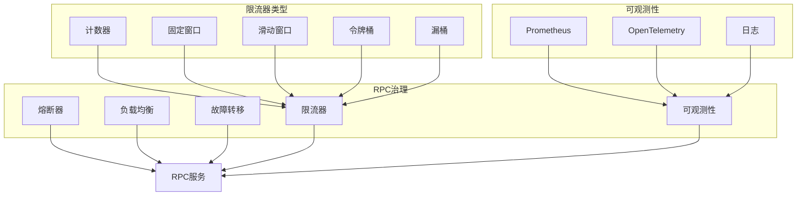

**图表来源**
- [rpc/grpcx/circuitbreaker/interceptor.go](file://rpc/grpcx/circuitbreaker/interceptor.go)
- [rpc/grpcx/balancer/wrr/wrr.go](file://rpc/grpcx/balancer/wrr/wrr.go)
- [rpc/grpcx/failover/failover.go](file://rpc/grpcx/failover/failover.go)
- [rpc/grpcx/limiter/slidingWindow/slidingWindow.go](file://rpc/grpcx/limiter/slidingWindow/slidingWindow.go)
- [observationX/prometheusX/prometheus.go](file://observationX/prometheusX/prometheus.go)
- [observationX/opentelemetryX/otel.go](file://observationX/opentelemetryX/otel.go)

**章节来源**
- [rpc/grpcx/circuitbreaker/interceptor.go](file://rpc/grpcx/circuitbreaker/interceptor.go)
- [rpc/grpcx/balancer/wrr/wrr.go](file://rpc/grpcx/balancer/wrr/wrr.go)
- [rpc/grpcx/failover/failover.go](file://rpc/grpcx/failover/failover.go)
- [rpc/grpcx/limiter/slidingWindow/slidingWindow.go](file://rpc/grpcx/limiter/slidingWindow/slidingWindow.go)
- [observationX/prometheusX/prometheus.go](file://observationX/prometheusX/prometheus.go)
- [observationX/opentelemetryX/otel.go](file://observationX/opentelemetryX/otel.go)

## 核心治理组件
RPC治理组件库提供了完整的微服务治理能力，包括熔断、负载均衡、故障转移、限流和可观测性等核心功能。这些组件通过gRPC拦截器模式集成，可以灵活组合使用。

**章节来源**
- [rpc/grpcx/circuitbreaker/interceptor.go](file://rpc/grpcx/circuitbreaker/interceptor.go)
- [rpc/grpcx/balancer/wrr/wrr.go](file://rpc/grpcx/balancer/wrr/wrr.go)
- [rpc/grpcx/failover/failover.go](file://rpc/grpcx/failover/failover.go)
- [rpc/grpcx/limiter/slidingWindow/slidingWindow.go](file://rpc/grpcx/limiter/slidingWindow/slidingWindow.go)
- [observationX/prometheusX/prometheus.go](file://observationX/prometheusX/prometheus.go)
- [observationX/opentelemetryX/otel.go](file://observationX/opentelemetryX/otel.go)

## 架构概述
RPC治理组件采用分层架构设计，各治理功能通过拦截器模式集成到gRPC服务中。这种设计实现了关注点分离，使各治理策略可以独立开发、测试和部署。

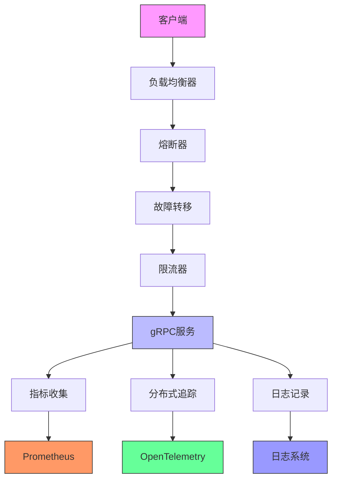

**图表来源**
- [rpc/grpcx/circuitbreaker/interceptor.go](file://rpc/grpcx/circuitbreaker/interceptor.go)
- [rpc/grpcx/balancer/wrr/wrr.go](file://rpc/grpcx/balancer/wrr/wrr.go)
- [rpc/grpcx/failover/failover.go](file://rpc/grpcx/failover/failover.go)
- [rpc/grpcx/limiter/slidingWindow/slidingWindow.go](file://rpc/grpcx/limiter/slidingWindow/slidingWindow.go)
- [observationX/prometheusX/prometheus.go](file://observationX/prometheusX/prometheus.go)
- [observationX/opentelemetryX/otel.go](file://observationX/opentelemetryX/otel.go)

## 详细组件分析

### 熔断器组件分析
熔断器组件通过拦截器模式实现，用于防止级联故障。当服务错误率达到阈值时，熔断器会打开，直接拒绝请求，避免对下游服务造成过大压力。

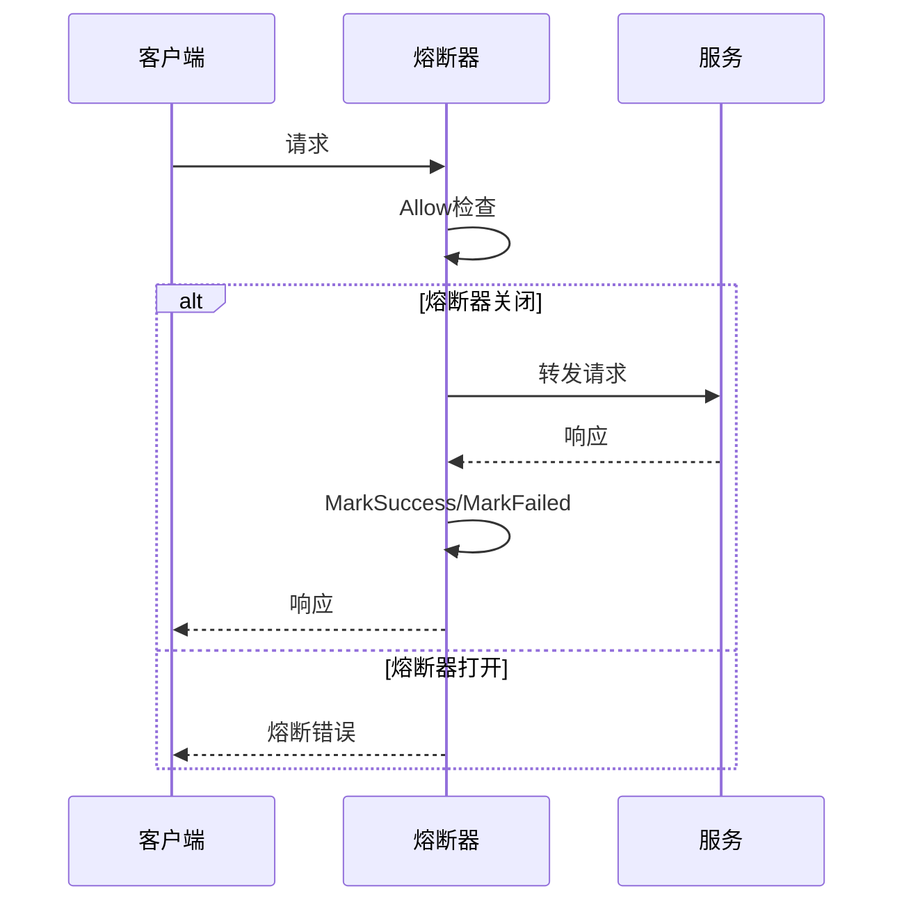

**图表来源**
- [rpc/grpcx/circuitbreaker/interceptor.go](file://rpc/grpcx/circuitbreaker/interceptor.go)

**章节来源**
- [rpc/grpcx/circuitbreaker/interceptor.go](file://rpc/grpcx/circuitbreaker/interceptor.go)

### 负载均衡组件分析
WRR（加权轮询）负载均衡器根据服务实例的权重分配请求，提升服务的整体可用性和性能。

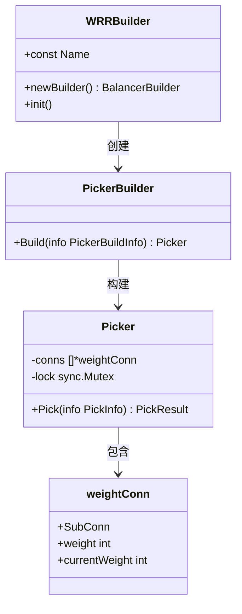

**图表来源**
- [rpc/grpcx/balancer/wrr/wrr.go](file://rpc/grpcx/balancer/wrr/wrr.go)

**章节来源**
- [rpc/grpcx/balancer/wrr/wrr.go](file://rpc/grpcx/balancer/wrr/wrr.go)

### 故障转移组件分析
故障转移机制通过gRPC的重试策略实现，当服务调用失败时自动重试其他实例，提高服务的可用性。

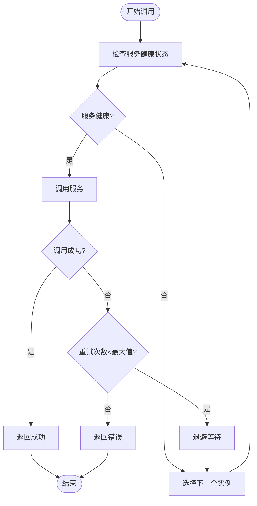

**图表来源**
- [rpc/grpcx/failover/failover.go](file://rpc/grpcx/failover/failover.go)

**章节来源**
- [rpc/grpcx/failover/failover.go](file://rpc/grpcx/failover/failover.go)

### 限流器组件分析
限流器组件提供了多种算法实现，用于控制服务的请求速率，防止系统过载。

#### 滑动窗口限流器
滑动窗口算法通过维护一个时间窗口内的请求记录，实现更精确的限流控制。

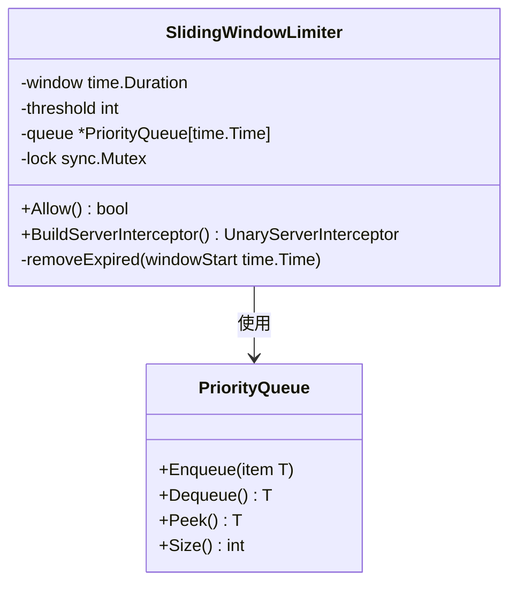

**图表来源**
- [rpc/grpcx/limiter/slidingWindow/slidingWindow.go](file://rpc/grpcx/limiter/slidingWindow/slidingWindow.go)

**章节来源**
- [rpc/grpcx/limiter/slidingWindow/slidingWindow.go](file://rpc/grpcx/limiter/slidingWindow/slidingWindow.go)

#### 其他限流算法
除了滑动窗口，还实现了多种限流算法：

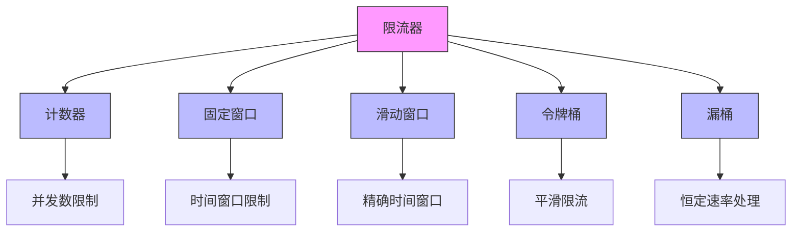

**图表来源**
- [rpc/grpcx/limiter/counterLiniter/counterLimiter.go](file://rpc/grpcx/limiter/counterLiniter/counterLimiter.go)
- [rpc/grpcx/limiter/fixedWindow/fixedWindow.go](file://rpc/grpcx/limiter/fixedWindow/fixedWindow.go)
- [rpc/grpcx/limiter/tokenBucket/tokenBocket.go](file://rpc/grpcx/limiter/tokenBucket/tokenBocket.go)
- [rpc/grpcx/limiter/leakyBucket/leakyBucket.go](file://rpc/grpcx/limiter/leakyBucket/leakyBucket.go)

**章节来源**
- [rpc/grpcx/limiter/counterLiniter/counterLimiter.go](file://rpc/grpcx/limiter/counterLiniter/counterLimiter.go)
- [rpc/grpcx/limiter/fixedWindow/fixedWindow.go](file://rpc/grpcx/limiter/fixedWindow/fixedWindow.go)
- [rpc/grpcx/limiter/tokenBucket/tokenBocket.go](file://rpc/grpcx/limiter/tokenBucket/tokenBocket.go)
- [rpc/grpcx/limiter/leakyBucket/leakyBucket.go](file://rpc/grpcx/limiter/leakyBucket/leakyBucket.go)

### 可观测性组件分析
可观测性组件为gRPC服务集成Prometheus指标和OpenTelemetry追踪，提供全面的监控能力。

#### Prometheus指标收集
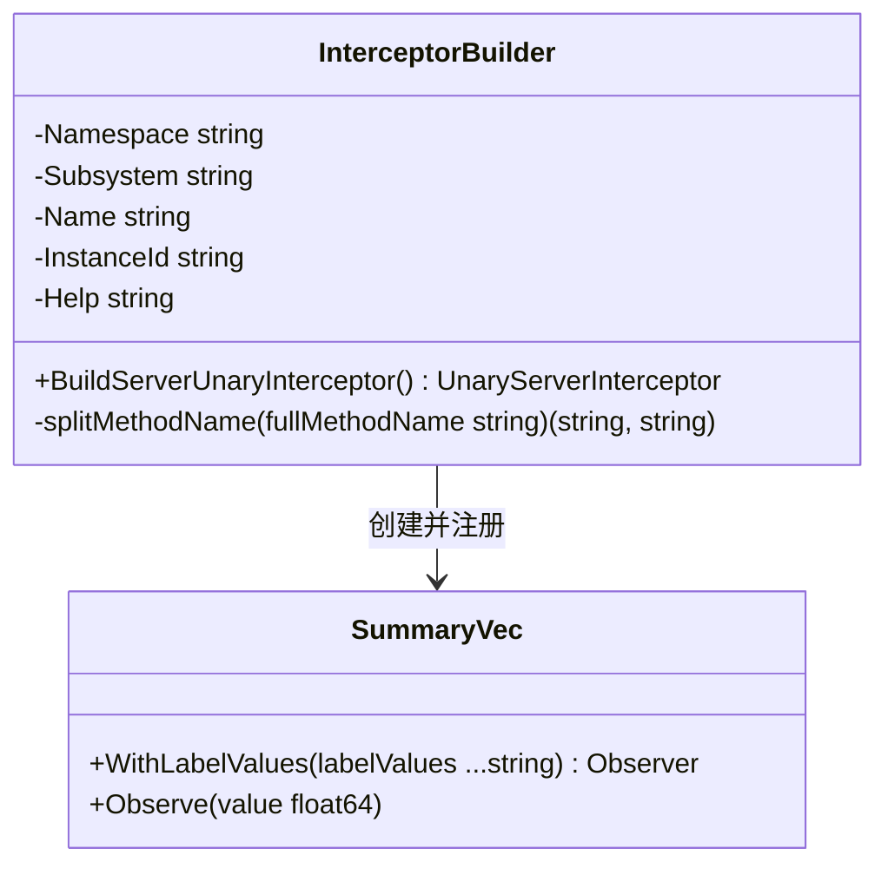

**图表来源**
- [rpc/grpcx/observationX/prometeusX/builder.go](file://rpc/grpcx/observationX/prometeusX/builder.go)

**章节来源**
- [rpc/grpcx/observationX/prometeusX/builder.go](file://rpc/grpcx/observationX/prometeusX/builder.go)

#### OpenTelemetry追踪
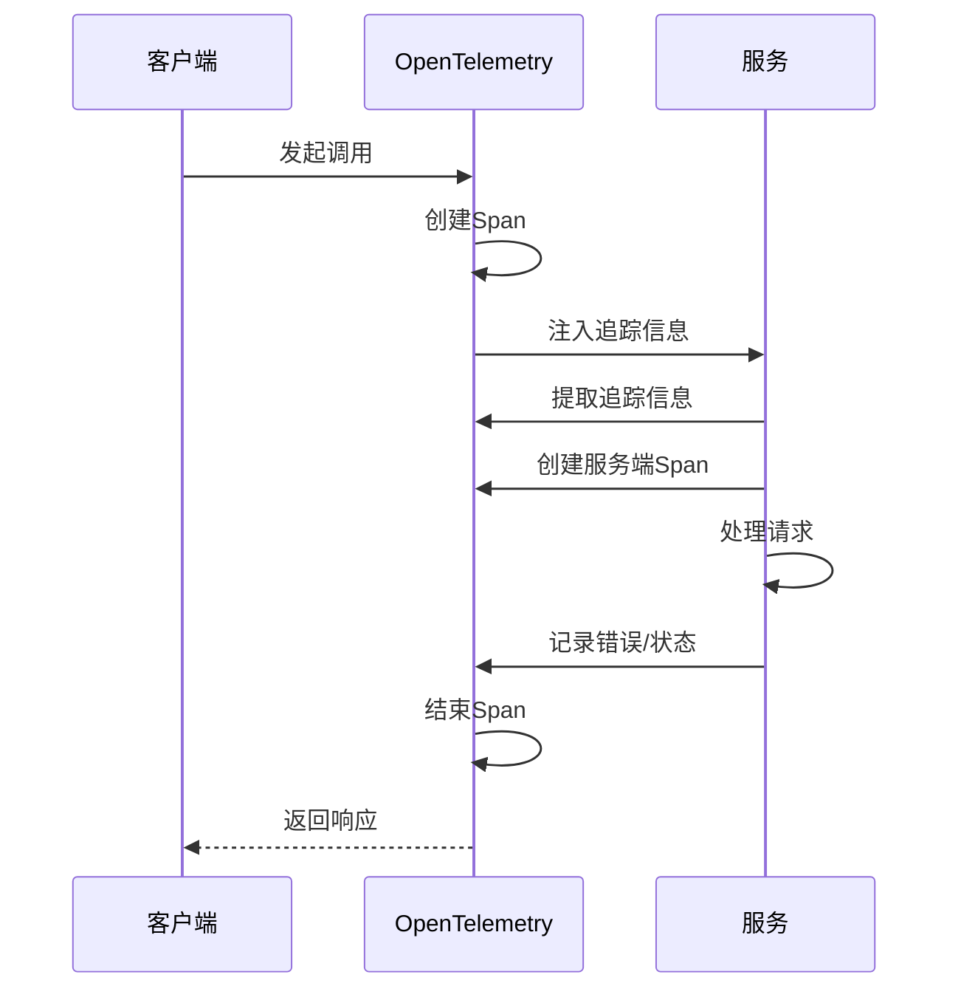

**图表来源**
- [rpc/grpcx/observationX/otleTraceX/otle.go](file://rpc/grpcx/observationX/otleTraceX/otle.go)

**章节来源**
- [rpc/grpcx/observationX/otleTraceX/otle.go](file://rpc/grpcx/observationX/otleTraceX/otle.go)

#### 日志记录
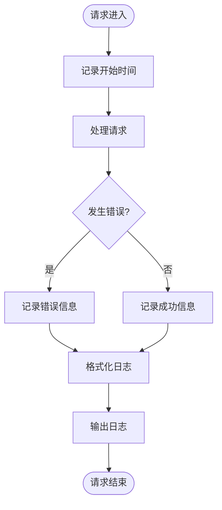

**图表来源**
- [rpc/grpcx/observationX/grpcLogX/grpcLogX.go](file://rpc/grpcx/observationX/grpcLogX/grpcLogX.go)

**章节来源**
- [rpc/grpcx/observationX/grpcLogX/grpcLogX.go](file://rpc/grpcx/observationX/grpcLogX/grpcLogX.go)

## 依赖分析
RPC治理组件库的依赖关系清晰，各组件之间耦合度低，便于独立使用和测试。

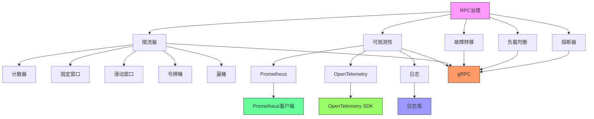

**图表来源**
- [go.mod](file://go.mod)
- [rpc/grpcx/circuitbreaker/interceptor.go](file://rpc/grpcx/circuitbreaker/interceptor.go)
- [rpc/grpcx/balancer/wrr/wrr.go](file://rpc/grpcx/balancer/wrr/wrr.go)
- [rpc/grpcx/failover/failover.go](file://rpc/grpcx/failover/failover.go)
- [rpc/grpcx/limiter/slidingWindow/slidingWindow.go](file://rpc/grpcx/limiter/slidingWindow/slidingWindow.go)
- [observationX/prometheusX/prometheus.go](file://observationX/prometheusX/prometheus.go)
- [observationX/opentelemetryX/otel.go](file://observationX/opentelemetryX/otel.go)

**章节来源**
- [go.mod](file://go.mod)
- [go.sum](file://go.sum)

## 性能考虑
RPC治理组件在设计时充分考虑了性能因素：

1. **熔断器**：使用轻量级的状态机，避免频繁的锁竞争
2. **负载均衡**：WRR算法计算复杂度低，适合高并发场景
3. **限流器**：
   - 计数器算法性能最优，适合简单场景
   - 滑动窗口使用最小堆，平衡精度和性能
   - 令牌桶和漏桶使用channel，实现平滑限流
4. **可观测性**：
   - 指标收集使用预注册的SummaryVec，避免运行时创建
   - 追踪信息传递使用轻量级的context注入
   - 日志记录采用延迟格式化，减少性能开销

## 故障排查指南
当RPC治理组件出现问题时，可按以下步骤排查：

1. **检查配置**：确认各组件的配置参数是否正确
2. **查看日志**：检查gRPC拦截器的日志输出
3. **监控指标**：查看Prometheus中的相关指标
4. **追踪链路**：通过OpenTelemetry查看完整的调用链路
5. **测试隔离**：单独测试有问题的组件

**章节来源**
- [rpc/grpcx/circuitbreaker/interceptor.go](file://rpc/grpcx/circuitbreaker/interceptor.go)
- [rpc/grpcx/balancer/wrr/wrr.go](file://rpc/grpcx/balancer/wrr/wrr.go)
- [rpc/grpcx/failover/failover.go](file://rpc/grpcx/failover/failover.go)
- [rpc/grpcx/limiter/slidingWindow/slidingWindow.go](file://rpc/grpcx/limiter/slidingWindow/slidingWindow.go)
- [observationX/prometheusX/prometheus.go](file://observationX/prometheusX/prometheus.go)
- [observationX/opentelemetryX/otel.go](file://observationX/opentelemetryX/otel.go)

## 结论
RPC治理组件库提供了一套完整的微服务治理解决方案，通过熔断、负载均衡、故障转移、限流和可观测性等机制，有效提升了gRPC服务的稳定性和可用性。各组件设计精巧，性能优异，且易于集成和使用，是构建健壮微服务系统的理想选择。