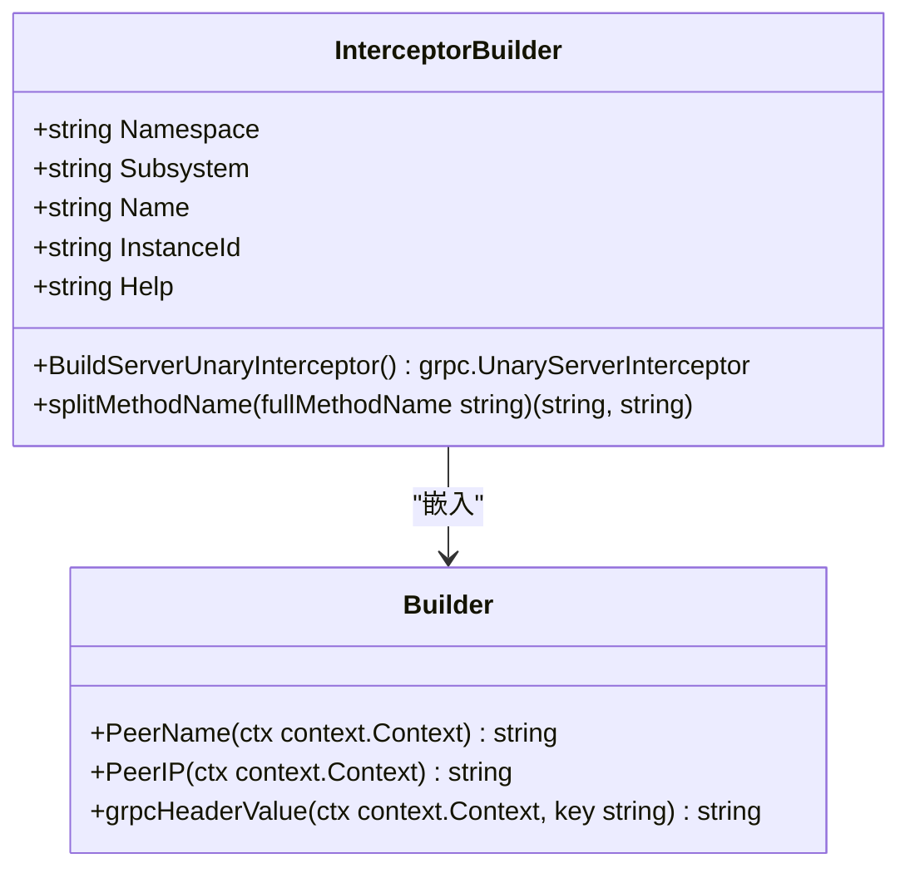
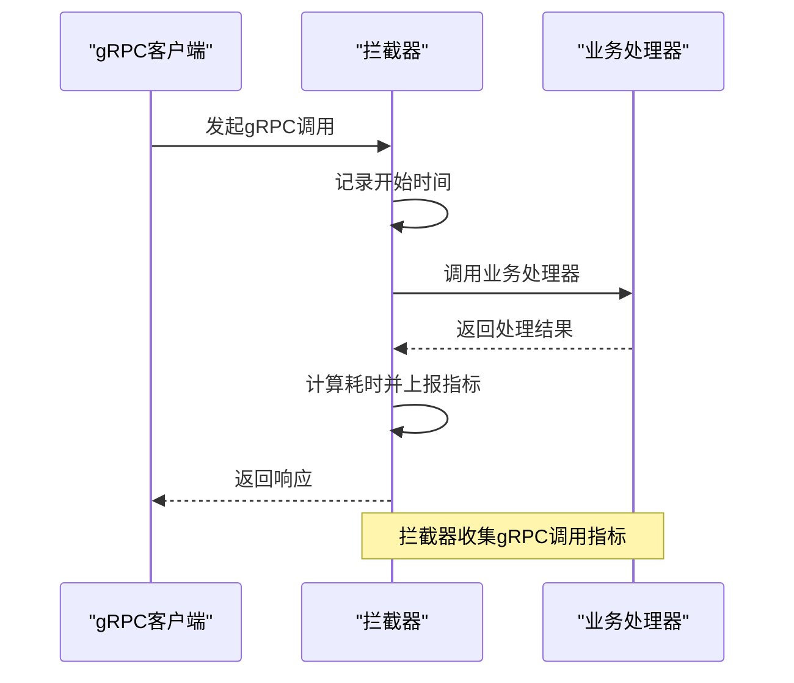
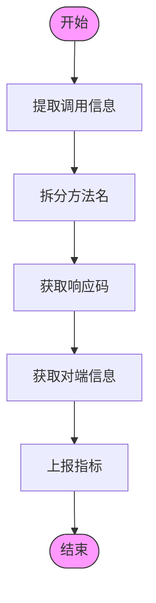
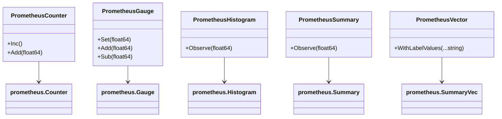

# gRPC指标监控

<cite>
**本文档引用的文件**   
- [builder.go](file://rpc/grpcx/observationX/prometeusX/builder.go)
- [builder.go](file://rpc/grpcx/observationX/builder.go)
- [prometheus.go](file://observationX/prometheusX/prometheus.go)
- [grpcLogX.go](file://rpc/grpcx/observationX/grpcLogX/grpcLogX.go)
- [otle.go](file://rpc/grpcx/observationX/otleTraceX/otle.go)
- [service.go](file://rpc/grpcx/etcdx/service.go)
</cite>

## 目录
1. [引言](#引言)
2. [核心组件分析](#核心组件分析)
3. [gRPC指标收集机制](#grpc指标收集机制)
4. [指标标签设计](#指标标签设计)
5. [指标注册与暴露](#指标注册与暴露)
6. [与Prometheus服务发现集成](#与prometheus服务发现集成)
7. [自定义指标收集逻辑](#自定义指标收集逻辑)
8. [Grafana监控面板配置建议](#grafana监控面板配置建议)
9. [结论](#结论)

## 引言
本文档深入解析`prometeusX/builder.go`和主`builder.go`文件如何协同工作，暴露gRPC服务的关键性能指标。详细描述如何通过拦截器收集并上报请求计数（如`grpc_server_handled_total`）、请求延迟（如`grpc_server_handling_seconds`）等Prometheus指标。说明指标的标签（labels）设计，如`service`、`method`、`code`等维度。提供指标注册、暴露端点（/metrics）配置、与Prometheus服务发现集成的方法。结合实际代码展示如何自定义指标收集逻辑，并给出Grafana监控面板的配置建议。

## 核心组件分析

`prometeusX/builder.go`文件中的`InterceptorBuilder`结构体是gRPC指标监控的核心组件，它通过实现`BuildServerUnaryInterceptor`方法来创建gRPC服务端拦截器。该拦截器利用Prometheus客户端库收集和上报指标。

`builder.go`文件中的`Builder`结构体提供了获取对端应用名称和IP地址的通用方法，这些信息被用作指标的标签。



**类图来源**
- [builder.go](file://rpc/grpcx/observationX/prometeusX/builder.go#L13-L20)
- [builder.go](file://rpc/grpcx/observationX/builder.go#L11-L12)

**本节来源**
- [builder.go](file://rpc/grpcx/observationX/prometeusX/builder.go#L1-L72)
- [builder.go](file://rpc/grpcx/observationX/builder.go#L1-L53)

## gRPC指标收集机制

gRPC指标收集通过拦截器模式实现。当客户端发起gRPC调用时，拦截器会在请求处理前后执行，从而收集相关指标。

在`prometeusX/builder.go`中，`BuildServerUnaryInterceptor`方法创建了一个闭包函数，该函数在每次gRPC调用时都会执行。它记录请求开始时间，在请求处理完成后计算耗时，并将结果上报给Prometheus。



**序列图来源**
- [builder.go](file://rpc/grpcx/observationX/prometeusX/builder.go#L27-L63)

**本节来源**
- [builder.go](file://rpc/grpcx/observationX/prometeusX/builder.go#L27-L63)

## 指标标签设计

指标标签设计是Prometheus监控的关键部分。在本系统中，gRPC指标使用了多个维度的标签来提供详细的监控信息。

`InterceptorBuilder`中的`BuildServerUnaryInterceptor`方法定义了五个标签：`type`、`service`、`method`、`peer`和`code`。这些标签分别表示调用类型、服务名称、方法名称、对端应用和响应码。



**流程图来源**
- [builder.go](file://rpc/grpcx/observationX/prometeusX/builder.go#L48-L62)

**本节来源**
- [builder.go](file://rpc/grpcx/observationX/prometeusX/builder.go#L29-L59)

## 指标注册与暴露

指标注册与暴露通过`prometheusX/prometheus.go`文件中的`InitPrometheus`函数实现。该函数设置了一个HTTP处理器来暴露`/metrics`端点，Prometheus服务器可以通过这个端点抓取指标数据。

```go
func InitPrometheus(addr string) {
    http.Handle("/metrics", promhttp.Handler())
    err := http.ListenAndServe(addr, nil)
    if err != nil {
        panic(err)
    }
}
```

这个函数通常在应用程序启动时调用，指定一个地址来监听HTTP请求。Prometheus服务器配置为定期访问这个地址的`/metrics`路径来收集指标。

```mermaid
graph TB
subgraph "监控系统"
Prometheus[(Prometheus服务器)]
end
subgraph "应用服务"
App[应用服务]
MetricsEndpoint[/metrics]
end
Prometheus --> |抓取| MetricsEndpoint
MetricsEndpoint --> App
style Prometheus fill:#e1f3fb,stroke:#333
style App fill:#e1f3fb,stroke:#333
```

**架构图来源**
- [prometheus.go](file://observationX/prometheusX/prometheus.go#L9-L14)

**本节来源**
- [prometheus.go](file://observationX/prometheusX/prometheus.go#L9-L14)

## 与Prometheus服务发现集成

与Prometheus服务发现集成需要在Prometheus配置文件中添加相应的job配置。虽然代码库中没有直接的配置示例，但根据标准实践，可以创建如下配置：

```yaml
scrape_configs:
  - job_name: 'grpc-services'
    static_configs:
      - targets: ['localhost:9090']
    metrics_path: /metrics
```

或者使用服务发现机制：

```yaml
scrape_configs:
  - job_name: 'grpc-services'
    dns_sd_configs:
      - names:
          - 'grpc-services.internal'
        type: 'A'
        port: 9090
    metrics_path: /metrics
```

在实际部署中，可以结合etcd等服务注册中心实现动态服务发现。

**本节来源**
- [prometheus.go](file://observationX/prometheusX/prometheus.go#L9-L14)

## 自定义指标收集逻辑

自定义指标收集逻辑可以通过扩展`InterceptorBuilder`结构体来实现。系统提供了多种指标类型，包括计数器、仪表、直方图和概要。

在`prometheusX/prometheus.go`文件中，展示了如何创建和使用不同类型的Prometheus指标：



**类图来源**
- [prometheus.go](file://observationX/prometheusX/prometheus.go#L17-L106)

**本节来源**
- [prometheus.go](file://observationX/prometheusX/prometheus.go#L17-L106)

## Grafana监控面板配置建议

基于收集的gRPC指标，可以创建Grafana监控面板来可视化服务性能。以下是一些建议的面板配置：

1. **总体概览面板**：
   - gRPC请求总数（按服务和方法分组）
   - 平均响应时间（按服务和方法分组）
   - 错误率（按响应码分组）

2. **性能分析面板**：
   - 响应时间分布（P50、P75、P90、P99）
   - 按对端应用的请求量分布
   - 高延迟请求分析

3. **错误监控面板**：
   - 按错误类型的请求分布
   - 错误请求的时间趋势
   - 高错误率的服务和方法

这些面板可以帮助运维人员快速发现和诊断gRPC服务中的性能问题。

**本节来源**
- [builder.go](file://rpc/grpcx/observationX/prometeusX/builder.go#L30-L46)
- [prometheus.go](file://observationX/prometheusX/prometheus.go#L64-L82)

## 结论
本文档详细解析了gRPC指标监控系统的实现机制。通过`prometeusX/builder.go`和主`builder.go`文件的协同工作，系统能够有效地收集和上报gRPC服务的关键性能指标。拦截器模式使得指标收集对业务代码透明，而丰富的标签设计提供了多维度的监控视角。结合Prometheus和Grafana，可以构建完整的监控解决方案，帮助运维人员及时发现和解决服务性能问题。