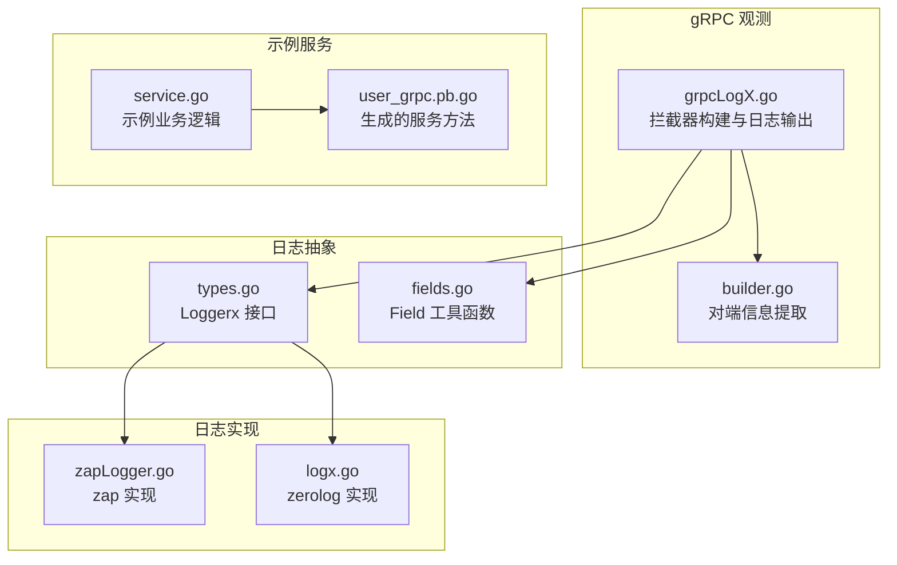
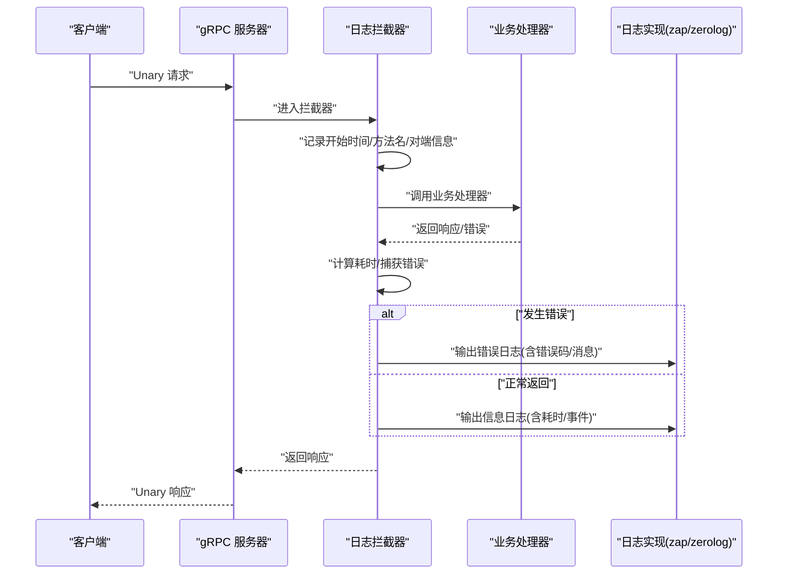
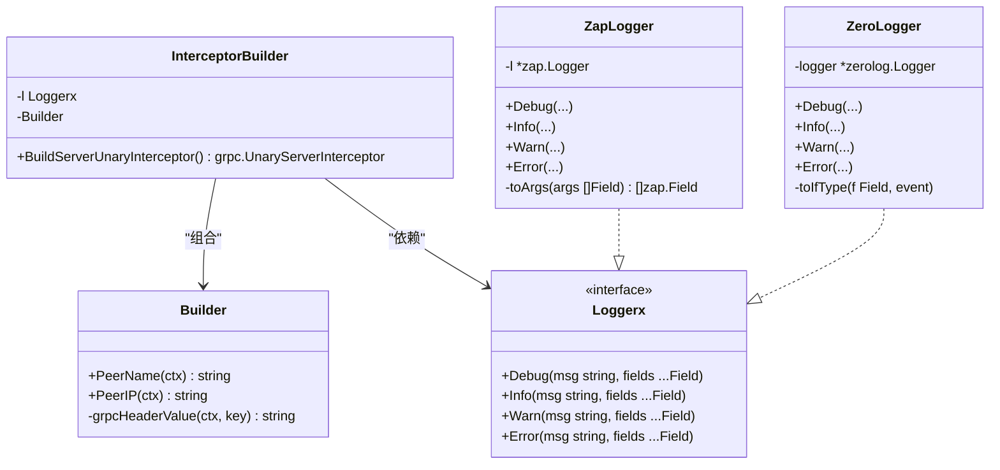
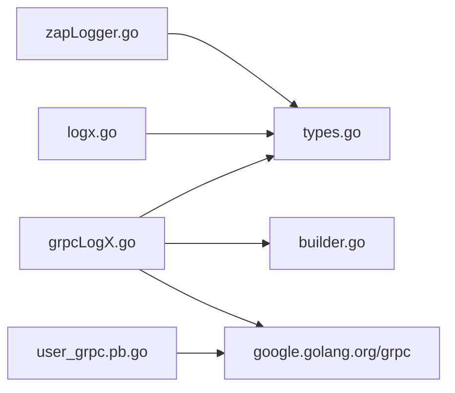

# gRPC日志集成

<cite>
**本文引用的文件**
- [grpcLogX.go](file://rpc/grpcx/observationX/grpcLogX/grpcLogX.go)
- [grpcLogX_test.go](file://rpc/grpcx/observationX/grpcLogX/grpcLogX_test.go)
- [builder.go](file://rpc/grpcx/observationX/builder.go)
- [types.go](file://logx/types.go)
- [fields.go](file://logx/fields.go)
- [zapLogger.go](file://logx/zaplogx/zapLogger.go)
- [logx.go](file://logx/zerologx/logx.go)
- [service.go](file://rpc/grpcx/limiter/slidingWindow/testPkg/service.go)
- [user_grpc.pb.go](file://rpc/grpcx/limiter/slidingWindow/testPkg/user_grpc.pb.go)
</cite>

## 目录
1. [简介](#简介)
2. [项目结构](#项目结构)
3. [核心组件](#核心组件)
4. [架构总览](#架构总览)
5. [组件详解](#组件详解)
6. [依赖关系分析](#依赖关系分析)
7. [性能考量](#性能考量)
8. [故障排查指南](#故障排查指南)
9. [结论](#结论)
10. [附录](#附录)

## 简介
本文件围绕 gRPC 日志拦截器的实现进行深入解析，重点说明如何通过拦截器在 gRPC 服务器端实现结构化日志记录。内容涵盖：
- 如何捕获请求方法名、请求/响应体、调用耗时、错误码等关键信息；
- 如何在 gRPC 服务器端链式注册日志拦截器；
- 日志字段定义与日志级别控制；
- 性能开销评估；
- 与 zap、zerolog 等日志框架的集成建议；
- 如何通过上下文传递请求 ID 实现全链路日志追踪。

## 项目结构
该功能位于 rpc/grpcx/observationX/grpcLogX 目录下，配合 observationX 的 Builder 提供对端信息提取能力，日志输出通过 logx 抽象接口对接不同日志框架。

图表来源
- [grpcLogX.go](file://rpc/grpcx/observationX/grpcLogX/grpcLogX.go#L1-L70)
- [builder.go](file://rpc/grpcx/observationX/builder.go#L1-L53)
- [types.go](file://logx/types.go#L1-L25)
- [fields.go](file://logx/fields.go#L1-L75)
- [zapLogger.go](file://logx/zaplogx/zapLogger.go#L1-L47)
- [logx.go](file://logx/zerologx/logx.go#L1-L144)
- [service.go](file://rpc/grpcx/limiter/slidingWindow/testPkg/service.go#L1-L44)
- [user_grpc.pb.go](file://rpc/grpcx/limiter/slidingWindow/testPkg/user_grpc.pb.go#L1-L166)

章节来源
- [grpcLogX.go](file://rpc/grpcx/observationX/grpcLogX/grpcLogX.go#L1-L70)
- [builder.go](file://rpc/grpcx/observationX/builder.go#L1-L53)
- [types.go](file://logx/types.go#L1-L25)
- [fields.go](file://logx/fields.go#L1-L75)
- [zapLogger.go](file://logx/zaplogx/zapLogger.go#L1-L47)
- [logx.go](file://logx/zerologx/logx.go#L1-L144)
- [service.go](file://rpc/grpcx/limiter/slidingWindow/testPkg/service.go#L1-L44)
- [user_grpc.pb.go](file://rpc/grpcx/limiter/slidingWindow/testPkg/user_grpc.pb.go#L1-L166)

## 核心组件
- 拦截器构建器 InterceptorBuilder：负责创建 gRPC 服务器端的 Unary 拦截器，统一采集请求方法名、对端信息、耗时、错误码等，并输出结构化日志。
- 对端信息提取 Builder：从上下文提取对端应用名与 IP，支持从 metadata 中读取自定义字段，必要时回退到 peer 地址。
- 日志抽象接口 Loggerx：统一日志接口，便于替换 zap、zerolog 等具体实现。
- 字段工具函数 Field：提供常用类型的结构化字段构造，便于在拦截器中组装日志字段。

章节来源
- [grpcLogX.go](file://rpc/grpcx/observationX/grpcLogX/grpcLogX.go#L1-L70)
- [builder.go](file://rpc/grpcx/observationX/builder.go#L1-L53)
- [types.go](file://logx/types.go#L1-L25)
- [fields.go](file://logx/fields.go#L1-L75)

## 架构总览
拦截器在 gRPC 服务器端以链式方式注册，对每个 Unary 请求进行统一处理：记录开始时间、执行业务处理器、计算耗时、捕获错误并输出结构化日志；同时从上下文中提取对端信息与元数据，确保日志具备足够的可观测性。

图表来源
- [grpcLogX.go](file://rpc/grpcx/observationX/grpcLogX/grpcLogX.go#L24-L68)
- [builder.go](file://rpc/grpcx/observationX/builder.go#L14-L52)
- [zapLogger.go](file://logx/zaplogx/zapLogger.go#L23-L46)
- [logx.go](file://logx/zerologx/logx.go#L47-L61)

## 组件详解

### 拦截器实现与日志输出
- 关键点
  - 记录请求方法名：使用 info.FullMethod 获取完整方法名。
  - 记录对端信息：通过 Builder.PeerName(ctx) 与 Builder.PeerIP(ctx) 获取应用名与 IP。
  - 记录耗时：使用 time.Now() 记录开始时间，defer 中计算耗时。
  - 记录事件：默认 event="normal"，当发生 panic 时改为 event="recover"，并收集堆栈。
  - 错误码与消息：从错误中提取 gRPC 状态码与消息，输出到错误日志。
  - 日志级别：根据是否存在错误选择 Info 或 Error 输出。
  - 结构化字段：通过 logx.Field 构造字符串、整型、时长等字段，最终由具体日志实现渲染。

- 代码片段路径
  - [拦截器入口与字段组装](file://rpc/grpcx/observationX/grpcLogX/grpcLogX.go#L24-L68)
  - [对端信息提取](file://rpc/grpcx/observationX/builder.go#L14-L52)
  - [日志接口定义](file://logx/types.go#L1-L25)
  - [字段工具函数](file://logx/fields.go#L1-L75)

- 日志字段定义
  - type：请求类型，固定为 "unary"。
  - cost：调用耗时（毫秒）。
  - event：事件类型，"normal" 或 "recover"。
  - method：gRPC 方法名（如 "/UserService/GetById"）。
  - peer：对端应用名（来自 metadata 中 app 字段）。
  - peer_ip：对端 IP（优先取 metadata 中 client-ip，否则从 peer 地址解析）。
  - code：gRPC 状态码字符串。
  - code_msg：状态消息。

- 日志级别控制
  - 无错误：输出 Info 级别。
  - 有错误：输出 Error 级别。
  - panic：输出 Recover 事件并记录堆栈，错误码为 Internal。

- 全链路追踪
  - 可通过在客户端/上游服务设置 metadata，例如 app 与 client-ip，拦截器会自动读取并在日志中体现。
  - 若需更细粒度的请求 ID，可在业务层将 trace-id 写入 metadata，并在拦截器中读取后加入日志字段。

- 与日志框架集成
  - zap：通过 NewZapLogger 将 zap.Logger 包装为 logx.Loggerx，拦截器按接口输出字段。
  - zerolog：通过 NewZeroLogger 将 zerolog.Logger 包装为 logx.Loggerx，拦截器按接口输出字段。
  - 两者均通过 toArgs/类型分派函数将 logx.Field 转换为对应框架的字段类型。

- 服务器端链式注册
  - 在创建 grpc.Server 时，使用 grpc.ChainUnaryInterceptor 注册拦截器。
  - 示例参考：[链式注册拦截器](file://rpc/grpcx/observationX/grpcLogX/grpcLogX_test.go#L21-L36)

- 业务方法与 FullMethod
  - 生成的服务方法包含 FullMethod 常量，拦截器使用 info.FullMethod 作为 method 字段。
  - 示例参考：[FullMethod 常量](file://rpc/grpcx/limiter/slidingWindow/testPkg/user_grpc.pb.go#L23-L26)

章节来源
- [grpcLogX.go](file://rpc/grpcx/observationX/grpcLogX/grpcLogX.go#L1-L70)
- [builder.go](file://rpc/grpcx/observationX/builder.go#L1-L53)
- [types.go](file://logx/types.go#L1-L25)
- [fields.go](file://logx/fields.go#L1-L75)
- [zapLogger.go](file://logx/zaplogx/zapLogger.go#L1-L47)
- [logx.go](file://logx/zerologx/logx.go#L1-L144)
- [grpcLogX_test.go](file://rpc/grpcx/observationX/grpcLogX/grpcLogX_test.go#L21-L36)
- [user_grpc.pb.go](file://rpc/grpcx/limiter/slidingWindow/testPkg/user_grpc.pb.go#L23-L26)

### 类图（代码级）

图表来源
- [grpcLogX.go](file://rpc/grpcx/observationX/grpcLogX/grpcLogX.go#L1-L70)
- [builder.go](file://rpc/grpcx/observationX/builder.go#L1-L53)
- [types.go](file://logx/types.go#L1-L25)
- [zapLogger.go](file://logx/zaplogx/zapLogger.go#L1-L47)
- [logx.go](file://logx/zerologx/logx.go#L1-L144)

## 依赖关系分析
- 拦截器依赖
  - logx.Loggerx：用于输出结构化日志。
  - observationX.Builder：用于从上下文提取对端信息。
  - grpc：用于获取 FullMethod、状态码与错误。
- 日志实现
  - zapLogger.go：将 zap.Logger 包装为 Loggerx。
  - logx.go：将 zerolog.Logger 包装为 Loggerx。
- 业务方法
  - user_grpc.pb.go：生成的 gRPC 服务方法，拦截器通过 info.FullMethod 获取方法名。

图表来源
- [grpcLogX.go](file://rpc/grpcx/observationX/grpcLogX/grpcLogX.go#L1-L70)
- [builder.go](file://rpc/grpcx/observationX/builder.go#L1-L53)
- [types.go](file://logx/types.go#L1-L25)
- [zapLogger.go](file://logx/zaplogx/zapLogger.go#L1-L47)
- [logx.go](file://logx/zerologx/logx.go#L1-L144)
- [user_grpc.pb.go](file://rpc/grpcx/limiter/slidingWindow/testPkg/user_grpc.pb.go#L1-L166)

章节来源
- [grpcLogX.go](file://rpc/grpcx/observationX/grpcLogX/grpcLogX.go#L1-L70)
- [builder.go](file://rpc/grpcx/observationX/builder.go#L1-L53)
- [types.go](file://logx/types.go#L1-L25)
- [zapLogger.go](file://logx/zaplogx/zapLogger.go#L1-L47)
- [logx.go](file://logx/zerologx/logx.go#L1-L144)
- [user_grpc.pb.go](file://rpc/grpcx/limiter/slidingWindow/testPkg/user_grpc.pb.go#L1-L166)

## 性能考量
- 时间开销
  - 每次请求都会记录开始时间、计算耗时、构造字段并输出日志，属于常数级开销。
  - defer 中的耗时计算与错误处理不会显著增加业务处理时间。
- 内存与 GC
  - 字段切片在 defer 中一次性构造，避免在热路径上频繁分配。
  - zap/zerolog 的字段转换在具体实现中进行，注意避免过多反射类型导致的额外开销。
- 日志级别
  - 正常请求输出 Info，错误输出 Error，建议在生产环境适当提高日志级别以降低 IO 压力。
- 建议
  - 对于高吞吐场景，可考虑采样策略或仅在异常路径输出详细日志。
  - 合理设置日志格式（JSON/文本），减少序列化成本。

[本节为通用性能讨论，无需列出具体文件来源]

## 故障排查指南
- 无法获取对端 IP
  - 检查客户端是否通过 metadata 设置 client-ip；若未设置，将回退到 peer 地址解析。
  - 参考：[对端 IP 解析逻辑](file://rpc/grpcx/observationX/builder.go#L19-L41)
- 未输出日志
  - 确认已通过 grpc.ChainUnaryInterceptor 注册拦截器。
  - 参考：[链式注册示例](file://rpc/grpcx/observationX/grpcLogX/grpcLogX_test.go#L21-L36)
- panic 导致服务崩溃
  - 拦截器会捕获 panic 并输出错误日志，同时将错误码设为 Internal。
  - 参考：[panic 捕获与堆栈输出](file://rpc/grpcx/observationX/grpcLogX/grpcLogX.go#L24-L68)
- 日志字段缺失
  - 确认日志实现正确实现了 toArgs/toIfType，并且字段 Key 不为空。
  - 参考：[zap 字段转换](file://logx/zaplogx/zapLogger.go#L40-L46)，[zerolog 类型分派](file://logx/zerologx/logx.go#L63-L126)

章节来源
- [builder.go](file://rpc/grpcx/observationX/builder.go#L19-L41)
- [grpcLogX_test.go](file://rpc/grpcx/observationX/grpcLogX/grpcLogX_test.go#L21-L36)
- [grpcLogX.go](file://rpc/grpcx/observationX/grpcLogX/grpcLogX.go#L24-L68)
- [zapLogger.go](file://logx/zaplogx/zapLogger.go#L40-L46)
- [logx.go](file://logx/zerologx/logx.go#L63-L126)

## 结论
该拦截器通过统一的结构化日志输出，覆盖了 gRPC 服务器端的关键观测维度：方法名、对端信息、耗时、错误码与事件类型。借助 logx 抽象接口，可无缝对接 zap 与 zerolog 等多种日志实现。结合链式注册与 metadata 透传，可快速落地全链路日志追踪与问题定位。

[本节为总结性内容，无需列出具体文件来源]

## 附录

### 日志字段定义与含义
- type：请求类型，固定为 "unary"。
- cost：调用耗时（毫秒）。
- event：事件类型，"normal" 或 "recover"。
- method：gRPC 方法名（如 "/UserService/GetById"）。
- peer：对端应用名（来自 metadata 中 app 字段）。
- peer_ip：对端 IP（优先取 metadata 中 client-ip，否则从 peer 地址解析）。
- code：gRPC 状态码字符串。
- code_msg：状态消息。

章节来源
- [grpcLogX.go](file://rpc/grpcx/observationX/grpcLogX/grpcLogX.go#L46-L64)
- [builder.go](file://rpc/grpcx/observationX/builder.go#L14-L41)

### 服务器端链式注册示例
- 在创建 grpc.Server 时，使用 grpc.ChainUnaryInterceptor 注册拦截器。
- 示例参考：[链式注册拦截器](file://rpc/grpcx/observationX/grpcLogX/grpcLogX_test.go#L21-L36)

章节来源
- [grpcLogX_test.go](file://rpc/grpcx/observationX/grpcLogX/grpcLogX_test.go#L21-L36)

### 与 zap/zerolog 的集成建议
- zap
  - 使用 NewZapLogger 将 zap.Logger 包装为 logx.Loggerx。
  - 参考：[zap 实现](file://logx/zaplogx/zapLogger.go#L1-L47)
- zerolog
  - 使用 NewZeroLogger 将 zerolog.Logger 包装为 logx.Loggerx。
  - 参考：[zerolog 实现](file://logx/zerologx/logx.go#L1-L61)

章节来源
- [zapLogger.go](file://logx/zaplogx/zapLogger.go#L1-L47)
- [logx.go](file://logx/zerologx/logx.go#L1-L61)

### 全链路日志追踪（请求 ID）
- 建议在客户端/上游服务将 trace-id 写入 metadata（例如 key 为 "trace-id"），在拦截器中读取并加入日志字段，实现跨服务关联。
- 对端信息提取可参考对端应用名与 IP 的实现思路，扩展读取 trace-id。
- 参考：[metadata 读取](file://rpc/grpcx/observationX/builder.go#L43-L52)

章节来源
- [builder.go](file://rpc/grpcx/observationX/builder.go#L43-L52)