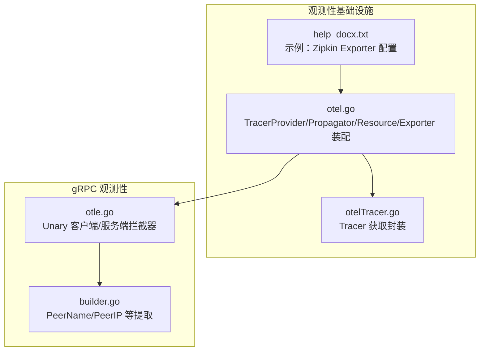
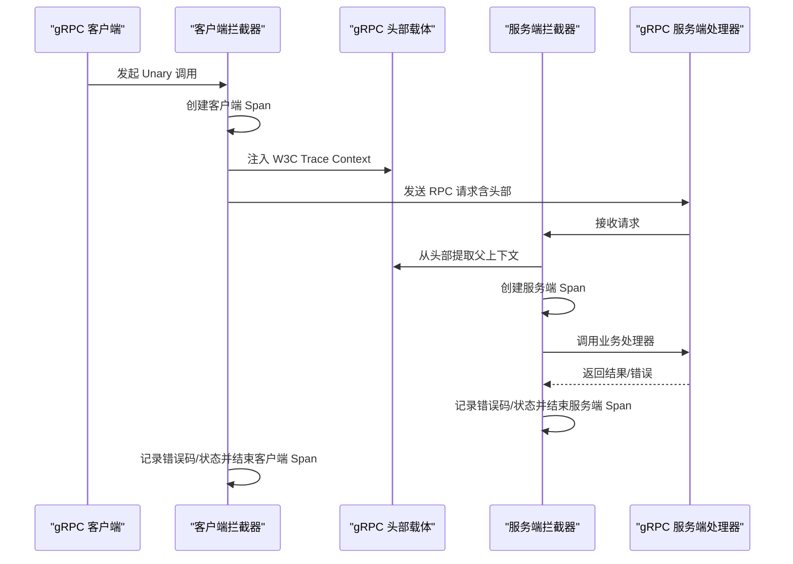
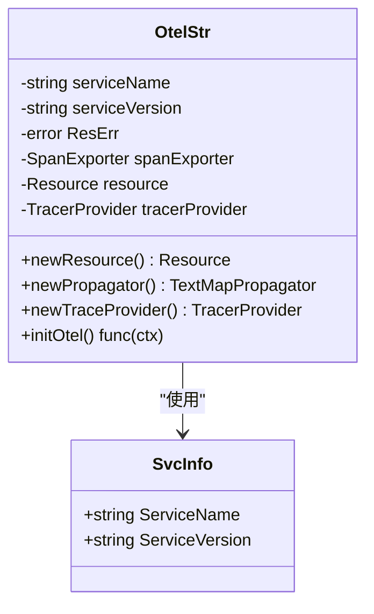
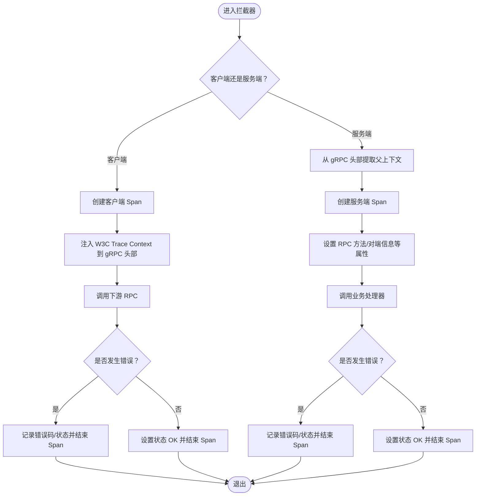
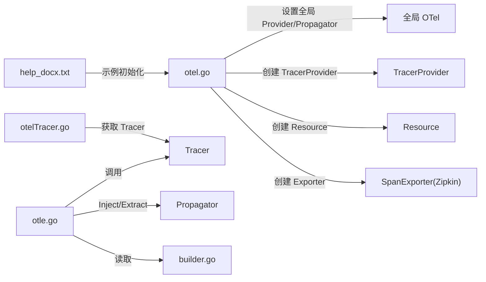

# 分布式追踪

<cite>
**本文引用的文件**
- [otel.go](file://observationX/opentelemetryX/otel.go)
- [otelTracer.go](file://observationX/opentelemetryX/otelTracer.go)
- [help_docx.txt](file://observationX/opentelemetryX/help_docx.txt)
- [builder.go](file://rpc/grpcx/observationX/builder.go)
- [otle.go](file://rpc/grpcx/observationX/otleTraceX/otle.go)
</cite>

## 目录
1. [简介](#简介)
2. [项目结构](#项目结构)
3. [核心组件](#核心组件)
4. [架构总览](#架构总览)
5. [详细组件分析](#详细组件分析)
6. [依赖关系分析](#依赖关系分析)
7. [性能考量](#性能考量)
8. [故障排查指南](#故障排查指南)
9. [结论](#结论)
10. [附录](#附录)

## 简介
本文件围绕仓库中的 OpenTelemetry 分布式追踪实现进行系统化说明，重点聚焦于：
- 基于 W3C Trace Context 的 gRPC 请求头注入与提取，确保跨服务调用链路连续性；
- 拦截器如何创建 Span、记录 RPC 方法调用、处理父 Span 上下文传递；
- 结合 observationX 示例，说明 Tracer Provider、Exporter（Zipkin）及采样策略的配置思路；
- 提供链路数据查看方法、性能影响分析与复杂调用链定位瓶颈的实践建议。

## 项目结构
与 OpenTelemetry 分布式追踪相关的核心模块分布如下：
- 观测性基础设施（opentelemetryX）
  - otel.go：全局 Tracer Provider、Propagator、Resource 与 Exporter 的装配入口
  - otelTracer.go：Tracer 获取封装
  - help_docx.txt：示例化配置说明（Zipkin Exporter）
- gRPC 观测性（grpcx/observationX/otleTraceX）
  - otle.go：gRPC Unary 客户端/服务端拦截器，负责 Span 生命周期与 W3C Trace Context 头部注入/提取
  - builder.go：从 gRPC 上下文提取对端信息（应用名、IP）等辅助能力

图表来源
- [otel.go](file://observationX/opentelemetryX/otel.go#L33-L100)
- [otelTracer.go](file://observationX/opentelemetryX/otelTracer.go#L1-L18)
- [help_docx.txt](file://observationX/opentelemetryX/help_docx.txt#L1-L40)
- [otle.go](file://rpc/grpcx/observationX/otleTraceX/otle.go#L1-L155)
- [builder.go](file://rpc/grpcx/observationX/builder.go#L1-L53)

章节来源
- [otel.go](file://observationX/opentelemetryX/otel.go#L33-L100)
- [otelTracer.go](file://observationX/opentelemetryX/otelTracer.go#L1-L18)
- [help_docx.txt](file://observationX/opentelemetryX/help_docx.txt#L1-L40)
- [otle.go](file://rpc/grpcx/observationX/otleTraceX/otle.go#L1-L155)
- [builder.go](file://rpc/grpcx/observationX/builder.go#L1-L53)

## 核心组件
- 全局装配器（otel.go）
  - 负责创建 Resource、设置 Propagator（W3C Trace Context + Baggage）、构造 TracerProvider 并注册为全局 Provider；支持通过传入的 SpanExporter 输出到外部系统（示例为 Zipkin）
- Tracer 获取封装（otelTracer.go）
  - 提供统一的 Tracer 获取接口，便于业务层注入与使用
- gRPC 拦截器（otle.go）
  - 客户端拦截器：在发起 RPC 前创建客户端 Span，注入 W3C Trace Context 到 gRPC 头部；在返回后根据错误码设置 Span 状态
  - 服务端拦截器：从 gRPC 头部提取父 Span 上下文，创建服务端 Span，记录 RPC 方法、对端信息、状态
- 对端信息提取（builder.go）
  - 从 gRPC metadata 中提取对端应用名与 IP，用于 Span 属性标注

章节来源
- [otel.go](file://observationX/opentelemetryX/otel.go#L33-L100)
- [otelTracer.go](file://observationX/opentelemetryX/otelTracer.go#L1-L18)
- [otle.go](file://rpc/grpcx/observationX/otleTraceX/otle.go#L32-L111)
- [builder.go](file://rpc/grpcx/observationX/builder.go#L14-L41)

## 架构总览
下图展示了从 gRPC 客户端到服务端的完整链路，包括 Span 创建、上下文传播与错误状态设置。

图表来源
- [otle.go](file://rpc/grpcx/observationX/otleTraceX/otle.go#L32-L111)
- [builder.go](file://rpc/grpcx/observationX/builder.go#L14-L41)

## 详细组件分析

### 组件A：全局 Tracer Provider 与 Propagator 装配（otel.go）
- 职责
  - 构建 Resource（包含服务名、版本等语义属性）
  - 设置 TextMap Propagator（W3C Trace Context + Baggage），用于在 gRPC 头部中传递 Trace 上下文
  - 构造 TracerProvider（可选批量导出器与批处理超时），并注册为全局 Provider
  - 提供关闭回调，用于优雅停机时关闭 TracerProvider
- 关键点
  - Propagator 采用复合传播器，确保 Trace Context 与 Baggage 同时传播
  - TracerProvider 支持通过传入的 SpanExporter 输出到外部系统（示例为 Zipkin）

图表来源
- [otel.go](file://observationX/opentelemetryX/otel.go#L15-L100)

章节来源
- [otel.go](file://observationX/opentelemetryX/otel.go#L33-L100)

### 组件B：Tracer 获取封装（otelTracer.go）
- 职责
  - 提供统一的 Tracer 获取入口，便于业务层通过依赖注入获得 Tracer 实例
- 使用场景
  - 在业务代码中创建自定义 Span，记录事件与属性

章节来源
- [otelTracer.go](file://observationX/opentelemetryX/otelTracer.go#L1-L18)

### 组件C：gRPC 拦截器（otle.go）
- 职责
  - 客户端拦截器：创建客户端 Span，注入 W3C Trace Context 到 gRPC 头部，记录 RPC 方法、对端服务名、状态与错误码
  - 服务端拦截器：从 gRPC 头部提取父上下文，创建服务端 Span，记录 RPC 方法、对端信息、状态与错误码
  - 通过 GrpcHeaderCarrier 实现 Propagator 与 gRPC metadata 的桥接
- 关键流程
  - 注入/提取：使用 Propagator 的 Inject/Extract，载体为 gRPC 头部（metadata.MD）
  - Span 属性：RPC 系统、方法、组件类型、对端应用名与 IP 等
  - 错误处理：捕获错误，记录错误事件与状态码，设置 Span 状态为 Error 或 Ok

图表来源
- [otle.go](file://rpc/grpcx/observationX/otleTraceX/otle.go#L32-L111)

章节来源
- [otle.go](file://rpc/grpcx/observationX/otleTraceX/otle.go#L1-L155)

### 组件D：对端信息提取（builder.go）
- 职责
  - 从 gRPC metadata 中提取对端应用名（键 app）与客户端 IP（优先使用键 client-ip，否则从 peer 信息解析）
- 作用
  - 服务端拦截器在创建服务端 Span 时，将这些信息写入 Span 属性，便于链路可视化与定位

章节来源
- [builder.go](file://rpc/grpcx/observationX/builder.go#L14-L41)

## 依赖关系分析
- 组件耦合
  - otle.go 依赖 observationX.Builder 提供对端信息提取
  - otel.go 作为全局装配入口，被业务侧通过 help_docx.txt 的示例方式初始化
  - otelTracer.go 为业务侧提供 Tracer 获取封装
- 传播链路
  - Propagator（Trace Context + Baggage）贯穿客户端与服务端，确保跨进程上下文连续
- 导出链路
  - 通过传入的 SpanExporter 将 Span 数据输出到外部系统（示例为 Zipkin）

图表来源
- [otel.go](file://observationX/opentelemetryX/otel.go#L33-L100)
- [otelTracer.go](file://observationX/opentelemetryX/otelTracer.go#L1-L18)
- [otle.go](file://rpc/grpcx/observationX/otleTraceX/otle.go#L1-L155)
- [builder.go](file://rpc/grpcx/observationX/builder.go#L1-L53)
- [help_docx.txt](file://observationX/opentelemetryX/help_docx.txt#L1-L40)

章节来源
- [otel.go](file://observationX/opentelemetryX/otel.go#L33-L100)
- [otelTracer.go](file://observationX/opentelemetryX/otelTracer.go#L1-L18)
- [otle.go](file://rpc/grpcx/observationX/otleTraceX/otle.go#L1-L155)
- [builder.go](file://rpc/grpcx/observationX/builder.go#L1-L53)
- [help_docx.txt](file://observationX/opentelemetryX/help_docx.txt#L1-L40)

## 性能考量
- 批量导出与批处理超时
  - TracerProvider 默认批处理间隔较长，可通过 WithBatchTimeout 调整（示例中设置为较短的秒级，便于演示）
- 导出器选择
  - Zipkin 导出器适合快速验证链路；生产环境可考虑 OTLP Exporter 以对接 Jaeger、Grafana、OTel Collector 等生态
- 拦截器开销
  - 客户端/服务端拦截器仅在 RPC 调用路径上增加少量上下文传播与 Span 生命周期管理开销
- 资源与生命周期
  - 建议在应用启动时完成全局装配并在退出时优雅关闭 TracerProvider，避免资源泄漏

章节来源
- [otel.go](file://observationX/opentelemetryX/otel.go#L86-L100)

## 故障排查指南
- 链路断点
  - 若服务端无法识别父 Span，检查客户端是否正确注入 W3C Trace Context，以及服务端是否正确提取
  - 确认 Propagator 已设置为包含 Trace Context 的复合传播器
- 错误状态不正确
  - 检查拦截器是否在错误分支记录了错误码与状态，并确保错误类型转换（如 gRPC 错误）被正确映射
- 对端信息缺失
  - 确认客户端在 gRPC 头部设置了 client-ip 与 app 等关键键值，以便服务端拦截器正确提取
- 导出失败
  - 检查 Exporter 地址与网络连通性；确认 TracerProvider 已正确注册为全局 Provider

章节来源
- [otle.go](file://rpc/grpcx/observationX/otleTraceX/otle.go#L32-L111)
- [builder.go](file://rpc/grpcx/observationX/builder.go#L14-L41)
- [otel.go](file://observationX/opentelemetryX/otel.go#L81-L100)

## 结论
该实现通过全局装配器统一管理 Tracer Provider、Propagator 与 Resource，并在 gRPC 拦截器中完成 Span 的创建、上下文传播与错误状态记录。借助 W3C Trace Context，跨服务调用链路得以连续；通过示例化的 Exporter（Zipkin）与帮助文档，可快速落地到实际业务中。建议在生产环境中结合 OTLP Exporter 与更细粒度的采样策略，以平衡可观测性与性能。

## 附录

### 配置与使用要点（基于示例）
- 全局初始化
  - 在 IoC 层创建 SpanExporter（示例为 Zipkin），并通过 NewOtelStr 完成 Resource、Propagator、TracerProvider 的装配与全局注册
  - 在 main 中 defer 调用返回的关闭函数，确保优雅停机
- 业务中使用
  - 通过 NewOtelTracerStr 获取 Tracer，注入到业务结构体中，按需创建自定义 Span
- gRPC 拦截器接入
  - 客户端/服务端分别使用拦截器，自动完成上下文注入/提取与 Span 生命周期管理

章节来源
- [help_docx.txt](file://observationX/opentelemetryX/help_docx.txt#L1-L40)
- [otel.go](file://observationX/opentelemetryX/otel.go#L33-L100)
- [otelTracer.go](file://observationX/opentelemetryX/otelTracer.go#L1-L18)