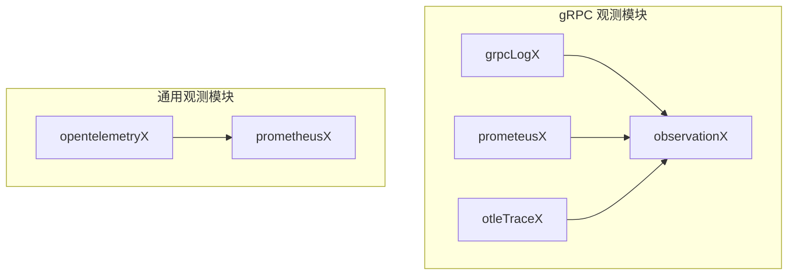
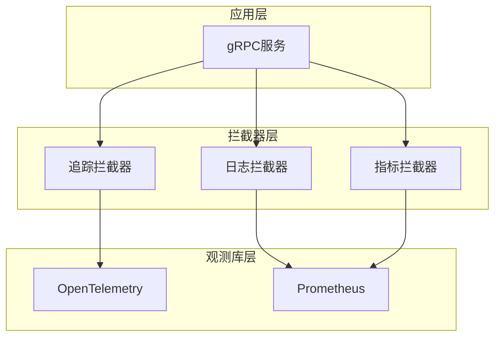
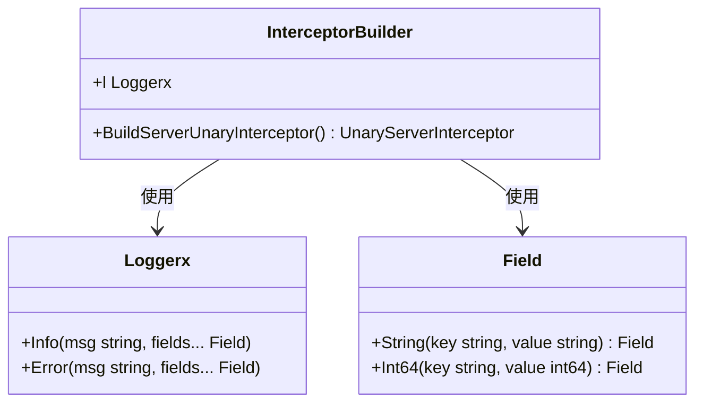
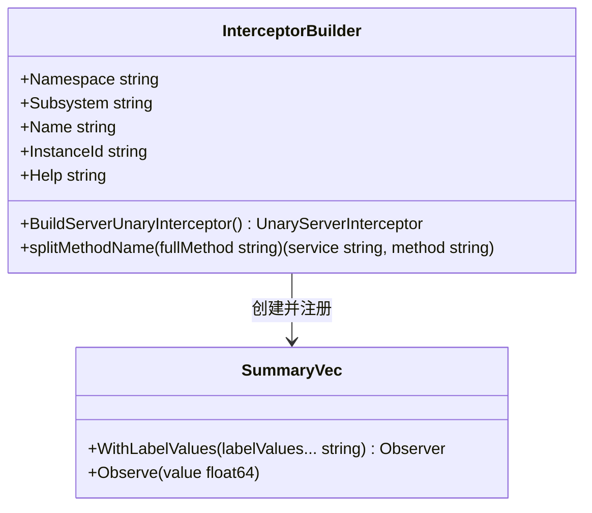
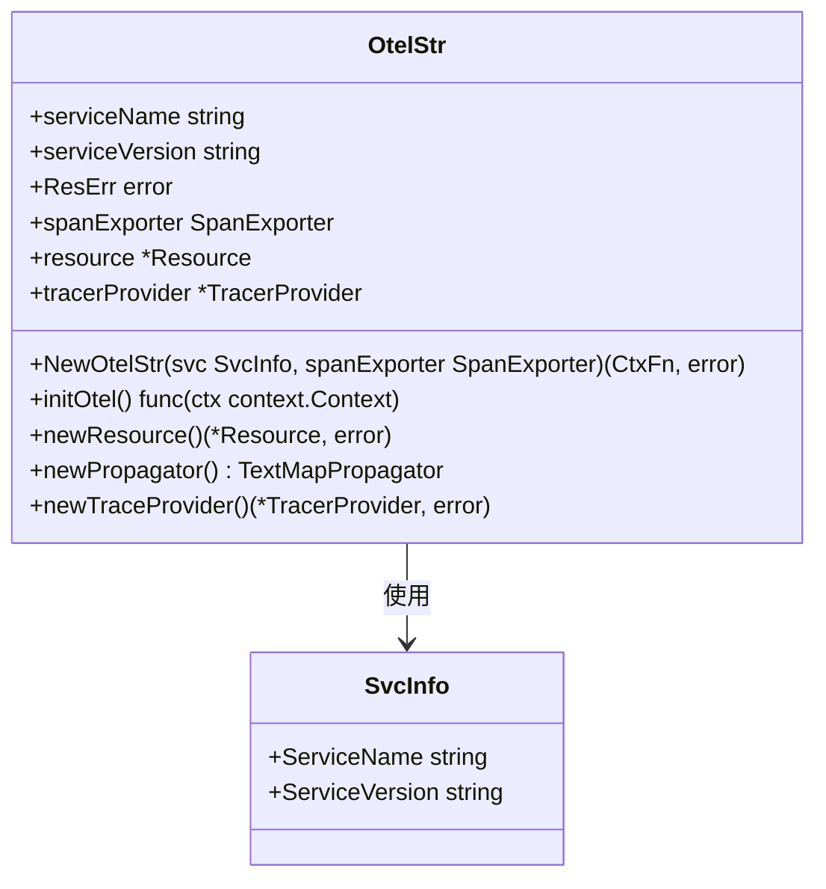
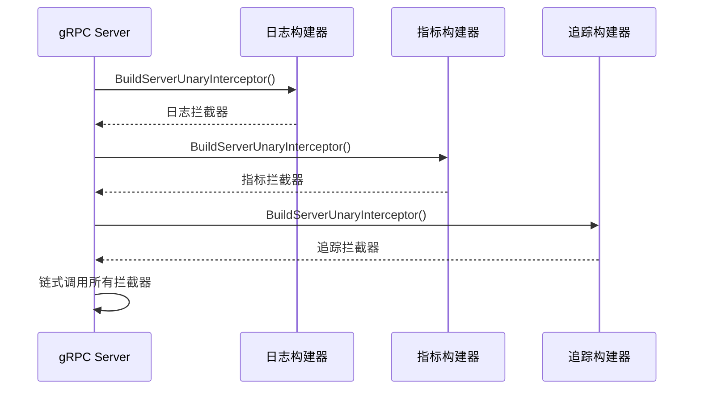
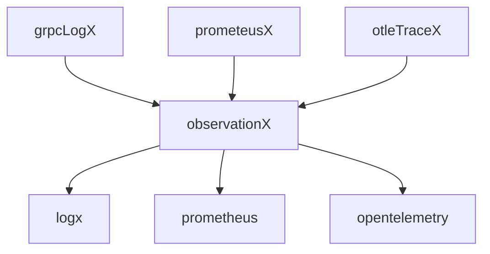

# 可观测性集成

<cite>
**本文档中引用的文件**  
- [grpcLogX.go](file://rpc/grpcx/observationX/grpcLogX/grpcLogX.go)
- [builder.go](file://rpc/grpcx/observationX/builder.go)
- [prometeusX/builder.go](file://rpc/grpcx/observationX/prometeusX/builder.go)
- [otel.go](file://observationX/opentelemetryX/otel.go)
- [prometheus.go](file://observationX/prometheusX/prometheus.go)
- [observationX_help](file://rpc/grpcx/observationX/observationX_help)
</cite>

## 目录
1. [引言](#引言)
2. [项目结构](#项目结构)
3. [核心组件](#核心组件)
4. [架构概述](#架构概述)
5. [详细组件分析](#详细组件分析)
6. [依赖分析](#依赖分析)
7. [性能考量](#性能考量)
8. [故障排除指南](#故障排除指南)
9. [结论](#结论)

## 引言
本文档详细阐述了gRPC服务中可观测性集成的三大支柱：日志、指标和分布式追踪。通过分析`grpcLogX.go`、`builder.go`、`prometeusX/builder.go`和`otel.go`等核心文件，说明如何通过拦截器实现请求日志记录、Prometheus指标暴露和OpenTelemetry追踪传播。同时，结合实际代码结构，展示如何链式注册多个观测拦截器，并提供监控告警规则建议、性能影响评估及与外部系统（如Grafana、Jaeger）的对接指南。

## 项目结构
可观测性相关代码主要分布在`rpc/grpcx/observationX`和`observationX`两个目录下，分别负责gRPC层面的观测拦截器和通用观测工具的实现。

**图示来源**
- [grpcLogX](file://rpc/grpcx/observationX/grpcLogX/grpcLogX.go)
- [prometeusX](file://rpc/grpcx/observationX/prometeusX/builder.go)
- [otel.go](file://observationX/opentelemetryX/otel.go)
- [prometheus.go](file://observationX/prometheusX/prometheus.go)

**本节来源**
- [grpcLogX](file://rpc/grpcx/observationX/grpcLogX/grpcLogX.go)
- [prometeusX](file://rpc/grpcx/observationX/prometeusX/builder.go)

## 核心组件
可观测性系统由日志记录、指标收集和分布式追踪三个核心组件构成，通过拦截器模式集成到gRPC服务中。

**本节来源**
- [grpcLogX.go](file://rpc/grpcx/observationX/grpcLogX/grpcLogX.go)
- [builder.go](file://rpc/grpcx/observationX/builder.go)
- [prometeusX/builder.go](file://rpc/grpcx/observationX/prometeusX/builder.go)

## 架构概述
系统采用分层架构，底层为通用观测库（OpenTelemetry、Prometheus），中层为gRPC拦截器构建器，上层为具体的服务实现。

**图示来源**
- [grpcLogX.go](file://rpc/grpcx/observationX/grpcLogX/grpcLogX.go)
- [prometeusX/builder.go](file://rpc/grpcx/observationX/prometeusX/builder.go)
- [otel.go](file://observationX/opentelemetryX/otel.go)

## 详细组件分析

### 日志记录组件分析
`grpcLogX`包通过`InterceptorBuilder`实现gRPC调用的日志记录功能，捕获请求方法、耗时、错误码等关键信息。

**图示来源**
- [grpcLogX.go](file://rpc/grpcx/observationX/grpcLogX/grpcLogX.go#L15-L70)
- [logx](file://logx/types.go)

**本节来源**
- [grpcLogX.go](file://rpc/grpcx/observationX/grpcLogX/grpcLogX.go#L1-L70)

### 指标收集组件分析
`prometeusX`包通过`InterceptorBuilder`暴露gRPC调用的Prometheus指标，包括请求计数和延迟直方图。

**图示来源**
- [prometeusX/builder.go](file://rpc/grpcx/observationX/prometeusX/builder.go#L13-L72)
- [prometheus.go](file://observationX/prometheusX/prometheus.go)

**本节来源**
- [prometeusX/builder.go](file://rpc/grpcx/observationX/prometeusX/builder.go#L1-L72)

### 分布式追踪组件分析
`opentelemetryX`包通过`OtelStr`结构体实现OpenTelemetry追踪的注入与传播机制，支持跨服务链路追踪。

**图示来源**
- [otel.go](file://observationX/opentelemetryX/otel.go#L20-L101)
- [opentelemetry](https://pkg.go.dev/go.opentelemetry.io/otel)

**本节来源**
- [otel.go](file://observationX/opentelemetryX/otel.go#L1-L101)

### 观测拦截器链式注册
通过`observationX`包中的通用构建器，可以实现多个观测拦截器的链式注册。

**图示来源**
- [builder.go](file://rpc/grpcx/observationX/builder.go)
- [grpcLogX.go](file://rpc/grpcx/observationX/grpcLogX/grpcLogX.go)
- [prometeusX/builder.go](file://rpc/grpcx/observationX/prometeusX/builder.go)

**本节来源**
- [builder.go](file://rpc/grpcx/observationX/builder.go#L1-L53)
- [grpcLogX.go](file://rpc/grpcx/observationX/grpcLogX/grpcLogX.go)
- [prometeusX/builder.go](file://rpc/grpcx/observationX/prometeusX/builder.go)

## 依赖分析
可观测性组件之间存在清晰的依赖关系，确保功能的模块化和可扩展性。

**图示来源**
- [go.mod](file://go.mod)
- [grpcLogX.go](file://rpc/grpcx/observationX/grpcLogX/grpcLogX.go)
- [prometeusX/builder.go](file://rpc/grpcx/observationX/prometeusX/builder.go)
- [otel.go](file://observationX/opentelemetryX/otel.go)

**本节来源**
- [go.mod](file://go.mod)
- [grpcLogX.go](file://rpc/grpcx/observationX/grpcLogX/grpcLogX.go)
- [prometeusX/builder.go](file://rpc/grpcx/observationX/prometeusX/builder.go)

## 性能考量
可观测性功能的引入会对系统性能产生一定影响，需要在监控粒度和性能开销之间找到平衡点。

- **日志记录**：建议在生产环境使用异步日志记录，避免阻塞主流程
- **指标收集**：Prometheus指标的收集频率应根据实际需求调整，避免过于频繁
- **分布式追踪**：建议对关键路径进行采样追踪，而非全量追踪
- **资源消耗**：监控组件本身也会消耗内存和CPU资源，需要合理配置

**本节来源**
- [grpcLogX.go](file://rpc/grpcx/observationX/grpcLogX/grpcLogX.go)
- [prometeusX/builder.go](file://rpc/grpcx/observationX/prometeusX/builder.go)
- [otel.go](file://observationX/opentelemetryX/otel.go)

## 故障排除指南
当可观测性功能出现问题时，可以按照以下步骤进行排查：

1. **检查拦截器注册**：确保所有观测拦截器已正确注册到gRPC服务器
2. **验证配置参数**：检查Prometheus和OpenTelemetry的相关配置是否正确
3. **查看日志输出**：通过日志检查是否有错误信息或警告
4. **测试端点连通性**：验证`/metrics`等监控端点是否可访问
5. **检查外部依赖**：确认Prometheus服务器、Jaeger等外部系统正常运行

**本节来源**
- [grpcLogX.go](file://rpc/grpcx/observationX/grpcLogX/grpcLogX.go)
- [prometeusX/builder.go](file://rpc/grpcx/observationX/prometeusX/builder.go)
- [otel.go](file://observationX/opentelemetryX/otel.go)

## 结论
本文档详细介绍了gRPC服务可观测性集成的实现方案，涵盖了日志、指标和分布式追踪三大核心功能。通过拦截器模式，可以灵活地将观测能力集成到现有服务中，而不会对业务逻辑造成侵入。建议在实际应用中根据具体需求调整监控粒度，并定期评估性能影响，确保系统稳定性和可观测性之间的平衡。