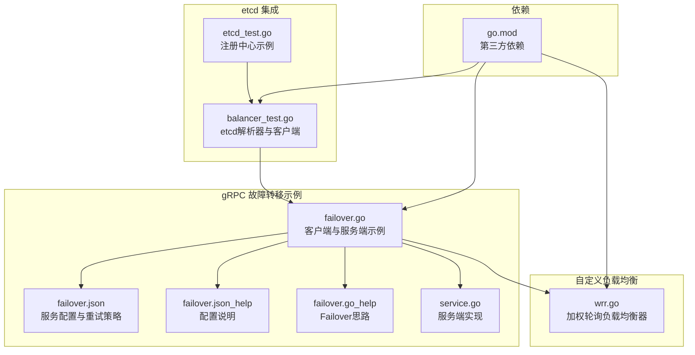
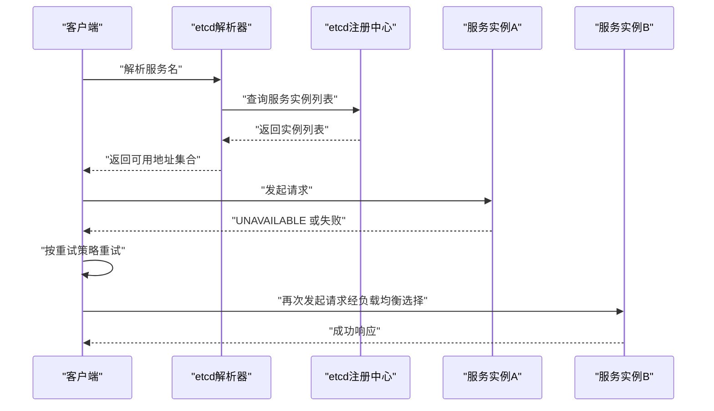
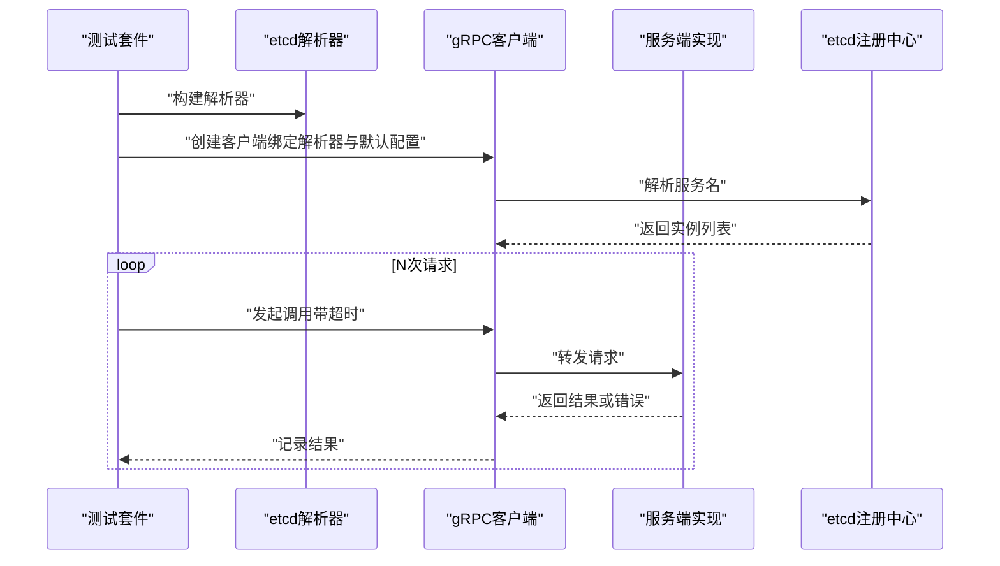
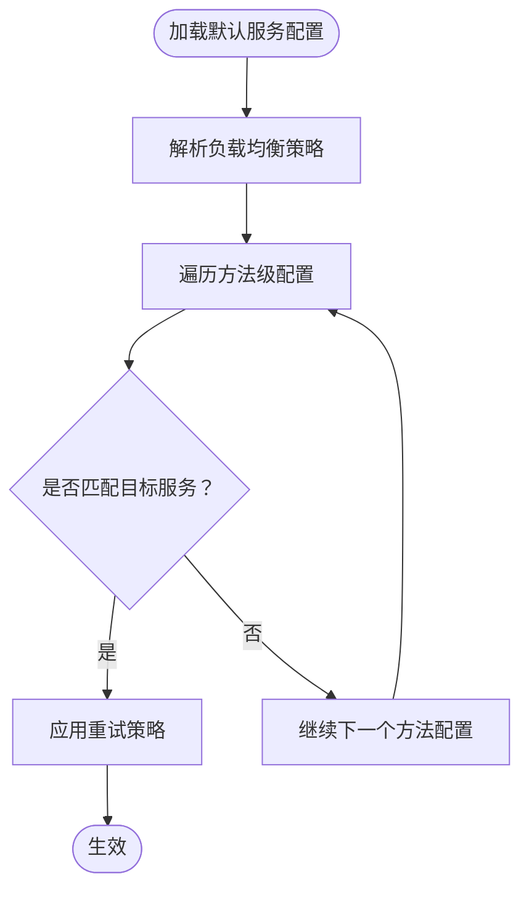
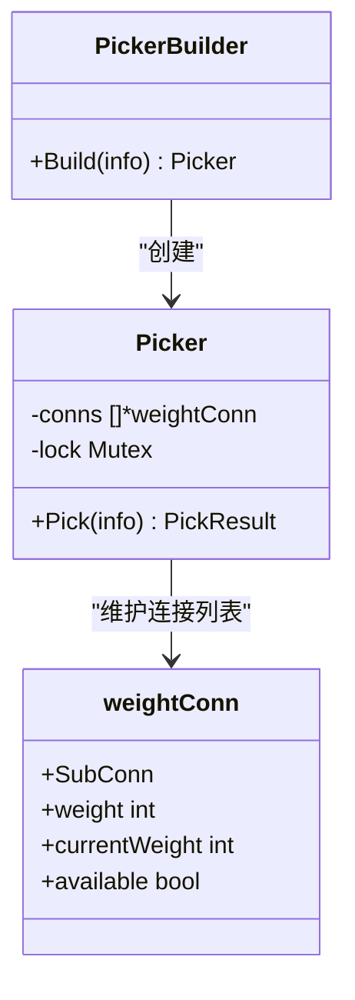
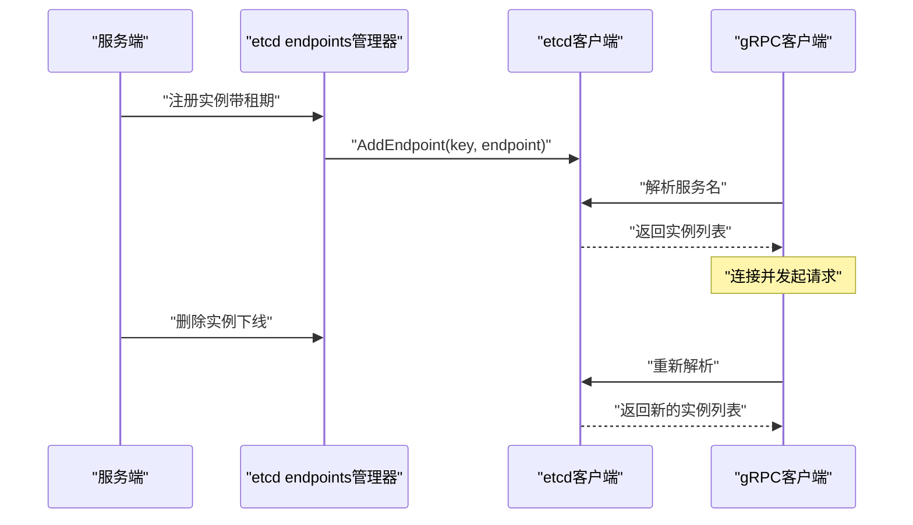
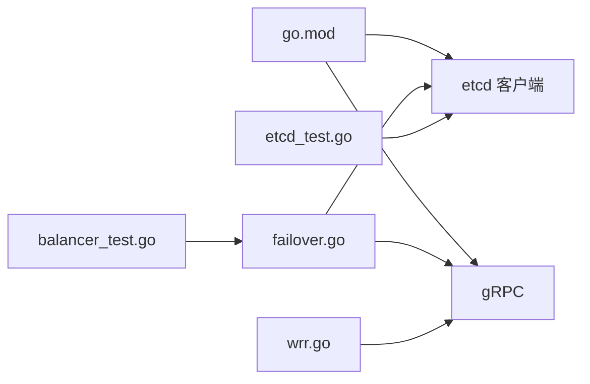

# 故障转移

<cite>
**本文引用的文件**
- [failover.go](file://rpc/grpcx/failover/failover.go)
- [failover.json](file://rpc/grpcx/failover/failover.json)
- [failover.json_help](file://rpc/grpcx/failover/failover.json_help)
- [failover.go_help](file://rpc/grpcx/failover/failover.go_help)
- [service.go](file://rpc/grpcx/failover/service.go)
- [wrr.go](file://rpc/grpcx/balancer/wrr/wrr.go)
- [balancer_test.go](file://registry/etcdx/balancer_test.go)
- [etcd_test.go](file://registry/etcdx/etcd_test.go)
- [go.mod](file://go.mod)
</cite>

## 目录
1. [简介](#简介)
2. [项目结构](#项目结构)
3. [核心组件](#核心组件)
4. [架构总览](#架构总览)
5. [详细组件分析](#详细组件分析)
6. [依赖关系分析](#依赖关系分析)
7. [性能考量](#性能考量)
8. [故障排查指南](#故障排查指南)
9. [结论](#结论)
10. [附录](#附录)

## 简介
本文件围绕 gRPC 客户端在多实例环境下的故障转移（Failover）机制展开，重点基于仓库中的 failover 示例与 etcd 注册中心集成，系统阐述以下主题：
- 基于重试与负载均衡的故障转移工作原理
- failover.json 配置项的含义与关键字段
- 故障检测与重试策略的协同，以及如何避免雪崩效应
- 与 etcd 服务注册中心的动态集成，展示动态故障转移能力
- 网络分区、脑裂等异常场景的行为与应对建议
- 生产环境部署与运维建议

## 项目结构
本节聚焦与故障转移直接相关的模块与文件组织，帮助读者快速定位实现位置与配置入口。

图表来源
- [failover.go](file://rpc/grpcx/failover/failover.go#L1-L132)
- [failover.json](file://rpc/grpcx/failover/failover.json#L1-L15)
- [failover.json_help](file://rpc/grpcx/failover/failover.json_help#L1-L15)
- [failover.go_help](file://rpc/grpcx/failover/failover.go_help#L1-L17)
- [service.go](file://rpc/grpcx/failover/service.go#L1-L44)
- [wrr.go](file://rpc/grpcx/balancer/wrr/wrr.go#L1-L95)
- [etcd_test.go](file://registry/etcdx/etcd_test.go#L1-L111)
- [balancer_test.go](file://registry/etcdx/balancer_test.go#L59-L175)
- [go.mod](file://go.mod#L1-L175)

章节来源
- [failover.go](file://rpc/grpcx/failover/failover.go#L1-L132)
- [failover.json](file://rpc/grpcx/failover/failover.json#L1-L15)
- [failover.json_help](file://rpc/grpcx/failover/failover.json_help#L1-L15)
- [failover.go_help](file://rpc/grpcx/failover/failover.go_help#L1-L17)
- [service.go](file://rpc/grpcx/failover/service.go#L1-L44)
- [wrr.go](file://rpc/grpcx/balancer/wrr/wrr.go#L1-L95)
- [etcd_test.go](file://registry/etcdx/etcd_test.go#L1-L111)
- [balancer_test.go](file://registry/etcdx/balancer_test.go#L59-L175)
- [go.mod](file://go.mod#L1-L175)

## 核心组件
- gRPC 客户端与服务端示例：演示通过 etcd 解析器与服务配置实现故障转移与重试。
- failover.json：定义默认服务配置，包含负载均衡策略与方法级重试策略。
- 自定义负载均衡器（加权轮询）：在 Picker 的 Done 回调中可嵌入故障转移逻辑。
- etcd 注册中心：动态管理服务实例，支持实例上下线与租期保活，驱动客户端感知变化。
- 依赖库：etcd 客户端、gRPC、测试框架等。

章节来源
- [failover.go](file://rpc/grpcx/failover/failover.go#L30-L80)
- [failover.json](file://rpc/grpcx/failover/failover.json#L1-L15)
- [wrr.go](file://rpc/grpcx/balancer/wrr/wrr.go#L1-L95)
- [etcd_test.go](file://registry/etcdx/etcd_test.go#L1-L111)
- [balancer_test.go](file://registry/etcdx/balancer_test.go#L59-L175)
- [go.mod](file://go.mod#L1-L175)

## 架构总览
下图展示了客户端通过 etcd 解析器发现服务实例，结合默认服务配置（含重试策略与负载均衡），在实例不可用时自动切换到可用实例的整体流程。

图表来源
- [balancer_test.go](file://registry/etcdx/balancer_test.go#L60-L94)
- [failover.go](file://rpc/grpcx/failover/failover.go#L30-L80)
- [failover.json](file://rpc/grpcx/failover/failover.json#L1-L15)

## 详细组件分析

### failover.go：客户端与服务端示例
- 客户端侧：
  - 使用 etcd 解析器创建 gRPC 客户端，绑定服务名与默认服务配置。
  - 默认服务配置包含负载均衡策略与方法级重试策略。
  - 通过上下文超时控制单次调用时限，避免阻塞。
- 服务端侧：
  - 提供基础服务实现，用于验证客户端调用链路与故障转移效果。
- 测试流程：
  - 启动多个服务实例，注册到 etcd。
  - 客户端循环发起请求，观察在实例切换时的重试与负载均衡行为。

图表来源
- [failover.go](file://rpc/grpcx/failover/failover.go#L30-L80)
- [service.go](file://rpc/grpcx/failover/service.go#L1-L44)

章节来源
- [failover.go](file://rpc/grpcx/failover/failover.go#L30-L80)
- [service.go](file://rpc/grpcx/failover/service.go#L1-L44)

### failover.json：服务配置与重试策略
- 关键字段说明（基于仓库中的 JSON 结构）：
  - loadBalancingConfig：负载均衡策略配置。示例中为轮询策略。
  - methodConfig：方法级配置数组。
    - name：匹配的服务名（需与 proto 编译产物一致）。
    - retryPolicy：重试策略配置。
      - maxAttempts：最大重试次数。
      - initialBackoff：初始退避间隔。
      - maxBackoff：最大退避间隔。
      - backoffMultiplier：退避倍数。
      - retryableStatusCodes：可重试的状态码（示例为 UNAVAILABLE）。
- 配置说明文档：仓库提供了详细的注释说明，强调通过 methodConfig 控制重试范围与参数。

图表来源
- [failover.json](file://rpc/grpcx/failover/failover.json#L1-L15)
- [failover.json_help](file://rpc/grpcx/failover/failover.json_help#L1-L15)

章节来源
- [failover.json](file://rpc/grpcx/failover/failover.json#L1-L15)
- [failover.json_help](file://rpc/grpcx/failover/failover.json_help#L1-L15)

### 自定义负载均衡器（加权轮询）与故障转移
- 负载均衡器注册：
  - 通过自定义名称注册负载均衡器，使其可在服务配置中被引用。
- Picker.Build：
  - 从 ReadySCs 中读取可用连接，并从地址元数据中提取权重。
- Picker.Pick：
  - 基于权重进行轮询选择；在 Done 回调中可根据调用结果调整权重或剔除节点，实现故障转移与降级。
- 与 failover 的关系：
  - 默认的轮询/加权轮询策略配合重试，即可满足大多数场景的故障转移需求。
  - 复杂场景可通过 Done 回调实现更精细的容错逻辑。

图表来源
- [wrr.go](file://rpc/grpcx/balancer/wrr/wrr.go#L1-L95)

章节来源
- [wrr.go](file://rpc/grpcx/balancer/wrr/wrr.go#L1-L95)
- [failover.go_help](file://rpc/grpcx/failover/failover.go_help#L1-L17)

### 与 etcd 服务注册中心的集成
- etcd 客户端初始化与服务注册：
  - 通过 endpoints 管理器将服务实例注册到 etcd，支持租期保活与优雅删除。
- 客户端解析与动态感知：
  - 使用 etcd 解析器创建 gRPC 客户端，客户端根据 etcd 返回的实例列表进行连接与负载均衡。
- 动态故障转移能力：
  - 当某实例下线或不可用时，etcd 中的实例列表更新，客户端重新解析并选择新的可用实例，从而实现动态故障转移。

图表来源
- [etcd_test.go](file://registry/etcdx/etcd_test.go#L33-L106)
- [balancer_test.go](file://registry/etcdx/balancer_test.go#L60-L94)

章节来源
- [etcd_test.go](file://registry/etcdx/etcd_test.go#L1-L111)
- [balancer_test.go](file://registry/etcdx/balancer_test.go#L59-L175)

## 依赖关系分析
- 第三方依赖：
  - etcd 客户端：提供服务注册、租期保活与实例管理能力。
  - gRPC：提供客户端连接、解析器、负载均衡与重试机制。
  - 测试框架：用于演示与验证故障转移行为。
- 模块耦合：
  - failover.go 与 etcd 集成紧密，通过解析器与服务配置共同实现故障转移。
  - 自定义负载均衡器与 gRPC 负载均衡接口耦合，便于扩展复杂容错逻辑。

图表来源
- [go.mod](file://go.mod#L1-L175)
- [failover.go](file://rpc/grpcx/failover/failover.go#L1-L132)
- [wrr.go](file://rpc/grpcx/balancer/wrr/wrr.go#L1-L95)
- [balancer_test.go](file://registry/etcdx/balancer_test.go#L59-L175)
- [etcd_test.go](file://registry/etcdx/etcd_test.go#L1-L111)

章节来源
- [go.mod](file://go.mod#L1-L175)
- [failover.go](file://rpc/grpcx/failover/failover.go#L1-L132)
- [wrr.go](file://rpc/grpcx/balancer/wrr/wrr.go#L1-L95)
- [balancer_test.go](file://registry/etcdx/balancer_test.go#L59-L175)
- [etcd_test.go](file://registry/etcdx/etcd_test.go#L1-L111)

## 性能考量
- 重试与退避：
  - 合理设置最大重试次数与退避参数，避免对下游造成瞬时压力。
  - 将可重试状态码限定为明确的网络/服务不可用场景，减少误重试。
- 负载均衡策略：
  - 默认轮询/加权轮询足以覆盖多数场景；复杂容错可通过自定义负载均衡器的 Done 回调实现。
- 超时控制：
  - 客户端调用应设置合理的上下文超时，防止长时间阻塞影响整体吞吐。
- etcd 交互：
  - 租期保活与实例注册应避免频繁更新，降低 etcd 写放大风险。

## 故障排查指南
- 重试无效或过度重试：
  - 检查默认服务配置中的重试策略字段是否正确，确认服务名匹配与状态码过滤。
- 实例切换不生效：
  - 确认 etcd 中实例已注册且租期保活正常；检查解析器是否正确绑定到客户端。
- 负载均衡未生效：
  - 确认服务配置中的负载均衡策略已启用；若使用自定义负载均衡器，检查注册名称与 Picker 实现。
- 网络波动导致抖动：
  - 适当增大初始退避与最大退避，避免雪崩效应；必要时引入熔断与限流策略。

章节来源
- [failover.json](file://rpc/grpcx/failover/failover.json#L1-L15)
- [failover.json_help](file://rpc/grpcx/failover/failover.json_help#L1-L15)
- [failover.go](file://rpc/grpcx/failover/failover.go#L30-L80)
- [balancer_test.go](file://registry/etcdx/balancer_test.go#L60-L94)
- [etcd_test.go](file://registry/etcdx/etcd_test.go#L33-L106)

## 结论
本仓库通过默认服务配置与 etcd 解析器，实现了基于“重试 + 负载均衡”的故障转移机制。failover.json 明确了重试策略与负载均衡配置，结合 etcd 的动态注册与租期保活，能够在实例不可用时自动切换到可用实例，保障服务高可用。对于更复杂的容错需求，可在自定义负载均衡器的 Done 回调中嵌入故障转移逻辑，实现更细粒度的控制。

## 附录
- 生产环境部署建议：
  - 使用加权轮询或自定义负载均衡策略，结合健康检查与权重调整。
  - 合理设置重试次数与退避参数，避免雪崩效应。
  - 为 etcd 客户端配置合适的超时与重连策略，确保注册中心可用性。
  - 在网络分区场景下，建议采用“多数派”策略与隔离阈值，避免脑裂影响。
  - 对关键服务启用熔断与限流，防止级联故障。