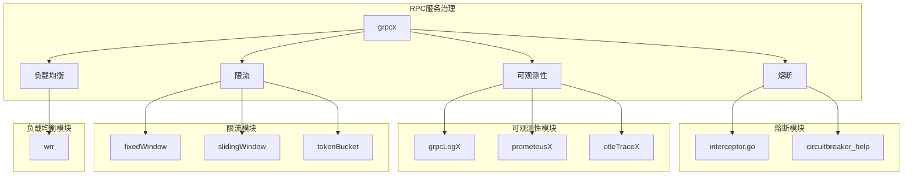
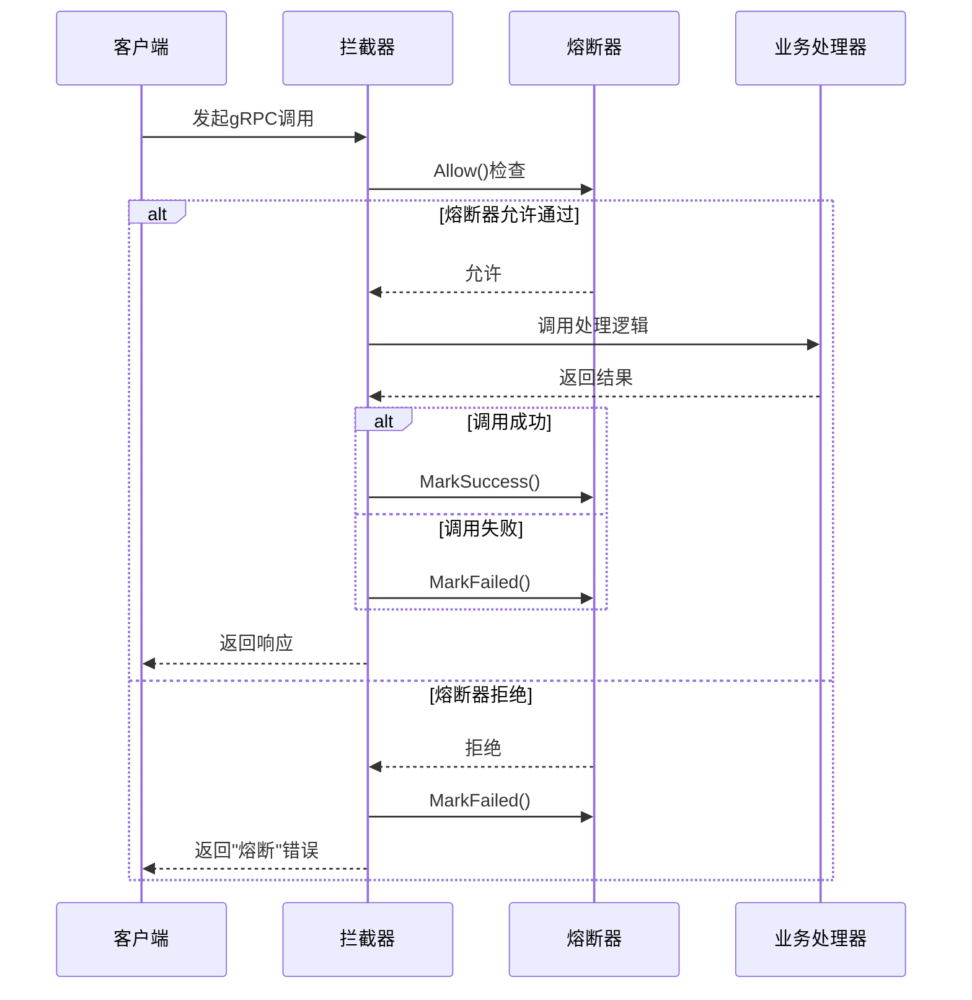
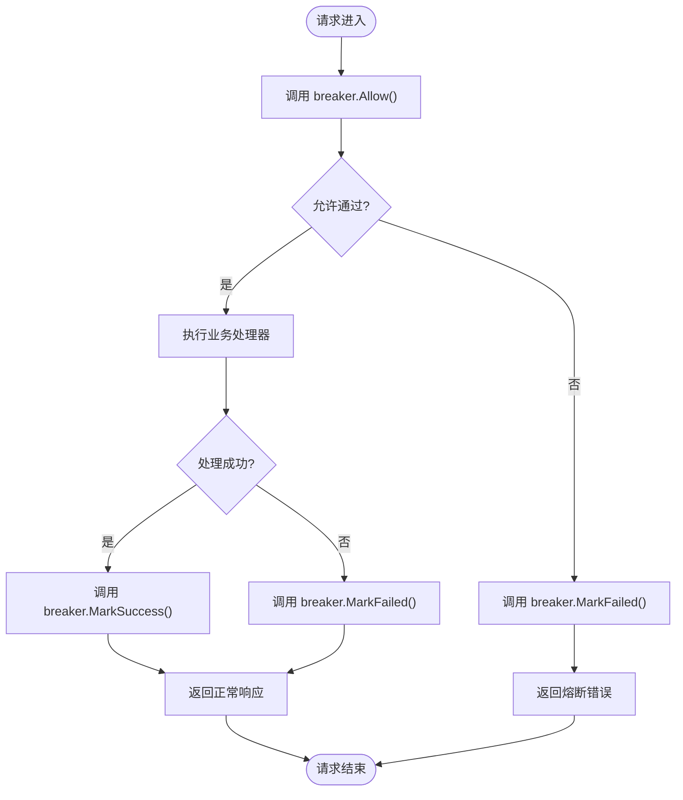
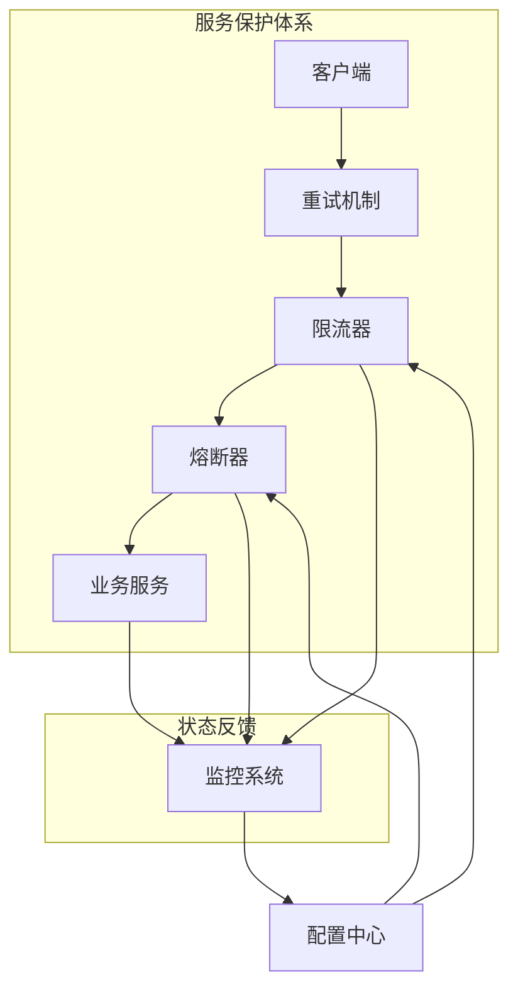
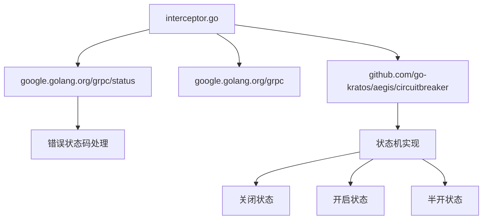
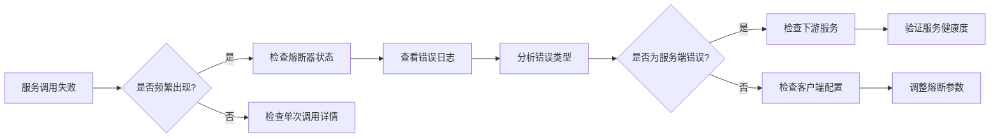

# 熔断机制

<cite>
**本文档引用文件**   
- [interceptor.go](file://rpc/grpcx/circuitbreaker/interceptor.go)
- [grpcLogX.go](file://rpc/grpcx/observationX/grpcLogX/grpcLogX.go)
- [builder.go](file://rpc/grpcx/observationX/prometeusX/builder.go)
- [wrr.go](file://rpc/grpcx/balancer/wrr/wrr.go)
</cite>

## 目录
1. [引言](#引言)
2. [项目结构](#项目结构)
3. [核心组件](#核心组件)
4. [架构概述](#架构概述)
5. [详细组件分析](#详细组件分析)
6. [依赖分析](#依赖分析)
7. [性能考虑](#性能考虑)
8. [故障排查指南](#故障排查指南)
9. [结论](#结论)

## 引言
本文档深入阐述gRPC熔断器拦截器的设计与实现，重点分析`interceptor.go`中如何通过状态机（关闭、开启、半开）防止服务级联故障。详细说明熔断触发条件（如错误率阈值）、熔断时长、恢复试探机制等核心参数的配置方式。结合实际调用流程，描述Unary拦截器如何在请求前后进行健康检查与异常统计。提供熔断事件监听、日志记录和监控上报的集成方案。讨论熔断策略与限流、重试机制的协同工作模式，并给出典型微服务场景下的配置示例和故障恢复最佳实践。

## 项目结构
本项目采用分层模块化设计，将不同功能组件分离到独立目录中。熔断机制作为gRPC服务治理的重要组成部分，位于`rpc/grpcx/circuitbreaker`目录下，与其他服务治理组件（如限流、负载均衡、可观测性）并列组织。

**Diagram sources**
- [interceptor.go](file://rpc/grpcx/circuitbreaker/interceptor.go)
- [wrr.go](file://rpc/grpcx/balancer/wrr/wrr.go)
- [builder.go](file://rpc/grpcx/observationX/prometeusX/builder.go)

**Section sources**
- [interceptor.go](file://rpc/grpcx/circuitbreaker/interceptor.go)
- [wrr.go](file://rpc/grpcx/balancer/wrr/wrr.go)

## 核心组件

熔断机制的核心实现位于`rpc/grpcx/circuitbreaker/interceptor.go`文件中，通过`InterceptorBuilder`结构体封装熔断器逻辑。该组件依赖于外部熔断器实现（`github.com/go-kratos/aegis/circuitbreaker`），通过gRPC拦截器模式在服务调用前后进行熔断状态检查和结果统计。

**Section sources**
- [interceptor.go](file://rpc/grpcx/circuitbreaker/interceptor.go)

## 架构概述

熔断器拦截器采用经典的三状态机模型（关闭、开启、半开），通过gRPC Unary拦截器在服务端调用前进行熔断检查。当检测到服务异常时，通过标记成功或失败来更新熔断器状态，防止故障在服务间传播。

**Diagram sources**
- [interceptor.go](file://rpc/grpcx/circuitbreaker/interceptor.go)

## 详细组件分析

### 熔断器拦截器分析

`InterceptorBuilder`结构体封装了熔断器的核心逻辑，通过`BuildServerUnaryInterceptor`方法创建gRPC服务端拦截器。拦截器在每次请求时执行以下流程：

1. 调用`breaker.Allow()`检查是否允许请求通过
2. 如果允许，执行业务逻辑处理
3. 根据处理结果调用`MarkSuccess()`或`MarkFailed()`更新熔断器状态
4. 如果不允许，直接返回"熔断"错误

**Diagram sources**
- [interceptor.go](file://rpc/grpcx/circuitbreaker/interceptor.go)

**Section sources**
- [interceptor.go](file://rpc/grpcx/circuitbreaker/interceptor.go)

### 熔断策略与协同工作机制

熔断器通常与限流、重试机制协同工作，形成完整的服务保护体系。在负载均衡器中，熔断状态可用于调整节点权重，避免将流量路由到已熔断的服务实例。

**Diagram sources**
- [interceptor.go](file://rpc/grpcx/circuitbreaker/interceptor.go)
- [wrr.go](file://rpc/grpcx/balancer/wrr/wrr.go)

## 依赖分析

熔断器拦截器依赖于外部熔断器实现库（`github.com/go-kratos/aegis/circuitbreaker`），并通过gRPC框架的拦截器机制集成到服务调用流程中。同时，它与日志、监控等可观测性组件协同工作，提供完整的故障诊断能力。

**Diagram sources**
- [interceptor.go](file://rpc/grpcx/circuitbreaker/interceptor.go)

**Section sources**
- [interceptor.go](file://rpc/grpcx/circuitbreaker/interceptor.go)

## 性能考虑

熔断器拦截器的设计充分考虑了性能影响：
- 状态检查操作轻量，避免复杂计算
- 使用高效的原子操作更新状态
- 最小化锁竞争，提高并发性能
- 错误处理路径简洁，减少额外开销

在高并发场景下，熔断器能够有效防止雪崩效应，同时保持较低的性能开销。

## 故障排查指南

当遇到熔断相关问题时，可参考以下排查步骤：
1. 检查熔断器配置参数是否合理
2. 查看日志中熔断事件的详细信息
3. 监控系统指标，分析错误率趋势
4. 验证下游服务的健康状况
5. 检查网络连接和超时设置

**Section sources**
- [interceptor.go](file://rpc/grpcx/circuitbreaker/interceptor.go)
- [grpcLogX.go](file://rpc/grpcx/observationX/grpcLogX/grpcLogX.go)

## 结论

gRPC熔断器拦截器通过简洁而有效的设计，实现了服务间的故障隔离。其基于状态机的实现方式能够准确反映服务健康状况，在检测到持续故障时及时熔断，防止故障扩散。与限流、重试等机制的协同工作，构成了完整的微服务容错体系。合理的配置和监控集成，使得该组件成为保障系统稳定性的关键基础设施。