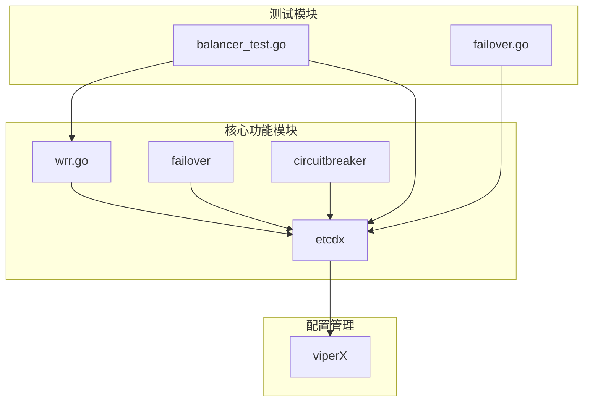
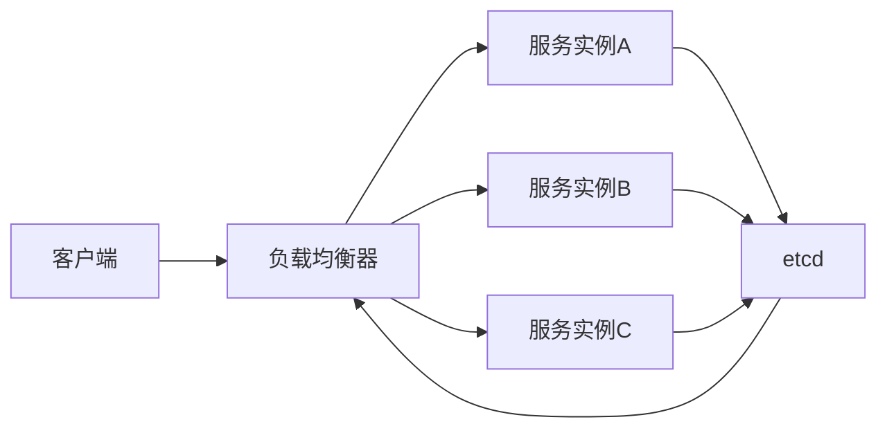
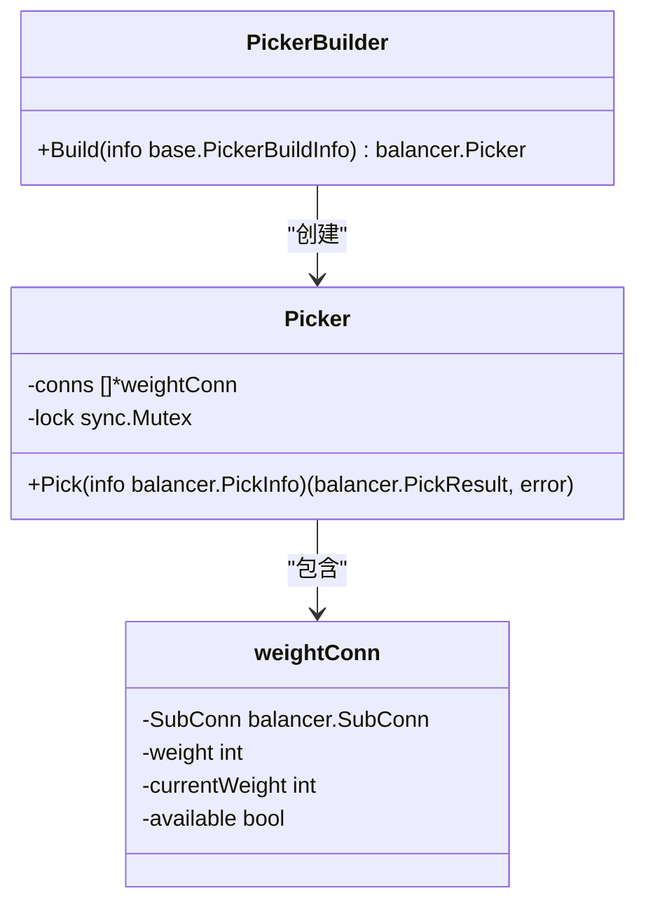
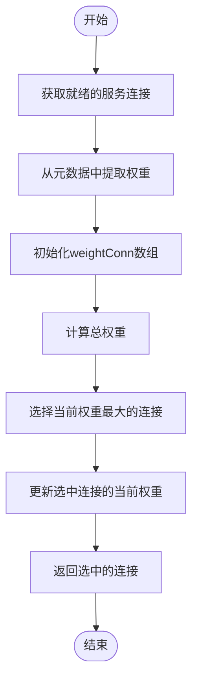
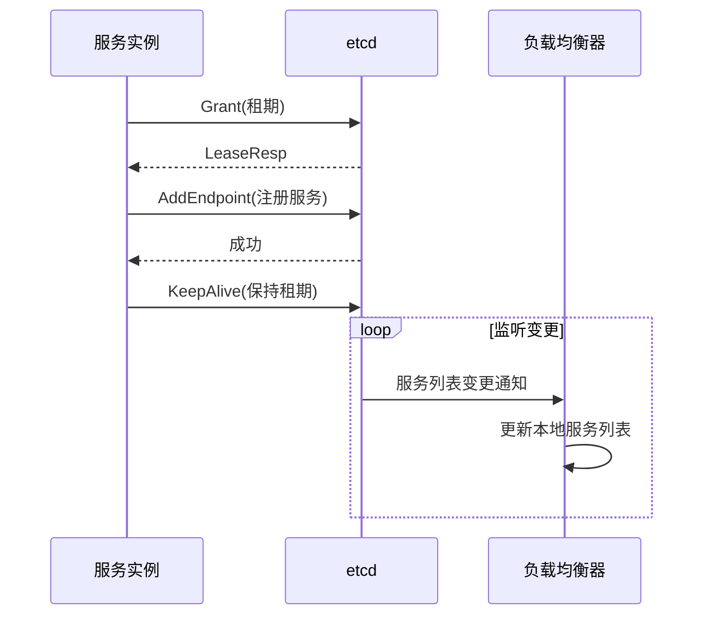
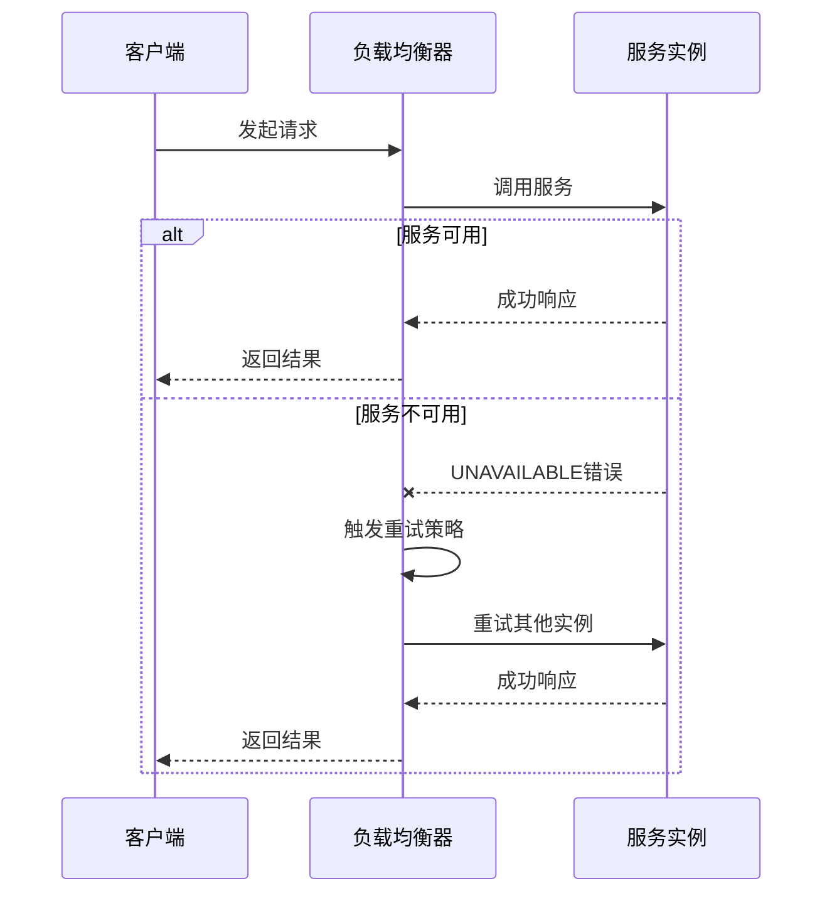
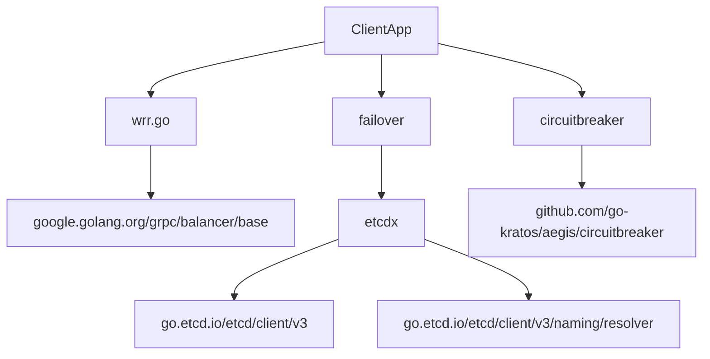

# 负载均衡

<cite>
**本文档引用的文件**
- [wrr.go](file://rpc/grpcx/balancer/wrr/wrr.go)
- [wrr.go_help](file://rpc/grpcx/balancer/wrr/wrr.go_help)
- [balancer_test.go](file://registry/etcdx/balancer_test.go)
- [service.go](file://registry/etcdx/service.go)
- [user.pb.go](file://registry/etcdx/user.pb.go)
- [user_grpc.pb.go](file://registry/etcdx/user_grpc.pb.go)
- [failover.go](file://rpc/grpcx/failover/failover.go)
- [interceptor.go](file://rpc/grpcx/circuitbreaker/interceptor.go)
- [failover.json](file://rpc/grpcx/failover/failover.json)
- [db.yaml](file://configx/viperX/db.yaml)
- [redis.yaml](file://configx/viperX/redis.yaml)
- [README.md](file://README.md)
</cite>

## 目录
1. [引言](#引言)
2. [项目结构](#项目结构)
3. [核心组件](#核心组件)
4. [架构概述](#架构概述)
5. [详细组件分析](#详细组件分析)
6. [依赖分析](#依赖分析)
7. [性能考虑](#性能考虑)
8. [故障排除指南](#故障排除指南)
9. [结论](#结论)
10. [附录](#附录)

## 引言
本文档详细介绍了gRPC负载均衡机制，重点阐述了加权轮询（WRR）算法的实现原理及其在微服务环境中的应用。通过分析代码库中的相关文件，我们将深入探讨WRR如何根据后端服务实例的权重分配请求，从而提升系统资源利用率和响应性能。文档还将说明`wrr.go`中核心结构体和方法的使用方式，包括节点注册、权重计算和调度逻辑，并阐述该负载均衡器与etcd服务发现的集成方式，如何动态感知服务实例变化。

## 项目结构
本项目采用模块化设计，将不同功能划分为独立的包。核心的gRPC负载均衡功能位于`rpc/grpcx/balancer/wrr`目录下，而服务注册与发现功能则位于`registry/etcdx`目录。通过这种清晰的结构划分，系统实现了负载均衡、服务发现和业务逻辑的解耦。



**图表来源**
- [wrr.go](file://rpc/grpcx/balancer/wrr/wrr.go)
- [etcdx](file://registry/etcdx)
- [viperX](file://configx/viperX)
- [balancer_test.go](file://registry/etcdx/balancer_test.go)
- [failover.go](file://rpc/grpcx/failover/failover.go)

**章节来源**
- [wrr.go](file://rpc/grpcx/balancer/wrr/wrr.go)
- [etcdx](file://registry/etcdx)
- [viperX](file://configx/viperX)

## 核心组件
本系统的核心组件包括加权轮询负载均衡器（WRR）、etcd服务发现机制、熔断器和故障转移机制。这些组件协同工作，确保微服务架构的高可用性和高性能。WRR负载均衡器根据服务实例的权重分配请求，etcd负责服务注册与发现，熔断器防止级联故障，而故障转移机制则在服务不可用时提供备用方案。

**章节来源**
- [wrr.go](file://rpc/grpcx/balancer/wrr/wrr.go)
- [etcdx](file://registry/etcdx)
- [circuitbreaker](file://rpc/grpcx/circuitbreaker)
- [failover](file://rpc/grpcx/failover)

## 架构概述
系统采用典型的微服务架构，客户端通过gRPC与后端服务通信。负载均衡器位于客户端和服务端之间，根据配置的策略将请求分发到不同的服务实例。服务实例通过etcd进行注册，负载均衡器通过监听etcd的变更来动态更新服务列表。



**图表来源**
- [wrr.go](file://rpc/grpcx/balancer/wrr/wrr.go)
- [etcdx](file://registry/etcdx)

## 详细组件分析

### 加权轮询负载均衡器分析
加权轮询（Weighted Round Robin）负载均衡器通过为每个服务实例分配权重来实现请求的合理分配。权重较高的实例将接收更多的请求，从而充分利用其处理能力。

#### 核心结构体


**图表来源**
- [wrr.go](file://rpc/grpcx/balancer/wrr/wrr.go#L21-L94)

#### 请求调度流程


**图表来源**
- [wrr.go](file://rpc/grpcx/balancer/wrr/wrr.go#L50-L82)

**章节来源**
- [wrr.go](file://rpc/grpcx/balancer/wrr/wrr.go#L1-L94)

### 服务发现与注册分析
系统使用etcd作为服务注册中心，服务实例在启动时向etcd注册自己的地址和元数据（包括权重），客户端通过监听etcd的变更来获取最新的服务列表。

#### 服务注册流程


**图表来源**
- [balancer_test.go](file://registry/etcdx/balancer_test.go#L177-L210)
- [service.go](file://registry/etcdx/service.go)

**章节来源**
- [balancer_test.go](file://registry/etcdx/balancer_test.go#L1-L226)
- [service.go](file://registry/etcdx/service.go#L1-L44)

### 故障转移机制分析
当服务实例不可用时，系统通过故障转移机制自动将请求重试到其他可用实例，从而提高系统的容错能力。

#### 故障转移流程


**图表来源**
- [failover.go](file://rpc/grpcx/failover/failover.go)
- [failover.json](file://rpc/grpcx/failover/failover.json)

**章节来源**
- [failover.go](file://rpc/grpcx/failover/failover.go#L1-L80)
- [failover.json](file://rpc/grpcx/failover/failover.json#L1-L15)

## 依赖分析
系统各组件之间存在明确的依赖关系。负载均衡器依赖于etcd进行服务发现，故障转移机制依赖于负载均衡器的选择结果，而熔断器则作为独立的保护机制。



**图表来源**
- [wrr.go](file://rpc/grpcx/balancer/wrr/wrr.go#L5-L8)
- [etcdx](file://registry/etcdx)
- [failover.go](file://rpc/grpcx/failover/failover.go)
- [interceptor.go](file://rpc/grpcx/circuitbreaker/interceptor.go)

**章节来源**
- [wrr.go](file://rpc/grpcx/balancer/wrr/wrr.go#L1-L94)
- [etcdx](file://registry/etcdx)
- [failover.go](file://rpc/grpcx/failover/failover.go#L1-L80)
- [interceptor.go](file://rpc/grpcx/circuitbreaker/interceptor.go#L1-L34)

## 性能考虑
在高并发场景下，负载均衡器的性能至关重要。WRR算法的时间复杂度为O(n)，其中n是服务实例的数量。为了优化性能，建议：
1. 限制服务实例的数量，避免过多的实例导致调度开销过大
2. 使用连接池复用gRPC连接，减少连接建立的开销
3. 合理设置etcd的租期和心跳间隔，平衡实时性和系统开销
4. 在客户端缓存服务列表，减少对etcd的频繁查询

## 故障排除指南
当遇到负载均衡相关问题时，可以按照以下步骤进行排查：

**章节来源**
- [wrr.go](file://rpc/grpcx/balancer/wrr/wrr.go#L71-L80)
- [balancer_test.go](file://registry/etcdx/balancer_test.go)
- [interceptor.go](file://rpc/grpcx/circuitbreaker/interceptor.go)

### 常见问题及解决方案
| 问题现象 | 可能原因 | 解决方案 |
|--------|--------|--------|
| 请求分配不均 | 权重设置不合理 | 检查服务注册时的权重配置 |
| 服务实例未被发现 | etcd连接问题 | 检查etcd地址配置和网络连接 |
| 频繁重试 | 服务不稳定 | 检查服务健康状况和熔断器配置 |
| 性能下降 | 实例过多 | 优化服务实例数量和连接池配置 |

## 结论
本文档详细介绍了基于gRPC的加权轮询负载均衡机制的实现和应用。通过分析代码库中的核心组件，我们了解了WRR算法的工作原理、与etcd服务发现的集成方式以及故障转移和熔断等保护机制。这些技术的结合为微服务架构提供了高可用、高性能的通信基础。

## 附录
### 配置示例
```json
{
  "loadBalancingConfig": [
    {
      "custom_weighted_round_robin": {}
    }
  ],
  "methodConfig": [
    {
      "name": [{"service": "UserService"}],
      "retryPolicy": {
        "maxAttempts": 4,
        "initialBackoff": "0.01s",
        "maxBackoff": "0.1s",
        "backoffMultiplier": 2.0,
        "retryableStatusCodes": ["UNAVAILABLE"]
      }
    }
  ]
}
```

### 使用建议
1. 在项目中匿名导入wrr包以触发init()方法：`_ "gitee.com/hgg_test/pkg_tool/v2/rpc/grpcx/balancer/wrr"`
2. 确保在服务注册时正确设置权重元数据
3. 根据实际负载情况合理配置权重值
4. 结合熔断器和故障转移机制提高系统稳定性