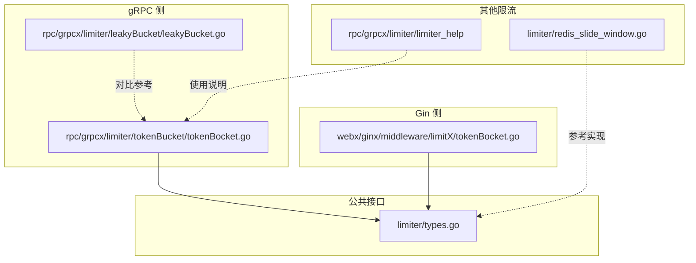
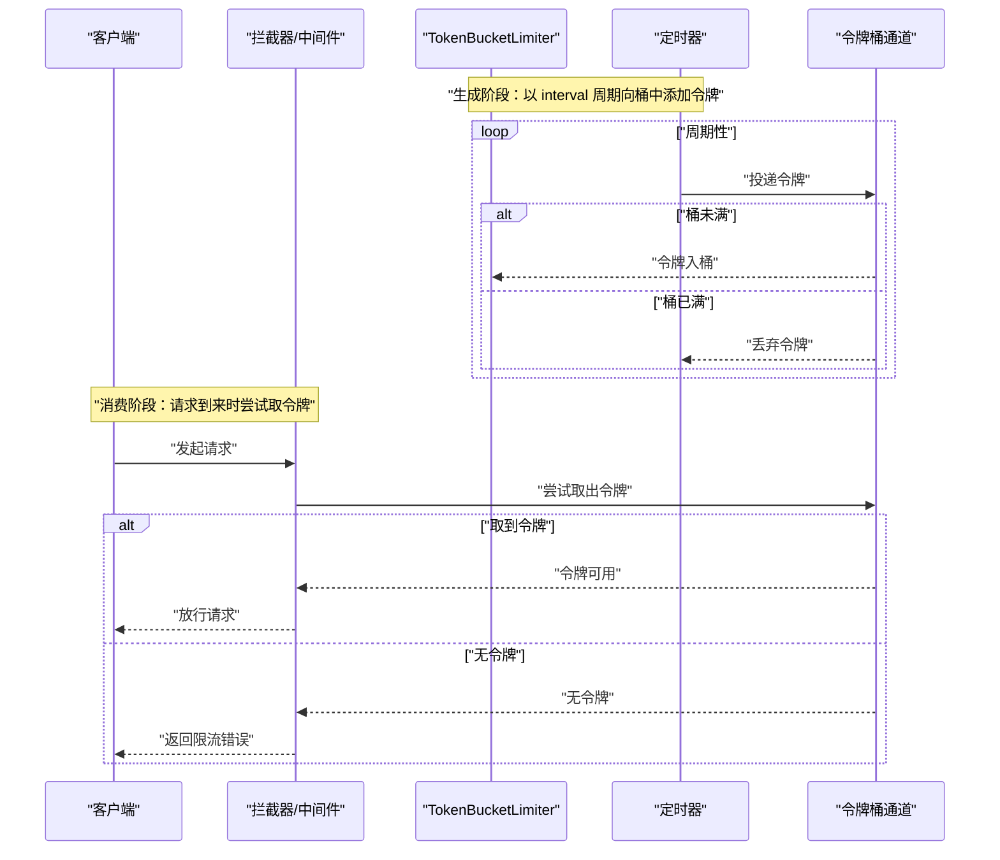
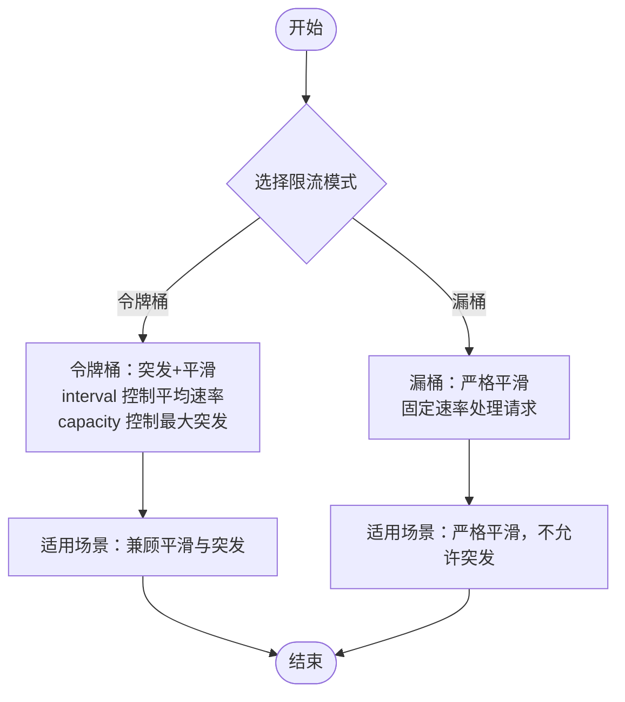
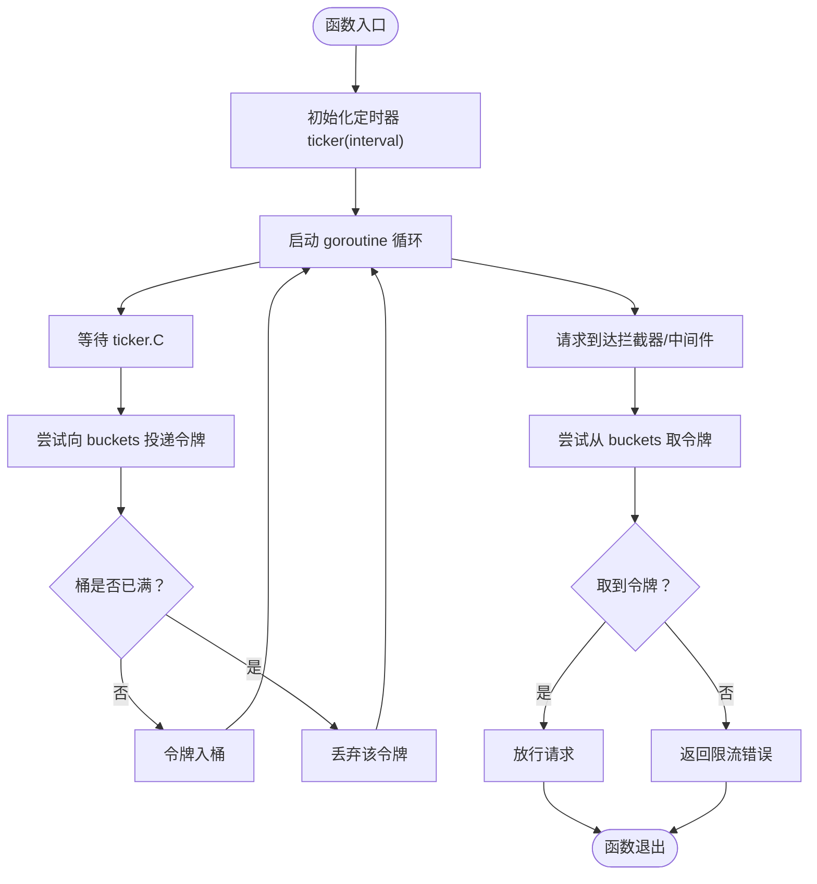
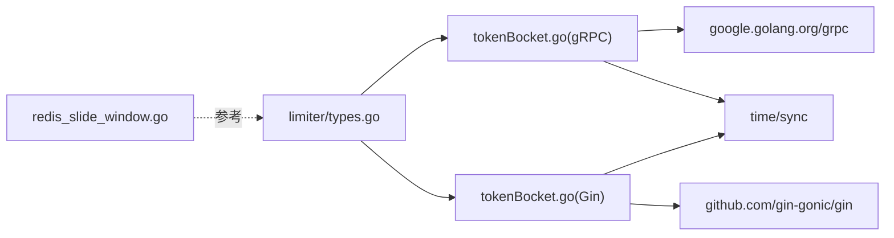

# 令牌桶限流

<cite>
**本文引用的文件**
- [limiter/types.go](file://limiter/types.go)
- [rpc/grpcx/limiter/tokenBucket/tokenBocket.go](file://rpc/grpcx/limiter/tokenBucket/tokenBocket.go)
- [webx/ginx/middleware/limitX/tokenBocket.go](file://webx/ginx/middleware/limitX/tokenBocket.go)
- [rpc/grpcx/limiter/leakyBucket/leakyBucket.go](file://rpc/grpcx/limiter/leakyBucket/leakyBucket.go)
- [rpc/grpcx/limiter/limiter_help](file://rpc/grpcx/limiter/limiter_help)
- [limiter/redis_slide_window.go](file://limiter/redis_slide_window.go)
</cite>

## 目录
1. [引言](#引言)
2. [项目结构](#项目结构)
3. [核心组件](#核心组件)
4. [架构总览](#架构总览)
5. [详细组件分析](#详细组件分析)
6. [依赖关系分析](#依赖关系分析)
7. [性能考量](#性能考量)
8. [故障排查指南](#故障排查指南)
9. [结论](#结论)
10. [附录](#附录)

## 引言
本文件系统讲解令牌桶限流算法的设计与实现，重点剖析 TokenBucketLimiter 结构体，说明 interval（令牌产生间隔）与 buckets（令牌桶）如何协同工作；描述 BuildServerInterceptor() 中启动的 goroutine 如何以 interval 为周期向 buckets channel 中添加令牌，从而实现令牌的生成；解释拦截器在处理请求时如何尝试从 buckets 中取出令牌，取到则放行，否则立即返回限流错误。同时，对比漏桶算法，说明令牌桶允许一定程度的突发流量（只要桶中有足够的令牌），更具灵活性，并强调 capacity 参数决定了桶的最大容量，即允许的最大突发请求数。最后给出在需要兼顾流量平滑性和突发处理能力的场景下的应用建议。

## 项目结构
本仓库包含多种限流算法的实现，其中与令牌桶相关的核心文件位于：
- gRPC 侧：rpc/grpcx/limiter/tokenBucket/tokenBocket.go
- Gin 中间件侧：webx/ginx/middleware/limitX/tokenBocket.go
- 公共接口：limiter/types.go
- 对比参考：rpc/grpcx/limiter/leakyBucket/leakyBucket.go
- 其他限流算法参考：limiter/redis_slide_window.go
- 使用说明与示例：rpc/grpcx/limiter/limiter_help



图表来源
- [rpc/grpcx/limiter/tokenBucket/tokenBocket.go](file://rpc/grpcx/limiter/tokenBucket/tokenBocket.go#L1-L70)
- [webx/ginx/middleware/limitX/tokenBocket.go](file://webx/ginx/middleware/limitX/tokenBocket.go#L1-L70)
- [rpc/grpcx/limiter/leakyBucket/leakyBucket.go](file://rpc/grpcx/limiter/leakyBucket/leakyBucket.go#L1-L126)
- [limiter/types.go](file://limiter/types.go#L1-L10)
- [limiter/redis_slide_window.go](file://limiter/redis_slide_window.go#L1-L193)
- [rpc/grpcx/limiter/limiter_help](file://rpc/grpcx/limiter/limiter_help#L1-L20)

章节来源
- [rpc/grpcx/limiter/tokenBucket/tokenBocket.go](file://rpc/grpcx/limiter/tokenBucket/tokenBocket.go#L1-L70)
- [webx/ginx/middleware/limitX/tokenBocket.go](file://webx/ginx/middleware/limitX/tokenBocket.go#L1-L70)
- [limiter/types.go](file://limiter/types.go#L1-L10)
- [rpc/grpcx/limiter/leakyBucket/leakyBucket.go](file://rpc/grpcx/limiter/leakyBucket/leakyBucket.go#L1-L126)
- [limiter/redis_slide_window.go](file://limiter/redis_slide_window.go#L1-L193)
- [rpc/grpcx/limiter/limiter_help](file://rpc/grpcx/limiter/limiter_help#L1-L20)

## 核心组件
- TokenBucketLimiter（gRPC 版本）：包含 interval（令牌产生间隔）、buckets（令牌桶通道）、closeCh（关闭信号）、closeOnce（关闭控制）。构造函数接收 interval 和 capacity，capacity 决定桶的最大容量。
- TokenBucketLimiter（Gin 版本）：结构体字段与 gRPC 版本一致，构造函数 NewTokenBucketBuilder 接收 interval 和 capacity。
- Limiter 接口：统一的限流接口定义，Limit(ctx, key) 返回是否触发限流及错误信息（用于通用抽象）。
- 对比组件：LeakyBucketLimiter（漏桶算法），用于对比说明令牌桶与漏桶在突发能力上的差异。

章节来源
- [rpc/grpcx/limiter/tokenBucket/tokenBocket.go](file://rpc/grpcx/limiter/tokenBucket/tokenBocket.go#L13-L29)
- [webx/ginx/middleware/limitX/tokenBocket.go](file://webx/ginx/middleware/limitX/tokenBocket.go#L11-L27)
- [limiter/types.go](file://limiter/types.go#L5-L9)
- [rpc/grpcx/limiter/leakyBucket/leakyBucket.go](file://rpc/grpcx/limiter/leakyBucket/leakyBucket.go#L13-L25)

## 架构总览
令牌桶限流由两部分组成：
- 生成阶段：定时器以 interval 周期向 buckets 通道投递令牌，若桶已满则丢弃该令牌。
- 消费阶段：每次请求到达时尝试从 buckets 通道取出一个令牌，成功则放行，失败则触发限流错误。



图表来源
- [rpc/grpcx/limiter/tokenBucket/tokenBocket.go](file://rpc/grpcx/limiter/tokenBucket/tokenBocket.go#L31-L63)
- [webx/ginx/middleware/limitX/tokenBocket.go](file://webx/ginx/middleware/limitX/tokenBocket.go#L29-L63)

## 详细组件分析

### gRPC 侧 TokenBucketLimiter 分析
- 结构体字段
  - interval：令牌产生时间间隔，决定令牌生成速率。
  - buckets：带缓冲的通道，容量为 capacity，用于存放令牌。
  - closeCh/closeOnce：用于优雅关闭生成 goroutine 的信号与控制。
- 构造函数
  - NewTokenBucketLimiter(interval, capacity) 初始化 buckets 通道与关闭信号。
- 生成 goroutine
  - 使用 time.Ticker(interval) 定时触发，每次 tick 向 buckets 投递令牌；若桶已满则丢弃该令牌。
- 拦截器逻辑
  - BuildServerInterceptor() 返回 UnaryServerInterceptor。
  - 在拦截器内部，尝试从 buckets 取令牌；取到则调用 handler 处理请求；取不到则返回 ResourceExhausted 错误。
- 关闭机制
  - Close() 通过 closeOnce 保证只关闭一次 closeCh，生成 goroutine 通过 select 监听关闭信号后退出。

```mermaid
classDiagram
class TokenBucketLimiter_GRPC {
+interval : "time.Duration"
+buckets : "chan struct{}"
+closeCh : "chan struct{}"
+closeOnce : "sync.Once"
+NewTokenBucketLimiter(interval, capacity) "构造函数"
+BuildServerInterceptor() "gRPC拦截器"
+Close() "关闭"
}
```

图表来源
- [rpc/grpcx/limiter/tokenBucket/tokenBocket.go](file://rpc/grpcx/limiter/tokenBucket/tokenBocket.go#L13-L69)

章节来源
- [rpc/grpcx/limiter/tokenBucket/tokenBocket.go](file://rpc/grpcx/limiter/tokenBucket/tokenBocket.go#L13-L69)

### Gin 侧 TokenBucketLimiter 分析
- 结构体字段与 gRPC 版本一致。
- 构造函数
  - NewTokenBucketBuilder(interval, capacity) 初始化 buckets 通道与关闭信号。
- 生成 goroutine
  - 同样使用 time.Ticker(interval) 周期性向 buckets 投递令牌；桶满则丢弃。
- 中间件逻辑
  - Build() 返回 gin.HandlerFunc。
  - 尝试从 buckets 取令牌；取到则调用 ctx.Next() 继续处理；取不到则 AbortWithStatus(Too Many Requests)。
- 关闭机制
  - Close() 通过 closeOnce 关闭 closeCh，生成 goroutine 退出。

```mermaid
classDiagram
class TokenBucketLimiter_Gin {
+interval : "time.Duration"
+buckets : "chan struct{}"
+closeCh : "chan struct{}"
+closeOnce : "sync.Once"
+NewTokenBucketBuilder(interval, capacity) "构造函数"
+Build() "Gin中间件"
+Close() "关闭"
}
```

图表来源
- [webx/ginx/middleware/limitX/tokenBocket.go](file://webx/ginx/middleware/limitX/tokenBocket.go#L11-L69)

章节来源
- [webx/ginx/middleware/limitX/tokenBocket.go](file://webx/ginx/middleware/limitX/tokenBocket.go#L11-L69)

### 令牌桶与漏桶对比
- 令牌桶
  - 允许突发：只要桶中有令牌即可放行，突发量受 capacity 限制。
  - 平滑性：interval 决定平均速率，长期维持稳定吞吐。
- 漏桶
  - 固定速率处理请求，严格限制瞬时突发，适合严格平滑的场景。
- 参考实现
  - 漏桶算法在 rpc/grpcx/limiter/leakyBucket/leakyBucket.go 中实现，包含构造、漏水 goroutine、拦截器与关闭流程。



图表来源
- [rpc/grpcx/limiter/leakyBucket/leakyBucket.go](file://rpc/grpcx/limiter/leakyBucket/leakyBucket.go#L1-L126)

章节来源
- [rpc/grpcx/limiter/leakyBucket/leakyBucket.go](file://rpc/grpcx/limiter/leakyBucket/leakyBucket.go#L1-L126)

### 令牌桶算法流程图


图表来源
- [rpc/grpcx/limiter/tokenBucket/tokenBocket.go](file://rpc/grpcx/limiter/tokenBucket/tokenBocket.go#L31-L63)
- [webx/ginx/middleware/limitX/tokenBocket.go](file://webx/ginx/middleware/limitX/tokenBocket.go#L29-L63)

## 依赖关系分析
- TokenBucketLimiter 依赖标准库 time（定时器）、sync（关闭控制）。
- gRPC 版本依赖 google.golang.org/grpc 与 status/codes。
- Gin 版本依赖 github.com/gin-gonic/gin。
- 公共接口 Limiter 为通用抽象，便于替换或扩展其他限流实现（如 Redis 滑动窗口）。



图表来源
- [limiter/types.go](file://limiter/types.go#L1-L10)
- [rpc/grpcx/limiter/tokenBucket/tokenBocket.go](file://rpc/grpcx/limiter/tokenBucket/tokenBocket.go#L1-L20)
- [webx/ginx/middleware/limitX/tokenBocket.go](file://webx/ginx/middleware/limitX/tokenBocket.go#L1-L10)
- [limiter/redis_slide_window.go](file://limiter/redis_slide_window.go#L1-L30)

章节来源
- [limiter/types.go](file://limiter/types.go#L1-L10)
- [rpc/grpcx/limiter/tokenBucket/tokenBocket.go](file://rpc/grpcx/limiter/tokenBucket/tokenBocket.go#L1-L20)
- [webx/ginx/middleware/limitX/tokenBocket.go](file://webx/ginx/middleware/limitX/tokenBocket.go#L1-L10)
- [limiter/redis_slide_window.go](file://limiter/redis_slide_window.go#L1-L30)

## 性能考量
- 令牌生成与消费均为 O(1) 操作，channel 的非阻塞投递/接收在高并发下具备良好性能。
- capacity 决定突发能力上限，过小会频繁限流，过大可能造成瞬时压力；interval 决定平均速率，过短会导致频繁投递，过长会降低响应速度。
- 生成 goroutine 通过 time.Ticker 管理，ticker.Stop() 在 goroutine 退出前确保资源释放。
- 关闭流程通过 closeOnce 保证只关闭一次，避免重复关闭导致的 panic。

## 故障排查指南
- 限流频繁
  - 检查 interval 是否过大或 capacity 过小，导致桶中令牌不足。
  - 参考路径：[rpc/grpcx/limiter/tokenBucket/tokenBocket.go](file://rpc/grpcx/limiter/tokenBucket/tokenBocket.go#L31-L63)
- 无突发能力
  - 若希望允许突发，请适当增大 capacity；若需要严格平滑，请考虑漏桶实现。
  - 参考路径：[rpc/grpcx/limiter/leakyBucket/leakyBucket.go](file://rpc/grpcx/limiter/leakyBucket/leakyBucket.go#L1-L126)
- 资源泄漏
  - 确认 Close() 已调用，closeOnce 保证只关闭一次，生成 goroutine 通过 closeCh 正常退出。
  - 参考路径：[rpc/grpcx/limiter/tokenBucket/tokenBocket.go](file://rpc/grpcx/limiter/tokenBucket/tokenBocket.go#L64-L69)
- Gin 场景限流无效
  - 确认已正确注册中间件 Build() 返回的 gin.HandlerFunc。
  - 参考路径：[webx/ginx/middleware/limitX/tokenBocket.go](file://webx/ginx/middleware/limitX/tokenBocket.go#L29-L63)

章节来源
- [rpc/grpcx/limiter/tokenBucket/tokenBocket.go](file://rpc/grpcx/limiter/tokenBucket/tokenBocket.go#L31-L69)
- [webx/ginx/middleware/limitX/tokenBocket.go](file://webx/ginx/middleware/limitX/tokenBocket.go#L29-L69)
- [rpc/grpcx/limiter/leakyBucket/leakyBucket.go](file://rpc/grpcx/limiter/leakyBucket/leakyBucket.go#L1-L126)

## 结论
令牌桶限流通过 interval 与 capacity 的配合，在保证长期平均速率的同时，允许一定量的突发请求，适用于需要兼顾流量平滑性与突发处理能力的场景。gRPC 与 Gin 两侧均提供了简洁一致的实现，结合 Close() 优雅关闭机制，可在生产环境中稳定运行。若需更严格的平滑策略，可参考漏桶实现；若需跨进程/跨实例限流，可参考 Redis 滑动窗口实现作为参考。

## 附录
- 应用建议
  - 平滑优先：增大 interval 或减小 capacity，减少突发。
  - 突发优先：增大 capacity，允许短时突发；interval 保持适中。
  - 多限流器组合：可参考 limiter_help 中的链式拦截器示例，叠加日志、监控等中间件。
- 参考使用说明
  - [rpc/grpcx/limiter/limiter_help](file://rpc/grpcx/limiter/limiter_help#L1-L20)