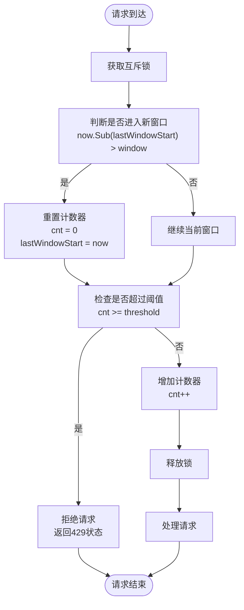
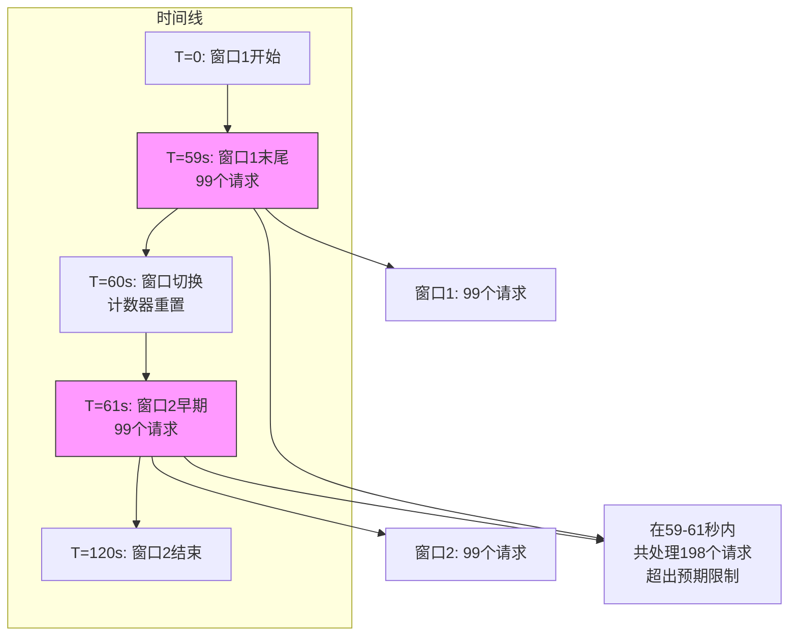

# 固定窗口限流

<cite>
**本文档中引用的文件**
- [fixedWindow.go](file://rpc/grpcx/limiter/fixedWindow/fixedWindow.go)
- [fixedWindow.go](file://webx/ginx/middleware/limitX/fixedWindow.go)
- [slidingWindow.go](file://rpc/grpcx/limiter/slidingWindow/slidingWindow.go)
- [slidingWindow.go](file://webx/ginx/middleware/limitX/slidingWindow.go)
- [redis_slide_window.go](file://limiter/redis_slide_window.go)
- [slide_window.lua](file://limiter/slide_window.lua)
</cite>

## 目录
1. [引言](#引言)
2. [核心组件分析](#核心组件分析)
3. [固定窗口限流器工作机制](#固定窗口限流器工作机制)
4. [临界问题分析](#临界问题分析)
5. [代码应用示例](#代码应用示例)
6. [与滑动窗口算法对比](#与滑动窗口算法对比)
7. [选型建议](#选型建议)

## 引言
固定窗口限流是一种简单高效的流量控制算法，用于限制系统在特定时间窗口内的请求处理数量。本文档深入分析`FixedWindowLimiter`结构体的实现机制，重点阐述其状态维护、窗口切换逻辑以及存在的临界问题，并与滑动窗口算法进行对比，为不同场景下的技术选型提供指导。

## 核心组件分析

`FixedWindowLimiter`结构体是固定窗口限流的核心实现，包含以下关键字段：

- **window**: 时间窗口大小，定义了限流统计的时间周期
- **lastWindowStart**: 当前窗口的起始时间戳，用于判断是否需要切换到新窗口
- **cnt**: 当前窗口内已处理的请求数量计数器
- **threshold**: 限流阈值，即窗口内允许的最大请求数
- **lock**: 互斥锁，用于保护共享状态的并发访问安全

该结构体在gRPC和Gin框架中均有实现，分别通过`BuildServerInterceptor`和`Build`方法构建相应的拦截器或中间件。

**Section sources**
- [fixedWindow.go](file://rpc/grpcx/limiter/fixedWindow/fixedWindow.go#L13-L20)
- [fixedWindow.go](file://webx/ginx/middleware/limitX/fixedWindow.go#L11-L17)

## 固定窗口限流器工作机制

固定窗口限流器的工作机制基于时间窗口的周期性重置。当请求到达时，系统首先获取当前时间，并与`lastWindowStart`进行比较，判断是否已经进入新的时间窗口。



**Diagram sources**
- [fixedWindow.go](file://rpc/grpcx/limiter/fixedWindow/fixedWindow.go#L38-L44)
- [fixedWindow.go](file://webx/ginx/middleware/limitX/fixedWindow.go#L30-L35)

在加锁后，算法通过`now.Sub(lastWindowStart) > window`判断是否进入新窗口。如果条件成立，则将`cnt`重置为0，并更新`lastWindowStart`为当前时间。这种机制确保了每个时间窗口独立计数，实现了基本的流量控制功能。

**Section sources**
- [fixedWindow.go](file://rpc/grpcx/limiter/fixedWindow/fixedWindow.go#L38-L44)
- [fixedWindow.go](file://webx/ginx/middleware/limitX/fixedWindow.go#L30-L35)

## 临界问题分析

固定窗口算法存在显著的"临界问题"（也称为"窗口跳跃问题"）。当一个窗口即将结束时，大量请求可能在旧窗口的末尾集中到达，随后在新窗口开始时又立即有大量请求到达。由于窗口切换时计数器被重置，这可能导致在极短时间内出现双倍于阈值的请求量。

例如，假设窗口大小为1分钟，阈值为100。在第59秒时，已有99个请求到达，此时系统仍允许新请求。在第60秒时，窗口切换，计数器重置，新的99个请求又可以立即通过。这样，在59-61秒这个2秒的时间段内，系统可能处理198个请求，远超预期的100个/分钟的限制。

这个问题可能导致突发流量冲击后端服务，造成系统过载或性能下降。特别是在高并发场景下，这种流量突增可能引发雪崩效应。



**Diagram sources**
- [fixedWindow.go](file://rpc/grpcx/limiter/fixedWindow/fixedWindow.go#L40-L44)
- [fixedWindow.go](file://webx/ginx/middleware/limitX/fixedWindow.go#L32-L35)

## 代码应用示例

固定窗口限流器在实际应用中通常作为中间件或拦截器使用。在gRPC场景中，通过`BuildServerInterceptor`方法创建服务端拦截器；在HTTP场景中，通过`Build`方法创建Gin中间件。

使用方式简单直观，只需指定窗口大小和阈值即可创建限流器实例。例如，创建一个每分钟最多处理100个请求的限流器：

```go
// gRPC场景
limiter := fixedWindow.NewFixedWindowLimiter(time.Minute, 100)
interceptor := limiter.BuildServerInterceptor()

// HTTP场景
builder := limitX.NewFixedWindowBuilder(time.Minute, 100)
middleware := builder.Build()
```

这种简单的API设计使得固定窗口限流器易于集成和使用，特别适合对实现复杂度敏感的场景。

**Section sources**
- [fixedWindow.go](file://rpc/grpcx/limiter/fixedWindow/fixedWindow.go#L23-L30)
- [fixedWindow.go](file://webx/ginx/middleware/limitX/fixedWindow.go#L22-L24)

## 与滑动窗口算法对比

与固定窗口相比，滑动窗口算法通过维护一个时间序列队列来实现更平滑的流量控制。滑动窗口算法的核心是`SlidingWindowLimiter`结构体，它使用优先队列存储请求时间戳，并在每次请求时清理过期记录。

```mermaid
classDiagram
class FixedWindowLimiter {
+window time.Duration
+lastWindowStart time.Time
+cnt int
+threshold int
+lock sync.Mutex
+BuildServerInterceptor() grpc.UnaryServerInterceptor
}
class SlidingWindowLimiter {
+window time.Duration
+threshold int
+queue *PriorityQueue[time.Time]
+lock sync.Mutex
+BuildServerInterceptor() grpc.UnaryServerInterceptor
+Allow() bool
+removeExpired() void
}
class RedisSlideWindowKLimiter {
+cmd redis.Cmdable
+prefix string
+interval time.Duration
+rate int
+requestIDCounter atomic.Uint64
+Limit() (bool, error)
+LimitWithRequestID() (bool, error)
}
note right of FixedWindowLimiter
实现简单
存在临界问题
适合简单场景
end
note left of SlidingWindowLimiter
实现较复杂
流量控制平滑
内存消耗较高
end
note right of RedisSlideWindowKLimiter
分布式支持
基于Lua脚本
高性能原子操作
end
```

**Diagram sources**
- [fixedWindow.go](file://rpc/grpcx/limiter/fixedWindow/fixedWindow.go#L13-L20)
- [slidingWindow.go](file://rpc/grpcx/limiter/slidingWindow/slidingWindow.go#L13-L19)
- [redis_slide_window.go](file://limiter/redis_slide_window.go#L20-L29)

固定窗口算法的优势在于实现简单、性能高、内存占用少。而滑动窗口算法虽然实现更复杂，但能提供更精确和平滑的流量控制，避免了临界问题。对于分布式场景，基于Redis的滑动窗口实现提供了跨节点的一致性保证。

**Section sources**
- [slidingWindow.go](file://rpc/grpcx/limiter/slidingWindow/slidingWindow.go#L13-L19)
- [redis_slide_window.go](file://limiter/redis_slide_window.go#L19-L29)
- [slide_window.lua](file://limiter/slide_window.lua#L1-L57)

## 选型建议

选择固定窗口还是滑动窗口算法应根据具体业务场景决定：

- **选择固定窗口算法**：当系统对实现复杂度敏感、流量模式相对平稳、可以容忍一定程度的流量突增时。适用于内部服务、开发环境或对成本控制要求较高的场景。

- **选择滑动窗口算法**：当需要精确的流量控制、业务对突发流量敏感、或处于生产环境的核心服务时。适用于对外API、支付系统等对稳定性要求极高的场景。

- **选择Redis滑动窗口**：当需要跨多个服务实例进行统一限流、或系统已经使用Redis作为基础设施时。适用于微服务架构、分布式系统等场景。

在实际应用中，建议通过监控和压测来评估不同算法的实际效果，根据系统的负载能力和业务需求做出最优选择。