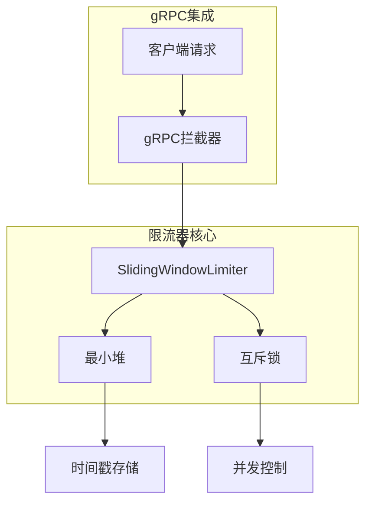
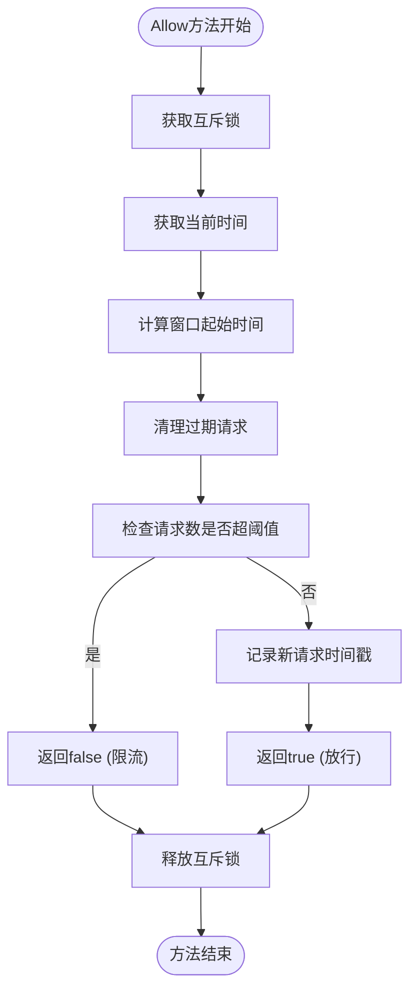
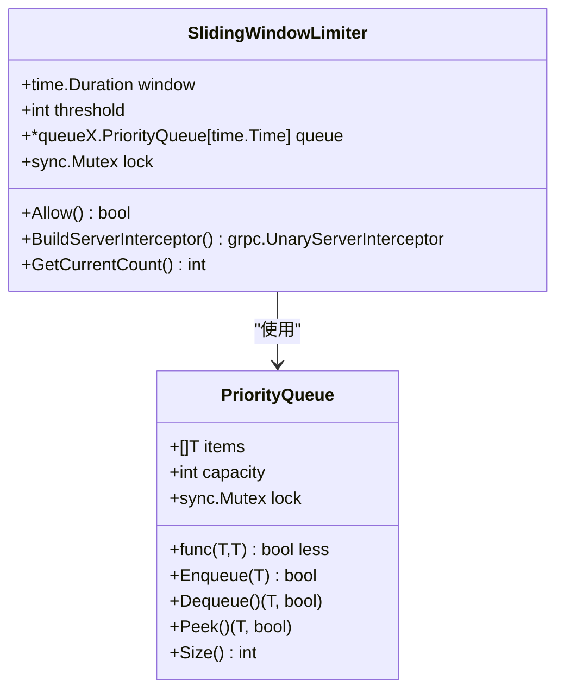
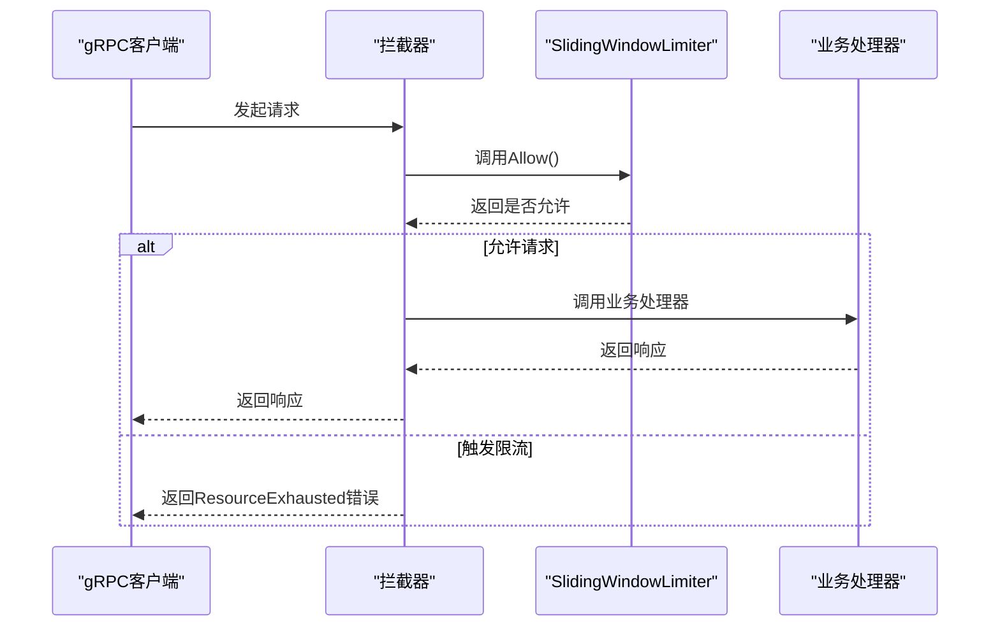
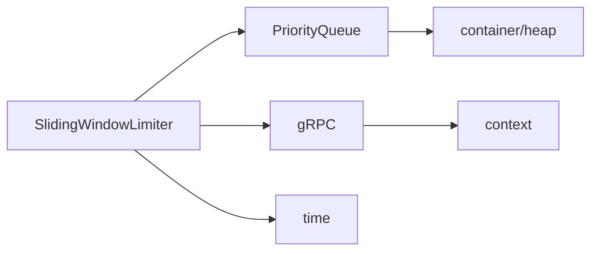

# 滑动窗口限流

<cite>
**本文档引用的文件**
- [slidingWindow.go](file://rpc/grpcx/limiter/slidingWindow/slidingWindow.go)
- [slidingWindow_test.go](file://rpc/grpcx/limiter/slidingWindow/slidingWindow_test.go)
- [queue.go](file://sliceX/queueX/queue.go)
- [fixedWindow.go](file://rpc/grpcx/limiter/fixedWindow/fixedWindow.go)
- [redis_slide_window.go](file://limiter/redis_slide_window.go)
- [slide_window.lua](file://limiter/slide_window.lua)
</cite>

## 目录
1. [简介](#简介)
2. [核心组件](#核心组件)
3. [架构概述](#架构概述)
4. [详细组件分析](#详细组件分析)
5. [依赖分析](#依赖分析)
6. [性能考虑](#性能考虑)
7. [故障排除指南](#故障排除指南)
8. [结论](#结论)

## 简介
本文档深入解析基于时间窗口的滑动窗口限流算法实现。重点说明`SlidingWindowLimiter`结构体如何利用最小堆（优先队列）存储请求时间戳，并通过`removeExpired`方法清理过期请求，确保窗口内统计的精确性。详细描述`Allow()`方法的三步逻辑：清理过期请求、检查阈值、记录新请求。解释`BuildServerInterceptor()`如何将限流器集成到gRPC拦截器链中，触发`ResourceExhausted`状态码返回。结合`TestSlidingWindowLimiterDirect`和`TestSlidingWindowEdgeCases`等测试用例，展示零阈值、大窗口等边界场景的处理。提供在API网关或核心服务中配置1秒2次请求等典型场景的使用示例，并对比其与固定窗口算法在流量平滑性上的优势。

## 核心组件

`SlidingWindowLimiter`是滑动窗口限流的核心结构体，它使用最小堆来维护请求时间戳，确保能够高效地清理过期请求并准确统计当前窗口内的请求数量。该限流器通过`Allow()`方法实现核心限流逻辑，并通过`BuildServerInterceptor()`方法与gRPC框架集成。

**核心组件来源**
- [slidingWindow.go](file://rpc/grpcx/limiter/slidingWindow/slidingWindow.go#L13-L19)

## 架构概述

滑动窗口限流器的架构基于最小堆数据结构，通过时间戳排序来维护请求记录。当新请求到来时，首先清理过期的时间戳，然后检查当前请求数是否超过阈值，最后将新请求的时间戳加入堆中。这种设计确保了限流判断的准确性，避免了固定窗口算法在窗口切换时可能出现的流量突刺问题。

**架构来源**
- [slidingWindow.go](file://rpc/grpcx/limiter/slidingWindow/slidingWindow.go#L13-L19)
- [queue.go](file://sliceX/queueX/queue.go#L8-L14)

## 详细组件分析

### SlidingWindowLimiter 结构体分析

`SlidingWindowLimiter`结构体包含四个关键字段：`window`表示统计窗口大小，`threshold`表示窗口内允许的最大请求数，`queue`是存储请求时间戳的最小堆，`lock`用于保护队列操作的并发安全。

#### 核心方法流程图

**流程图来源**
- [slidingWindow.go](file://rpc/grpcx/limiter/slidingWindow/slidingWindow.go#L52-L78)

#### 类图展示

**类图来源**
- [slidingWindow.go](file://rpc/grpcx/limiter/slidingWindow/slidingWindow.go#L13-L19)
- [queue.go](file://sliceX/queueX/queue.go#L8-L14)

### Allow方法三步逻辑详解

`Allow()`方法的执行遵循严格的三步逻辑：

1. **清理过期请求**：通过`removeExpired`方法删除所有早于当前窗口起始时间的时间戳
2. **检查阈值**：比较当前队列大小与阈值，若超过则拒绝请求
3. **记录新请求**：将当前请求的时间戳加入优先队列

这种顺序确保了统计的准确性，避免了因未清理过期请求而导致的误判。

**方法逻辑来源**
- [slidingWindow.go](file://rpc/grpcx/limiter/slidingWindow/slidingWindow.go#L59-L77)

### gRPC拦截器集成分析

`BuildServerInterceptor()`方法将限流器集成到gRPC拦截器链中，当请求被限流时返回`ResourceExhausted`状态码，便于客户端识别限流情况。

**序列图来源**
- [slidingWindow.go](file://rpc/grpcx/limiter/slidingWindow/slidingWindow.go#L38-L47)

## 依赖分析

滑动窗口限流器依赖于优先队列实现高效的时间戳管理，同时与gRPC框架紧密集成以提供服务端拦截功能。

**依赖来源**
- [slidingWindow.go](file://rpc/grpcx/limiter/slidingWindow/slidingWindow.go#L3-L11)
- [queue.go](file://sliceX/queueX/queue.go#L3-L6)

## 性能考虑

滑动窗口限流器的性能主要受最小堆操作的影响。入队和出队操作的时间复杂度为O(log n)，其中n为队列中的元素数量。在高并发场景下，互斥锁可能成为性能瓶颈，但通过合理的窗口大小设置可以控制队列规模。

与固定窗口算法相比，滑动窗口虽然计算开销稍大，但提供了更平滑的流量控制，避免了固定窗口在边界处可能出现的双倍流量冲击。

**性能对比来源**
- [slidingWindow.go](file://rpc/grpcx/limiter/slidingWindow/slidingWindow.go)
- [fixedWindow.go](file://rpc/grpcx/limiter/fixedWindow/fixedWindow.go)

## 故障排除指南

### 常见问题及解决方案

| 问题现象 | 可能原因 | 解决方案 |
|--------|--------|--------|
| 请求被意外限流 | 阈值设置过低 | 调整threshold参数 |
| 内存占用过高 | 窗口设置过大 | 减小window参数或优化清理逻辑 |
| 并发性能下降 | 锁竞争激烈 | 考虑使用分片限流或分布式限流 |

### 边界场景测试验证

通过`TestSlidingWindowEdgeCases`测试用例验证了以下边界情况：

- **零阈值测试**：验证当阈值为0时所有请求都被正确限流
- **大窗口测试**：验证大时间窗口下的限流准确性

**测试来源**
- [slidingWindow_test.go](file://rpc/grpcx/limiter/slidingWindow/slidingWindow_test.go#L191-L240)

## 结论

滑动窗口限流算法通过最小堆数据结构实现了精确的请求统计，相比固定窗口算法提供了更平滑的流量控制。`SlidingWindowLimiter`的设计充分考虑了并发安全和性能平衡，通过gRPC拦截器的集成方式便于在微服务架构中部署使用。在实际应用中，建议根据业务需求合理配置窗口大小和阈值，并结合监控系统观察限流效果。

对于分布式场景，可参考`RedisSlideWindowKLimiter`实现，利用Redis的有序集合和Lua脚本提供跨节点的一致性限流能力。