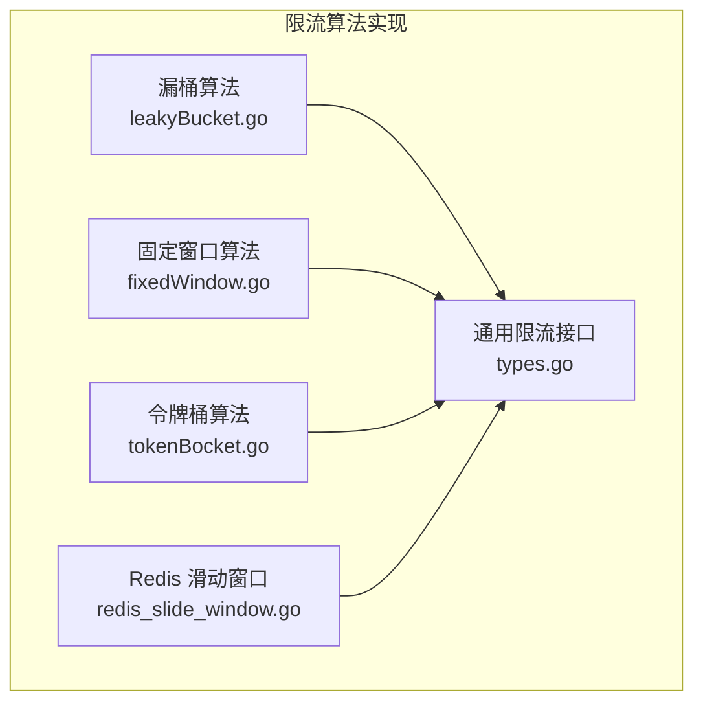
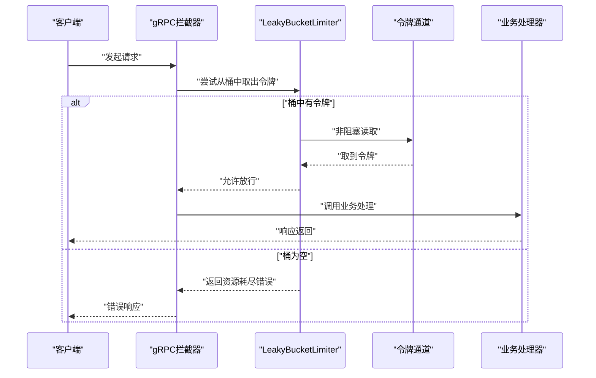
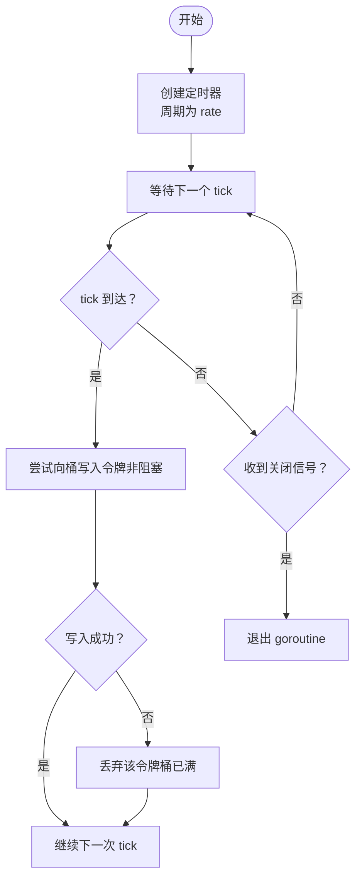
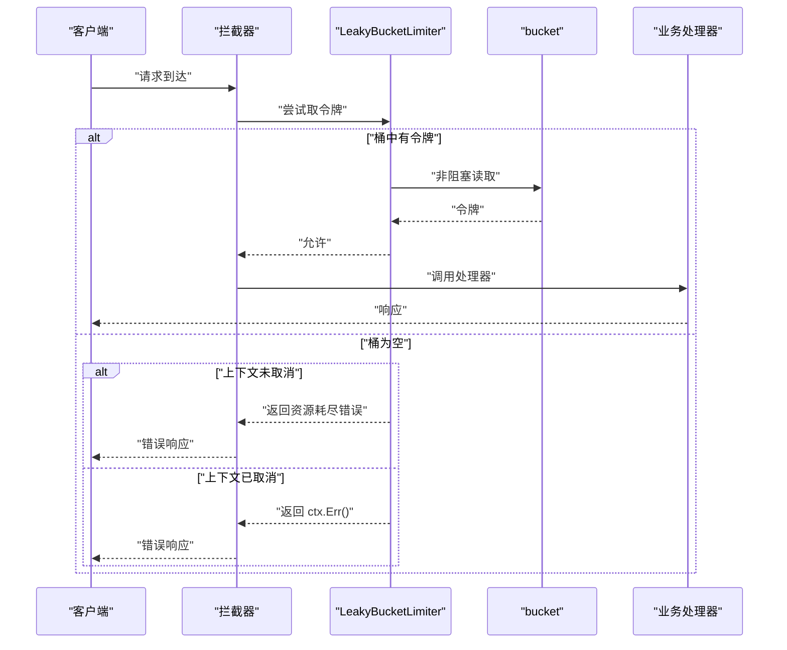
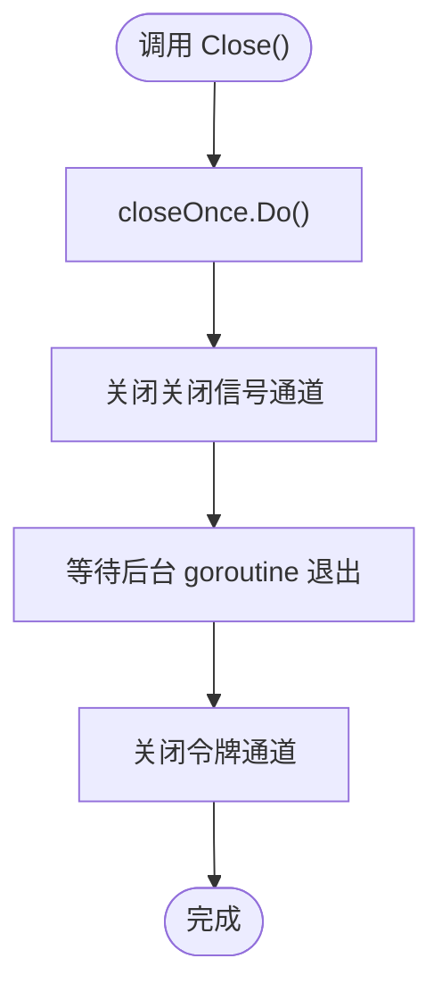
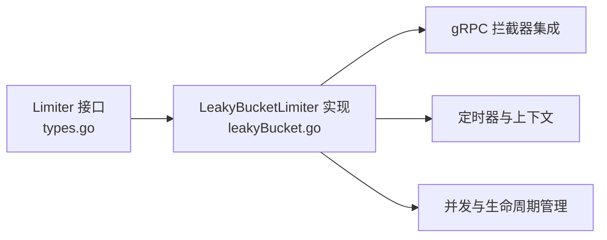

# 漏桶限流

<cite>
**本文引用的文件列表**
- [leakyBucket.go](file://rpc/grpcx/limiter/leakyBucket/leakyBucket.go)
- [leakyBucket_help](file://rpc/grpcx/limiter/leakyBucket/leakyBucket_help)
- [types.go](file://limiter/types.go)
- [fixedWindow.go](file://rpc/grpcx/limiter/fixedWindow/fixedWindow.go)
- [tokenBocket.go](file://rpc/grpcx/limiter/tokenBucket/tokenBocket.go)
- [redis_slide_window.go](file://limiter/redis_slide_window.go)
- [README.md](file://README.md)
</cite>

## 目录
1. [引言](#引言)
2. [项目结构](#项目结构)
3. [核心组件](#核心组件)
4. [架构总览](#架构总览)
5. [详细组件分析](#详细组件分析)
6. [依赖关系分析](#依赖关系分析)
7. [性能考量](#性能考量)
8. [故障排查指南](#故障排查指南)
9. [结论](#结论)
10. [附录](#附录)

## 引言
本文件围绕“漏桶限流”算法在 gRPC 场景中的实现进行系统化解析，重点阐述 LeakyBucketLimiter 如何利用带缓冲的 channel 作为“桶”，通过后台 goroutine 以固定速率持续向桶中添加令牌，从而将突发流量整形为匀速流出；同时说明 Allow() 与 BuildServerInterceptor() 如何通过非阻塞地从桶中取出令牌来判断是否允许请求；解释 capacity 参数对突发容忍度的影响；并给出优雅关闭 Close() 的实现细节与适用场景的配置建议。

## 项目结构
本仓库提供了多种限流算法的实现，其中与漏桶相关的核心位于 rpc/grpcx/limiter/leakyBucket 目录，配套还包含通用限流接口、固定窗口、令牌桶、Redis 滑动窗口等实现，便于横向对比与选型。



图表来源
- [leakyBucket.go](file://rpc/grpcx/limiter/leakyBucket/leakyBucket.go#L1-L127)
- [fixedWindow.go](file://rpc/grpcx/limiter/fixedWindow/fixedWindow.go#L1-L61)
- [tokenBocket.go](file://rpc/grpcx/limiter/tokenBucket/tokenBocket.go#L1-L70)
- [redis_slide_window.go](file://limiter/redis_slide_window.go#L1-L193)
- [types.go](file://limiter/types.go#L1-L10)

章节来源
- [README.md](file://README.md#L1-L126)

## 核心组件
- LeakyBucketLimiter：漏桶限流器主体，包含容量 capacity、漏水速率 rate、令牌通道 bucket、关闭信号 closeCh、关闭保护 closeOnce、等待组 wg。
- BuildServerInterceptor：构建 gRPC 服务端拦截器，每次请求尝试从 bucket 中取出一个令牌，成功则放行，否则返回资源耗尽错误。
- Allow/AllowWithTimeout：非 gRPC 场景下的检查入口，允许外部在业务逻辑中自行决定是否放行或等待。
- Close：优雅关闭后台 goroutine，等待其退出并关闭 bucket，避免资源泄漏。

章节来源
- [leakyBucket.go](file://rpc/grpcx/limiter/leakyBucket/leakyBucket.go#L1-L127)

## 架构总览
漏桶限流通过“后台定时发令牌 + 请求侧取令牌”的方式，将瞬时高并发削峰填谷，形成稳定的平均吞吐。下图展示了关键交互流程。



图表来源
- [leakyBucket.go](file://rpc/grpcx/limiter/leakyBucket/leakyBucket.go#L76-L92)

## 详细组件分析

### LeakyBucketLimiter 类与字段
- 字段职责
  - capacity：桶容量，决定可累积的令牌数量，体现对突发的容忍度。
  - rate：漏水速率，即定时向桶中添加令牌的时间间隔，决定稳定吞吐。
  - bucket：带缓冲的 channel，作为“桶”，存放令牌。
  - closeCh：关闭信号，用于通知后台 goroutine 退出。
  - closeOnce：保证关闭动作只执行一次。
  - wg：等待后台 goroutine 退出，确保资源安全回收。
- 初始化与启动
  - NewLeakyBucketLimiter 对 capacity 与 rate 进行边界校验与默认值设置，并创建 bucket 与 closeCh。
  - 启动后台 goroutine leakWater，周期性向 bucket 添加令牌，直至收到 closeCh。

```mermaid
classDiagram
class LeakyBucketLimiter {
+int capacity
+time.Duration rate
+chan struct{} bucket
+chan struct{} closeCh
+sync.Once closeOnce
+sync.WaitGroup wg
+NewLeakyBucketLimiter(capacity, rate) LeakyBucketLimiter
+leakWater() void
+BuildServerInterceptor() UnaryServerInterceptor
+Allow(ctx) bool
+AllowWithTimeout(timeout) bool
+Close() error
}
```

图表来源
- [leakyBucket.go](file://rpc/grpcx/limiter/leakyBucket/leakyBucket.go#L1-L127)

章节来源
- [leakyBucket.go](file://rpc/grpcx/limiter/leakyBucket/leakyBucket.go#L13-L50)
- [leakyBucket.go](file://rpc/grpcx/limiter/leakyBucket/leakyBucket.go#L52-L74)

### 漏水过程 leakWater：令牌生成与桶满处理
- 定时器：以 rate 为周期创建 ticker，循环等待 tick。
- 令牌添加：每次 tick 时尝试向 bucket 写入一个令牌（struct{}），采用非阻塞写入。
- 桶满策略：当 bucket 已满时，写入会失败，此时丢弃该令牌，保持桶容量不变。
- 优雅退出：监听 closeCh，收到关闭信号后立即返回，wg.Done() 使 Close() 能够等待 goroutine 完全退出。



图表来源
- [leakyBucket.go](file://rpc/grpcx/limiter/leakyBucket/leakyBucket.go#L52-L74)

章节来源
- [leakyBucket.go](file://rpc/grpcx/limiter/leakyBucket/leakyBucket.go#L52-L74)

### 允许请求：BuildServerInterceptor 与 Allow
- BuildServerInterceptor
  - 在拦截器内部，尝试从 bucket 中取出一个令牌。
  - 若成功取出，则允许继续调用业务处理器 handler。
  - 若桶为空且未超时，则返回资源耗尽错误，提示桶容量与漏水速率。
  - 若 ctx 已取消，则返回 ctx.Err()。
- Allow/AllowWithTimeout
  - Allow 直接尝试从 bucket 取令牌，成功返回 true，否则 false。
  - AllowWithTimeout 在给定超时时间内尝试取令牌，若超时仍未取到则返回 false。



图表来源
- [leakyBucket.go](file://rpc/grpcx/limiter/leakyBucket/leakyBucket.go#L76-L92)
- [leakyBucket.go](file://rpc/grpcx/limiter/leakyBucket/leakyBucket.go#L104-L114)
- [leakyBucket.go](file://rpc/grpcx/limiter/leakyBucket/leakyBucket.go#L116-L127)

章节来源
- [leakyBucket.go](file://rpc/grpcx/limiter/leakyBucket/leakyBucket.go#L76-L92)
- [leakyBucket.go](file://rpc/grpcx/limiter/leakyBucket/leakyBucket.go#L104-L114)
- [leakyBucket.go](file://rpc/grpcx/limiter/leakyBucket/leakyBucket.go#L116-L127)

### 优雅关闭：Close 与资源回收
- 关闭流程
  - closeOnce 保证只执行一次关闭。
  - 关闭 closeCh，通知后台 goroutine 退出。
  - wg.Wait 等待后台 goroutine 完成清理。
  - 关闭 bucket，防止后续读写 panic。
- 作用
  - 避免 goroutine 泄漏与 channel 读写异常。
  - 保证 Close() 可重复调用但仅生效一次。



图表来源
- [leakyBucket.go](file://rpc/grpcx/limiter/leakyBucket/leakyBucket.go#L94-L102)

章节来源
- [leakyBucket.go](file://rpc/grpcx/limiter/leakyBucket/leakyBucket.go#L94-L102)

### 与其它限流算法的对比
- 固定窗口
  - 特点：以固定时间窗口统计请求数，超过阈值则限流。
  - 优点：实现简单，适合平滑流量。
  - 缺点：窗口边界处可能出现突发。
- 令牌桶
  - 特点：以固定速率产生令牌，桶满则丢弃；请求消耗令牌。
  - 优点：允许短期突发，吞吐稳定。
  - 缺点：突发能力受桶容量限制。
- 漏桶
  - 特点：恒定速率处理请求，桶满则丢弃请求。
  - 优点：输出速率恒定，非常适合对外部服务的速率约束。
  - 缺点：无法接受突发，对突发流量较为严格。

章节来源
- [fixedWindow.go](file://rpc/grpcx/limiter/fixedWindow/fixedWindow.go#L1-L61)
- [tokenBocket.go](file://rpc/grpcx/limiter/tokenBucket/tokenBocket.go#L1-L70)

## 依赖关系分析
- 接口层
  - limiter/types.go 定义了通用的 Limiter 接口，便于替换不同限流实现。
- 实现层
  - LeakyBucketLimiter 实现 Limiter 接口，提供 BuildServerInterceptor 与 Allow 等方法。
- 外部依赖
  - gRPC：用于构建拦截器与错误码。
  - time：用于定时器与上下文超时控制。
  - sync：用于并发安全与 goroutine 生命周期管理。



图表来源
- [types.go](file://limiter/types.go#L1-L10)
- [leakyBucket.go](file://rpc/grpcx/limiter/leakyBucket/leakyBucket.go#L1-L127)

章节来源
- [types.go](file://limiter/types.go#L1-L10)
- [leakyBucket.go](file://rpc/grpcx/limiter/leakyBucket/leakyBucket.go#L1-L127)

## 性能考量
- 令牌生成成本
  - leakWater 使用 ticker 以固定间隔向桶中写入令牌，开销极低，主要为 channel 写入与少量调度成本。
- 令牌消费成本
  - 每次请求从 bucket 读取令牌为非阻塞操作，开销很小。
- 并发安全性
  - bucket 为带缓冲 channel，内部已具备并发安全；closeCh 与 wg 确保 goroutine 生命周期可控。
- 资源回收
  - Close() 顺序关闭 closeCh、等待 goroutine、关闭 bucket，避免资源泄漏与竞态。

[本节为通用性能讨论，无需特定文件引用]

## 故障排查指南
- 常见问题
  - 请求频繁被限流：检查 capacity 是否过小或 rate 是否过大，导致桶长期为空。
  - goroutine 泄漏：确认 Close() 是否被调用，closeOnce 是否生效。
  - 上下游不一致：确认业务侧是否正确使用 BuildServerInterceptor 或 Allow。
- 定位手段
  - 观察拦截器返回的资源耗尽错误信息，确认桶容量与漏水速率配置。
  - 在业务侧增加日志，记录 Allow/AllowWithTimeout 的返回值与 ctx 状态。

章节来源
- [leakyBucket.go](file://rpc/grpcx/limiter/leakyBucket/leakyBucket.go#L76-L92)
- [leakyBucket.go](file://rpc/grpcx/limiter/leakyBucket/leakyBucket.go#L94-L102)

## 结论
漏桶限流通过“后台定时发令牌 + 请求侧取令牌”的机制，将突发流量整形为恒定速率输出，非常适合对外部服务的速率约束与保护。LeakyBucketLimiter 的设计简洁高效：以带缓冲 channel 作为桶，后台 goroutine 以固定速率填充令牌；拦截器与 Allow 方法通过非阻塞读取判断是否放行；Close() 提供优雅关闭保障。对于需要严格控制请求速率的场景（如 API 调用频率），建议结合业务峰值与 SLA，合理设置 capacity 与 rate，以平衡稳定性与吞吐。

[本节为总结性内容，无需特定文件引用]

## 附录

### 配置建议（适用于严格控制请求速率的场景）
- capacity
  - 作用：允许短期内累积的令牌数量，体现对突发的容忍度。
  - 建议：根据业务峰值与平均速率之比设定，避免过小导致频繁限流，过大则失去整形意义。
- rate
  - 作用：令牌生成的最小间隔，决定稳定吞吐。
  - 建议：以目标 QPS 的倒数作为参考，结合系统承载能力与下游服务压力调整。
- 与其它算法的选型
  - 若需允许短期突发，优先考虑令牌桶。
  - 若需严格的恒定速率输出，优先考虑漏桶。
  - 若需平滑统计与边界处理，可考虑固定窗口或滑动窗口。

章节来源
- [leakyBucket.go](file://rpc/grpcx/limiter/leakyBucket/leakyBucket.go#L13-L50)
- [leakyBucket_help](file://rpc/grpcx/limiter/leakyBucket/leakyBucket_help#L1-L10)
- [fixedWindow.go](file://rpc/grpcx/limiter/fixedWindow/fixedWindow.go#L1-L61)
- [tokenBocket.go](file://rpc/grpcx/limiter/tokenBucket/tokenBocket.go#L1-L70)
- [redis_slide_window.go](file://limiter/redis_slide_window.go#L1-L193)