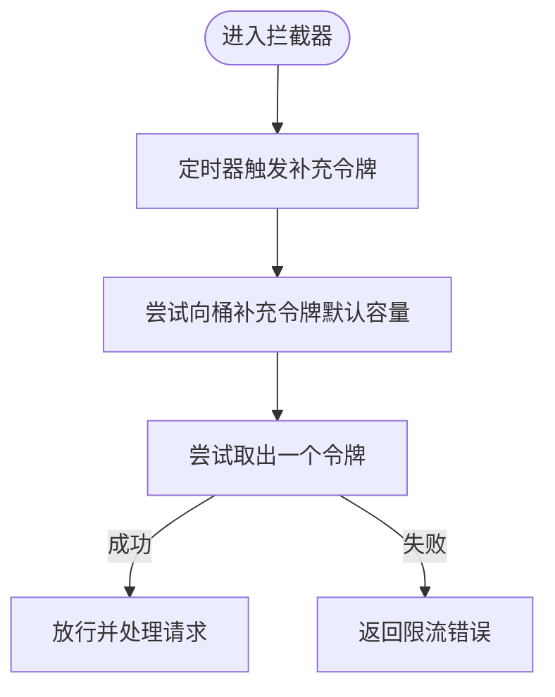

# 限流策略

<cite>
**本文引用的文件**
- [limiter/types.go](file://limiter/types.go)
- [limiter/redis_slide_window.go](file://limiter/redis_slide_window.go)
- [limiter/slide_window.lua](file://limiter/slide_window.lua)
- [rpc/grpcx/limiter/slidingWindow/slidingWindow.go](file://rpc/grpcx/limiter/slidingWindow/slidingWindow.go)
- [rpc/grpcx/limiter/fixedWindow/fixedWindow.go](file://rpc/grpcx/limiter/fixedWindow/fixedWindow.go)
- [rpc/grpcx/limiter/leakyBucket/leakyBucket.go](file://rpc/grpcx/limiter/leakyBucket/leakyBucket.go)
- [rpc/grpcx/limiter/tokenBucket/tokenBocket.go](file://rpc/grpcx/limiter/tokenBucket/tokenBocket.go)
- [rpc/grpcx/limiter/counterLiniter/counterLimiter.go](file://rpc/grpcx/limiter/counterLiniter/counterLimiter.go)
- [sliceX/queueX/queue.go](file://sliceX/queueX/queue.go)
- [rpc/grpcx/limiter/limiter_help](file://rpc/grpcx/limiter/limiter_help)
- [rpc/grpcx/limiter/slidingWindow/slidingWindow_test.go](file://rpc/grpcx/limiter/slidingWindow/slidingWindow_test.go)
- [README.md](file://README.md)
</cite>

## 目录
1. [引言](#引言)
2. [项目结构](#项目结构)
3. [核心组件](#核心组件)
4. [架构总览](#架构总览)
5. [详细组件分析](#详细组件分析)
6. [依赖关系分析](#依赖关系分析)
7. [性能考量](#性能考量)
8. [故障排查指南](#故障排查指南)
9. [结论](#结论)
10. [附录](#附录)

## 引言
本文件系统化梳理 gRPC 层限流器的多种实现方式，重点剖析基于时间片的滑动窗口算法在本地与分布式两种形态中的实现细节，对比固定窗口、漏桶、令牌桶与计数器等算法在突发流量处理、精度与资源消耗上的差异，并说明如何通过拦截器将限流器集成到 gRPC 服务中，支持链式调用。最后给出不同场景下的选型建议与配置要点，并提供性能压测参考路径。

## 项目结构
围绕 gRPC 限流，仓库提供了多算法实现与配套测试，核心位于 rpc/grpcx/limiter 下，同时提供基于 Redis 的滑动窗口实现与 Lua 脚本，配合通用 Limiter 接口抽象。

图表来源
- [rpc/grpcx/limiter/slidingWindow/slidingWindow.go](file://rpc/grpcx/limiter/slidingWindow/slidingWindow.go#L1-L105)
- [rpc/grpcx/limiter/fixedWindow/fixedWindow.go](file://rpc/grpcx/limiter/fixedWindow/fixedWindow.go#L1-L61)
- [rpc/grpcx/limiter/leakyBucket/leakyBucket.go](file://rpc/grpcx/limiter/leakyBucket/leakyBucket.go#L1-L127)
- [rpc/grpcx/limiter/tokenBucket/tokenBocket.go](file://rpc/grpcx/limiter/tokenBucket/tokenBocket.go#L1-L70)
- [rpc/grpcx/limiter/counterLiniter/counterLimiter.go](file://rpc/grpcx/limiter/counterLiniter/counterLimiter.go#L1-L46)
- [limiter/types.go](file://limiter/types.go#L1-L10)
- [sliceX/queueX/queue.go](file://sliceX/queueX/queue.go#L1-L204)
- [limiter/redis_slide_window.go](file://limiter/redis_slide_window.go#L1-L193)
- [limiter/slide_window.lua](file://limiter/slide_window.lua#L1-L57)

章节来源
- [rpc/grpcx/limiter/limiter_help](file://rpc/grpcx/limiter/limiter_help)
- [README.md](file://README.md#L84-L93)

## 核心组件
- 通用接口 Limiter：统一 Limit(ctx, key) 签名，返回是否触发限流与错误。
- 滑动窗口（本地）：基于最小堆维护窗口内请求时间戳，支持链式拦截器。
- 固定窗口：按时间窗口计数，简单但存在边界突变风险。
- 漏桶：恒定速率出水，突发被拒绝，适合削峰。
- 令牌桶：突发可达桶容，稳定速率补充令牌，适合突发与平滑混合场景。
- 计数器并发：限制正在处理的并发请求数，适合保护核心资源。
- Redis 滑动窗口：基于 ZSET + Lua 的分布式滑动窗口，支持唯一请求 ID 与过期清理。

章节来源
- [limiter/types.go](file://limiter/types.go#L1-L10)
- [rpc/grpcx/limiter/slidingWindow/slidingWindow.go](file://rpc/grpcx/limiter/slidingWindow/slidingWindow.go#L1-L105)
- [rpc/grpcx/limiter/fixedWindow/fixedWindow.go](file://rpc/grpcx/limiter/fixedWindow/fixedWindow.go#L1-L61)
- [rpc/grpcx/limiter/leakyBucket/leakyBucket.go](file://rpc/grpcx/limiter/leakyBucket/leakyBucket.go#L1-L127)
- [rpc/grpcx/limiter/tokenBucket/tokenBocket.go](file://rpc/grpcx/limiter/tokenBucket/tokenBocket.go#L1-L70)
- [rpc/grpcx/limiter/counterLiniter/counterLimiter.go](file://rpc/grpcx/limiter/counterLiniter/counterLimiter.go#L1-L46)
- [limiter/redis_slide_window.go](file://limiter/redis_slide_window.go#L1-L193)
- [limiter/slide_window.lua](file://limiter/slide_window.lua#L1-L57)

## 架构总览
下图展示 gRPC 服务端拦截器如何串联多个限流器与可观测性中间件，形成链式调用。

图表来源
- [rpc/grpcx/limiter/limiter_help](file://rpc/grpcx/limiter/limiter_help)
- [rpc/grpcx/limiter/slidingWindow/slidingWindow_test.go](file://rpc/grpcx/limiter/slidingWindow/slidingWindow_test.go#L80-L90)

## 详细组件分析

### 滑动窗口（本地）算法
- 精度与原理
  - 使用最小堆存储窗口内的请求时间戳，队首为最早请求。
  - 每次请求先清理过期时间戳，再判断当前窗口内数量是否超过阈值，未超则入队当前时间戳。
  - 通过窗口大小与阈值控制每单位时间内的请求数，避免固定窗口在边界处的突变。
- 关键流程
  - 构造函数初始化窗口时长与阈值，并创建最小堆。
  - Allow() 在加锁下执行清理、计数与入队。
  - BuildServerInterceptor() 返回 UnaryServerInterceptor，内部直接调用 Allow() 并在超限时返回资源耗尽错误。
- 复杂度与资源
  - 时间复杂度：清理过期 O(k)，k 为过期请求数；入队/Peek/Dequeue 均为 O(log n)。
  - 空间复杂度：O(n)，n 为窗口内请求数。
- 适用场景
  - 需要平滑限流、避免边界突变的场景；对 CPU 与内存有一定占用，适合单机服务或轻量级限流。

图表来源
- [rpc/grpcx/limiter/slidingWindow/slidingWindow.go](file://rpc/grpcx/limiter/slidingWindow/slidingWindow.go#L49-L78)
- [sliceX/queueX/queue.go](file://sliceX/queueX/queue.go#L139-L150)

章节来源
- [rpc/grpcx/limiter/slidingWindow/slidingWindow.go](file://rpc/grpcx/limiter/slidingWindow/slidingWindow.go#L1-L105)
- [sliceX/queueX/queue.go](file://sliceX/queueX/queue.go#L1-L204)
- [rpc/grpcx/limiter/slidingWindow/slidingWindow_test.go](file://rpc/grpcx/limiter/slidingWindow/slidingWindow_test.go#L27-L67)

### 固定窗口算法
- 原理
  - 以固定时长为窗口，累计窗口内请求数，超过阈值则限流。
  - 新窗口开始时重置计数器。
- 特点
  - 实现简单，CPU 占用低；但在窗口边界存在“瞬时爆发”风险。
- 适用场景
  - 对精度要求不高、追求极简与低开销的场景。

图表来源
- [rpc/grpcx/limiter/fixedWindow/fixedWindow.go](file://rpc/grpcx/limiter/fixedWindow/fixedWindow.go#L32-L61)

章节来源
- [rpc/grpcx/limiter/fixedWindow/fixedWindow.go](file://rpc/grpcx/limiter/fixedWindow/fixedWindow.go#L1-L61)

### 漏桶算法
- 原理
  - 固定容量的桶，以恒定速率向桶中添加令牌（漏水），请求需取出一个令牌才可处理。
  - 桶空则拒绝请求，从而削峰填谷。
- 特点
  - 抗突发能力弱，但能稳定输出速率。
- 适用场景
  - 需要稳定速率输出、削峰填谷的场景。

图表来源
- [rpc/grpcx/limiter/leakyBucket/leakyBucket.go](file://rpc/grpcx/limiter/leakyBucket/leakyBucket.go#L76-L92)

章节来源
- [rpc/grpcx/limiter/leakyBucket/leakyBucket.go](file://rpc/grpcx/limiter/leakyBucket/leakyBucket.go#L1-L127)

### 令牌桶算法
- 原理
  - 以固定间隔向桶中补充令牌，请求取出令牌后处理；桶满则丢弃多余令牌。
- 特点
  - 允许突发，但长期保持平均速率；实现与漏桶类似，但补充令牌的方式不同。
- 适用场景
  - 需要短时突发与长期稳定结合的场景。

图表来源
- [rpc/grpcx/limiter/tokenBucket/tokenBocket.go](file://rpc/grpcx/limiter/tokenBucket/tokenBocket.go#L31-L63)

章节来源
- [rpc/grpcx/limiter/tokenBucket/tokenBocket.go](file://rpc/grpcx/limiter/tokenBucket/tokenBocket.go#L1-L70)

### 计数器并发算法
- 原理
  - 使用原子计数器跟踪当前正在处理的请求数，超过阈值则拒绝新请求，并在处理完成后递减计数。
- 特点
  - 保护核心资源，避免过载；对瞬时并发敏感。
- 适用场景
  - 保护核心服务、数据库连接池、CPU/内存密集型任务等。

图表来源
- [rpc/grpcx/limiter/counterLiniter/counterLimiter.go](file://rpc/grpcx/limiter/counterLiniter/counterLimiter.go#L22-L46)

章节来源
- [rpc/grpcx/limiter/counterLiniter/counterLimiter.go](file://rpc/grpcx/limiter/counterLiniter/counterLimiter.go#L1-L46)

### 分布式滑动窗口（Redis + Lua）
- 原理
  - 使用 Redis ZSET 存储窗口内请求的时间戳作为 score，member 为唯一请求 ID。
  - Lua 脚本一次性完成清理过期、计数、插入与过期设置，保证原子性。
- 关键点
  - 通过 ZREMRANGEBYSCORE 清理过期条目，ZCOUNT 统计窗口内数量。
  - 通过 TIME 命令生成唯一 member，避免重复。
  - 设置过期时间为窗口的两倍，避免内存泄漏。
- 适用场景
  - 多实例部署、跨进程/跨节点的一致限流。

图表来源
- [limiter/redis_slide_window.go](file://limiter/redis_slide_window.go#L65-L114)
- [limiter/slide_window.lua](file://limiter/slide_window.lua#L1-L57)

章节来源
- [limiter/redis_slide_window.go](file://limiter/redis_slide_window.go#L1-L193)
- [limiter/slide_window.lua](file://limiter/slide_window.lua#L1-L57)

## 依赖关系分析
- 组件耦合
  - 所有算法均实现通用 Limiter 接口，便于替换与组合。
  - 滑动窗口本地实现依赖优先队列，具备线程安全封装。
  - 分布式滑动窗口依赖 Redis 与 Lua 脚本，保证原子性与一致性。
- 链式调用
  - gRPC 支持 grpc.ChainUnaryInterceptor，可将日志、限流、监控等拦截器串联。

图表来源
- [limiter/types.go](file://limiter/types.go#L1-L10)
- [rpc/grpcx/limiter/slidingWindow/slidingWindow.go](file://rpc/grpcx/limiter/slidingWindow/slidingWindow.go#L1-L105)
- [rpc/grpcx/limiter/fixedWindow/fixedWindow.go](file://rpc/grpcx/limiter/fixedWindow/fixedWindow.go#L1-L61)
- [rpc/grpcx/limiter/leakyBucket/leakyBucket.go](file://rpc/grpcx/limiter/leakyBucket/leakyBucket.go#L1-L127)
- [rpc/grpcx/limiter/tokenBucket/tokenBocket.go](file://rpc/grpcx/limiter/tokenBucket/tokenBocket.go#L1-L70)
- [rpc/grpcx/limiter/counterLiniter/counterLimiter.go](file://rpc/grpcx/limiter/counterLiniter/counterLimiter.go#L1-L46)

章节来源
- [rpc/grpcx/limiter/limiter_help](file://rpc/grpcx/limiter/limiter_help)

## 性能考量
- CPU 与内存
  - 滑动窗口本地：每次清理过期与堆操作，CPU 与内存占用适中，适合中小规模并发。
  - 固定窗口：最轻量，CPU 占用最低。
  - 漏桶：恒定速率，CPU 占用低，但抗突发能力弱。
  - 令牌桶：补充令牌与取令牌操作简单，适合突发与稳定兼顾。
  - 计数器并发：原子操作，CPU 占用低，适合保护核心资源。
- 分布式一致性
  - Redis 滑动窗口通过 Lua 原子脚本保证一致性，避免竞态；注意网络延迟与脚本执行时间。
- 并发与锁
  - 本地滑动窗口与固定窗口使用互斥锁保护共享状态；令牌桶与漏桶使用通道与定时器，避免锁竞争。
- 压测参考
  - 可参考滑动窗口测试用例中的并发压力与窗口滑动验证，结合实际业务 QPS 与 P99 延迟目标进行调参。

章节来源
- [rpc/grpcx/limiter/slidingWindow/slidingWindow_test.go](file://rpc/grpcx/limiter/slidingWindow/slidingWindow_test.go#L134-L179)
- [limiter/redis_slide_window.go](file://limiter/redis_slide_window.go#L65-L114)

## 故障排查指南
- 常见问题
  - 限流频繁：检查阈值与窗口是否过小；确认是否存在突发流量或边界抖动。
  - 资源泄漏：令牌桶与漏桶需在关闭时停止定时器与 goroutine，确保 Close() 被调用。
  - 分布式一致性：确认 Redis 可用性与 Lua 脚本执行结果解析。
- 定位手段
  - 通过拦截器返回的 ResourceExhausted 错误定位限流触发点。
  - 使用链式拦截器串联日志与监控，观察限流发生前后指标变化。
- 测试验证
  - 参考滑动窗口测试用例，验证窗口滑动与边界行为。

章节来源
- [rpc/grpcx/limiter/leakyBucket/leakyBucket.go](file://rpc/grpcx/limiter/leakyBucket/leakyBucket.go#L94-L102)
- [rpc/grpcx/limiter/tokenBucket/tokenBocket.go](file://rpc/grpcx/limiter/tokenBucket/tokenBocket.go#L64-L70)
- [rpc/grpcx/limiter/slidingWindow/slidingWindow_test.go](file://rpc/grpcx/limiter/slidingWindow/slidingWindow_test.go#L27-L67)

## 结论
- 若追求平滑限流且可接受一定资源开销，优先选择滑动窗口本地实现。
- 对简单场景与极致低开销，固定窗口足够。
- 需要稳定速率输出时，采用漏桶。
- 需要短时突发与长期稳定，采用令牌桶。
- 保护核心资源与并发上限，采用计数器并发。
- 分布式场景建议使用 Redis 滑动窗口，确保一致性与可扩展性。

## 附录

### 如何将限流器集成到 gRPC 服务（链式调用）
- 单一限流器
  - 使用 grpc.UnaryInterceptor(limit.BuildServerInterceptor()) 注册拦截器。
- 多限流器与可观测性
  - 使用 grpc.ChainUnaryInterceptor(limit.BuildServerInterceptor(), 日志拦截器, 监控拦截器) 串联。
- 示例参考
  - 参考链式拦截器示例与滑动窗口集成测试。

章节来源
- [rpc/grpcx/limiter/limiter_help](file://rpc/grpcx/limiter/limiter_help)
- [rpc/grpcx/limiter/slidingWindow/slidingWindow_test.go](file://rpc/grpcx/limiter/slidingWindow/slidingWindow_test.go#L80-L90)

### 不同场景下的选型建议
- API 网关限流
  - 令牌桶：适合短时突发与长期稳定；漏桶：适合削峰填谷。
- 核心服务保护
  - 计数器并发：保护数据库连接池、CPU/内存密集型任务。
- 分布式服务限流
  - Redis 滑动窗口：跨实例一致限流，避免竞态与边界抖动。
- 单机服务限流
  - 滑动窗口本地：平滑限流，避免边界突变；固定窗口：最简实现。

### 配置参数说明
- 滑动窗口本地
  - 窗口时长 window：统计窗口大小（如 1 秒）。
  - 阈值 threshold：窗口内最大请求数。
- 固定窗口
  - 窗口时长 window：窗口大小。
  - 阈值 threshold：窗口内最大请求数。
- 漏桶
  - 桶容量 capacity：最多可累积的请求数。
  - 漏水速率 rate：处理请求的最小间隔时间。
- 令牌桶
  - 令牌产生间隔 interval：产生一个令牌的时间间隔。
  - 桶容量 capacity：令牌桶容量。
- 计数器并发
  - 阈值 threshold：当前正在处理的请求数阈值。
- Redis 滑动窗口
  - 窗口 interval：窗口大小（毫秒）。
  - 阈值 rate：窗口内最大请求数。
  - 前缀 prefix：Redis key 前缀（可选）。

章节来源
- [rpc/grpcx/limiter/slidingWindow/slidingWindow.go](file://rpc/grpcx/limiter/slidingWindow/slidingWindow.go#L21-L33)
- [rpc/grpcx/limiter/fixedWindow/fixedWindow.go](file://rpc/grpcx/limiter/fixedWindow/fixedWindow.go#L22-L30)
- [rpc/grpcx/limiter/leakyBucket/leakyBucket.go](file://rpc/grpcx/limiter/leakyBucket/leakyBucket.go#L27-L50)
- [rpc/grpcx/limiter/tokenBucket/tokenBocket.go](file://rpc/grpcx/limiter/tokenBucket/tokenBocket.go#L22-L29)
- [rpc/grpcx/limiter/counterLiniter/counterLimiter.go](file://rpc/grpcx/limiter/counterLiniter/counterLimiter.go#L17-L20)
- [limiter/redis_slide_window.go](file://limiter/redis_slide_window.go#L31-L55)