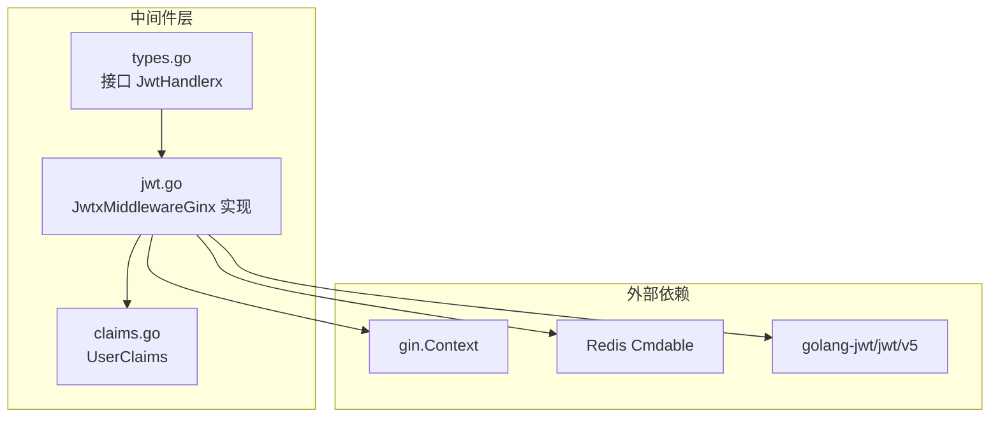
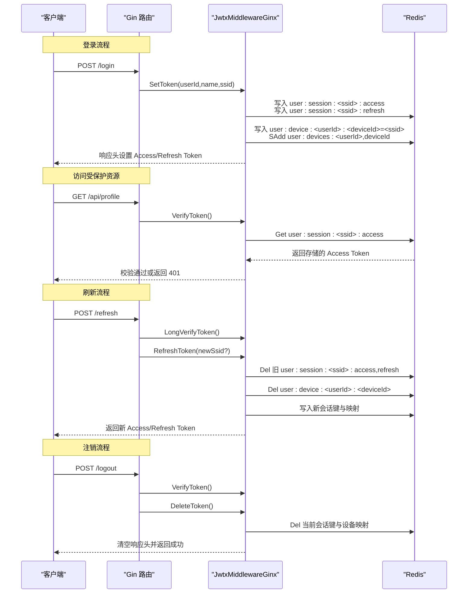
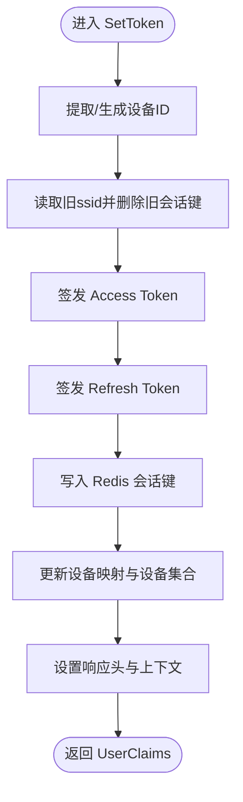
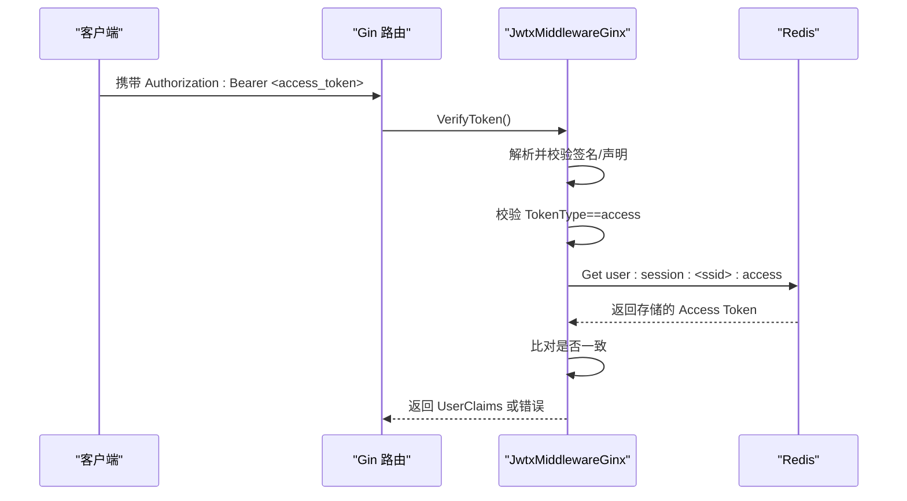
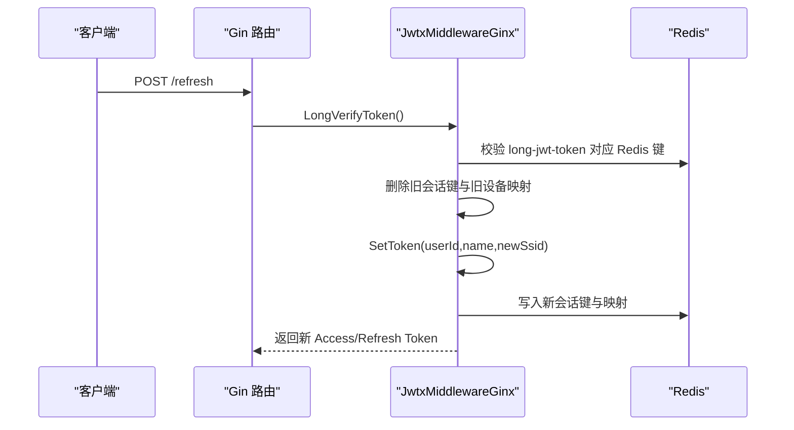
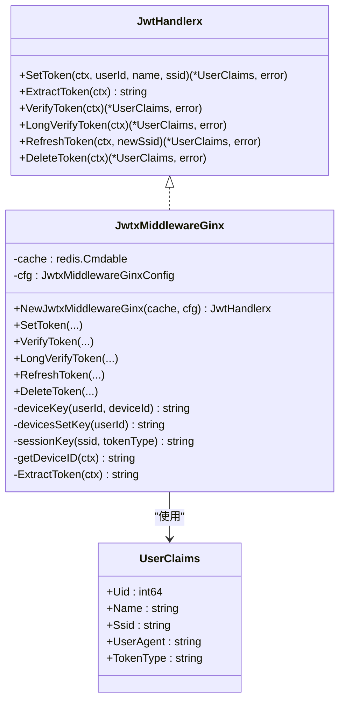

# JWT认证

<cite>
**本文引用的文件**
- [jwt.go](file://webx/ginx/middleware/jwtX2/jwt.go)
- [types.go](file://webx/ginx/middleware/jwtX2/types.go)
- [claims.go](file://webx/ginx/middleware/jwtX2/claims.go)
- [jwtX2_help](file://webx/ginx/middleware/jwtX2/jwtX2_help)
- [jwt_test.go](file://webx/ginx/middleware/jwtX2/jwt_test.go)
- [jwtx.go](file://webx/ginx/middleware/jwtx/jwtx.go)
</cite>

## 目录
1. [简介](#简介)
2. [项目结构](#项目结构)
3. [核心组件](#核心组件)
4. [架构总览](#架构总览)
5. [详细组件分析](#详细组件分析)
6. [依赖关系分析](#依赖关系分析)
7. [性能考量](#性能考量)
8. [故障排查指南](#故障排查指南)
9. [结论](#结论)
10. [附录](#附录)

## 简介
本文件系统性阐述 jwtX2 中间件的设计与实现，重点覆盖：
- 多设备会态管理机制：通过“用户-设备”维度进行会话绑定，同一设备仅保留最新会话，旧会话被自动踢出。
- 配置结构体 JwtxMiddlewareGinxConfig 的字段语义与默认行为。
- SetToken 如何按设备自动踢出旧会话并生成新的 Access/Refresh Token。
- VerifyToken 与 LongVerifyToken 的验证流程及 Redis 校验。
- RefreshToken 的刷新逻辑与安全策略。
- DeleteToken 的注销流程与 Redis 清理。
- 使用示例：初始化中间件并集成到 Gin 路由。
- 内部方法 deviceKey、devicesSetKey 的作用。
- 分布式环境下的安全与性能优化建议。

## 项目结构
jwtX2 位于 webx/ginx/middleware/jwtX2 目录下，核心文件包括：
- jwt.go：中间件主体实现，包含配置、工具函数、令牌签发/验证/刷新/注销。
- types.go：对外暴露的接口 JwtHandlerx。
- claims.go：UserClaims 结构体，承载 Access/Refresh Token 的声明信息。
- jwtX2_help：使用示例与注意事项。
- jwt_test.go：初始化测试样例。
- jwtx.go：旧版 jwtx 包，用于对比与迁移参考。

图表来源
- [jwt.go](file://webx/ginx/middleware/jwtX2/jwt.go#L1-L308)
- [types.go](file://webx/ginx/middleware/jwtX2/types.go#L1-L20)
- [claims.go](file://webx/ginx/middleware/jwtX2/claims.go#L1-L14)

章节来源
- [jwt.go](file://webx/ginx/middleware/jwtX2/jwt.go#L1-L308)
- [types.go](file://webx/ginx/middleware/jwtX2/types.go#L1-L20)
- [claims.go](file://webx/ginx/middleware/jwtX2/claims.go#L1-L14)

## 核心组件
- JwtHandlerx 接口：定义 SetToken、ExtractToken、VerifyToken、LongVerifyToken、RefreshToken、DeleteToken 六个方法，便于测试与替换。
- JwtxMiddlewareGinxConfig 配置：
  - SigningMethod：签名算法，默认 HS512。
  - DurationExpiresIn：Access Token 过期时间，默认 30 分钟。
  - LongDurationExpiresIn：Refresh Token 过期时间，默认 7 天。
  - JwtKey/LongJwtKey：Access/Refresh Token 的密钥，必填。
  - HeaderJwtTokenKey/LongHeaderJwtTokenKey：分别对应 Access/Refresh Token 的响应头键名，默认 jwt-token、long-jwt-token。
- JwtxMiddlewareGinx：中间件实现，持有 Redis 客户端与配置，提供上述六种能力。

章节来源
- [types.go](file://webx/ginx/middleware/jwtX2/types.go#L1-L20)
- [jwt.go](file://webx/ginx/middleware/jwtX2/jwt.go#L16-L32)
- [jwt.go](file://webx/ginx/middleware/jwtX2/jwt.go#L39-L66)

## 架构总览
jwtX2 将 Gin 路由与 Redis 缓存结合，形成“无状态 JWT + 有状态黑名单校验”的混合模型：
- 登录/续会话：生成 Access/Refresh 令牌，写入 Redis 对应键，同时维护“用户-设备”映射与“用户-设备集合”。
- 请求校验：先解析 JWT，再查 Redis 对应键确认未被撤销。
- 刷新/注销：删除旧会话键，必要时清理设备映射，确保“退出即失效”。

图表来源
- [jwt.go](file://webx/ginx/middleware/jwtX2/jwt.go#L99-L180)
- [jwt.go](file://webx/ginx/middleware/jwtX2/jwt.go#L195-L245)
- [jwt.go](file://webx/ginx/middleware/jwtX2/jwt.go#L247-L274)
- [jwt.go](file://webx/ginx/middleware/jwtX2/jwt.go#L276-L308)

## 详细组件分析

### 配置结构体 JwtxMiddlewareGinxConfig 字段说明
- SigningMethod：签名算法，默认 HS512；用于 Access/Refresh Token 的签发与验证。
- DurationExpiresIn：Access Token 过期时间，默认 30 分钟；用于短期访问控制。
- LongDurationExpiresIn：Refresh Token 过期时间，默认 7 天；用于安全续会话。
- JwtKey/LongJwtKey：Access/Refresh Token 的密钥，必填；分别用于签发与验证对应类型的令牌。
- HeaderJwtTokenKey/LongHeaderJwtTokenKey：响应头键名，默认 jwt-token、long-jwt-token；用于将 Access/Refresh Token 返回给客户端。

章节来源
- [jwt.go](file://webx/ginx/middleware/jwtX2/jwt.go#L16-L32)
- [jwt.go](file://webx/ginx/middleware/jwtX2/jwt.go#L39-L66)

### 设备识别与会态管理
- 设备 ID 来源优先级：前端传入 X-Device-ID；否则回退为 User-Agent 的哈希（固定长度），保证同一 UA 视为同一设备。
- “用户-设备”映射：通过 deviceKey(userId, deviceId) 维护 userId -> ssid 的映射，同一设备登录时，旧 ssid 的会话键会被踢出。
- “用户-设备集合”：通过 devicesSetKey(userId) 维护用户拥有的设备集合，便于后续统计与清理。

章节来源
- [jwt.go](file://webx/ginx/middleware/jwtX2/jwt.go#L83-L97)
- [jwt.go](file://webx/ginx/middleware/jwtX2/jwt.go#L68-L81)
- [jwt.go](file://webx/ginx/middleware/jwtX2/jwt.go#L169-L173)

### SetToken：按设备自动踢出旧会话并生成新令牌
- 设备识别：优先使用 X-Device-ID，否则用 User-Agent 哈希生成。
- 踢旧会话：读取 user:device:<userId>:<deviceId>，若存在旧 ssid，则删除旧会话的 access/refresh 键。
- 生成新令牌：分别签发 Access/Refresh Token，设置过期时间。
- 写入 Redis：写入 user:session:<ssid>:access 与 user:session:<ssid>:refresh。
- 更新映射：写入 user:device:<userId>:<deviceId>=<newSsid>，并向 user:devices:<userId> 集合添加 deviceId。
- 设置响应头：返回 Access/Refresh Token，并将 UserClaims 写入上下文。

图表来源
- [jwt.go](file://webx/ginx/middleware/jwtX2/jwt.go#L99-L180)

章节来源
- [jwt.go](file://webx/ginx/middleware/jwtX2/jwt.go#L99-L180)

### VerifyToken：Access Token 验证流程
- 从 Authorization: Bearer 提取 Token。
- 使用 JwtKey 解析并校验签名与基本声明。
- 校验 TokenType 必须为 "access"。
- 从 Redis 读取 user:session:<ssid>:access，要求与请求中的 Access Token 完全一致，否则视为撤销或不存在。
- 成功后将 UserClaims 写入上下文，供后续处理器使用。

图表来源
- [jwt.go](file://webx/ginx/middleware/jwtX2/jwt.go#L195-L219)

章节来源
- [jwt.go](file://webx/ginx/middleware/jwtX2/jwt.go#L182-L194)
- [jwt.go](file://webx/ginx/middleware/jwtX2/jwt.go#L195-L219)

### LongVerifyToken：Refresh Token 验证流程
- 从 Authorization: Bearer 提取 Token。
- 使用 LongJwtKey 解析并校验签名与基本声明。
- 校验 TokenType 必须为 "refresh"。
- 从 Redis 读取 user:session:<ssid>:refresh，要求与请求中的 Refresh Token 完全一致，否则视为撤销或不存在。
- 成功后将 UserClaims 写入上下文（键名为 userLong）。

章节来源
- [jwt.go](file://webx/ginx/middleware/jwtX2/jwt.go#L221-L245)

### RefreshToken：刷新逻辑
- 先 LongVerifyToken 校验 Refresh Token。
- 可选择传入 newSsid 以“续会话”；若为空则复用原 ssid。
- 删除旧会话的 access/refresh 键与旧设备映射。
- 调用 SetToken 生成新会话（可能新设备），并返回新 UserClaims。

图表来源
- [jwt.go](file://webx/ginx/middleware/jwtX2/jwt.go#L247-L274)
- [jwt.go](file://webx/ginx/middleware/jwtX2/jwt.go#L99-L180)

章节来源
- [jwt.go](file://webx/ginx/middleware/jwtX2/jwt.go#L247-L274)

### DeleteToken：注销当前会话
- 先 VerifyToken 校验 Access Token。
- 清空响应头中的 Access/Refresh Token。
- 删除 Redis 中当前会话的 access/refresh 键与设备映射。
- 若成功清理设备集合键，从 user:devices:<userId> 中移除当前设备。

章节来源
- [jwt.go](file://webx/ginx/middleware/jwtX2/jwt.go#L276-L308)

### 内部方法与键空间设计
- deviceKey(userId, deviceId)：用户-设备映射键，用于快速定位某用户在某设备上的当前 ssid。
- devicesSetKey(userId)：用户设备集合键，用于记录用户历史设备集合。
- sessionKey(ssid, tokenType)：会话键，区分 access 与 refresh 两类。

章节来源
- [jwt.go](file://webx/ginx/middleware/jwtX2/jwt.go#L68-L81)

### 使用示例与集成
- 初始化：创建 Redis 客户端，构造 JwtxMiddlewareGinxConfig，调用 NewJwtxMiddlewareGinx。
- 登录：在 /login 路由中调用 SetToken，返回 Access/Refresh Token。
- 刷新：在 /refresh 路由中调用 RefreshToken，支持传入 newSsid。
- 注销：在 /logout 路由中调用 DeleteToken。
- 受保护路由：在 /api 分组中使用 VerifyToken 中间件。

章节来源
- [jwtX2_help](file://webx/ginx/middleware/jwtX2/jwtX2_help#L1-L93)
- [jwt_test.go](file://webx/ginx/middleware/jwtX2/jwt_test.go#L1-L25)

## 依赖关系分析
- 接口与实现：JwtHandlerx 定义能力，JwtxMiddlewareGinx 实现具体逻辑。
- 数据模型：UserClaims 承载 uid、name、ssid、user_agent、token_type 等。
- 外部依赖：gin.Context、golang-jwt/jwt/v5、redis/go-redis/v9。
- 与旧版 jwtx 的关系：jwtx 为弃用版本，jwtX2 在接口上完全兼容，且修复了多设备互踢问题。

图表来源
- [types.go](file://webx/ginx/middleware/jwtX2/types.go#L1-L20)
- [jwt.go](file://webx/ginx/middleware/jwtX2/jwt.go#L39-L66)
- [claims.go](file://webx/ginx/middleware/jwtX2/claims.go#L1-L14)

章节来源
- [types.go](file://webx/ginx/middleware/jwtX2/types.go#L1-L20)
- [jwt.go](file://webx/ginx/middleware/jwtX2/jwt.go#L39-L66)
- [claims.go](file://webx/ginx/middleware/jwtX2/claims.go#L1-L14)
- [jwtx.go](file://webx/ginx/middleware/jwtx/jwtx.go#L1-L54)

## 性能考量
- Redis 写入与读取：SetToken/VerifyToken/LongVerifyToken/DeleteToken 均涉及 Redis Set/Get/Del/SAdd/SRem 操作，建议：
  - 使用连接池与合适的超时配置。
  - 将过期时间与设备集合 TTL 合理设置，避免长期占用内存。
- 设备 ID 生成：User-Agent 哈希作为兜底方案，建议前端尽量传 X-Device-ID，减少哈希碰撞与误判。
- 批量操作：在高并发场景，可评估将部分键操作合并为事务或流水线，降低网络往返。
- 缓存命中：VerifyToken/LongVerifyToken 会访问 Redis，建议在网关或上游做轻量缓存（如本地 LRU）以减轻后端压力，但需注意与“退出即失效”的一致性。

[本节为通用性能建议，不直接分析具体文件]

## 故障排查指南
- 缺少密钥：初始化时 JwtKey/LongJwtKey 必须非空，否则触发 panic。
- 令牌缺失：VerifyToken/LongVerifyToken 若 Authorization 头缺失或格式不正确，会返回错误。
- 令牌撤销：Redis 中不存在或与存储不一致的令牌被视为撤销，返回错误。
- 设备映射异常：若设备集合键未正确维护，可能导致注销后仍残留设备记录。
- 刷新失败：LongVerifyToken 校验失败会导致 RefreshToken 流程中断。

章节来源
- [jwt.go](file://webx/ginx/middleware/jwtX2/jwt.go#L39-L66)
- [jwt.go](file://webx/ginx/middleware/jwtX2/jwt.go#L195-L219)
- [jwt.go](file://webx/ginx/middleware/jwtX2/jwt.go#L221-L245)
- [jwt.go](file://webx/ginx/middleware/jwtX2/jwt.go#L276-L308)

## 结论
jwtX2 在保持与旧版 jwtx 接口兼容的同时，解决了多设备互踢问题，并通过 Redis 的“会话键 + 设备映射 + 设备集合”实现了可靠的会态管理。其核心优势在于：
- 同设备仅保留最新会话，旧会话自动踢出；
- 验证阶段同时进行 JWT 校验与 Redis 校验，确保“退出即失效”；
- 提供 RefreshToken 与 DeleteToken 的完整生命周期管理；
- 易于测试与替换，接口清晰。

[本节为总结性内容，不直接分析具体文件]

## 附录

### A. 配置项与默认值对照
- SigningMethod：默认 HS512
- DurationExpiresIn：默认 30 分钟
- LongDurationExpiresIn：默认 7 天
- JwtKey/LongJwtKey：必填
- HeaderJwtTokenKey：默认 jwt-token
- LongHeaderJwtTokenKey：默认 long-jwt-token

章节来源
- [jwt.go](file://webx/ginx/middleware/jwtX2/jwt.go#L16-L32)
- [jwt.go](file://webx/ginx/middleware/jwtX2/jwt.go#L39-L66)

### B. 关键流程图汇总
- SetToken 流程：见“SetToken：按设备自动踢出旧会话并生成新令牌”
- VerifyToken 流程：见“VerifyToken：Access Token 验证流程”
- LongVerifyToken 流程：见“LongVerifyToken：Refresh Token 验证流程”
- RefreshToken 流程：见“RefreshToken：刷新逻辑”
- DeleteToken 流程：见“DeleteToken：注销当前会话”

章节来源
- [jwt.go](file://webx/ginx/middleware/jwtX2/jwt.go#L99-L180)
- [jwt.go](file://webx/ginx/middleware/jwtX2/jwt.go#L195-L245)
- [jwt.go](file://webx/ginx/middleware/jwtX2/jwt.go#L247-L308)