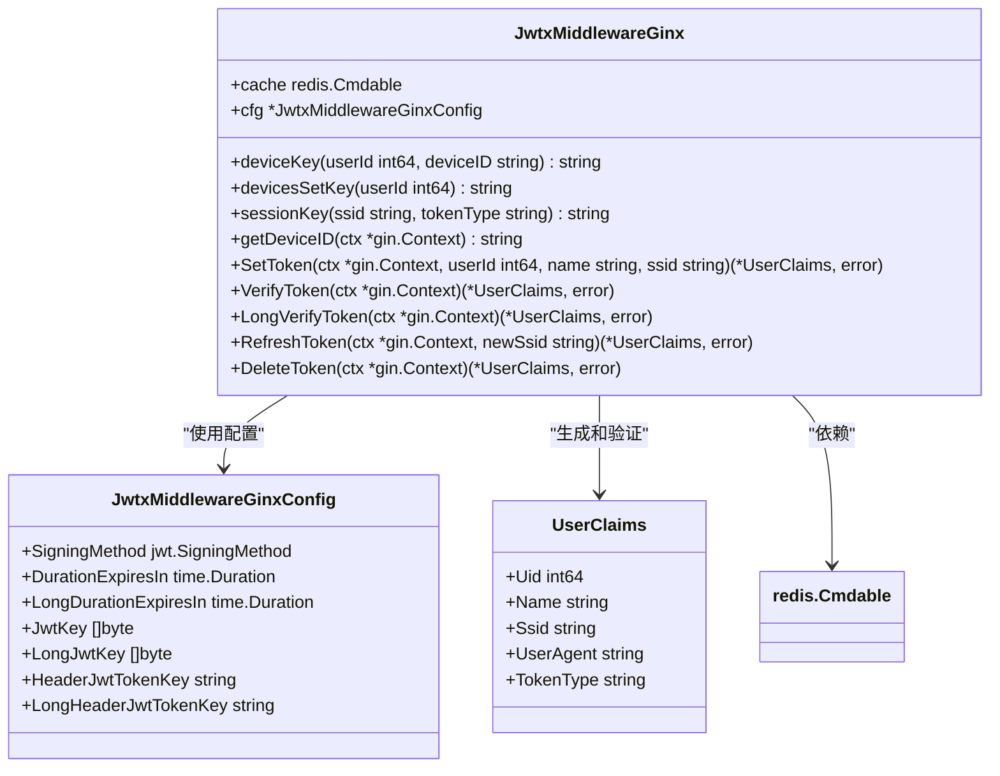
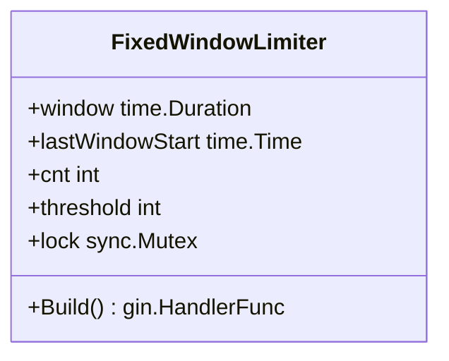
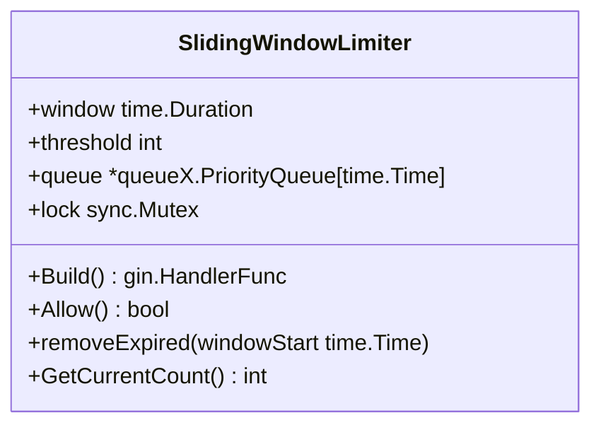
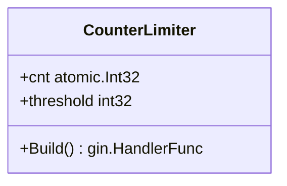
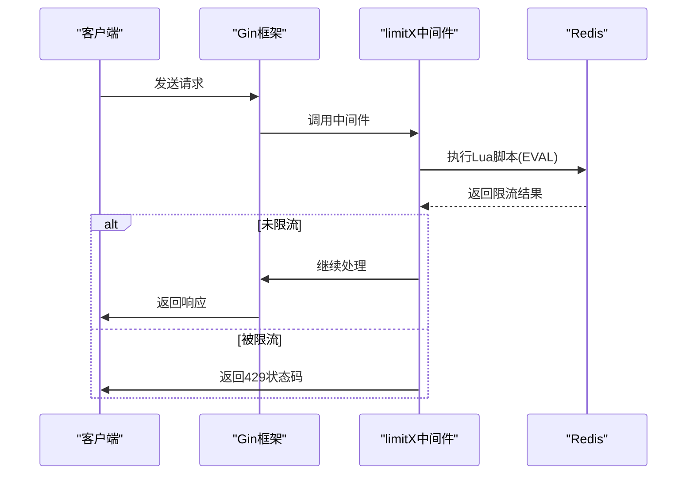
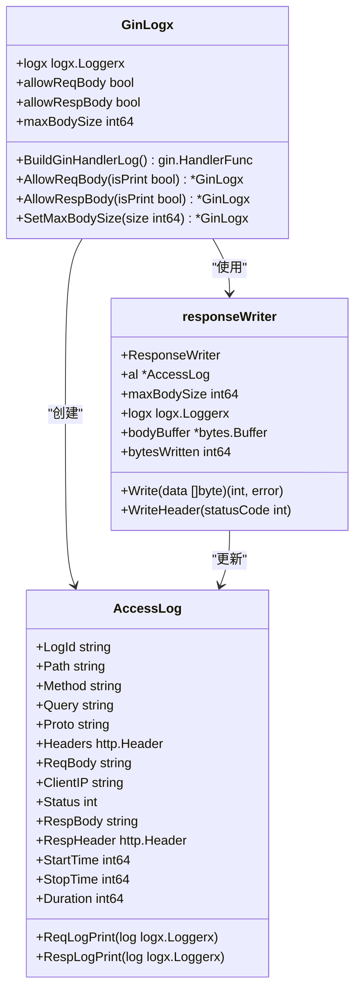
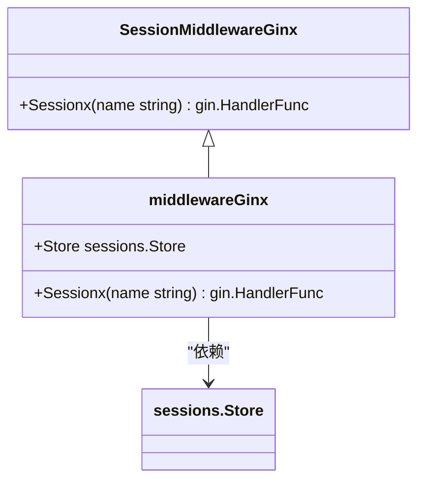
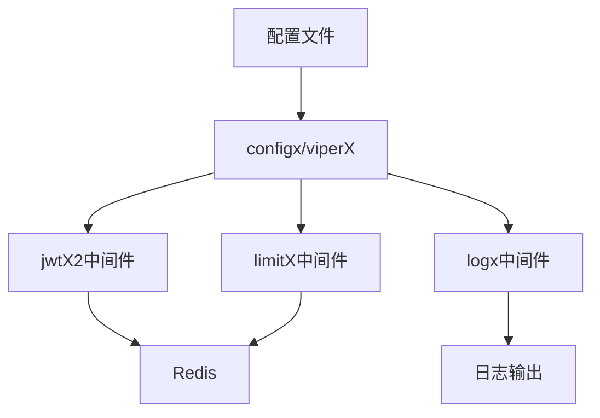
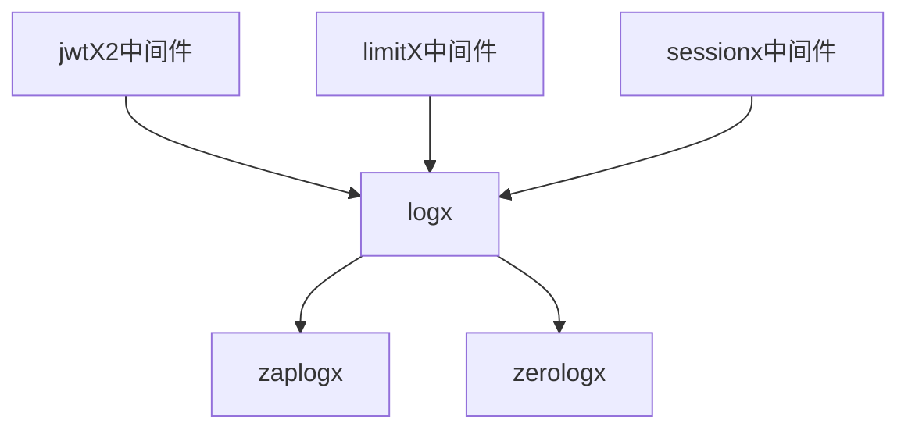

# Web中间件

<cite>
**本文档引用的文件**  
- [jwt.go](file://webx/ginx/middleware/jwtX2/jwt.go)
- [types.go](file://webx/ginx/middleware/jwtX2/types.go)
- [claims.go](file://webx/ginx/middleware/jwtX2/claims.go)
- [fixedWindow.go](file://webx/ginx/middleware/limitX/fixedWindow.go)
- [slidingWindow.go](file://webx/ginx/middleware/limitX/slidingWindow.go)
- [tokenBocket.go](file://webx/ginx/middleware/limitX/tokenBocket.go)
- [counterLimiter.go](file://webx/ginx/middleware/limitX/counterLimiter.go)
- [ratelimitGinBuild.go](file://webx/ginx/middleware/limitX/ratelimitGinBuild.go)
- [LogGinBuild.go](file://webx/ginx/middleware/logx/LogGinBuild.go)
- [sessionGinBuild.go](file://webx/ginx/middleware/sessionx/sessionGinBuild.go)
- [zapLogger.go](file://logx/zaplogx/zapLogger.go)
- [logx.go](file://logx/zerologx/logx.go)
- [redis_slide_window.go](file://limiter/redis_slide_window.go)
- [config.go](file://configx/viperX/viper.go)
</cite>

## 目录
1. [简介](#简介)
2. [JWT认证中间件（jwtX2）](#jwt认证中间件jwtX2)
3. [限流中间件（limitX）](#限流中间件limitX)
4. [日志记录中间件](#日志记录中间件)
5. [会话管理中间件](#会话管理中间件)
6. [中间件集成与配置](#中间件集成与配置)
7. [中间件链式使用示例](#中间件链式使用示例)
8. [总结](#总结)

## 简介
本文档详细介绍了为Gin框架提供的Web中间件组件库。该库包含了一系列增强功能的中间件，包括JWT认证、请求限流、日志记录和会话管理等核心功能。这些中间件设计精良，具有高可配置性和可扩展性，能够满足现代Web应用的安全性、性能和可观测性需求。

**本文档引用的文件**  
- [jwt.go](file://webx/ginx/middleware/jwtX2/jwt.go#L1-L308)
- [types.go](file://webx/ginx/middleware/jwtX2/types.go#L1-L20)
- [claims.go](file://webx/ginx/middleware/jwtX2/claims.go#L1-L14)

## JWT认证中间件（jwtX2）

### 设计与功能
jwtX2中间件提供了一套完整的JWT认证解决方案，支持多设备会话管理和Token刷新机制。它通过Redis存储Token状态，实现了服务端对Token的完全控制。

### 多设备会话管理
中间件通过`deviceKey`和`devicesSetKey`两个Redis键来管理用户设备会话：
- `user:device:{userId}:{deviceID}`：存储用户在特定设备上的会话ID（ssid）
- `user:devices:{userId}`：存储用户所有设备的集合

当用户在新设备上登录时，系统会自动踢掉该设备上的旧会话，确保同一设备上只有一个有效会话。



**图示来源**  
- [jwt.go](file://webx/ginx/middleware/jwtX2/jwt.go#L34-L308)
- [types.go](file://webx/ginx/middleware/jwtX2/types.go#L6-L20)
- [claims.go](file://webx/ginx/middleware/jwtX2/claims.go#L6-L14)

### Token刷新与删除机制
中间件提供了完整的Token生命周期管理：
- `SetToken`：登录时生成Access Token和Refresh Token，并存入Redis
- `VerifyToken`：验证Access Token的有效性
- `LongVerifyToken`：验证Refresh Token的有效性
- `RefreshToken`：使用Refresh Token刷新获取新的Access Token
- `DeleteToken`：退出登录时删除当前会话的Token

设备ID通过以下方式确定：
1. 优先使用请求头中的`X-Device-ID`
2. 兜底使用`User-Agent`的SHA256哈希值前16位

**本节来源**  
- [jwt.go](file://webx/ginx/middleware/jwtX2/jwt.go#L68-L308)
- [types.go](file://webx/ginx/middleware/jwtX2/types.go#L6-L20)

## 限流中间件（limitX）

### 实现算法
limitX中间件实现了多种限流算法，包括：

#### 固定窗口算法
基于时间窗口的简单限流，每个窗口内限制请求数量。



**图示来源**  
- [fixedWindow.go](file://webx/ginx/middleware/limitX/fixedWindow.go#L10-L45)

#### 滑动窗口算法
更精确的限流算法，通过维护一个时间戳队列来实现平滑的请求控制。



**图示来源**  
- [slidingWindow.go](file://webx/ginx/middleware/limitX/slidingWindow.go#L11-L101)

#### 令牌桶算法
基于令牌桶的限流，以固定速率生成令牌，请求需要消耗令牌才能通过。

```mermaid
classDiagram
class TokenBucketLimiter {
+interval time.Duration
+buckets chan struct{}
+closeCh chan struct{}
+closeOnce sync.Once
+Build() gin.HandlerFunc
+Close() error
}
```

**图示来源**  
- [tokenBocket.go](file://webx/ginx/middleware/limitX/tokenBocket.go#L11-L70)

#### 计数器算法
简单的内存计数器限流，适用于单实例部署。



**图示来源**  
- [counterLimiter.go](file://webx/ginx/middleware/limitX/counterLimiter.go#L9-L34)

### Redis集成限流
推荐使用基于Redis的滑动窗口限流，通过Lua脚本保证原子性操作。



**图示来源**  
- [ratelimitGinBuild.go](file://webx/ginx/middleware/limitX/ratelimitGinBuild.go#L14-L66)
- [redis_slide_window.go](file://limiter/redis_slide_window.go#L19-L193)

**本节来源**  
- [fixedWindow.go](file://webx/ginx/middleware/limitX/fixedWindow.go#L1-L45)
- [slidingWindow.go](file://webx/ginx/middleware/limitX/slidingWindow.go#L1-L101)
- [tokenBocket.go](file://webx/ginx/middleware/limitX/tokenBocket.go#L1-L70)
- [counterLimiter.go](file://webx/ginx/middleware/limitX/counterLimiter.go#L1-L34)
- [ratelimitGinBuild.go](file://webx/ginx/middleware/limitX/ratelimitGinBuild.go#L1-L66)

## 日志记录中间件

### 日志库集成
日志中间件支持集成zaplogx和zerologx两种高性能日志库，通过统一的`Loggerx`接口进行抽象。



**图示来源**  
- [LogGinBuild.go](file://webx/ginx/middleware/logx/LogGinBuild.go#L14-L275)

### 配置选项
日志中间件提供以下配置选项：
- `AllowReqBody`：是否允许打印请求体
- `AllowRespBody`：是否允许打印响应体
- `SetMaxBodySize`：设置请求体和响应体最大读取大小

### 日志级别处理
根据HTTP状态码自动选择日志级别：
- 2xx：INFO级别
- 4xx：WARN级别
- 5xx：ERROR级别

**本节来源**  
- [LogGinBuild.go](file://webx/ginx/middleware/logx/LogGinBuild.go#L1-L275)
- [zapLogger.go](file://logx/zaplogx/zapLogger.go#L1-L47)
- [logx.go](file://logx/zerologx/logx.go#L1-L144)

## 会话管理中间件

### Gin集成
会话管理中间件封装了`gin-contrib/sessions`库，提供了更简洁的API。



**图示来源**  
- [sessionGinBuild.go](file://webx/ginx/middleware/sessionx/sessionGinBuild.go#L8-L33)

### 使用方法
1. 创建Store（如cookie.NewStore或Redis.NewStore）
2. 通过`NewSessionMiddlewareGinx`创建中间件实例
3. 在Gin路由中使用`Sessionx`方法注册

**本节来源**  
- [sessionGinBuild.go](file://webx/ginx/middleware/sessionx/sessionGinBuild.go#L1-L33)

## 中间件集成与配置

### 配置组件（configx）
中间件通过configx组件获取配置，使用viper库支持多种配置格式。



**图示来源**  
- [viper.go](file://configx/viperX/viper.go#L1-L100)

### 日志组件（logx）
所有中间件都集成logx组件进行日志记录，确保统一的日志格式和输出。



**本节来源**  
- [viper.go](file://configx/viperX/viper.go#L1-L100)
- [zapLogger.go](file://logx/zaplogx/zapLogger.go#L1-L47)
- [logx.go](file://logx/zerologx/logx.go#L1-L144)

## 中间件链式使用示例

### 基本用法
```go
// 创建Gin引擎
r := gin.Default()

// 创建日志实例
logger := zerologx.NewZeroLogger(&zerolog.Logger{})

// 创建Redis客户端
redisClient := redis.NewClient(&redis.Options{Addr: "localhost:6379"})

// 配置JWT中间件
jwtConfig := &jwtX2.JwtxMiddlewareGinxConfig{
    JwtKey:     []byte("your-access-secret"),
    LongJwtKey: []byte("your-refresh-secret"),
}
jwtMiddleware := jwtX2.NewJwtxMiddlewareGinx(redisClient, jwtConfig)

// 配置限流中间件
limiter := limiter.NewRedisSlideWindowKLimiter(redisClient, time.Second, 100)
rateLimitMiddleware := limitX.NewRedisBuilder(limiter, logger)

// 配置日志中间件
logMiddleware := middleware.NewGinLogx(logger).
    AllowReqBody(true).
    AllowRespBody(true)

// 配置会话中间件
store, _ := redis.NewStore(10, "tcp", "localhost:6379", "", []byte("secret"))
sessionMiddleware := sessionx.NewSessionMiddlewareGinx(store)

// 链式添加中间件
r.Use(
    logMiddleware.BuildGinHandlerLog(),
    rateLimitMiddleware.Build(),
    sessionMiddleware.Sessionx("mysession"),
)

// 保护路由
authGroup := r.Group("/api")
authGroup.Use(jwtMiddleware.VerifyToken)
{
    authGroup.GET("/profile", profileHandler)
    authGroup.POST("/refresh", func(c *gin.Context) {
        claims, err := jwtMiddleware.RefreshToken(c, "")
        if err != nil {
            c.JSON(401, gin.H{"error": "refresh failed"})
            return
        }
        c.JSON(200, claims)
    })
}
```

**本节来源**  
- [jwt.go](file://webx/ginx/middleware/jwtX2/jwt.go#L39-L66)
- [ratelimitGinBuild.go](file://webx/ginx/middleware/limitX/ratelimitGinBuild.go#L27-L33)
- [LogGinBuild.go](file://webx/ginx/middleware/logx/LogGinBuild.go#L22-L29)
- [sessionGinBuild.go](file://webx/ginx/middleware/sessionx/sessionGinBuild.go#L25-L27)

## 总结
本文档详细介绍了Gin框架的Web中间件组件库，涵盖了JWT认证、请求限流、日志记录和会话管理等核心功能。这些中间件设计精良，具有以下特点：
- **高可配置性**：每个中间件都提供了丰富的配置选项
- **高性能**：使用Redis和Lua脚本保证限流的高性能
- **安全性**：JWT中间件支持多设备会话管理和Token刷新
- **可观测性**：统一的日志接口支持多种日志库
- **易用性**：简洁的API设计，易于集成和使用

通过合理配置和组合这些中间件，可以构建出安全、稳定、高性能的Web应用。