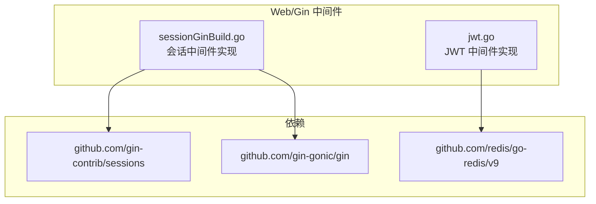
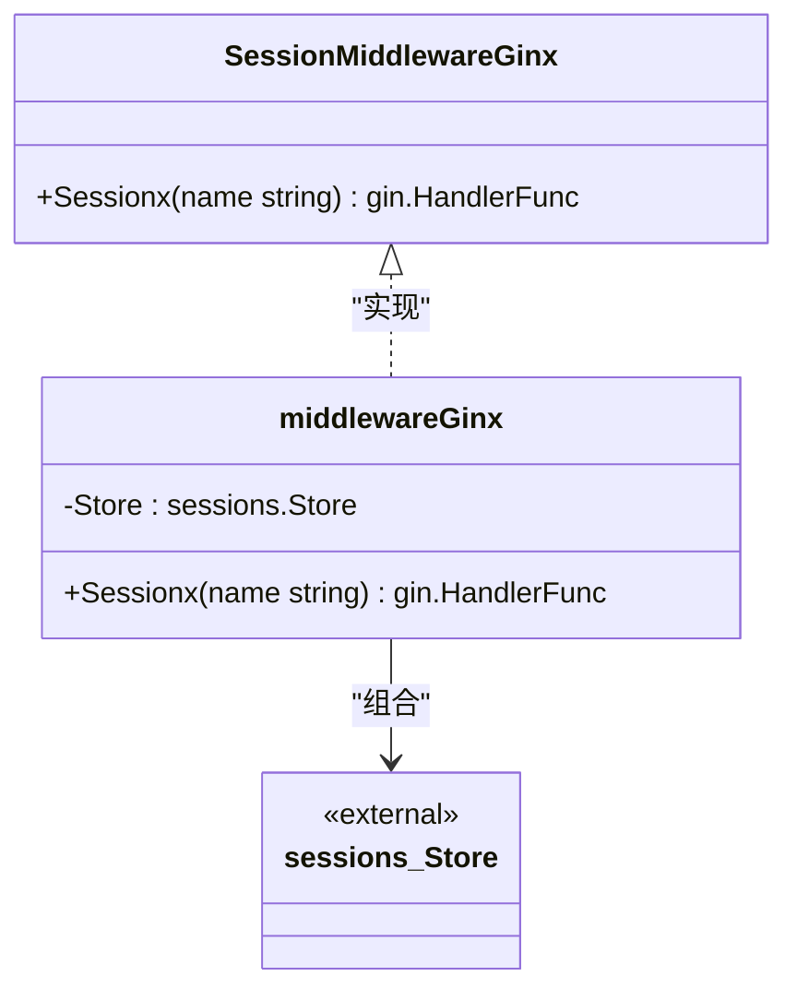
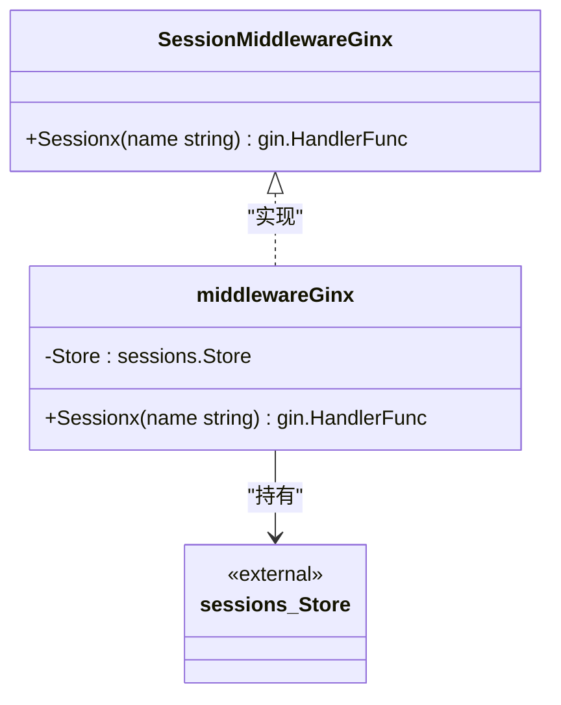
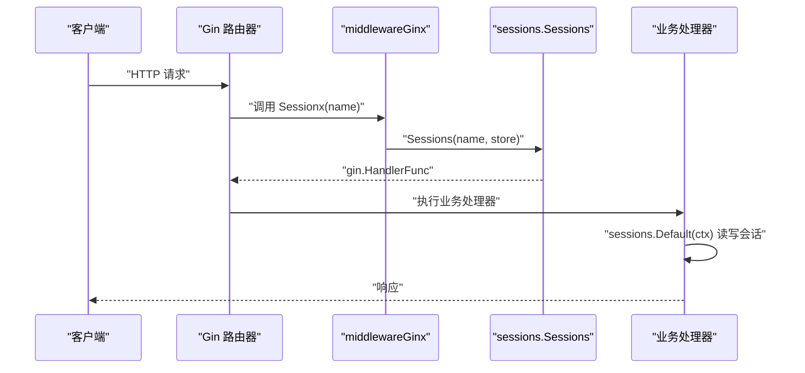
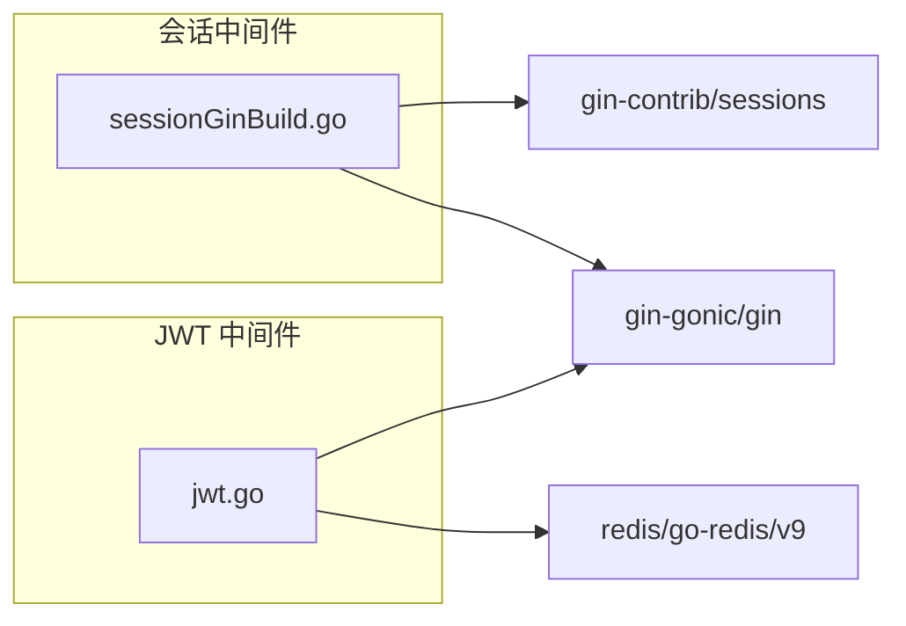
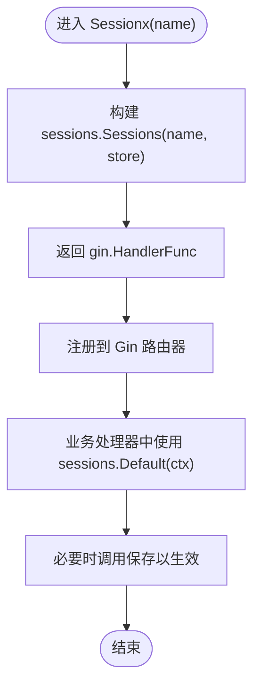

# 会话管理

<cite>
**本文引用的文件**
- [sessionGinBuild.go](file://webx/ginx/middleware/sessionx/sessionGinBuild.go)
- [go.mod](file://go.mod)
- [jwt.go](file://webx/ginx/middleware/jwtX2/jwt.go)
- [claims.go](file://webx/ginx/middleware/jwtX2/claims.go)
- [types.go](file://webx/ginx/middleware/jwtX2/types.go)
</cite>

## 目录
1. [简介](#简介)
2. [项目结构](#项目结构)
3. [核心组件](#核心组件)
4. [架构总览](#架构总览)
5. [详细组件分析](#详细组件分析)
6. [依赖关系分析](#依赖关系分析)
7. [性能考量](#性能考量)
8. [故障排查指南](#故障排查指南)
9. [结论](#结论)
10. [附录](#附录)

## 简介
本文件围绕会话管理中间件的设计与集成方式进行系统化说明，重点覆盖：
- SessionMiddlewareGinx 接口的职责与 Sessionx 方法的作用
- middlewareGinx 如何封装 gin-contrib/sessions 的 Store 接口，实现对 Cookie/Redis 等会话存储后端的抽象
- NewSessionMiddlewareGinx 工厂函数如何接收外部创建的 Store 实例并返回中间件实现
- Sessionx 方法如何调用 sessions.Sessions 函数生成 gin.HandlerFunc，完成会话中间件的注册
- 使用示例：如何结合 Redis 或 Cookie 创建 Store 并注入到会话中间件
- 在微服务架构中的适用性以及与 JWT 方案的对比选择

## 项目结构
会话管理中间件位于 webx/ginx/middleware/sessionx 下，核心文件为 sessionGinBuild.go；JWT 相关中间件位于 webx/ginx/middleware/jwtX2 下，便于对比两种认证/会话方案。

图表来源
- [sessionGinBuild.go](file://webx/ginx/middleware/sessionx/sessionGinBuild.go#L1-L32)
- [go.mod](file://go.mod#L1-L42)
- [jwt.go](file://webx/ginx/middleware/jwtX2/jwt.go#L1-L30)

章节来源
- [sessionGinBuild.go](file://webx/ginx/middleware/sessionx/sessionGinBuild.go#L1-L32)
- [go.mod](file://go.mod#L1-L42)

## 核心组件
- SessionMiddlewareGinx 接口：定义会话中间件对外暴露的能力，核心方法为 Sessionx(name string) gin.HandlerFunc。
- middlewareGinx 结构体：内部持有 sessions.Store，用于承载具体会话存储后端（如 Cookie、Redis）。
- NewSessionMiddlewareGinx 工厂函数：接收外部创建的 sessions.Store 实例，返回实现了 SessionMiddlewareGinx 的中间件实例。
- Sessionx 方法：通过 sessions.Sessions(name, store) 生成 gin.HandlerFunc，供 Gin 路由器注册使用。

章节来源
- [sessionGinBuild.go](file://webx/ginx/middleware/sessionx/sessionGinBuild.go#L8-L32)

## 架构总览
会话中间件采用“接口+工厂+适配器”的模式：
- 接口层：SessionMiddlewareGinx 抽象出会话中间件能力
- 工厂层：NewSessionMiddlewareGinx 将外部传入的 Store 注入到 middlewareGinx
- 适配层：middlewareGinx.Sessionx 将 Store 与 sessions.Sessions 绑定，输出 gin.HandlerFunc

图表来源
- [sessionGinBuild.go](file://webx/ginx/middleware/sessionx/sessionGinBuild.go#L8-L32)

## 详细组件分析

### 接口与实现：SessionMiddlewareGinx 与 middlewareGinx
- SessionMiddlewareGinx：对外提供 Sessionx(name string) gin.HandlerFunc，用于生成 Gin 中间件处理器。
- middlewareGinx：内部字段 Store 为 sessions.Store，承载具体存储后端；Sessionx(name) 直接委托给 sessions.Sessions(name, store)。

图表来源
- [sessionGinBuild.go](file://webx/ginx/middleware/sessionx/sessionGinBuild.go#L8-L32)

章节来源
- [sessionGinBuild.go](file://webx/ginx/middleware/sessionx/sessionGinBuild.go#L8-L32)

### 工厂函数：NewSessionMiddlewareGinx
- 职责：接收外部创建的 sessions.Store 实例，封装为 middlewareGinx 并返回 SessionMiddlewareGinx 接口。
- 设计要点：通过工厂函数解耦外部 Store 的创建与中间件的使用，便于替换不同存储后端（Cookie/Redis 等）。

章节来源
- [sessionGinBuild.go](file://webx/ginx/middleware/sessionx/sessionGinBuild.go#L24-L27)

### 会话处理器：Sessionx 方法
- 职责：将 name 与 Store 组合，调用 sessions.Sessions(name, store) 生成 gin.HandlerFunc。
- 作用：供 Gin 路由器注册，使后续路由处理可通过 sessions.Default(ctx) 读写会话数据。

图表来源
- [sessionGinBuild.go](file://webx/ginx/middleware/sessionx/sessionGinBuild.go#L29-L32)

章节来源
- [sessionGinBuild.go](file://webx/ginx/middleware/sessionx/sessionGinBuild.go#L29-L32)

### 存储后端抽象：Store 接口与 sessions.Sessions
- Store 接口：由 gin-contrib/sessions 定义，抽象会话存储行为（读取、写入、删除等）。
- sessions.Sessions(name, store)：根据 name 与 store 生成 Gin 中间件处理器，统一会话生命周期管理。

章节来源
- [sessionGinBuild.go](file://webx/ginx/middleware/sessionx/sessionGinBuild.go#L1-L10)
- [go.mod](file://go.mod#L1-L42)

### 使用示例（概念性说明）
- 基于 Cookie 的 Store：
  - 外部创建 CookieStore 实例
  - 通过 NewSessionMiddlewareGinx(CookieStore) 获取中间件
  - 在 Gin 路由器上注册 Sessionx("sessionName") 返回的 gin.HandlerFunc
  - 业务中使用 sessions.Default(ctx) 读写会话
- 基于 Redis 的 Store：
  - 外部创建 RedisStore 实例（需引入相应 Redis 会话存储库）
  - 同上流程注入并注册
  - 业务中同样使用 sessions.Default(ctx) 读写会话

说明：本仓库未直接包含 Redis 会话存储实现代码，但通过 sessions.Store 接口抽象，可在外部创建 RedisStore 并注入到 NewSessionMiddlewareGinx。

章节来源
- [sessionGinBuild.go](file://webx/ginx/middleware/sessionx/sessionGinBuild.go#L16-L24)

## 依赖关系分析
- 会话中间件依赖 gin-contrib/sessions 与 gin-gonic/gin
- JWT 中间件依赖 redis/go-redis/v9 与 gin-gonic/gin
- 二者均面向 Gin 生态，但会话存储策略不同：会话中间件通过 Store 抽象统一接入 Cookie/Redis 等；JWT 中间件通过 Redis 存储 Token 并在内存中验证

图表来源
- [sessionGinBuild.go](file://webx/ginx/middleware/sessionx/sessionGinBuild.go#L1-L10)
- [go.mod](file://go.mod#L1-L42)
- [jwt.go](file://webx/ginx/middleware/jwtX2/jwt.go#L1-L30)

章节来源
- [go.mod](file://go.mod#L1-L42)
- [sessionGinBuild.go](file://webx/ginx/middleware/sessionx/sessionGinBuild.go#L1-L10)
- [jwt.go](file://webx/ginx/middleware/jwtX2/jwt.go#L1-L30)

## 性能考量
- 会话中间件：
  - Cookie 存储：适合无状态、轻量会话；网络传输开销与 Cookie 大小相关
  - Redis 存储：适合跨节点共享会话，具备更好的扩展性与一致性
- JWT 中间件：
  - Token 放在客户端，服务端无需持久化会话；Redis 主要用于黑名单/撤销表与设备映射
  - 验证过程在服务端完成，避免跨节点同步会话数据

章节来源
- [jwt.go](file://webx/ginx/middleware/jwtX2/jwt.go#L1-L30)

## 故障排查指南
- 会话中间件常见问题
  - 未正确注册中间件：确认已在 Gin 路由器上注册 Sessionx(name) 返回的 gin.HandlerFunc
  - 会话未保存：业务侧需显式调用保存操作，确保变更生效
  - Store 未初始化：确保传入 NewSessionMiddlewareGinx 的 Store 已正确初始化
- JWT 中间件常见问题
  - 缺少密钥或密钥为空：初始化时需提供 JwtKey 与 LongJwtKey
  - Token 无效或被撤销：检查 Redis 中对应键是否存在且值匹配
  - 设备绑定异常：确认设备 ID 提取逻辑与 Redis 设备映射键一致

章节来源
- [sessionGinBuild.go](file://webx/ginx/middleware/sessionx/sessionGinBuild.go#L16-L24)
- [jwt.go](file://webx/ginx/middleware/jwtX2/jwt.go#L34-L81)

## 结论
- 会话中间件通过接口与工厂模式，将 sessions.Store 抽象为统一的会话存储入口，既可对接 Cookie，也可对接 Redis 等后端
- Sessionx 方法将 Store 与 sessions.Sessions 绑定，输出标准 Gin 中间件处理器，便于在路由中注册
- 在微服务场景下，Redis 会话更利于横向扩展与跨节点共享；JWT 更适合无状态与多服务协作
- 两种方案各有侧重：会话中间件强调“会话数据”在服务端的统一管理；JWT 强调“令牌”在客户端携带并在服务端验证

## 附录

### 会话中间件调用流程（算法视角）

图表来源
- [sessionGinBuild.go](file://webx/ginx/middleware/sessionx/sessionGinBuild.go#L29-L32)

### 与 JWT 方案的对比选择
- 会话中间件（Cookie/Redis）：适合需要在服务端集中管理会话数据的场景，易于做会话级控制与审计
- JWT：适合无状态、跨域/多服务协作，Token 自验证，服务端无需维护会话状态
- 选择建议：
  - 需要强一致的会话状态与跨节点共享：优先 Redis 会话
  - 无状态、多服务、移动端/浏览器多端：优先 JWT
  - 混合方案：部分会话数据放服务端（Redis），敏感票据用 JWT

章节来源
- [jwt.go](file://webx/ginx/middleware/jwtX2/jwt.go#L1-L30)
- [claims.go](file://webx/ginx/middleware/jwtX2/claims.go#L1-L14)
- [types.go](file://webx/ginx/middleware/jwtX2/types.go#L1-L20)