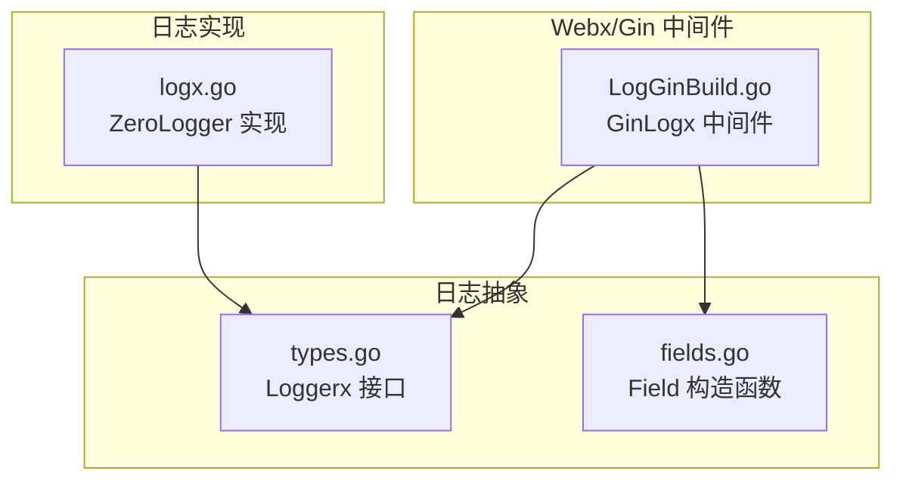
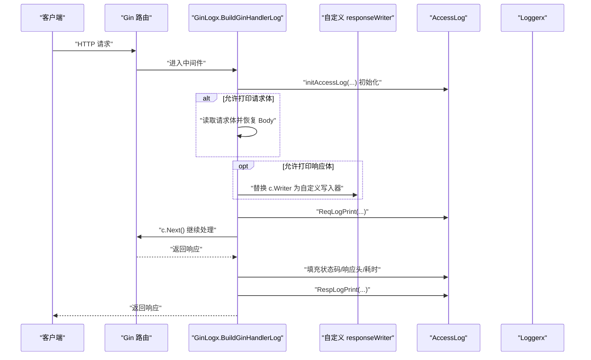
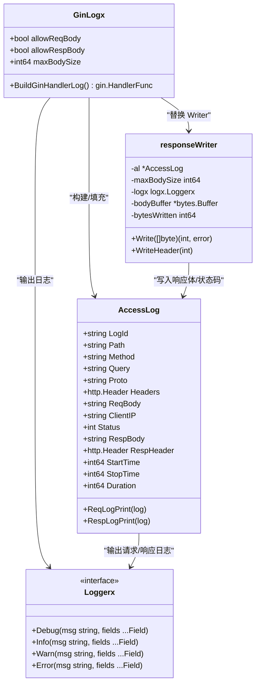
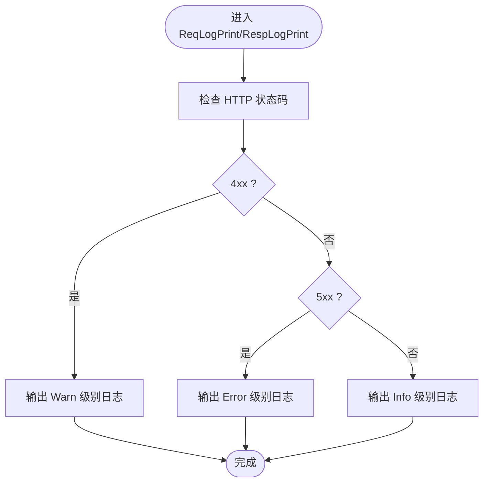
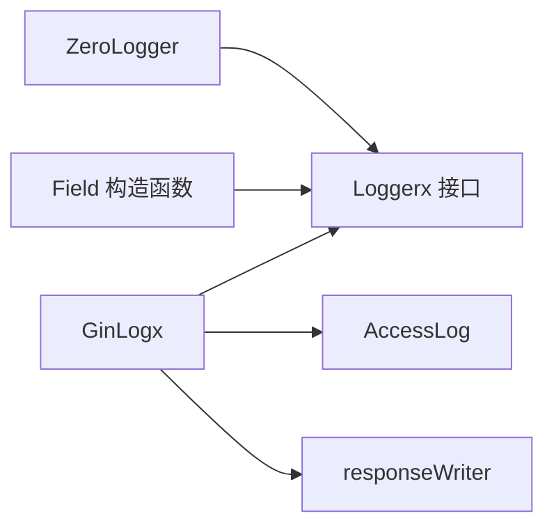

# 日志记录

<cite>
**本文引用的文件**
- [LogGinBuild.go](file://webx/ginx/middleware/logx/LogGinBuild.go)
- [types.go](file://logx/types.go)
- [fields.go](file://logx/fields.go)
- [logx.go](file://logx/zerologx/logx.go)
</cite>

## 目录
1. [简介](#简介)
2. [项目结构](#项目结构)
3. [核心组件](#核心组件)
4. [架构总览](#架构总览)
5. [详细组件分析](#详细组件分析)
6. [依赖关系分析](#依赖关系分析)
7. [性能考量](#性能考量)
8. [故障排查指南](#故障排查指南)
9. [结论](#结论)
10. [附录](#附录)

## 简介
本文件全面介绍 GinLogx 日志中间件的功能与架构，重点覆盖以下方面：
- GinLogx 结构体中 allowReqBody、allowRespBody 和 maxBodySize 等配置项的意义与使用场景
- BuildGinHandlerLog 如何构建 gin.HandlerFunc，实现请求全流程的日志捕获
- initAccessLog 如何初始化访问日志对象，并安全地处理请求头、路径、查询参数等信息
- 自定义 responseWriter 如何通过拦截 Write 和 WriteHeader 方法来捕获响应体和状态码，同时实现大小限制与截断警告
- ReqLogPrint 与 RespLogPrint 如何根据 HTTP 状态码级别（Info、Warn、Error）输出结构化日志
- 配置示例：如何控制请求/响应体的打印以及设置最大读取大小
- 在高并发场景下的性能表现与潜在内存消耗问题

## 项目结构
GinLogx 中间件位于 webx/ginx/middleware/logx 目录，日志接口与字段类型位于 logx 目录，零拷贝/高性能日志实现位于 logx/zerologx 目录。整体采用“中间件 + 抽象日志接口 + 具体日志实现”的分层设计，便于替换不同日志后端。

图表来源
- [LogGinBuild.go](file://webx/ginx/middleware/logx/LogGinBuild.go#L1-L275)
- [types.go](file://logx/types.go#L1-L25)
- [fields.go](file://logx/fields.go#L1-L75)
- [logx.go](file://logx/zerologx/logx.go#L1-L144)

章节来源
- [LogGinBuild.go](file://webx/ginx/middleware/logx/LogGinBuild.go#L1-L275)
- [types.go](file://logx/types.go#L1-L25)
- [fields.go](file://logx/fields.go#L1-L75)
- [logx.go](file://logx/zerologx/logx.go#L1-L144)

## 核心组件
- GinLogx：中间件主体，负责配置与构建 gin.HandlerFunc
- AccessLog：请求/响应阶段的结构化日志载体
- responseWriter：自定义响应写入器，拦截 Write/WriteHeader 捕获响应体与状态码
- Loggerx 接口与 Field：日志抽象与字段构造工具
- ZeroLogger：基于 zerolog 的高性能日志实现

章节来源
- [LogGinBuild.go](file://webx/ginx/middleware/logx/LogGinBuild.go#L14-L275)
- [types.go](file://logx/types.go#L1-L25)
- [fields.go](file://logx/fields.go#L1-L75)
- [logx.go](file://logx/zerologx/logx.go#L1-L144)

## 架构总览
GinLogx 中间件在请求进入时初始化 AccessLog，按需读取请求体并注入自定义 responseWriter；在请求处理完成后计算耗时并输出请求/响应日志。日志输出根据 HTTP 状态码区间选择 Info/Warn/Error 级别。

图表来源
- [LogGinBuild.go](file://webx/ginx/middleware/logx/LogGinBuild.go#L52-L114)
- [LogGinBuild.go](file://webx/ginx/middleware/logx/LogGinBuild.go#L116-L135)
- [LogGinBuild.go](file://webx/ginx/middleware/logx/LogGinBuild.go#L154-L203)
- [LogGinBuild.go](file://webx/ginx/middleware/logx/LogGinBuild.go#L204-L275)

## 详细组件分析

### GinLogx 结构体与配置
- allowReqBody：是否允许打印请求体，默认开启
- allowRespBody：是否允许打印响应体，默认开启
- maxBodySize：请求体与响应体最大读取大小（字节），默认 1MB

用途与场景
- 生产环境建议关闭 allowReqBody/allowRespBody 或严格限制 maxBodySize，避免大流量下日志体积膨胀
- 对于调试阶段，可临时开启 allowReqBody/allowRespBody 并适当提高 maxBodySize

章节来源
- [LogGinBuild.go](file://webx/ginx/middleware/logx/LogGinBuild.go#L14-L29)
- [LogGinBuild.go](file://webx/ginx/middleware/logx/LogGinBuild.go#L31-L49)

### BuildGinHandlerLog：构建 gin.HandlerFunc
流程要点
- 记录开始时间并初始化 AccessLog
- 若允许打印请求体：使用 LimitReader 限制读取大小，读取后恢复请求体供下游使用
- 若允许打印响应体：将 c.Writer 替换为自定义 responseWriter，用于捕获响应体与状态码
- 输出请求日志
- 调用 c.Next() 处理业务逻辑
- 计算结束时间、耗时与响应头，输出响应日志

章节来源
- [LogGinBuild.go](file://webx/ginx/middleware/logx/LogGinBuild.go#L52-L114)

### initAccessLog：初始化访问日志对象
- 安全处理 Path 长度，防止超长路径导致日志体积异常增大
- 生成 LogId 用于请求追踪
- 默认不显示请求体与响应体，避免不必要的日志开销

章节来源
- [LogGinBuild.go](file://webx/ginx/middleware/logx/LogGinBuild.go#L116-L135)

### 自定义 responseWriter：拦截 Write/WriteHeader
职责
- Write：记录响应体，按 maxBodySize 截断；当超过限制时发出警告
- WriteHeader：记录最终状态码
- 通过 bytes.Buffer 累积响应体，避免重复拷贝带来的额外开销

图表来源
- [LogGinBuild.go](file://webx/ginx/middleware/logx/LogGinBuild.go#L14-L275)
- [types.go](file://logx/types.go#L1-L25)

章节来源
- [LogGinBuild.go](file://webx/ginx/middleware/logx/LogGinBuild.go#L154-L203)

### 请求体读取与恢复机制
- 使用 LimitReader 限制读取大小，避免内存暴涨
- 读取完成后，将原始请求体恢复给后续处理器，确保业务逻辑可用
- 若达到限制，记录截断警告并丢弃多余数据

章节来源
- [LogGinBuild.go](file://webx/ginx/middleware/logx/LogGinBuild.go#L60-L85)

### 响应体大小限制与截断警告
- 写入响应体时按 maxBodySize 截断，超过限制时发出警告
- 仅累积有效响应体，避免无界增长

章节来源
- [LogGinBuild.go](file://webx/ginx/middleware/logx/LogGinBuild.go#L165-L197)
- [LogGinBuild.go](file://webx/ginx/middleware/logx/LogGinBuild.go#L171-L189)

### ReqLogPrint 与 RespLogPrint：按状态码级别输出
- 状态码区间划分：
  - 4xx：Warn
  - 5xx：Error
  - 其他：Info
- 输出字段包括：请求/响应关键元信息、头信息、体内容、耗时等

图表来源
- [LogGinBuild.go](file://webx/ginx/middleware/logx/LogGinBuild.go#L204-L275)

章节来源
- [LogGinBuild.go](file://webx/ginx/middleware/logx/LogGinBuild.go#L204-L275)

### 配置示例与最佳实践
- 关闭请求体/响应体打印：在生产环境建议关闭 allowReqBody/allowRespBody，降低日志体积与 IO 压力
- 设置最大读取大小：根据业务场景调整 maxBodySize，避免大请求/响应导致内存占用过高
- 使用高性能日志实现：通过 ZeroLogger 提供的高性能日志能力，减少日志写入对吞吐的影响

章节来源
- [LogGinBuild.go](file://webx/ginx/middleware/logx/LogGinBuild.go#L31-L49)
- [logx.go](file://logx/zerologx/logx.go#L1-L144)

## 依赖关系分析
- GinLogx 依赖 Loggerx 接口与 Field 工具，实现与具体日志实现解耦
- GinLogx 通过 responseWriter 与 AccessLog 协作，完成请求/响应阶段的日志采集
- ZeroLogger 实现 Loggerx 接口，提供高性能日志输出

图表来源
- [LogGinBuild.go](file://webx/ginx/middleware/logx/LogGinBuild.go#L14-L275)
- [types.go](file://logx/types.go#L1-L25)
- [fields.go](file://logx/fields.go#L1-L75)
- [logx.go](file://logx/zerologx/logx.go#L1-L144)

章节来源
- [LogGinBuild.go](file://webx/ginx/middleware/logx/LogGinBuild.go#L14-L275)
- [types.go](file://logx/types.go#L1-L25)
- [fields.go](file://logx/fields.go#L1-L75)
- [logx.go](file://logx/zerologx/logx.go#L1-L144)

## 性能考量
- 请求体读取：使用 LimitReader 控制读取上限，避免大请求导致内存峰值升高
- 响应体截断：在 responseWriter 中按 maxBodySize 截断，防止响应体过大造成内存压力
- 日志级别：按状态码自动分级，减少错误日志风暴
- 高并发建议：
  - 默认关闭 allowReqBody/allowRespBody，或设置较小 maxBodySize
  - 使用 ZeroLogger 等高性能日志实现
  - 合理设置日志级别与输出目标，避免磁盘/网络成为瓶颈

章节来源
- [LogGinBuild.go](file://webx/ginx/middleware/logx/LogGinBuild.go#L60-L85)
- [LogGinBuild.go](file://webx/ginx/middleware/logx/LogGinBuild.go#L165-L197)
- [logx.go](file://logx/zerologx/logx.go#L1-L144)

## 故障排查指南
- 请求体未被记录
  - 检查是否设置了 allowReqBody=false
  - 检查请求体是否超过限制，超过时会触发截断警告
- 响应体未被记录
  - 检查是否设置了 allowRespBody=false
  - 检查 maxBodySize 是否过小，导致截断
- 日志体积过大
  - 关闭 allowReqBody/allowRespBody 或降低 maxBodySize
  - 调整日志级别，减少 Info/Warn 输出
- 性能下降
  - 关闭请求/响应体打印
  - 使用更高效的日志实现（如 ZeroLogger）

章节来源
- [LogGinBuild.go](file://webx/ginx/middleware/logx/LogGinBuild.go#L60-L85)
- [LogGinBuild.go](file://webx/ginx/middleware/logx/LogGinBuild.go#L165-L197)
- [LogGinBuild.go](file://webx/ginx/middleware/logx/LogGinBuild.go#L171-L189)

## 结论
GinLogx 中间件通过清晰的配置项与严格的大小限制，实现了对请求/响应全流程的可观测性，同时兼顾了高并发场景下的性能与稳定性。通过 Loggerx 抽象与 ZeroLogger 实现，可在保证日志质量的同时降低系统开销。生产环境中建议谨慎开启请求/响应体打印，并合理设置大小限制与日志级别。

## 附录
- 配置项说明
  - allowReqBody：是否打印请求体
  - allowRespBody：是否打印响应体
  - maxBodySize：请求/响应体最大读取大小（字节）
- 日志输出字段
  - 请求：LogId、ClientIP、Proto、Method、Path、Headers、ReqBody、StartTime
  - 响应：Status、RespHeader、RespBody、StartTime、StopTime、Duration

章节来源
- [LogGinBuild.go](file://webx/ginx/middleware/logx/LogGinBuild.go#L14-L275)
- [LogGinBuild.go](file://webx/ginx/middleware/logx/LogGinBuild.go#L137-L152)
- [LogGinBuild.go](file://webx/ginx/middleware/logx/LogGinBuild.go#L204-L275)