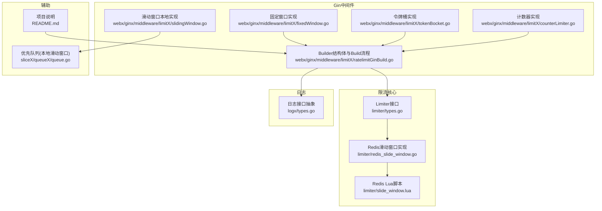
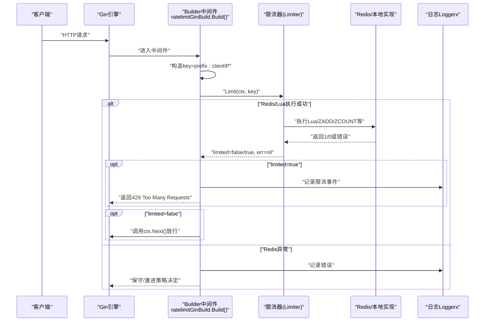
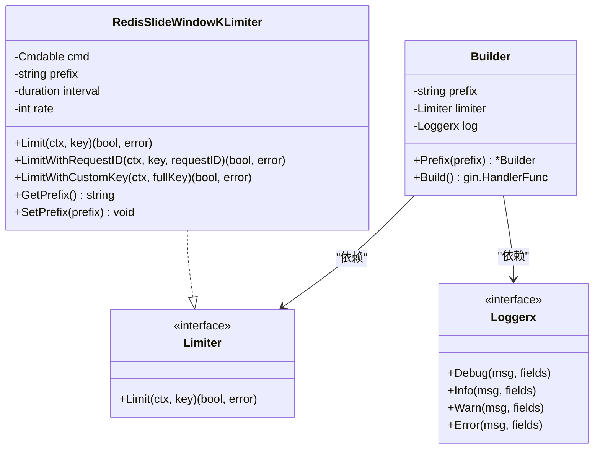
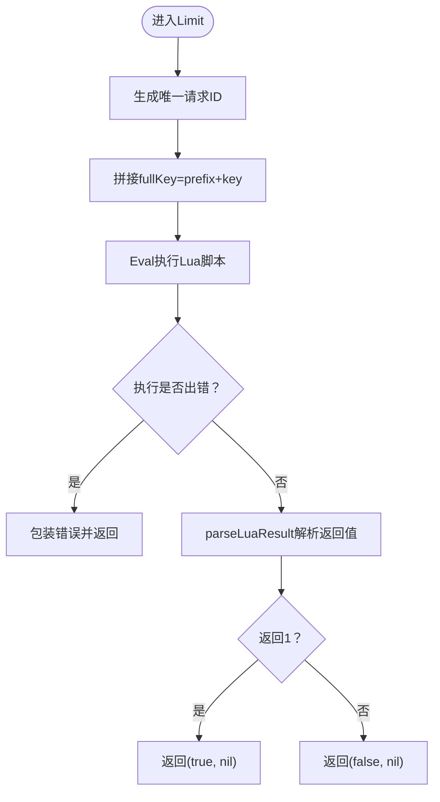
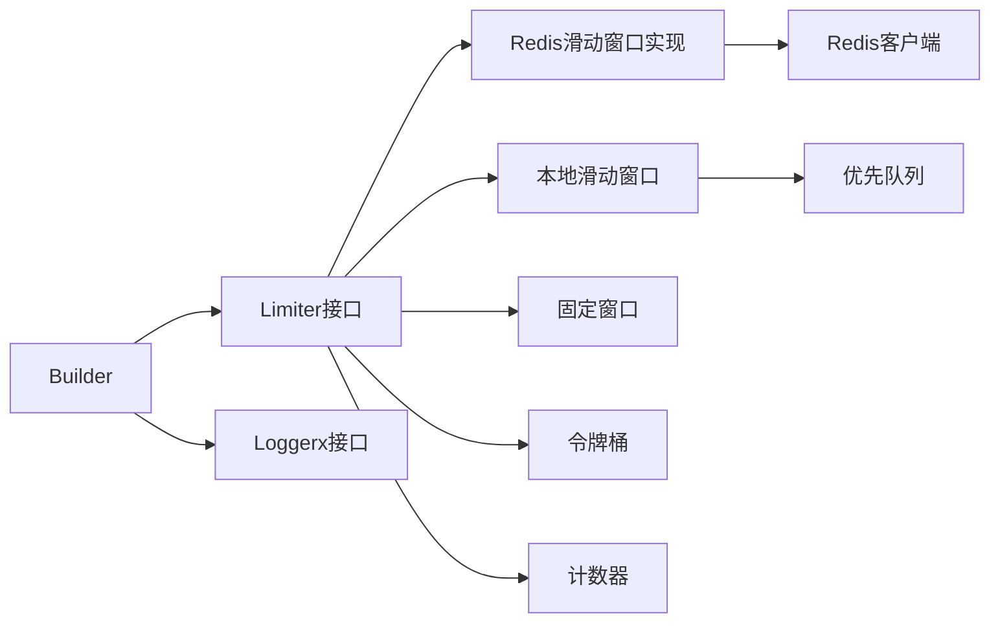

# 限流

<cite>
**本文引用的文件**
- [limiter/types.go](file://limiter/types.go)
- [limiter/redis_slide_window.go](file://limiter/redis_slide_window.go)
- [limiter/slide_window.lua](file://limiter/slide_window.lua)
- [webx/ginx/middleware/limitX/ratelimitGinBuild.go](file://webx/ginx/middleware/limitX/ratelimitGinBuild.go)
- [webx/ginx/middleware/limitX/slidingWindow.go](file://webx/ginx/middleware/limitX/slidingWindow.go)
- [webx/ginx/middleware/limitX/fixedWindow.go](file://webx/ginx/middleware/limitX/fixedWindow.go)
- [webx/ginx/middleware/limitX/tokenBocket.go](file://webx/ginx/middleware/limitX/tokenBocket.go)
- [webx/ginx/middleware/limitX/counterLimiter.go](file://webx/ginx/middleware/limitX/counterLimiter.go)
- [logx/types.go](file://logx/types.go)
- [sliceX/queueX/queue.go](file://sliceX/queueX/queue.go)
- [README.md](file://README.md)
</cite>

## 目录
1. [简介](#简介)
2. [项目结构](#项目结构)
3. [核心组件](#核心组件)
4. [架构总览](#架构总览)
5. [详细组件分析](#详细组件分析)
6. [依赖关系分析](#依赖关系分析)
7. [性能考量](#性能考量)
8. [故障排查指南](#故障排查指南)
9. [结论](#结论)

## 简介
本文件围绕“限流中间件”的实现原理展开，重点解析基于Builder模式的限流策略设计，涵盖：
- Builder结构体的设计与职责（prefix、limiter、log字段）
- NewRedisBuilder如何接收外部限流器实例并进行封装
- Build方法生成的gin.HandlerFunc如何调用limiter.Limit进行限流判断
- Redis异常下的降级策略（保守做法与激进做法）
- Prefix方法如何实现前缀自定义，支持多维限流隔离
- 如何将滑动窗口、固定窗口等不同算法的限流器注入到中间件
- 日志记录在限流决策中的作用及性能影响

## 项目结构
限流相关代码主要分布在以下位置：
- 核心限流接口与Redis滑动窗口实现：limiter目录
- Gin中间件层（Builder模式与多种限流算法）：webx/ginx/middleware/limitX
- 日志接口抽象：logx/types.go
- 滑动窗口本地实现依赖的优先队列：sliceX/queueX/queue.go



图表来源
- [limiter/types.go](file://limiter/types.go#L1-L10)
- [limiter/redis_slide_window.go](file://limiter/redis_slide_window.go#L1-L193)
- [limiter/slide_window.lua](file://limiter/slide_window.lua#L1-L57)
- [webx/ginx/middleware/limitX/ratelimitGinBuild.go](file://webx/ginx/middleware/limitX/ratelimitGinBuild.go#L1-L66)
- [webx/ginx/middleware/limitX/slidingWindow.go](file://webx/ginx/middleware/limitX/slidingWindow.go#L1-L101)
- [webx/ginx/middleware/limitX/fixedWindow.go](file://webx/ginx/middleware/limitX/fixedWindow.go#L1-L45)
- [webx/ginx/middleware/limitX/tokenBocket.go](file://webx/ginx/middleware/limitX/tokenBocket.go#L1-L70)
- [webx/ginx/middleware/limitX/counterLimiter.go](file://webx/ginx/middleware/limitX/counterLimiter.go#L1-L34)
- [logx/types.go](file://logx/types.go#L1-L25)
- [sliceX/queueX/queue.go](file://sliceX/queueX/queue.go#L1-L204)
- [README.md](file://README.md#L1-L126)

章节来源
- [README.md](file://README.md#L1-L126)

## 核心组件
- Limiter接口：统一限流判定入口，返回是否触发限流与错误。
- Redis滑动窗口实现：基于Redis有序集合与Lua脚本，实现高精度滑动窗口限流。
- Builder中间件：封装限流器、前缀与日志，输出gin.HandlerFunc。
- 本地限流算法：滑动窗口、固定窗口、令牌桶、计数器，便于演示与对比。
- 日志接口：统一日志记录能力，支持Info/Error等。

章节来源
- [limiter/types.go](file://limiter/types.go#L1-L10)
- [limiter/redis_slide_window.go](file://limiter/redis_slide_window.go#L1-L193)
- [webx/ginx/middleware/limitX/ratelimitGinBuild.go](file://webx/ginx/middleware/limitX/ratelimitGinBuild.go#L1-L66)
- [webx/ginx/middleware/limitX/slidingWindow.go](file://webx/ginx/middleware/limitX/slidingWindow.go#L1-L101)
- [webx/ginx/middleware/limitX/fixedWindow.go](file://webx/ginx/middleware/limitX/fixedWindow.go#L1-L45)
- [webx/ginx/middleware/limitX/tokenBocket.go](file://webx/ginx/middleware/limitX/tokenBocket.go#L1-L70)
- [webx/ginx/middleware/limitX/counterLimiter.go](file://webx/ginx/middleware/limitX/counterLimiter.go#L1-L34)
- [logx/types.go](file://logx/types.go#L1-L25)

## 架构总览
下图展示了从HTTP请求进入Gin中间件，到调用限流器进行判定，再到日志记录与响应返回的整体流程。



图表来源
- [webx/ginx/middleware/limitX/ratelimitGinBuild.go](file://webx/ginx/middleware/limitX/ratelimitGinBuild.go#L1-L66)
- [limiter/redis_slide_window.go](file://limiter/redis_slide_window.go#L1-L193)
- [limiter/slide_window.lua](file://limiter/slide_window.lua#L1-L57)
- [logx/types.go](file://logx/types.go#L1-L25)

## 详细组件分析

### Builder结构体与Build流程
- 字段说明
  - prefix：限流键的前缀，用于实现多维隔离（如按IP、按用户、按接口等）。
  - limiter：限流器接口，可替换为Redis滑动窗口、本地滑动窗口、固定窗口、令牌桶、计数器等。
  - log：日志接口，用于记录限流事件与错误。
- NewRedisBuilder
  - 接收外部限流器实例与日志实例，初始化Builder的limiter与log字段，默认prefix为“ip-limiter”。
- Build
  - 生成gin.HandlerFunc，内部：
    - 以“prefix:clientIP”拼接key，调用limiter.Limit(ctx, key)。
    - 若返回err非空：记录错误日志，执行降级策略（保守做法：AbortWithStatus(500)，激进做法：Next()放行，注释中给出示例）。
    - 若返回limited=true：记录限流日志，AbortWithStatus(429)。
    - 否则：ctx.Next()放行。



图表来源
- [webx/ginx/middleware/limitX/ratelimitGinBuild.go](file://webx/ginx/middleware/limitX/ratelimitGinBuild.go#L1-L66)
- [limiter/types.go](file://limiter/types.go#L1-L10)
- [limiter/redis_slide_window.go](file://limiter/redis_slide_window.go#L1-L193)
- [logx/types.go](file://logx/types.go#L1-L25)

章节来源
- [webx/ginx/middleware/limitX/ratelimitGinBuild.go](file://webx/ginx/middleware/limitX/ratelimitGinBuild.go#L1-L66)
- [limiter/types.go](file://limiter/types.go#L1-L10)
- [limiter/redis_slide_window.go](file://limiter/redis_slide_window.go#L1-L193)
- [logx/types.go](file://logx/types.go#L1-L25)

### Redis滑动窗口限流器
- 设计要点
  - 基于Redis有序集合（ZSET）存储请求时间戳作为score，使用Lua脚本原子化完成清理、计数、插入与过期设置。
  - 支持自定义前缀、窗口大小与阈值，提供多种Limit变体（含自定义完整key与指定requestID）。
  - parseLuaResult对不同Redis客户端返回类型进行兼容解析。
- 关键流程
  - 构造fullKey = prefix + key
  - Eval执行Lua脚本，传入窗口毫秒、阈值、当前时间戳、唯一请求ID
  - 解析返回值：1表示触发限流，0表示通过
  - 设置key过期时间为窗口的两倍，避免内存泄漏



图表来源
- [limiter/redis_slide_window.go](file://limiter/redis_slide_window.go#L1-L193)
- [limiter/slide_window.lua](file://limiter/slide_window.lua#L1-L57)

章节来源
- [limiter/redis_slide_window.go](file://limiter/redis_slide_window.go#L1-L193)
- [limiter/slide_window.lua](file://limiter/slide_window.lua#L1-L57)

### 本地滑动窗口、固定窗口、令牌桶、计数器
- 滑动窗口（本地）
  - 使用优先队列维护窗口内请求时间戳，Allow阶段清理过期、检查阈值、入队当前时间戳。
  - 适合低并发、单机场景，避免外部依赖。
- 固定窗口
  - 基于时间窗口与计数器，窗口到期重置，简单高效但存在边界突变问题。
- 令牌桶
  - 定时向桶中投递令牌，请求取令牌消费，支持突发能力与平滑速率。
- 计数器
  - 原子计数器，适合粗粒度限流，实现最简单。

```mermaid
classDiagram
class SlidingWindowLimiter {
-window duration
-threshold int
-queue PriorityQueue[time.Time]
-lock Mutex
+Allow() bool
+Build() gin.HandlerFunc
}
class FixedWindowLimiter {
-window duration
-lastWindowStart time
-cnt int
-threshold int
-lock Mutex
+Build() gin.HandlerFunc
}
class TokenBucketLimiter {
-interval duration
-buckets chan struct{}
-closeCh chan struct{}
-closeOnce Once
+Build() gin.HandlerFunc
+Close() error
}
class CounterLimiter {
-cnt atomic.Int32
-threshold int32
+Build() gin.HandlerFunc
}
```

图表来源
- [webx/ginx/middleware/limitX/slidingWindow.go](file://webx/ginx/middleware/limitX/slidingWindow.go#L1-L101)
- [webx/ginx/middleware/limitX/fixedWindow.go](file://webx/ginx/middleware/limitX/fixedWindow.go#L1-L45)
- [webx/ginx/middleware/limitX/tokenBocket.go](file://webx/ginx/middleware/limitX/tokenBocket.go#L1-L70)
- [webx/ginx/middleware/limitX/counterLimiter.go](file://webx/ginx/middleware/limitX/counterLimiter.go#L1-L34)
- [sliceX/queueX/queue.go](file://sliceX/queueX/queue.go#L1-L204)

章节来源
- [webx/ginx/middleware/limitX/slidingWindow.go](file://webx/ginx/middleware/limitX/slidingWindow.go#L1-L101)
- [webx/ginx/middleware/limitX/fixedWindow.go](file://webx/ginx/middleware/limitX/fixedWindow.go#L1-L45)
- [webx/ginx/middleware/limitX/tokenBocket.go](file://webx/ginx/middleware/limitX/tokenBocket.go#L1-L70)
- [webx/ginx/middleware/limitX/counterLimiter.go](file://webx/ginx/middleware/limitX/counterLimiter.go#L1-L34)
- [sliceX/queueX/queue.go](file://sliceX/queueX/queue.go#L1-L204)

### 前缀自定义与多维限流隔离
- Prefix方法
  - 在Builder上链式设置prefix，最终在Build中用于拼接key（如“prefix:clientIP”）。
- 多维隔离
  - 通过调整prefix实现：按IP、按用户ID、按接口路径、按来源设备等维度隔离限流。
  - 与Redis前缀配合，可进一步隔离不同业务域。

章节来源
- [webx/ginx/middleware/limitX/ratelimitGinBuild.go](file://webx/ginx/middleware/limitX/ratelimitGinBuild.go#L1-L66)
- [limiter/redis_slide_window.go](file://limiter/redis_slide_window.go#L1-L193)

### 注入不同算法的限流器
- Redis滑动窗口
  - 使用NewRedisSlideWindowKLimiter创建实例，传入redis.Cmdable、窗口时长、阈值。
  - 通过NewRedisBuilder注入到中间件，实现分布式滑动窗口限流。
- 本地算法
  - NewSlidingWindowBuilder/NewFixedWindowBuilder/NewTokenBucketBuilder/NewCounterBuilder分别创建本地限流器，注入到中间件即可切换算法。
- 切换成本低
  - 由于Builder依赖Limiter接口，只需替换limiter实例即可切换算法。

章节来源
- [limiter/redis_slide_window.go](file://limiter/redis_slide_window.go#L1-L193)
- [webx/ginx/middleware/limitX/ratelimitGinBuild.go](file://webx/ginx/middleware/limitX/ratelimitGinBuild.go#L1-L66)
- [webx/ginx/middleware/limitX/slidingWindow.go](file://webx/ginx/middleware/limitX/slidingWindow.go#L1-L101)
- [webx/ginx/middleware/limitX/fixedWindow.go](file://webx/ginx/middleware/limitX/fixedWindow.go#L1-L45)
- [webx/ginx/middleware/limitX/tokenBocket.go](file://webx/ginx/middleware/limitX/tokenBocket.go#L1-L70)
- [webx/ginx/middleware/limitX/counterLimiter.go](file://webx/ginx/middleware/limitX/counterLimiter.go#L1-L34)

### Redis异常下的降级策略
- 保守做法
  - Redis不可用时，直接AbortWithStatus(500)，拒绝服务，防止雪崩。
- 激进做法
  - Redis不可用时，继续放行请求，尽力服务正常用户。
- Builder中间件中明确标注两种策略，开发者可根据业务容忍度选择。

章节来源
- [webx/ginx/middleware/limitX/ratelimitGinBuild.go](file://webx/ginx/middleware/limitX/ratelimitGinBuild.go#L1-L66)

### 日志记录与性能影响
- 记录内容
  - 限流事件：记录clientIP、path等上下文信息。
  - 错误事件：记录Redis错误，便于定位问题。
- 性能影响
  - 日志I/O属于同步开销，建议在高并发场景降低日志级别或采用异步日志实现。
  - 限流本身为O(1)或O(logN)复杂度，Redis Lua脚本原子化执行，性能稳定。

章节来源
- [webx/ginx/middleware/limitX/ratelimitGinBuild.go](file://webx/ginx/middleware/limitX/ratelimitGinBuild.go#L1-L66)
- [logx/types.go](file://logx/types.go#L1-L25)

## 依赖关系分析
- 组件耦合
  - Builder依赖Limiter接口与Loggerx接口，保持良好解耦。
  - Redis滑动窗口实现依赖Redis客户端与Lua脚本，对外暴露统一Limit接口。
  - 本地滑动窗口依赖优先队列，固定窗口/令牌桶/计数器均为纯Go实现。
- 外部依赖
  - Gin中间件栈集成，通过Build返回的gin.HandlerFunc接入。
  - Redis客户端（go-redis）与Lua脚本运行环境。



图表来源
- [webx/ginx/middleware/limitX/ratelimitGinBuild.go](file://webx/ginx/middleware/limitX/ratelimitGinBuild.go#L1-L66)
- [limiter/types.go](file://limiter/types.go#L1-L10)
- [limiter/redis_slide_window.go](file://limiter/redis_slide_window.go#L1-L193)
- [webx/ginx/middleware/limitX/slidingWindow.go](file://webx/ginx/middleware/limitX/slidingWindow.go#L1-L101)
- [webx/ginx/middleware/limitX/fixedWindow.go](file://webx/ginx/middleware/limitX/fixedWindow.go#L1-L45)
- [webx/ginx/middleware/limitX/tokenBocket.go](file://webx/ginx/middleware/limitX/tokenBocket.go#L1-L70)
- [webx/ginx/middleware/limitX/counterLimiter.go](file://webx/ginx/middleware/limitX/counterLimiter.go#L1-L34)
- [sliceX/queueX/queue.go](file://sliceX/queueX/queue.go#L1-L204)

## 性能考量
- Redis滑动窗口
  - Lua脚本原子化，避免网络往返与竞态，窗口清理与计数在服务端完成，延迟低。
  - key过期策略避免无限增长，减少内存占用。
- 本地滑动窗口
  - 无网络开销，但受进程内存与GC影响，适合单机低并发。
- 固定窗口
  - 最简单，CPU与内存开销最低，但边界突变明显。
- 令牌桶
  - 平滑突发，吞吐稳定，定时器与通道带来一定开销。
- 计数器
  - 原子操作，开销最小，但缺乏时间窗概念。

[本节为通用性能讨论，不直接分析具体文件]

## 故障排查指南
- Redis错误
  - 现象：Build返回err非空，触发降级策略。
  - 处理：根据业务选择保守或激进策略；检查Redis连接、Lua脚本可用性与过期策略。
- Lua返回类型异常
  - 现象：parseLuaResult无法解析返回值。
  - 处理：确认Redis客户端版本与返回类型一致性；必要时升级客户端或统一返回格式。
- key为空
  - 现象：LimitWithRequestID/LimitWithCustomKey报错。
  - 处理：确保传入的key非空；或使用LimitWithCustomKeyAndRequestID显式指定完整key与requestID。
- 日志未记录
  - 现象：限流事件与错误未见日志。
  - 处理：确认logx.Loggerx实现与配置；检查日志级别与输出目标。

章节来源
- [limiter/redis_slide_window.go](file://limiter/redis_slide_window.go#L1-L193)
- [limiter/slide_window.lua](file://limiter/slide_window.lua#L1-L57)
- [webx/ginx/middleware/limitX/ratelimitGinBuild.go](file://webx/ginx/middleware/limitX/ratelimitGinBuild.go#L1-L66)
- [logx/types.go](file://logx/types.go#L1-L25)

## 结论
- Builder模式使限流中间件具备高度可插拔性：通过替换limiter实例即可灵活切换算法与实现（Redis/本地/不同窗口策略）。
- 前缀机制支持多维限流隔离，满足精细化流量治理需求。
- Redis滑动窗口通过Lua脚本实现高精度限流，具备良好的性能与稳定性。
- 异常降级策略清晰，开发者可根据业务容忍度选择保守或激进做法。
- 日志记录有助于限流事件追踪与问题定位，建议结合业务量级优化日志策略。