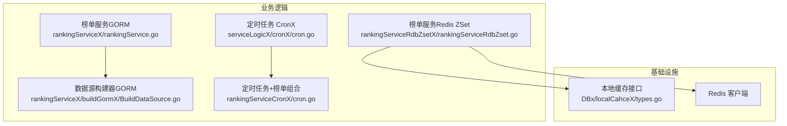
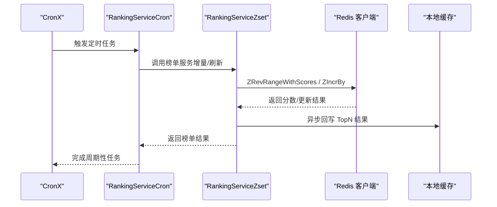
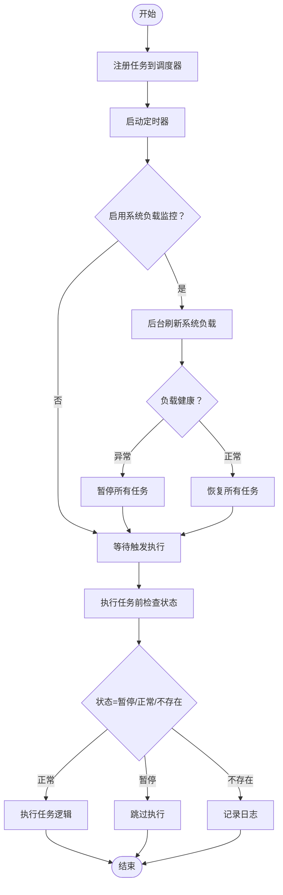
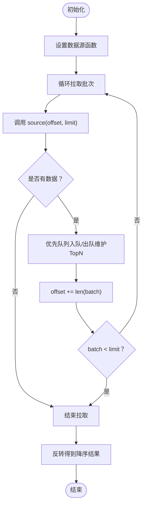
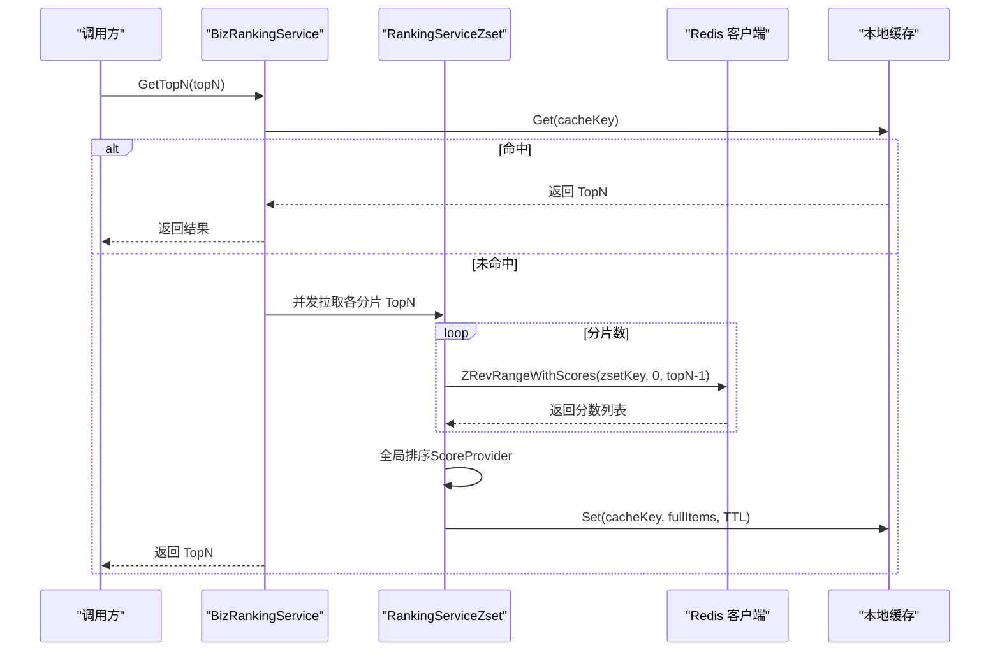
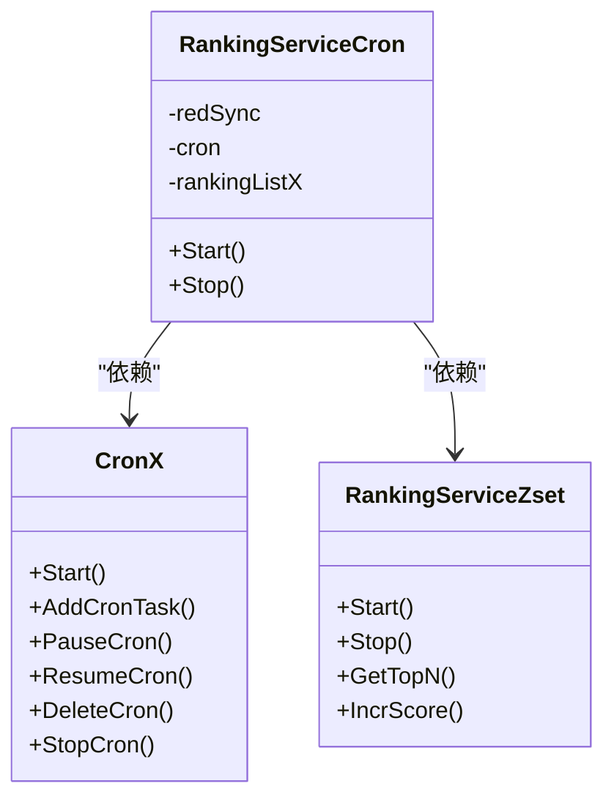
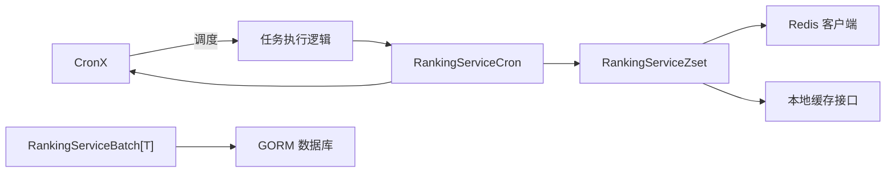

# 业务逻辑

<cite>
**本文引用的文件列表**
- [cron.go](file://serviceLogicX/cronX/cron.go)
- [cron_test.go](file://serviceLogicX/cronX/cron_test.go)
- [rankingServiceRdbZset.go](file://serviceLogicX/rankingListX/rankingServiceRdbZsetX/rankingServiceRdbZset.go)
- [rankingServiceRdbZset_test.go](file://serviceLogicX/rankingListX/rankingServiceRdbZsetX/rankingServiceRdbZset_test.go)
- [rankingService.go](file://serviceLogicX/rankingListX/rankingServiceX/rankingService.go)
- [BuildDataSource.go](file://serviceLogicX/rankingListX/rankingServiceX/buildGormX/BuildDataSource.go)
- [types.go（通用接口）](file://serviceLogicX/rankingListX/types.go)
- [types.go（榜单通用类型）](file://serviceLogicX/rankingListX/rankingServiceX/types/types.go)
- [types.go（Redis ZSet 类型）](file://serviceLogicX/rankingListX/rankingServiceRdbZsetX/types/types.go)
- [cron.go（定时任务+榜单组合）](file://serviceLogicX/rankingListX/rankingServiceCronX/cron.go)
- [types.go（本地缓存接口）](file://DBx/localCahceX/types.go)
</cite>

## 目录
1. [简介](#简介)
2. [项目结构](#项目结构)
3. [核心组件](#核心组件)
4. [架构总览](#架构总览)
5. [详细组件分析](#详细组件分析)
6. [依赖关系分析](#依赖关系分析)
7. [性能考量](#性能考量)
8. [故障排查指南](#故障排查指南)
9. [结论](#结论)
10. [附录](#附录)

## 简介
本文件聚焦于业务逻辑层的两个关键能力：定时任务调度与榜单服务。前者基于 robfig/cron 库进行二次封装，提供任务生命周期管理、系统负载感知与自动暂停/恢复机制；后者提供两种榜单实现路径：基于 GORM 的数据源构建与基于 Redis ZSet 的高性能实时榜单。文档将从架构、数据流、处理逻辑、集成点、错误处理与性能特征等方面进行深入解析，并给出可复用的服务模块使用示例与最佳实践。

## 项目结构
围绕业务逻辑的核心目录如下：
- serviceLogicX/cronX：定时任务封装，支持任务增删改查、暂停/恢复、动态添加、系统负载感知与自动控制。
- serviceLogicX/rankingListX：榜单服务族，包含通用泛型榜单、基于 GORM 的数据源构建器、基于 Redis ZSet 的高性能实时榜单，以及定时任务+榜单的组合封装。
- DBx/localCahceX：本地缓存抽象接口，用于榜单结果的本地缓存加速。

图表来源
- [cron.go](file://serviceLogicX/cronX/cron.go#L1-L314)
- [rankingService.go](file://serviceLogicX/rankingListX/rankingServiceX/rankingService.go#L1-L105)
- [BuildDataSource.go](file://serviceLogicX/rankingListX/rankingServiceX/buildGormX/BuildDataSource.go#L1-L47)
- [rankingServiceRdbZset.go](file://serviceLogicX/rankingListX/rankingServiceRdbZsetX/rankingServiceRdbZset.go#L1-L305)
- [cron.go（定时任务+榜单组合）](file://serviceLogicX/rankingListX/rankingServiceCronX/cron.go#L1-L40)
- [types.go（本地缓存接口）](file://DBx/localCahceX/types.go#L1-L32)

章节来源
- [cron.go](file://serviceLogicX/cronX/cron.go#L1-L314)
- [rankingService.go](file://serviceLogicX/rankingListX/rankingServiceX/rankingService.go#L1-L105)
- [BuildDataSource.go](file://serviceLogicX/rankingListX/rankingServiceX/buildGormX/BuildDataSource.go#L1-L47)
- [rankingServiceRdbZset.go](file://serviceLogicX/rankingListX/rankingServiceRdbZsetX/rankingServiceRdbZset.go#L1-L305)
- [cron.go（定时任务+榜单组合）](file://serviceLogicX/rankingListX/rankingServiceCronX/cron.go#L1-L40)
- [types.go（本地缓存接口）](file://DBx/localCahceX/types.go#L1-L32)

## 核心组件
- 定时任务（CronX）
  - 基于 cron.Cron（支持秒级）封装，提供任务注册、暂停/恢复、动态添加、删除、停止等能力。
  - 可选启用系统负载监控，当系统负载异常时自动暂停任务，恢复正常后再自动恢复。
  - 任务状态管理与并发安全（互斥锁、原子整型）。
- 榜单服务（GORM）
  - 泛型榜单服务，通过批拉取数据源、优先队列维护 TopN，最终输出降序结果。
  - 提供数据源构建器，支持自定义查询条件、映射到榜单项。
- 榜单服务（Redis ZSet）
  - 基于 Redis ZSet 的分片设计，支持并发拉取各分片 TopN 并全局排序。
  - 本地缓存加速、异步回写、元数据补全（标题等），支持增量分数更新。
  - 提供业务维度的榜单实例封装，便于多业务隔离。

章节来源
- [cron.go](file://serviceLogicX/cronX/cron.go#L1-L314)
- [rankingService.go](file://serviceLogicX/rankingListX/rankingServiceX/rankingService.go#L1-L105)
- [BuildDataSource.go](file://serviceLogicX/rankingListX/rankingServiceX/buildGormX/BuildDataSource.go#L1-L47)
- [rankingServiceRdbZset.go](file://serviceLogicX/rankingListX/rankingServiceRdbZsetX/rankingServiceRdbZset.go#L1-L305)

## 架构总览
下图展示了定时任务与榜单服务在业务中的协作方式：定时任务触发榜单计算或增量更新，榜单服务负责数据聚合与排序，Redis ZSet 提供高性能实时排名，本地缓存提升读取性能。

图表来源
- [cron.go（定时任务+榜单组合）](file://serviceLogicX/rankingListX/rankingServiceCronX/cron.go#L1-L40)
- [rankingServiceRdbZset.go](file://serviceLogicX/rankingListX/rankingServiceRdbZsetX/rankingServiceRdbZset.go#L1-L305)
- [cron.go](file://serviceLogicX/cronX/cron.go#L1-L314)

## 详细组件分析

### 组件A：定时任务（CronX）
- 设计要点
  - 任务配置结构体包含键、名称、ID、表达式与执行逻辑，支持去重与参数校验。
  - 任务状态管理：暂停/恢复/不存在三种状态，配合原子整型与互斥锁保证并发安全。
  - 动态任务添加：在调度器已启动后仍可注册新任务，立即生效并持久化管理信息。
  - 系统负载感知：可选启用系统负载刷新，根据健康状态自动暂停/恢复任务。
- 关键流程
  - 启动：注册所有任务到调度器，可选启动系统负载刷新协程。
  - 执行：执行前检查任务状态，若暂停则跳过；若不存在则记录日志。
  - 管理：支持暂停/恢复单个或全部任务，删除任务并从调度器移除。
  - 停止：优雅停止调度器，等待正在执行的任务完成。

图表来源
- [cron.go](file://serviceLogicX/cronX/cron.go#L1-L314)

章节来源
- [cron.go](file://serviceLogicX/cronX/cron.go#L1-L314)
- [cron_test.go](file://serviceLogicX/cronX/cron_test.go#L1-L154)

### 组件B：榜单服务（GORM）
- 设计要点
  - 泛型结构体，支持任意数据源类型 T，通过 ScoreProvider 提取分数。
  - 批量拉取策略：按批次 offset/limit 从数据源获取，使用优先队列维护 TopN。
  - 输出降序：通过双指针反转实现，避免额外排序开销。
  - 数据源构建器：暴露 baseQuery 与 mapper，支持灵活构造查询与映射。
- 关键流程
  - 初始化：设置 topN、批大小、得分提供器与日志。
  - SetSource：注入数据源函数。
  - GetTopN：循环拉取批次，维护优先队列，最终反转得到降序结果。

图表来源
- [rankingService.go](file://serviceLogicX/rankingListX/rankingServiceX/rankingService.go#L1-L105)
- [BuildDataSource.go](file://serviceLogicX/rankingListX/rankingServiceX/buildGormX/BuildDataSource.go#L1-L47)

章节来源
- [rankingService.go](file://serviceLogicX/rankingListX/rankingServiceX/rankingService.go#L1-L105)
- [BuildDataSource.go](file://serviceLogicX/rankingListX/rankingServiceX/buildGormX/BuildDataSource.go#L1-L47)
- [types.go（榜单通用类型）](file://serviceLogicX/rankingListX/rankingServiceX/types/types.go#L1-L20)

### 组件C：榜单服务（Redis ZSet）
- 设计要点
  - 分片 ZSet：按 BizID 哈希分片，降低热点竞争，提升并发读写。
  - 本地缓存：优先从本地缓存命中，未命中则从各分片拉取 TopN 并全局排序，异步回写本地缓存。
  - 元数据补全：通过 Pipeline 批量 HGETALL 补全标题等字段，支持降级返回基础分数。
  - 增量更新：支持 ZIncrBy 增量分数更新，可选同步写入元数据。
  - 后台刷新：定时预取 TopN 并写入本地缓存，提升热读性能。
- 关键流程
  - GetTopN：先查本地缓存，未命中则并发拉取各分片 TopN，合并后按 ScoreProvider 排序，异步回写本地缓存。
  - IncrScore：按 BizID 分片定位 ZSet，更新分数，可选写入元数据。
  - Start/Stop：启动/停止后台刷新协程。

图表来源
- [rankingServiceRdbZset.go](file://serviceLogicX/rankingListX/rankingServiceRdbZsetX/rankingServiceRdbZset.go#L1-L305)
- [types.go（本地缓存接口）](file://DBx/localCahceX/types.go#L1-L32)

章节来源
- [rankingServiceRdbZset.go](file://serviceLogicX/rankingListX/rankingServiceRdbZsetX/rankingServiceRdbZset.go#L1-L305)
- [rankingServiceRdbZset_test.go](file://serviceLogicX/rankingListX/rankingServiceRdbZsetX/rankingServiceRdbZset_test.go#L1-L85)
- [types.go（Redis ZSet 类型）](file://serviceLogicX/rankingListX/rankingServiceRdbZsetX/types/types.go#L1-L20)

### 组件D：定时任务+榜单组合（CronX + 榜单）
- 设计要点
  - 将 CronX 与排行榜服务组合，形成“分布式锁 + 定时任务 + 榜单”的闭环。
  - 启动顺序：先启动分布式锁，再启动定时任务；停止时先停止定时任务再停止分布式锁。
- 使用场景
  - 周期性刷新榜单、批量计算 TopN 并落库或落缓存。
  - 与 Redis ZSet 结合，实现高频增量更新与周期性全量刷新。

图表来源
- [cron.go（定时任务+榜单组合）](file://serviceLogicX/rankingListX/rankingServiceCronX/cron.go#L1-L40)
- [cron.go](file://serviceLogicX/cronX/cron.go#L1-L314)
- [rankingServiceRdbZset.go](file://serviceLogicX/rankingListX/rankingServiceRdbZsetX/rankingServiceRdbZset.go#L1-L305)

章节来源
- [cron.go（定时任务+榜单组合）](file://serviceLogicX/rankingListX/rankingServiceCronX/cron.go#L1-L40)

## 依赖关系分析
- 组件耦合
  - CronX 与系统负载监控模块解耦，可通过配置启用/禁用。
  - 榜单服务（GORM）与数据源解耦，通过函数注入实现灵活的数据源适配。
  - 榜单服务（Redis ZSet）与 Redis 客户端、本地缓存接口解耦，便于替换实现。
- 外部依赖
  - robfig/cron：任务调度。
  - github.com/redis/go-redis/v9：Redis 操作。
  - gorm.io/gorm：数据库 ORM。
  - dgraph-io/ristretto/v2：本地缓存实现。

图表来源
- [cron.go](file://serviceLogicX/cronX/cron.go#L1-L314)
- [rankingService.go](file://serviceLogicX/rankingListX/rankingServiceX/rankingService.go#L1-L105)
- [rankingServiceRdbZset.go](file://serviceLogicX/rankingListX/rankingServiceRdbZsetX/rankingServiceRdbZset.go#L1-L305)
- [types.go（本地缓存接口）](file://DBx/localCahceX/types.go#L1-L32)

章节来源
- [cron.go](file://serviceLogicX/cronX/cron.go#L1-L314)
- [rankingService.go](file://serviceLogicX/rankingListX/rankingServiceX/rankingService.go#L1-L105)
- [rankingServiceRdbZset.go](file://serviceLogicX/rankingListX/rankingServiceRdbZsetX/rankingServiceRdbZset.go#L1-L305)
- [types.go（本地缓存接口）](file://DBx/localCahceX/types.go#L1-L32)

## 性能考量
- 定时任务
  - 采用秒级调度，减少任务延迟；并发安全通过互斥锁与原子整型保障。
  - 系统负载感知可避免在高负载时段继续执行任务，保护系统稳定性。
- GORM 榜单
  - 优先队列维护 TopN，避免全量排序；批拉取减少数据库压力。
  - 通过合理的批大小与分页策略平衡吞吐与延迟。
- Redis ZSet 榜单
  - 分片降低热点竞争；并发拉取各分片 TopN 并全局排序，提升整体吞吐。
  - 本地缓存显著降低 Redis 压力与网络往返；Pipeline 批量 HGETALL 提升元数据读取效率。
  - 增量分数更新使用 ZIncrBy，避免全量写入，适合高频更新场景。

[本节为通用性能讨论，无需列出具体文件来源]

## 故障排查指南
- 定时任务
  - 任务未执行：检查任务状态（暂停/恢复）、表达式是否正确、是否已启动。
  - 动态添加失败：确认 key 是否重复、参数是否为空。
  - 系统负载异常：检查负载刷新间隔与健康阈值，确认自动暂停/恢复逻辑是否生效。
- GORM 榜单
  - 数据源未设置：调用 SetSource 注入数据源函数。
  - 查询错误：查看日志中的 offset/limit 与错误信息，定位查询条件或索引问题。
- Redis ZSet 榜单
  - 分片键冲突：确认 BizID 哈希分布与分片数配置。
  - 元数据缺失：检查 meta 写入是否成功，必要时降级返回基础分数。
  - 缓存未命中：检查本地缓存 TTL 与刷新间隔，确认后台刷新协程运行状态。

章节来源
- [cron.go](file://serviceLogicX/cronX/cron.go#L1-L314)
- [rankingService.go](file://serviceLogicX/rankingListX/rankingServiceX/rankingService.go#L1-L105)
- [rankingServiceRdbZset.go](file://serviceLogicX/rankingListX/rankingServiceRdbZsetX/rankingServiceRdbZset.go#L1-L305)

## 结论
本业务逻辑组件通过“定时任务 + 榜单服务”的组合，实现了稳定、可扩展、高性能的业务能力：
- CronX 提供可靠的调度与系统健康感知，保障系统稳定性。
- GORM 榜单适用于中小规模、数据源稳定的场景，具备良好的灵活性。
- Redis ZSet 榜单适用于高并发、实时性要求高的场景，具备优秀的吞吐与扩展性。
- 通过本地缓存与后台刷新，进一步优化读取延迟与热点压力。

[本节为总结性内容，无需列出具体文件来源]

## 附录

### 使用示例与集成建议
- 基于 GORM 的榜单服务
  - 初始化榜单服务，设置 topN、批大小与得分提供器。
  - 使用数据源构建器注入查询条件与映射函数。
  - 调用 GetTopN 获取排序后的榜单结果，结合业务逻辑落库或落缓存。
  - 参考路径：[rankingService.go](file://serviceLogicX/rankingListX/rankingServiceX/rankingService.go#L1-L105)，[BuildDataSource.go](file://serviceLogicX/rankingListX/rankingServiceX/buildGormX/BuildDataSource.go#L1-L47)
- 基于 Redis ZSet 的榜单服务
  - 创建全局服务实例，配置分片数、Redis 客户端与本地缓存。
  - 通过 WithBizType 获取业务维度榜单实例，设置 ScoreProvider。
  - 使用 IncrScore 增量更新分数，GetTopN 获取 TopN 并自动补全元数据。
  - 可选启动后台刷新，预热本地缓存。
  - 参考路径：[rankingServiceRdbZset.go](file://serviceLogicX/rankingListX/rankingServiceRdbZsetX/rankingServiceRdbZset.go#L1-L305)，[rankingServiceRdbZset_test.go](file://serviceLogicX/rankingListX/rankingServiceRdbZsetX/rankingServiceRdbZset_test.go#L1-L85)
- 定时任务+榜单组合
  - 使用 RankingServiceCron 封装 CronX 与排行榜服务，启动时先启动分布式锁，再启动定时任务。
  - 在任务执行逻辑中调用榜单服务进行周期性计算或增量更新。
  - 参考路径：[cron.go（定时任务+榜单组合）](file://serviceLogicX/rankingListX/rankingServiceCronX/cron.go#L1-L40)，[cron_test.go](file://serviceLogicX/cronX/cron_test.go#L1-L154)

### 关键接口与类型
- 通用接口
  - RankingTopN[T]：定义 GetTopN 方法，便于不同榜单实现统一对外接口。
  - 参考路径：[types.go（通用接口）](file://serviceLogicX/rankingListX/types.go#L1-L6)
- 榜单通用类型
  - ScoreProvider[T]：从任意类型 T 提取分数。
  - HotScore：榜单项结构（业务类型、业务ID、分数、标题）。
  - 参考路径：[types.go（榜单通用类型）](file://serviceLogicX/rankingListX/rankingServiceX/types/types.go#L1-L20)
- Redis ZSet 类型
  - ScoreProvider：分数提供器接口。
  - HotScore：榜单项结构。
  - 参考路径：[types.go（Redis ZSet 类型）](file://serviceLogicX/rankingListX/rankingServiceRdbZsetX/types/types.go#L1-L20)
- 本地缓存接口
  - CacheLocalIn[K, V]：抽象本地缓存接口，支持 Set/Get/Del/WaitSet/Close。
  - 参考路径：[types.go（本地缓存接口）](file://DBx/localCahceX/types.go#L1-L32)