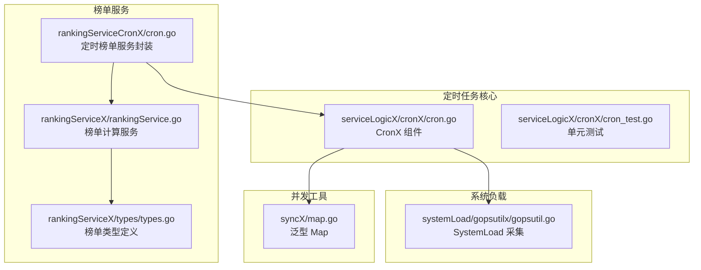
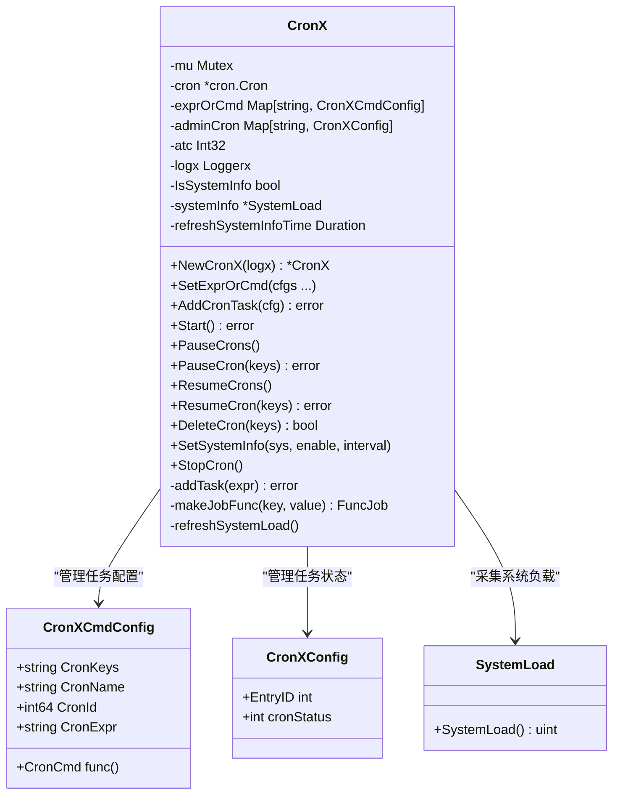
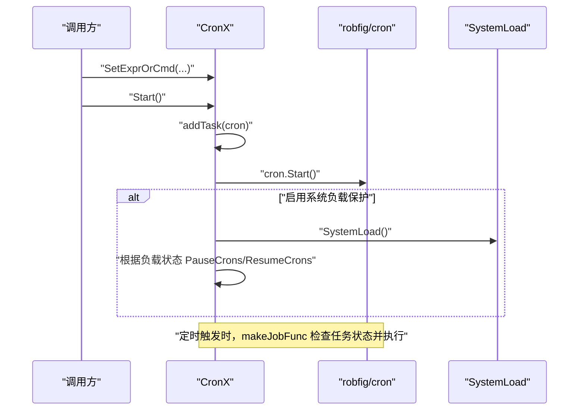
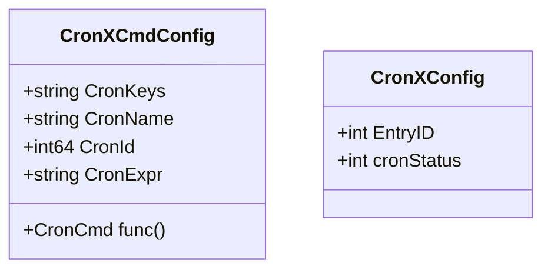
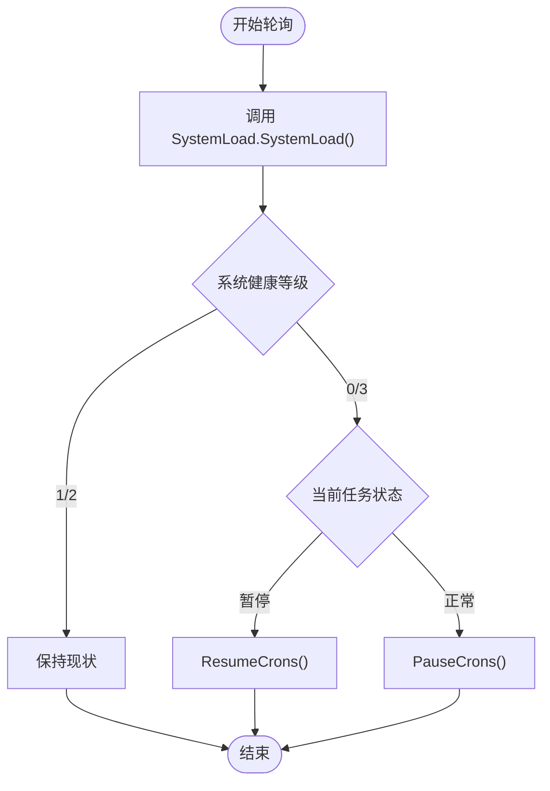
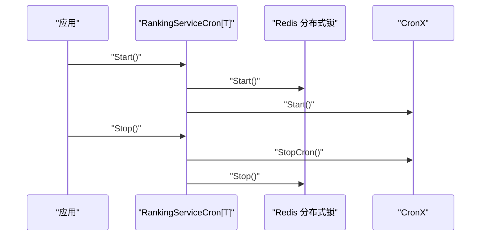
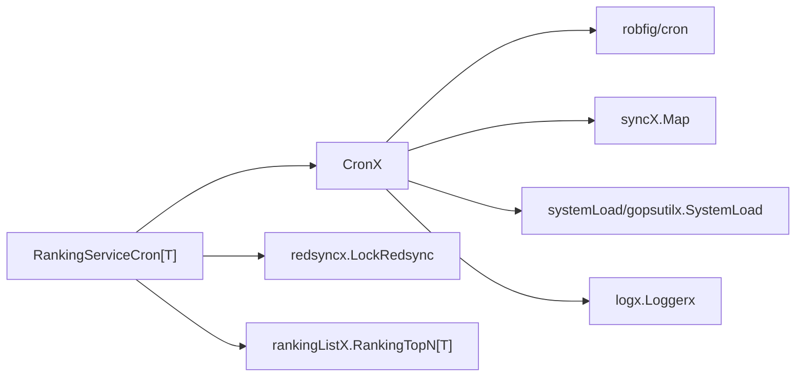

# 定时任务

<cite>
**本文引用的文件**
- [cron.go](file://serviceLogicX/cronX/cron.go)
- [cron_test.go](file://serviceLogicX/cronX/cron_test.go)
- [cron.go](file://serviceLogicX/rankingListX/rankingServiceCronX/cron.go)
- [gopsutil.go](file://systemLoad/gopsutilx/gopsutil.go)
- [map.go](file://syncX/map.go)
- [rankingService.go](file://serviceLogicX/rankingListX/rankingServiceX/rankingService.go)
- [types.go](file://serviceLogicX/rankingListX/rankingServiceX/types/types.go)
</cite>

## 目录
1. [简介](#简介)
2. [项目结构](#项目结构)
3. [核心组件](#核心组件)
4. [架构总览](#架构总览)
5. [详细组件分析](#详细组件分析)
6. [依赖关系分析](#依赖关系分析)
7. [性能与可靠性考量](#性能与可靠性考量)
8. [故障排查指南](#故障排查指南)
9. [结论](#结论)
10. [附录：使用示例与最佳实践](#附录使用示例与最佳实践)

## 简介
本章节面向“定时任务”模块，聚焦于基于 robfig/cron 库二次封装的 CronX 组件。CronX 提供了：
- 动态添加定时任务（AddCronTask）
- 启动（Start）、暂停（PauseCrons/PauseCron）、恢复（ResumeCrons/ResumeCron）、删除（DeleteCron）
- 系统负载保护机制：通过 SetSystemInfo 配置后，自动监控 CPU 与内存使用率，当系统负载过高时自动暂停所有定时任务，待系统恢复后再自动重启，避免定时任务压垮系统
- 关键数据结构：CronXCmdConfig、CronXConfig
- 结合 rankingServiceCronX 包实现的“定时榜单服务”，在分布式锁与定时任务协同下稳定运行

## 项目结构
围绕定时任务模块的关键目录与文件如下：
- serviceLogicX/cronX：CronX 核心实现与测试
- systemLoad/gopsutilx：系统负载采集工具（CPU/内存/负载）
- syncX：并发安全的泛型 Map 封装
- serviceLogicX/rankingListX/rankingServiceCronX：基于 CronX 的定时榜单服务封装
- serviceLogicX/rankingListX/rankingServiceX：榜单计算服务（被定时任务触发）

图表来源
- [cron.go](file://serviceLogicX/cronX/cron.go#L1-L314)
- [gopsutil.go](file://systemLoad/gopsutilx/gopsutil.go#L1-L195)
- [map.go](file://syncX/map.go#L1-L106)
- [cron.go](file://serviceLogicX/rankingListX/rankingServiceCronX/cron.go#L1-L40)
- [rankingService.go](file://serviceLogicX/rankingListX/rankingServiceX/rankingService.go#L1-L105)
- [types.go](file://serviceLogicX/rankingListX/rankingServiceX/types/types.go#L1-L20)

章节来源
- [cron.go](file://serviceLogicX/cronX/cron.go#L1-L314)
- [gopsutil.go](file://systemLoad/gopsutilx/gopsutil.go#L1-L195)
- [map.go](file://syncX/map.go#L1-L106)
- [cron.go](file://serviceLogicX/rankingListX/rankingServiceCronX/cron.go#L1-L40)
- [rankingService.go](file://serviceLogicX/rankingListX/rankingServiceX/rankingService.go#L1-L105)
- [types.go](file://serviceLogicX/rankingListX/rankingServiceX/types/types.go#L1-L20)

## 核心组件
- CronX：定时任务调度器，封装 robfig/cron，提供动态任务管理、暂停/恢复、系统负载保护等能力
- CronXCmdConfig：任务配置项，包含任务键、名称、ID、Cron 表达式与执行逻辑
- CronXConfig：任务管理项，记录 EntryID 与任务状态（正常/暂停/不存在）
- SystemLoad：系统负载采集器，提供 CPU/内存/负载评估接口
- RankingServiceCron：基于 CronX 的定时榜单服务封装，结合分布式锁与定时任务

章节来源
- [cron.go](file://serviceLogicX/cronX/cron.go#L14-L124)
- [gopsutil.go](file://systemLoad/gopsutilx/gopsutil.go#L108-L155)
- [cron.go](file://serviceLogicX/rankingListX/rankingServiceCronX/cron.go#L1-L40)

## 架构总览
CronX 以 robfig/cron 为核心，内部维护两份映射：
- exprOrCmd：任务表达式与执行逻辑的映射
- adminCron：任务 EntryID 与状态的映射

系统负载保护通过 SetSystemInfo 开启，refreshSystemLoad 定时轮询 SystemLoad.SystemLoad 并根据结果自动暂停/恢复所有任务。

图表来源
- [cron.go](file://serviceLogicX/cronX/cron.go#L14-L124)
- [cron.go](file://serviceLogicX/cronX/cron.go#L255-L314)
- [gopsutil.go](file://systemLoad/gopsutilx/gopsutil.go#L108-L155)

## 详细组件分析

### CronX 组件
- 初始化与默认状态
  - NewCronX 创建 CronX 实例，初始化内部 Map、cron 实例与默认暂停状态
- 任务管理
  - SetExprOrCmd：批量设置任务表达式与执行逻辑，校验参数与去重
  - AddCronTask：动态添加任务，支持在 Start 后继续添加；立即注册到 cron 调度器
  - addTask：启动时批量注册任务
  - makeJobFunc：生成任务执行闭包，执行前检查任务状态（正常/暂停/不存在）
  - PauseCrons/ResumeCrons：批量暂停/恢复
  - PauseCron/ResumeCron：单任务暂停/恢复
  - DeleteCron：删除任务并从 cron 调度器移除
- 启停控制
  - Start：注册任务并启动调度器；若启用系统负载保护，则异步刷新系统负载
  - StopCron：停止调度器，等待完成
- 系统负载保护
  - SetSystemInfo：启用系统负载监控与刷新周期
  - refreshSystemLoad：定时轮询 SystemLoad.SystemLoad，根据负载状态自动暂停/恢复

图表来源
- [cron.go](file://serviceLogicX/cronX/cron.go#L43-L102)
- [cron.go](file://serviceLogicX/cronX/cron.go#L255-L314)
- [gopsutil.go](file://systemLoad/gopsutilx/gopsutil.go#L108-L155)

章节来源
- [cron.go](file://serviceLogicX/cronX/cron.go#L29-L124)
- [cron.go](file://serviceLogicX/cronX/cron.go#L126-L207)
- [cron.go](file://serviceLogicX/cronX/cron.go#L209-L253)
- [cron.go](file://serviceLogicX/cronX/cron.go#L255-L314)

### CronXCmdConfig 与 CronXConfig
- CronXCmdConfig：任务配置载体，包含任务键、名称、ID、Cron 表达式与执行逻辑
- CronXConfig：任务管理载体，包含 EntryID 与任务状态（0 正常、1 暂停、2 不存在）

图表来源
- [cron.go](file://serviceLogicX/cronX/cron.go#L104-L124)

章节来源
- [cron.go](file://serviceLogicX/cronX/cron.go#L104-L124)

### 系统负载保护流程
- SystemLoad.SystemLoad：综合 CPU 负载与内存使用率，返回系统健康等级
- CronX.refreshSystemLoad：定时轮询，根据等级自动暂停/恢复任务

图表来源
- [gopsutil.go](file://systemLoad/gopsutilx/gopsutil.go#L108-L155)
- [cron.go](file://serviceLogicX/cronX/cron.go#L255-L314)

章节来源
- [gopsutil.go](file://systemLoad/gopsutilx/gopsutil.go#L108-L155)
- [cron.go](file://serviceLogicX/cronX/cron.go#L255-L314)

### 排行榜定时服务（rankingServiceCronX）
- RankingServiceCron[T]：组合分布式锁与 CronX，统一启动/停止
- Start：先启动分布式锁，再启动 CronX
- Stop：先停止 CronX，再停止分布式锁

图表来源
- [cron.go](file://serviceLogicX/rankingListX/rankingServiceCronX/cron.go#L1-L40)

章节来源
- [cron.go](file://serviceLogicX/rankingListX/rankingServiceCronX/cron.go#L1-L40)

## 依赖关系分析
- CronX 依赖
  - robfig/cron：定时调度核心
  - syncX.Map：并发安全的键值映射
  - systemLoad/gopsutilx.SystemLoad：系统负载采集
  - logx.Loggerx：日志接口
- rankingServiceCronX 依赖
  - cronX.CronX：定时任务调度
  - redsyncx.LockRedsync：分布式锁
  - rankingListX.RankingTopN[T]：榜单服务接口

图表来源
- [cron.go](file://serviceLogicX/cronX/cron.go#L1-L314)
- [map.go](file://syncX/map.go#L1-L106)
- [gopsutil.go](file://systemLoad/gopsutilx/gopsutil.go#L1-L195)
- [cron.go](file://serviceLogicX/rankingListX/rankingServiceCronX/cron.go#L1-L40)

章节来源
- [cron.go](file://serviceLogicX/cronX/cron.go#L1-L314)
- [map.go](file://syncX/map.go#L1-L106)
- [gopsutil.go](file://systemLoad/gopsutilx/gopsutil.go#L1-L195)
- [cron.go](file://serviceLogicX/rankingListX/rankingServiceCronX/cron.go#L1-L40)

## 性能与可靠性考量
- 并发安全
  - 使用互斥锁保护任务注册与状态变更
  - 使用并发安全 Map 存储任务配置与状态
- 动态任务管理
  - AddCronTask 支持在 Start 后继续添加任务，无需重启调度器
- 负载保护
  - refreshSystemLoad 采用定时器轮询，避免频繁系统调用
  - 状态切换仅在等级变化时触发，降低抖动
- 日志可观测性
  - 关键路径均输出日志，便于定位问题

章节来源
- [cron.go](file://serviceLogicX/cronX/cron.go#L64-L102)
- [cron.go](file://serviceLogicX/cronX/cron.go#L209-L253)
- [cron.go](file://serviceLogicX/cronX/cron.go#L255-L314)
- [map.go](file://syncX/map.go#L1-L106)

## 故障排查指南
- 任务未执行
  - 检查任务是否处于暂停状态（cronStatus=1）
  - 确认 CronX 是否已 Start
  - 查看日志中“任务开始执行/任务已暂停/任务不存在”的提示
- 动态添加失败
  - 参数校验：CronKeys/CronName/CronId/CronExpr/CronCmd 不可为空
  - 去重校验：CronKeys 重复会拒绝添加
- 系统负载保护无效
  - 确认 SetSystemInfo 已调用且 isSystemInfo=true
  - 检查 refreshSystemInfoTime 是否为非零
  - 确认 SystemLoad.SystemLoad 可正常返回健康等级
- 删除任务后仍触发
  - 确认 DeleteCron 成功并从 cron 调度器移除了 EntryID

章节来源
- [cron.go](file://serviceLogicX/cronX/cron.go#L126-L207)
- [cron.go](file://serviceLogicX/cronX/cron.go#L209-L253)
- [cron.go](file://serviceLogicX/cronX/cron.go#L255-L314)

## 结论
CronX 通过 robfig/cron 的轻量封装，提供了完善的任务生命周期管理与系统负载保护能力。配合 rankingServiceCronX，可在分布式场景下稳定地执行榜单类定时任务，兼顾可靠性与可维护性。

## 附录：使用示例与最佳实践
- 创建 CronX 实例
  - 参考路径：[NewCronX](file://serviceLogicX/cronX/cron.go#L29-L41)
- 配置任务表达式与执行逻辑
  - 参考路径：[SetExprOrCmd](file://serviceLogicX/cronX/cron.go#L126-L147)
- 启动调度器
  - 参考路径：[Start](file://serviceLogicX/cronX/cron.go#L43-L61)
- 动态添加任务（热添加）
  - 参考路径：[AddCronTask](file://serviceLogicX/cronX/cron.go#L209-L253)
- 暂停/恢复/删除任务
  - 参考路径：[PauseCrons/ResumeCrons/DeleteCron](file://serviceLogicX/cronX/cron.go#L149-L207)
- 启用系统负载保护
  - 参考路径：[SetSystemInfo/refreshSystemLoad](file://serviceLogicX/cronX/cron.go#L288-L314)
  - 系统负载采集：[SystemLoad](file://systemLoad/gopsutilx/gopsutil.go#L108-L155)
- 排行榜定时服务封装
  - 参考路径：[RankingServiceCron.Start/Stop](file://serviceLogicX/rankingListX/rankingServiceCronX/cron.go#L29-L40)
- 榜单计算服务（被定时任务触发）
  - 参考路径：[RankingServiceBatch.GetTopN](file://serviceLogicX/rankingListX/rankingServiceX/rankingService.go#L51-L104)
  - 类型定义：[types.HotScore/ScoreProvider](file://serviceLogicX/rankingListX/rankingServiceX/types/types.go#L1-L20)
- 示例测试（演示基本流程）
  - 参考路径：[TestNewRankingServiceCron](file://serviceLogicX/cronX/cron_test.go#L24-L79)

章节来源
- [cron.go](file://serviceLogicX/cronX/cron.go#L29-L61)
- [cron.go](file://serviceLogicX/cronX/cron.go#L126-L207)
- [cron.go](file://serviceLogicX/cronX/cron.go#L209-L253)
- [cron.go](file://serviceLogicX/cronX/cron.go#L288-L314)
- [gopsutil.go](file://systemLoad/gopsutilx/gopsutil.go#L108-L155)
- [cron.go](file://serviceLogicX/rankingListX/rankingServiceCronX/cron.go#L29-L40)
- [rankingService.go](file://serviceLogicX/rankingListX/rankingServiceX/rankingService.go#L51-L104)
- [types.go](file://serviceLogicX/rankingListX/rankingServiceX/types/types.go#L1-L20)
- [cron_test.go](file://serviceLogicX/cronX/cron_test.go#L24-L79)