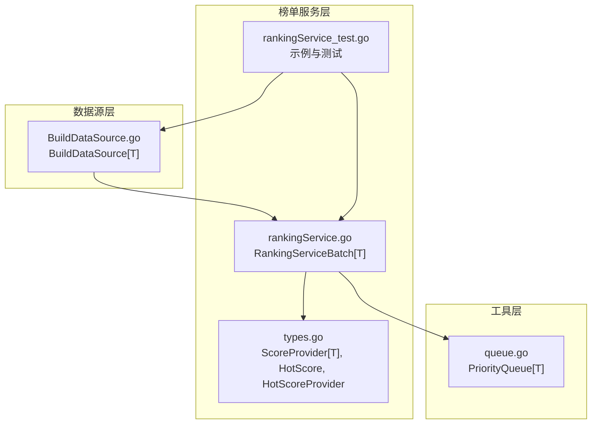
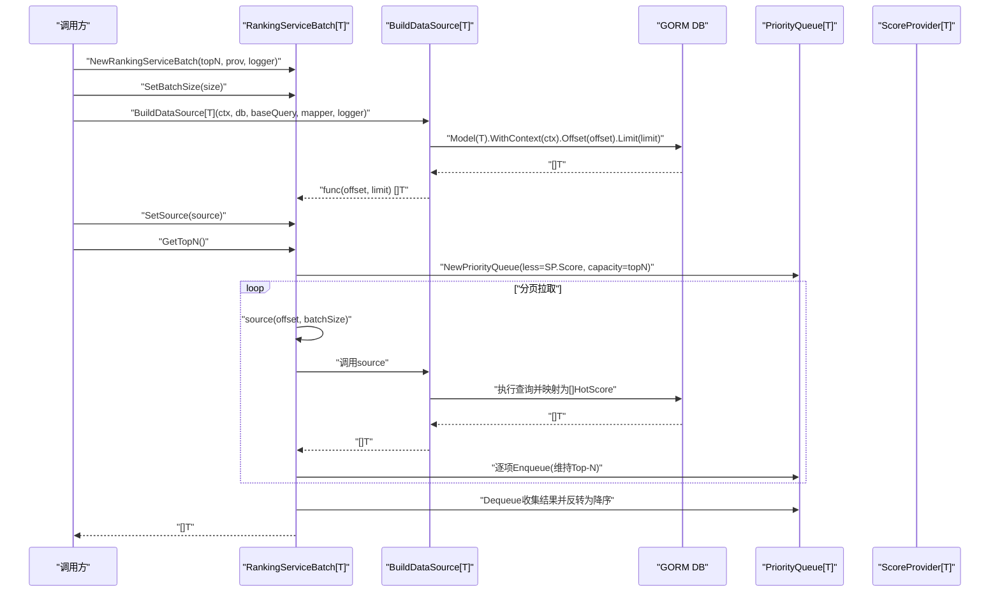
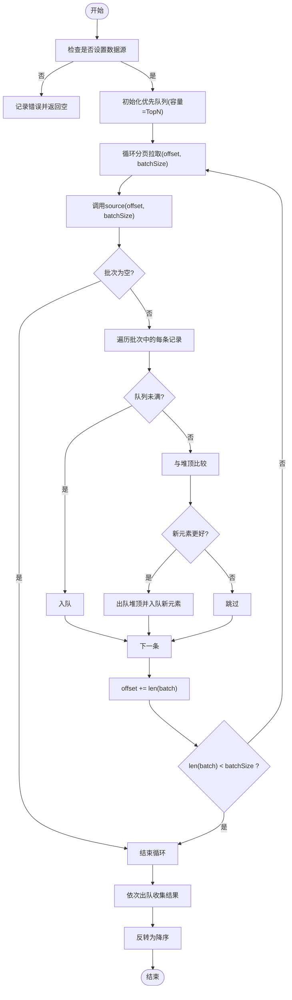
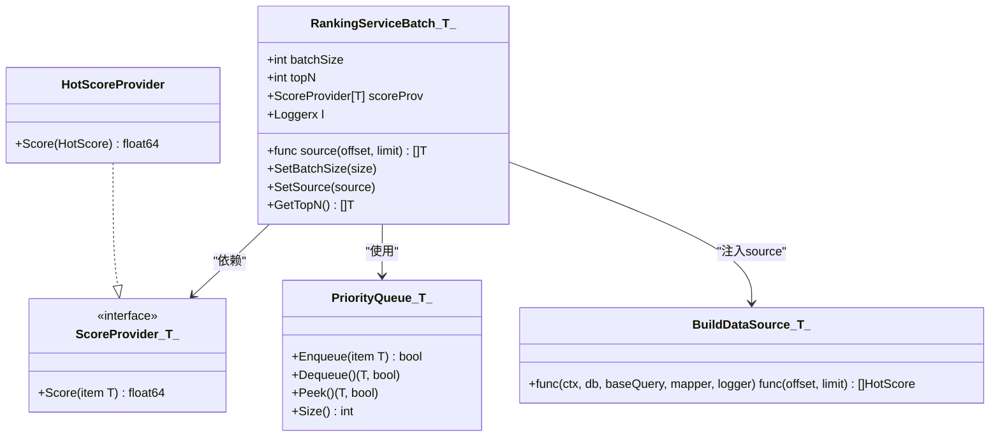

# 基于GORM的批处理榜单服务

<cite>
**本文引用的文件**
- [rankingService.go](file://serviceLogicX/rankingListX/rankingServiceX/rankingService.go)
- [types.go](file://serviceLogicX/rankingListX/rankingServiceX/types/types.go)
- [BuildDataSource.go](file://serviceLogicX/rankingListX/rankingServiceX/buildGormX/BuildDataSource.go)
- [queue.go](file://sliceX/queueX/queue.go)
- [rankingService_test.go](file://serviceLogicX/rankingListX/rankingServiceX/rankingService_test.go)
- [ranking_help](file://serviceLogicX/rankingListX/ranking_help)
</cite>

## 目录
1. [简介](#简介)
2. [项目结构](#项目结构)
3. [核心组件](#核心组件)
4. [架构总览](#架构总览)
5. [详细组件分析](#详细组件分析)
6. [依赖关系分析](#依赖关系分析)
7. [性能考量](#性能考量)
8. [故障排查指南](#故障排查指南)
9. [结论](#结论)
10. [附录](#附录)

## 简介
本文件围绕“基于GORM数据源的泛型榜单服务（RankingServiceBatch）”展开，系统性阐述其设计思想、关键结构体与接口、工厂函数参数校验、GetTopN 的实现原理（含优先队列与分页拉取策略）、典型使用方式（结合 GORM 构建数据源、设置批量大小、获取榜单），并给出适用场景与性能建议。该服务通过泛型与依赖注入实现“数据源与计算逻辑”的解耦，既适用于离线批处理榜单（如日榜、历史总榜），也便于扩展到实时榜单场景。

## 项目结构
围绕榜单服务的相关文件组织如下：
- 排行榜核心实现：serviceLogicX/rankingListX/rankingServiceX/rankingService.go
- 类型与分数提取接口：serviceLogicX/rankingListX/rankingServiceX/types/types.go
- GORM 数据源构建器：serviceLogicX/rankingListX/rankingServiceX/buildGormX/BuildDataSource.go
- 优先队列实现：sliceX/queueX/queue.go
- 使用示例与测试：serviceLogicX/rankingListX/rankingServiceX/rankingService_test.go
- 概念性说明：serviceLogicX/rankingListX/ranking_help

图表来源
- [rankingService.go](file://serviceLogicX/rankingListX/rankingServiceX/rankingService.go#L1-L104)
- [types.go](file://serviceLogicX/rankingListX/rankingServiceX/types/types.go#L1-L20)
- [BuildDataSource.go](file://serviceLogicX/rankingListX/rankingServiceX/buildGormX/BuildDataSource.go#L1-L46)
- [queue.go](file://sliceX/queueX/queue.go#L1-L204)
- [rankingService_test.go](file://serviceLogicX/rankingListX/rankingServiceX/rankingService_test.go#L1-L127)

章节来源
- [rankingService.go](file://serviceLogicX/rankingListX/rankingServiceX/rankingService.go#L1-L104)
- [types.go](file://serviceLogicX/rankingListX/rankingServiceX/types/types.go#L1-L20)
- [BuildDataSource.go](file://serviceLogicX/rankingListX/rankingServiceX/buildGormX/BuildDataSource.go#L1-L46)
- [queue.go](file://sliceX/queueX/queue.go#L1-L204)
- [rankingService_test.go](file://serviceLogicX/rankingListX/rankingServiceX/rankingService_test.go#L1-L127)
- [ranking_help](file://serviceLogicX/rankingListX/ranking_help#L1-L15)

## 核心组件
- RankingServiceBatch[T]：泛型榜单服务主体，包含批量大小、Top-N 数量、数据源注入点、分数提取器与日志。
- ScoreProvider[T]：从任意类型 T 中提取分数的接口，用于 GetTopN 的比较与排序依据。
- HotScore/HotScoreProvider：示例分数结构与提取器，演示如何将具体业务实体映射为榜单分数。
- BuildDataSource[T]：GORM 数据源构建器，封装分页查询与映射逻辑，返回可被 RankingServiceBatch 使用的批量数据源。
- PriorityQueue[T]：线程安全的优先队列，支持有界容量，用于在内存中维护 Top-N。

章节来源
- [rankingService.go](file://serviceLogicX/rankingListX/rankingServiceX/rankingService.go#L9-L16)
- [types.go](file://serviceLogicX/rankingListX/rankingServiceX/types/types.go#L3-L19)
- [BuildDataSource.go](file://serviceLogicX/rankingListX/rankingServiceX/buildGormX/BuildDataSource.go#L10-L46)
- [queue.go](file://sliceX/queueX/queue.go#L8-L26)

## 架构总览
下图展示了“榜单服务”与“数据源构建器”、“优先队列”之间的交互关系，以及依赖注入点（source）与分数提取器（scoreProv）的作用位置。

图表来源
- [rankingService.go](file://serviceLogicX/rankingListX/rankingServiceX/rankingService.go#L50-L104)
- [BuildDataSource.go](file://serviceLogicX/rankingListX/rankingServiceX/buildGormX/BuildDataSource.go#L23-L46)
- [queue.go](file://sliceX/queueX/queue.go#L16-L26)
- [types.go](file://serviceLogicX/rankingListX/rankingServiceX/types/types.go#L3-L19)

## 详细组件分析

### RankingServiceBatch[T] 结构体与方法
- 字段说明
  - batchSize：每次分页拉取的数据条数，默认 100，可通过 SetBatchSize 调整。
  - topN：榜单长度，前 N 名，GetTopN 将返回前 N 条记录。
  - source：数据源注入点，形如 func(offset, limit) []T，负责分页拉取数据。
  - scoreProv：分数提取器，实现 Score(item T) float64，决定比较与排序依据。
  - l：日志接口，用于记录错误与调试信息。
- 方法说明
  - NewRankingServiceBatch：创建服务实例，校验 topN 的默认值与上限（最大 10000），并初始化默认 batchSize。
  - SetBatchSize：设置分页批量大小（>0 生效）。
  - SetSource：注入数据源函数。
  - GetTopN：核心计算流程，使用优先队列维护 Top-N，分页拉取，最后反转为降序。

章节来源
- [rankingService.go](file://serviceLogicX/rankingListX/rankingServiceX/rankingService.go#L9-L16)
- [rankingService.go](file://serviceLogicX/rankingListX/rankingServiceX/rankingService.go#L18-L36)
- [rankingService.go](file://serviceLogicX/rankingListX/rankingServiceX/rankingService.go#L38-L49)
- [rankingService.go](file://serviceLogicX/rankingListX/rankingServiceX/rankingService.go#L50-L104)

### ScoreProvider[T] 与 HotScoreProvider
- ScoreProvider[T]：定义从任意类型 T 提取分数的接口，GetTopN 通过它进行比较。
- HotScore/HotScoreProvider：示例实现，将业务实体映射为 HotScore 并直接取 Score 字段作为分数。

章节来源
- [types.go](file://serviceLogicX/rankingListX/rankingServiceX/types/types.go#L3-L19)

### BuildDataSource[T]：GORM 数据源构建器
- 功能：封装 GORM 查询、分页（Offset/Limit）与映射逻辑，返回可被 RankingServiceBatch 使用的数据源函数。
- 关键点：
  - baseQuery 支持 Select/Where/Order 构建，但不包含分页（分页由内部统一添加）。
  - mapper 将底层实体映射为 HotScore，以便 ScoreProvider 取分数组件。
  - 错误时记录日志并返回空结果。

章节来源
- [BuildDataSource.go](file://serviceLogicX/rankingListX/rankingServiceX/buildGormX/BuildDataSource.go#L10-L46)

### PriorityQueue[T]：优先队列
- 特性：支持有界容量（<=0 表示无界），线程安全，提供 Enqueue/Dequeue/Peek/Size 等操作。
- 在 GetTopN 中的作用：维持 Top-N，当新元素分数更高时替换堆顶，保证内存中始终保存当前最大的 N 个元素。

章节来源
- [queue.go](file://sliceX/queueX/queue.go#L8-L26)
- [queue.go](file://sliceX/queueX/queue.go#L63-L151)
- [queue.go](file://sliceX/queueX/queue.go#L175-L194)

### NewRankingServiceBatch 工厂函数与参数校验
- topN 默认值：<=0 时默认 100。
- topN 上限：超过 10000 时强制截断为 10000，并输出错误日志。
- 返回值：初始化 batchSize=100、scoreProv、l 的 RankingServiceBatch[T] 实例。

章节来源
- [rankingService.go](file://serviceLogicX/rankingListX/rankingServiceX/rankingService.go#L18-L36)

### GetTopN 实现原理与流程
- 输入：已注入的 source、scoreProv、topN、batchSize。
- 流程要点：
  - 初始化优先队列（容量为 topN，less 由 scoreProv.Score 决定）。
  - 以 offset=0、步长 batchSize 进行循环分页拉取：
    - 若 source 返回空或返回条数小于 batchSize，则结束循环。
    - 对每条记录，若队列未满则入队；否则与堆顶比较，若更大则替换堆顶。
    - offset 累加本次拉取数量。
  - 收集阶段：依次出队得到 N 个候选，反转为降序。
- 复杂度概览：
  - 时间复杂度：O(N log K)，其中 N 为总数据量，K 为 topN。
  - 空间复杂度：O(K)。
- 优势：避免全量加载与全量排序，内存占用可控。

图表来源
- [rankingService.go](file://serviceLogicX/rankingListX/rankingServiceX/rankingService.go#L50-L104)
- [queue.go](file://sliceX/queueX/queue.go#L63-L151)

章节来源
- [rankingService.go](file://serviceLogicX/rankingListX/rankingServiceX/rankingService.go#L50-L104)
- [queue.go](file://sliceX/queueX/queue.go#L63-L151)

### 使用示例（结合 GORM 构建数据源、设置批量大小并获取榜单）
- 步骤概览
  - 创建服务：NewRankingServiceBatch(topN, HotScoreProvider{}, logger)
  - 设置批量大小：SetBatchSize(batchSize)
  - 构建数据源：BuildDataSource[T](ctx, db, baseQuery, mapper, logger)
  - 注入数据源：SetSource(source)
  - 获取榜单：GetTopN()
- 示例参考路径
  - 工厂与注入：[rankingService_test.go](file://serviceLogicX/rankingListX/rankingServiceX/rankingService_test.go#L20-L47)
  - 数据源构建与映射：[rankingService_test.go](file://serviceLogicX/rankingListX/rankingServiceX/rankingService_test.go#L32-L44)
  - GORM 查询与分页：[BuildDataSource.go](file://serviceLogicX/rankingListX/rankingServiceX/buildGormX/BuildDataSource.go#L23-L46)
  - 业务实体与分数映射：[rankingService_test.go](file://serviceLogicX/rankingListX/rankingServiceX/rankingService_test.go#L103-L127)

章节来源
- [rankingService_test.go](file://serviceLogicX/rankingListX/rankingServiceX/rankingService_test.go#L20-L47)
- [rankingService_test.go](file://serviceLogicX/rankingListX/rankingServiceX/rankingService_test.go#L32-L44)
- [rankingService_test.go](file://serviceLogicX/rankingListX/rankingServiceX/rankingService_test.go#L103-L127)
- [BuildDataSource.go](file://serviceLogicX/rankingListX/rankingServiceX/buildGormX/BuildDataSource.go#L23-L46)

## 依赖关系分析
- 组件耦合
  - RankingServiceBatch[T] 与 ScoreProvider[T] 通过接口耦合，实现“计算逻辑”与“分数提取”的解耦。
  - RankingServiceBatch[T] 与 BuildDataSource[T] 通过函数注入耦合，实现“数据源”与“计算逻辑”的解耦。
  - RankingServiceBatch[T] 与 PriorityQueue[T] 通过优先队列实现 Top-N 维护。
- 外部依赖
  - GORM：用于分页查询与映射。
  - 日志：统一通过 Loggerx 接口输出错误与调试信息。
- 潜在风险
  - source 未设置会导致直接返回空结果并记录错误。
  - topN 超过上限会被截断，需关注业务合理性。
  - 数据库查询条件（baseQuery）应避免全表扫描，确保分页与排序效率。

图表来源
- [rankingService.go](file://serviceLogicX/rankingListX/rankingServiceX/rankingService.go#L9-L16)
- [types.go](file://serviceLogicX/rankingListX/rankingServiceX/types/types.go#L3-L19)
- [queue.go](file://sliceX/queueX/queue.go#L8-L26)
- [BuildDataSource.go](file://serviceLogicX/rankingListX/rankingServiceX/buildGormX/BuildDataSource.go#L10-L46)

章节来源
- [rankingService.go](file://serviceLogicX/rankingListX/rankingServiceX/rankingService.go#L9-L16)
- [types.go](file://serviceLogicX/rankingListX/rankingServiceX/types/types.go#L3-L19)
- [queue.go](file://sliceX/queueX/queue.go#L8-L26)
- [BuildDataSource.go](file://serviceLogicX/rankingListX/rankingServiceX/buildGormX/BuildDataSource.go#L10-L46)

## 性能考量
- 内存占用
  - 优先队列容量为 topN，内存占用 O(topN)。
  - 建议 topN 合理设置（例如 100~10000），过大将增加内存与堆操作成本。
- 数据库压力
  - 分页拉取避免一次性全量加载，降低内存峰值。
  - baseQuery 应尽量命中索引，避免全表扫描；不加分页条件，分页由内部统一处理。
- 计算复杂度
  - GetTopN 时间复杂度 O(N log K)，K 为 topN，N 为总数据量。
  - 优先队列的堆操作为 O(log K)，整体优于全量排序 O(N log N)。
- 批量大小
  - batchSize 过小会增加分页次数与网络往返；过大可能增加单次查询与映射开销。
  - 建议结合数据分布与数据库性能进行调优（例如 100~1000）。

章节来源
- [rankingService.go](file://serviceLogicX/rankingListX/rankingServiceX/rankingService.go#L50-L104)
- [queue.go](file://sliceX/queueX/queue.go#L63-L151)
- [BuildDataSource.go](file://serviceLogicX/rankingListX/rankingServiceX/buildGormX/BuildDataSource.go#L23-L46)

## 故障排查指南
- 常见问题
  - “未设置数据源”：调用 GetTopN 前必须通过 SetSource 注入 source，否则会记录错误并返回空。
  - “topN 过大”：超过上限会被截断为 10000，并输出错误日志，需调整业务配置。
  - “数据库查询失败”：BuildDataSource 在查询失败时会记录错误日志，包含 offset/limit，便于定位。
- 建议排查步骤
  - 确认已调用 SetSource 并传入有效函数。
  - 检查 baseQuery 是否正确、是否命中索引。
  - 根据日志中的 offset/limit 定位具体批次问题。
  - 适当调整 batchSize 与 topN，观察性能与内存变化。

章节来源
- [rankingService.go](file://serviceLogicX/rankingListX/rankingServiceX/rankingService.go#L50-L104)
- [BuildDataSource.go](file://serviceLogicX/rankingListX/rankingServiceX/buildGormX/BuildDataSource.go#L31-L38)

## 结论
RankingServiceBatch 通过泛型与依赖注入实现了“数据源与计算逻辑”的清晰分离：ScoreProvider[T] 解耦分数提取，BuildDataSource[T] 解耦数据源构建，PriorityQueue[T] 解耦 Top-N 维护。其分页拉取与优先队列策略在数据量适中、计算复杂度可控的前提下，提供了高效且内存友好的榜单计算能力。对于离线批处理榜单（如日榜、历史总榜）尤为适用，同时具备扩展到实时榜单的潜力。

## 附录
- 适用场景
  - 数据量适中（百万级以内）、计算复杂度中等的离线榜单任务。
  - 需要灵活控制数据源查询条件与映射逻辑的场景。
- 不适用场景
  - 实时热榜（Top 100 级别）且对延迟敏感的场景，建议采用基于 Redis/ZSET 的实时榜单方案。
- 参考文档
  - 概念性说明：[ranking_help](file://serviceLogicX/rankingListX/ranking_help#L1-L15)