# 分片机制

<cite>
**本文引用的文件**
- [rankingServiceRdbZset.go](file://serviceLogicX/rankingListX/rankingServiceRdbZsetX/rankingServiceRdbZset.go)
- [rankingServiceRdbZset_test.go](file://serviceLogicX/rankingListX/rankingServiceRdbZsetX/rankingServiceRdbZset_test.go)
- [types.go](file://serviceLogicX/rankingListX/rankingServiceRdbZsetX/types/types.go)
- [rankingService.go](file://serviceLogicX/rankingListX/rankingServiceX/rankingService.go)
- [types.go](file://serviceLogicX/rankingListX/rankingServiceX/types/types.go)
</cite>

## 目录
1. [简介](#简介)
2. [项目结构](#项目结构)
3. [核心组件](#核心组件)
4. [架构概览](#架构概览)
5. [详细组件分析](#详细组件分析)
6. [依赖关系分析](#依赖关系分析)
7. [性能考量](#性能考量)
8. [故障排查指南](#故障排查指南)
9. [结论](#结论)
10. [附录](#附录)

## 简介
本文件围绕基于 FNV-1a 32 位哈希的分片机制展开，重点说明：
- 分片数（shardCount）的设计目的：通过将数据分散到多个 Redis ZSet，缓解单个 ZSet 在海量数据下的性能瓶颈与内存压力。
- getShard 方法如何使用 FNV-1a 32 位哈希将 bizID 映射到 0 到 shardCount-1 的范围，确定其所属分片。
- 分片数量选择策略：针对不同数据规模（小型<10万、中型10万~100万、大型>100万），给出推荐的分片区间（10-32、64-128、128-256）。
- fetchTopNBizIDs 如何并行从所有分片查询 TopN 数据，并在内存中进行全局排序以得到最终结果。
- 初始化 RankingServiceZset 时设置分片数的示例路径与注意事项：分片数确定后不可动态调整的限制。

## 项目结构
本主题涉及的代码位于“serviceLogicX/rankingListX/rankingServiceRdbZsetX”目录下，核心文件包括：
- rankingServiceRdbZset.go：包含分片服务主体、FNV-1a 32 位哈希、分片映射、TopN 并行查询与全局排序等实现。
- rankingServiceRdbZset_test.go：包含初始化分片服务与业务榜单服务的示例路径。
- types/types.go：定义分数提供器与榜单项结构体。

图表来源
- [rankingServiceRdbZset.go](file://serviceLogicX/rankingListX/rankingServiceRdbZsetX/rankingServiceRdbZset.go#L24-L304)

章节来源
- [rankingServiceRdbZset.go](file://serviceLogicX/rankingListX/rankingServiceRdbZsetX/rankingServiceRdbZset.go#L24-L304)
- [rankingServiceRdbZset_test.go](file://serviceLogicX/rankingListX/rankingServiceRdbZsetX/rankingServiceRdbZset_test.go#L20-L53)

## 核心组件
- RankingServiceZset：全局分片服务主体，持有 shardCount、Redis 客户端、本地缓存与日志。
- BizRankingService：具体业务榜单实例，封装业务类型、分数提供器与分片服务的交互。
- FNV-1a 32 位哈希与 getShard：负责将 bizID 均匀映射到各分片。
- fetchTopNBizIDs：并行从所有分片拉取 TopN，再在内存中全局排序。
- IncrScore：根据 bizID 计算分片并更新对应 ZSet 的分数，同时可选更新元数据。

章节来源
- [rankingServiceRdbZset.go](file://serviceLogicX/rankingListX/rankingServiceRdbZsetX/rankingServiceRdbZset.go#L24-L304)
- [types.go](file://serviceLogicX/rankingListX/rankingServiceRdbZsetX/types/types.go#L1-L20)

## 架构概览
分片架构由“全局分片服务 + 业务榜单实例 + Redis ZSet 分片 + 本地缓存”构成。数据写入通过 IncrScore 计算分片并写入对应 ZSet；读取通过 BizRankingService 的 GetTopN 流程，先尝试本地缓存，否则并行查询各分片 TopN，再在内存中按业务分数排序，最后异步回写本地缓存。

图表来源
- [rankingServiceRdbZset.go](file://serviceLogicX/rankingListX/rankingServiceRdbZsetX/rankingServiceRdbZset.go#L212-L218)
- [rankingServiceRdbZset.go](file://serviceLogicX/rankingListX/rankingServiceRdbZsetX/rankingServiceRdbZset.go#L251-L279)

## 详细组件分析

### 分片设计目的与 shardCount
- 设计目的：将数据均匀分布到多个 Redis ZSet，避免单个 ZSet 因数据量过大导致的性能退化与内存压力。
- shardCount 的取值范围与规模建议：
  - 小型系统（<10万数据）：10 ~ 32
  - 中型系统（10万~100万）：64 ~ 128
  - 大型系统（>100万）：128 ~ 256
- 默认值与上限：注释中给出默认值与上限范围（10-256），实际部署应结合数据规模与 QPS 评估。

章节来源
- [rankingServiceRdbZset.go](file://serviceLogicX/rankingListX/rankingServiceRdbZsetX/rankingServiceRdbZset.go#L24-L30)

### FNV-1a 32 位哈希与 getShard
- FNV-1a 32 位哈希：提供稳定、快速且分布均匀的字符串哈希值。
- getShard 映射：对 bizID 做哈希后对 shardCount 取模，得到 0..shardCount-1 的分片索引。
- 作用：确保相同 bizID 总是落到同一分片，同时尽量均匀分布不同 bizID。

图表来源
- [rankingServiceRdbZset.go](file://serviceLogicX/rankingListX/rankingServiceRdbZsetX/rankingServiceRdbZset.go#L286-L304)

章节来源
- [rankingServiceRdbZset.go](file://serviceLogicX/rankingListX/rankingServiceRdbZsetX/rankingServiceRdbZset.go#L286-L304)

### fetchTopNBizIDs 并行查询与全局排序
- 并行查询：为每个分片启动一个 goroutine，使用 ZRevRangeWithScores 拉取 TopN（按分数倒序），并将结果通过通道聚合。
- 全局排序：将所有分片返回的结果合并后，在内存中按业务提供的分数提供器进行排序。
- 返回裁剪：若总数超过 topN，则截断至 topN。

```mermaid
sequenceDiagram
participant Caller as "调用方"
participant Biz as "BizRankingService"
participant R as "Redis 客户端"
participant Sorter as "排序器"
Caller->>Biz : "GetTopN(topN)"
Biz->>Biz : "尝试本地缓存"
alt "缓存命中"
Biz-->>Caller : "返回缓存结果"
else "缓存未命中"
Biz->>Biz : "fetchTopNBizIDs(topN)"
par "并行查询各分片"
loop "遍历 0..shardCount-1"
Biz->>R : "ZRevRangeWithScores(hot_{biz}_{shard}, 0, topN-1)"
R-->>Biz : "分片TopN结果"
end
end
Biz->>Sorter : "合并并按业务分数排序"
Sorter-->>Biz : "全局TopN"
Biz-->>Caller : "返回结果"
end
```

图表来源
- [rankingServiceRdbZset.go](file://serviceLogicX/rankingListX/rankingServiceRdbZsetX/rankingServiceRdbZset.go#L127-L176)

章节来源
- [rankingServiceRdbZset.go](file://serviceLogicX/rankingListX/rankingServiceRdbZsetX/rankingServiceRdbZset.go#L127-L176)

### IncrScore 写入流程
- 计算分片：根据 bizID 通过 getShard 确定分片索引。
- 更新 ZSet：使用 ZIncrBy 对应分片的 ZSet 键，增量更新分数。
- 更新元数据：可选地将元数据写入 hot_meta:{biz}:{bizID} 的 Hash。

图表来源
- [rankingServiceRdbZset.go](file://serviceLogicX/rankingListX/rankingServiceRdbZsetX/rankingServiceRdbZset.go#L251-L279)

章节来源
- [rankingServiceRdbZset.go](file://serviceLogicX/rankingListX/rankingServiceRdbZsetX/rankingServiceRdbZset.go#L251-L279)

### 初始化与分片数设置示例
- 初始化全局分片服务：调用 NewRankingService 并传入 shardCount、Redis 客户端、本地缓存与日志。
- 绑定业务类型：通过 WithBizType 获取 BizRankingService 实例。
- 示例路径参考：
  - 初始化与业务绑定示例：[rankingServiceRdbZset_test.go](file://serviceLogicX/rankingListX/rankingServiceRdbZsetX/rankingServiceRdbZset_test.go#L20-L31)
  - 获取榜单示例：[rankingServiceRdbZset_test.go](file://serviceLogicX/rankingListX/rankingServiceRdbZsetX/rankingServiceRdbZset_test.go#L40-L53)

章节来源
- [rankingServiceRdbZset_test.go](file://serviceLogicX/rankingListX/rankingServiceRdbZsetX/rankingServiceRdbZset_test.go#L20-L53)

### 分片数确定后的限制
- 分片数一经确定，bizID 与分片的映射关系固定，无法动态调整。
- 若需变更分片数，需要重新规划键空间与迁移策略，否则会导致 bizID 重新映射，影响一致性与性能。

章节来源
- [rankingServiceRdbZset.go](file://serviceLogicX/rankingListX/rankingServiceRdbZsetX/rankingServiceRdbZset.go#L286-L304)

## 依赖关系分析
- RankingServiceZset 与 BizRankingService：前者为全局容器，后者为业务实例，二者通过组合关系耦合。
- getShard 依赖 FNV-1a 32 位哈希函数，保证映射均匀性。
- fetchTopNBizIDs 依赖 Redis 客户端并行查询各分片，依赖分数提供器进行全局排序。
- IncrScore 依赖 getShard 与 Redis 客户端，实现写入与元数据同步。

图表来源
- [rankingServiceRdbZset.go](file://serviceLogicX/rankingListX/rankingServiceRdbZsetX/rankingServiceRdbZset.go#L24-L304)
- [types.go](file://serviceLogicX/rankingListX/rankingServiceRdbZsetX/types/types.go#L1-L20)

章节来源
- [rankingServiceRdbZset.go](file://serviceLogicX/rankingListX/rankingServiceRdbZsetX/rankingServiceRdbZset.go#L24-L304)
- [types.go](file://serviceLogicX/rankingListX/rankingServiceRdbZsetX/types/types.go#L1-L20)

## 性能考量
- 并发查询：fetchTopNBizIDs 对所有分片并发查询，显著降低整体延迟。
- 内存排序：合并后在内存中排序，适合 TopN 场景；若 topN 较大，需关注内存占用。
- 本地缓存：优先命中本地缓存，减少 Redis 压力；后台定时刷新提升命中率。
- 分片均匀性：FNV-1a 32 位哈希具备良好的均匀性，有助于避免热点分片。
- 写入路径：IncrScore 仅一次写入对应分片，写放大低；元数据写入可选，避免阻塞主路径。

## 故障排查指南
- 分片查询异常：fetchTopNBizIDs 任一分片查询失败会直接返回错误，检查 Redis 连接与键命名是否正确。
- 排序异常：若业务分数提供器返回异常值，可能导致排序结果异常，确认 ScoreProvider 的实现。
- 写入失败：IncrScore 对 ZIncrBy 或 HMSet 的错误会记录日志，检查 Redis 权限与键空间。
- 缓存未命中：若本地缓存命中率低，适当缩短刷新间隔或增大缓存容量。

章节来源
- [rankingServiceRdbZset.go](file://serviceLogicX/rankingListX/rankingServiceRdbZsetX/rankingServiceRdbZset.go#L127-L176)
- [rankingServiceRdbZset.go](file://serviceLogicX/rankingListX/rankingServiceRdbZsetX/rankingServiceRdbZset.go#L251-L279)

## 结论
本分片机制通过 FNV-1a 32 位哈希将 bizID 均匀映射到多个 Redis ZSet，配合并行查询与内存全局排序，有效缓解了单点 ZSet 的性能与内存压力。分片数应依据数据规模与 QPS 选择合适的区间，并在上线前完成压测验证。初始化完成后，分片数不可动态调整，需谨慎决策。

## 附录
- 分片数量选择策略（来自注释与实现）：
  - 小型系统（<10万数据）：10 ~ 32
  - 中型系统（10万~100万）：64 ~ 128
  - 大型系统（>100万）：128 ~ 256
- 初始化示例路径：
  - 新建全局分片服务与业务榜单服务：[rankingServiceRdbZset_test.go](file://serviceLogicX/rankingListX/rankingServiceRdbZsetX/rankingServiceRdbZset_test.go#L20-L31)
  - 获取榜单示例：[rankingServiceRdbZset_test.go](file://serviceLogicX/rankingListX/rankingServiceRdbZsetX/rankingServiceRdbZset_test.go#L40-L53)