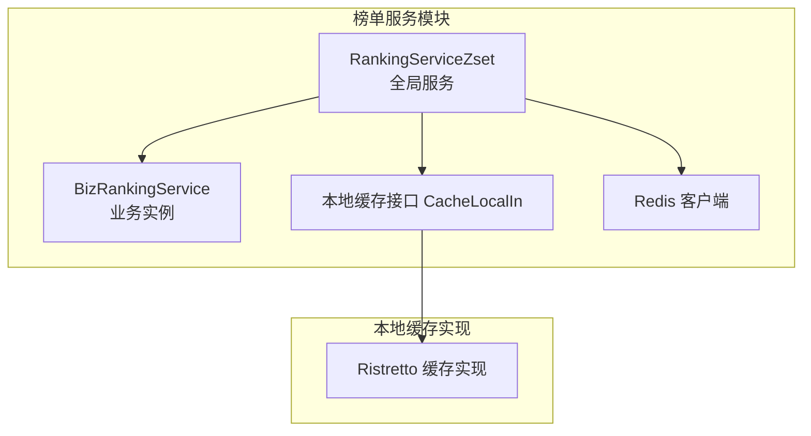
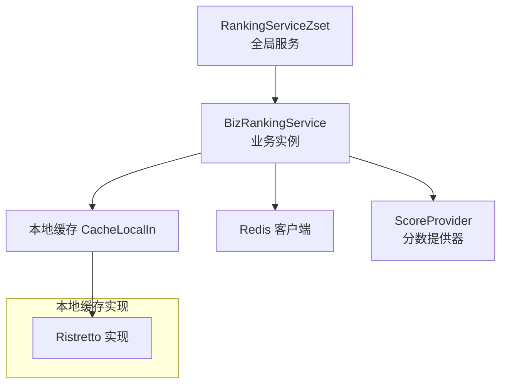
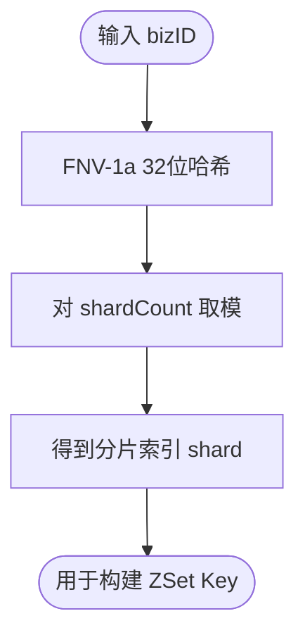
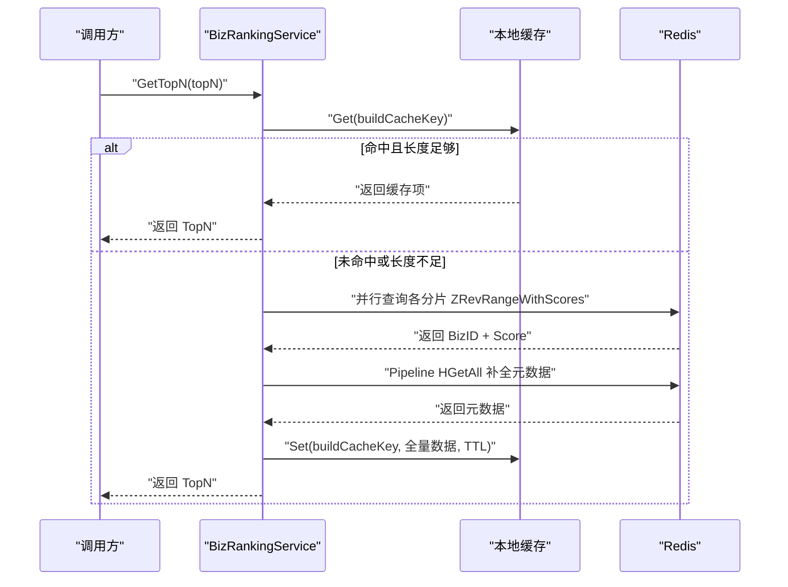
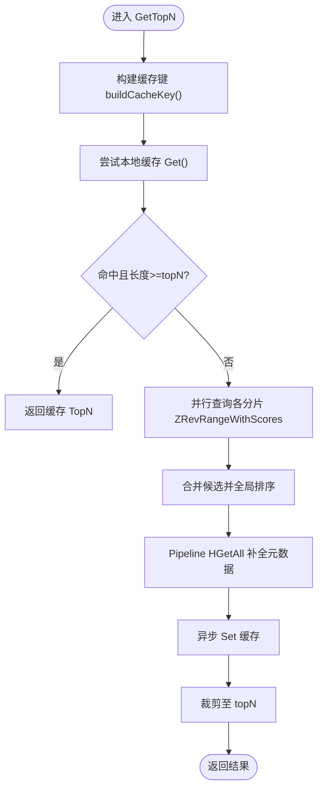
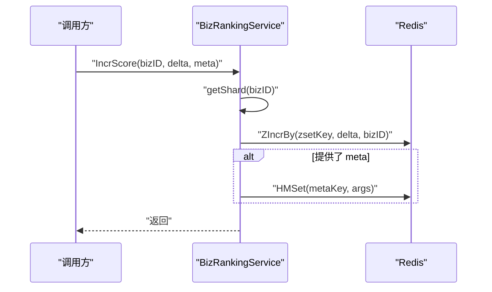
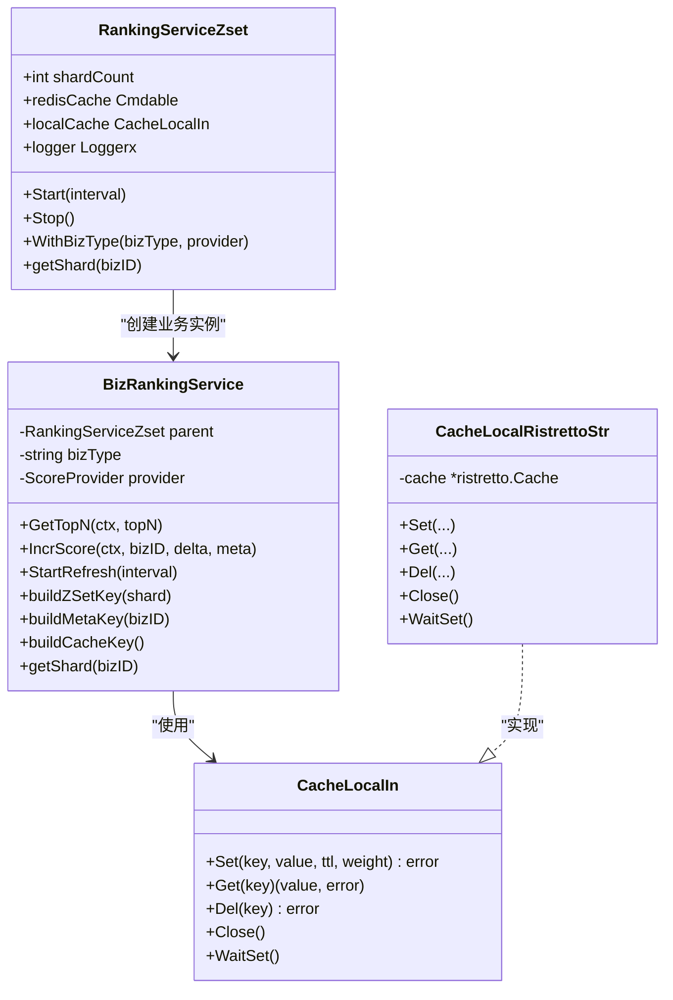

# 基于Redis ZSet的实时榜单服务

<cite>
**本文引用的文件列表**
- [rankingServiceRdbZset.go](file://serviceLogicX/rankingListX/rankingServiceRdbZsetX/rankingServiceRdbZset.go)
- [types.go](file://serviceLogicX/rankingListX/rankingServiceRdbZsetX/types/types.go)
- [ristretto.go](file://DBx/localCahceX/cacheLocalRistrettox/ristretto.go)
- [rankingServiceRdbZset_test.go](file://serviceLogicX/rankingListX/rankingServiceRdbZsetX/rankingServiceRdbZset_test.go)
</cite>

## 目录
1. [简介](#简介)
2. [项目结构](#项目结构)
3. [核心组件](#核心组件)
4. [架构总览](#架构总览)
5. [组件详解](#组件详解)
6. [依赖关系分析](#依赖关系分析)
7. [性能与扩展性](#性能与扩展性)
8. [故障排查指南](#故障排查指南)
9. [结论](#结论)
10. [附录：使用示例路径](#附录使用示例路径)

## 简介
本文件围绕基于Redis ZSet的高性能实时榜单服务（RankingServiceZset）展开，目标是帮助读者快速理解并正确使用该服务。文档重点包括：
- 整体架构：全局服务（RankingServiceZset）负责分片与缓存管理；业务实例（BizRankingService）封装具体业务维度的榜单操作。
- 分片设计（shardCount）与映射：通过FNV-1a 32位哈希将bizID均匀分布到多个ZSet分片，以支撑海量数据与高并发场景。
- 多级缓存：本地缓存（Ristretto）通过buildCacheKey实现毫秒级响应；后台刷新（backgroundRefresh）预热热门榜单，降低冷启动延迟。
- 关键流程：GetTopN优先读取本地缓存，未命中则并行拉取各分片ZSet进行全局排序，并通过enrichHotScores批量补全元数据；IncrScore原子性更新ZSet分数与独立的元数据Hash。
- 初始化、配置分片、更新分数、查询榜单的完整使用路径与最佳实践。

## 项目结构
该功能位于服务逻辑层的“rankingListX”子模块中，核心代码集中在rankingServiceRdbZsetX包内，配合本地缓存实现高性能读取。

图表来源
- [rankingServiceRdbZset.go](file://serviceLogicX/rankingListX/rankingServiceRdbZsetX/rankingServiceRdbZset.go#L23-L34)
- [rankingServiceRdbZset.go](file://serviceLogicX/rankingListX/rankingServiceRdbZsetX/rankingServiceRdbZset.go#L16-L20)
- [ristretto.go](file://DBx/localCahceX/cacheLocalRistrettox/ristretto.go#L1-L61)

章节来源
- [rankingServiceRdbZset.go](file://serviceLogicX/rankingListX/rankingServiceRdbZsetX/rankingServiceRdbZset.go#L1-L120)
- [ristretto.go](file://DBx/localCahceX/cacheLocalRistrettox/ristretto.go#L1-L61)

## 核心组件
- RankingServiceZset（全局服务）
  - 职责：管理分片数量、持有Redis客户端与本地缓存、提供业务实例工厂、启动/停止后台刷新。
  - 关键字段：shardCount、redisCache、localCache、logger、上下文与once控制后台生命周期。
- BizRankingService（业务实例）
  - 职责：面向具体bizType的榜单操作，包含GetTopN、IncrScore、后台刷新等。
  - 关键方法：GetTopN、fetchTopNBizIDs、enrichHotScores、IncrScore、buildZSetKey/buildMetaKey/buildCacheKey、getShard。
- 本地缓存接口与实现
  - 接口：CacheLocalIn[K,V]，支持Set/Get/Del/Close/WaitSet等。
  - 实现：Ristretto实现，提供高性能、并发安全、带准入策略的内存缓存。

章节来源
- [rankingServiceRdbZset.go](file://serviceLogicX/rankingListX/rankingServiceRdbZsetX/rankingServiceRdbZset.go#L16-L34)
- [rankingServiceRdbZset.go](file://serviceLogicX/rankingListX/rankingServiceRdbZsetX/rankingServiceRdbZset.go#L95-L124)
- [rankingServiceRdbZset.go](file://serviceLogicX/rankingListX/rankingServiceRdbZsetX/rankingServiceRdbZset.go#L126-L175)
- [rankingServiceRdbZset.go](file://serviceLogicX/rankingListX/rankingServiceRdbZsetX/rankingServiceRdbZset.go#L177-L209)
- [rankingServiceRdbZset.go](file://serviceLogicX/rankingListX/rankingServiceRdbZsetX/rankingServiceRdbZset.go#L254-L278)
- [rankingServiceRdbZset.go](file://serviceLogicX/rankingListX/rankingServiceRdbZsetX/rankingServiceRdbZset.go#L286-L304)
- [ristretto.go](file://DBx/localCahceX/cacheLocalRistrettox/ristretto.go#L1-L61)

## 架构总览
下图展示了全局服务与业务实例之间的协作关系，以及与Redis和本地缓存的交互。

图表来源
- [rankingServiceRdbZset.go](file://serviceLogicX/rankingListX/rankingServiceRdbZsetX/rankingServiceRdbZset.go#L23-L34)
- [rankingServiceRdbZset.go](file://serviceLogicX/rankingListX/rankingServiceRdbZsetX/rankingServiceRdbZset.go#L16-L20)
- [rankingServiceRdbZset.go](file://serviceLogicX/rankingListX/rankingServiceRdbZsetX/rankingServiceRdbZset.go#L25-L28)
- [ristretto.go](file://DBx/localCahceX/cacheLocalRistrettox/ristretto.go#L1-L61)

## 组件详解

### 分片与映射（shardCount 与 FNV-1a）
- 设计目的：将海量bizID均匀分布到多个ZSet分片，避免单点热点与锁竞争，提升并发读写能力。
- 映射算法：使用FNV-1a 32位哈希函数对bizID进行哈希，再对分片数取模得到分片索引。
- 配置建议：根据数据规模选择合适分片数（小型系统约10~32，中型64~128，大型128~256），避免过度分片导致查询开销增大。

图表来源
- [rankingServiceRdbZset.go](file://serviceLogicX/rankingListX/rankingServiceRdbZsetX/rankingServiceRdbZset.go#L286-L304)
- [rankingServiceRdbZset.go](file://serviceLogicX/rankingListX/rankingServiceRdbZsetX/rankingServiceRdbZset.go#L223-L226)

章节来源
- [rankingServiceRdbZset.go](file://serviceLogicX/rankingListX/rankingServiceRdbZsetX/rankingServiceRdbZset.go#L24-L34)
- [rankingServiceRdbZset.go](file://serviceLogicX/rankingListX/rankingServiceRdbZsetX/rankingServiceRdbZset.go#L286-L304)
- [rankingServiceRdbZset.go](file://serviceLogicX/rankingListX/rankingServiceRdbZsetX/rankingServiceRdbZset.go#L223-L226)

### 多级缓存与后台刷新
- 本地缓存（localCache）：通过buildCacheKey统一缓存键，Ristretto实现具备高并发与准入策略，能实现毫秒级读取。
- 后台刷新（backgroundRefresh）：周期性预拉取TopN榜单并回写本地缓存，降低首次访问延迟与热点压力。
- 降级策略：当元数据补全失败时，返回基础分数列表，保证可用性。

图表来源
- [rankingServiceRdbZset.go](file://serviceLogicX/rankingListX/rankingServiceRdbZsetX/rankingServiceRdbZset.go#L95-L124)
- [rankingServiceRdbZset.go](file://serviceLogicX/rankingListX/rankingServiceRdbZsetX/rankingServiceRdbZset.go#L126-L175)
- [rankingServiceRdbZset.go](file://serviceLogicX/rankingListX/rankingServiceRdbZsetX/rankingServiceRdbZset.go#L177-L209)
- [rankingServiceRdbZset.go](file://serviceLogicX/rankingListX/rankingServiceRdbZsetX/rankingServiceRdbZset.go#L219-L221)
- [ristretto.go](file://DBx/localCahceX/cacheLocalRistrettox/ristretto.go#L21-L42)

章节来源
- [rankingServiceRdbZset.go](file://serviceLogicX/rankingListX/rankingServiceRdbZsetX/rankingServiceRdbZset.go#L95-L124)
- [rankingServiceRdbZset.go](file://serviceLogicX/rankingListX/rankingServiceRdbZsetX/rankingServiceRdbZset.go#L126-L175)
- [rankingServiceRdbZset.go](file://serviceLogicX/rankingListX/rankingServiceRdbZsetX/rankingServiceRdbZset.go#L177-L209)
- [rankingServiceRdbZset.go](file://serviceLogicX/rankingListX/rankingServiceRdbZsetX/rankingServiceRdbZset.go#L219-L221)
- [ristretto.go](file://DBx/localCahceX/cacheLocalRistrettox/ristretto.go#L21-L42)

### GetTopN 完整流程
- 本地缓存优先：使用buildCacheKey尝试命中，若长度满足topN直接返回。
- 并行分片查询：为每个分片启动goroutine，使用ZRevRangeWithScores获取TopN候选，聚合后进行全局排序。
- 元数据补全：通过Pipeline批量HGetAll补全Title等元信息，失败时降级返回基础分数。
- 异步回写：异步将全量结果写回本地缓存，设置TTL与权重。

图表来源
- [rankingServiceRdbZset.go](file://serviceLogicX/rankingListX/rankingServiceRdbZsetX/rankingServiceRdbZset.go#L95-L124)
- [rankingServiceRdbZset.go](file://serviceLogicX/rankingListX/rankingServiceRdbZsetX/rankingServiceRdbZset.go#L126-L175)
- [rankingServiceRdbZset.go](file://serviceLogicX/rankingListX/rankingServiceRdbZsetX/rankingServiceRdbZset.go#L177-L209)

章节来源
- [rankingServiceRdbZset.go](file://serviceLogicX/rankingListX/rankingServiceRdbZsetX/rankingServiceRdbZset.go#L95-L124)
- [rankingServiceRdbZset.go](file://serviceLogicX/rankingListX/rankingServiceRdbZsetX/rankingServiceRdbZset.go#L126-L175)
- [rankingServiceRdbZset.go](file://serviceLogicX/rankingListX/rankingServiceRdbZsetX/rankingServiceRdbZset.go#L177-L209)

### IncrScore 原子性更新
- 分片定位：根据bizID计算分片索引，确保同一bizID落到同一ZSet。
- 分数更新：使用ZIncrBy原子性地增加/减少分数。
- 元数据更新：可选地使用HMSet批量写入元数据Hash，失败不阻塞核心分数更新。

图表来源
- [rankingServiceRdbZset.go](file://serviceLogicX/rankingListX/rankingServiceRdbZsetX/rankingServiceRdbZset.go#L254-L278)
- [rankingServiceRdbZset.go](file://serviceLogicX/rankingListX/rankingServiceRdbZsetX/rankingServiceRdbZset.go#L223-L226)
- [rankingServiceRdbZset.go](file://serviceLogicX/rankingListX/rankingServiceRdbZsetX/rankingServiceRdbZset.go#L259-L277)

章节来源
- [rankingServiceRdbZset.go](file://serviceLogicX/rankingListX/rankingServiceRdbZsetX/rankingServiceRdbZset.go#L254-L278)
- [rankingServiceRdbZset.go](file://serviceLogicX/rankingListX/rankingServiceRdbZsetX/rankingServiceRdbZset.go#L223-L226)

### 数据模型与分数提供器
- HotScore：包含bizType、bizID、score、title等字段。
- ScoreProvider：抽象分数提取接口，BizRankingService在全局排序时使用provider.Score进行比较。

章节来源
- [types.go](file://serviceLogicX/rankingListX/rankingServiceRdbZsetX/types/types.go#L1-L20)

## 依赖关系分析
- RankingServiceZset 依赖 Redis 客户端与本地缓存接口，通过接口解耦实现细节。
- BizRankingService 依赖全局服务、Redis 客户端、本地缓存与分数提供器。
- 本地缓存实现采用Ristretto，提供高性能Set/Get/Del/Close/WaitSet等能力。

图表来源
- [rankingServiceRdbZset.go](file://serviceLogicX/rankingListX/rankingServiceRdbZsetX/rankingServiceRdbZset.go#L23-L34)
- [rankingServiceRdbZset.go](file://serviceLogicX/rankingListX/rankingServiceRdbZsetX/rankingServiceRdbZset.go#L16-L20)
- [rankingServiceRdbZset.go](file://serviceLogicX/rankingListX/rankingServiceRdbZsetX/rankingServiceRdbZset.go#L25-L28)
- [ristretto.go](file://DBx/localCahceX/cacheLocalRistrettox/ristretto.go#L1-L61)

章节来源
- [rankingServiceRdbZset.go](file://serviceLogicX/rankingListX/rankingServiceRdbZsetX/rankingServiceRdbZset.go#L23-L34)
- [rankingServiceRdbZset.go](file://serviceLogicX/rankingListX/rankingServiceRdbZsetX/rankingServiceRdbZset.go#L16-L20)
- [rankingServiceRdbZset.go](file://serviceLogicX/rankingListX/rankingServiceRdbZsetX/rankingServiceRdbZset.go#L25-L28)
- [ristretto.go](file://DBx/localCahceX/cacheLocalRistrettox/ristretto.go#L1-L61)

## 性能与扩展性
- 分片策略：通过FNV-1a哈希与取模实现均匀分布，建议结合数据规模与QPS评估分片数。
- 并行查询：分片级并行拉取ZSet，显著降低全局TopN查询延迟。
- 本地缓存：Ristretto具备高并发与准入策略，配合TTL与权重，可实现毫秒级读取。
- 后台刷新：周期性预热TopN，缓解突发流量与冷启动问题。
- 元数据批量补全：Pipeline减少RTT，提高整体吞吐。

[本节为通用性能讨论，无需列出具体文件来源]

## 故障排查指南
- GetTopN返回空或不完整
  - 检查本地缓存是否命中（键名buildCacheKey是否一致）。
  - 确认分片ZSet是否存在且包含bizID。
  - 检查元数据Hash是否正确写入（HGetAll是否能返回title等字段）。
- IncrScore失败
  - 检查ZIncrBy返回错误，确认zsetKey构建是否正确。
  - 若meta写入失败，确认HMSet参数构造与Redis连接状态。
- 后台刷新无效
  - 确认StartRefresh已调用且interval合理。
  - 检查Ticker循环是否被ctx取消。

章节来源
- [rankingServiceRdbZset.go](file://serviceLogicX/rankingListX/rankingServiceRdbZsetX/rankingServiceRdbZset.go#L95-L124)
- [rankingServiceRdbZset.go](file://serviceLogicX/rankingListX/rankingServiceRdbZsetX/rankingServiceRdbZset.go#L126-L175)
- [rankingServiceRdbZset.go](file://serviceLogicX/rankingListX/rankingServiceRdbZsetX/rankingServiceRdbZset.go#L177-L209)
- [rankingServiceRdbZset.go](file://serviceLogicX/rankingListX/rankingServiceRdbZsetX/rankingServiceRdbZset.go#L254-L278)
- [rankingServiceRdbZset.go](file://serviceLogicX/rankingListX/rankingServiceRdbZsetX/rankingServiceRdbZset.go#L228-L248)

## 结论
该服务通过分片与哈希映射、多级缓存与后台预热、并行查询与Pipeline补全元数据等手段，实现了高并发、低延迟的实时榜单能力。在生产环境中，建议结合业务数据规模合理配置分片数，启用后台刷新，并对本地缓存容量与TTL进行压测优化。

[本节为总结性内容，无需列出具体文件来源]

## 附录：使用示例路径
以下为初始化服务、配置分片、更新分数与查询榜单的关键步骤与对应文件位置（不展示具体代码内容）：
- 初始化全局服务与本地缓存
  - 参考：[rankingServiceRdbZset_test.go](file://serviceLogicX/rankingListX/rankingServiceRdbZsetX/rankingServiceRdbZset_test.go#L20-L31)
- 获取业务实例并启动后台刷新
  - 参考：[rankingServiceRdbZset_test.go](file://serviceLogicX/rankingListX/rankingServiceRdbZsetX/rankingServiceRdbZset_test.go#L24-L31)
- 更新分数（含可选元数据）
  - 参考：[rankingServiceRdbZset.go](file://serviceLogicX/rankingListX/rankingServiceRdbZsetX/rankingServiceRdbZset.go#L254-L278)
- 查询TopN榜单
  - 参考：[rankingServiceRdbZset.go](file://serviceLogicX/rankingListX/rankingServiceRdbZsetX/rankingServiceRdbZset.go#L95-L124)
- 分片与键构建
  - 参考：[rankingServiceRdbZset.go](file://serviceLogicX/rankingListX/rankingServiceRdbZsetX/rankingServiceRdbZset.go#L211-L221)
  - 参考：[rankingServiceRdbZset.go](file://serviceLogicX/rankingListX/rankingServiceRdbZsetX/rankingServiceRdbZset.go#L286-L304)