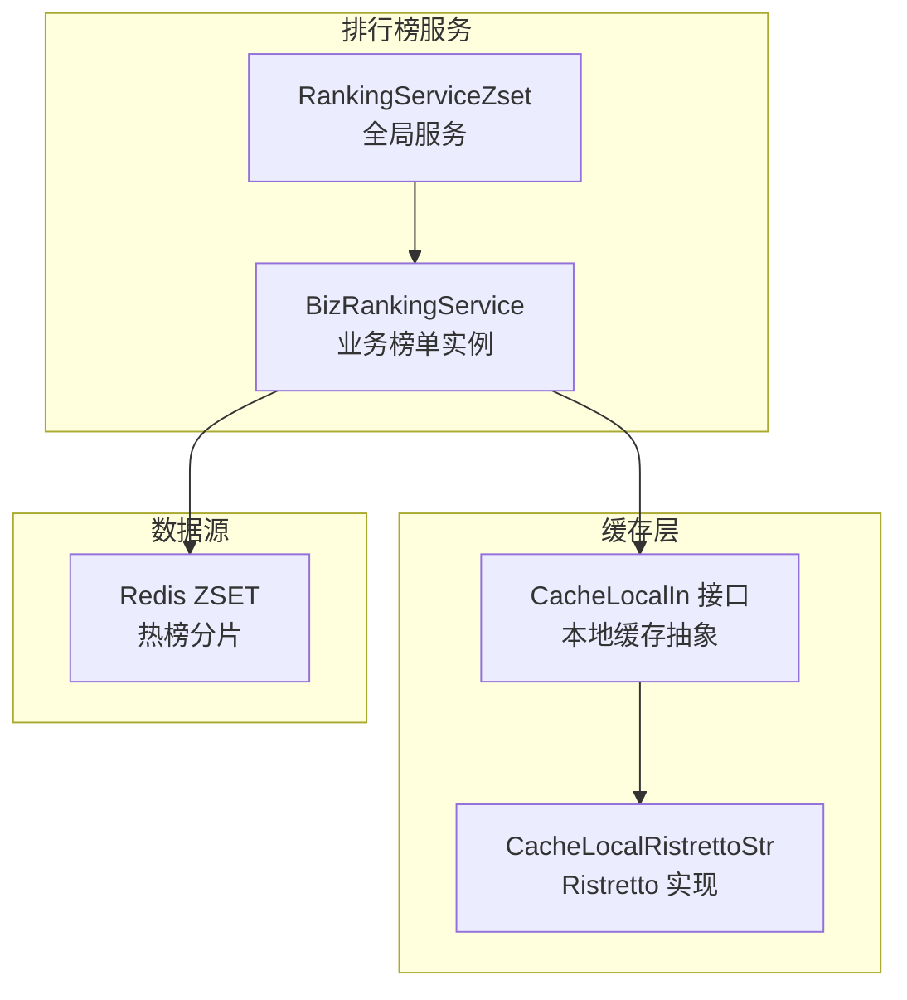
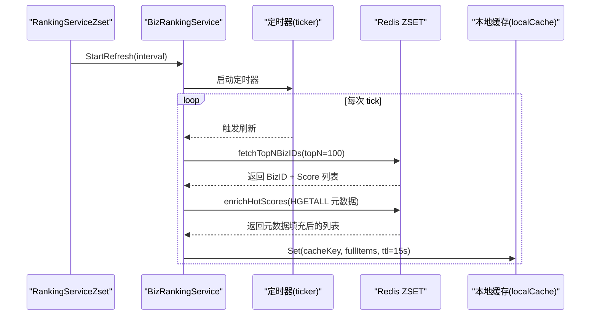
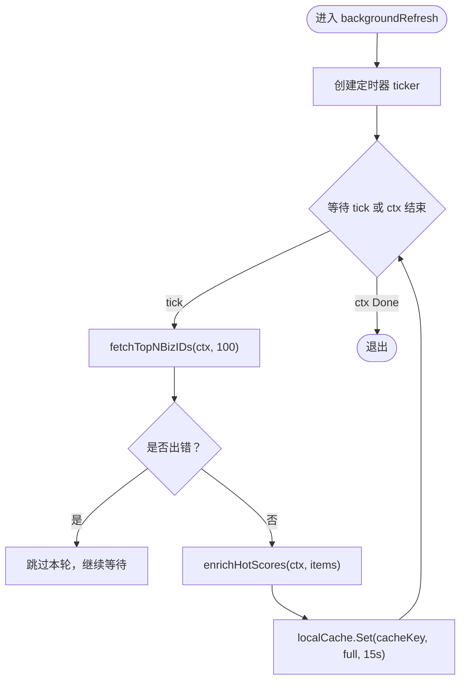
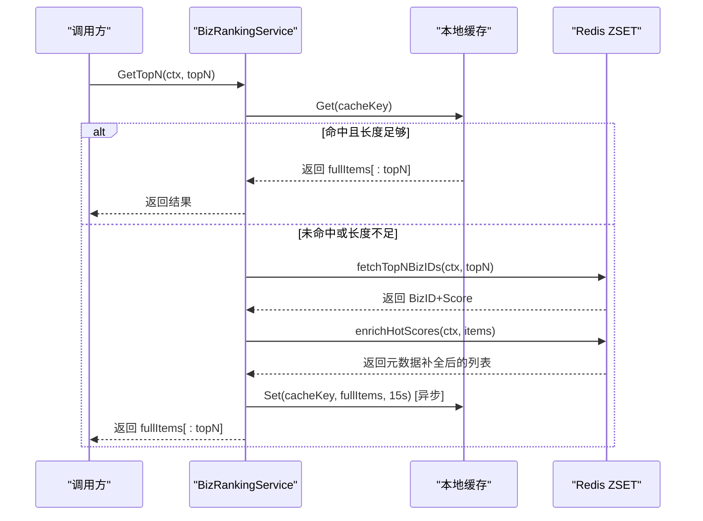
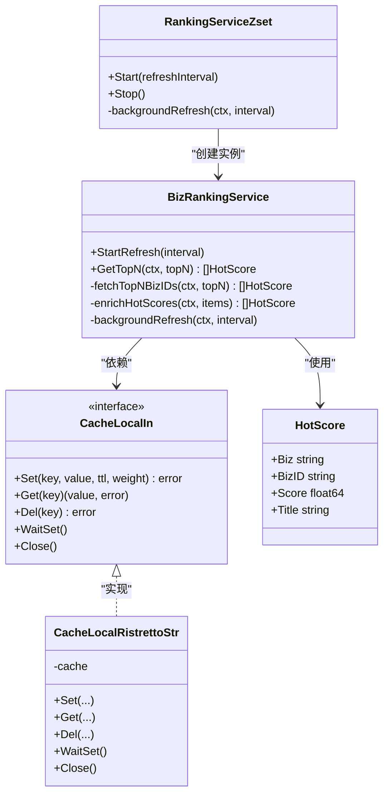

# 后台刷新机制

<cite>
**本文引用的文件**
- [rankingServiceRdbZset.go](file://serviceLogicX/rankingListX/rankingServiceRdbZsetX/rankingServiceRdbZset.go)
- [types.go](file://serviceLogicX/rankingListX/rankingServiceRdbZsetX/types/types.go)
- [types.go](file://DBx/localCahceX/types.go)
- [ristretto.go](file://DBx/localCahceX/cacheLocalRistrettox/ristretto.go)
- [rankingServiceRdbZset_test.go](file://serviceLogicX/rankingListX/rankingServiceRdbZsetX/rankingServiceRdbZset_test.go)
</cite>

## 目录
1. [简介](#简介)
2. [项目结构](#项目结构)
3. [核心组件](#核心组件)
4. [架构总览](#架构总览)
5. [详细组件分析](#详细组件分析)
6. [依赖关系分析](#依赖关系分析)
7. [性能考量](#性能考量)
8. [故障排查指南](#故障排查指南)
9. [结论](#结论)
10. [附录](#附录)

## 简介
本文件围绕“多级缓存后台刷新机制”展开，重点阐述以下内容：
- Start 方法如何启动 backgroundRefresh 协程，并通过 ticker 实现周期性刷新。
- backgroundRefresh 函数内部逻辑：定时调用 fetchTopNBizIDs 获取最新榜单 ID 与分数，再通过 enrichHotScores 补全元数据，最终将完整榜单异步写入本地缓存（localCache.Set），确保缓存数据的相对新鲜度。
- 该机制通过减少实时查询压力来提升系统性能，并讨论刷新间隔与缓存过期时间（15 秒）的协同设计。
- 提供 StartRefresh 方法的使用示例，说明其在服务初始化阶段的调用时机，并分析上下文（context）控制对后台任务生命周期管理的重要性。

## 项目结构
本次文档聚焦于“排行榜服务”的后台刷新实现，相关文件位于 serviceLogicX/rankingListX/rankingServiceRdbZsetX 目录下；同时涉及本地缓存抽象与实现（DBx/localCahceX）。

图表来源
- [rankingServiceRdbZset.go](file://serviceLogicX/rankingListX/rankingServiceRdbZsetX/rankingServiceRdbZset.go#L1-L120)
- [types.go](file://DBx/localCahceX/types.go#L1-L32)
- [ristretto.go](file://DBx/localCahceX/cacheLocalRistrettox/ristretto.go#L1-L60)

章节来源
- [rankingServiceRdbZset.go](file://serviceLogicX/rankingListX/rankingServiceRdbZsetX/rankingServiceRdbZset.go#L1-L120)
- [types.go](file://DBx/localCahceX/types.go#L1-L32)
- [ristretto.go](file://DBx/localCahceX/cacheLocalRistrettox/ristretto.go#L1-L60)

## 核心组件
- RankingServiceZset：全局排行榜服务，负责启动/停止后台刷新任务，持有 Redis 客户端与本地缓存实例。
- BizRankingService：具体业务榜单实例（如 article），封装 GetTopN、fetchTopNBizIDs、enrichHotScores、StartRefresh 等逻辑。
- CacheLocalIn 接口与 CacheLocalRistrettoStr 实现：定义本地缓存能力并基于 Ristretto 提供高性能内存缓存。
- 类型定义：HotScore、ScoreProvider 等，支撑榜单项与排序逻辑。

章节来源
- [rankingServiceRdbZset.go](file://serviceLogicX/rankingListX/rankingServiceRdbZsetX/rankingServiceRdbZset.go#L1-L120)
- [types.go](file://serviceLogicX/rankingListX/rankingServiceRdbZsetX/types/types.go#L1-L20)
- [types.go](file://DBx/localCahceX/types.go#L1-L32)
- [ristretto.go](file://DBx/localCahceX/cacheLocalRistrettox/ristretto.go#L1-L60)

## 架构总览
后台刷新机制通过定时器驱动，周期性地从 Redis ZSET 拉取 TopN 热门 ID 与分数，补充元数据后写入本地缓存，从而降低实时查询压力，提升响应速度与吞吐。

图表来源
- [rankingServiceRdbZset.go](file://serviceLogicX/rankingListX/rankingServiceRdbZsetX/rankingServiceRdbZset.go#L229-L249)
- [rankingServiceRdbZset.go](file://serviceLogicX/rankingListX/rankingServiceRdbZsetX/rankingServiceRdbZset.go#L127-L209)

## 详细组件分析

### Start 方法与后台刷新入口
- Start(refreshInterval) 使用 once.Do 保证仅启动一次后台刷新协程。
- 内部通过 go 启动 backgroundRefresh 并传入全局上下文与刷新间隔。
- Stop() 调用 cancel() 终止全局上下文，从而优雅停止后台任务。

章节来源
- [rankingServiceRdbZset.go](file://serviceLogicX/rankingListX/rankingServiceRdbZsetX/rankingServiceRdbZset.go#L65-L75)
- [rankingServiceRdbZset.go](file://serviceLogicX/rankingListX/rankingServiceRdbZsetX/rankingServiceRdbZset.go#L77-L93)

### backgroundRefresh 函数内部逻辑
- 使用 time.NewTicker(interval) 创建定时器，循环等待 tick。
- 当收到 tick 信号时，执行以下步骤：
  1) fetchTopNBizIDs(ctx, 100)：从各分片 ZSET 拉取 Top100 的 BizID 与分数。
  2) enrichHotScores(ctx, items)：批量 HGETALL 元数据，填充 Title 等字段。
  3) localCache.Set(cacheKey, full, ttl=15s)：异步写入本地缓存，设置 15 秒过期。
- 若 ctx.Done() 被触发，则退出循环，后台任务终止。

图表来源
- [rankingServiceRdbZset.go](file://serviceLogicX/rankingListX/rankingServiceRdbZsetX/rankingServiceRdbZset.go#L229-L249)

章节来源
- [rankingServiceRdbZset.go](file://serviceLogicX/rankingListX/rankingServiceRdbZsetX/rankingServiceRdbZset.go#L229-L249)

### GetTopN 读路径与缓存命中
- GetTopN 优先从本地缓存读取，若命中且长度满足 topN，则直接返回。
- 若未命中或长度不足，则：
  1) fetchTopNBizIDs(ctx, topN) 从 Redis 拉取 ID+Score。
  2) enrichHotScores(ctx, items) 批量补全元数据。
  3) 异步回写本地缓存 Set(cacheKey, fullItems, 15s)。
  4) 截断至 topN 并返回。

图表来源
- [rankingServiceRdbZset.go](file://serviceLogicX/rankingListX/rankingServiceRdbZsetX/rankingServiceRdbZset.go#L95-L125)
- [rankingServiceRdbZset.go](file://serviceLogicX/rankingListX/rankingServiceRdbZsetX/rankingServiceRdbZset.go#L127-L209)

章节来源
- [rankingServiceRdbZset.go](file://serviceLogicX/rankingListX/rankingServiceRdbZsetX/rankingServiceRdbZset.go#L95-L125)
- [rankingServiceRdbZset.go](file://serviceLogicX/rankingListX/rankingServiceRdbZsetX/rankingServiceRdbZset.go#L127-L209)

### StartRefresh 使用示例与调用时机
- 在服务初始化阶段调用 BizRankingService.StartRefresh(interval)，即可启动后台刷新。
- 测试用例展示了在 WithBizType("article", ...) 之后调用 StartRefresh(10s) 的典型流程。
- 建议刷新间隔小于本地缓存 TTL（15s），以保证缓存持续新鲜。

章节来源
- [rankingServiceRdbZset_test.go](file://serviceLogicX/rankingListX/rankingServiceRdbZsetX/rankingServiceRdbZset_test.go#L20-L53)
- [rankingServiceRdbZset.go](file://serviceLogicX/rankingListX/rankingServiceRdbZsetX/rankingServiceRdbZset.go#L229-L231)

### 上下文（context）控制与生命周期管理
- StartRefresh 使用 context.Background() 启动后台刷新，适合长期运行的任务。
- Start 使用全局上下文与 once.Do，结合 Stop() 调用 cancel()，实现优雅停机。
- backgroundRefresh 对 ctx.Done() 的监听确保在取消时及时退出循环，避免 goroutine 泄漏。

章节来源
- [rankingServiceRdbZset.go](file://serviceLogicX/rankingListX/rankingServiceRdbZsetX/rankingServiceRdbZset.go#L65-L75)
- [rankingServiceRdbZset.go](file://serviceLogicX/rankingListX/rankingServiceRdbZsetX/rankingServiceRdbZset.go#L229-L231)
- [rankingServiceRdbZset.go](file://serviceLogicX/rankingListX/rankingServiceRdbZsetX/rankingServiceRdbZset.go#L233-L249)

### 本地缓存抽象与实现
- CacheLocalIn 定义 Set/Get/Del/WaitSet/Close 等能力，支持泛型键与值类型。
- CacheLocalRistrettoStr 基于 Ristretto 实现，提供 SetWithTTL、GetTTL、Del、Close 等操作。
- Set 接口支持设置 TTL 与权重，便于内存压力下的淘汰策略。

章节来源
- [types.go](file://DBx/localCahceX/types.go#L1-L32)
- [ristretto.go](file://DBx/localCahceX/cacheLocalRistrettox/ristretto.go#L1-L60)

## 依赖关系分析
- BizRankingService 依赖 Redis 客户端进行 ZSET 读取与元数据 HGETALL。
- BizRankingService 依赖本地缓存接口 CacheLocalIn，具体实现为 Ristretto。
- RankingServiceZset 持有全局上下文与 once，用于控制后台任务生命周期。
- 类型定义 HotScore、ScoreProvider 为榜单项与排序提供支撑。

图表来源
- [rankingServiceRdbZset.go](file://serviceLogicX/rankingListX/rankingServiceRdbZsetX/rankingServiceRdbZset.go#L1-L120)
- [types.go](file://DBx/localCahceX/types.go#L1-L32)
- [ristretto.go](file://DBx/localCahceX/cacheLocalRistrettox/ristretto.go#L1-L60)
- [types.go](file://serviceLogicX/rankingListX/rankingServiceRdbZsetX/types/types.go#L1-L20)

章节来源
- [rankingServiceRdbZset.go](file://serviceLogicX/rankingListX/rankingServiceRdbZsetX/rankingServiceRdbZset.go#L1-L120)
- [types.go](file://DBx/localCahceX/types.go#L1-L32)
- [ristretto.go](file://DBx/localCahceX/cacheLocalRistrettox/ristretto.go#L1-L60)
- [types.go](file://serviceLogicX/rankingListX/rankingServiceRdbZsetX/types/types.go#L1-L20)

## 性能考量
- 刷新频率与缓存 TTL 协同：建议刷新间隔小于 15 秒，以保证缓存持续新鲜，减少冷启动带来的抖动。
- 并行拉取与合并：fetchTopNBizIDs 对各分片并行查询，随后全局排序，降低单次查询延迟。
- 批量元数据补全：enrichHotScores 使用 Pipeline 批量 HGETALL，减少 RTT。
- 本地缓存回写：GetTopN 成功后异步 Set，避免阻塞主请求路径。
- 内存淘汰：Ristretto 支持按权重与成本淘汰，结合权重设置可平衡热点与容量。

## 故障排查指南
- 刷新未生效
  - 检查是否调用了 StartRefresh 或 Start，以及刷新间隔是否合理。
  - 查看 backgroundRefresh 是否被 ctx 取消（Stop 调用后会取消全局上下文）。
- 缓存命中率低
  - 检查本地缓存 TTL（15s）与访问模式是否匹配。
  - 确认 GetTopN 读路径是否优先命中本地缓存。
- 元数据缺失
  - enrichHotScores 对不存在的元数据键会忽略，确认 Redis 中是否存在对应 meta 键。
- 性能问题
  - 检查分片数量与并行度，适当调整 shardCount 与 topN。
  - 关注 Redis 压力与 Pipeline 执行情况。

章节来源
- [rankingServiceRdbZset.go](file://serviceLogicX/rankingListX/rankingServiceRdbZsetX/rankingServiceRdbZset.go#L95-L125)
- [rankingServiceRdbZset.go](file://serviceLogicX/rankingListX/rankingServiceRdbZsetX/rankingServiceRdbZset.go#L127-L209)
- [rankingServiceRdbZset.go](file://serviceLogicX/rankingListX/rankingServiceRdbZsetX/rankingServiceRdbZset.go#L229-L249)

## 结论
该后台刷新机制通过定时器周期性拉取与补全榜单数据，并将完整榜单写入本地缓存，显著降低了实时查询压力，提升了系统的整体性能与稳定性。合理的刷新间隔与 15 秒 TTL 协同工作，既保证了数据的新鲜度，又避免了过度刷新带来的资源消耗。配合上下文控制，实现了后台任务的优雅启动与停止。

## 附录
- 使用示例（服务初始化阶段）
  - 获取业务榜单实例后调用 StartRefresh(interval)，例如每 10 秒刷新一次。
  - 参考测试用例中的调用方式与日志输出，验证刷新效果。

章节来源
- [rankingServiceRdbZset_test.go](file://serviceLogicX/rankingListX/rankingServiceRdbZsetX/rankingServiceRdbZset_test.go#L20-L53)