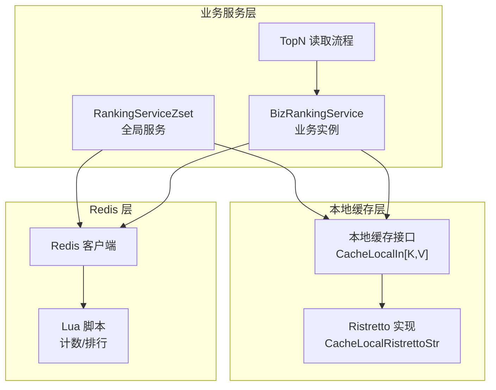
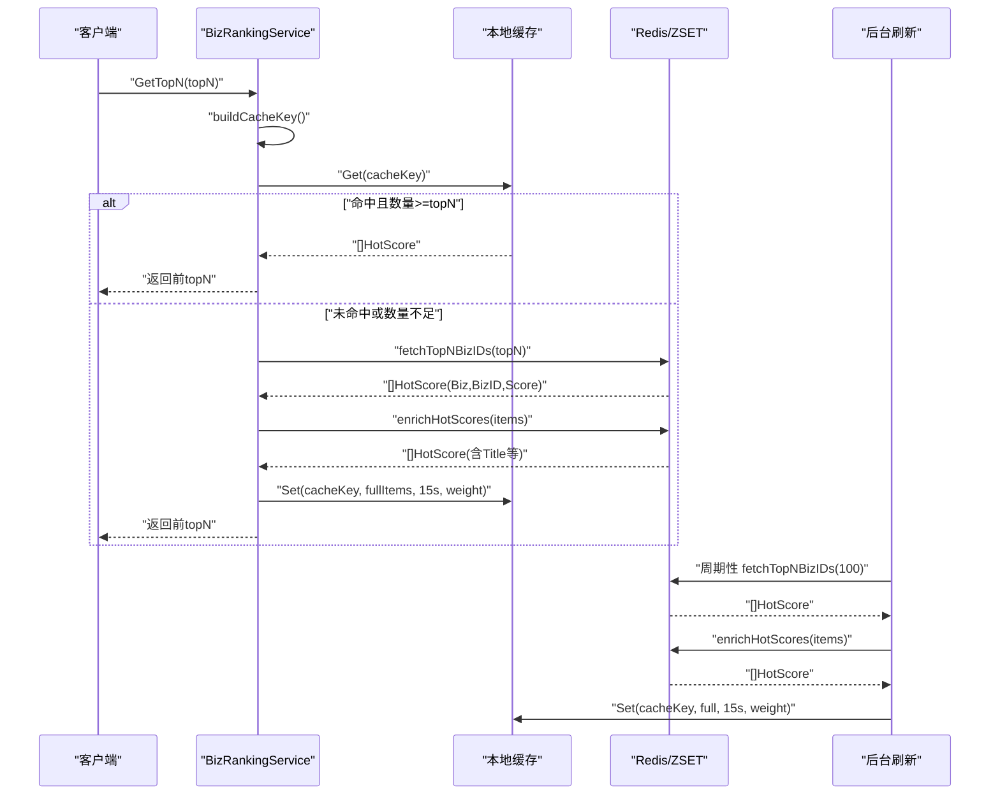
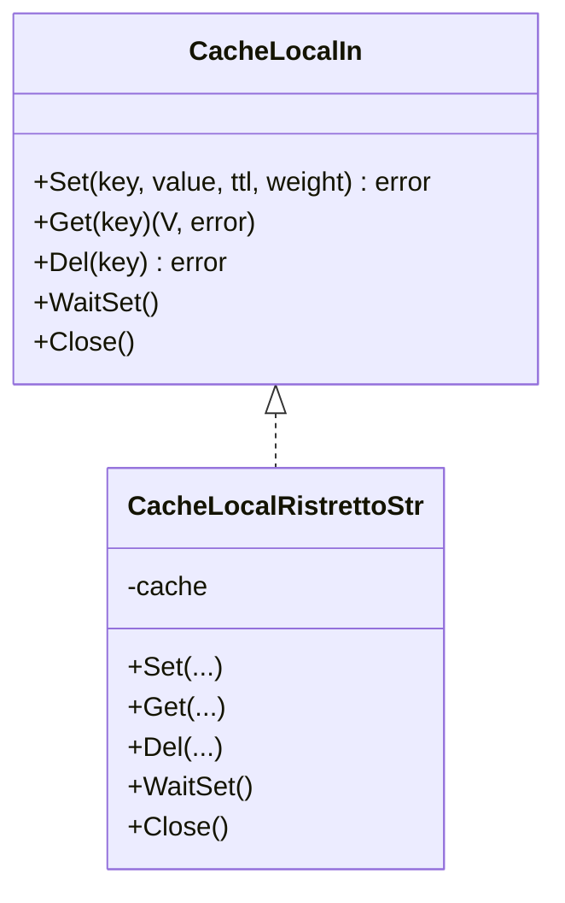
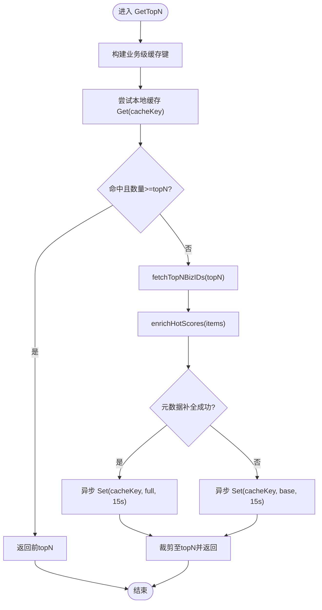
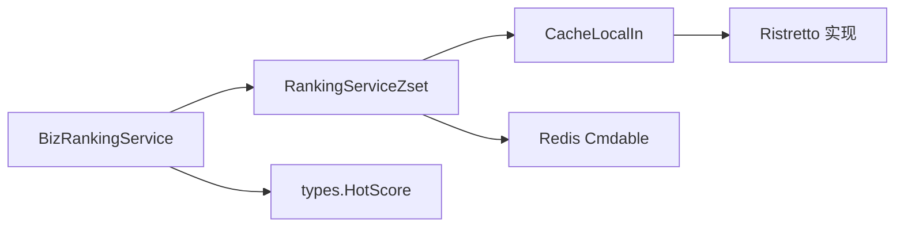

# 多级缓存机制

<cite>
**本文引用的文件列表**
- [rankingServiceRdbZset.go](file://serviceLogicX/rankingListX/rankingServiceRdbZsetX/rankingServiceRdbZset.go)
- [types.go](file://serviceLogicX/rankingListX/rankingServiceRdbZsetX/types/types.go)
- [ristretto.go](file://DBx/localCahceX/cacheLocalRistrettox/ristretto.go)
- [types.go](file://DBx/localCahceX/types.go)
- [count.go](file://DBx/redisX/cacheCountServiceX/count.go)
- [getCoreService.go](file://DBx/redisX/cacheCountServiceX/getCoreService.go)
- [setCoreService.go](file://DBx/redisX/cacheCountServiceX/setCoreService.go)
- [setConfig.go](file://DBx/redisX/cacheCountServiceX/setConfig.go)
- [rankingService.go](file://serviceLogicX/rankingListX/rankingServiceX/rankingService.go)
</cite>

## 目录
1. [简介](#简介)
2. [项目结构](#项目结构)
3. [核心组件](#核心组件)
4. [架构总览](#架构总览)
5. [组件详解](#组件详解)
6. [依赖关系分析](#依赖关系分析)
7. [性能与容量规划](#性能与容量规划)
8. [故障排查指南](#故障排查指南)
9. [结论](#结论)

## 简介
本文件围绕“多级缓存（本地缓存 + Redis）”机制展开，重点阐述如下要点：
- 本地缓存采用高性能内存库实现，提供毫秒级响应能力，显著降低对后端 Redis 的查询压力。
- 通过 GetTopN 方法实现“优先本地缓存”的读路径：先以业务级缓存键命中本地缓存；若命中且数据量满足 topN，则直接返回；否则回源 Redis 拉取并异步回写本地缓存。
- 后台刷新机制 backgroundRefresh 通过定时器周期性拉取最新榜单数据，异步回写本地缓存，维持缓存的相对新鲜度。
- 设计考量：缓存过期时间（15 秒）、降级策略（Redis 查询失败时返回基础分数）。

## 项目结构
与多级缓存相关的核心目录与文件：
- 本地缓存抽象与实现：DBx/localCahceX/cacheLocalRistrettox、DBx/localCahceX/types.go
- Redis 计数与榜单服务：DBx/redisX/cacheCountServiceX
- 榜单服务（ZSET 分片）：serviceLogicX/rankingListX/rankingServiceRdbZsetX
- 泛型榜单服务（批处理）：serviceLogicX/rankingListX/rankingServiceX

图表来源
- [rankingServiceRdbZset.go](file://serviceLogicX/rankingListX/rankingServiceRdbZsetX/rankingServiceRdbZset.go#L1-L125)
- [ristretto.go](file://DBx/localCahceX/cacheLocalRistrettox/ristretto.go#L1-L60)
- [types.go](file://DBx/localCahceX/types.go#L1-L31)
- [count.go](file://DBx/redisX/cacheCountServiceX/count.go#L1-L156)

章节来源
- [rankingServiceRdbZset.go](file://serviceLogicX/rankingListX/rankingServiceRdbZsetX/rankingServiceRdbZset.go#L1-L125)
- [types.go](file://DBx/localCahceX/types.go#L1-L31)
- [ristretto.go](file://DBx/localCahceX/cacheLocalRistrettox/ristretto.go#L1-L60)

## 核心组件
- 本地缓存接口与实现
  - 接口定义：提供 Set/Get/Del/WaitSet/Close 等能力，支持 TTL 与权重。
  - 实现：基于 Ristretto 的高性能内存缓存，具备并发安全与准入策略。
- Redis 计数与榜单服务
  - 提供计数、排行榜、Lua 脚本加载与执行、范围查询等能力，支持本地缓存与 Redis 的协同。
- ZSET 分片榜单服务
  - 基于 Redis ZSET 分片，聚合各分片 TopN，异步回写本地缓存，提供 GetTopN 读路径与后台刷新。

章节来源
- [types.go](file://DBx/localCahceX/types.go#L1-L31)
- [ristretto.go](file://DBx/localCahceX/cacheLocalRistrettox/ristretto.go#L1-L60)
- [count.go](file://DBx/redisX/cacheCountServiceX/count.go#L1-L156)
- [rankingServiceRdbZset.go](file://serviceLogicX/rankingListX/rankingServiceRdbZsetX/rankingServiceRdbZset.go#L1-L125)

## 架构总览
多级缓存的整体交互流程如下：
- 读路径：客户端请求 GetTopN → 业务实例构建业务级缓存键 → 优先命中本地缓存 → 若满足 topN 直接返回；否则回源 Redis 拉取 → 异步回写本地缓存 → 返回结果。
- 写路径：IncrScore 更新 Redis ZSET 分数 → 可选更新元数据 → 后台刷新周期性拉取最新榜单 → 异步回写本地缓存。
- 降级策略：元数据补全失败时返回基础分数，保证可用性。

图表来源
- [rankingServiceRdbZset.go](file://serviceLogicX/rankingListX/rankingServiceRdbZsetX/rankingServiceRdbZset.go#L95-L125)
- [rankingServiceRdbZset.go](file://serviceLogicX/rankingListX/rankingServiceRdbZsetX/rankingServiceRdbZset.go#L127-L210)
- [rankingServiceRdbZset.go](file://serviceLogicX/rankingListX/rankingServiceRdbZsetX/rankingServiceRdbZset.go#L229-L249)

## 组件详解

### 本地缓存抽象与实现
- 接口职责
  - Set(key, value, ttl, weight)：设置带 TTL 与权重的缓存项。
  - Get(key)：获取缓存项，内部检查 TTL 是否有效。
  - Del(key)/WaitSet()/Close()：删除、等待写入完成、关闭资源。
- Ristretto 实现要点
  - 使用 SetWithTTL 设置带 TTL 的键值。
  - GetTTL 与 Get 结合，确保 TTL 有效后再返回值。
  - Wait() 用于同步等待写入缓冲区生效（可选）。

图表来源
- [types.go](file://DBx/localCahceX/types.go#L1-L31)
- [ristretto.go](file://DBx/localCahceX/cacheLocalRistrettox/ristretto.go#L1-L60)

章节来源
- [types.go](file://DBx/localCahceX/types.go#L1-L31)
- [ristretto.go](file://DBx/localCahceX/cacheLocalRistrettox/ristretto.go#L1-L60)

### Redis 计数与榜单服务（计数/排行）
- 关键点
  - Key/RankKey 生成规则，支持服务名与业务维度。
  - Lua 脚本加载与 EvalSha 执行，保证计数与排行原子性。
  - 本地缓存与 Redis 的协同：优先本地缓存，失败再回源 Redis。
  - 过期时间与权重配置，支持排行榜与计数键分别设置。
- 读路径
  - 单个计数：先查本地缓存，失败再查 Redis，成功后回写本地缓存。
  - 排行榜：先查本地缓存，失败再通过 Lua 脚本从 Redis 获取并回写本地缓存。
- 写路径
  - SetCnt：根据 CntOpt 决定增减，执行 Lua 脚本更新 Redis，同时清理本地排行榜缓存并同步计数到本地缓存。

章节来源
- [count.go](file://DBx/redisX/cacheCountServiceX/count.go#L1-L156)
- [setConfig.go](file://DBx/redisX/cacheCountServiceX/setConfig.go#L1-L48)
- [getCoreService.go](file://DBx/redisX/cacheCountServiceX/getCoreService.go#L1-L276)
- [setCoreService.go](file://DBx/redisX/cacheCountServiceX/setCoreService.go#L1-L147)

### ZSET 分片榜单服务（GetTopN 与后台刷新）
- GetTopN 读路径
  - 构建业务级缓存键：buildCacheKey()。
  - 本地缓存优先：若命中且数量满足 topN，直接返回。
  - 回源 Redis：fetchTopNBizIDs() 并发拉取各分片 TopN，合并全局排序。
  - 元数据补全：enrichHotScores() 通过 Pipeline 批量 HGETALL 填充标题等字段。
  - 异步回写：go Set(cacheKey, fullItems, 15s, weight)。
  - 降级策略：元数据补全失败时返回基础分数（Biz/Title 可能为空）。
- 后台刷新机制
  - backgroundRefresh：基于 ticker 周期触发，拉取最新榜单，异步回写本地缓存。
  - StartRefresh：业务实例级别的后台刷新入口。
  - 过期时间：本地缓存键 TTL 为 15 秒，兼顾新鲜度与内存占用。
- 数据模型
  - HotScore：包含 Biz/BizID/Score/Title 等字段，排序由 ScoreProvider 决定。

图表来源
- [rankingServiceRdbZset.go](file://serviceLogicX/rankingListX/rankingServiceRdbZsetX/rankingServiceRdbZset.go#L95-L125)
- [rankingServiceRdbZset.go](file://serviceLogicX/rankingListX/rankingServiceRdbZsetX/rankingServiceRdbZset.go#L127-L210)
- [rankingServiceRdbZset.go](file://serviceLogicX/rankingListX/rankingServiceRdbZsetX/rankingServiceRdbZset.go#L229-L249)

章节来源
- [rankingServiceRdbZset.go](file://serviceLogicX/rankingListX/rankingServiceRdbZsetX/rankingServiceRdbZset.go#L95-L125)
- [rankingServiceRdbZset.go](file://serviceLogicX/rankingListX/rankingServiceRdbZsetX/rankingServiceRdbZset.go#L127-L210)
- [rankingServiceRdbZset.go](file://serviceLogicX/rankingListX/rankingServiceRdbZsetX/rankingServiceRdbZset.go#L229-L249)
- [types.go](file://serviceLogicX/rankingListX/rankingServiceRdbZsetX/types/types.go#L1-L20)

### 启动后台刷新（Start 方法）
- 全局服务 Start：仅启动一次后台刷新 goroutine，周期由 refreshInterval 控制。
- 业务实例 StartRefresh：独立启动业务级后台刷新，便于按业务粒度控制。
- 建议：在应用启动阶段显式调用 Start 或 StartRefresh，确保后台预热与持续刷新。

章节来源
- [rankingServiceRdbZset.go](file://serviceLogicX/rankingListX/rankingServiceRdbZsetX/rankingServiceRdbZset.go#L65-L75)
- [rankingServiceRdbZset.go](file://serviceLogicX/rankingListX/rankingServiceRdbZsetX/rankingServiceRdbZset.go#L229-L231)

## 依赖关系分析
- 组件耦合
  - BizRankingService 依赖 RankingServiceZset（组合关系），并通过 Redis Cmdable 与本地缓存接口交互。
  - 本地缓存接口与 Ristretto 实现解耦，便于替换其他本地缓存实现。
  - Redis 计数服务与榜单服务相互独立，均通过本地缓存接口与 Redis 协作。
- 外部依赖
  - Redis 客户端与 Lua 脚本。
  - Ristretto 内存缓存库。
- 潜在风险
  - 后台刷新逻辑在全局服务中被注释为“TODO”，业务实例 StartRefresh 提供替代方案。
  - 元数据补全失败时的降级策略需结合业务容忍度评估。

图表来源
- [rankingServiceRdbZset.go](file://serviceLogicX/rankingListX/rankingServiceRdbZsetX/rankingServiceRdbZset.go#L1-L125)
- [types.go](file://serviceLogicX/rankingListX/rankingServiceRdbZsetX/types/types.go#L1-L20)
- [ristretto.go](file://DBx/localCahceX/cacheLocalRistrettox/ristretto.go#L1-L60)

章节来源
- [rankingServiceRdbZset.go](file://serviceLogicX/rankingListX/rankingServiceRdbZsetX/rankingServiceRdbZset.go#L1-L125)
- [types.go](file://serviceLogicX/rankingListX/rankingServiceRdbZsetX/types/types.go#L1-L20)
- [ristretto.go](file://DBx/localCahceX/cacheLocalRistrettox/ristretto.go#L1-L60)

## 性能与容量规划
- 本地缓存命中率提升
  - 通过优先本地缓存与 15 秒 TTL，显著降低 Redis 查询压力，响应延迟接近内存级别。
- 并发与吞吐
  - fetchTopNBizIDs 对各分片并发拉取，随后全局排序，适合高并发场景。
  - enrichHotScores 使用 Pipeline 批量 HGETALL，减少 RTT。
- 成本与权重
  - Ristretto 支持按条目权重与最大成本控制内存占用，建议根据业务热点设置权重。
- 刷新频率
  - 后台刷新周期应结合业务峰值与数据变化速率权衡，避免过于频繁导致 Redis 压力反弹。

[本节为通用性能建议，不直接分析具体文件]

## 故障排查指南
- 本地缓存未命中
  - 检查 buildCacheKey 生成的键是否一致，确认 TTL 是否已过期。
  - 确认本地缓存 Set 是否成功（返回错误）。
- Redis 查询失败
  - 检查 Redis 连接与权限，确认 Lua 脚本加载是否成功。
  - 若元数据补全失败，系统会降级返回基础分数，需关注业务容忍度。
- 后台刷新未生效
  - 确认是否调用了 Start 或 StartRefresh。
  - 检查 ticker 是否被取消或 ctx 是否提前 Done。

章节来源
- [rankingServiceRdbZset.go](file://serviceLogicX/rankingListX/rankingServiceRdbZsetX/rankingServiceRdbZset.go#L95-L125)
- [rankingServiceRdbZset.go](file://serviceLogicX/rankingListX/rankingServiceRdbZsetX/rankingServiceRdbZset.go#L229-L249)
- [getCoreService.go](file://DBx/redisX/cacheCountServiceX/getCoreService.go#L1-L276)

## 结论
- 多级缓存通过本地缓存与 Redis 的协同，实现了毫秒级响应与较低的后端压力。
- GetTopN 的读路径明确：优先本地缓存、回源 Redis、异步回写，配合 15 秒 TTL 与降级策略，兼顾性能与稳定性。
- 后台刷新机制提供持续的新鲜度保障，建议结合业务场景选择全局或业务实例级刷新。
- 本地缓存接口与实现解耦良好，便于后续扩展与替换。