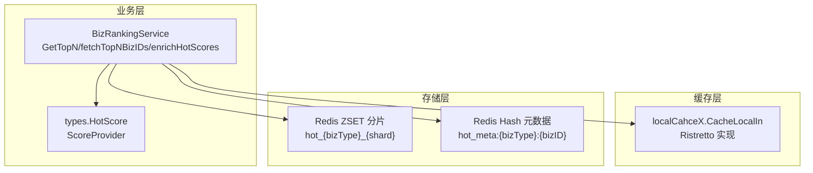
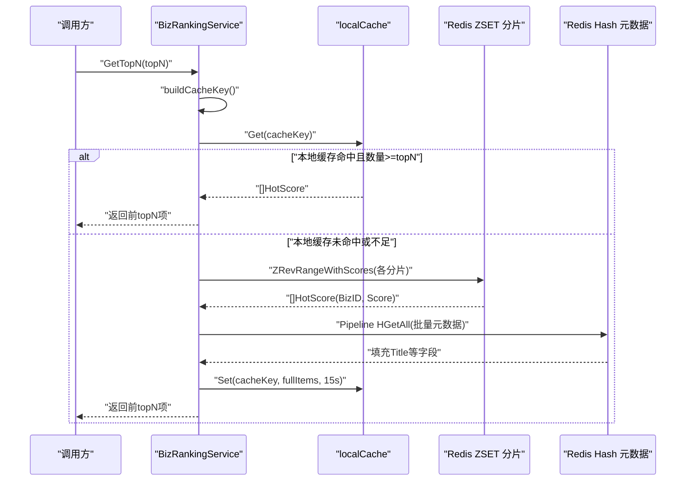
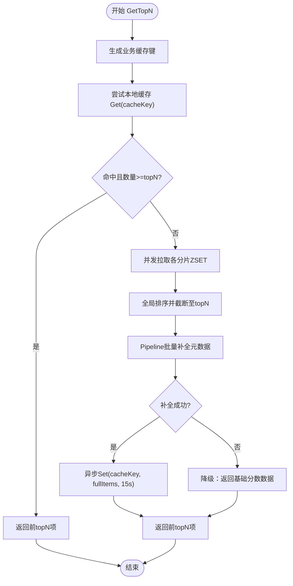
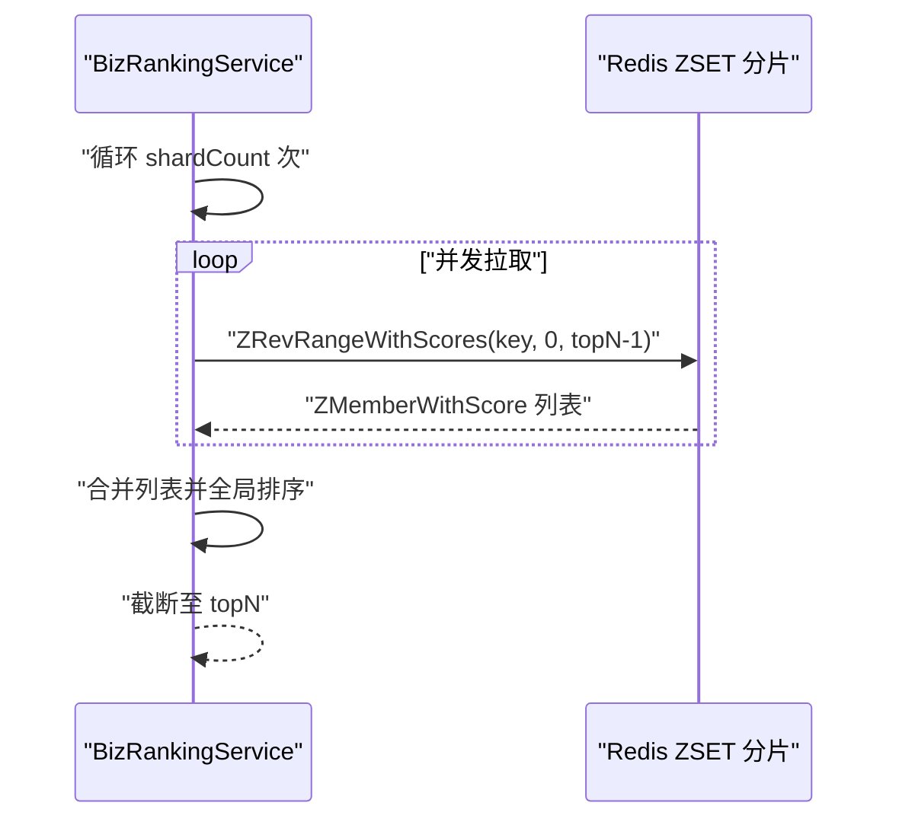
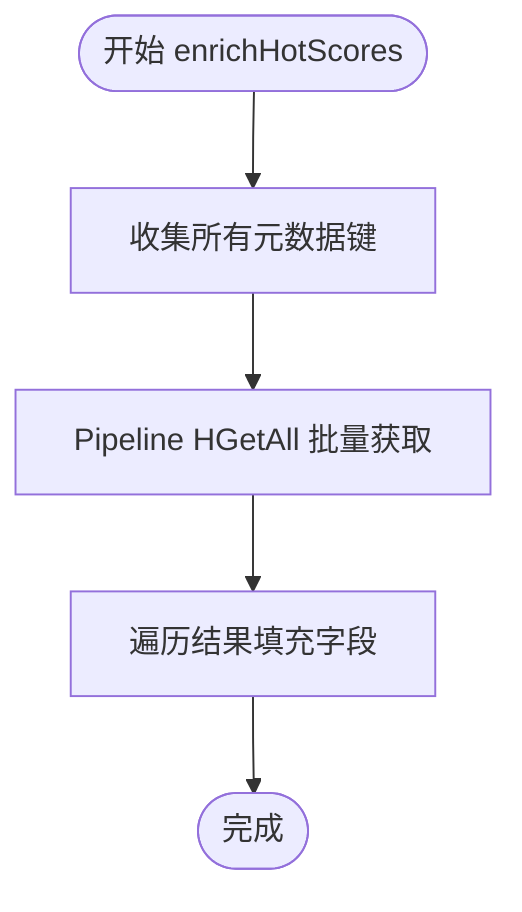
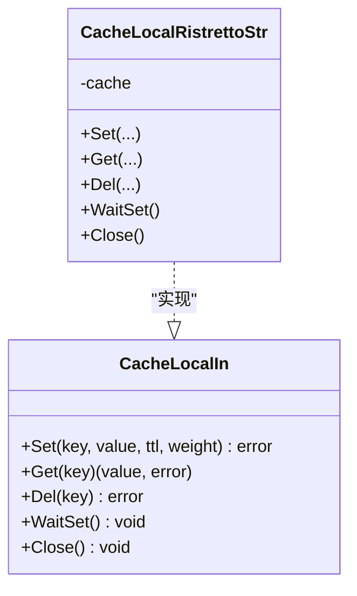
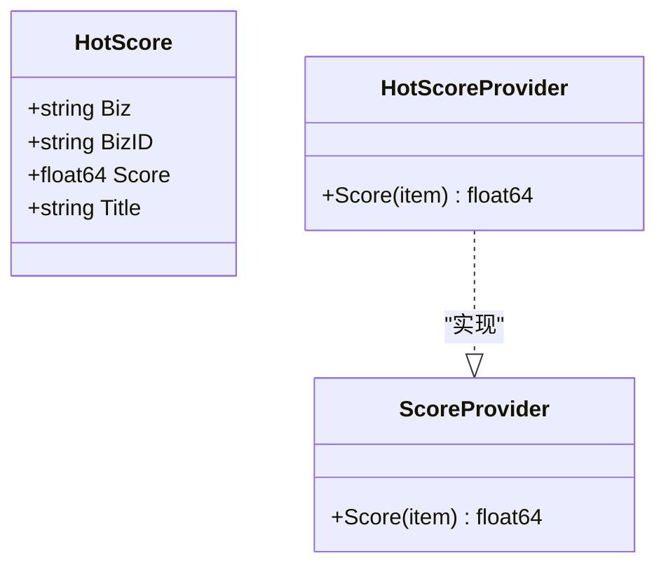
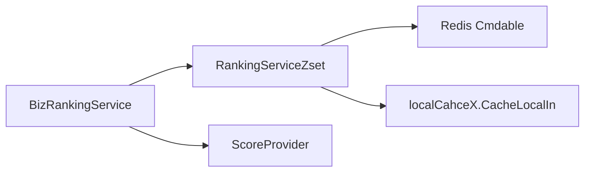

# 缓存读取机制

<cite>
**本文引用的文件**
- [rankingServiceRdbZset.go](file://serviceLogicX/rankingListX/rankingServiceRdbZsetX/rankingServiceRdbZset.go)
- [types.go](file://serviceLogicX/rankingListX/rankingServiceRdbZsetX/types/types.go)
- [types.go](file://DBx/localCahceX/types.go)
- [ristretto.go](file://DBx/localCahceX/cacheLocalRistrettox/ristretto.go)
- [rankingServiceRdbZset_test.go](file://serviceLogicX/rankingListX/rankingServiceRdbZsetX/rankingServiceRdbZset_test.go)
</cite>

## 目录
1. [简介](#简介)
2. [项目结构](#项目结构)
3. [核心组件](#核心组件)
4. [架构总览](#架构总览)
5. [详细组件分析](#详细组件分析)
6. [依赖关系分析](#依赖关系分析)
7. [性能考量](#性能考量)
8. [故障排查指南](#故障排查指南)
9. [结论](#结论)

## 简介
本文围绕多级缓存中的缓存读取机制展开，重点解释 GetTopN 方法如何通过 buildCacheKey 生成业务级缓存键，并优先从本地缓存（localCache）中获取数据；当本地缓存命中且数据量满足 topN 要求时直接返回，避免对 Redis 的频繁访问；若未命中或数据不足，则从 Redis 的 ZSet 分片中拉取 TopN 的业务 ID 和分数，并通过 enrichHotScores 批量补全元数据（如标题等）；最后在获取完整数据后，使用 localCache.Set 以 15 秒过期时间异步回写本地缓存，提升后续请求的响应速度；同时给出降级策略：当元数据补全失败时，仍返回基础分数数据以保证服务可用性。

## 项目结构
与缓存读取机制相关的核心文件位于以下路径：
- 业务排行榜服务与读取流程：serviceLogicX/rankingListX/rankingServiceRdbZsetX/rankingServiceRdbZset.go
- 数据模型与排序提供器：serviceLogicX/rankingListX/rankingServiceRdbZsetX/types/types.go
- 本地缓存抽象与 Ristretto 实现：DBx/localCahceX/types.go、DBx/localCahceX/cacheLocalRistrettox/ristretto.go
- 使用示例与启动流程：serviceLogicX/rankingListX/rankingServiceRdbZsetX/rankingServiceRdbZset_test.go

图表来源
- [rankingServiceRdbZset.go](file://serviceLogicX/rankingListX/rankingServiceRdbZsetX/rankingServiceRdbZset.go#L95-L210)
- [types.go](file://serviceLogicX/rankingListX/rankingServiceRdbZsetX/types/types.go#L1-L20)
- [types.go](file://DBx/localCahceX/types.go#L1-L32)
- [ristretto.go](file://DBx/localCahceX/cacheLocalRistrettox/ristretto.go#L1-L61)

章节来源
- [rankingServiceRdbZset.go](file://serviceLogicX/rankingListX/rankingServiceRdbZsetX/rankingServiceRdbZset.go#L95-L210)
- [types.go](file://serviceLogicX/rankingListX/rankingServiceRdbZsetX/types/types.go#L1-L20)
- [types.go](file://DBx/localCahceX/types.go#L1-L32)
- [ristretto.go](file://DBx/localCahceX/cacheLocalRistrettox/ristretto.go#L1-L61)

## 核心组件
- BizRankingService：封装具体业务的榜单服务，负责构建缓存键、读取本地缓存、从 Redis 拉取数据、批量补全元数据、异步回写本地缓存以及降级策略。
- RankingServiceZset：全局排行榜服务，聚合 BizRankingService 并管理 Redis 客户端、本地缓存实例、日志与后台刷新任务。
- localCahceX.CacheLocalIn：本地缓存抽象接口，定义 Set/Get/Del/WaitSet/Close 等能力。
- CacheLocalRistrettoStr：基于 Ristretto 的本地缓存实现，提供 TTL 与权重支持。
- types.HotScore：榜单项数据结构，包含业务类型、业务 ID、分数与标题等字段。
- ScoreProvider：分数提供器接口，用于全局排序。

章节来源
- [rankingServiceRdbZset.go](file://serviceLogicX/rankingListX/rankingServiceRdbZsetX/rankingServiceRdbZset.go#L16-L63)
- [types.go](file://DBx/localCahceX/types.go#L21-L31)
- [ristretto.go](file://DBx/localCahceX/cacheLocalRistrettox/ristretto.go#L10-L30)
- [types.go](file://serviceLogicX/rankingListX/rankingServiceRdbZsetX/types/types.go#L1-L20)

## 架构总览
下图展示了 GetTopN 的整体调用链路与多级缓存交互：

图表来源
- [rankingServiceRdbZset.go](file://serviceLogicX/rankingListX/rankingServiceRdbZsetX/rankingServiceRdbZset.go#L95-L125)
- [rankingServiceRdbZset.go](file://serviceLogicX/rankingListX/rankingServiceRdbZsetX/rankingServiceRdbZset.go#L127-L176)
- [rankingServiceRdbZset.go](file://serviceLogicX/rankingListX/rankingServiceRdbZsetX/rankingServiceRdbZset.go#L178-L210)

## 详细组件分析

### GetTopN 读取流程与降级策略
- 生成业务级缓存键：使用 buildCacheKey 生成固定业务键，便于跨请求复用。
- 本地缓存优先：若本地缓存命中且长度满足 topN，则直接返回前 topN 项，避免访问 Redis。
- 未命中或不足：从 Redis 的多个 ZSet 分片并发拉取 TopN 的 BizID 与分数，随后进行全局排序并截断至 topN。
- 元数据补全：通过 Pipeline 对应的元数据键批量 HGetAll，填充标题等字段；若补全失败，记录告警并进入降级：返回仅含分数的基础数据。
- 异步回写：在返回前异步触发 localCache.Set，以 15 秒 TTL 写回完整数据，提升后续请求命中率。

图表来源
- [rankingServiceRdbZset.go](file://serviceLogicX/rankingListX/rankingServiceRdbZsetX/rankingServiceRdbZset.go#L95-L125)
- [rankingServiceRdbZset.go](file://serviceLogicX/rankingListX/rankingServiceRdbZsetX/rankingServiceRdbZset.go#L127-L176)
- [rankingServiceRdbZset.go](file://serviceLogicX/rankingListX/rankingServiceRdbZsetX/rankingServiceRdbZset.go#L178-L210)

章节来源
- [rankingServiceRdbZset.go](file://serviceLogicX/rankingListX/rankingServiceRdbZsetX/rankingServiceRdbZset.go#L95-L125)
- [rankingServiceRdbZset.go](file://serviceLogicX/rankingListX/rankingServiceRdbZsetX/rankingServiceRdbZset.go#L127-L176)
- [rankingServiceRdbZset.go](file://serviceLogicX/rankingListX/rankingServiceRdbZsetX/rankingServiceRdbZset.go#L178-L210)

### fetchTopNBizIDs 并发拉取与全局排序
- 分片并发：按分片数创建 goroutine，分别从 hot_{bizType}_{shard} 拉取前 N 个成员与分数。
- 结果合并：收集各分片结果，进行全局排序（由 ScoreProvider 决定比较规则）。
- 截断：若合并后超过 topN，截断至前 topN 返回。

图表来源
- [rankingServiceRdbZset.go](file://serviceLogicX/rankingListX/rankingServiceRdbZsetX/rankingServiceRdbZset.go#L127-L176)

章节来源
- [rankingServiceRdbZset.go](file://serviceLogicX/rankingListX/rankingServiceRdbZsetX/rankingServiceRdbZset.go#L127-L176)

### enrichHotScores 批量元数据补全
- 构造元数据键：依据 BizID 生成 hot_meta:{bizType}:{bizID}。
- Pipeline 批量 HGetAll：对所有元数据键执行管道命令，降低网络往返。
- 填充字段：遍历结果，填充标题等字段；即使某键不存在，也不会影响整体流程。

图表来源
- [rankingServiceRdbZset.go](file://serviceLogicX/rankingListX/rankingServiceRdbZsetX/rankingServiceRdbZset.go#L178-L210)

章节来源
- [rankingServiceRdbZset.go](file://serviceLogicX/rankingListX/rankingServiceRdbZsetX/rankingServiceRdbZset.go#L178-L210)

### 本地缓存接口与实现
- 接口定义：CacheLocalIn 提供 Set/Get/Del/WaitSet/Close 等方法，支持泛型键与值。
- Ristretto 实现：CacheLocalRistrettoStr 基于 Ristretto，提供 TTL 与权重设置，Get 时检查 TTL 有效性。

图表来源
- [types.go](file://DBx/localCahceX/types.go#L21-L31)
- [ristretto.go](file://DBx/localCahceX/cacheLocalRistrettox/ristretto.go#L10-L30)
- [ristretto.go](file://DBx/localCahceX/cacheLocalRistrettox/ristretto.go#L31-L61)

章节来源
- [types.go](file://DBx/localCahceX/types.go#L21-L31)
- [ristretto.go](file://DBx/localCahceX/cacheLocalRistrettox/ristretto.go#L10-L61)

### 数据模型与排序提供器
- HotScore：包含业务类型、业务 ID、分数与标题等字段。
- ScoreProvider：定义 Score(item) float64，用于全局排序比较。

图表来源
- [types.go](file://serviceLogicX/rankingListX/rankingServiceRdbZsetX/types/types.go#L1-L20)

章节来源
- [types.go](file://serviceLogicX/rankingListX/rankingServiceRdbZsetX/types/types.go#L1-L20)

### 启动与后台刷新（预热）
- 通过 WithBizType 获取具体业务服务实例。
- StartRefresh 启动后台定时任务，周期性拉取 TopN 并回写本地缓存，提升冷启动命中率。

章节来源
- [rankingServiceRdbZset.go](file://serviceLogicX/rankingListX/rankingServiceRdbZsetX/rankingServiceRdbZset.go#L56-L63)
- [rankingServiceRdbZset.go](file://serviceLogicX/rankingListX/rankingServiceRdbZsetX/rankingServiceRdbZset.go#L229-L249)
- [rankingServiceRdbZset_test.go](file://serviceLogicX/rankingListX/rankingServiceRdbZsetX/rankingServiceRdbZset_test.go#L20-L38)

## 依赖关系分析
- BizRankingService 依赖 RankingServiceZset（持有 Redis 客户端、本地缓存、日志与分片数）。
- 本地缓存通过 CacheLocalIn 抽象解耦，可替换为 Ristretto 实现。
- Redis 侧依赖 ZSET 分片与 Hash 元数据键空间。
- 排序依赖 ScoreProvider，支持自定义排序策略。

图表来源
- [rankingServiceRdbZset.go](file://serviceLogicX/rankingListX/rankingServiceRdbZsetX/rankingServiceRdbZset.go#L16-L63)
- [rankingServiceRdbZset.go](file://serviceLogicX/rankingListX/rankingServiceRdbZsetX/rankingServiceRdbZset.go#L95-L125)

章节来源
- [rankingServiceRdbZset.go](file://serviceLogicX/rankingListX/rankingServiceRdbZsetX/rankingServiceRdbZset.go#L16-L63)
- [rankingServiceRdbZset.go](file://serviceLogicX/rankingListX/rankingServiceRdbZsetX/rankingServiceRdbZset.go#L95-L125)

## 性能考量
- 本地缓存命中优先：在高 QPS 场景下显著降低 Redis 压力，提升响应速度。
- 分片并发拉取：通过 goroutine 并发访问多个 ZSET 分片，缩短 RT。
- Pipeline 批量元数据：减少网络往返，提高元数据补全效率。
- 异步回写：Set 为异步操作，不影响主流程返回，但可能带来短暂的延迟。
- TTL 设计：15 秒的本地缓存 TTL 平衡了新鲜度与命中率，适合热点榜单场景。
- 成本权重：本地缓存 Set 支持 weight 参数，可用于内存阈值下的淘汰策略。

章节来源
- [rankingServiceRdbZset.go](file://serviceLogicX/rankingListX/rankingServiceRdbZsetX/rankingServiceRdbZset.go#L95-L125)
- [rankingServiceRdbZset.go](file://serviceLogicX/rankingListX/rankingServiceRdbZsetX/rankingServiceRdbZset.go#L127-L176)
- [rankingServiceRdbZset.go](file://serviceLogicX/rankingListX/rankingServiceRdbZsetX/rankingServiceRdbZset.go#L178-L210)
- [types.go](file://DBx/localCahceX/types.go#L21-L31)
- [ristretto.go](file://DBx/localCahceX/cacheLocalRistrettox/ristretto.go#L21-L30)

## 故障排查指南
- 本地缓存未命中：确认 buildCacheKey 是否一致，以及本地缓存是否正确初始化与注入。
- Redis 分片拉取失败：检查 ZSET 键命名与分片数配置，确认 Redis 可用性与权限。
- Pipeline 元数据补全异常：关注 Pipeline 执行错误与个别键缺失情况，必要时启用降级返回基础分数。
- 异步回写失败：Set 返回错误不影响主流程，但会导致后续命中率下降，需监控本地缓存 Set 的成功率。
- 后台刷新未生效：确认 StartRefresh 已调用且定时器正常运行。

章节来源
- [rankingServiceRdbZset.go](file://serviceLogicX/rankingListX/rankingServiceRdbZsetX/rankingServiceRdbZset.go#L95-L125)
- [rankingServiceRdbZset.go](file://serviceLogicX/rankingListX/rankingServiceRdbZsetX/rankingServiceRdbZset.go#L178-L210)
- [rankingServiceRdbZset.go](file://serviceLogicX/rankingListX/rankingServiceRdbZsetX/rankingServiceRdbZset.go#L229-L249)

## 结论
该多级缓存读取机制通过“本地缓存优先 + 分片并发 + Pipeline 批量补全 + 异步回写”的组合，在保证数据新鲜度的同时最大化命中率与吞吐量。GetTopN 的设计体现了典型的“读多写少”场景下的工程化取舍：在本地缓存命中且满足需求时直接返回，未命中时通过并发与批处理快速补齐元数据，并以 15 秒 TTL 回写本地缓存；当元数据补全失败时采用降级策略，确保服务可用性。配合后台定时刷新，进一步提升冷启动与热点命中表现。