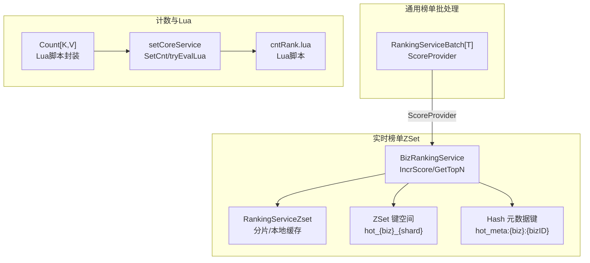
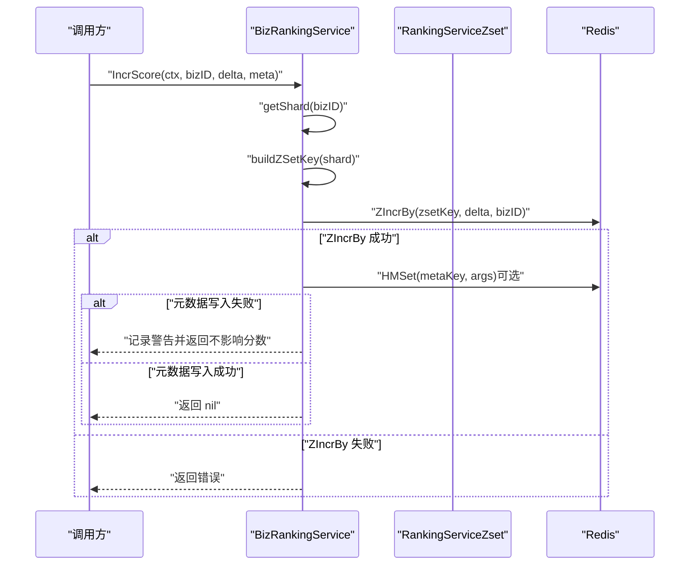
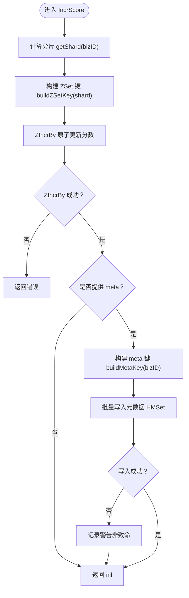
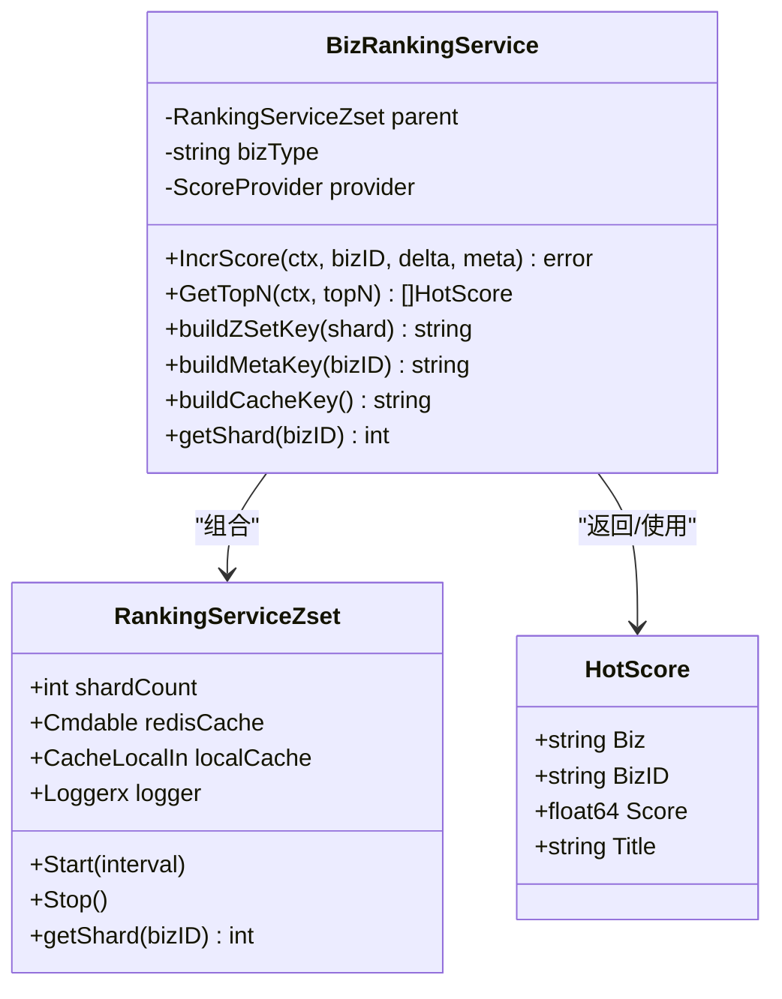

# 实时更新机制

<cite>
**本文引用的文件**
- [rankingServiceRdbZset.go](file://serviceLogicX/rankingListX/rankingServiceRdbZsetX/rankingServiceRdbZset.go)
- [types.go](file://serviceLogicX/rankingListX/rankingServiceRdbZsetX/types/types.go)
- [rankingService.go](file://serviceLogicX/rankingListX/rankingServiceX/rankingService.go)
- [types.go](file://serviceLogicX/rankingListX/rankingServiceX/types/types.go)
- [count.go](file://DBx/redisX/cacheCountServiceX/count.go)
- [setCoreService.go](file://DBx/redisX/cacheCountServiceX/setCoreService.go)
- [cntRank.lua](file://DBx/redisX/cacheCountServiceX/lua/cntRank.lua)
</cite>

## 目录
1. [引言](#引言)
2. [项目结构](#项目结构)
3. [核心组件](#核心组件)
4. [架构总览](#架构总览)
5. [详细组件分析](#详细组件分析)
6. [依赖关系分析](#依赖关系分析)
7. [性能考量](#性能考量)
8. [故障排查指南](#故障排查指南)
9. [结论](#结论)
10. [附录](#附录)

## 引言
本文围绕“实时更新榜单分数”的核心需求，系统梳理并深入解析 IncrScore 方法的执行流程与设计要点。IncrScore 作为高频分数更新入口，采用 Redis ZSet 存储分数并以原子性增量方式更新；同时将低频或不变的元数据（如标题、封面、作者等）拆分到独立 Hash 键中，通过批量写入实现非致命错误下的稳健性。本文将：
- 逐步拆解 IncrScore 的两阶段更新流程；
- 说明分片选择与键空间组织策略；
- 对比 ZSet 与 Hash 的存储优势；
- 提供调用 IncrScore 增加文章热度的完整示例路径。

## 项目结构
本仓库中与“实时更新榜单分数”直接相关的核心模块位于以下路径：
- 排行榜服务（基于 Redis ZSet）：serviceLogicX/rankingListX/rankingServiceRdbZsetX
- 通用榜单服务（批处理/优先队列）：serviceLogicX/rankingListX/rankingServiceX
- 基于 Lua 的计数与热榜服务：DBx/redisX/cacheCountServiceX

图表来源
- [rankingServiceRdbZset.go](file://serviceLogicX/rankingListX/rankingServiceRdbZsetX/rankingServiceRdbZset.go#L1-L120)
- [rankingService.go](file://serviceLogicX/rankingListX/rankingServiceX/rankingService.go#L1-L105)
- [count.go](file://DBx/redisX/cacheCountServiceX/count.go#L1-L156)
- [setCoreService.go](file://DBx/redisX/cacheCountServiceX/setCoreService.go#L1-L147)
- [cntRank.lua](file://DBx/redisX/cacheCountServiceX/lua/cntRank.lua#L1-L56)

章节来源
- [rankingServiceRdbZset.go](file://serviceLogicX/rankingListX/rankingServiceRdbZsetX/rankingServiceRdbZset.go#L1-L120)
- [rankingService.go](file://serviceLogicX/rankingListX/rankingServiceX/rankingService.go#L1-L105)
- [count.go](file://DBx/redisX/cacheCountServiceX/count.go#L1-L156)

## 核心组件
- BizRankingService：面向具体业务（如 article）的榜单服务实例，负责 IncrScore、GetTopN、元数据补全等。
- RankingServiceZset：全局实时榜单服务，管理分片数量、Redis 客户端、本地缓存与日志。
- ScoreProvider：用于对 HotScore 进行排序的分数提取器。
- Count[K,V] 与 setCoreService：提供基于 Lua 的计数与热榜能力，演示了“计数+ZSet”的原子更新模式，可作为 IncrScore 设计的参考。

章节来源
- [rankingServiceRdbZset.go](file://serviceLogicX/rankingListX/rankingServiceRdbZsetX/rankingServiceRdbZset.go#L1-L120)
- [types.go](file://serviceLogicX/rankingListX/rankingServiceRdbZsetX/types/types.go#L1-L20)
- [rankingService.go](file://serviceLogicX/rankingListX/rankingServiceX/rankingService.go#L1-L105)
- [types.go](file://serviceLogicX/rankingListX/rankingServiceX/types/types.go#L1-L19)
- [count.go](file://DBx/redisX/cacheCountServiceX/count.go#L1-L156)
- [setCoreService.go](file://DBx/redisX/cacheCountServiceX/setCoreService.go#L1-L147)

## 架构总览
IncrScore 的整体工作流如下：
- 第一步：根据 bizID 选择分片，构造 ZSet 键，使用 ZIncrBy 原子性地更新分数。
- 第二步：若提供元数据 meta，则构造独立 Hash 键，批量写入元数据；元数据写入失败为非致命错误，不影响分数更新。

图表来源
- [rankingServiceRdbZset.go](file://serviceLogicX/rankingListX/rankingServiceRdbZsetX/rankingServiceRdbZset.go#L251-L279)

## 详细组件分析

### IncrScore 方法详解
- 输入参数
  - ctx：请求上下文，便于超时与取消传播。
  - bizID：业务唯一标识，决定分片与 ZSet 键归属。
  - delta：分数增量（正数增加、负数减少、零值无变化）。
  - meta：可选元数据映射，如标题、封面、作者等。
- 执行步骤
  1) 分片与键生成
     - 使用 FNV-1a 哈希对 bizID 进行分片，得到 shard。
     - 构造 ZSet 键 hot_{biz}_{shard}。
  2) 分数更新（原子性）
     - 使用 ZIncrBy 在 Redis 中对成员 bizID 的分数进行原子性增减。
     - 若失败，记录错误并返回。
  3) 元数据更新（可选）
     - 构造 Hash 键 hot_meta:{biz}:{bizID}。
     - 将 meta 映射转换为键值对数组，使用 HMSet 批量写入。
     - 若失败，记录警告但不中断分数更新。
- 设计优势
  - 分数与元数据分离：ZSet 仅存放分数，避免元素体积膨胀与序列化开销；元数据独立存储，降低频繁写入对 ZSet 的影响。
  - 非致命错误：元数据写入失败不影响核心分数更新，提升可用性。
  - 原子性：ZIncrBy 保证分数更新的原子性，避免并发竞争导致的不一致。

图表来源
- [rankingServiceRdbZset.go](file://serviceLogicX/rankingListX/rankingServiceRdbZsetX/rankingServiceRdbZset.go#L251-L279)

章节来源
- [rankingServiceRdbZset.go](file://serviceLogicX/rankingListX/rankingServiceRdbZsetX/rankingServiceRdbZset.go#L251-L279)
- [rankingServiceRdbZset.go](file://serviceLogicX/rankingListX/rankingServiceRdbZsetX/rankingServiceRdbZset.go#L281-L304)

### 分片与键空间设计
- 分片策略
  - 使用 FNV-1a 32 位哈希，对 bizID 进行哈希后对 shardCount 取模，得到分片索引。
  - 通过分片将热点集中在不同 ZSet 上，降低单键压力。
- 键命名规范
  - ZSet 键：hot_{biz}_{shard}
  - 元数据键：hot_meta:{biz}:{bizID}

章节来源
- [rankingServiceRdbZset.go](file://serviceLogicX/rankingListX/rankingServiceRdbZsetX/rankingServiceRdbZset.go#L281-L304)

### 元数据与 ZSet 的分离存储
- 分离原因
  - ZSet 元素包含分数，频繁更新会导致序列化与网络传输成本上升。
  - 元数据通常更新频率较低或保持不变，更适合 Hash 结构。
- 写入策略
  - IncrScore 中使用 HMSet 批量写入，减少网络往返。
  - 元数据写入失败仅记录警告，不影响分数更新。

章节来源
- [rankingServiceRdbZset.go](file://serviceLogicX/rankingListX/rankingServiceRdbZsetX/rankingServiceRdbZset.go#L251-L279)

### 与通用榜单服务的对比
- 基于 ZSet 的实时榜单
  - IncrScore：高频分数更新，原子性保障，元数据分离。
  - GetTopN：聚合各分片 ZSet，全局排序，异步回写本地缓存。
- 基于批处理的榜单
  - RankingServiceBatch[T]：通过 ScoreProvider 从任意类型 T 中提取分数，使用优先队列维护 Top-N。
  - 适用于离线/周期性榜单生成，不涉及 Redis 原子更新。

章节来源
- [rankingService.go](file://serviceLogicX/rankingListX/rankingServiceX/rankingService.go#L1-L105)
- [types.go](file://serviceLogicX/rankingListX/rankingServiceX/types/types.go#L1-L19)

### 与计数+Lua方案的关联
- 计数与热榜服务展示了“计数键 + 排行榜键”的原子更新模式，与 IncrScore 的 ZSet + Hash 分离思路互补：
  - 计数键：计数器，Lua 原子 INCRBY 并在变化量非零时 ZADD 更新排行榜。
  - IncrScore：ZSet 原子增量，Hash 存放元数据，二者职责清晰。
- 参考路径
  - 计数服务初始化与 Lua 脚本加载：[count.go](file://DBx/redisX/cacheCountServiceX/count.go#L99-L124)
  - 计数写入与 Lua 执行：[setCoreService.go](file://DBx/redisX/cacheCountServiceX/setCoreService.go#L88-L126)
  - Lua 脚本内容：[cntRank.lua](file://DBx/redisX/cacheCountServiceX/lua/cntRank.lua#L1-L56)

章节来源
- [count.go](file://DBx/redisX/cacheCountServiceX/count.go#L99-L124)
- [setCoreService.go](file://DBx/redisX/cacheCountServiceX/setCoreService.go#L88-L126)
- [cntRank.lua](file://DBx/redisX/cacheCountServiceX/lua/cntRank.lua#L1-L56)

## 依赖关系分析
- 组件耦合
  - BizRankingService 依赖 RankingServiceZset 提供 Redis 客户端、本地缓存与日志。
  - IncrScore 依赖 getShard 与 buildZSetKey/ buildMetaKey 生成键空间。
  - GetTopN 依赖 fetchTopNBizIDs 并行拉取各分片 ZSet，再进行全局排序。
- 外部依赖
  - Redis go-redis 客户端：ZIncrBy、ZRevRangeWithScores、HMSet、Pipeline 等。
  - 本地缓存：用于热点榜单的短期缓存，降低 Redis 压力。

图表来源
- [rankingServiceRdbZset.go](file://serviceLogicX/rankingListX/rankingServiceRdbZsetX/rankingServiceRdbZset.go#L1-L120)
- [types.go](file://serviceLogicX/rankingListX/rankingServiceRdbZsetX/types/types.go#L1-L20)

章节来源
- [rankingServiceRdbZset.go](file://serviceLogicX/rankingListX/rankingServiceRdbZsetX/rankingServiceRdbZset.go#L1-L120)
- [types.go](file://serviceLogicX/rankingListX/rankingServiceRdbZsetX/types/types.go#L1-L20)

## 性能考量
- 分片与热点分散
  - 通过 FNV-1a 哈希与取模分片，将热点分散至多个 ZSet，降低单键竞争。
- 键空间设计
  - ZSet 仅保存分数，避免元素过大；元数据独立 Hash，减少序列化与网络开销。
- 并发与原子性
  - ZIncrBy 保证分数更新的原子性，避免竞态。
- 本地缓存
  - GetTopN 优先命中本地缓存，减少 Redis 查询压力；后台定时刷新预热 TopN。

章节来源
- [rankingServiceRdbZset.go](file://serviceLogicX/rankingListX/rankingServiceRdbZsetX/rankingServiceRdbZset.go#L95-L125)
- [rankingServiceRdbZset.go](file://serviceLogicX/rankingListX/rankingServiceRdbZsetX/rankingServiceRdbZset.go#L281-L304)

## 故障排查指南
- ZIncrBy 失败
  - 现象：IncrScore 返回错误。
  - 排查：检查 Redis 连接状态、键空间命名、bizID 是否有效。
  - 参考路径：[rankingServiceRdbZset.go](file://serviceLogicX/rankingListX/rankingServiceRdbZsetX/rankingServiceRdbZset.go#L251-L263)
- 元数据写入失败
  - 现象：日志出现“HMSet meta failed (non-fatal)”警告。
  - 影响：不影响分数更新，属于非致命错误。
  - 参考路径：[rankingServiceRdbZset.go](file://serviceLogicX/rankingListX/rankingServiceRdbZsetX/rankingServiceRdbZset.go#L265-L277)
- 获取 TopN 失败
  - 现象：GetTopN 返回错误或降级结果。
  - 排查：检查 Redis ZSet 数据、分片数量、本地缓存状态。
  - 参考路径：[rankingServiceRdbZset.go](file://serviceLogicX/rankingListX/rankingServiceRdbZsetX/rankingServiceRdbZset.go#L95-L125)

章节来源
- [rankingServiceRdbZset.go](file://serviceLogicX/rankingListX/rankingServiceRdbZsetX/rankingServiceRdbZset.go#L95-L125)
- [rankingServiceRdbZset.go](file://serviceLogicX/rankingListX/rankingServiceRdbZsetX/rankingServiceRdbZset.go#L251-L279)

## 结论
IncrScore 通过“分片 + ZSet 原子增量 + Hash 元数据分离”的设计，在保证分数更新原子性的同时，显著降低了 ZSet 元素膨胀与序列化成本，并以非致命错误策略提升了系统的鲁棒性。结合本地缓存与后台刷新，可在高并发场景下稳定支撑实时榜单服务。

## 附录

### 调用 IncrScore 增加文章热度的完整示例（路径指引）
- 步骤概览
  1) 准备 Redis 客户端与本地缓存实例。
  2) 创建全局 RankingServiceZset，并绑定业务 BizRankingService（bizType 为 "article"）。
  3) 调用 IncrScore(ctx, bizID, delta, meta) 完成分数更新与元数据写入。
- 关键路径
  - 创建全局服务与业务实例：[rankingServiceRdbZset.go](file://serviceLogicX/rankingListX/rankingServiceRdbZsetX/rankingServiceRdbZset.go#L37-L63)
  - IncrScore 核心流程：[rankingServiceRdbZset.go](file://serviceLogicX/rankingListX/rankingServiceRdbZsetX/rankingServiceRdbZset.go#L251-L279)
  - 分片与键生成：[rankingServiceRdbZset.go](file://serviceLogicX/rankingListX/rankingServiceRdbZsetX/rankingServiceRdbZset.go#L281-L304)
  - 元数据键命名：[rankingServiceRdbZset.go](file://serviceLogicX/rankingListX/rankingServiceRdbZsetX/rankingServiceRdbZset.go#L212-L218)