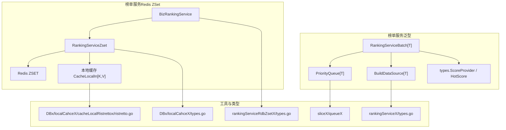
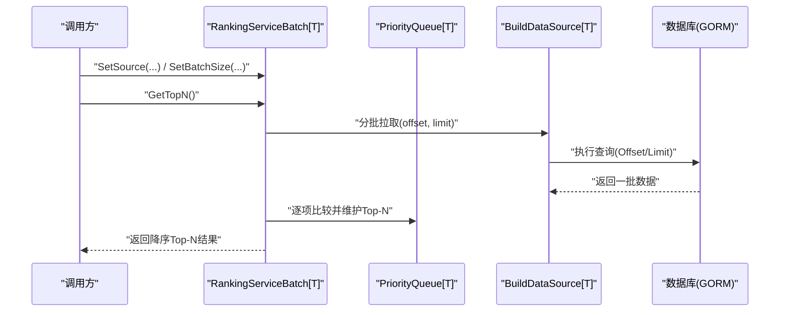
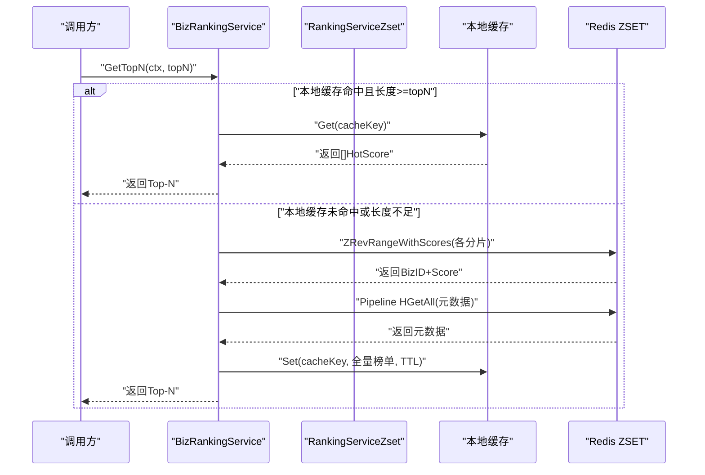
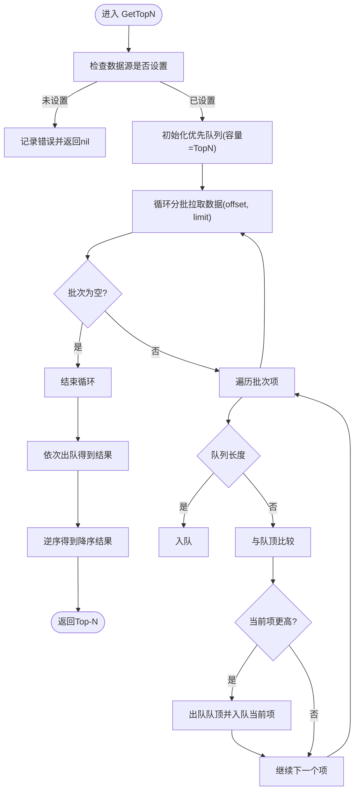
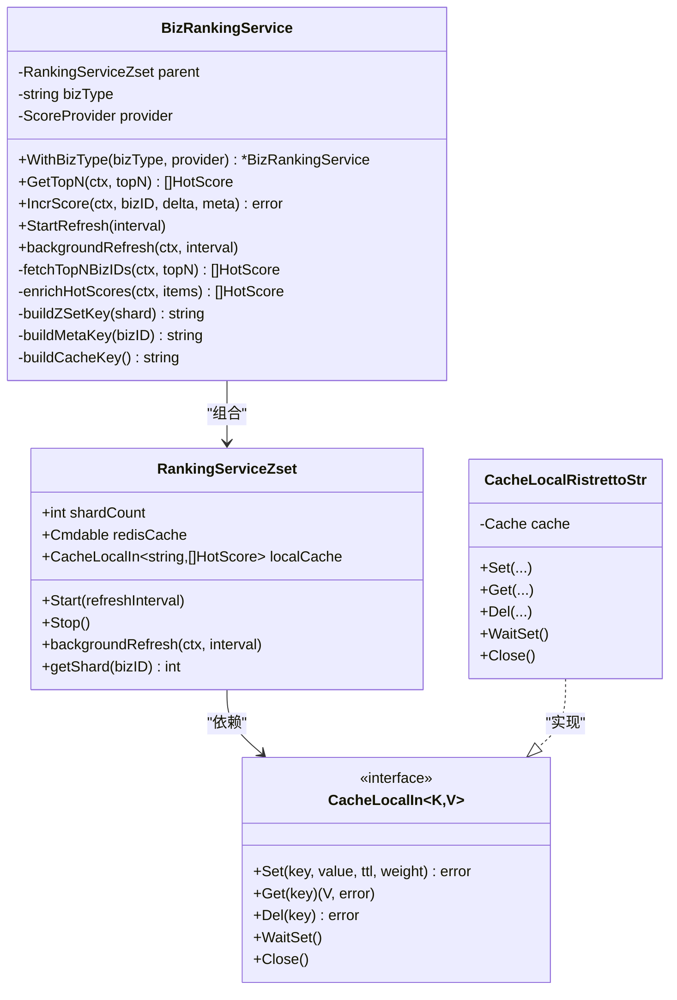
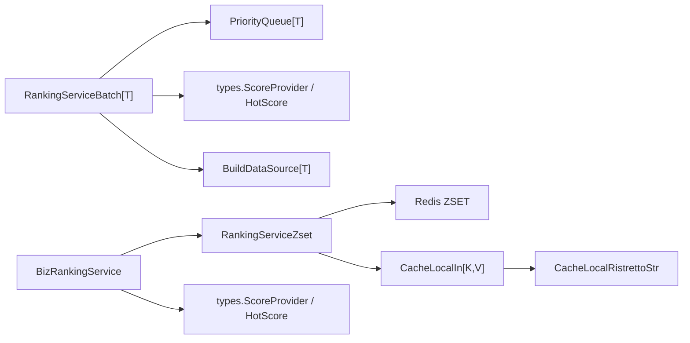

# 榜单服务

<cite>
**本文引用的文件**
- [rankingService.go](file://serviceLogicX/rankingListX/rankingServiceX/rankingService.go)
- [types.go](file://serviceLogicX/rankingListX/rankingServiceX/types/types.go)
- [queue.go](file://sliceX/queueX/queue.go)
- [BuildDataSource.go](file://serviceLogicX/rankingListX/rankingServiceX/buildGormX/BuildDataSource.go)
- [rankingServiceRdbZset.go](file://serviceLogicX/rankingListX/rankingServiceRdbZsetX/rankingServiceRdbZset.go)
- [zsetTypes.go](file://serviceLogicX/rankingListX/rankingServiceRdbZsetX/types/types.go)
- [ristretto.go](file://DBx/localCahceX/cacheLocalRistrettox/ristretto.go)
- [localCacheTypes.go](file://DBx/localCahceX/types.go)
- [rankingService_test.go](file://serviceLogicX/rankingListX/rankingServiceX/rankingService_test.go)
- [rankingServiceRdbZset_test.go](file://serviceLogicX/rankingListX/rankingServiceRdbZsetX/rankingServiceRdbZset_test.go)
</cite>

## 目录
1. [简介](#简介)
2. [项目结构](#项目结构)
3. [核心组件](#核心组件)
4. [架构总览](#架构总览)
5. [组件详解](#组件详解)
6. [依赖关系分析](#依赖关系分析)
7. [性能考量](#性能考量)
8. [故障排查指南](#故障排查指南)
9. [结论](#结论)
10. [附录](#附录)

## 简介
本文件围绕仓库中的两种榜单服务实现进行系统化说明，帮助读者快速理解并选择合适的方案：
- 基于 GORM 数据源的泛型榜单服务（RankingServiceBatch）：通过注入数据源逻辑与优先队列在内存中计算 Top-N 排名，适合中小规模数据或需要复杂计算的场景。
- 基于 Redis ZSet 的高性能实时榜单服务（RankingServiceZset + BizRankingService）：采用分片（shardCount）设计应对海量数据，结合本地缓存（localCache）与 Redis 的多级缓存架构，支持毫秒级响应。

## 项目结构
榜单服务相关代码主要位于以下路径：
- serviceLogicX/rankingListX/rankingServiceX：泛型榜单服务与 GORM 数据源构建器
- serviceLogicX/rankingListX/rankingServiceRdbZsetX：基于 Redis ZSet 的实时榜单服务
- sliceX/queueX：优先队列实现
- DBx/localCahceX：本地缓存抽象与 Ristretto 实现
- serviceLogicX/rankingListX：通用类型定义

图表来源
- [rankingService.go](file://serviceLogicX/rankingListX/rankingServiceX/rankingService.go#L1-L105)
- [queue.go](file://sliceX/queueX/queue.go#L1-L204)
- [BuildDataSource.go](file://serviceLogicX/rankingListX/rankingServiceX/buildGormX/BuildDataSource.go#L1-L47)
- [rankingServiceRdbZset.go](file://serviceLogicX/rankingListX/rankingServiceRdbZsetX/rankingServiceRdbZset.go#L1-L305)
- [ristretto.go](file://DBx/localCahceX/cacheLocalRistrettox/ristretto.go#L1-L61)
- [localCacheTypes.go](file://DBx/localCahceX/types.go#L1-L32)
- [zsetTypes.go](file://serviceLogicX/rankingListX/rankingServiceRdbZsetX/types/types.go#L1-L20)
- [types.go](file://serviceLogicX/rankingListX/rankingServiceX/types/types.go#L1-L20)

章节来源
- [rankingService.go](file://serviceLogicX/rankingListX/rankingServiceX/rankingService.go#L1-L105)
- [rankingServiceRdbZset.go](file://serviceLogicX/rankingListX/rankingServiceRdbZsetX/rankingServiceRdbZset.go#L1-L305)

## 核心组件
- 泛型榜单服务（RankingServiceBatch[T]）
  - 通过 SetSource 注入数据源逻辑，SetBatchSize 设置批量大小，GetTopN 使用优先队列在内存中计算 Top-N。
- 基于 Redis ZSet 的实时榜单服务（RankingServiceZset + BizRankingService）
  - RankingServiceZset 维护分片数、Redis 客户端与本地缓存；BizRankingService 提供 IncrScore 实时更新分数、GetTopN 优先从本地缓存获取榜单。
- 优先队列（sliceX/queueX/PriorityQueue[T]）
  - 提供线程安全的入队、出队、Peek、批量入队等能力，支持有界/无界队列。
- 本地缓存（DBx/localCahceX）
  - 抽象接口 CacheLocalIn[K,V]，Ristretto 实现提供高性能内存缓存。

章节来源
- [rankingService.go](file://serviceLogicX/rankingListX/rankingServiceX/rankingService.go#L1-L105)
- [rankingServiceRdbZset.go](file://serviceLogicX/rankingListX/rankingServiceRdbZsetX/rankingServiceRdbZset.go#L1-L305)
- [queue.go](file://sliceX/queueX/queue.go#L1-L204)
- [localCacheTypes.go](file://DBx/localCahceX/types.go#L1-L32)
- [ristretto.go](file://DBx/localCahceX/cacheLocalRistrettox/ristretto.go#L1-L61)

## 架构总览
下图展示了两种榜单服务的整体交互流程与数据流向。

图表来源
- [rankingService.go](file://serviceLogicX/rankingListX/rankingServiceX/rankingService.go#L1-L105)
- [queue.go](file://sliceX/queueX/queue.go#L1-L204)
- [BuildDataSource.go](file://serviceLogicX/rankingListX/rankingServiceX/buildGormX/BuildDataSource.go#L1-L47)

图表来源
- [rankingServiceRdbZset.go](file://serviceLogicX/rankingListX/rankingServiceRdbZsetX/rankingServiceRdbZset.go#L95-L176)
- [rankingServiceRdbZset.go](file://serviceLogicX/rankingListX/rankingServiceRdbZsetX/rankingServiceRdbZset.go#L178-L210)
- [rankingServiceRdbZset.go](file://serviceLogicX/rankingListX/rankingServiceRdbZsetX/rankingServiceRdbZset.go#L251-L279)
- [ristretto.go](file://DBx/localCahceX/cacheLocalRistrettox/ristretto.go#L1-L61)

## 组件详解

### 泛型榜单服务（RankingServiceBatch[T]）
- 设计要点
  - 通过 SetSource 注入数据源逻辑，支持任意数据源（如数据库、文件、远程接口）。
  - 通过 SetBatchSize 控制分批大小，避免一次性加载过多数据。
  - 使用优先队列（PriorityQueue[T]）在内存中维护 Top-N，时间复杂度近似 O(N log K)，K 为 topN。
- 关键流程
  - GetTopN：循环分批拉取数据，逐项与队顶比较，维持大小为 topN 的最小堆；最后逆序输出。
- 适用场景
  - 数据量适中、需要复杂评分逻辑、或对实时性要求不高但需要稳定结果的场景。

图表来源
- [rankingService.go](file://serviceLogicX/rankingListX/rankingServiceX/rankingService.go#L50-L104)
- [queue.go](file://sliceX/queueX/queue.go#L1-L204)

章节来源
- [rankingService.go](file://serviceLogicX/rankingListX/rankingServiceX/rankingService.go#L1-L105)
- [queue.go](file://sliceX/queueX/queue.go#L1-L204)
- [types.go](file://serviceLogicX/rankingListX/rankingServiceX/types/types.go#L1-L20)
- [rankingService_test.go](file://serviceLogicX/rankingListX/rankingServiceX/rankingService_test.go#L1-L127)

### 基于 Redis ZSet 的高性能实时榜单服务（RankingServiceZset + BizRankingService）
- 设计要点
  - 分片（shardCount）：将同一业务的 ZSET 拆分为多个分片，降低单实例压力，提升扩展性。
  - 多级缓存：本地缓存（Ristretto）+ Redis，GetTopN 优先从本地缓存命中，未命中再从 Redis 拉取并异步回写本地缓存。
  - 实时更新：IncrScore 支持增量更新分数，可选同步写入元数据（Hash）。
- 关键流程
  - GetTopN：先查本地缓存，命中且长度足够直接返回；否则并发拉取各分片 ZSET，合并全局排序，补充元数据，异步回写本地缓存。
  - IncrScore：根据 bizID 的哈希确定分片，原子更新 ZSET 分数；可选写入元数据。
- 适用场景
  - 海量数据、高并发、低延迟要求的实时榜单。

图表来源
- [rankingServiceRdbZset.go](file://serviceLogicX/rankingListX/rankingServiceRdbZsetX/rankingServiceRdbZset.go#L1-L305)
- [localCacheTypes.go](file://DBx/localCahceX/types.go#L1-L32)
- [ristretto.go](file://DBx/localCahceX/cacheLocalRistrettox/ristretto.go#L1-L61)
- [zsetTypes.go](file://serviceLogicX/rankingListX/rankingServiceRdbZsetX/types/types.go#L1-L20)

章节来源
- [rankingServiceRdbZset.go](file://serviceLogicX/rankingListX/rankingServiceRdbZsetX/rankingServiceRdbZset.go#L1-L305)
- [zsetTypes.go](file://serviceLogicX/rankingListX/rankingServiceRdbZsetX/types/types.go#L1-L20)
- [localCacheTypes.go](file://DBx/localCahceX/types.go#L1-L32)
- [ristretto.go](file://DBx/localCahceX/cacheLocalRistrettox/ristretto.go#L1-L61)
- [rankingServiceRdbZset_test.go](file://serviceLogicX/rankingListX/rankingServiceRdbZsetX/rankingServiceRdbZset_test.go#L1-L85)

### 数据源构建（GORM）
- BuildDataSource[T] 将数据库查询封装为分页数据源函数，支持自定义 Select/Where/Order，内部统一加 Offset/Limit，便于 RankingServiceBatch 分批消费。
- Mapper 将底层数据映射为 HotScore 结构，配合 ScoreProvider 提供评分。

章节来源
- [BuildDataSource.go](file://serviceLogicX/rankingListX/rankingServiceX/buildGormX/BuildDataSource.go#L1-L47)
- [types.go](file://serviceLogicX/rankingListX/rankingServiceX/types/types.go#L1-L20)
- [rankingService_test.go](file://serviceLogicX/rankingListX/rankingServiceX/rankingService_test.go#L1-L127)

## 依赖关系分析
- RankingServiceBatch[T]
  - 依赖 sliceX/queueX 的 PriorityQueue[T] 实现 Top-N 维护。
  - 依赖 types.ScoreProvider[T] 与 HotScore 结构。
  - 通过 BuildDataSource[T] 与数据库交互。
- RankingServiceZset/BizRankingService
  - 依赖 Redis 客户端（go-redis/v9）进行 ZSET/HASH 操作。
  - 依赖本地缓存接口 CacheLocalIn[K,V]，Ristretto 实现提供高性能内存缓存。
  - 依赖 types.ScoreProvider 与 HotScore 结构。

图表来源
- [rankingService.go](file://serviceLogicX/rankingListX/rankingServiceX/rankingService.go#L1-L105)
- [queue.go](file://sliceX/queueX/queue.go#L1-L204)
- [BuildDataSource.go](file://serviceLogicX/rankingListX/rankingServiceX/buildGormX/BuildDataSource.go#L1-L47)
- [rankingServiceRdbZset.go](file://serviceLogicX/rankingListX/rankingServiceRdbZsetX/rankingServiceRdbZset.go#L1-L305)
- [ristretto.go](file://DBx/localCahceX/cacheLocalRistrettox/ristretto.go#L1-L61)
- [zsetTypes.go](file://serviceLogicX/rankingListX/rankingServiceRdbZsetX/types/types.go#L1-L20)
- [types.go](file://serviceLogicX/rankingListX/rankingServiceX/types/types.go#L1-L20)

章节来源
- [rankingService.go](file://serviceLogicX/rankingListX/rankingServiceX/rankingService.go#L1-L105)
- [rankingServiceRdbZset.go](file://serviceLogicX/rankingListX/rankingServiceRdbZsetX/rankingServiceRdbZset.go#L1-L305)

## 性能考量
- 泛型榜单服务（RankingServiceBatch[T]）
  - 时间复杂度：O(N log K)，K 为 topN；N 为总数据量。
  - 内存占用：优先队列容量为 topN，空间复杂度 O(K)。
  - 适用性：适合中小规模数据或需要复杂评分逻辑的场景。
- 基于 Redis ZSet 的实时榜单服务
  - 分片（shardCount）：建议按数据规模选择分片数，小型系统 10~32，中型 64~128，大型 128~256。
  - 本地缓存：Ristretto 提供高并发、低延迟的内存缓存，GetTopN 优先命中本地缓存，显著降低 Redis 压力。
  - 并发拉取：GetTopN 并发从各分片拉取 ZSET，合并后全局排序，提高吞吐。
  - 实时更新：IncrScore 原子更新分数，支持异步回写本地缓存，保障毫秒级响应。

章节来源
- [rankingService.go](file://serviceLogicX/rankingListX/rankingServiceX/rankingService.go#L1-L105)
- [rankingServiceRdbZset.go](file://serviceLogicX/rankingListX/rankingServiceRdbZsetX/rankingServiceRdbZset.go#L1-L305)
- [ristretto.go](file://DBx/localCahceX/cacheLocalRistrettox/ristretto.go#L1-L61)

## 故障排查指南
- 泛型榜单服务
  - 数据源未设置：调用 GetTopN 前必须通过 SetSource 设置数据源，否则会记录错误并返回空结果。
  - 批次拉取异常：分批拉取过程中若发生错误，会记录错误日志并终止后续批次处理。
- Redis ZSet 榜单服务
  - 本地缓存未命中：GetTopN 会回源 Redis 拉取，若 Redis 查询失败则返回错误；可通过本地缓存降级策略返回基础分数。
  - 分片一致性：IncrScore 通过 bizID 的哈希确定分片，确保相同 bizID 始终落到同一分片，避免跨分片一致性问题。
  - 元数据写入：元数据写入失败不会阻断分数更新，属于非关键路径，日志会提示警告。

章节来源
- [rankingService.go](file://serviceLogicX/rankingListX/rankingServiceX/rankingService.go#L50-L104)
- [rankingServiceRdbZset.go](file://serviceLogicX/rankingListX/rankingServiceRdbZsetX/rankingServiceRdbZset.go#L95-L176)
- [rankingServiceRdbZset.go](file://serviceLogicX/rankingListX/rankingServiceRdbZsetX/rankingServiceRdbZset.go#L251-L279)

## 结论
- 若数据规模较小或需要复杂评分逻辑，优先选择 RankingServiceBatch[T]，通过优先队列在内存中高效计算 Top-N。
- 若面向海量数据与高并发实时榜单，推荐 RankingServiceZset + BizRankingService，借助分片与多级缓存实现毫秒级响应。
- 两种方案均可通过 ScoreProvider 与 HotScore 结构灵活适配业务评分需求。

## 附录

### 初始化与使用示例（路径指引）
- 初始化泛型榜单服务（GORM 数据源）
  - 创建服务与数据源构建器：[rankingService_test.go](file://serviceLogicX/rankingListX/rankingServiceX/rankingService_test.go#L20-L80)
  - 设置数据源与批量大小：[rankingService_test.go](file://serviceLogicX/rankingListX/rankingServiceX/rankingService_test.go#L20-L80)
  - 获取 Top-N：[rankingService_test.go](file://serviceLogicX/rankingListX/rankingServiceX/rankingService_test.go#L74-L80)
- 初始化 Redis ZSet 榜单服务
  - 创建全局服务与本地缓存：[rankingServiceRdbZset_test.go](file://serviceLogicX/rankingListX/rankingServiceRdbZsetX/rankingServiceRdbZset_test.go#L20-L30)
  - 获取业务榜单实例：[rankingServiceRdbZset_test.go](file://serviceLogicX/rankingListX/rankingServiceRdbZsetX/rankingServiceRdbZset_test.go#L24-L26)
  - 启动缓存刷新（可选）：[rankingServiceRdbZset_test.go](file://serviceLogicX/rankingListX/rankingServiceRdbZsetX/rankingServiceRdbZset_test.go#L27-L29)
  - 获取榜单（自动补全标题）：[rankingServiceRdbZset_test.go](file://serviceLogicX/rankingListX/rankingServiceRdbZsetX/rankingServiceRdbZset_test.go#L40-L52)
- 实时更新分数
  - IncrScore 增量更新分数并可选写入元数据：[rankingServiceRdbZset.go](file://serviceLogicX/rankingListX/rankingServiceRdbZsetX/rankingServiceRdbZset.go#L251-L279)

### 关键 API 一览（路径指引）
- RankingServiceBatch[T]
  - NewRankingServiceBatch：[rankingService.go](file://serviceLogicX/rankingListX/rankingServiceX/rankingService.go#L18-L36)
  - SetBatchSize/SetSource：[rankingService.go](file://serviceLogicX/rankingListX/rankingServiceX/rankingService.go#L38-L48)
  - GetTopN：[rankingService.go](file://serviceLogicX/rankingListX/rankingServiceX/rankingService.go#L50-L104)
- BuildDataSource[T]
  - 构建数据源函数：[BuildDataSource.go](file://serviceLogicX/rankingListX/rankingServiceX/buildGormX/BuildDataSource.go#L1-L47)
- RankingServiceZset/BizRankingService
  - NewRankingService：[rankingServiceRdbZset.go](file://serviceLogicX/rankingListX/rankingServiceRdbZsetX/rankingServiceRdbZset.go#L37-L54)
  - WithBizType：[rankingServiceRdbZset.go](file://serviceLogicX/rankingListX/rankingServiceRdbZsetX/rankingServiceRdbZset.go#L56-L63)
  - Start/Stop：[rankingServiceRdbZset.go](file://serviceLogicX/rankingListX/rankingServiceRdbZsetX/rankingServiceRdbZset.go#L65-L76)
  - GetTopN：[rankingServiceRdbZset.go](file://serviceLogicX/rankingListX/rankingServiceRdbZsetX/rankingServiceRdbZset.go#L95-L125)
  - IncrScore：[rankingServiceRdbZset.go](file://serviceLogicX/rankingListX/rankingServiceRdbZsetX/rankingServiceRdbZset.go#L251-L279)