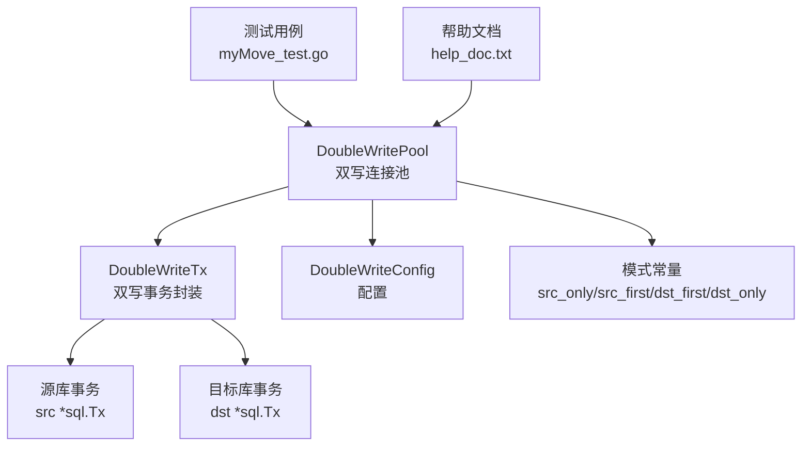
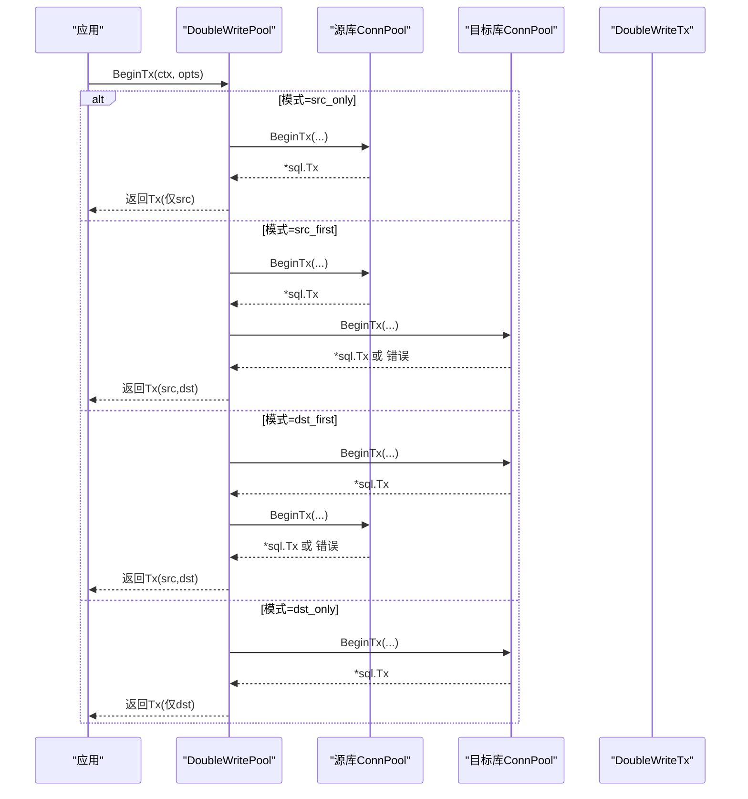
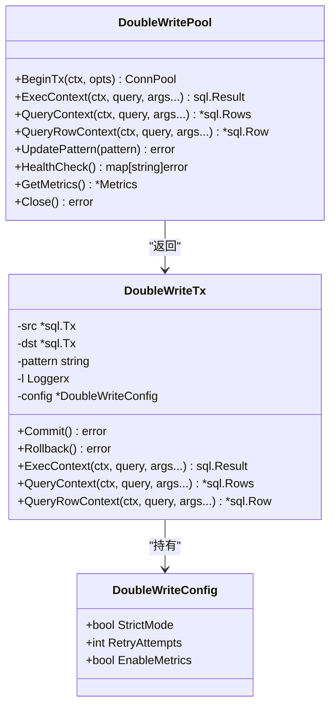
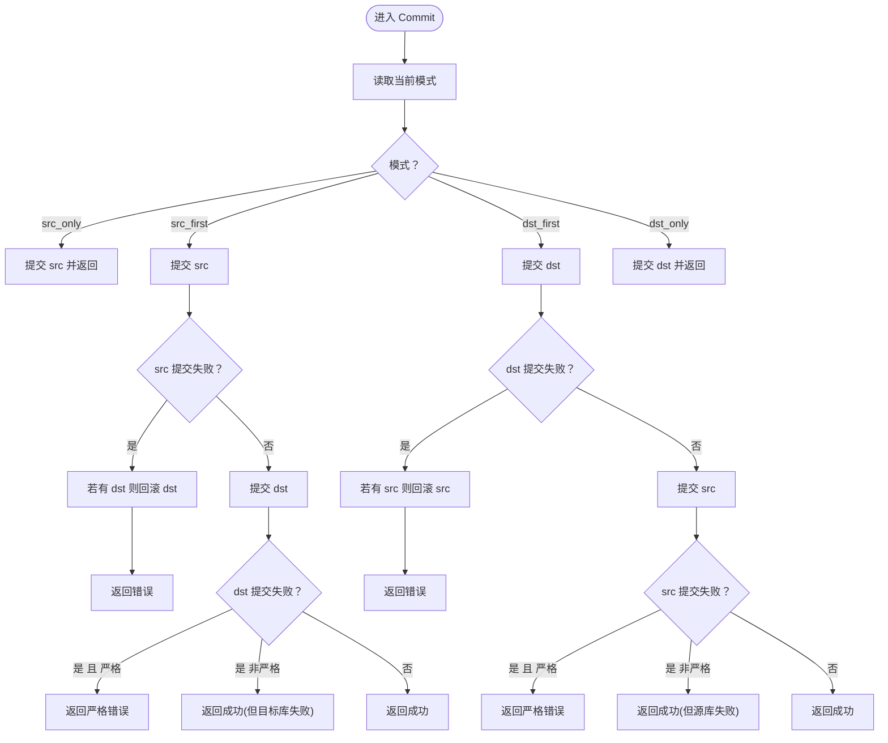
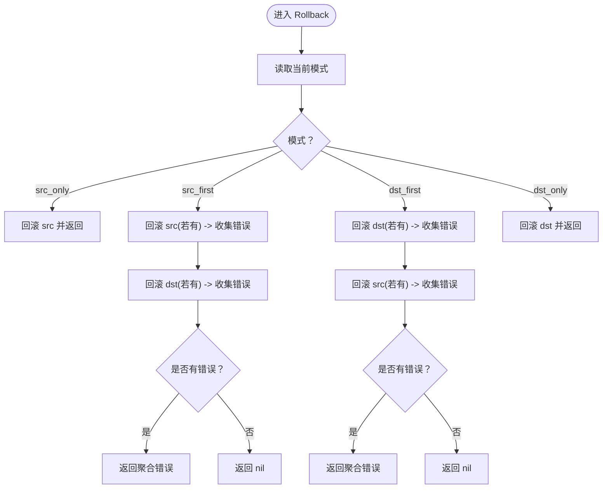
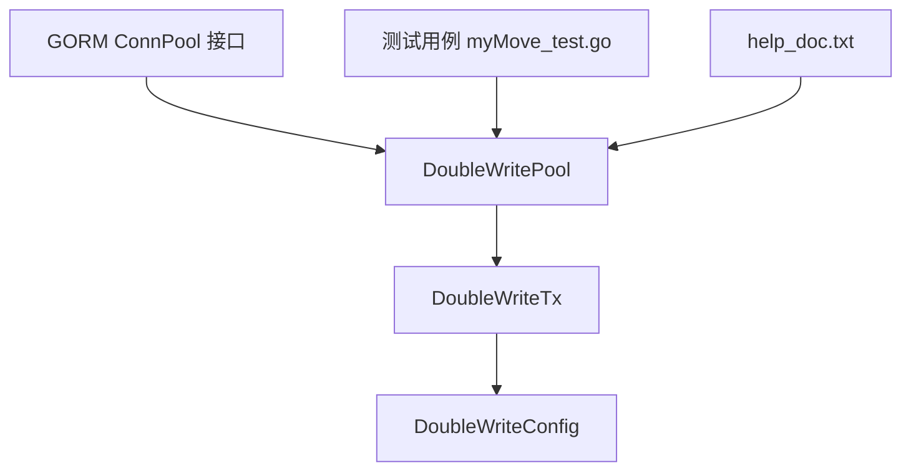

# 事务处理

<cite>
**本文引用的文件列表**
- [double_write_pool.go](file://DBx/mysqlX/gormx/dbMovex/myMovex/doubleWritePoolx/double_write_pool.go)
- [myMove_test.go](file://DBx/mysqlX/gormx/dbMovex/myMovex/test/myMove_test.go)
- [help_doc.txt](file://DBx/mysqlX/gormx/dbMovex/myMovex/help_doc.txt)
- [inconsistent.go](file://DBx/mysqlX/gormx/dbMovex/myMovex/events/inconsistent.go)
</cite>

## 目录
1. [引言](#引言)
2. [项目结构](#项目结构)
3. [核心组件](#核心组件)
4. [架构总览](#架构总览)
5. [详细组件分析](#详细组件分析)
6. [依赖关系分析](#依赖关系分析)
7. [性能考量](#性能考量)
8. [故障排查指南](#故障排查指南)
9. [结论](#结论)
10. [附录](#附录)

## 引言
本文件围绕“双写池事务处理机制”展开，重点阐述 DoubleWriteTx 结构体如何在不同模式下协调源库与目标库的事务生命周期。内容涵盖：
- BeginTx 如何依据当前模式返回 DoubleWriteTx 实例
- Commit 和 Rollback 在不同模式下的协调逻辑（如 PatternSrcFirst 下先提交源库，再提交目标库；严格模式下对目标库提交失败的处理）
- Rollback 如何尝试回滚两个数据库并聚合错误
- 基于 GORM 的事务使用示例路径，展示在双写环境下的事务一致性保障

## 项目结构
与事务处理相关的核心代码位于双写池实现目录，配合测试用例与迁移帮助文档，形成从“连接池/事务封装”到“业务接入”的完整链路。

图表来源
- [double_write_pool.go](file://DBx/mysqlX/gormx/dbMovex/myMovex/doubleWritePoolx/double_write_pool.go#L155-L249)
- [double_write_pool.go](file://DBx/mysqlX/gormx/dbMovex/myMovex/doubleWritePoolx/double_write_pool.go#L477-L716)
- [myMove_test.go](file://DBx/mysqlX/gormx/dbMovex/myMovex/test/myMove_test.go#L601-L623)
- [help_doc.txt](file://DBx/mysqlX/gormx/dbMovex/myMovex/help_doc.txt#L1-L18)

章节来源
- [double_write_pool.go](file://DBx/mysqlX/gormx/dbMovex/myMovex/doubleWritePoolx/double_write_pool.go#L155-L249)
- [double_write_pool.go](file://DBx/mysqlX/gormx/dbMovex/myMovex/doubleWritePoolx/double_write_pool.go#L477-L716)
- [myMove_test.go](file://DBx/mysqlX/gormx/dbMovex/myMovex/test/myMove_test.go#L601-L623)
- [help_doc.txt](file://DBx/mysqlX/gormx/dbMovex/myMovex/help_doc.txt#L1-L18)

## 核心组件
- DoubleWritePool：封装源库与目标库的连接池，负责按模式开启事务、执行读写、健康检查与指标采集。
- DoubleWriteTx：封装双写事务，统一管理 Commit/Rollback 的跨库协调与严格模式下的错误传播。
- DoubleWriteConfig：控制严格模式、重试次数、是否启用指标等行为。
- 模式常量：src_only、src_first、dst_first、dst_only，决定事务开启顺序与写入策略。

章节来源
- [double_write_pool.go](file://DBx/mysqlX/gormx/dbMovex/myMovex/doubleWritePoolx/double_write_pool.go#L29-L58)
- [double_write_pool.go](file://DBx/mysqlX/gormx/dbMovex/myMovex/doubleWritePoolx/double_write_pool.go#L711-L716)

## 架构总览
双写池通过 GORM ConnPool 接口抽象底层连接，对外暴露 BeginTx、ExecContext、QueryContext 等方法。在事务阶段，DoubleWriteTx 将源库与目标库的事务对象组合，按模式执行提交或回滚，并在严格模式下中断后续步骤并返回错误。

图表来源
- [double_write_pool.go](file://DBx/mysqlX/gormx/dbMovex/myMovex/doubleWritePoolx/double_write_pool.go#L155-L249)

## 详细组件分析

### DoubleWriteTx 类图
DoubleWriteTx 组合了源库与目标库的事务对象，并根据当前模式在 Commit/Rollback 中进行协调。

图表来源
- [double_write_pool.go](file://DBx/mysqlX/gormx/dbMovex/myMovex/doubleWritePoolx/double_write_pool.go#L477-L716)
- [double_write_pool.go](file://DBx/mysqlX/gormx/dbMovex/myMovex/doubleWritePoolx/double_write_pool.go#L29-L58)

章节来源
- [double_write_pool.go](file://DBx/mysqlX/gormx/dbMovex/myMovex/doubleWritePoolx/double_write_pool.go#L477-L716)

### BeginTx：按模式返回 DoubleWriteTx
- src_only：仅开启源库事务，返回仅包含 src 的 DoubleWriteTx。
- src_first：先开启源库事务；若目标库开启失败且严格模式开启，则回滚源库并返回错误；否则返回包含 src/dst 的 DoubleWriteTx。
- dst_first：先开启目标库事务；若源库开启失败且严格模式开启，则回滚目标库并返回错误；否则返回包含 src/dst 的 DoubleWriteTx。
- dst_only：仅开启目标库事务，返回仅包含 dst 的 DoubleWriteTx。

章节来源
- [double_write_pool.go](file://DBx/mysqlX/gormx/dbMovex/myMovex/doubleWritePoolx/double_write_pool.go#L155-L249)

### Commit：不同模式下的提交协调
- src_only：直接提交 src。
- src_first：
  - 先提交 src；若失败，尝试回滚 dst（若存在），并返回错误。
  - 若 src 成功，提交 dst；若 dst 失败：
    - 严格模式：返回错误；
    - 非严格模式：继续返回成功（但目标库已失败）。
- dst_first：
  - 先提交 dst；若失败，尝试回滚 src（若存在），并返回错误。
  - 若 dst 成功，提交 src；若 src 失败：
    - 严格模式：返回错误；
    - 非严格模式：继续返回成功（但源库已失败）。
- dst_only：直接提交 dst。

图表来源
- [double_write_pool.go](file://DBx/mysqlX/gormx/dbMovex/myMovex/doubleWritePoolx/double_write_pool.go#L486-L550)

章节来源
- [double_write_pool.go](file://DBx/mysqlX/gormx/dbMovex/myMovex/doubleWritePoolx/double_write_pool.go#L486-L550)

### Rollback：回滚协调与错误聚合
- src_only：直接回滚 src。
- src_first：先回滚 src（若存在），再回滚 dst（若存在），最后将所有回滚错误聚合为一个复合错误返回。
- dst_first：先回滚 dst（若存在），再回滚 src（若存在），最后将所有回滚错误聚合为一个复合错误返回。
- dst_only：直接回滚 dst。

图表来源
- [double_write_pool.go](file://DBx/mysqlX/gormx/dbMovex/myMovex/doubleWritePoolx/double_write_pool.go#L552-L601)

章节来源
- [double_write_pool.go](file://DBx/mysqlX/gormx/dbMovex/myMovex/doubleWritePoolx/double_write_pool.go#L552-L601)

### 事务内写入与查询：按模式执行
- ExecContext：在事务内按模式分别执行写入，若目标库写入失败且严格模式开启，则返回错误；非严格模式下继续返回成功（但目标库已失败）。
- QueryContext/QueryRowContext：按模式选择源库或目标库执行查询。

章节来源
- [double_write_pool.go](file://DBx/mysqlX/gormx/dbMovex/myMovex/doubleWritePoolx/double_write_pool.go#L608-L708)

### 严格模式与错误传播
- 严格模式下，任一关键步骤（目标库事务开启、提交、写入）失败都会导致立即返回错误，并在可能的情况下回滚另一侧事务，确保一致性边界清晰。
- 非严格模式下，失败通常不会阻断后续流程，但目标库/源库的状态可能不一致，需结合业务策略与校验机制处理。

章节来源
- [double_write_pool.go](file://DBx/mysqlX/gormx/dbMovex/myMovex/doubleWritePoolx/double_write_pool.go#L189-L193)
- [double_write_pool.go](file://DBx/mysqlX/gormx/dbMovex/myMovex/doubleWritePoolx/double_write_pool.go#L217-L221)
- [double_write_pool.go](file://DBx/mysqlX/gormx/dbMovex/myMovex/doubleWritePoolx/double_write_pool.go#L511-L516)
- [double_write_pool.go](file://DBx/mysqlX/gormx/dbMovex/myMovex/doubleWritePoolx/double_write_pool.go#L534-L540)
- [double_write_pool.go](file://DBx/mysqlX/gormx/dbMovex/myMovex/doubleWritePoolx/double_write_pool.go#L633-L637)
- [double_write_pool.go](file://DBx/mysqlX/gormx/dbMovex/myMovex/doubleWritePoolx/double_write_pool.go#L662-L666)

### 基于 GORM 的事务使用示例（代码片段路径）
以下示例展示了如何在双写环境下使用 GORM 事务，确保一致性边界与错误处理符合双写池的行为约定。

- 使用双写连接池创建 GORM DB
  - 示例路径：[初始化双写连接池与 GORM DB](file://DBx/mysqlX/gormx/dbMovex/myMovex/test/myMove_test.go#L601-L623)
- 在事务中执行写入（按当前模式）
  - 示例路径：[在事务中写入与查询](file://DBx/mysqlX/gormx/dbMovex/myMovex/double_write_pool.go#L608-L708)
- 切换双写模式（运行时）
  - 示例路径：[切换模式测试用例](file://DBx/mysqlX/gormx/dbMovex/myMovex/test/myMove_test.go#L318-L477)
- 严格模式与回滚
  - 示例路径：[Rollback 聚合错误](file://DBx/mysqlX/gormx/dbMovex/myMovex/double_write_pool.go#L552-L601)

章节来源
- [myMove_test.go](file://DBx/mysqlX/gormx/dbMovex/myMovex/test/myMove_test.go#L318-L477)
- [double_write_pool.go](file://DBx/mysqlX/gormx/dbMovex/myMovex/double_write_pool.go#L608-L708)
- [double_write_pool.go](file://DBx/mysqlX/gormx/dbMovex/myMovex/double_write_pool.go#L552-L601)

## 依赖关系分析
- DoubleWritePool 依赖 GORM ConnPool 接口以适配底层数据库连接。
- DoubleWriteTx 依赖 DoubleWriteConfig 控制严格模式与重试策略。
- 测试用例通过 Gin 服务与 Scheduler 集成，演示运行时切换模式与一致性校验。

图表来源
- [double_write_pool.go](file://DBx/mysqlX/gormx/dbMovex/myMovex/doubleWritePoolx/double_write_pool.go#L155-L249)
- [double_write_pool.go](file://DBx/mysqlX/gormx/dbMovex/myMovex/doubleWritePoolx/double_write_pool.go#L477-L716)
- [myMove_test.go](file://DBx/mysqlX/gormx/dbMovex/myMovex/test/myMove_test.go#L601-L623)
- [help_doc.txt](file://DBx/mysqlX/gormx/dbMovex/myMovex/help_doc.txt#L1-L18)

章节来源
- [double_write_pool.go](file://DBx/mysqlX/gormx/dbMovex/myMovex/doubleWritePoolx/double_write_pool.go#L155-L249)
- [double_write_pool.go](file://DBx/mysqlX/gormx/dbMovex/myMovex/doubleWritePoolx/double_write_pool.go#L477-L716)
- [myMove_test.go](file://DBx/mysqlX/gormx/dbMovex/myMovex/test/myMove_test.go#L601-L623)
- [help_doc.txt](file://DBx/mysqlX/gormx/dbMovex/myMovex/help_doc.txt#L1-L18)

## 性能考量
- 指标采集：双写池支持启用指标收集，记录成功/失败计数与查询耗时，便于评估双写性能与延迟。
- 重试策略：写入操作具备指数退避重试，降低瞬时抖动影响。
- 模式切换：运行时切换模式无需重启服务，适合灰度与故障恢复场景。

章节来源
- [double_write_pool.go](file://DBx/mysqlX/gormx/dbMovex/myMovex/doubleWritePoolx/double_write_pool.go#L409-L429)
- [double_write_pool.go](file://DBx/mysqlX/gormx/dbMovex/myMovex/doubleWritePoolx/double_write_pool.go#L431-L469)

## 故障排查指南
- 健康检查：通过 HealthCheck 检查源库与目标库连接状态，定位连接池问题。
- 日志记录：在事务开启、提交、回滚与写入失败处均有日志输出，便于定位失败点。
- 严格模式：开启严格模式可快速暴露目标库异常，避免半一致状态。
- 不一致事件：通过事件上报与消费者处理，结合校验工具进行修复。

章节来源
- [double_write_pool.go](file://DBx/mysqlX/gormx/dbMovex/myMovex/doubleWritePoolx/double_write_pool.go#L121-L146)
- [inconsistent.go](file://DBx/mysqlX/gormx/dbMovex/myMovex/events/inconsistent.go#L1-L21)

## 结论
DoubleWriteTx 通过在不同模式下对源库与目标库事务的有序协调，结合严格模式与错误聚合，提供了在双写场景下可控的一致性边界。配合测试用例与帮助文档，可在运行时灵活切换模式并保障事务一致性。

## 附录
- 双写模式说明与接入指引参见帮助文档。
- 不一致事件类型与方向定义可用于后续修复与审计。

章节来源
- [help_doc.txt](file://DBx/mysqlX/gormx/dbMovex/myMovex/help_doc.txt#L1-L18)
- [inconsistent.go](file://DBx/mysqlX/gormx/dbMovex/myMovex/events/inconsistent.go#L1-L21)