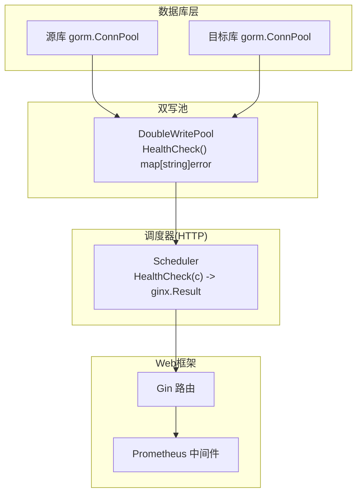
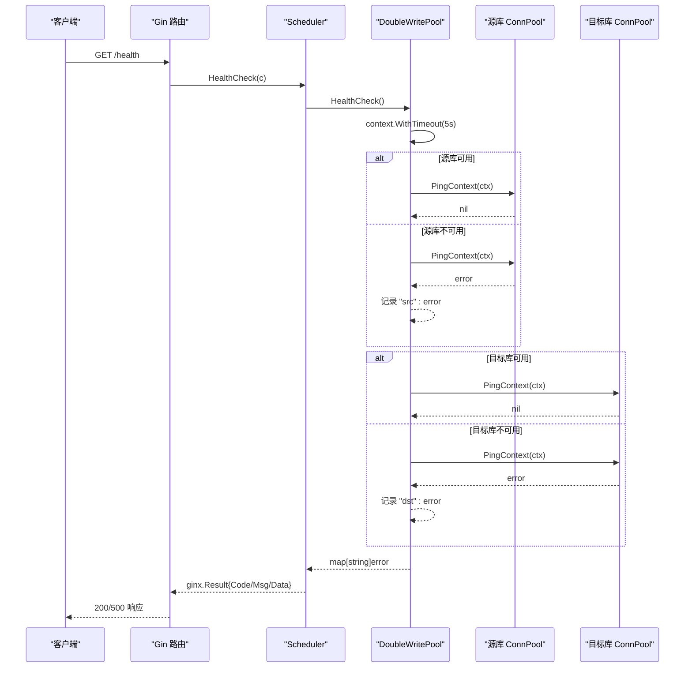
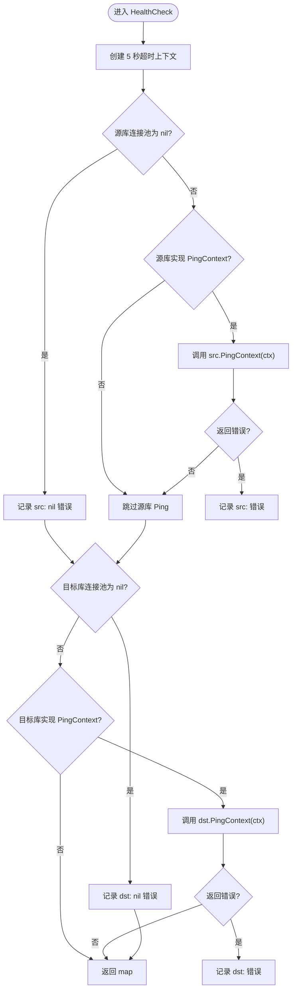
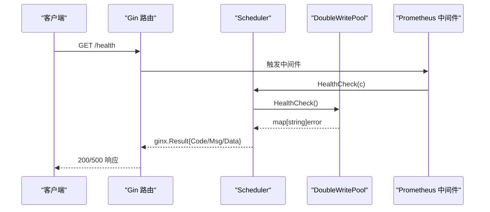

# 健康检查

<cite>
**本文引用的文件**
- [double_write_pool.go](file://DBx/mysqlX/gormx/dbMovex/myMovex/doubleWritePoolx/double_write_pool.go)
- [scheduler.go](file://DBx/mysqlX/gormx/dbMovex/myMovex/scheduler/scheduler.go)
- [help_doc.txt](file://DBx/mysqlX/gormx/dbMovex/myMovex/help_doc.txt)
- [prometheusGinBuild.go](file://webx/ginx/middleware/ginPrometheusx/prometheusGinBuild.go)
- [help_docx](file://webx/ginx/middleware/ginPrometheusx/help_docx)
</cite>

## 目录
1. [简介](#简介)
2. [项目结构](#项目结构)
3. [核心组件](#核心组件)
4. [架构总览](#架构总览)
5. [详细组件分析](#详细组件分析)
6. [依赖关系分析](#依赖关系分析)
7. [性能考量](#性能考量)
8. [故障排查指南](#故障排查指南)
9. [结论](#结论)
10. [附录](#附录)

## 简介
本节聚焦于双写池的健康检查能力，解释 HealthCheck 方法如何通过 PingContext 接口探测源库与目标库的连接状态，返回一个包含数据库标识与错误信息的 map[string]error，便于调用方快速判断各数据库的健康状况。同时说明 HealthCheck 内部如何使用 context.WithTimeout 设置 5 秒超时，避免检查过程阻塞过久；并给出将健康检查集成到 HTTP 健康端点的实践思路，以及在 Kubernetes 等容器编排平台中的应用建议。

## 项目结构
围绕健康检查功能的关键文件与职责如下：
- 双写池实现：负责数据库连接池封装、健康检查、事务与读写操作。
- 调度器：对外暴露 HTTP 健康检查端点，调用双写池的 HealthCheck 并返回结果。
- 文档：说明双写池与调度器的集成方式及 HTTP 路由注册。
- Web 中间件：提供 Prometheus 监控集成示例，便于在健康端点上统一采集指标。

图表来源
- [double_write_pool.go](file://DBx/mysqlX/gormx/dbMovex/myMovex/doubleWritePoolx/double_write_pool.go#L121-L146)
- [scheduler.go](file://DBx/mysqlX/gormx/dbMovex/myMovex/scheduler/scheduler.go#L324-L338)
- [prometheusGinBuild.go](file://webx/ginx/middleware/ginPrometheusx/prometheusGinBuild.go#L64-L110)

章节来源
- [double_write_pool.go](file://DBx/mysqlX/gormx/dbMovex/myMovex/doubleWritePoolx/double_write_pool.go#L121-L146)
- [scheduler.go](file://DBx/mysqlX/gormx/dbMovex/myMovex/scheduler/scheduler.go#L324-L338)
- [help_doc.txt](file://DBx/mysqlX/gormx/dbMovex/myMovex/help_doc.txt#L1-L18)

## 核心组件
- 双写池 DoubleWritePool：封装源库与目标库连接池，提供 HealthCheck 方法用于检测数据库连通性。
- 调度器 Scheduler：对外提供 HTTP 健康检查接口，内部委托双写池执行健康检查，并按约定格式返回结果。
- Web 中间件：提供 Prometheus 指标采集中间件，可用于对健康端点进行统一监控。

章节来源
- [double_write_pool.go](file://DBx/mysqlX/gormx/dbMovex/myMovex/doubleWritePoolx/double_write_pool.go#L121-L146)
- [scheduler.go](file://DBx/mysqlX/gormx/dbMovex/myMovex/scheduler/scheduler.go#L324-L338)
- [prometheusGinBuild.go](file://webx/ginx/middleware/ginPrometheusx/prometheusGinBuild.go#L64-L110)

## 架构总览
健康检查从 HTTP 层进入，经调度器转发到双写池，双写池分别对源库与目标库发起 PingContext 检测，最终返回 map[string]error 结果，供调用方判断健康状态。

图表来源
- [scheduler.go](file://DBx/mysqlX/gormx/dbMovex/myMovex/scheduler/scheduler.go#L324-L338)
- [double_write_pool.go](file://DBx/mysqlX/gormx/dbMovex/myMovex/doubleWritePoolx/double_write_pool.go#L121-L146)

## 详细组件分析

### 双写池健康检查 HealthCheck
- 功能概述
  - 通过 PingContext 探测源库与目标库的连接状态。
  - 返回 map[string]error，其中键为 "src" 或 "dst"，值为对应数据库的错误信息；若无错误则不包含该键。
- 超时控制
  - 使用 context.WithTimeout 设置 5 秒超时，避免检查过程阻塞过久。
- 连接池检查
  - 若连接池为 nil，则直接记录相应错误。
  - 若连接池实现了 PingContext，则调用并记录错误。
- 错误语义
  - 返回的 map 非空表示至少有一个数据库处于不健康状态；为空表示全部健康。

图表来源
- [double_write_pool.go](file://DBx/mysqlX/gormx/dbMovex/myMovex/doubleWritePoolx/double_write_pool.go#L121-L146)

章节来源
- [double_write_pool.go](file://DBx/mysqlX/gormx/dbMovex/myMovex/doubleWritePoolx/double_write_pool.go#L121-L146)

### HTTP 健康端点集成
- 路由与处理器
  - 调度器提供 HealthCheck(c) 处理函数，内部调用双写池 HealthCheck()，并将结果转换为 ginx.Result。
  - 当 map 非空时返回 Code=5、Msg="健康检查失败"，Data 为 map[string]error；否则返回 Msg="服务健康"。
- 路由注册
  - 可通过调度器提供的注册方法将 /health 路由挂载到 Gin 路由树，具体注册方式请参考帮助文档说明。
- 指标采集
  - 可在健康端点上集成 Prometheus 中间件，统一采集响应时间、活跃请求数等指标。

图表来源
- [scheduler.go](file://DBx/mysqlX/gormx/dbMovex/myMovex/scheduler/scheduler.go#L324-L338)
- [prometheusGinBuild.go](file://webx/ginx/middleware/ginPrometheusx/prometheusGinBuild.go#L64-L110)

章节来源
- [scheduler.go](file://DBx/mysqlX/gormx/dbMovex/myMovex/scheduler/scheduler.go#L324-L338)
- [help_doc.txt](file://DBx/mysqlX/gormx/dbMovex/myMovex/help_doc.txt#L1-L18)
- [prometheusGinBuild.go](file://webx/ginx/middleware/ginPrometheusx/prometheusGinBuild.go#L64-L110)
- [help_docx](file://webx/ginx/middleware/ginPrometheusx/help_docx#L1-L31)

### 在 Kubernetes 中的应用
- 探针配置
  - livenessProbe/readinessProbe 可以调用 /health 端点，结合返回码与响应体判断 Pod 是否存活与就绪。
  - 建议将探针超时时间设置为小于等于 5 秒，与双写池 HealthCheck 的超时保持一致，避免探针长时间阻塞。
- 健康端点与指标分离
  - 健康端点与业务端口分离，避免健康检查影响业务流量。
  - Prometheus 另启独立端口抓取指标，保证健康检查不受监控开销影响。

章节来源
- [help_docx](file://webx/ginx/middleware/ginPrometheusx/help_docx#L1-L31)

## 依赖关系分析
- 双写池依赖 GORM 连接池接口，通过 PingContext 检测数据库连通性。
- 调度器依赖双写池的 HealthCheck 能力，向上提供 HTTP 接口。
- Web 中间件提供 Prometheus 指标采集，便于统一监控健康端点。

图表来源
- [double_write_pool.go](file://DBx/mysqlX/gormx/dbMovex/myMovex/doubleWritePoolx/double_write_pool.go#L121-L146)
- [scheduler.go](file://DBx/mysqlX/gormx/dbMovex/myMovex/scheduler/scheduler.go#L324-L338)
- [prometheusGinBuild.go](file://webx/ginx/middleware/ginPrometheusx/prometheusGinBuild.go#L64-L110)

章节来源
- [double_write_pool.go](file://DBx/mysqlX/gormx/dbMovex/myMovex/doubleWritePoolx/double_write_pool.go#L121-L146)
- [scheduler.go](file://DBx/mysqlX/gormx/dbMovex/myMovex/scheduler/scheduler.go#L324-L338)
- [prometheusGinBuild.go](file://webx/ginx/middleware/ginPrometheusx/prometheusGinBuild.go#L64-L110)

## 性能考量
- 超时控制：HealthCheck 使用 5 秒超时，避免阻塞；探针与外部调用也应遵循相同策略。
- 并发安全：HealthCheck 仅读取连接池状态，不涉及共享状态修改，天然并发安全。
- 指标开销：健康端点可接入 Prometheus 中间件，但需注意中间件本身带来的少量开销，建议在独立端口暴露健康检查。

## 故障排查指南
- 健康检查返回非空 map
  - 若包含 "src" 键，说明源库不可达；若包含 "dst" 键，说明目标库不可达。
  - 若同时包含两个键，说明双库均不可达。
- nil 连接池
  - 若返回 "src" 或 "dst" 对应 nil 错误，说明未正确初始化连接池，请检查初始化逻辑。
- 超时问题
  - 若返回超时错误，说明数据库连接或网络存在延迟；建议检查网络连通性与数据库负载。
- HTTP 端点异常
  - 确认路由已注册且中间件已启用；检查探针超时与健康端点超时设置是否一致。

章节来源
- [double_write_pool.go](file://DBx/mysqlX/gormx/dbMovex/myMovex/doubleWritePoolx/double_write_pool.go#L121-L146)
- [scheduler.go](file://DBx/mysqlX/gormx/dbMovex/myMovex/scheduler/scheduler.go#L324-L338)

## 结论
双写池的 HealthCheck 通过 PingContext 快速探测源库与目标库的连通性，并以 map[string]error 形式返回结果，便于调用方快速定位问题。配合 5 秒超时与 HTTP 健康端点集成，可在 Kubernetes 等容器编排平台中作为 livenessProbe/readinessProbe 的可靠依据。建议将健康端点与业务端口分离，并接入 Prometheus 中间件统一采集指标，以获得更全面的可观测性。

## 附录
- 双写池健康检查方法定义位置：[HealthCheck](file://DBx/mysqlX/gormx/dbMovex/myMovex/doubleWritePoolx/double_write_pool.go#L121-L146)
- HTTP 健康端点处理逻辑：[HealthCheck(c)](file://DBx/mysqlX/gormx/dbMovex/myMovex/scheduler/scheduler.go#L324-L338)
- 路由注册与集成说明：[帮助文档](file://DBx/mysqlX/gormx/dbMovex/myMovex/help_doc.txt#L1-L18)
- Prometheus 中间件示例与独立端口建议：[中间件构建](file://webx/ginx/middleware/ginPrometheusx/prometheusGinBuild.go#L64-L110)，[独立端口说明](file://webx/ginx/middleware/ginPrometheusx/help_docx#L1-L31)