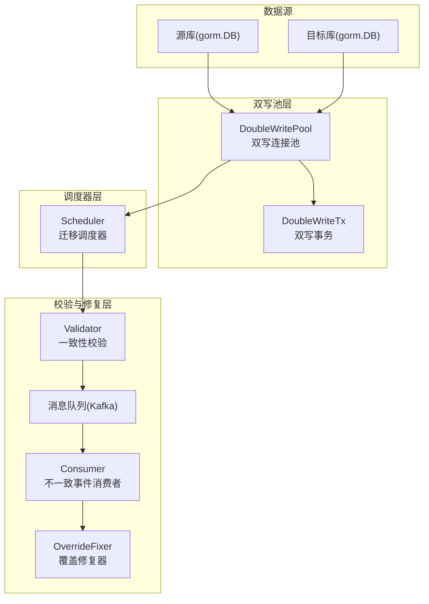
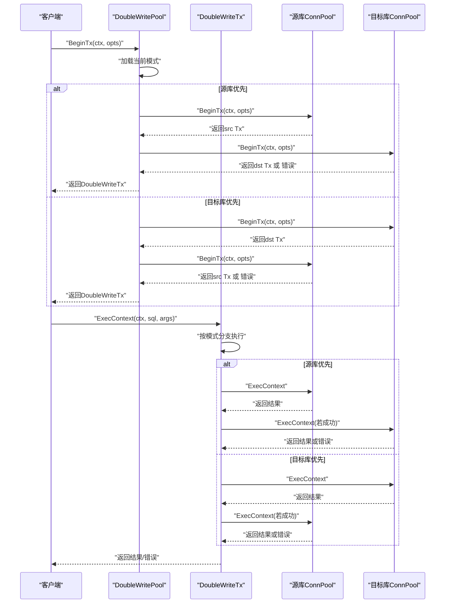
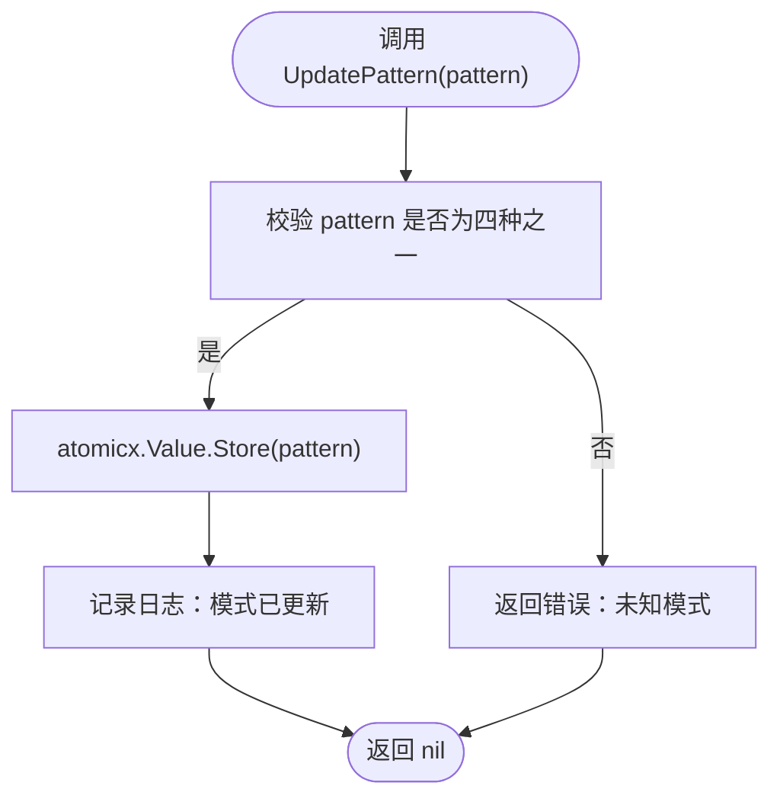
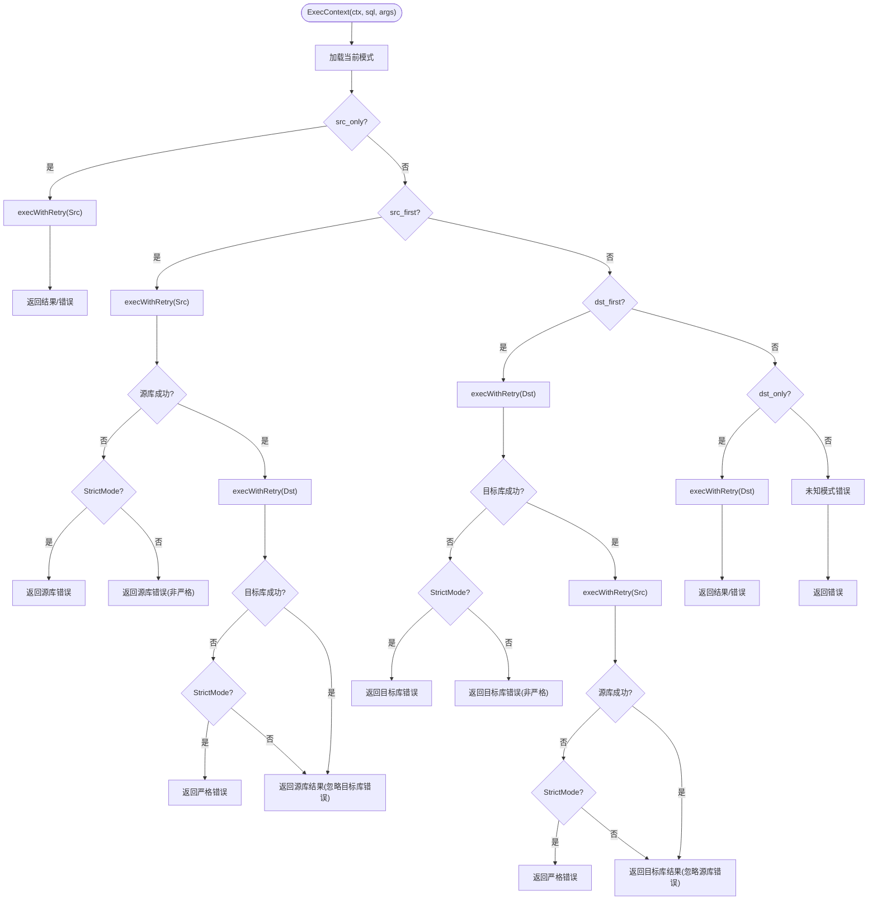
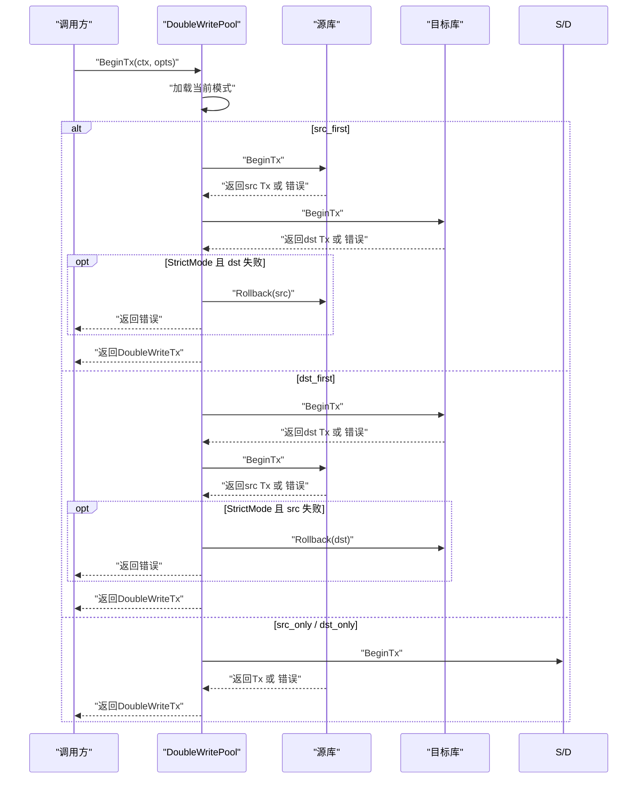
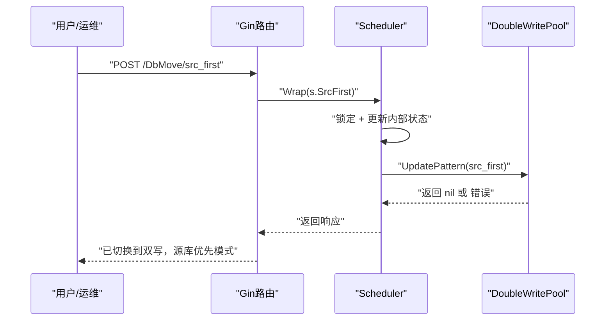
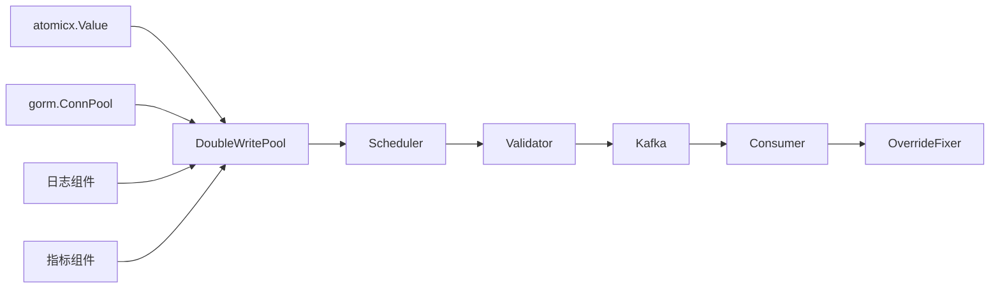

# 写入模式

<cite>
**本文引用的文件**
- [double_write_pool.go](file://DBx/mysqlX/gormx/dbMovex/myMovex/doubleWritePoolx/double_write_pool.go)
- [atomic.go](file://syncX/atomicx/atomic.go)
- [scheduler.go](file://DBx/mysqlX/gormx/dbMovex/myMovex/scheduler/scheduler.go)
- [myMove_test.go](file://DBx/mysqlX/gormx/dbMovex/myMovex/test/myMove_test.go)
- [validator.go](file://DBx/mysqlX/gormx/dbMovex/myMovex/validator/validator.go)
- [consumer.go](file://DBx/mysqlX/gormx/dbMovex/myMovex/messageQueue/consumerx/consumer.go)
- [fixer.go](file://DBx/mysqlX/gormx/dbMovex/myMovex/messageQueue/consumerx/fixer.go)
- [inconsistent.go](file://DBx/mysqlX/gormx/dbMovex/myMovex/events/inconsistent.go)
- [help_doc.txt](file://DBx/mysqlX/gormx/dbMovex/myMovex/help_doc.txt)
</cite>

## 目录
1. [简介](#简介)
2. [项目结构](#项目结构)
3. [核心组件](#核心组件)
4. [架构总览](#架构总览)
5. [详细组件分析](#详细组件分析)
6. [依赖关系分析](#依赖关系分析)
7. [性能与可靠性考量](#性能与可靠性考量)
8. [故障排查指南](#故障排查指南)
9. [结论](#结论)
10. [附录](#附录)

## 简介
本文件围绕“双写池”的四种写入模式展开，系统性阐述 PatternSrcOnly、PatternSrcFirst、PatternDstFirst 和 PatternDstOnly 在 ExecContext 与 BeginTx 方法中的行为差异；说明 UpdatePattern 如何实现运行时模式切换并利用 atomicx.Value 保证线程安全；结合测试用例与实际代码路径，给出不同模式下的 SQL 执行路径与错误处理策略，特别强调 StrictMode 对写入失败的影响。

## 项目结构
双写池位于 MySQL/GORM 迁移子系统中，配合调度器、校验器、消息队列与消费者，形成从“模式切换”到“一致性校验再到“不一致修复”的闭环。

图表来源
- [double_write_pool.go](file://DBx/mysqlX/gormx/dbMovex/myMovex/doubleWritePoolx/double_write_pool.go#L1-L120)
- [scheduler.go](file://DBx/mysqlX/gormx/dbMovex/myMovex/scheduler/scheduler.go#L103-L205)
- [validator.go](file://DBx/mysqlX/gormx/dbMovex/myMovex/validator/validator.go#L1-L120)
- [consumer.go](file://DBx/mysqlX/gormx/dbMovex/myMovex/messageQueue/consumerx/consumer.go#L60-L100)
- [fixer.go](file://DBx/mysqlX/gormx/dbMovex/myMovex/messageQueue/consumerx/fixer.go#L1-L41)

章节来源
- [help_doc.txt](file://DBx/mysqlX/gormx/dbMovex/myMovex/help_doc.txt#L1-L18)

## 核心组件
- 双写连接池 DoubleWritePool：封装源库与目标库连接池，提供模式切换、事务封装、查询与写入执行、健康检查与指标采集。
- 双写事务 DoubleWriteTx：封装源/目标事务对象，按当前模式执行提交/回滚与写入。
- 调度器 Scheduler：提供 HTTP 接口切换模式，驱动迁移流程与校验。
- 校验器 Validator：基于双向扫描与批处理，发现不一致并上报消息队列。
- 消费者与修复器：消费不一致事件，按方向覆盖修复目标库。

章节来源
- [double_write_pool.go](file://DBx/mysqlX/gormx/dbMovex/myMovex/doubleWritePoolx/double_write_pool.go#L36-L88)
- [scheduler.go](file://DBx/mysqlX/gormx/dbMovex/myMovex/scheduler/scheduler.go#L47-L123)
- [validator.go](file://DBx/mysqlX/gormx/dbMovex/myMovex/validator/validator.go#L29-L60)
- [consumer.go](file://DBx/mysqlX/gormx/dbMovex/myMovex/messageQueue/consumerx/consumer.go#L32-L60)
- [fixer.go](file://DBx/mysqlX/gormx/dbMovex/myMovex/messageQueue/consumerx/fixer.go#L10-L41)

## 架构总览
双写池通过原子值存储当前模式，ExecContext/BeginTx/QueryContext/QueryRowContext/ExecContext(事务)等均按当前模式分支执行。调度器通过 HTTP 接口调用 UpdatePattern 实现运行时切换；StrictMode 控制写入失败时的行为（严格模式下失败即返回，非严格模式下可能继续或回滚）。

图表来源
- [double_write_pool.go](file://DBx/mysqlX/gormx/dbMovex/myMovex/doubleWritePoolx/double_write_pool.go#L155-L249)
- [double_write_pool.go](file://DBx/mysqlX/gormx/dbMovex/myMovex/doubleWritePoolx/double_write_pool.go#L608-L717)

## 详细组件分析

### 模式定义与默认值
- 模式常量：
  - PatternSrcOnly：仅写源库
  - PatternSrcFirst：先写源库，再写目标库
  - PatternDstFirst：先写目标库，再写源库
  - PatternDstOnly：仅写目标库
- 默认模式：创建双写池时初始化为 PatternSrcOnly。

章节来源
- [double_write_pool.go](file://DBx/mysqlX/gormx/dbMovex/myMovex/doubleWritePoolx/double_write_pool.go#L70-L88)
- [double_write_pool.go](file://DBx/mysqlX/gormx/dbMovex/myMovex/double_write_pool.go#L710-L717)

### UpdatePattern：运行时模式切换与线程安全
- UpdatePattern 支持在运行时切换模式，仅接受上述四种模式之一；否则返回错误。
- 使用 atomicx.Value[string] 存储模式，保证并发安全与低开销读取。
- 日志记录模式变更。

图表来源
- [double_write_pool.go](file://DBx/mysqlX/gormx/dbMovex/myMovex/double_write_pool.go#L109-L119)
- [atomic.go](file://syncX/atomicx/atomic.go#L32-L55)

章节来源
- [double_write_pool.go](file://DBx/mysqlX/gormx/dbMovex/myMovex/double_write_pool.go#L109-L119)
- [atomic.go](file://syncX/atomicx/atomic.go#L1-L55)

### ExecContext：四种模式下的写入路径与错误处理
- PatternSrcOnly：仅对源库执行写入，失败直接返回。
- PatternSrcFirst：
  - 先写源库，失败则按 StrictMode 决定是否返回；
  - 成功后再写目标库，目标库失败按 StrictMode 决定是否返回。
- PatternDstOnly：仅对目标库执行写入，失败直接返回。
- PatternDstFirst：
  - 先写目标库，失败则按 StrictMode 决定是否返回；
  - 成功后再写源库，源库失败按 StrictMode 决定是否返回。

图表来源
- [double_write_pool.go](file://DBx/mysqlX/gormx/dbMovex/myMovex/double_write_pool.go#L256-L350)
- [double_write_pool.go](file://DBx/mysqlX/gormx/dbMovex/myMovex/double_write_pool.go#L409-L429)

章节来源
- [double_write_pool.go](file://DBx/mysqlX/gormx/dbMovex/myMovex/double_write_pool.go#L256-L350)
- [double_write_pool.go](file://DBx/mysqlX/gormx/dbMovex/myMovex/double_write_pool.go#L409-L429)

### BeginTx：四种模式下的事务开启与回滚策略
- PatternSrcOnly：仅开启源库事务，返回封装的 DoubleWriteTx。
- PatternSrcFirst：先开启源库事务；若目标库开启失败且 StrictMode，则回滚源库并返回错误；否则返回封装的 DoubleWriteTx。
- PatternDstFirst：先开启目标库事务；若源库开启失败且 StrictMode，则回滚目标库并返回错误；否则返回封装的 DoubleWriteTx。
- PatternDstOnly：仅开启目标库事务，返回封装的 DoubleWriteTx。

图表来源
- [double_write_pool.go](file://DBx/mysqlX/gormx/dbMovex/myMovex/double_write_pool.go#L155-L249)

章节来源
- [double_write_pool.go](file://DBx/mysqlX/gormx/dbMovex/myMovex/double_write_pool.go#L155-L249)

### 事务内的写入与提交：ExecContext(事务)与 Commit/Rollback
- ExecContext(事务)：按模式分别对源/目标库执行写入；目标库/源库失败时按 StrictMode 决定是否返回错误。
- Commit：按模式提交源/目标库事务；若某库提交失败且 StrictMode 为真，则返回严格错误。
- Rollback：按模式回滚源/目标库事务；收集所有回滚错误并汇总返回。

章节来源
- [double_write_pool.go](file://DBx/mysqlX/gormx/dbMovex/myMovex/double_write_pool.go#L608-L717)

### StrictMode 对写入失败的影响
- 严格模式下，任一写入或提交失败都会立即返回错误，避免数据不一致扩散。
- 非严格模式下，写入失败可能被忽略（取决于具体模式），但事务层面仍遵循相应回滚策略。

章节来源
- [double_write_pool.go](file://DBx/mysqlX/gormx/dbMovex/myMovex/double_write_pool.go#L290-L306)
- [double_write_pool.go](file://DBx/mysqlX/gormx/dbMovex/myMovex/double_write_pool.go#L330-L344)
- [double_write_pool.go](file://DBx/mysqlX/gormx/dbMovex/myMovex/double_write_pool.go#L500-L516)
- [double_write_pool.go](file://DBx/mysqlX/gormx/dbMovex/myMovex/double_write_pool.go#L523-L539)

### 运行时模式切换：HTTP 接口与调度器
- 调度器提供 HTTP 接口切换模式：/src_only、/src_first、/dst_first、/dst_only。
- 每个接口内部调用 UpdatePattern 并更新内部状态与统计信息。
- AutoMigrate 自动推进迁移阶段，依次切换模式并进行全量/增量校验。

图表来源
- [scheduler.go](file://DBx/mysqlX/gormx/dbMovex/myMovex/scheduler/scheduler.go#L103-L185)
- [scheduler.go](file://DBx/mysqlX/gormx/dbMovex/myMovex/scheduler/scheduler.go#L350-L403)

章节来源
- [scheduler.go](file://DBx/mysqlX/gormx/dbMovex/myMovex/scheduler/scheduler.go#L103-L205)
- [scheduler.go](file://DBx/mysqlX/gormx/dbMovex/myMovex/scheduler/scheduler.go#L350-L403)

### 测试验证：四种模式的行为一致性
- 测试覆盖四种模式下的插入、查询与状态断言，验证：
  - src_only：仅源库写入，目标库无数据
  - src_first：源库优先双写，目标库一致
  - dst_first：目标库优先双写，目标库一致
  - dst_only：仅目标库写入，源库无数据
- 通过 HTTP 接口切换模式并断言当前模式与统计数据。

章节来源
- [myMove_test.go](file://DBx/mysqlX/gormx/dbMovex/myMovex/test/myMove_test.go#L121-L283)
- [myMove_test.go](file://DBx/mysqlX/gormx/dbMovex/myMovex/test/myMove_test.go#L284-L567)

## 依赖关系分析
- 双写池依赖：
  - atomicx.Value：用于线程安全的模式存储与读取
  - gorm.ConnPool：抽象底层连接池能力（BeginTx、ExecContext、QueryContext 等）
  - 日志组件：记录错误与关键事件
  - 指标组件：可选的执行耗时与成功率统计
- 调度器依赖：
  - Gin 路由包装器：ginx.Wrap/ gin.WrapBody
  - 双写池：UpdatePattern、HealthCheck、GetMetrics
  - 校验器：全量/增量校验
- 校验器依赖：
  - Kafka 消息队列：上报不一致事件
  - 消费者：订阅并处理不一致事件
  - 修复器：按方向覆盖修复目标库

图表来源
- [double_write_pool.go](file://DBx/mysqlX/gormx/dbMovex/myMovex/double_write_pool.go#L36-L88)
- [scheduler.go](file://DBx/mysqlX/gormx/dbMovex/myMovex/scheduler/scheduler.go#L103-L205)
- [validator.go](file://DBx/mysqlX/gormx/dbMovex/myMovex/validator/validator.go#L1-L120)
- [consumer.go](file://DBx/mysqlX/gormx/dbMovex/myMovex/messageQueue/consumerx/consumer.go#L60-L100)
- [fixer.go](file://DBx/mysqlX/gormx/dbMovex/myMovex/messageQueue/consumerx/fixer.go#L1-L41)

## 性能与可靠性考量
- 指数退避重试：execWithRetry 使用指数退避等待，降低瞬时抖动影响。
- 指标采集：可选的执行耗时与成功率统计，便于容量评估与问题定位。
- 严格模式：在关键阶段（提交、写入）启用严格模式，确保数据一致性。
- 事务隔离：按模式开启事务，失败时按 StrictMode 回滚，避免半写状态。

章节来源
- [double_write_pool.go](file://DBx/mysqlX/gormx/dbMovex/myMovex/double_write_poolx/double_write_pool.go#L409-L429)
- [double_write_pool.go](file://DBx/mysqlX/gormx/dbMovex/myMovex/double_write_poolx/double_write_pool.go#L431-L469)
- [double_write_pool.go](file://DBx/mysqlX/gormx/dbMovex/myMovex/double_write_poolx/double_write_pool.go#L486-L550)

## 故障排查指南
- 健康检查：HealthCheck 检查源/目标库 Ping，返回错误映射。
- 错误分类：
  - 未知模式：UpdatePattern 输入非法
  - Prepare 不支持：双写池不支持 PrepareContext
  - 连接池为空：源/目标库连接池为 nil
- 严格模式下的错误传播：提交/写入失败时，严格模式会返回错误并可能触发回滚。
- 消息队列：校验器将不一致事件上报 Kafka，消费者拉取并修复。

章节来源
- [double_write_pool.go](file://DBx/mysqlX/gormx/dbMovex/myMovex/double_write_pool.go#L121-L146)
- [double_write_pool.go](file://DBx/mysqlX/gormx/dbMovex/myMovex/double_write_pool.go#L251-L255)
- [validator.go](file://DBx/mysqlX/gormx/dbMovex/myMovex/validator/validator.go#L234-L256)
- [consumer.go](file://DBx/mysqlX/gormx/dbMovex/myMovex/messageQueue/consumerx/consumer.go#L60-L100)

## 结论
双写池通过四种明确的写入模式与严格的事务/提交策略，在迁移过程中提供了可控的一致性保障。UpdatePattern 借助 atomicx.Value 实现线程安全的运行时切换；StrictMode 在关键节点阻止不一致扩散。配合调度器、校验器与消息队列修复链路，形成从“模式切换—>一致性校验—>不一致修复”的完整闭环。

## 附录
- 模式常量定义与默认值
- 运行时切换接口与迁移自动化
- 严格模式与非严格模式下的行为差异
- 指标采集与健康检查

章节来源
- [double_write_pool.go](file://DBx/mysqlX/gormx/dbMovex/myMovex/double_write_pool.go#L710-L717)
- [scheduler.go](file://DBx/mysqlX/gormx/dbMovex/myMovex/scheduler/scheduler.go#L103-L205)
- [validator.go](file://DBx/mysqlX/gormx/dbMovex/myMovex/validator/validator.go#L1-L120)
- [consumer.go](file://DBx/mysqlX/gormx/dbMovex/myMovex/messageQueue/consumerx/consumer.go#L60-L100)
- [fixer.go](file://DBx/mysqlX/gormx/dbMovex/myMovex/messageQueue/consumerx/fixer.go#L1-L41)
- [inconsistent.go](file://DBx/mysqlX/gormx/dbMovex/myMovex/events/inconsistent.go#L1-L21)