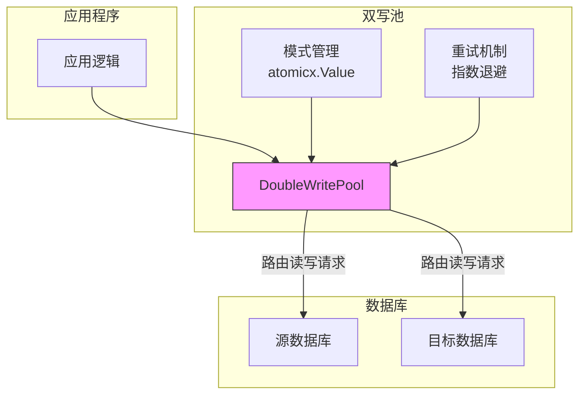
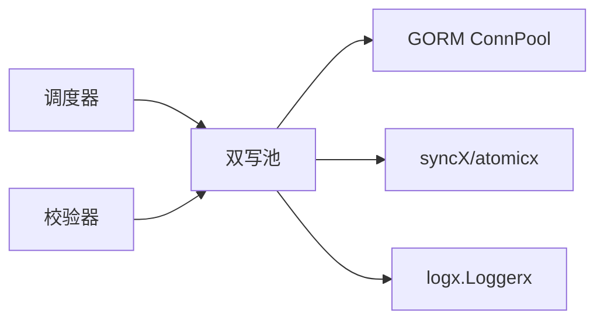

# 双写池

<cite>
**本文档引用的文件**  
- [double_write_pool.go](file://DBx/mysqlX/gormx/dbMovex/myMovex/doubleWritePoolx/double_write_pool.go)
- [atomic.go](file://syncX/atomicx/atomic.go)
- [types.go](file://logx/types.go)
- [myMove_test.go](file://DBx/mysqlX/gormx/dbMovex/myMovex/test/myMove_test.go)
- [scheduler.go](file://DBx/mysqlX/gormx/dbMovex/myMovex/scheduler/scheduler.go)
- [validator.go](file://DBx/mysqlX/gormx/dbMovex/myMovex/validator/validator.go)
- [structTest.go](file://DBx/mysqlX/gormx/dbMovex/myMovex/events/structTest.go)
- [README.md](file://README.md)
</cite>

## 目录
1. [简介](#简介)
2. [项目结构](#项目结构)
3. [核心组件](#核心组件)
4. [架构概述](#架构概述)
5. [详细组件分析](#详细组件分析)
6. [依赖分析](#依赖分析)
7. [性能考虑](#性能考虑)
8. [故障排除指南](#故障排除指南)
9. [结论](#结论)

## 简介
双写池（DoubleWritePool）是数据库迁移过程中的核心组件，旨在实现源数据库与目标数据库之间的同步写入。该组件通过封装 GORM 的 ConnPool 接口，支持多种写入模式，包括仅写源库、先写源库再写目标库、先写目标库再写源库以及仅写目标库。通过灵活的模式切换机制，双写池能够在迁移的不同阶段精确控制数据流向，确保数据一致性。此外，它还提供了健康检查、监控指标收集、事务协调和重试机制等功能，为数据库迁移提供了稳定可靠的基础设施支持。

## 项目结构
双写池位于项目 `pkg_tool` 的 `DBx/mysqlX/gormx/dbMovex/myMovex/doubleWritePoolx` 目录下，是数据库迁移工具模块的一部分。该项目结构清晰地划分了不同功能模块，如数据库操作、消息队列、配置管理、日志记录等。双写池作为数据库迁移的核心，与调度器（scheduler）、校验器（validator）和消息队列等组件紧密协作，共同完成复杂的迁移任务。其设计遵循了高内聚、低耦合的原则，通过定义清晰的接口与外部系统交互，保证了良好的可维护性和可扩展性。

**Section sources**
- [README.md](file://README.md#L11-L11)

## 核心组件
双写池的核心是 `DoubleWritePool` 结构体，它封装了源库和目标库的连接池，并通过一个原子值（`atomicx.Value[string]`）来安全地存储当前的写入模式。该组件实现了 GORM 的 `ConnPool` 接口，从而可以无缝集成到使用 GORM 的应用程序中。其主要功能包括：根据当前模式决定读写操作的目标数据库、在不同模式下协调源库和目标库的写入顺序、通过 `execWithRetry` 方法实现带指数退避的重试逻辑，以及在事务中保证两库操作的一致性。配置项如 `StrictMode` 和 `RetryAttempts` 允许用户根据实际需求调整行为，例如在严格模式下，任一数据库操作失败都会导致整个操作失败。

**Section sources**
- [double_write_pool.go](file://DBx/mysqlX/gormx/dbMovex/myMovex/doubleWritePoolx/double_write_pool.go#L37-L50)

## 架构概述
双写池的架构设计围绕着数据库连接池的抽象和模式化控制展开。它位于应用程序和底层数据库之间，作为所有数据库操作的统一入口。当应用程序发起数据库操作时，请求首先到达双写池。双写池根据其内部存储的当前模式（`Pattern`），将请求路由到源库、目标库或两者。对于写操作，它会根据模式决定执行顺序，并处理可能的错误和重试。对于读操作，它则根据模式选择单一的数据源。整个过程通过 `atomicx.Value` 实现线程安全的模式切换，确保在高并发环境下状态变更的原子性。这种设计使得双写池能够动态适应迁移过程的不同阶段，从最初的只读源库，到双写验证，再到最终的只写目标库。



**Diagram sources **
- [double_write_pool.go](file://DBx/mysqlX/gormx/dbMovex/myMovex/doubleWritePoolx/double_write_pool.go#L37-L50)

## 详细组件分析

### 双写池结构分析
`DoubleWritePool` 结构体是整个组件的核心，它包含了源库和目标库的连接池引用、当前的写入模式、日志记录器、配置选项以及用于监控的指标。其中，`Pattern` 字段使用 `atomicx.Value[string]` 类型，这是实现无锁、线程安全模式切换的关键。`Config` 字段定义了行为策略，如是否启用严格模式和重试次数。`Metrics` 结构体用于收集操作的成功与失败次数以及查询耗时，为性能监控和问题排查提供数据支持。

#### 类图
```mermaid
classDiagram
class DoubleWritePool {
+Src gorm.ConnPool
+Dst gorm.ConnPool
+Pattern *atomicx.Value[string]
+L logx.Loggerx
+Config DoubleWriteConfig
+Metrics *Metrics
+mu sync.RWMutex
+ctx context.Context
+cancel context.CancelFunc
+metricsWg sync.WaitGroup
+NewDoubleWritePool(src *gorm.DB, dst *gorm.DB, l logx.Loggerx, config ...DoubleWriteConfig) *DoubleWritePool
+Close() error
+UpdatePattern(pattern string) error
+HealthCheck() map[string]error
+GetMetrics() *Metrics
+BeginTx(ctx context.Context, opts *sql.TxOptions) (gorm.ConnPool, error)
+PrepareContext(ctx context.Context, query string) (*sql.Stmt, error)
+ExecContext(ctx context.Context, query string, args ...interface{}) (sql.Result, error)
+QueryContext(ctx context.Context, query string, args ...interface{}) (*sql.Rows, error)
+QueryRowContext(ctx context.Context, query string, args ...interface{}) *sql.Row
+execWithRetry(ctx context.Context, pool gorm.ConnPool, query string, args ...interface{}) (sql.Result, error)
+recordMetrics(duration time.Duration, err error)
+collectMetrics()
}
class DoubleWriteConfig {
+StrictMode bool
+RetryAttempts int
+EnableMetrics bool
}
class Metrics {
+DoubleWriteSuccess int64
+DoubleWriteFailure int64
+QueryDuration []time.Duration
}
class DoubleWriteTx {
+src *sql.Tx
+dst *sql.Tx
+pattern string
+l logx.Loggerx
+config *DoubleWriteConfig
+Commit() error
+Rollback() error
+ExecContext(ctx context.Context, query string, args ...interface{}) (sql.Result, error)
+QueryContext(ctx context.Context, query string, args ...interface{}) (*sql.Rows, error)
+QueryRowContext(ctx context.Context, query string, args ...interface{}) *sql.Row
}
DoubleWritePool --> DoubleWriteConfig : "包含"
DoubleWritePool --> Metrics : "包含"
DoubleWritePool --> DoubleWriteTx : "创建"
DoubleWriteTx --> DoubleWriteConfig : "引用"
```

**Diagram sources **
- [double_write_pool.go](file://DBx/mysqlX/gormx/dbMovex/myMovex/doubleWritePoolx/double_write_pool.go#L37-L50)

**Section sources**
- [double_write_pool.go](file://DBx/mysqlX/gormx/dbMovex/myMovex/doubleWritePoolx/double_write_pool.go#L37-L50)

### 写入模式与切换机制
双写池支持四种预定义的写入模式，通过常量定义：`PatternSrcOnly`（只写源库）、`PatternSrcFirst`（先写源库）、`PatternDstFirst`（先写目标库）和`PatternDstOnly`（只写目标库）。`UpdatePattern` 方法是切换模式的入口，它接收一个模式字符串，验证其有效性后，通过 `atomicx.Value.Store` 方法安全地更新内部状态。这一机制允许在运行时动态调整数据流向，是实现平滑迁移的关键。例如，在迁移初期，可以设置为 `PatternSrcOnly` 以保证现有业务不受影响；在数据校验通过后，可通过 HTTP 接口或直接调用将模式切换为 `PatternDstOnly`，完成迁移。

**Section sources**
- [double_write_pool.go](file://DBx/mysqlX/gormx/dbMovex/myMovex/doubleWritePoolx/double_write_pool.go#L711-L716)
- [double_write_pool.go](file://DBx/mysqlX/gormx/dbMovex/myMovex/doubleWritePoolx/double_write_pool.go#L109-L119)

### 读写逻辑与接口封装
双写池通过实现 GORM 的 `ConnPool` 接口，将自身的逻辑注入到数据库操作流程中。`ExecContext` 方法处理所有写操作，它根据当前模式决定执行顺序。在 `PatternSrcFirst` 模式下，它首先尝试写入源库，成功后再异步或同步地写入目标库（取决于 `StrictMode`）。`QueryContext` 和 `QueryRowContext` 方法则根据模式选择读取源库或目标库的数据，确保读写一致性。`PrepareContext` 方法被明确禁用，因为预编译语句在双写场景下难以管理。这种封装方式对上层应用透明，应用无需修改业务代码即可享受双写带来的数据安全保障。

**Section sources**
- [double_write_pool.go](file://DBx/mysqlX/gormx/dbMovex/myMovex/doubleWritePoolx/double_write_pool.go#L256-L349)
- [double_write_pool.go](file://DBx/mysqlX/gormx/dbMovex/myMovex/doubleWritePoolx/double_write_pool.go#L352-L378)

### 重试机制与指数退避
为了提高系统的容错能力，双写池内置了 `execWithRetry` 方法。该方法在执行写操作时，如果遇到失败，会根据配置的 `RetryAttempts` 进行重试。重试策略采用了指数退避算法，即每次重试的等待时间会逐渐增加（`time.Duration(i+1) * 100 * time.Millisecond`），以避免在数据库短暂不可用时产生过多的重试请求，从而加剧系统压力。此机制有效应对了网络抖动或数据库瞬时过载等常见问题，提升了整体的稳定性。

**Section sources**
- [double_write_pool.go](file://DBx/mysqlX/gormx/dbMovex/myMovex/doubleWritePoolx/double_write_pool.go#L409-L429)

### 事务处理协调
在事务场景下，双写池通过 `BeginTx` 方法创建一个 `DoubleWriteTx` 对象。这个对象封装了源库和目标库的事务实例。在 `Commit` 提交时，它会根据模式决定提交顺序。例如，在 `PatternSrcFirst` 模式下，它会先提交源库事务，成功后再提交目标库事务。如果源库提交失败，它会回滚目标库事务（如果已开启），反之亦然。这种协调机制确保了在双写模式下，两库的事务状态尽可能保持一致，最大限度地减少了数据不一致的风险。

**Section sources**
- [double_write_pool.go](file://DBx/mysqlX/gormx/dbMovex/myMovex/doubleWritePoolx/double_write_pool.go#L155-L248)
- [double_write_pool.go](file://DBx/mysqlX/gormx/dbMovex/myMovex/doubleWritePoolx/double_write_pool.go#L486-L599)

### 使用示例与配置
创建双写池的典型代码如下：
```go
srcDB, _ := gorm.Open(mysql.Open(dsn1), &gorm.Config{})
dstDB, _ := gorm.Open(mysql.Open(dsn2), &gorm.Config{})
logger := zerologx.NewZeroLogger(&zerolog.Logger{})

// 创建双写池，启用监控并设置重试3次
doubleWritePool := doubleWritePoolx.NewDoubleWritePool(
    srcDB, 
    dstDB, 
    logger, 
    doubleWritePoolx.DoubleWriteConfig{
        StrictMode:    false,
        RetryAttempts: 3,
        EnableMetrics: true,
    },
)

// 切换写入模式
doubleWritePool.UpdatePattern(doubleWritePoolx.PatternSrcFirst)

// 执行健康检查
health := doubleWritePool.HealthCheck()
```
通过 `HealthCheck` 方法可以检查源库和目标库的连接状态，这对于监控系统健康状况至关重要。

**Section sources**
- [myMove_test.go](file://DBx/mysqlX/gormx/dbMovex/myMovex/test/myMove_test.go#L616-L622)
- [double_write_pool.go](file://DBx/mysqlX/gormx/dbMovex/myMovex/doubleWritePoolx/double_write_pool.go#L121-L145)

### 内部状态管理
双写池的状态管理是其高并发安全性的基石。`atomicx.Value` 是一个对 Go 原生 `atomic.Value` 的泛型封装，它提供了 `Load` 和 `Store` 等无锁操作。`DoubleWritePool` 使用 `atomicx.NewValueOf(PatternSrcOnly)` 初始化模式，后续通过 `Pattern.Store(pattern)` 和 `Pattern.Load()` 进行更新和读取。这种方式避免了使用互斥锁（mutex）可能带来的性能瓶颈，确保了模式切换的高效性和原子性，是实现高性能、高并发数据库中间件的关键技术。

**Section sources**
- [double_write_pool.go](file://DBx/mysqlX/gormx/dbMovex/myMovex/doubleWritePoolx/double_write_pool.go#L40-L40)
- [atomic.go](file://syncX/atomicx/atomic.go#L12-L55)

## 依赖分析
双写池的设计具有良好的模块化特性，其依赖关系清晰。它直接依赖于 GORM 框架的 `ConnPool` 接口进行数据库操作，依赖 `syncX/atomicx` 包实现线程安全的状态管理，并通过 `logx.Loggerx` 接口进行日志记录。这些依赖都是通过接口定义的，使得双写池可以轻松地与不同的日志实现（如 zap 或 zerolog）集成。在项目中，它被 `scheduler` 和 `validator` 等更高层的组件所使用，共同构成了完整的数据库迁移解决方案。这种分层架构降低了组件间的耦合度，提高了代码的可测试性和可维护性。



**Diagram sources **
- [double_write_pool.go](file://DBx/mysqlX/gormx/dbMovex/myMovex/doubleWritePoolx/double_write_pool.go#L15-L15)
- [double_write_pool.go](file://DBx/mysqlX/gormx/dbMovex/myMovex/doubleWritePoolx/double_write_pool.go#L14-L14)
- [scheduler.go](file://DBx/mysqlX/gormx/dbMovex/myMovex/scheduler/scheduler.go#L97-L97)
- [validator.go](file://DBx/mysqlX/gormx/dbMovex/myMovex/validator/validator.go#L54-L54)

**Section sources**
- [double_write_pool.go](file://DBx/mysqlX/gormx/dbMovex/myMovex/doubleWritePoolx/double_write_pool.go#L14-L15)
- [scheduler.go](file://DBx/mysqlX/gormx/dbMovex/myMovex/scheduler/scheduler.go#L80-L84)
- [validator.go](file://DBx/mysqlX/gormx/dbMovex/myMovex/validator/validator.go#L49-L58)

## 性能考虑
双写池在设计时充分考虑了性能影响。首先，通过 `atomicx.Value` 实现无锁的状态管理，避免了锁竞争带来的性能下降。其次，读操作被路由到单一数据库，不会产生额外的开销。然而，写操作在双写模式下必然会产生性能损耗，因为需要执行两次数据库操作。`StrictMode` 的设置对此有显著影响：在非严格模式下，目标库的写入失败不会影响主流程，可以视为一种“尽力而为”的异步复制，性能影响较小；而在严格模式下，任何失败都会导致重试或回滚，对性能和响应时间有更高要求。此外，启用指标收集（`EnableMetrics`）会带来额外的内存和计算开销，应根据监控需求谨慎开启。

## 故障排除指南
当使用双写池遇到问题时，应首先调用 `HealthCheck` 方法检查源库和目标库的连接状态。如果写入失败，需检查日志输出，特别是 `StrictMode` 是否导致了预期之外的错误传播。在 `PatternSrcFirst` 或 `PatternDstFirst` 模式下，如果源库或目标库之一不可用，非严格模式下操作仍会成功，但可能会导致数据不一致，此时应结合校验器（validator）进行数据比对。监控 `Metrics` 中的 `DoubleWriteFailure` 计数可以帮助识别潜在的稳定性问题。若模式切换无效，应确认 `UpdatePattern` 方法的返回值，并检查传入的模式字符串是否正确。

**Section sources**
- [double_write_pool.go](file://DBx/mysqlX/gormx/dbMovex/myMovex/doubleWritePoolx/double_write_pool.go#L121-L145)

## 结论
双写池是一个设计精良、功能完备的数据库迁移核心组件。它通过封装 GORM 连接池，提供了灵活的写入模式控制、安全的线程状态管理、健壮的错误处理和重试机制，以及对事务的协调支持。其模块化的设计和清晰的依赖关系使其易于集成和维护。结合调度器和校验器，双写池能够支持从准备、双写验证到最终切换的完整迁移流程，为保障数据库迁移过程中的数据一致性和业务连续性提供了强有力的技术支撑。合理配置其参数，可以有效平衡性能、可靠性和数据一致性之间的关系。