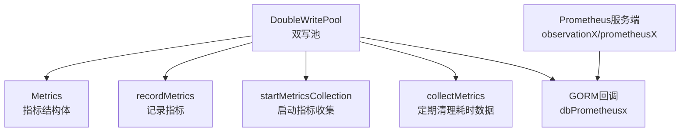
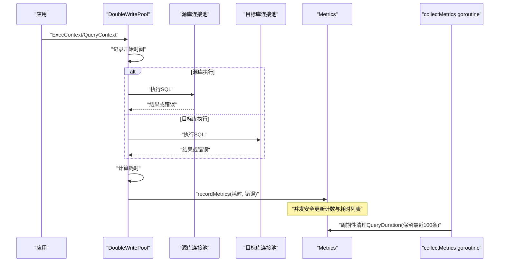
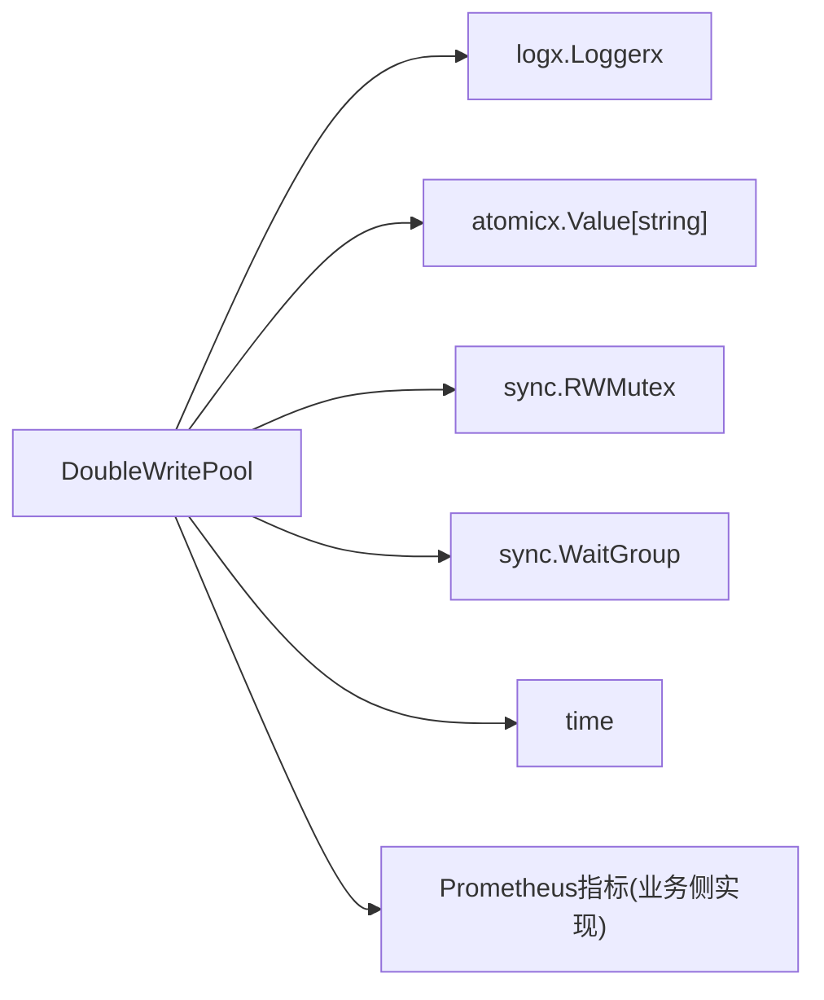
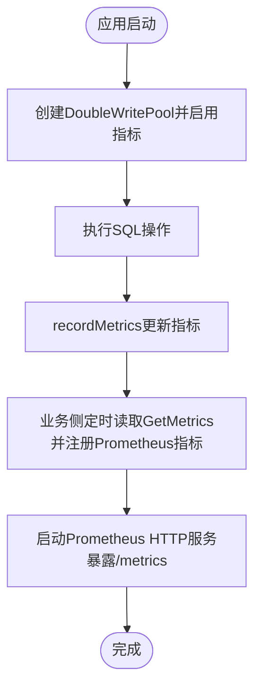

# 指标监控

<cite>
**本文引用的文件**
- [double_write_pool.go](file://DBx/mysqlX/gormx/dbMovex/myMovex/doubleWritePoolx/double_write_pool.go)
- [prometheusGormBuild.go](file://DBx/mysqlX/gormx/dbPrometheusx/prometheusGormBuild.go)
- [prometheus.go](file://observationX/prometheusX/prometheus.go)
- [myMove_test.go](file://DBx/mysqlX/gormx/dbMovex/myMovex/test/myMove_test.go)
- [help_doc.txt](file://DBx/mysqlX/gormx/dbMovex/myMovex/help_doc.txt)
</cite>

## 目录
1. [简介](#简介)
2. [项目结构](#项目结构)
3. [核心组件](#核心组件)
4. [架构总览](#架构总览)
5. [组件详解](#组件详解)
6. [依赖关系分析](#依赖关系分析)
7. [性能考量](#性能考量)
8. [故障排查指南](#故障排查指南)
9. [结论](#结论)
10. [附录](#附录)

## 简介
本章节聚焦于“双写池指标监控”能力，围绕以下目标展开：
- 解释 Metrics 结构体如何记录双写成功与失败次数（DoubleWriteSuccess、DoubleWriteFailure）以及查询耗时（QueryDuration）
- 说明 recordMetrics 方法如何在每次 SQL 执行后更新这些指标，并通过 sync.RWMutex 保证并发安全
- 说明 startMetricsCollection 和 collectMetrics 方法如何启动一个 goroutine 定期清理过期的耗时数据（保留最近 100 条）
- 讨论如何将这些指标暴露给 Prometheus 等监控系统，并提供配置 EnableMetrics 参数启用监控的示例

## 项目结构
与指标监控直接相关的代码集中在双写池实现文件中，同时提供了通用的 Prometheus 指标构建工具与演示示例。

图表来源
- [double_write_pool.go](file://DBx/mysqlX/gormx/dbMovex/myMovex/doubleWritePoolx/double_write_pool.go#L52-L107)
- [prometheusGormBuild.go](file://DBx/mysqlX/gormx/dbPrometheusx/prometheusGormBuild.go#L1-L101)
- [prometheus.go](file://observationX/prometheusX/prometheus.go#L1-L15)

章节来源
- [double_write_pool.go](file://DBx/mysqlX/gormx/dbMovex/myMovex/doubleWritePoolx/double_write_pool.go#L52-L107)
- [prometheusGormBuild.go](file://DBx/mysqlX/gormx/dbPrometheusx/prometheusGormBuild.go#L1-L101)
- [prometheus.go](file://observationX/prometheusX/prometheus.go#L1-L15)

## 核心组件
- Metrics 结构体：承载双写成功/失败计数与查询耗时列表
- recordMetrics：在每次 SQL 执行后更新指标
- startMetricsCollection/collectMetrics：后台 goroutine 定期清理 QueryDuration
- GetMetrics：并发安全地读取当前指标快照
- DoubleWriteConfig.EnableMetrics：开关指标收集

章节来源
- [double_write_pool.go](file://DBx/mysqlX/gormx/dbMovex/myMovex/doubleWritePoolx/double_write_pool.go#L52-L107)
- [double_write_pool.go](file://DBx/mysqlX/gormx/dbMovex/myMovex/doubleWritePoolx/double_write_pool.go#L148-L153)
- [double_write_pool.go](file://DBx/mysqlX/gormx/dbMovex/myMovex/doubleWritePoolx/double_write_pool.go#L431-L448)
- [double_write_pool.go](file://DBx/mysqlX/gormx/dbMovex/myMovex/doubleWritePoolx/double_write_pool.go#L100-L107)

## 架构总览
双写池在执行 SQL 时记录指标，并在后台定期清理历史耗时数据；同时提供通用的 Prometheus 指标构建器，可用于对 GORM 生命周期事件进行观测。

图表来源
- [double_write_pool.go](file://DBx/mysqlX/gormx/dbMovex/myMovex/doubleWritePoolx/double_write_pool.go#L256-L379)
- [double_write_pool.go](file://DBx/mysqlX/gormx/dbMovex/myMovex/doubleWritePoolx/double_write_pool.go#L431-L469)

## 组件详解

### Metrics 结构体与指标含义
- DoubleWriteSuccess：双写执行成功的次数累计
- DoubleWriteFailure：双写执行失败的次数累计
- QueryDuration：最近若干次 SQL 执行耗时（time.Duration 列表）

章节来源
- [double_write_pool.go](file://DBx/mysqlX/gormx/dbMovex/myMovex/doubleWritePoolx/double_write_pool.go#L52-L57)

### recordMetrics：并发安全地更新指标
- 调用时机：在 ExecContext、QueryContext、QueryRowContext 的 defer 中统一记录
- 并发保护：使用 sync.RWMutex 保证多 goroutine 下对指标的互斥访问
- 更新策略：
  - 若 err 为空：DoubleWriteSuccess++
  - 否则：DoubleWriteFailure++
  - 仅在 QueryDuration 长度小于阈值时追加新耗时，避免无限增长

章节来源
- [double_write_pool.go](file://DBx/mysqlX/gormx/dbMovex/myMovex/doubleWritePoolx/double_write_pool.go#L256-L379)
- [double_write_pool.go](file://DBx/mysqlX/gormx/dbMovex/myMovex/doubleWritePoolx/double_write_pool.go#L431-L448)

### startMetricsCollection 与 collectMetrics：定期清理耗时数据
- 启动条件：当 DoubleWriteConfig.EnableMetrics 为 true 时创建 goroutine
- 运行机制：每 5 分钟触发一次，将 QueryDuration 保留最近 100 条，其余丢弃
- 停止机制：通过 context 控制 goroutine 退出，并在 Close 中等待其完成

章节来源
- [double_write_pool.go](file://DBx/mysqlX/gormx/dbMovex/myMovex/doubleWritePoolx/double_write_pool.go#L60-L88)
- [double_write_pool.go](file://DBx/mysqlX/gormx/dbMovex/myMovex/doubleWritePoolx/double_write_pool.go#L100-L107)
- [double_write_pool.go](file://DBx/mysqlX/gormx/dbMovex/myMovex/doubleWritePoolx/double_write_pool.go#L450-L469)

### GetMetrics：并发安全读取指标
- 使用 RWMutex 的读锁，确保在读取期间不会与其他写操作冲突
- 返回当前 Metrics 的快照指针，调用方可据此导出指标

章节来源
- [double_write_pool.go](file://DBx/mysqlX/gormx/dbMovex/myMovex/doubleWritePoolx/double_write_pool.go#L148-L153)

### 暴露给 Prometheus 的方式与建议
- 当前仓库未提供直接将 DoubleWritePool 指标注册为 Prometheus 指标的内置实现
- 可采用两种常见做法：
  1) 自定义 Prometheus 指标（如 Counter/Gauge/Histogram），在业务侧定时从 GetMetrics 读取并上报
  2) 使用通用 GORM 回调指标构建器，对不同类型的 SQL（Create/Query/Raw/Update/Delete/Row）进行观测

章节来源
- [prometheusGormBuild.go](file://DBx/mysqlX/gormx/dbPrometheusx/prometheusGormBuild.go#L1-L101)
- [prometheus.go](file://observationX/prometheusX/prometheus.go#L1-L15)

### 启用指标的配置示例
- 在创建双写池时，将 DoubleWriteConfig.EnableMetrics 设为 true 即可启用指标收集与后台清理 goroutine
- 示例路径：测试用例中展示了如何创建双写池并使用它进行数据库操作

章节来源
- [double_write_pool.go](file://DBx/mysqlX/gormx/dbMovex/myMovex/doubleWritePoolx/double_write_pool.go#L60-L88)
- [myMove_test.go](file://DBx/mysqlX/gormx/dbMovex/myMovex/test/myMove_test.go#L616-L624)

## 依赖关系分析
- DoubleWritePool 依赖：
  - 日志：logx.Loggerx
  - 原子值：atomicx.Value[string]（用于线程安全的模式切换）
  - 并发：sync.RWMutex（读写锁）、sync.WaitGroup（goroutine 等待）
  - 时间：time（耗时统计、定时器）
- 指标导出依赖：
  - Prometheus 客户端库（github.com/prometheus/client_golang/prometheus）
  - Prometheus HTTP 处理器（promhttp.Handler）

图表来源
- [double_write_pool.go](file://DBx/mysqlX/gormx/dbMovex/myMovex/doubleWritePoolx/double_write_pool.go#L10-L20)
- [double_write_pool.go](file://DBx/mysqlX/gormx/dbMovex/myMovex/doubleWritePoolx/double_write_pool.go#L36-L51)

章节来源
- [double_write_pool.go](file://DBx/mysqlX/gormx/dbMovex/myMovex/doubleWritePoolx/double_write_pool.go#L10-L20)
- [double_write_pool.go](file://DBx/mysqlX/gormx/dbMovex/myMovex/doubleWritePoolx/double_write_pool.go#L36-L51)

## 性能考量
- 指标更新开销：recordMetrics 在每次 SQL 执行后进行原子计数与切片追加，属于轻量级操作
- 内存占用：QueryDuration 默认保留最近 1000 条（记录阶段），collectMetrics 每 5 分钟清理为最近 100 条，避免长期累积导致内存膨胀
- 并发安全：读写分离的 RWMutex 降低锁竞争，读多写少场景友好
- 后台清理频率：5 分钟一次，兼顾及时性与系统负载

章节来源
- [double_write_pool.go](file://DBx/mysqlX/gormx/dbMovex/myMovex/doubleWritePoolx/double_write_pool.go#L431-L469)
- [double_write_pool.go](file://DBx/mysqlX/gormx/dbMovex/myMovex/doubleWritePoolx/double_write_pool.go#L445-L448)

## 故障排查指南
- 指标未更新
  - 检查 DoubleWriteConfig.EnableMetrics 是否为 true
  - 确认 SQL 执行路径确实进入 ExecContext/QueryContext/QueryRowContext
- 并发读取异常
  - 确保通过 GetMetrics 获取指标快照，避免直接共享可变结构
- 后台清理未生效
  - 检查是否调用了 Close 并等待 goroutine 退出
  - 确认 collectMetrics 的 ticker 是否运行且未被取消
- Prometheus 导出问题
  - 确认已正确注册指标并暴露 /metrics 接口
  - 对比通用 GORM 回调指标构建器的标签维度，确保与业务期望一致

章节来源
- [double_write_pool.go](file://DBx/mysqlX/gormx/dbMovex/myMovex/doubleWritePoolx/double_write_pool.go#L60-L88)
- [double_write_pool.go](file://DBx/mysqlX/gormx/dbMovex/myMovex/doubleWritePoolx/double_write_pool.go#L148-L153)
- [double_write_pool.go](file://DBx/mysqlX/gormx/dbMovex/myMovex/doubleWritePoolx/double_write_pool.go#L450-L469)
- [prometheus.go](file://observationX/prometheusX/prometheus.go#L1-L15)

## 结论
- 双写池通过 Metrics 结构体与 recordMetrics 实现了对双写成功/失败次数与查询耗时的轻量级观测
- 通过 sync.RWMutex 保障并发安全，通过 collectMetrics 定期清理历史耗时，维持可观测性的可控成本
- 指标导出可结合通用 Prometheus 工具链完成，仓库提供了 GORM 回调指标构建器与 Prometheus HTTP 服务示例，便于快速落地

## 附录

### 指标导出流程（概念示意）

[本图为概念示意，不对应具体源码文件，故无图表来源]

### 配置 EnableMetrics 的示例路径
- 在测试用例中，展示了如何创建双写池并使用它进行数据库操作，可参考该模式在业务中启用指标收集

章节来源
- [myMove_test.go](file://DBx/mysqlX/gormx/dbMovex/myMovex/test/myMove_test.go#L616-L624)
- [help_doc.txt](file://DBx/mysqlX/gormx/dbMovex/myMovex/help_doc.txt#L1-L18)