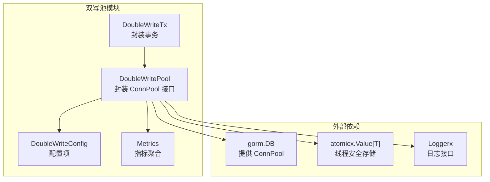
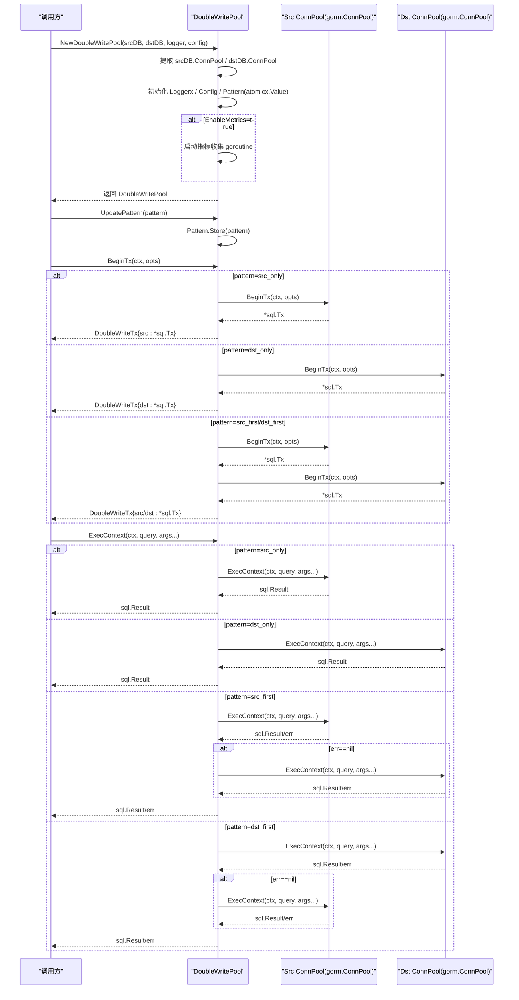
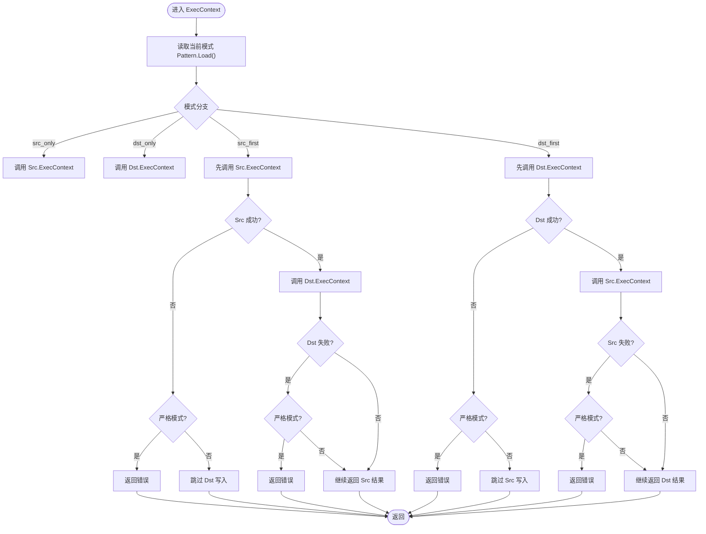
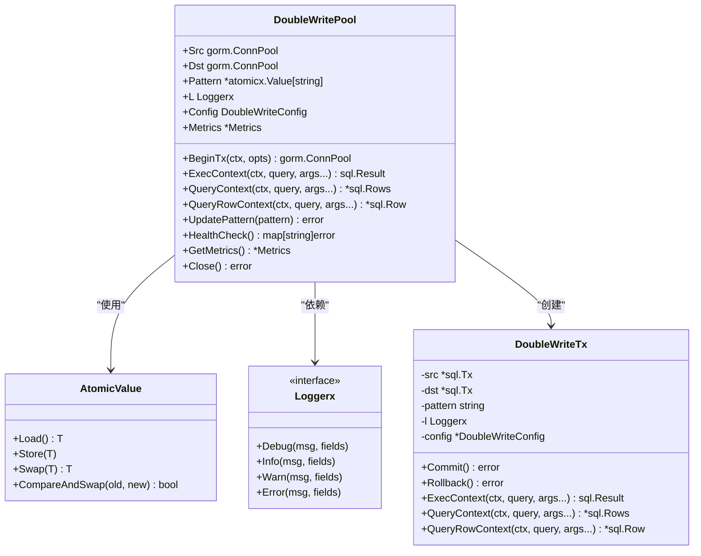

# 连接池管理

<cite>
**本文引用的文件列表**
- [double_write_pool.go](file://DBx/mysqlX/gormx/dbMovex/myMovex/doubleWritePoolx/double_write_pool.go)
- [atomic.go](file://syncX/atomicx/atomic.go)
- [types.go](file://logx/types.go)
- [myMove_test.go](file://DBx/mysqlX/gormx/dbMovex/myMovex/test/myMove_test.go)
- [README.md](file://README.md)
</cite>

## 目录
1. [简介](#简介)
2. [项目结构](#项目结构)
3. [核心组件](#核心组件)
4. [架构总览](#架构总览)
5. [组件详解](#组件详解)
6. [依赖关系分析](#依赖关系分析)
7. [性能考量](#性能考量)
8. [故障排查指南](#故障排查指南)
9. [结论](#结论)
10. [附录](#附录)

## 简介
本篇文档围绕“双写池连接池管理”展开，系统阐述如何封装 GORM 的 ConnPool 接口，统一管理源数据库（Src）与目标数据库（Dst）的连接与事务，提供多种双写模式（仅源库、仅目标库、源库优先、目标库优先），并支持健康检查、重试策略、指标采集与优雅关闭。文档特别聚焦 NewDoubleWritePool 的初始化流程、日志记录器注入、配置参数 DoubleWriteConfig 的作用、线程安全的模式存储 atomicx.Value 的使用，以及 Close 方法如何通过 context.CancelFunc 安全关闭并等待指标收集 goroutine 退出。

## 项目结构
双写池位于 DBx/mysqlX/gormx/dbMovex/myMovex/doubleWritePoolx 目录，核心实现为 double_write_pool.go；同时依赖：
- syncX/atomicx/atomic.go：提供线程安全的模式存储
- logx/types.go：抽象日志接口 Loggerx
- DBx/mysqlX/gormx/dbMovex/myMovex/test/myMove_test.go：演示如何创建与使用双写池
- README.md：提供使用示例与概览

图表来源
- [double_write_pool.go](file://DBx/mysqlX/gormx/dbMovex/myMovex/doubleWritePoolx/double_write_pool.go#L36-L88)
- [atomic.go](file://syncX/atomicx/atomic.go#L12-L55)
- [types.go](file://logx/types.go#L1-L25)

章节来源
- [double_write_pool.go](file://DBx/mysqlX/gormx/dbMovex/myMovex/doubleWritePoolx/double_write_pool.go#L36-L88)
- [README.md](file://README.md#L41-L48)

## 核心组件
- DoubleWritePool：封装 GORM 的 ConnPool 接口，统一管理 Src/Dst 连接，暴露 BeginTx、ExecContext、QueryContext、QueryRowContext 等方法，并支持健康检查、更新模式、指标采集与关闭。
- DoubleWriteTx：封装事务，按不同模式分别提交/回滚 Src/Dst 事务，严格模式下失败即中断。
- DoubleWriteConfig：配置项，包含 StrictMode、RetryAttempts、EnableMetrics。
- Metrics：运行时指标，记录成功/失败次数与最近查询耗时序列。
- atomicx.Value：线程安全存储当前双写模式字符串，支持 Load/Store/Swap/CompareAndSwap。
- Loggerx：日志接口，用于记录关键事件与错误。

章节来源
- [double_write_pool.go](file://DBx/mysqlX/gormx/dbMovex/myMovex/doubleWritePoolx/double_write_pool.go#L29-L57)
- [atomic.go](file://syncX/atomicx/atomic.go#L12-L55)
- [types.go](file://logx/types.go#L1-L25)

## 架构总览
双写池通过 NewDoubleWritePool 接收两个 *gorm.DB 实例，分别提取其 ConnPool 作为 Src/Dst，注入 Loggerx、DoubleWriteConfig 与 atomicx.Value 模式存储。根据配置决定是否启动指标收集 goroutine。执行层面对写操作提供重试与严格模式控制，读操作按当前模式路由至 Src 或 Dst。事务层面提供四种模式的提交/回滚策略。

图表来源
- [double_write_pool.go](file://DBx/mysqlX/gormx/dbMovex/myMovex/doubleWritePoolx/double_write_pool.go#L59-L88)
- [double_write_pool.go](file://DBx/mysqlX/gormx/dbMovex/myMovex/doubleWritePoolx/double_write_pool.go#L155-L249)
- [double_write_pool.go](file://DBx/mysqlX/gormx/dbMovex/myMovex/doubleWritePoolx/double_write_pool.go#L256-L349)

## 组件详解

### NewDoubleWritePool 初始化流程
- 输入：两个 *gorm.DB 实例、Loggerx、可选 DoubleWriteConfig
- 步骤：
  - 解析配置：默认 StrictMode=false、RetryAttempts=1、EnableMetrics=false；若传入配置则覆盖
  - 创建 context.WithCancel，用于后续优雅关闭
  - 从 srcDB/ dstDB 提取 ConnPool 赋予 Src/Dst 字段
  - 注入 Loggerx、初始化 Pattern 为原子值（初始值为 src_only）
  - 初始化 Metrics 结构体
  - 若 EnableMetrics=true，则启动指标收集 goroutine 并加入 WaitGroup
- 输出：返回 *DoubleWritePool

章节来源
- [double_write_pool.go](file://DBx/mysqlX/gormx/dbMovex/myMovex/doubleWritePoolx/double_write_pool.go#L59-L88)

### 日志记录器（Loggerx）与配置参数（DoubleWriteConfig）
- Loggerx：用于记录模式变更、事务提交/回滚失败、双写写入失败等事件，接口定义见 logx/types.go
- DoubleWriteConfig：
  - StrictMode：严格模式，任一失败立即返回错误
  - RetryAttempts：写操作重试次数（指数退避）
  - EnableMetrics：是否启用指标收集

章节来源
- [double_write_pool.go](file://DBx/mysqlX/gormx/dbMovex/myMovex/doubleWritePoolx/double_write_pool.go#L29-L34)
- [types.go](file://logx/types.go#L1-L25)

### 线程安全的模式存储（atomicx.Value）
- 使用 atomicx.NewValueOf 初始化 Pattern，初始值为 "src_only"
- UpdatePattern 通过 Pattern.Store 切换模式，支持 src_only、src_first、dst_first、dst_only
- 执行路径在各方法中通过 Pattern.Load 读取当前模式，保证并发安全

章节来源
- [double_write_pool.go](file://DBx/mysqlX/gormx/dbMovex/myMovex/doubleWritePoolx/double_write_pool.go#L76-L119)
- [atomic.go](file://syncX/atomicx/atomic.go#L12-L55)

### Close 方法与优雅关闭
- Close 内部：
  - 调用 cancel 触发 context.Done，通知指标收集 goroutine 退出
  - 若 EnableMetrics=true，等待 metricsWg 完成，确保指标 goroutine 安全退出
  - 记录日志“双写池已关闭”
- 该设计避免 goroutine 泄漏，保证资源回收顺序正确

章节来源
- [double_write_pool.go](file://DBx/mysqlX/gormx/dbMovex/myMovex/doubleWritePoolx/double_write_pool.go#L90-L98)
- [double_write_pool.go](file://DBx/mysqlX/gormx/dbMovex/myMovex/doubleWritePoolx/double_write_pool.go#L100-L107)

### 双写模式与执行策略
- 模式常量：
  - src_only：仅写源库
  - dst_only：仅写目标库
  - src_first：先写源库，再写目标库；严格模式下任一失败即返回
  - dst_first：先写目标库，再写源库；严格模式下任一失败即返回
- 写操作（ExecContext）：
  - 源库优先：源库失败且严格模式则直接返回；非严格模式下不尝试目标库
  - 目标库优先：目标库失败且严格模式则直接返回；非严格模式下不尝试源库
  - 重试：按 RetryAttempts 指数退避重试
- 读操作（QueryContext/QueryRowContext）：
  - 源库优先：优先走 Src；否则走 Dst
  - 目标库优先：优先走 Dst；否则走 Src
- 事务（BeginTx/Commit/Rollback）：
  - 源库优先：先提交/回滚 Src；若提交失败，回滚 Dst；严格模式下 Dst 提交失败也返回错误
  - 目标库优先：先提交/回滚 Dst；若提交失败，回滚 Src；严格模式下 Src 提交失败也返回错误

图表来源
- [double_write_pool.go](file://DBx/mysqlX/gormx/dbMovex/myMovex/double_write_pool.go#L256-L349)

章节来源
- [double_write_pool.go](file://DBx/mysqlX/gormx/dbMovex/myMovex/doubleWritePoolx/double_write_pool.go#L256-L349)
- [double_write_pool.go](file://DBx/mysqlX/gormx/dbMovex/myMovex/doubleWritePoolx/double_write_pool.go#L409-L429)

### 事务封装（DoubleWriteTx）
- Commit/Rollback：
  - 源库优先：先提交/回滚 Src；若失败，回滚/提交另一端；严格模式下另一端失败也返回错误
  - 目标库优先：先提交/回滚 Dst；若失败，回滚/提交另一端；严格模式下另一端失败也返回错误
- ExecContext/QueryContext/QueryRowContext：
  - 按当前模式路由至 Src 或 Dst；若对应连接为 nil，返回错误或空 Row

章节来源
- [double_write_pool.go](file://DBx/mysqlX/gormx/dbMovex/myMovex/doubleWritePoolx/double_write_pool.go#L477-L708)

### 指标采集与健康检查
- 指标采集：
  - recordMetrics：在每次 ExecContext/QueryContext 后记录成功/失败与耗时
  - collectMetrics：定期清理 QueryDuration 最近 100 条，周期 5 分钟
- 健康检查：
  - HealthCheck：对 Src/Dst 分别调用 PingContext，超时 5 秒；若连接池为 nil 或 Ping 失败，返回错误

章节来源
- [double_write_pool.go](file://DBx/mysqlX/gormx/dbMovex/myMovex/doubleWritePoolx/double_write_pool.go#L121-L146)
- [double_write_pool.go](file://DBx/mysqlX/gormx/dbMovex/myMovex/doubleWritePoolx/double_write_pool.go#L431-L469)

### 使用示例（创建与关闭）
- 创建双写池：
  - 参考测试用例中的初始化方式，传入两个 *gorm.DB 与 Loggerx，可选配置
  - 将双写池作为 gorm 的 Conn 提供给新的 *gorm.DB 使用
- 关闭双写池：
  - 调用 Close，内部触发取消并等待指标 goroutine 退出

章节来源
- [myMove_test.go](file://DBx/mysqlX/gormx/dbMovex/myMovex/test/myMove_test.go#L601-L623)
- [myMove_test.go](file://DBx/mysqlX/gormx/dbMovex/myMovex/test/myMove_test.go#L616-L623)
- [README.md](file://README.md#L41-L48)

## 依赖关系分析
- DoubleWritePool 依赖：
  - gorm.DB.ConnPool：统一抽象为 gorm.ConnPool，屏蔽底层驱动差异
  - atomicx.Value：线程安全存储模式
  - Loggerx：日志输出
  - DoubleWriteConfig：行为控制
  - Metrics：运行时指标
- DoubleWriteTx 依赖 DoubleWritePool 的配置与日志
- 测试用例依赖 gin、gorm、kafka 生产者等，演示如何将 DoubleWritePool 注入 gorm

图表来源
- [double_write_pool.go](file://DBx/mysqlX/gormx/dbMovex/myMovex/doubleWritePoolx/double_write_pool.go#L36-L88)
- [double_write_pool.go](file://DBx/mysqlX/gormx/dbMovex/myMovex/doubleWritePoolx/double_write_pool.go#L477-L708)
- [atomic.go](file://syncX/atomicx/atomic.go#L12-L55)
- [types.go](file://logx/types.go#L1-L25)

## 性能考量
- 指数退避重试：execWithRetry 采用 i+1 的时间间隔，降低瞬时压力
- 指标采样限制：QueryDuration 最多保留 1000 条，collectMetrics 周期清理至 100 条，避免内存膨胀
- 严格模式：在关键路径上减少不必要的目标库写入，提升吞吐
- 事务提交顺序：先提交主库，失败即回滚另一端，避免半写状态

[本节为通用性能建议，无需特定文件来源]

## 故障排查指南
- 常见错误
  - 未知模式：UpdatePattern 传入非法值
  - 不支持 Prepare：双写池不支持 PrepareContext
  - 源/目标库为空：Src/Dst 为 nil 导致操作失败
- 健康检查
  - 使用 HealthCheck 快速定位 Src/Dst Ping 失败原因
- 严格模式
  - 在 src_first/dst_first 下，任一端失败即返回错误；确认业务容忍度
- 指标核对
  - 通过 GetMetrics 查看 DoubleWriteSuccess/DoubleWriteFailure 与 QueryDuration，结合日志定位异常

章节来源
- [double_write_pool.go](file://DBx/mysqlX/gormx/dbMovex/myMovex/doubleWritePoolx/double_write_pool.go#L22-L27)
- [double_write_pool.go](file://DBx/mysqlX/gormx/dbMovex/myMovex/doubleWritePoolx/double_write_pool.go#L121-L146)
- [double_write_pool.go](file://DBx/mysqlX/gormx/dbMovex/myMovex/doubleWritePoolx/double_write_pool.go#L251-L256)

## 结论
双写池通过封装 GORM 的 ConnPool 接口，实现了对 Src/Dst 的统一管理与多模式双写策略，配合严格模式、重试与指标采集，满足迁移与双写场景下的可靠性与可观测性需求。初始化时注入 Loggerx、DoubleWriteConfig 与 atomicx.Value，使模式切换与日志记录具备线程安全性；Close 方法通过 context.CancelFunc 与 WaitGroup 实现优雅关闭，保障资源回收。

[本节为总结性内容，无需特定文件来源]

## 附录

### API 一览（方法与用途）
- NewDoubleWritePool：创建双写池
- UpdatePattern：更新双写模式
- BeginTx：开始事务（返回 DoubleWriteTx）
- ExecContext：执行写操作（含重试与严格模式）
- QueryContext/QueryRowContext：执行读操作（按模式路由）
- HealthCheck：健康检查
- GetMetrics：获取指标
- Close：优雅关闭

章节来源
- [double_write_pool.go](file://DBx/mysqlX/gormx/dbMovex/myMovex/doubleWritePoolx/double_write_pool.go#L59-L88)
- [double_write_pool.go](file://DBx/mysqlX/gormx/dbMovex/myMovex/doubleWritePoolx/double_write_pool.go#L110-L146)
- [double_write_pool.go](file://DBx/mysqlX/gormx/dbMovex/myMovex/doubleWritePoolx/double_write_pool.go#L155-L349)
- [double_write_pool.go](file://DBx/mysqlX/gormx/dbMovex/myMovex/doubleWritePoolx/double_write_pool.go#L477-L708)
- [double_write_pool.go](file://DBx/mysqlX/gormx/dbMovex/myMovex/doubleWritePoolx/double_write_pool.go#L90-L98)

### 示例参考路径
- 创建双写池与注入 gorm.DB：[myMove_test.go](file://DBx/mysqlX/gormx/dbMovex/myMovex/test/myMove_test.go#L601-L623)
- 使用双写池执行写入：[myMove_test.go](file://DBx/mysqlX/gormx/dbMovex/myMovex/test/myMove_test.go#L121-L283)