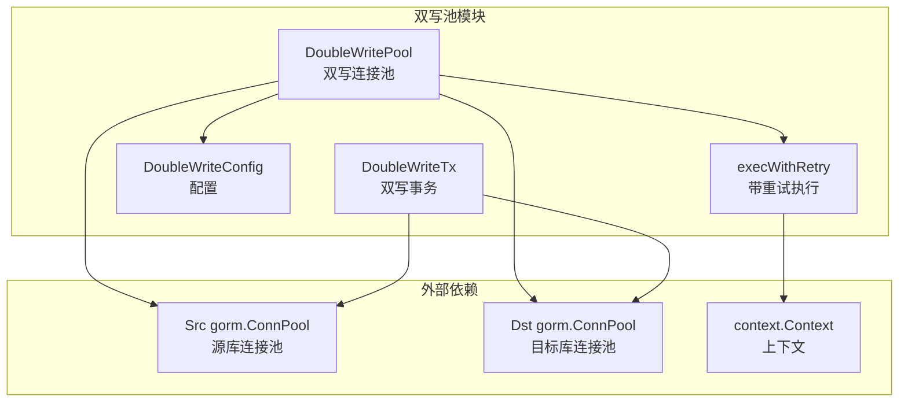
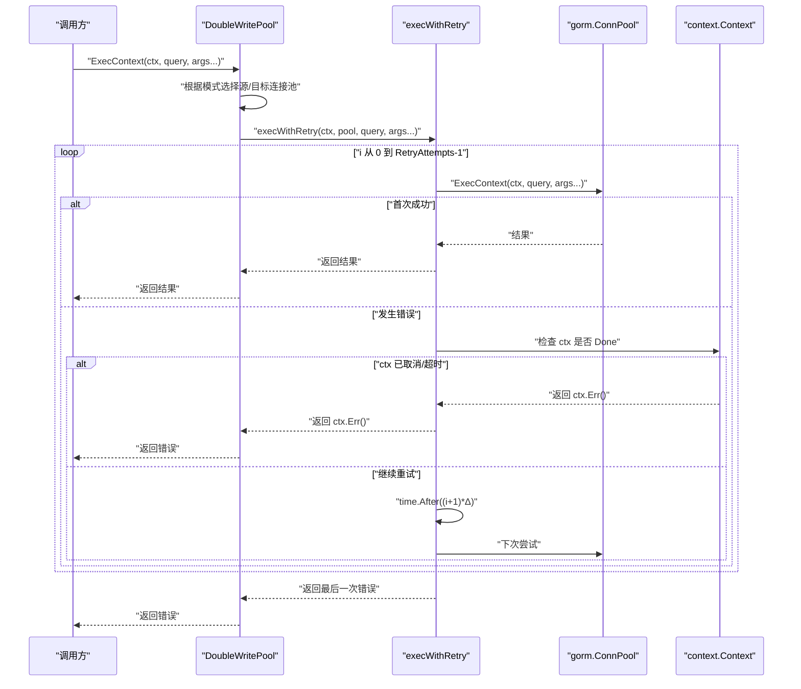
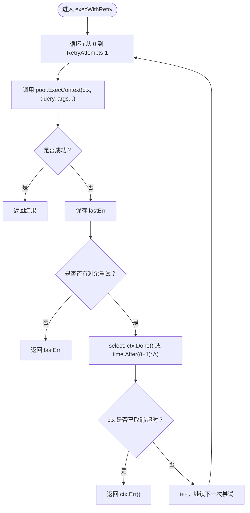
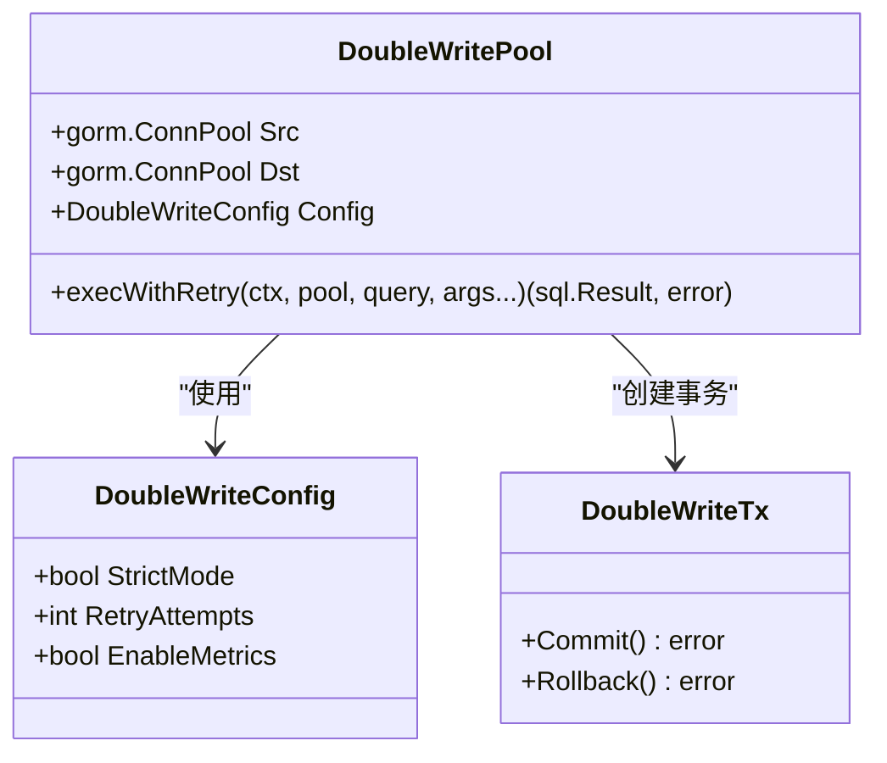

# 重试机制

<cite>
**本文引用的文件**
- [double_write_pool.go](file://DBx/mysqlX/gormx/dbMovex/myMovex/doubleWritePoolx/double_write_pool.go)
- [myMove_test.go](file://DBx/mysqlX/gormx/dbMovex/myMovex/test/myMove_test.go)
- [help_doc.txt](file://DBx/mysqlX/gormx/dbMovex/myMovex/help_doc.txt)
</cite>

## 目录
1. [简介](#简介)
2. [项目结构](#项目结构)
3. [核心组件](#核心组件)
4. [架构总览](#架构总览)
5. [详细组件分析](#详细组件分析)
6. [依赖分析](#依赖分析)
7. [性能考量](#性能考量)
8. [故障排查指南](#故障排查指南)
9. [结论](#结论)
10. [附录](#附录)

## 简介
本文件围绕“双写池”的重试机制展开，重点解析 execWithRetry 函数如何实现带指数退避的重试逻辑，说明其如何依据 DoubleWriteConfig 中的 RetryAttempts 参数进行循环重试，并在每次重试之间使用 time.After 进行延迟；同时阐述该机制如何与 context.Context 集成以支持超时和取消。文档还提供配置不同重试次数的示例，讨论重试策略对系统可用性与数据一致性的影响，以及在高并发场景下的性能考量。

## 项目结构
本次分析聚焦于数据库双写模块，核心位于 DBx/mysqlX/gormx/dbMovex/myMovex/doubleWritePoolx 目录，关键文件为 double_write_pool.go，其中包含 DoubleWritePool、DoubleWriteTx、DoubleWriteConfig 以及重试执行函数 execWithRetry 的实现。测试用例位于 DBx/mysqlX/gormx/dbMovex/myMovex/test/myMove_test.go，帮助理解重试行为与模式切换。

图表来源
- [double_write_pool.go](file://DBx/mysqlX/gormx/dbMovex/myMovex/doubleWritePoolx/double_write_pool.go#L29-L88)
- [double_write_pool.go](file://DBx/mysqlX/gormx/dbMovex/myMovex/doubleWritePoolx/double_write_pool.go#L409-L429)

章节来源
- [double_write_pool.go](file://DBx/mysqlX/gormx/dbMovex/myMovex/doubleWritePoolx/double_write_pool.go#L29-L88)
- [double_write_pool.go](file://DBx/mysqlX/gormx/dbMovex/myMovex/doubleWritePoolx/double_write_pool.go#L409-L429)

## 核心组件
- DoubleWriteConfig：包含 StrictMode、RetryAttempts、EnableMetrics 三个关键字段，分别控制严格模式、重试次数、是否启用指标。
- DoubleWritePool：封装源库与目标库连接池，负责模式切换、事务管理、查询与写入执行，并内置 execWithRetry。
- DoubleWriteTx：封装事务提交/回滚逻辑，按模式分别作用于源库或目标库。
- execWithRetry：核心重试函数，按 RetryAttempts 循环执行，结合 time.After 实现指数退避，并在 ctx 超时或取消时提前返回。

章节来源
- [double_write_pool.go](file://DBx/mysqlX/gormx/dbMovex/myMovex/doubleWritePoolx/double_write_pool.go#L29-L88)
- [double_write_pool.go](file://DBx/mysqlX/gormx/dbMovex/myMovex/doubleWritePoolx/double_write_pool.go#L409-L429)

## 架构总览
双写池在写入路径上，根据当前模式（仅源库、仅目标库、源库优先、目标库优先）决定执行顺序与回退策略。execWithRetry 在每次写入前被调用，若底层连接池返回错误，则按 RetryAttempts 进行重试，延迟采用 i+1 的线性倍数（单位为固定毫秒级），并在每次重试前检查 ctx 是否已取消或超时。

图表来源
- [double_write_pool.go](file://DBx/mysqlX/gormx/dbMovex/myMovex/doubleWritePoolx/double_write_pool.go#L256-L350)
- [double_write_pool.go](file://DBx/mysqlX/gormx/dbMovex/myMovex/doubleWritePoolx/double_write_pool.go#L409-L429)

## 详细组件分析

### execWithRetry 重试逻辑
- 循环次数：由 DoubleWriteConfig.RetryAttempts 决定，循环 i 从 0 到 RetryAttempts-1。
- 成功条件：当某次调用返回 nil 错误时，立即返回该结果。
- 失败处理：记录 lastErr，并在 i < RetryAttempts-1 时进行延迟重试。
- 指数退避：延迟使用 time.After((i+1)*Δ)，其中 Δ 为固定步长（例如 100ms）。这实现了“线性递增”的退避，而非严格的指数增长。
- 上下文集成：在每次重试前检查 ctx.Done()，若 ctx 已取消或超时，立即返回 ctx.Err()，避免无谓等待。

图表来源
- [double_write_pool.go](file://DBx/mysqlX/gormx/dbMovex/myMovex/doubleWritePoolx/double_write_pool.go#L409-L429)

章节来源
- [double_write_pool.go](file://DBx/mysqlX/gormx/dbMovex/myMovex/doubleWritePoolx/double_write_pool.go#L409-L429)

### 与 DoubleWriteConfig 的关系
- RetryAttempts：控制重试次数上限。例如设置为 3，则最多尝试 3 次（含首次）。
- StrictMode：影响双写模式下的错误传播与回退策略（例如源库失败时是否继续写目标库，或严格模式下直接返回错误）。
- EnableMetrics：控制是否启用指标采集与清理。

章节来源
- [double_write_pool.go](file://DBx/mysqlX/gormx/dbMovex/myMovex/doubleWritePoolx/double_write_pool.go#L29-L88)
- [double_write_pool.go](file://DBx/mysqlX/gormx/dbMovex/myMovex/doubleWritePoolx/double_write_pool.go#L156-L249)

### 与 context.Context 的集成
- 在每次重试前，execWithRetry 通过 select 监听 ctx.Done() 与 time.After 的竞态，确保在 ctx 超时或取消时能及时退出。
- 这使得上层调用可借助 context 控制整体超时时间，避免无限等待。

章节来源
- [double_write_pool.go](file://DBx/mysqlX/gormx/dbMovex/myMovex/doubleWritePoolx/double_write_pool.go#L409-L429)

### 配置不同重试次数的示例
- 默认配置：RetryAttempts 默认为 1，意味着不进行额外重试，仅尝试一次。
- 示例一：将 RetryAttempts 设置为 3，表示最多尝试 3 次（首次 + 两次重试）。
- 示例二：将 RetryAttempts 设置为 0，表示不进行任何重试，直接返回底层错误。
- 示例三：将 RetryAttempts 设置为 5，表示最多尝试 5 次。

章节来源
- [double_write_pool.go](file://DBx/mysqlX/gormx/dbMovex/myMovex/doubleWritePoolx/double_write_pool.go#L60-L88)
- [myMove_test.go](file://DBx/mysqlX/gormx/dbMovex/myMovex/test/myMove_test.go#L616-L623)

### 重试策略对系统可用性与数据一致性的影响
- 可用性提升：在网络抖动或瞬时数据库压力导致的失败时，适度的重试可提高整体成功率，减少因短暂异常导致的业务中断。
- 数据一致性风险：重试可能放大副作用（如重复写入）。建议配合幂等设计与事务隔离级别使用；在严格模式下，源库或目标库任一失败即终止，有助于降低不一致扩散。
- 模式选择：在“源库优先”或“目标库优先”模式下，源库或目标库的失败会影响后续写入路径，需结合 StrictMode 与业务容忍度调整。

章节来源
- [double_write_pool.go](file://DBx/mysqlX/gormx/dbMovex/myMovex/doubleWritePoolx/double_write_pool.go#L256-L350)
- [double_write_pool.go](file://DBx/mysqlX/gormx/dbMovex/myMovex/doubleWritePoolx/double_write_pool.go#L487-L549)

### 高并发场景下的性能考量
- CPU 与 goroutine：execWithRetry 本身为轻量阻塞，但大量并发写入时，重试会带来额外的 goroutine 与系统调用开销。建议合理设置 RetryAttempts，避免过度重试。
- 网络与数据库负载：指数/线性退避会增加等待时间，有助于缓解瞬时峰值压力；但过高的 RetryAttempts 会在高并发下放大排队效应。
- 指标与可观测性：启用 EnableMetrics 可观察成功率与延迟分布，辅助定位热点问题；注意指标收集的内存占用与清理策略。

章节来源
- [double_write_pool.go](file://DBx/mysqlX/gormx/dbMovex/myMovex/doubleWritePoolx/double_write_pool.go#L431-L469)

## 依赖分析
- DoubleWritePool 依赖 gorm.ConnPool 接口，通过 ExecContext/QueryContext/QueryRowContext 执行 SQL。
- execWithRetry 依赖 time.After 与 context.Context，实现延迟与取消。
- 模式切换（UpdatePattern）与事务（DoubleWriteTx）在写入路径上与 execWithRetry 协同工作，共同决定最终的写入行为。

图表来源
- [double_write_pool.go](file://DBx/mysqlX/gormx/dbMovex/myMovex/doubleWritePoolx/double_write_pool.go#L29-L88)
- [double_write_pool.go](file://DBx/mysqlX/gormx/dbMovex/myMovex/doubleWritePoolx/double_write_pool.go#L477-L549)

章节来源
- [double_write_pool.go](file://DBx/mysqlX/gormx/dbMovex/myMovex/doubleWritePoolx/double_write_pool.go#L29-L88)
- [double_write_pool.go](file://DBx/mysqlX/gormx/dbMovex/myMovex/doubleWritePoolx/double_write_pool.go#L477-L549)

## 性能考量
- 重试次数与退避：当前实现采用线性递增的退避（(i+1)*Δ），在极端网络波动下可能不如指数退避平滑。可根据业务场景评估是否需要指数退避。
- 并发与资源：在高并发下，建议结合限流与熔断策略，避免重试放大数据库压力。
- 指标采样：指标数组长度有限制，避免无限增长；定期清理有助于维持可观测性成本可控。

章节来源
- [double_write_pool.go](file://DBx/mysqlX/gormx/dbMovex/myMovex/doubleWritePoolx/double_write_pool.go#L431-L469)

## 故障排查指南
- 重试无效：确认 RetryAttempts 是否大于 0；检查 StrictMode 是否导致早期返回；核对 ctx 是否提前取消或超时。
- 模式切换：通过 UpdatePattern 切换模式后，确认写入路径是否符合预期（仅源库、仅目标库、源库优先、目标库优先）。
- 指标异常：若指标未更新，检查 EnableMetrics 是否开启；关注 collectMetrics 的清理周期与数组长度限制。
- 双写不一致：结合事务提交/回滚逻辑与 StrictMode 行为，定位哪一侧写入失败并触发回退。

章节来源
- [double_write_pool.go](file://DBx/mysqlX/gormx/dbMovex/myMovex/doubleWritePoolx/double_write_pool.go#L110-L119)
- [double_write_pool.go](file://DBx/mysqlX/gormx/dbMovex/myMovex/doubleWritePoolx/double_write_pool.go#L450-L469)
- [double_write_pool.go](file://DBx/mysqlX/gormx/dbMovex/myMovex/doubleWritePoolx/double_write_pool.go#L487-L549)

## 结论
execWithRetry 通过 RetryAttempts 与 time.After 实现了带退避的重试机制，并与 context.Context 集成以支持超时与取消。在实际应用中，应根据业务对可用性与一致性的权衡，合理设置 RetryAttempts 与 StrictMode，并结合限流、熔断与可观测性手段，在高并发场景下获得稳定的服务质量。

## 附录
- 使用建议
  - 默认 RetryAttempts=1 适合对延迟敏感且对偶发失败容忍度较低的场景。
  - 对网络抖动较多的环境，可适度提高 RetryAttempts（如 2~3），并结合 StrictMode 与事务隔离。
  - 在高并发下，建议配合全局限流与熔断策略，避免重试放大数据库压力。
- 参考文档
  - 双写池使用说明与集成步骤见帮助文档。

章节来源
- [help_doc.txt](file://DBx/mysqlX/gormx/dbMovex/myMovex/help_doc.txt#L1-L18)