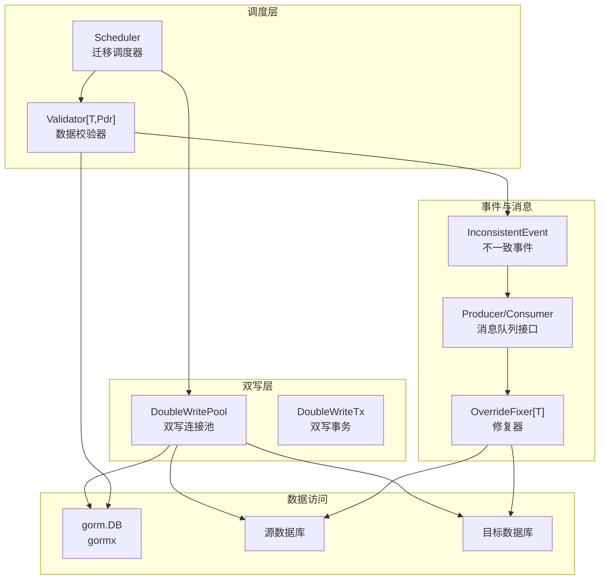
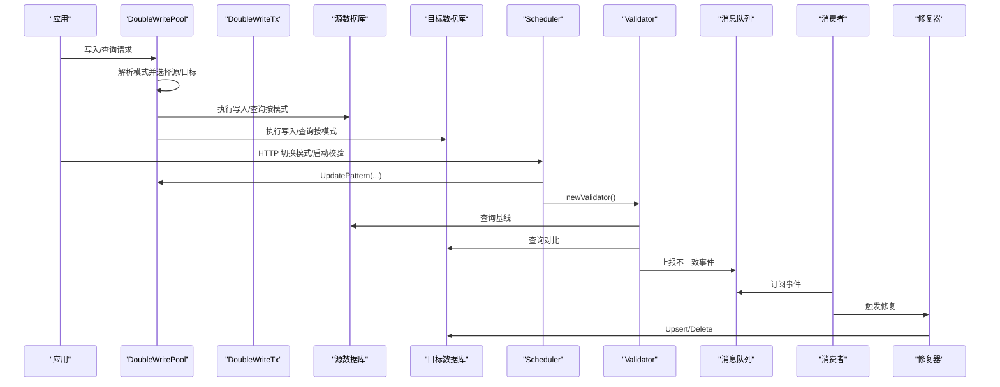
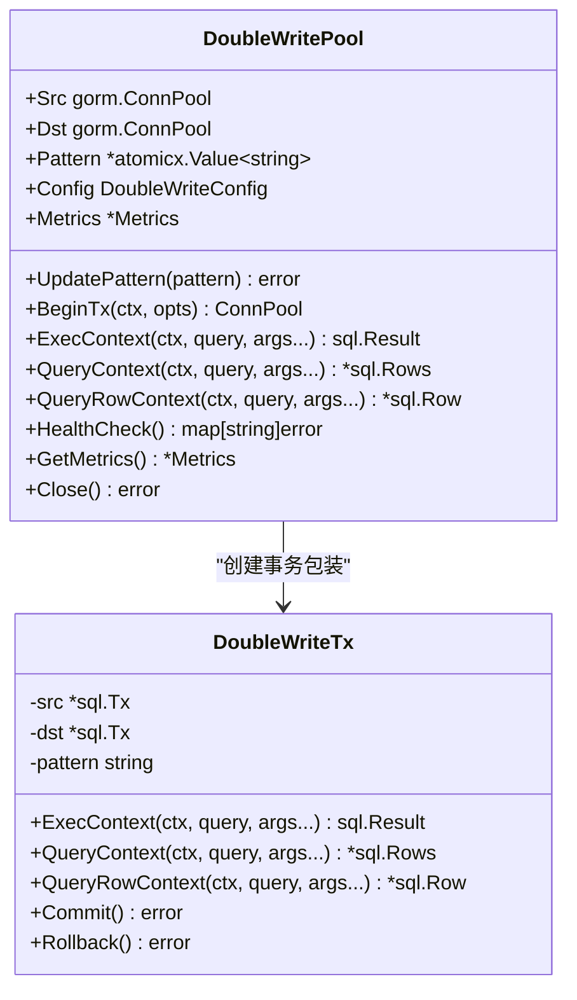
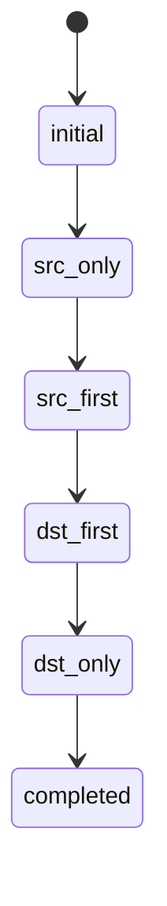
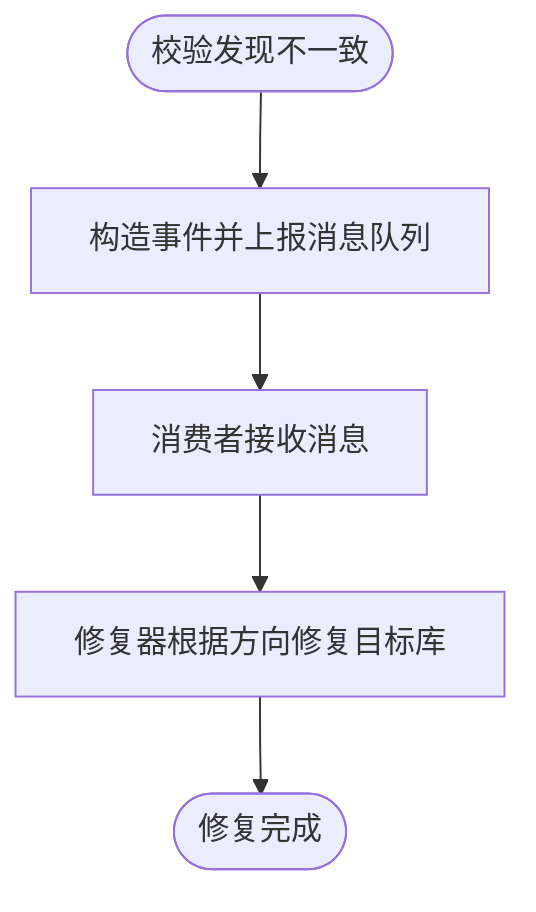
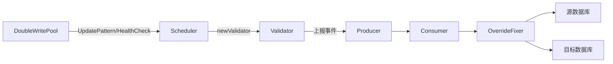

# 数据库迁移

<cite>
**本文引用的文件列表**
- [double_write_pool.go](file://DBx/mysqlX/gormx/dbMovex/myMovex/doubleWritePoolx/double_write_pool.go)
- [scheduler.go](file://DBx/mysqlX/gormx/dbMovex/myMovex/scheduler/scheduler.go)
- [validator.go](file://DBx/mysqlX/gormx/dbMovex/myMovex/validator/validator.go)
- [inconsistent.go](file://DBx/mysqlX/gormx/dbMovex/myMovex/events/inconsistent.go)
- [consumer.go](file://DBx/mysqlX/gormx/dbMovex/myMovex/messageQueue/consumerx/consumer.go)
- [fixer.go](file://DBx/mysqlX/gormx/dbMovex/myMovex/messageQueue/consumerx/fixer.go)
- [myMove_test.go](file://DBx/mysqlX/gormx/dbMovex/myMovex/test/myMove_test.go)
- [help_doc.txt](file://DBx/mysqlX/gormx/dbMovex/myMovex/help_doc.txt)
- [types.go](file://channelx/mqX/types.go)
</cite>

## 目录
1. [简介](#简介)
2. [项目结构](#项目结构)
3. [核心组件](#核心组件)
4. [架构总览](#架构总览)
5. [组件详解](#组件详解)
6. [依赖关系分析](#依赖关系分析)
7. [性能与可靠性](#性能与可靠性)
8. [故障排查指南](#故障排查指南)
9. [结论](#结论)
10. [附录](#附录)

## 简介
本文件围绕数据库迁移工具中的“双写池（doubleWritePool）”机制展开，系统性阐述其架构设计、在源数据库与目标数据库之间的同步写入策略、多写入模式（双写、只读源、只读目标等）、迁移调度器（scheduler）如何协调迁移任务，以及数据校验（validator）模块如何确保数据一致性。同时提供 NewDoubleWritePool 的使用示例、健康检查与错误处理说明，并说明该组件如何依赖 gormx 进行数据库操作，以及如何利用消息队列处理不一致事件。

## 项目结构
该子系统位于 DBx/mysqlX/gormx/dbMovex/myMovex 下，核心文件组织如下：
- 双写池：doubleWritePoolx/double_write_pool.go
- 调度器：scheduler/scheduler.go
- 校验器：validator/validator.go
- 不一致事件模型：events/inconsistent.go
- 消息队列消费者：messageQueue/consumerx/consumer.go
- 消息队列修复器：messageQueue/consumerx/fixer.go
- 使用示例与集成测试：test/myMove_test.go
- 使用说明文档：help_doc.txt
- 通用消息队列接口：channelx/mqX/types.go

图表来源
- [double_write_pool.go](file://DBx/mysqlX/gormx/dbMovex/myMovex/doubleWritePoolx/double_write_pool.go#L1-L120)
- [scheduler.go](file://DBx/mysqlX/gormx/dbMovex/myMovex/scheduler/scheduler.go#L1-L120)
- [validator.go](file://DBx/mysqlX/gormx/dbMovex/myMovex/validator/validator.go#L1-L80)
- [inconsistent.go](file://DBx/mysqlX/gormx/dbMovex/myMovex/events/inconsistent.go#L1-L21)
- [consumer.go](file://DBx/mysqlX/gormx/dbMovex/myMovex/messageQueue/consumerx/consumer.go#L1-L60)
- [fixer.go](file://DBx/mysqlX/gormx/dbMovex/myMovex/messageQueue/consumerx/fixer.go#L1-L41)
- [types.go](file://channelx/mqX/types.go#L1-L34)

章节来源
- [help_doc.txt](file://DBx/mysqlX/gormx/dbMovex/myMovex/help_doc.txt#L1-L18)

## 核心组件
- 双写连接池 DoubleWritePool：封装源库与目标库的连接池，提供多种写入模式（src_only、src_first、dst_first、dst_only），支持事务、重试、健康检查、指标采集与关闭。
- 双写事务 DoubleWriteTx：在事务上下文中按模式分别执行写入，保证提交/回滚的一致性。
- 迁移调度器 Scheduler：负责迁移状态机与模式切换，提供 HTTP 接口，协调全量/增量校验，支持自动升级。
- 数据校验器 Validator[T,Pdr]：从源到目标与从目标到源双向校验，发现不一致后通过消息队列上报事件。
- 不一致事件 InconsistentEvent：描述不一致事件的类型、方向与 ID。
- 消息队列消费者 Consumer：订阅不一致事件，驱动修复器 OverrideFixer[T] 对数据进行修复。
- 修复器 OverrideFixer[T]：根据源库数据覆盖目标库，或删除目标库多余数据，实现最终一致性。

章节来源
- [double_write_pool.go](file://DBx/mysqlX/gormx/dbMovex/myMovex/doubleWritePoolx/double_write_pool.go#L1-L120)
- [scheduler.go](file://DBx/mysqlX/gormx/dbMovex/myMovex/scheduler/scheduler.go#L1-L120)
- [validator.go](file://DBx/mysqlX/gormx/dbMovex/myMovex/validator/validator.go#L1-L80)
- [inconsistent.go](file://DBx/mysqlX/gormx/dbMovex/myMovex/events/inconsistent.go#L1-L21)
- [consumer.go](file://DBx/mysqlX/gormx/dbMovex/myMovex/messageQueue/consumerx/consumer.go#L1-L60)
- [fixer.go](file://DBx/mysqlX/gormx/dbMovex/myMovex/messageQueue/consumerx/fixer.go#L1-L41)

## 架构总览
双写池作为数据访问层的核心，向上游业务屏蔽源/目标库差异；调度器负责迁移阶段推进与模式切换；校验器负责数据一致性保障；消息队列用于异步上报与修复。

图表来源
- [double_write_pool.go](file://DBx/mysqlX/gormx/dbMovex/myMovex/doubleWritePoolx/double_write_pool.go#L120-L250)
- [scheduler.go](file://DBx/mysqlX/gormx/dbMovex/myMovex/scheduler/scheduler.go#L120-L220)
- [validator.go](file://DBx/mysqlX/gormx/dbMovex/myMovex/validator/validator.go#L60-L120)
- [consumer.go](file://DBx/mysqlX/gormx/dbMovex/myMovex/messageQueue/consumerx/consumer.go#L60-L100)
- [fixer.go](file://DBx/mysqlX/gormx/dbMovex/myMovex/messageQueue/consumerx/fixer.go#L1-L41)

## 组件详解

### 双写连接池 DoubleWritePool
- 功能要点
  - 支持四种模式：仅源库、源库优先、目标库优先、仅目标库。
  - BeginTx 返回 DoubleWriteTx，事务内按模式分别执行写入与提交/回滚。
  - ExecContext/QueryContext/QueryRowContext 在非事务场景按模式执行。
  - 健康检查 HealthCheck：Ping 源/目标连接池。
  - 指标采集：记录成功/失败次数与查询耗时，定期清理。
  - 重试：带指数退避的重试策略。
  - 关闭：优雅关闭指标收集 goroutine。
- 关键接口路径
  - NewDoubleWritePool：[路径](file://DBx/mysqlX/gormx/dbMovex/myMovex/doubleWritePoolx/double_write_pool.go#L59-L88)
  - UpdatePattern：[路径](file://DBx/mysqlX/gormx/dbMovex/myMovex/doubleWritePoolx/double_write_pool.go#L109-L119)
  - BeginTx：[路径](file://DBx/mysqlX/gormx/dbMovex/myMovex/doubleWritePoolx/double_write_pool.go#L155-L249)
  - ExecContext：[路径](file://DBx/mysqlX/gormx/dbMovex/myMovex/doubleWritePoolx/double_write_pool.go#L256-L350)
  - QueryContext/QueryRowContext：[路径](file://DBx/mysqlX/gormx/dbMovex/myMovex/doubleWritePoolx/double_write_pool.go#L352-L407)
  - HealthCheck：[路径](file://DBx/mysqlX/gormx/dbMovex/myMovex/doubleWritePoolx/double_write_pool.go#L121-L146)
  - GetMetrics/recordMetrics/collectMetrics：[路径](file://DBx/mysqlX/gormx/dbMovex/myMovex/doubleWritePoolx/double_write_pool.go#L148-L153), [路径](file://DBx/mysqlX/gormx/dbMovex/myMovex/doubleWritePoolx/double_write_pool.go#L431-L469)
  - execWithRetry：[路径](file://DBx/mysqlX/gormx/dbMovex/myMovex/doubleWritePoolx/double_write_pool.go#L409-L429)
  - Close：[路径](file://DBx/mysqlX/gormx/dbMovex/myMovex/doubleWritePoolx/double_write_pool.go#L90-L98)

图表来源
- [double_write_pool.go](file://DBx/mysqlX/gormx/dbMovex/myMovex/doubleWritePoolx/double_write_pool.go#L110-L249)
- [double_write_pool.go](file://DBx/mysqlX/gormx/dbMovex/myMovex/doubleWritePoolx/double_write_pool.go#L477-L708)

章节来源
- [double_write_pool.go](file://DBx/mysqlX/gormx/dbMovex/myMovex/doubleWritePoolx/double_write_pool.go#L1-L717)

### 双写事务 DoubleWriteTx
- 提交/回滚策略
  - 源库优先：先提交源库，若失败则回滚目标库；若目标库提交失败，在严格模式下返回错误。
  - 目标库优先：先提交目标库，若失败则回滚源库；若源库提交失败，在严格模式下返回错误。
  - 仅源/仅目标：直接提交对应库。
- 事务内写入
  - 按模式分别执行 ExecContext/QueryContext/QueryRowContext，严格模式下对失败进行短路处理。

章节来源
- [double_write_pool.go](file://DBx/mysqlX/gormx/dbMovex/myMovex/doubleWritePoolx/double_write_pool.go#L477-L708)

### 迁移调度器 Scheduler
- 状态机
  - initial → src_only → src_first → dst_first → dst_only → completed
- 模式切换
  - 提供 HTTP 接口：/src_only、/src_first、/dst_first、/dst_only
  - UpdatePattern 由调度器调用，变更双写池模式
- 校验控制
  - /full/start、/full/stop、/incr/start、/incr/stop
  - newValidator 根据当前模式决定校验方向（以源为准或以目标为准）
- 自动升级
  - 当某阶段无数据不一致时，自动推进到下一阶段
- 健康检查与统计
  - /health、/stats、/status
  - 聚合双写池健康与指标

图表来源
- [scheduler.go](file://DBx/mysqlX/gormx/dbMovex/myMovex/scheduler/scheduler.go#L24-L45)
- [scheduler.go](file://DBx/mysqlX/gormx/dbMovex/myMovex/scheduler/scheduler.go#L127-L205)
- [scheduler.go](file://DBx/mysqlX/gormx/dbMovex/myMovex/scheduler/scheduler.go#L350-L403)

章节来源
- [scheduler.go](file://DBx/mysqlX/gormx/dbMovex/myMovex/scheduler/scheduler.go#L1-L447)

### 数据校验器 Validator[T,Pdr]
- 双向校验
  - 从源到目标：缺失或不一致则上报事件
  - 从目标到源：缺失则批量上报事件
- 增量/全量
  - Incr()/Full() 控制校验范围
  - SleepInterval 控制增量轮询间隔
- 事件上报
  - 通过消息队列生产者发送 InconsistentEvent
- 关键接口路径
  - NewValidator：[路径](file://DBx/mysqlX/gormx/dbMovex/myMovex/validator/validator.go#L49-L60)
  - Validate：[路径](file://DBx/mysqlX/gormx/dbMovex/myMovex/validator/validator.go#L62-L78)
  - validateBaseToTarget/validateTargetToBase：[路径](file://DBx/mysqlX/gormx/dbMovex/myMovex/validator/validator.go#L80-L132), [路径](file://DBx/mysqlX/gormx/dbMovex/myMovex/validator/validator.go#L174-L232)
  - notify/notifyBaseMissing：[路径](file://DBx/mysqlX/gormx/dbMovex/myMovex/validator/validator.go#L234-L256)

章节来源
- [validator.go](file://DBx/mysqlX/gormx/dbMovex/myMovex/validator/validator.go#L1-L256)
- [inconsistent.go](file://DBx/mysqlX/gormx/dbMovex/myMovex/events/inconsistent.go#L1-L21)
- [types.go](file://channelx/mqX/types.go#L1-L34)

### 不一致事件与消息队列
- 事件模型
  - InconsistentEvent：包含 ID、Direction（SRC/DST）、Type（target_missing/neq/base_missing）
- 消费与修复
  - 消费者订阅主题，反序列化事件，调用修复器
  - 修复器根据源库数据覆盖目标库（Upsert/Delete）

图表来源
- [inconsistent.go](file://DBx/mysqlX/gormx/dbMovex/myMovex/events/inconsistent.go#L1-L21)
- [validator.go](file://DBx/mysqlX/gormx/dbMovex/myMovex/validator/validator.go#L241-L256)
- [consumer.go](file://DBx/mysqlX/gormx/dbMovex/myMovex/messageQueue/consumerx/consumer.go#L60-L100)
- [fixer.go](file://DBx/mysqlX/gormx/dbMovex/myMovex/messageQueue/consumerx/fixer.go#L1-L41)

章节来源
- [consumer.go](file://DBx/mysqlX/gormx/dbMovex/myMovex/messageQueue/consumerx/consumer.go#L1-L100)
- [fixer.go](file://DBx/mysqlX/gormx/dbMovex/myMovex/messageQueue/consumerx/fixer.go#L1-L41)

### NewDoubleWritePool 使用示例与最佳实践
- 替换默认 gorm.DB 注入，使用自定义连接池
  - 示例路径：[初始化双写连接池](file://DBx/mysqlX/gormx/dbMovex/myMovex/test/myMove_test.go#L615-L623)
  - 示例路径：[以双写池替换 ConnPool](file://DBx/mysqlX/gormx/dbMovex/myMovex/test/myMove_test.go#L601-L605)
- 配置参数
  - DoubleWriteConfig：StrictMode、RetryAttempts、EnableMetrics
  - 示例路径：[NewDoubleWritePool 调用](file://DBx/mysqlX/gormx/dbMovex/myMovex/test/myMove_test.go#L615-L623)
- 健康检查
  - 路径：[HealthCheck](file://DBx/mysqlX/gormx/dbMovex/myMovex/doubleWritePoolx/double_write_pool.go#L121-L146)
  - 示例路径：[调度器健康检查接口](file://DBx/mysqlX/gormx/dbMovex/myMovex/scheduler/scheduler.go#L324-L338)
- 错误处理
  - 未知模式、Prepare 不支持、源/目标连接池为空
  - 事务提交/回滚失败、严格模式下的短路返回
  - 路径：[错误常量与处理](file://DBx/mysqlX/gormx/dbMovex/myMovex/doubleWritePoolx/double_write_pool.go#L22-L27), [事务提交/回滚](file://DBx/mysqlX/gormx/dbMovex/myMovex/doubleWritePoolx/double_write_pool.go#L486-L551), [事务内写入](file://DBx/mysqlX/gormx/dbMovex/myMovex/doubleWritePoolx/double_write_pool.go#L608-L672)

章节来源
- [myMove_test.go](file://DBx/mysqlX/gormx/dbMovex/myMovex/test/myMove_test.go#L601-L623)
- [double_write_pool.go](file://DBx/mysqlX/gormx/dbMovex/myMovex/doubleWritePoolx/double_write_pool.go#L22-L27)
- [double_write_pool.go](file://DBx/mysqlX/gormx/dbMovex/myMovex/doubleWritePoolx/double_write_pool.go#L486-L551)
- [double_write_pool.go](file://DBx/mysqlX/gormx/dbMovex/myMovex/doubleWritePoolx/double_write_pool.go#L608-L672)
- [scheduler.go](file://DBx/mysqlX/gormx/dbMovex/myMovex/scheduler/scheduler.go#L324-L338)

## 依赖关系分析
- 双写池依赖
  - gorm.ConnPool 接口：统一源/目标库的连接池能力
  - atomicx.Value[string]：线程安全存储当前模式
  - 日志 Loggerx：统一日志输出
- 调度器依赖
  - 双写池：UpdatePattern、HealthCheck、GetMetrics
  - 校验器：newValidator、Validate
  - 消息队列 Producer：上报不一致事件
- 校验器依赖
  - gorm.DB：双向查询
  - 消息队列 Producer：事件上报
  - sliceX：集合差集计算
- 消费者与修复器
  - Consumer：订阅消息并触发修复
  - OverrideFixer：Upsert/Delete 实现最终一致性

图表来源
- [scheduler.go](file://DBx/mysqlX/gormx/dbMovex/myMovex/scheduler/scheduler.go#L289-L300)
- [validator.go](file://DBx/mysqlX/gormx/dbMovex/myMovex/validator/validator.go#L241-L256)
- [consumer.go](file://DBx/mysqlX/gormx/dbMovex/myMovex/messageQueue/consumerx/consumer.go#L60-L100)
- [fixer.go](file://DBx/mysqlX/gormx/dbMovex/myMovex/messageQueue/consumerx/fixer.go#L1-L41)

章节来源
- [scheduler.go](file://DBx/mysqlX/gormx/dbMovex/myMovex/scheduler/scheduler.go#L1-L120)
- [validator.go](file://DBx/mysqlX/gormx/dbMovex/myMovex/validator/validator.go#L1-L80)
- [consumer.go](file://DBx/mysqlX/gormx/dbMovex/myMovex/messageQueue/consumerx/consumer.go#L1-L60)
- [fixer.go](file://DBx/mysqlX/gormx/dbMovex/myMovex/messageQueue/consumerx/fixer.go#L1-L41)

## 性能与可靠性
- 指标采集
  - 成功/失败计数与查询耗时记录，定期清理历史指标
  - 路径：[recordMetrics/collectMetrics](file://DBx/mysqlX/gormx/dbMovex/myMovex/doubleWritePoolx/double_write_pool.go#L431-L469)
- 重试策略
  - 指数退避，避免瞬时抖动放大
  - 路径：[execWithRetry](file://DBx/mysqlX/gormx/dbMovex/myMovex/doubleWritePoolx/double_write_pool.go#L409-L429)
- 严格模式
  - 任一失败立即返回，降低数据漂移风险
  - 路径：[事务提交/回滚严格模式分支](file://DBx/mysqlX/gormx/dbMovex/myMovex/doubleWritePoolx/double_write_pool.go#L486-L551), [事务内写入严格模式分支](file://DBx/mysqlX/gormx/dbMovex/myMovex/doubleWritePoolx/double_write_pool.go#L608-L672)
- 并发安全
  - 模式切换使用原子值，调度器内部锁保护关键状态
  - 路径：[模式原子存储](file://DBx/mysqlX/gormx/dbMovex/myMovex/doubleWritePoolx/double_write_pool.go#L76-L78), [调度器锁](file://DBx/mysqlX/gormx/dbMovex/myMovex/scheduler/scheduler.go#L47-L68)

章节来源
- [double_write_pool.go](file://DBx/mysqlX/gormx/dbMovex/myMovex/doubleWritePoolx/double_write_pool.go#L409-L469)
- [double_write_pool.go](file://DBx/mysqlX/gormx/dbMovex/myMovex/doubleWritePoolx/double_write_pool.go#L486-L551)
- [double_write_pool.go](file://DBx/mysqlX/gormx/dbMovex/myMovex/doubleWritePoolx/double_write_pool.go#L608-L672)
- [scheduler.go](file://DBx/mysqlX/gormx/dbMovex/myMovex/scheduler/scheduler.go#L47-L68)

## 故障排查指南
- 健康检查失败
  - 检查源/目标连接池是否为 nil 或 Ping 失败
  - 路径：[HealthCheck](file://DBx/mysqlX/gormx/dbMovex/myMovex/doubleWritePoolx/double_write_pool.go#L121-L146)
- 事务提交/回滚异常
  - 源库优先/目标库优先模式下的回滚策略与严格模式短路
  - 路径：[事务提交/回滚](file://DBx/mysqlX/gormx/dbMovex/myMovex/doubleWritePoolx/double_write_pool.go#L486-L551)
- 未知模式
  - UpdatePattern 仅接受预设模式，否则返回错误
  - 路径：[UpdatePattern](file://DBx/mysqlX/gormx/dbMovex/myMovex/doubleWritePoolx/double_write_pool.go#L109-L119)
- 消息队列不可用
  - 校验器上报失败会记录错误日志，不影响主流程
  - 路径：[notify](file://DBx/mysqlX/gormx/dbMovex/myMovex/validator/validator.go#L241-L256)
- 自动升级未生效
  - 确认 EnableAutoPromotion 已开启，且 DataDiscrepancies 为 0
  - 路径：[autoPromoteIfReady](file://DBx/mysqlX/gormx/dbMovex/myMovex/scheduler/scheduler.go#L405-L435)

章节来源
- [double_write_pool.go](file://DBx/mysqlX/gormx/dbMovex/myMovex/doubleWritePoolx/double_write_pool.go#L109-L146)
- [double_write_pool.go](file://DBx/mysqlX/gormx/dbMovex/myMovex/doubleWritePoolx/double_write_pool.go#L486-L551)
- [validator.go](file://DBx/mysqlX/gormx/dbMovex/myMovex/validator/validator.go#L241-L256)
- [scheduler.go](file://DBx/mysqlX/gormx/dbMovex/myMovex/scheduler/scheduler.go#L405-L435)

## 结论
该数据库迁移工具通过双写池实现源/目标库的平滑同步，结合调度器的状态机与校验器的双向一致性检查，辅以消息队列异步修复，形成完整的迁移闭环。其模式灵活、可配置性强，适合在分库分表、数据库切换、灰度迁移等场景中使用。

## 附录
- 使用说明与集成步骤
  - 参考帮助文档：[help_doc.txt](file://DBx/mysqlX/gormx/dbMovex/myMovex/help_doc.txt#L1-L18)
- 示例测试
  - 双写池测试：[TestDoubleWritePool](file://DBx/mysqlX/gormx/dbMovex/myMovex/test/myMove_test.go#L120-L283)
  - 调度器测试：[TestScheduler](file://DBx/mysqlX/gormx/dbMovex/myMovex/test/myMove_test.go#L286-L567)
  - 消费者测试：[TestConsumer](file://DBx/mysqlX/gormx/dbMovex/myMovex/test/myMove_test.go#L569-L577)