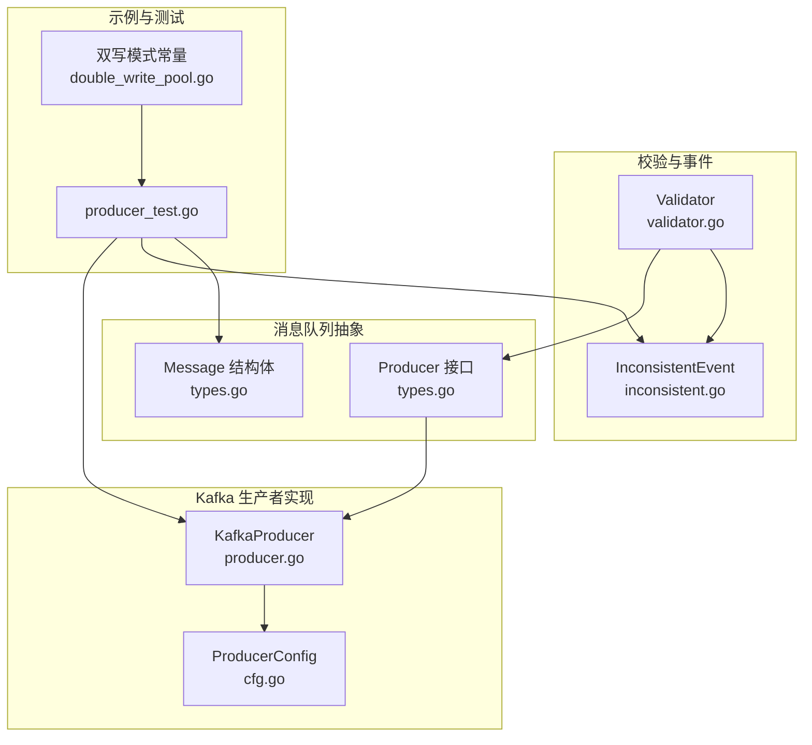
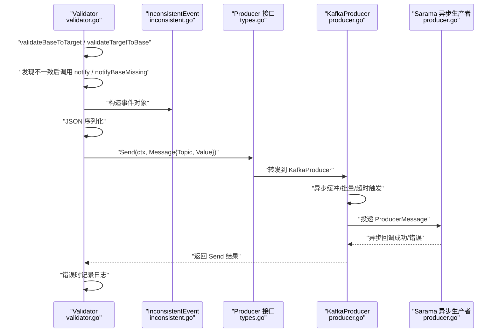
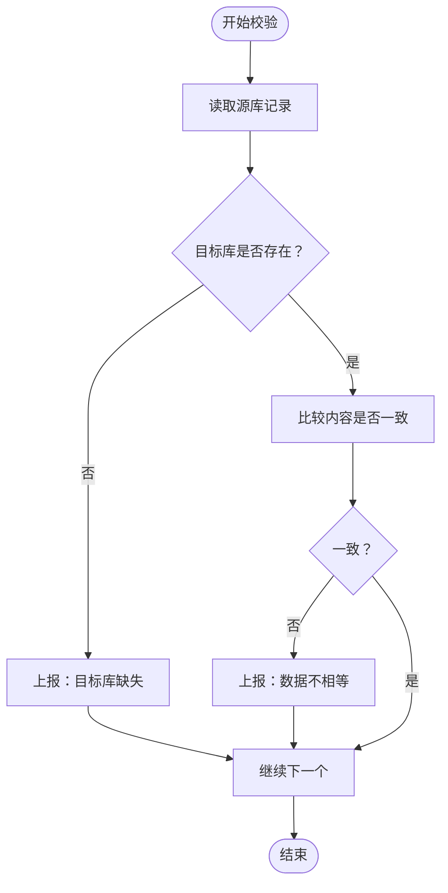
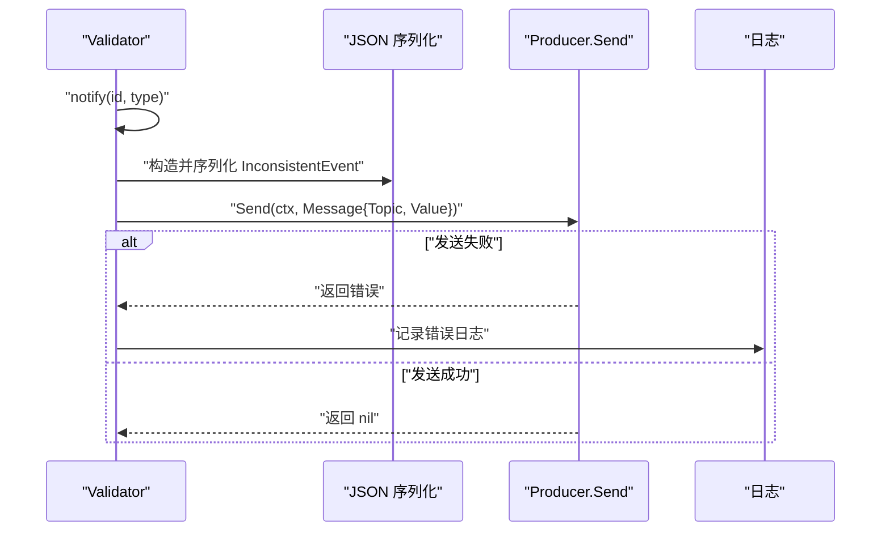
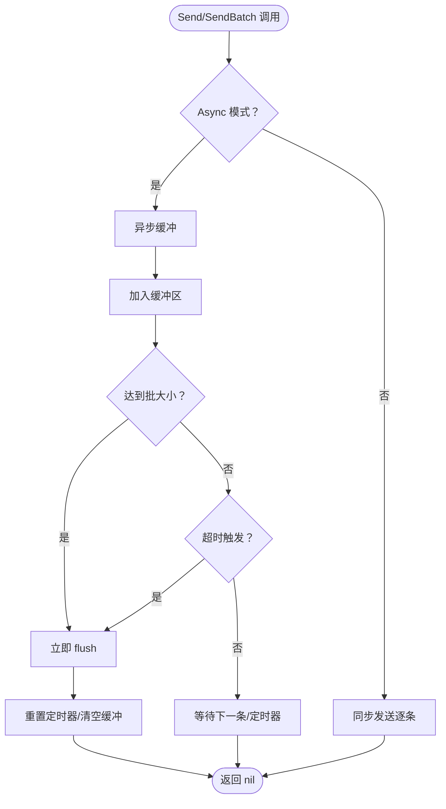
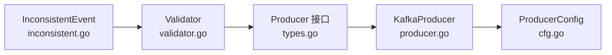

# 不一致数据通知机制

<cite>
**本文引用的文件列表**
- [inconsistent.go](file://DBx/mysqlX/gormx/dbMovex/myMovex/events/inconsistent.go)
- [validator.go](file://DBx/mysqlX/gormx/dbMovex/myMovex/validator/validator.go)
- [producer.go](file://channelx/mqX/kafkaX/saramaX/producerX/producer.go)
- [cfg.go](file://channelx/mqX/kafkaX/saramaX/producerX/cfg.go)
- [types.go](file://channelx/mqX/types.go)
- [producer_test.go](file://DBx/mysqlX/gormx/dbMovex/myMovex/messageQueue/producer/producer_test.go)
- [double_write_pool.go](file://DBx/mysqlX/gormx/dbMovex/myMovex/doubleWritePoolx/double_write_pool.go)
</cite>

## 目录
1. [引言](#引言)
2. [项目结构](#项目结构)
3. [核心组件](#核心组件)
4. [架构总览](#架构总览)
5. [详细组件分析](#详细组件分析)
6. [依赖关系分析](#依赖关系分析)
7. [性能考量](#性能考量)
8. [故障排查指南](#故障排查指南)
9. [结论](#结论)

## 引言
本文件围绕“不一致数据通知机制”展开，重点解释校验器如何通过 notify 与 notifyBaseMissing 方法将发现的数据不一致事件上报至消息队列（Kafka），并详细说明 InconsistentEvent 事件结构体的字段含义、不同不一致类型的触发条件、消息序列化流程、Producer 的调用方式、失败重试与日志告警策略，以及上下文超时控制与错误处理实践。

## 项目结构
与“不一致数据通知机制”直接相关的模块分布如下：
- 事件模型与类型定义：events 包中的 InconsistentEvent 结构体与不一致类型常量
- 校验器：validator 包中的 Validator 类型，负责扫描源库与目标库差异，并在发现不一致时上报
- 消息队列生产者：channelx/mqX 下的 Producer 接口与 KafkaProducer 实现
- Kafka 生产者封装：channelx/mqX/kafkaX/saramaX/producerX 中的 NewKafkaProducer、Send/SendBatch、配置与异步缓冲逻辑
- 示例与测试：producer_test.go 展示了 JSON 序列化与上下文超时控制的使用

图表来源
- [validator.go](file://DBx/mysqlX/gormx/dbMovex/myMovex/validator/validator.go#L1-L256)
- [inconsistent.go](file://DBx/mysqlX/gormx/dbMovex/myMovex/events/inconsistent.go#L1-L21)
- [types.go](file://channelx/mqX/types.go#L1-L71)
- [producer.go](file://channelx/mqX/kafkaX/saramaX/producerX/producer.go#L1-L219)
- [cfg.go](file://channelx/mqX/kafkaX/saramaX/producerX/cfg.go#L1-L33)
- [producer_test.go](file://DBx/mysqlX/gormx/dbMovex/myMovex/messageQueue/producer/producer_test.go#L1-L53)
- [double_write_pool.go](file://DBx/mysqlX/gormx/dbMovex/myMovex/doubleWritePoolx/double_write_pool.go#L711-L717)

章节来源
- [validator.go](file://DBx/mysqlX/gormx/dbMovex/myMovex/validator/validator.go#L1-L256)
- [inconsistent.go](file://DBx/mysqlX/gormx/dbMovex/myMovex/events/inconsistent.go#L1-L21)
- [types.go](file://channelx/mqX/types.go#L1-L71)
- [producer.go](file://channelx/mqX/kafkaX/saramaX/producerX/producer.go#L1-L219)
- [cfg.go](file://channelx/mqX/kafkaX/saramaX/producerX/cfg.go#L1-L33)
- [producer_test.go](file://DBx/mysqlX/gormx/dbMovex/myMovex/messageQueue/producer/producer_test.go#L1-L53)
- [double_write_pool.go](file://DBx/mysqlX/gormx/dbMovex/myMovex/doubleWritePoolx/double_write_pool.go#L711-L717)

## 核心组件
- InconsistentEvent 事件结构体
  - 字段：ID（整型）、Type（字符串）、Direction（字符串）
  - 含义：
    - ID：发生不一致的记录标识（通常为主键）
    - Type：不一致类型，用于区分“目标库缺失”、“数据不相等”、“源库缺失”
    - Direction：修复方向提示，取值为“SRC”或“DST”，指示以源表或目标表为准进行修复
- 不一致类型常量
  - 目标库缺失：target_missing
  - 数据不相等：neq
  - 源库缺失：base_missing
- 校验器 Validator
  - 负责双向扫描源库与目标库，发现不一致后调用 notify 或 notifyBaseMissing 上报
  - 使用 JSON 对 InconsistentEvent 进行序列化
  - 通过 Producer 接口发送到 Kafka
- Kafka 生产者 KafkaProducer
  - 支持同步与异步两种模式
  - 异步模式下具备批量缓冲、超时触发与后台结果处理
  - 提供 Send/SendBatch/Close 等接口

章节来源
- [inconsistent.go](file://DBx/mysqlX/gormx/dbMovex/myMovex/events/inconsistent.go#L1-L21)
- [validator.go](file://DBx/mysqlX/gormx/dbMovex/myMovex/validator/validator.go#L241-L255)
- [producer.go](file://channelx/mqX/kafkaX/saramaX/producerX/producer.go#L1-L219)
- [types.go](file://channelx/mqX/types.go#L1-L71)

## 架构总览
下图展示了从校验器发现不一致到消息发送至 Kafka 的整体流程，包括事件构造、序列化、Producer 调用与异步缓冲逻辑。

图表来源
- [validator.go](file://DBx/mysqlX/gormx/dbMovex/myMovex/validator/validator.go#L105-L122)
- [validator.go](file://DBx/mysqlX/gormx/dbMovex/myMovex/validator/validator.go#L200-L231)
- [validator.go](file://DBx/mysqlX/gormx/dbMovex/myMovex/validator/validator.go#L241-L255)
- [inconsistent.go](file://DBx/mysqlX/gormx/dbMovex/myMovex/events/inconsistent.go#L1-L21)
- [types.go](file://channelx/mqX/types.go#L1-L71)
- [producer.go](file://channelx/mqX/kafkaX/saramaX/producerX/producer.go#L72-L150)
- [producer.go](file://channelx/mqX/kafkaX/saramaX/producerX/producer.go#L152-L194)

## 详细组件分析

### 事件结构体 InconsistentEvent 与不一致类型
- 字段说明
  - ID：不一致记录的主键标识
  - Type：不一致类型，区分“目标库缺失”“数据不相等”“源库缺失”
  - Direction：修复方向提示，取值为“SRC”或“DST”
- 不一致类型触发条件
  - 目标库缺失（target_missing）：从源库读取某条记录，在目标库未找到该记录时触发
  - 数据不相等（neq）：目标库存在该记录但内容不一致时触发
  - 源库缺失（base_missing）：从目标库扫描到的记录集合与源库比对后，差集部分触发

图表来源
- [validator.go](file://DBx/mysqlX/gormx/dbMovex/myMovex/validator/validator.go#L105-L122)
- [validator.go](file://DBx/mysqlX/gormx/dbMovex/myMovex/validator/validator.go#L200-L231)
- [inconsistent.go](file://DBx/mysqlX/gormx/dbMovex/myMovex/events/inconsistent.go#L1-L21)

章节来源
- [inconsistent.go](file://DBx/mysqlX/gormx/dbMovex/myMovex/events/inconsistent.go#L1-L21)
- [validator.go](file://DBx/mysqlX/gormx/dbMovex/myMovex/validator/validator.go#L105-L122)
- [validator.go](file://DBx/mysqlX/gormx/dbMovex/myMovex/validator/validator.go#L200-L231)

### 校验器 Validator 的通知流程
- notify 方法
  - 构造 InconsistentEvent 并 JSON 序列化
  - 使用带超时的上下文发送消息
  - 发生错误时记录日志
- notifyBaseMissing 方法
  - 针对目标库多条记录缺失的情况，批量调用 notify
- 上下文超时控制
  - 校验器内部对数据库查询使用 WithContext 设置超时
  - 发送消息时也使用 WithTimeout 控制发送超时

图表来源
- [validator.go](file://DBx/mysqlX/gormx/dbMovex/myMovex/validator/validator.go#L241-L255)
- [producer_test.go](file://DBx/mysqlX/gormx/dbMovex/myMovex/messageQueue/producer/producer_test.go#L39-L50)

章节来源
- [validator.go](file://DBx/mysqlX/gormx/dbMovex/myMovex/validator/validator.go#L241-L255)
- [producer_test.go](file://DBx/mysqlX/gormx/dbMovex/myMovex/messageQueue/producer/producer_test.go#L39-L50)

### Kafka 生产者 KafkaProducer 的实现要点
- 同步/异步模式
  - 异步模式：启用批量缓冲与超时触发，适合高吞吐场景
  - 同步模式：逐条发送，适合低延迟、强一致性要求
- 批量与超时
  - 达到批大小或超时时间触发 flush
  - 异步模式下后台 goroutine 处理成功/错误回调
- 关闭与资源回收
  - 异步模式：flush 剩余消息并等待 goroutine 退出
  - 同步模式：直接关闭 SyncProducer

图表来源
- [producer.go](file://channelx/mqX/kafkaX/saramaX/producerX/producer.go#L72-L150)
- [producer.go](file://channelx/mqX/kafkaX/saramaX/producerX/producer.go#L152-L194)
- [cfg.go](file://channelx/mqX/kafkaX/saramaX/producerX/cfg.go#L1-L33)

章节来源
- [producer.go](file://channelx/mqX/kafkaX/saramaX/producerX/producer.go#L1-L219)
- [cfg.go](file://channelx/mqX/kafkaX/saramaX/producerX/cfg.go#L1-L33)

### 消息序列化与 Producer 调用
- 序列化
  - 使用 JSON 对 InconsistentEvent 进行序列化
  - Message.Value 作为字节数组传入 KafkaProducer
- Producer 调用
  - 通过 Producer 接口统一调用 Send/SendBatch
  - 生产者实现 KafkaProducer，内部将 Message 转换为 Sarama ProducerMessage 投递

章节来源
- [producer_test.go](file://DBx/mysqlX/gormx/dbMovex/myMovex/messageQueue/producer/producer_test.go#L39-L50)
- [types.go](file://channelx/mqX/types.go#L1-L71)
- [producer.go](file://channelx/mqX/kafkaX/saramaX/producerX/producer.go#L72-L150)

### 错误处理与日志告警策略
- 校验器侧
  - 发送失败时记录错误日志，包含 topic、type、id 等上下文信息
- Kafka 生产者侧
  - 异步模式下通过后台 goroutine 监听错误通道，便于后续扩展为告警
  - 关闭时 flush 剩余消息，避免数据丢失

章节来源
- [validator.go](file://DBx/mysqlX/gormx/dbMovex/myMovex/validator/validator.go#L241-L255)
- [producer.go](file://channelx/mqX/kafkaX/saramaX/producerX/producer.go#L180-L194)

## 依赖关系分析
- 组件耦合
  - Validator 依赖事件模型 InconsistentEvent 与 Producer 接口
  - Producer 接口由 KafkaProducer 实现，KafkaProducer 依赖 Sarama 异步生产者
- 关键依赖链
  - Validator.notify -> Producer.Send -> KafkaProducer.Send -> Sarama.AsyncProducer
  - ProducerConfig 控制批大小、超时与异步开关
- 可能的循环依赖
  - 当前结构清晰，未发现循环导入

图表来源
- [inconsistent.go](file://DBx/mysqlX/gormx/dbMovex/myMovex/events/inconsistent.go#L1-L21)
- [validator.go](file://DBx/mysqlX/gormx/dbMovex/myMovex/validator/validator.go#L241-L255)
- [types.go](file://channelx/mqX/types.go#L1-L71)
- [producer.go](file://channelx/mqX/kafkaX/saramaX/producerX/producer.go#L1-L219)
- [cfg.go](file://channelx/mqX/kafkaX/saramaX/producerX/cfg.go#L1-L33)

章节来源
- [validator.go](file://DBx/mysqlX/gormx/dbMovex/myMovex/validator/validator.go#L1-L256)
- [producer.go](file://channelx/mqX/kafkaX/saramaX/producerX/producer.go#L1-L219)
- [cfg.go](file://channelx/mqX/kafkaX/saramaX/producerX/cfg.go#L1-L33)
- [types.go](file://channelx/mqX/types.go#L1-L71)

## 性能考量
- 异步批量发送
  - 建议开启 Async，设置合理的 BatchSize 与 BatchTimeout，以提升吞吐并降低网络开销
- 上下文超时
  - 校验器内部对数据库查询与消息发送分别设置了超时，避免阻塞
- 日志与监控
  - 建议在 KafkaProducer 的异步错误通道中接入告警，结合业务指标进行监控

[本节为通用指导，无需列出具体文件来源]

## 故障排查指南
- Kafka 连接失败
  - 测试用例中演示了连接失败时跳过测试，生产环境应记录错误并触发告警
- 发送失败
  - 校验器在发送失败时会记录日志，检查 topic、消息体与 Producer 配置
- 超时问题
  - 校验器对数据库查询与消息发送均设置了超时，可根据业务调整
- 双写模式与修复方向
  - Direction 字段用于指示修复方向，结合双写模式常量（src_first、dst_first 等）有助于定位修复策略

章节来源
- [producer_test.go](file://DBx/mysqlX/gormx/dbMovex/myMovex/messageQueue/producer/producer_test.go#L26-L34)
- [validator.go](file://DBx/mysqlX/gormx/dbMovex/myMovex/validator/validator.go#L241-L255)
- [double_write_pool.go](file://DBx/mysqlX/gormx/dbMovex/myMovex/doubleWritePoolx/double_write_pool.go#L711-L717)

## 结论
本文系统梳理了“不一致数据通知机制”的实现路径：从事件模型定义、校验器触发条件、JSON 序列化、Producer 调用，到 Kafka 生产者的异步缓冲与超时策略，并给出了上下文超时控制与错误处理的最佳实践。通过该机制，系统能够及时发现并上报数据不一致事件，为后续修复与监控提供可靠支撑。