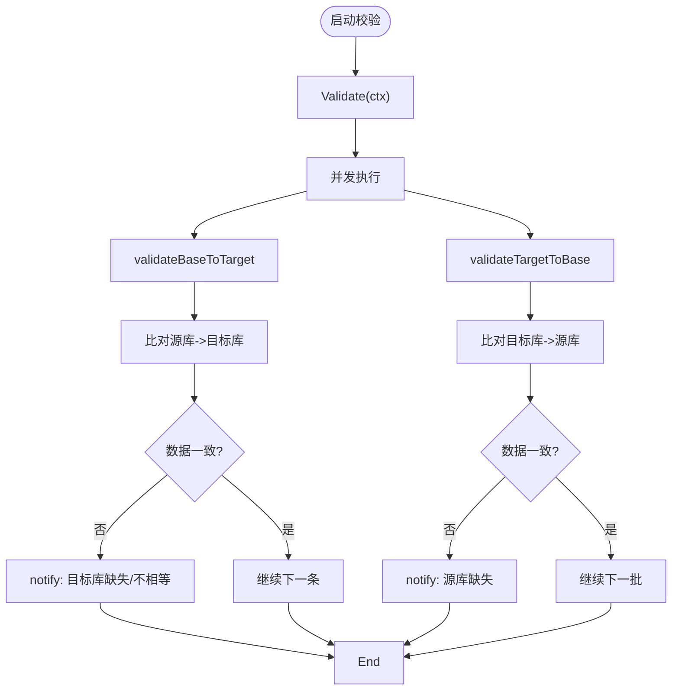
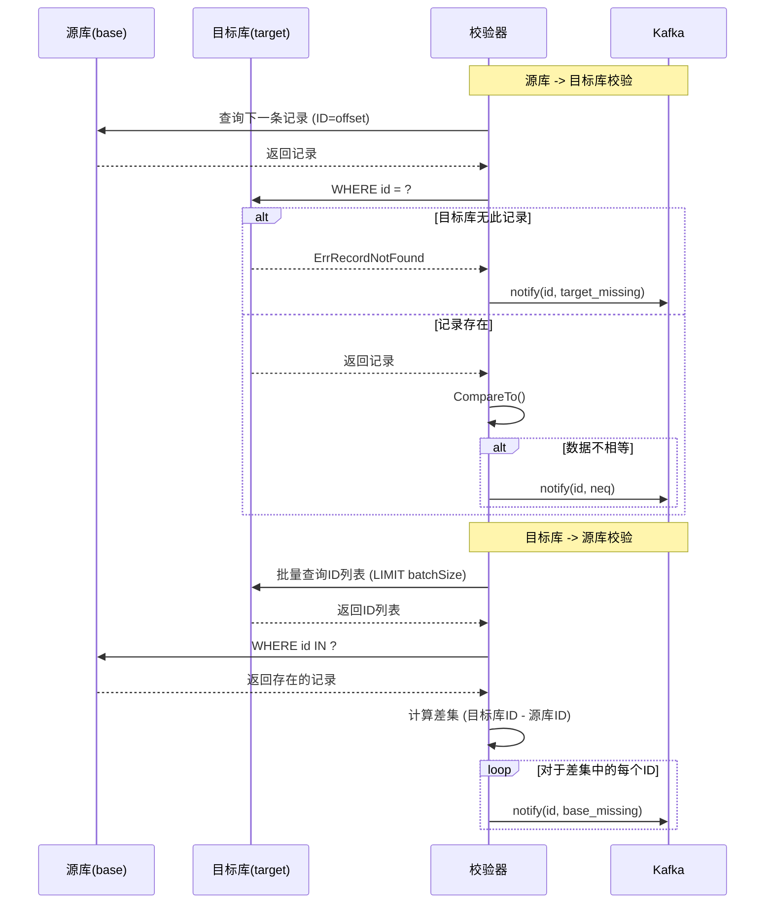
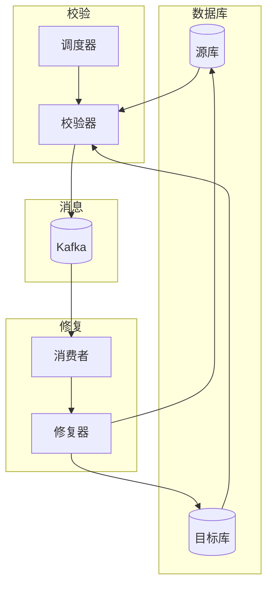

# 数据校验器

<cite>
**本文档引用的文件**  
- [validator.go](file://DBx/mysqlX/gormx/dbMovex/myMovex/validator/validator.go)
- [inconsistent.go](file://DBx/mysqlX/gormx/dbMovex/myMovex/events/inconsistent.go)
- [types.go](file://channelx/mqX/types.go)
- [migrator.go](file://DBx/mysqlX/gormx/dbMovex/myMovex/migrator.go)
- [structTest.go](file://DBx/mysqlX/gormx/dbMovex/myMovex/events/structTest.go)
- [producer.go](file://channelx/mqX/kafkaX/saramaX/producerX/producer.go)
- [scheduler.go](file://DBx/mysqlX/gormx/dbMovex/myMovex/scheduler/scheduler.go)
- [consumer.go](file://DBx/mysqlX/gormx/dbMovex/myMovex/messageQueue/consumerx/consumer.go)
- [fixer.go](file://DBx/mysqlX/gormx/dbMovex/myMovex/messageQueue/consumerx/fixer.go)
- [diff.go](file://sliceX/diff.go)
- [map.go](file://sliceX/map.go)
</cite>

## 目录
1. [简介](#简介)
2. [核心功能与工作流程](#核心功能与工作流程)
3. [双向校验机制](#双向校验机制)
4. [数据拉取策略](#数据拉取策略)
5. [不一致事件通知机制](#不一致事件通知机制)
6. [使用示例](#使用示例)
7. [性能调优参数](#性能调优参数)
8. [集成与上下游组件](#集成与上下游组件)
9. [总结](#总结)

## 简介

数据校验器（Validator）是数据库迁移过程中的关键组件，其主要职责是确保源数据库（base）与目标数据库（target）之间的数据一致性。在复杂的数据库迁移场景中，尤其是在双写模式下，数据可能因网络延迟、写入失败或逻辑错误而出现不一致。数据校验器通过并发的双向比对机制，主动发现这些不一致，并通过消息队列上报，为后续的自动化修复提供数据支持。

**本节来源**
- [validator.go](file://DBx/mysqlX/gormx/dbMovex/myMovex/validator/validator.go#L3-L8)

## 核心功能与工作流程

数据校验器的核心功能是执行数据一致性校验。它通过 `Validate` 方法启动校验流程，该方法会并发地执行两个独立的校验任务：`validateBaseToTarget` 和 `validateTargetToBase`。这种并发设计极大地提高了校验效率，避免了串行执行带来的长时间等待。

校验流程从源库或目标库按批次拉取数据，然后在另一方数据库中查询对应记录，通过比较记录的完整内容来判断数据是否一致。一旦发现不一致，校验器会立即生成一个不一致事件，并通过配置好的消息队列（如Kafka）进行上报。



**图示来源**
- [validator.go](file://DBx/mysqlX/gormx/dbMovex/myMovex/validator/validator.go#L63-L78)
- [validator.go](file://DBx/mysqlX/gormx/dbMovex/myMovex/validator/validator.go#L80-L131)
- [validator.go](file://DBx/mysqlX/gormx/dbMovex/myMovex/validator/validator.go#L174-L231)

**本节来源**
- [validator.go](file://DBx/mysqlX/gormx/dbMovex/myMovex/validator/validator.go#L62-L78)

## 双向校验机制

数据校验器采用双向校验机制，以确保数据比对的全面性。

### 源库到目标库校验 (validateBaseToTarget)

此过程从源库（base）逐条拉取数据（根据ID或utime排序），然后在目标库（target）中查询具有相同ID的记录。校验结果分为三种情况：
1.  **目标库缺失**：在目标库中未找到对应ID的记录（`gorm.ErrRecordNotFound`）。此时，校验器会调用 `notify` 方法，上报一个类型为 `InconsistentEventTypeTargetMissing` 的不一致事件。
2.  **数据不相等**：在目标库中找到了记录，但通过 `CompareTo` 方法比较后发现数据内容不一致。此时，会上报一个类型为 `InconsistentEventTypeNEQ` 的不一致事件。
3.  **数据一致**：记录存在且内容一致，无需任何操作。

### 目标库到源库校验 (validateTargetToBase)

此过程从目标库（target）批量拉取ID列表，然后在源库（base）中查询这些ID对应的记录。其主要目的是发现源库中已删除，但目标库仍存在的“孤儿”数据。具体流程如下：
1.  从目标库批量查询一批记录的ID。
2.  使用这些ID在源库中进行 `IN` 查询，获取所有在源库中存在的对应记录。
3.  使用 `sliceX.DiffSetFunc` 函数计算差集，即找出那些在目标库ID列表中，但在源库查询结果中不存在的ID。
4.  对于差集中的每一个ID，调用 `notifyBaseMissing` 方法，上报一个类型为 `InconsistentEventTypeBaseMissing` 的不一致事件。

这种双向校验确保了无论是源库有而目标库无，还是目标库有而源库无的情况，都能被准确地检测到。



**图示来源**
- [validator.go](file://DBx/mysqlX/gormx/dbMovex/myMovex/validator/validator.go#L80-L131)
- [validator.go](file://DBx/mysqlX/gormx/dbMovex/myMovex/validator/validator.go#L174-L231)
- [diff.go](file://sliceX/diff.go#L20-L32)
- [map.go](file://sliceX/map.go#L18-L23)

**本节来源**
- [validator.go](file://DBx/mysqlX/gormx/dbMovex/myMovex/validator/validator.go#L80-L131)
- [validator.go](file://DBx/mysqlX/gormx/dbMovex/myMovex/validator/validator.go#L174-L231)

## 数据拉取策略

数据校验器支持两种数据拉取策略，通过配置不同的拉取函数来实现。

### 全量校验 (fullFromBase)

全量校验策略用于在迁移初期或需要对整个数据集进行彻底检查时。它会从源库中按ID顺序，逐条拉取所有记录。该策略通过 `Order("id")` 和 `Offset(offset)` 实现分页查询，确保所有数据都能被遍历到。

```go
func (v *Validator[T, Pdr]) fullFromBase(ctx context.Context, offset int) (T, error) {
    var src T
    err := v.base.WithContext(ctx).Order("id").
        Offset(offset).First(&src).Error
    return src, err
}
```

### 增量校验 (incrFromBase)

增量校验策略用于在全量校验完成后，持续监控和校验新产生的数据。它依赖于数据表中的 `utime` 字段（更新时间戳）。校验器会记录一个基准时间点 `utime`，然后只拉取 `utime > 基准时间` 的记录。这种方式极大地减少了需要校验的数据量，提高了校验效率，适用于长期运行的监控场景。

```go
func (v *Validator[T, Pdr]) incrFromBase(ctx context.Context, offset int) (T, error) {
    var src T
    err := v.base.WithContext(ctx).
        Where("utime > ?", v.utime).
        Order("utime").
        Offset(offset).First(&src).Error
    return src, err
}
```

校验器通过 `Full()` 和 `Incr()` 方法链来切换这两种策略，并通过 `Utime(t int64)` 方法设置增量校验的时间戳。

**本节来源**
- [validator.go](file://DBx/mysqlX/gormx/dbMovex/myMovex/validator/validator.go#L134-L172)

## 不一致事件通知机制

当数据校验器发现不一致时，它不会直接进行修复，而是通过解耦的方式，将不一致事件发送到消息队列（Kafka），由专门的修复服务（Consumer）来处理。这种设计实现了校验与修复的职责分离，提高了系统的可维护性和可扩展性。

### 不一致事件类型

不一致事件由 `InconsistentEvent` 结构体表示，包含以下关键字段：
- `ID`：发生不一致的记录ID。
- `Direction`：指示修复方向，`SRC` 表示以源库为准，`DST` 表示以目标库为准。
- `Type`：不一致的类型，定义在常量中：
  - `InconsistentEventTypeTargetMissing`：目标库缺失。
  - `InconsistentEventTypeNEQ`：数据内容不相等。
  - `InconsistentEventTypeBaseMissing`：源库缺失。

### 通知流程

`notify` 方法负责将不一致事件序列化为JSON，并通过消息队列生产者发送出去。它使用 `context.WithTimeout` 来保证发送操作不会无限期阻塞。如果发送失败，错误信息会被记录到日志中，以便后续排查。

```go
func (v *Validator[T, Pdr]) notify(id int64, typ string) {
    ctx, cancel := context.WithTimeout(context.Background(), time.Second)
    defer cancel()
    val, _ := json.Marshal(events.InconsistentEvent{
        ID:        id,
        Type:      typ,
        Direction: v.direction,
    })
    err := v.MessageQueueConf.Producer.Send(ctx, &mqX.Message{Topic: v.MessageQueueConf.MessageQueueTopic, Value: val})
    if err != nil {
        v.l.Error("发送不一致数据消息失败", logx.Error(err), ...)
    }
}
```

**本节来源**
- [inconsistent.go](file://DBx/mysqlX/gormx/dbMovex/myMovex/events/inconsistent.go#L3-L20)
- [validator.go](file://DBx/mysqlX/gormx/dbMovex/myMovex/validator/validator.go#L241-L254)

## 使用示例

以下是一个配置和使用数据校验器的典型示例。首先，通过 `NewValidator` 创建一个校验器实例，然后可以链式调用方法来配置校验策略和参数，最后调用 `Validate` 方法启动校验。

```go
// 假设已初始化好 srcDB, dstDB, logger, producer
messageQueueConf := &validator.MessageQueueStr[sarama.SyncProducer]{
    Producer:          producer,
    MessageQueueTopic: "dbMove",
}

// 创建校验器
v := validator.NewValidator[TestUser, sarama.SyncProducer](
    srcDB, // 源库
    dstDB, // 目标库
    "SRC", // 修复方向
    logger,
    messageQueueConf,
)

// 配置为增量校验模式，从指定时间点开始，每100毫秒检查一次
err := v.Incr().
    Utime(1678886400000). // 毫秒级时间戳
    SleepInterval(100 * time.Millisecond).
    Validate(context.Background())

if err != nil {
    log.Printf("校验过程中发生错误: %v", err)
}
```

**本节来源**
- [validator.go](file://DBx/mysqlX/gormx/dbMovex/myMovex/validator/validator.go#L49-L60)
- [scheduler.go](file://DBx/mysqlX/gormx/dbMovex/myMovex/scheduler/scheduler.go#L218-L247)

## 性能调优参数

数据校验器提供了多个参数用于性能调优，以适应不同的数据量和系统负载。

- **`batchSize`**：在 `validateTargetToBase` 过程中，从目标库批量拉取ID的数量。较大的批次可以减少数据库查询次数，但会增加单次查询的内存消耗。默认值为100。
- **`sleepInterval`**：当在增量校验模式下，没有新数据可校验时，校验器将休眠的时长。这可以防止校验器在无数据时持续空转，消耗CPU资源。通过 `SleepInterval(interval time.Duration)` 方法设置。如果设置为小于等于0，则在校验完所有数据后立即退出。
- **`fromBase`**：一个函数指针，决定了数据拉取的策略（全量或增量）。通过 `Full()` 和 `Incr()` 方法进行切换。

合理配置这些参数，可以在校验的实时性和系统资源消耗之间取得平衡。

**本节来源**
- [validator.go](file://DBx/mysqlX/gormx/dbMovex/myMovex/validator/validator.go#L41-L45)
- [validator.go](file://DBx/mysqlX/gormx/dbMovex/myMovex/validator/validator.go#L179-L182)
- [validator.go](file://DBx/mysqlX/gormx/dbMovex/myMovex/validator/validator.go#L89-L95)

## 集成与上下游组件

数据校验器通常作为数据库迁移系统的一部分，与多个组件协同工作。

### 与调度器（Scheduler）的集成

`Scheduler` 是管理整个迁移流程的中心组件。它封装了 `NewValidator` 的创建逻辑，并通过HTTP接口（如 `/full/start`, `/incr/start`）来控制校验器的启动和停止。调度器会根据当前的双写模式（`Pattern`）来决定校验的方向（`SRC` 或 `DST`），并自动创建和配置校验器。

```go
func (s *Scheduler[T, Pdr]) newValidator() (*validator.Validator[T, Pdr], error) {
    switch s.Pattern {
    case PatternSrcOnly, PatternSrcFirst:
        return validator.NewValidator[T, Pdr](s.src, s.dst, "SRC", s.l, ...), nil
    case PatternDstFirst, PatternDstOnly:
        return validator.NewValidator[T, Pdr](s.dst, s.src, "DST", s.l, ...), nil
    }
}
```

### 与消息队列的集成

校验器通过 `mqX.Producer` 接口与消息队列交互。该接口定义了 `Send` 和 `SendBatch` 方法，实现了生产者的抽象，使得校验器可以与不同的消息队列实现（如Kafka）解耦。

### 与修复服务（Consumer）的集成

消息队列的消费者（`Consumer`）订阅校验器发布的主题。当收到不一致事件后，消费者会调用 `OverrideFixer` 等修复器，根据事件中的ID和方向，从源库读取数据并同步到目标库，从而完成数据修复。



**图示来源**
- [scheduler.go](file://DBx/mysqlX/gormx/dbMovex/myMovex/scheduler/scheduler.go#L218-L247)
- [types.go](file://channelx/mqX/types.go#L27-L34)
- [consumer.go](file://DBx/mysqlX/gormx/dbMovex/myMovex/messageQueue/consumerx/consumer.go#L60-L63)
- [fixer.go](file://DBx/mysqlX/gormx/dbMovex/myMovex/messageQueue/consumerx/fixer.go#L25-L40)

**本节来源**
- [scheduler.go](file://DBx/mysqlX/gormx/dbMovex/myMovex/scheduler/scheduler.go#L218-L247)
- [types.go](file://channelx/mqX/types.go#L27-L34)
- [consumer.go](file://DBx/mysqlX/gormx/dbMovex/myMovex/messageQueue/consumerx/consumer.go#L60-L63)
- [fixer.go](file://DBx/mysqlX/gormx/dbMovex/myMovex/messageQueue/consumerx/fixer.go#L17-L40)

## 总结

数据校验器是保障数据库迁移数据一致性的核心工具。它通过并发的双向校验机制，结合全量和增量两种拉取策略，高效地发现数据不一致。利用 `utime` 字段进行增量同步，确保了校验的实时性。通过将不一致事件发送到Kafka消息队列，实现了校验与修复的解耦，构建了一个健壮、可扩展的迁移监控体系。通过合理配置 `batchSize` 和 `sleepInterval` 等参数，可以针对不同场景进行性能优化。该组件与调度器、消息队列和修复服务紧密集成，共同构成了一个完整的数据库迁移解决方案。