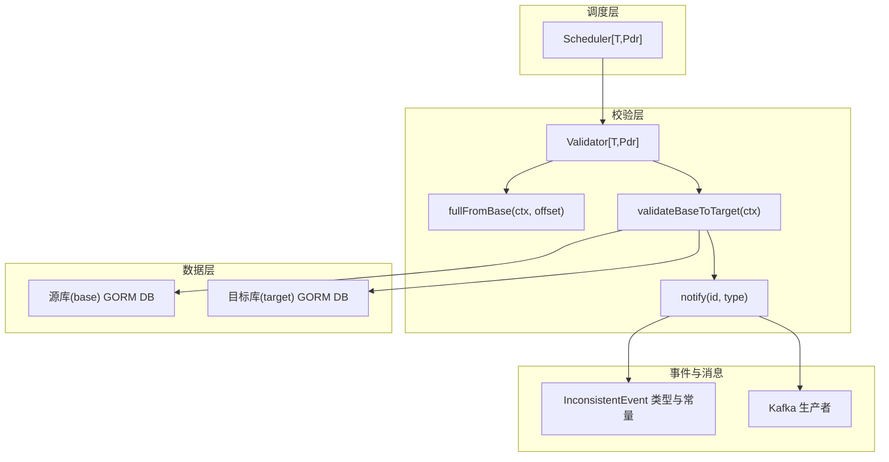
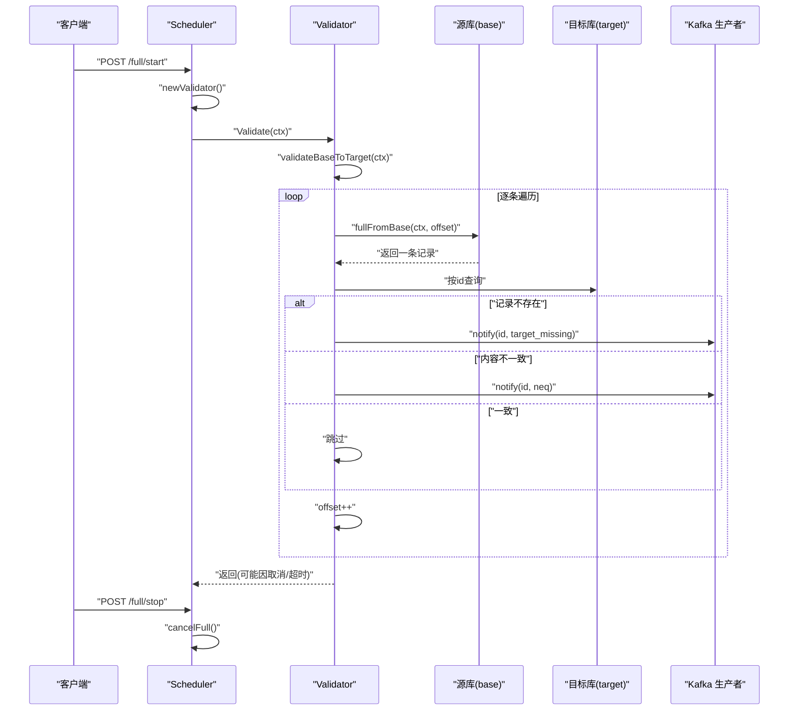
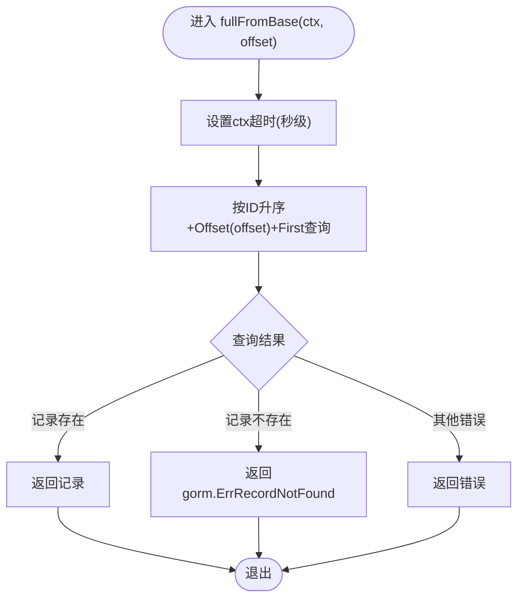
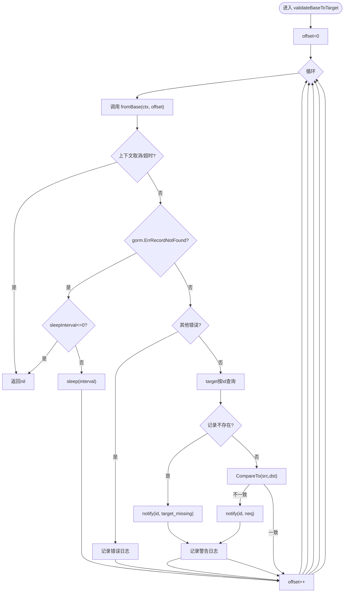
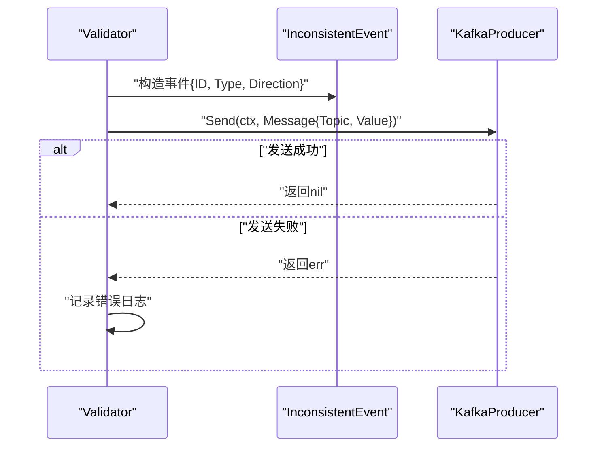
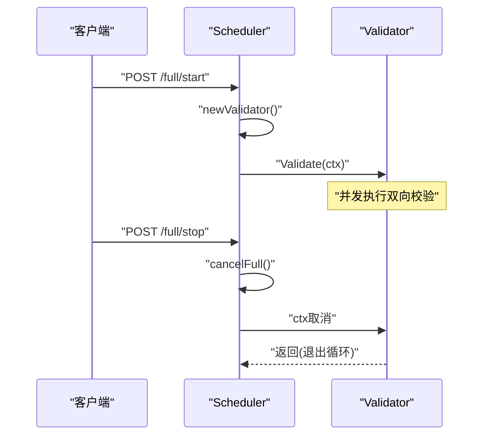
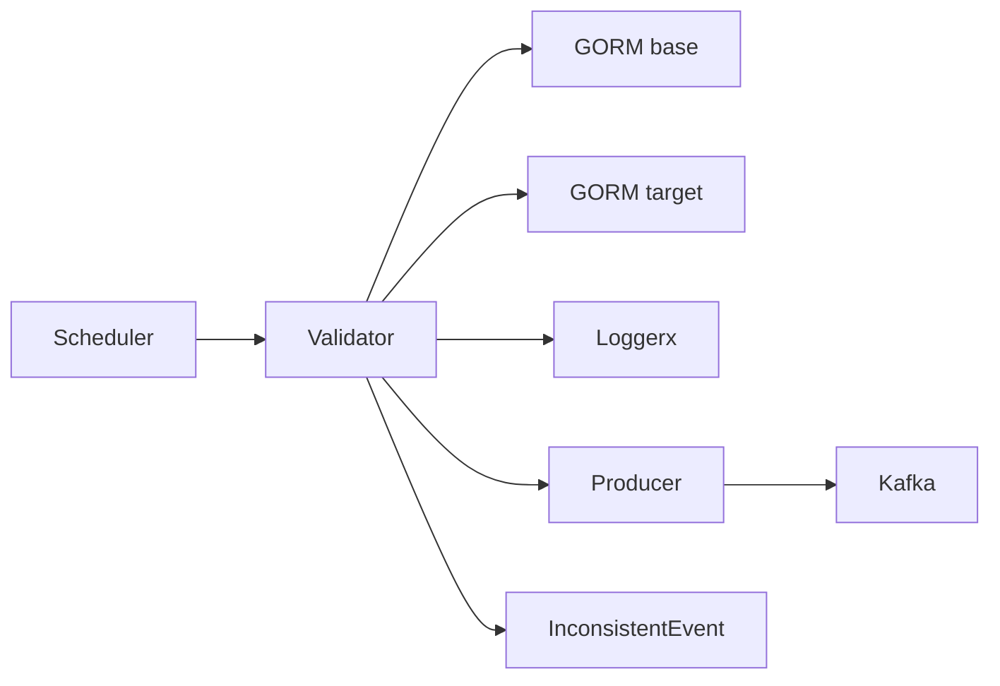

# 全量校验策略

<cite>
**本文引用的文件**
- [validator.go](file://DBx/mysqlX/gormx/dbMovex/myMovex/validator/validator.go)
- [migrator.go](file://DBx/mysqlX/gormx/dbMovex/myMovex/migrator.go)
- [inconsistent.go](file://DBx/mysqlX/gormx/dbMovex/myMovex/events/inconsistent.go)
- [scheduler.go](file://DBx/mysqlX/gormx/dbMovex/myMovex/scheduler/scheduler.go)
- [producer.go](file://channelx/mqX/kafkaX/saramaX/producerX/producer.go)
- [structTest.go](file://DBx/mysqlX/gormx/dbMovex/myMovex/events/structTest.go)
</cite>

## 目录
1. [引言](#引言)
2. [项目结构](#项目结构)
3. [核心组件](#核心组件)
4. [架构总览](#架构总览)
5. [详细组件分析](#详细组件分析)
6. [依赖关系分析](#依赖关系分析)
7. [性能考量](#性能考量)
8. [故障排查指南](#故障排查指南)
9. [结论](#结论)

## 引言
本文件聚焦于“全量校验策略”的实现机制，围绕以下目标展开：
- 解析 fullFromBase 方法如何通过 ID 顺序分页从源库（base）逐条拉取数据，并与目标库（target）进行一致性比对；
- 阐述在 Validate 流程中 validateBaseToTarget 调用时的执行逻辑，包括 Offset 分页控制、错误处理（记录不存在或查询失败）、日志记录及通过 notify 上报不一致事件至消息队列的完整链路；
- 结合 NewValidator 初始化时默认设置 fromBase 为 fullFromBase 的行为，说明全量校验的适用场景（如初次迁移后的完整性检查）和性能考量（全表扫描压力）。

## 项目结构
与全量校验相关的核心文件分布如下：
- 校验器与验证流程：DBx/mysqlX/gormx/dbMovex/myMovex/validator/validator.go
- 实体接口与比较：DBx/mysqlX/gormx/dbMovex/myMovex/migrator.go
- 不一致事件模型与常量：DBx/mysqlX/gormx/dbMovex/myMovex/events/inconsistent.go
- 调度器与启动入口：DBx/mysqlX/gormx/dbMovex/myMovex/scheduler/scheduler.go
- 消息队列生产者（Kafka）：channelx/mqX/kafkaX/saramaX/producerX/producer.go
- 示例实体实现：DBx/mysqlX/gormx/dbMovex/myMovex/events/structTest.go

图表来源
- [validator.go](file://DBx/mysqlX/gormx/dbMovex/myMovex/validator/validator.go#L49-L256)
- [inconsistent.go](file://DBx/mysqlX/gormx/dbMovex/myMovex/events/inconsistent.go#L1-L21)
- [producer.go](file://channelx/mqX/kafkaX/saramaX/producerX/producer.go#L72-L110)
- [scheduler.go](file://DBx/mysqlX/gormx/dbMovex/myMovex/scheduler/scheduler.go#L260-L287)

章节来源
- [validator.go](file://DBx/mysqlX/gormx/dbMovex/myMovex/validator/validator.go#L49-L256)
- [scheduler.go](file://DBx/mysqlX/gormx/dbMovex/myMovex/scheduler/scheduler.go#L260-L287)

## 核心组件
- Validator[T,Pdr]：通用校验器，负责在两个数据库之间进行一致性比对；包含源库、目标库、日志、消息队列配置、方向、批次大小、休眠间隔以及数据源获取函数 fromBase。
- fullFromBase(ctx, offset)：按 ID 升序、基于 Offset 的逐条拉取策略，作为默认的全量校验数据源。
- validateBaseToTarget(ctx)：从 base 逐条读取并对比 target，记录缺失或不一致并通过消息队列上报。
- notify(id, type)：将不一致事件序列化并发送到 Kafka 主题。
- Scheduler[T,Pdr]：对外提供全量/增量校验的启动与停止接口，并在启动时创建 Validator 实例。

章节来源
- [validator.go](file://DBx/mysqlX/gormx/dbMovex/myMovex/validator/validator.go#L49-L256)
- [scheduler.go](file://DBx/mysqlX/gormx/dbMovex/myMovex/scheduler/scheduler.go#L260-L287)

## 架构总览
全量校验的端到端流程如下：
- Scheduler 接收“启动全量校验”请求，创建 Validator 并启动协程执行 Validate；
- Validate 内部并发执行双向校验（base->target 与 target->base），其中 base->target 使用 fullFromBase 逐条拉取；
- 对每条记录，先在 target 中查找对应 id，若不存在或内容不一致则通过 notify 上报；
- notify 将事件序列化为 InconsistentEvent 并投递到 Kafka；
- Scheduler 提供停止接口，用于取消正在进行的校验。

图表来源
- [scheduler.go](file://DBx/mysqlX/gormx/dbMovex/myMovex/scheduler/scheduler.go#L260-L287)
- [validator.go](file://DBx/mysqlX/gormx/dbMovex/myMovex/validator/validator.go#L80-L132)
- [producer.go](file://channelx/mqX/kafkaX/saramaX/producerX/producer.go#L72-L110)

## 详细组件分析

### 全量校验数据源：fullFromBase
- 设计要点
  - 采用 Order("id") + Offset(offset) + First(&src) 的方式，按自增主键 ID 顺序拉取；
  - 每次迭代 offset 自增 1，实现“逐条”拉取；
  - 为每次数据库访问设置短超时，避免阻塞；
  - 默认由 NewValidator 初始化时赋值给 fromBase，从而成为 Validate 的默认策略。
- 关键路径
  - 初始化：[NewValidator](file://DBx/mysqlX/gormx/dbMovex/myMovex/validator/validator.go#L49-L60)
  - 数据源：[fullFromBase](file://DBx/mysqlX/gormx/dbMovex/myMovex/validator/validator.go#L154-L161)

图表来源
- [validator.go](file://DBx/mysqlX/gormx/dbMovex/myMovex/validator/validator.go#L154-L161)

章节来源
- [validator.go](file://DBx/mysqlX/gormx/dbMovex/myMovex/validator/validator.go#L49-L60)
- [validator.go](file://DBx/mysqlX/gormx/dbMovex/myMovex/validator/validator.go#L154-L161)

### 校验流程：validateBaseToTarget
- 设计要点
  - offset 从 0 开始，每次迭代 offset++；
  - 调用 fromBase(ctx, offset) 获取下一条记录；
  - 对 gorm.ErrRecordNotFound、上下文取消/超时、其他错误分别处理；
  - 在 target 中按 id 查找，若不存在或内容不一致则通过 notify 上报；
  - 支持 sleepInterval，在无数据时进行休眠以降低轮询压力。
- 关键路径
  - 基本循环与错误分支：[validateBaseToTarget](file://DBx/mysqlX/gormx/dbMovex/myMovex/validator/validator.go#L80-L132)
  - 目标库查询与比对：[validateBaseToTarget](file://DBx/mysqlX/gormx/dbMovex/myMovex/validator/validator.go#L105-L131)

图表来源
- [validator.go](file://DBx/mysqlX/gormx/dbMovex/myMovex/validator/validator.go#L80-L132)

章节来源
- [validator.go](file://DBx/mysqlX/gormx/dbMovex/myMovex/validator/validator.go#L80-L132)

### 消息队列上报：notify
- 设计要点
  - 将 InconsistentEvent 序列化为 JSON；
  - 使用 Send(ctx, &Message{Topic, Value}) 发送到 Kafka；
  - 发送失败时记录错误日志（含 topic、type、id）。
- 关键路径
  - 事件定义与常量：[InconsistentEvent](file://DBx/mysqlX/gormx/dbMovex/myMovex/events/inconsistent.go#L1-L21)
  - 上报实现：[notify](file://DBx/mysqlX/gormx/dbMovex/myMovex/validator/validator.go#L241-L256)
  - Kafka 生产者接口：[Send](file://channelx/mqX/kafkaX/saramaX/producerX/producer.go#L72-L110)

图表来源
- [validator.go](file://DBx/mysqlX/gormx/dbMovex/myMovex/validator/validator.go#L241-L256)
- [inconsistent.go](file://DBx/mysqlX/gormx/dbMovex/myMovex/events/inconsistent.go#L1-L21)
- [producer.go](file://channelx/mqX/kafkaX/saramaX/producerX/producer.go#L72-L110)

章节来源
- [validator.go](file://DBx/mysqlX/gormx/dbMovex/myMovex/validator/validator.go#L241-L256)
- [inconsistent.go](file://DBx/mysqlX/gormx/dbMovex/myMovex/events/inconsistent.go#L1-L21)
- [producer.go](file://channelx/mqX/kafkaX/saramaX/producerX/producer.go#L72-L110)

### 调度器集成：启动与停止
- 设计要点
  - StartFullValidation 创建 Validator 并在新协程中执行 Validate；
  - StopFullValidation 通过 cancelFull 取消当前校验；
  - newValidator 根据当前双写模式选择 base/target 方向与消息队列配置。
- 关键路径
  - 启动全量校验：[StartFullValidation](file://DBx/mysqlX/gormx/dbMovex/myMovex/scheduler/scheduler.go#L260-L287)
  - 停止全量校验：[StopFullValidation](file://DBx/mysqlX/gormx/dbMovex/myMovex/scheduler/scheduler.go#L249-L257)
  - 创建校验器：[newValidator](file://DBx/mysqlX/gormx/dbMovex/myMovex/scheduler/scheduler.go#L289-L300)

图表来源
- [scheduler.go](file://DBx/mysqlX/gormx/dbMovex/myMovex/scheduler/scheduler.go#L260-L287)
- [validator.go](file://DBx/mysqlX/gormx/dbMovex/myMovex/validator/validator.go#L62-L78)

章节来源
- [scheduler.go](file://DBx/mysqlX/gormx/dbMovex/myMovex/scheduler/scheduler.go#L249-L287)
- [validator.go](file://DBx/mysqlX/gormx/dbMovex/myMovex/validator/validator.go#L62-L78)

### 实体接口与示例
- 实体接口要求
  - ID() int64：返回主键；
  - CompareTo(dst Entity) bool：比较两行是否一致；
  - Types() string：返回表名（用于标识）。
- 示例实体
  - TestUser：演示 CompareTo 的等值比较实现。

章节来源
- [migrator.go](file://DBx/mysqlX/gormx/dbMovex/myMovex/migrator.go#L1-L11)
- [structTest.go](file://DBx/mysqlX/gormx/dbMovex/myMovex/events/structTest.go#L1-L36)

## 依赖关系分析
- 组件耦合
  - Validator 依赖 GORM DB（base/target）、日志、消息队列生产者；
  - validateBaseToTarget 依赖 fromBase（默认 fullFromBase）；
  - notify 依赖 InconsistentEvent 类型与 Kafka 生产者；
  - Scheduler 依赖 Validator 并负责生命周期管理。
- 外部依赖
  - Kafka 生产者实现（同步/异步、批量、超时）；
  - GORM 查询与错误语义（gorm.ErrRecordNotFound、上下文取消/超时）。

图表来源
- [scheduler.go](file://DBx/mysqlX/gormx/dbMovex/myMovex/scheduler/scheduler.go#L289-L300)
- [validator.go](file://DBx/mysqlX/gormx/dbMovex/myMovex/validator/validator.go#L49-L60)
- [inconsistent.go](file://DBx/mysqlX/gormx/dbMovex/myMovex/events/inconsistent.go#L1-L21)
- [producer.go](file://channelx/mqX/kafkaX/saramaX/producerX/producer.go#L72-L110)

章节来源
- [scheduler.go](file://DBx/mysqlX/gormx/dbMovex/myMovex/scheduler/scheduler.go#L289-L300)
- [validator.go](file://DBx/mysqlX/gormx/dbMovex/myMovex/validator/validator.go#L49-L60)

## 性能考量
- 全表扫描压力
  - fullFromBase 以 ID 升序遍历，每次 Offset++ 逐条拉取，天然形成全表扫描；
  - 对于大表，建议：
    - 在源库上确保 id 字段有索引（自增主键通常自带索引）；
    - 控制并发与 sleepInterval，避免对在线业务造成过大冲击；
    - 评估分片/分区策略或在低峰期执行。
- 查询与网络开销
  - 每条记录均触发一次 base 查询与一次 target 查询；
  - notify 为单条发送，建议结合 Kafka 生产者的异步批量能力优化吞吐。
- 错误与回退
  - 对 gorm.ErrRecordNotFound 与上下文错误进行快速回退，减少无效重试；
  - 对查询失败记录日志并继续推进，保证整体进度。

[本节为通用性能讨论，不直接分析具体文件]

## 故障排查指南
- 常见问题定位
  - 无法连接数据库：validateBaseToTarget 对查询失败记录错误日志，同时 offset++ 继续推进；
  - 记录不存在：当 target 缺失对应 id 或内容不一致时，会通过 notify 上报并记录警告；
  - 上下文取消/超时：validateBaseToTarget 在 ctx 超时或取消时直接返回，避免资源泄漏；
  - Kafka 发送失败：notify 记录错误日志（含 topic、type、id），便于定位。
- 建议排查步骤
  - 检查日志输出，确认 validateBaseToTarget 是否持续推进；
  - 核对 Kafka 主题与消费者是否正常消费；
  - 检查 GORM 连接参数与超时设置；
  - 在业务低峰期执行全量校验，观察 CPU/IO 压力。

章节来源
- [validator.go](file://DBx/mysqlX/gormx/dbMovex/myMovex/validator/validator.go#L80-L132)
- [validator.go](file://DBx/mysqlX/gormx/dbMovex/myMovex/validator/validator.go#L241-L256)

## 结论
- fullFromBase 通过 ID 顺序分页（Offset++）逐条从源库拉取数据，是全量校验的默认策略；
- validateBaseToTarget 在 Validate 流程中承担“从 base->target”的一致性比对职责，具备完善的错误处理、日志记录与消息上报链路；
- NewValidator 默认将 fromBase 设为 fullFromBase，契合“初次迁移后完整性检查”的典型场景；
- 需关注全表扫描带来的性能影响，建议在低峰期执行、合理设置 sleepInterval，并结合 Kafka 生产者异步批量提升吞吐。