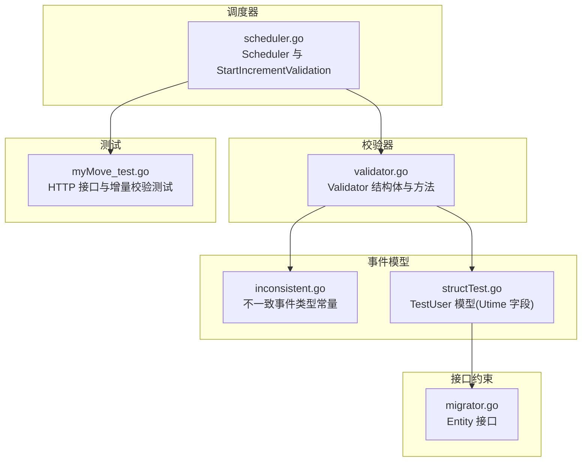
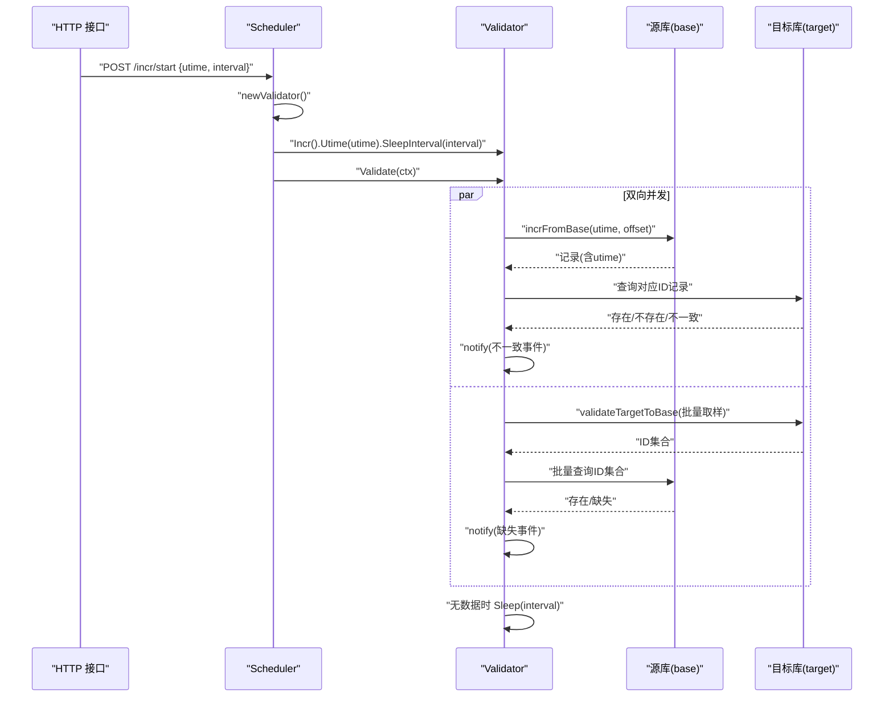
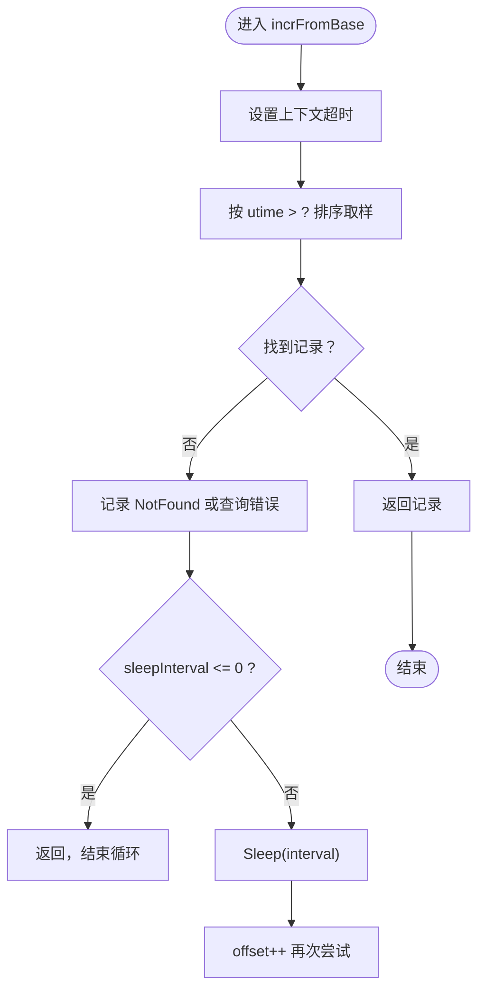
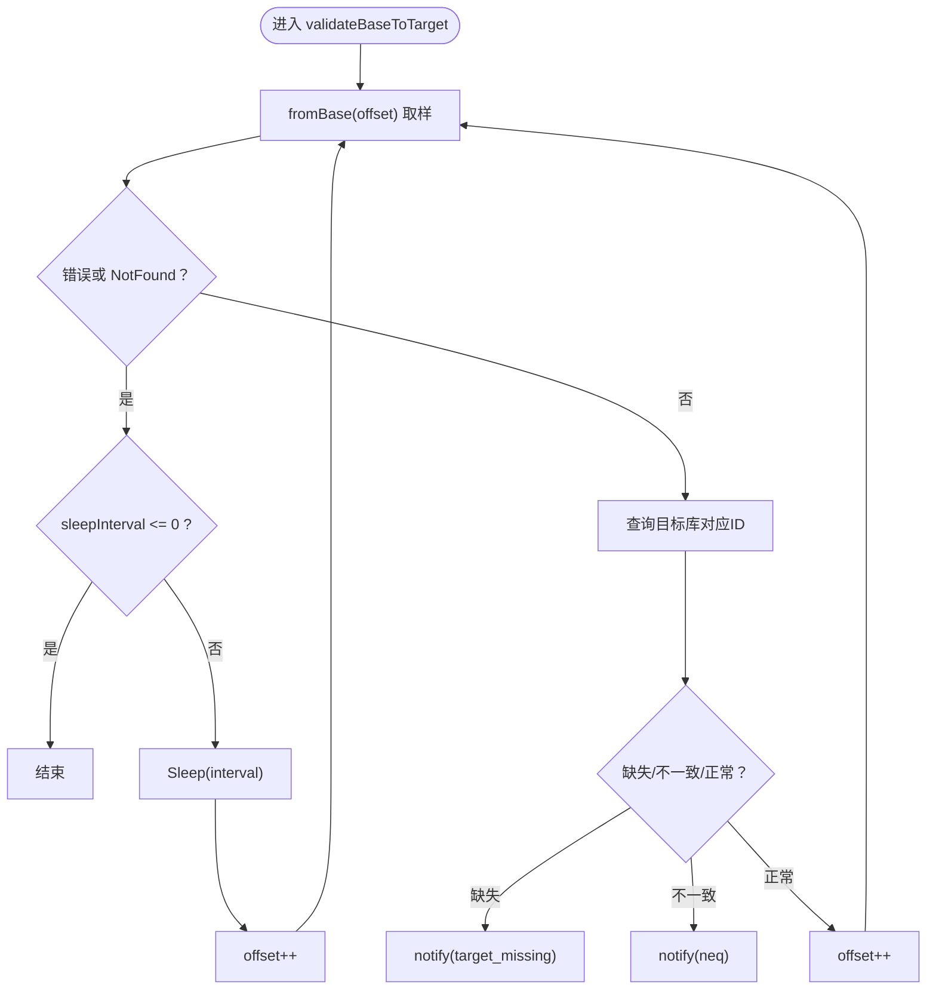
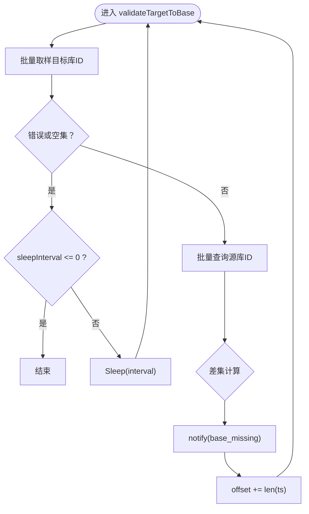
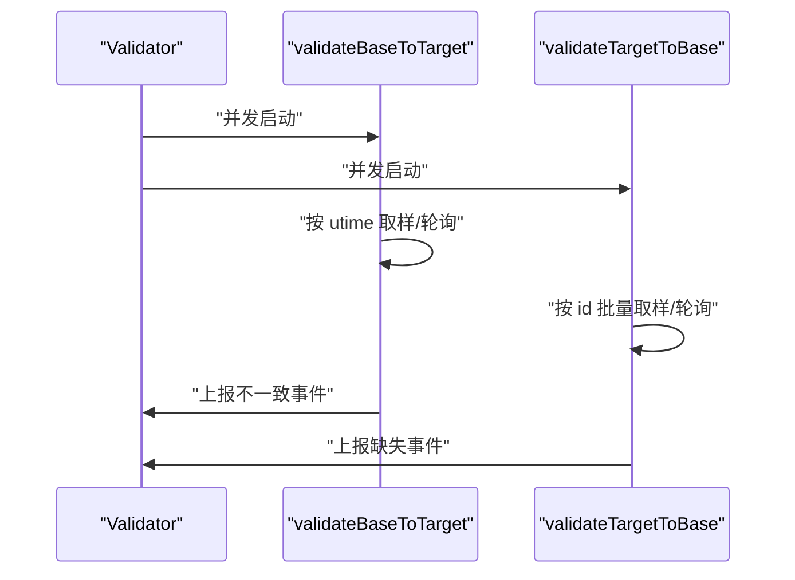
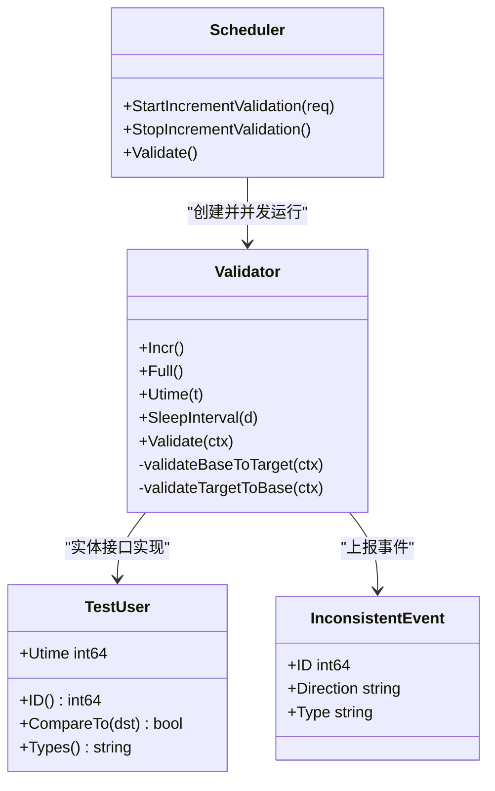

# 增量校验策略

<cite>
**本文引用的文件列表**
- [validator.go](file://DBx/mysqlX/gormx/dbMovex/myMovex/validator/validator.go)
- [scheduler.go](file://DBx/mysqlX/gormx/dbMovex/myMovex/scheduler/scheduler.go)
- [inconsistent.go](file://DBx/mysqlX/gormx/dbMovex/myMovex/events/inconsistent.go)
- [structTest.go](file://DBx/mysqlX/gormx/dbMovex/myMovex/events/structTest.go)
- [migrator.go](file://DBx/mysqlX/gormx/dbMovex/myMovex/migrator.go)
- [myMove_test.go](file://DBx/mysqlX/gormx/dbMovex/myMovex/test/myMove_test.go)
</cite>

## 目录
1. [引言](#引言)
2. [项目结构](#项目结构)
3. [核心组件](#核心组件)
4. [架构总览](#架构总览)
5. [详细组件分析](#详细组件分析)
6. [依赖关系分析](#依赖关系分析)
7. [性能考量](#性能考量)
8. [故障排查指南](#故障排查指南)
9. [结论](#结论)

## 引言
本文件围绕增量校验策略展开，重点解释以下内容：
- incrFromBase 方法如何基于 utime 时间戳条件从源库筛选新增或修改的数据；
- Utime 和 SleepInterval 配置项的作用；
- validateBaseToTarget 在无新数据时如何通过 SleepInterval 实现周期性轮询；
- 该策略如何与 validateTargetToBase 并发执行，构成双向校验闭环；
- Incr 方法如何切换校验模式，并讨论其在持续数据同步场景下的优势（低开销）与挑战（时间窗口内数据一致性保障）。

## 项目结构
与增量校验策略直接相关的代码位于 DBx/mysqlX/gormx/dbMovex/myMovex 子目录下，涉及校验器、调度器、事件模型与测试用例。

图表来源
- [validator.go](file://DBx/mysqlX/gormx/dbMovex/myMovex/validator/validator.go#L1-L256)
- [scheduler.go](file://DBx/mysqlX/gormx/dbMovex/myMovex/scheduler/scheduler.go#L1-L447)
- [inconsistent.go](file://DBx/mysqlX/gormx/dbMovex/myMovex/events/inconsistent.go#L1-L21)
- [structTest.go](file://DBx/mysqlX/gormx/dbMovex/myMovex/events/structTest.go#L1-L36)
- [migrator.go](file://DBx/mysqlX/gormx/dbMovex/myMovex/migrator.go#L1-L12)
- [myMove_test.go](file://DBx/mysqlX/gormx/dbMovex/myMovex/test/myMove_test.go#L500-L566)

章节来源
- [validator.go](file://DBx/mysqlX/gormx/dbMovex/myMovex/validator/validator.go#L1-L256)
- [scheduler.go](file://DBx/mysqlX/gormx/dbMovex/myMovex/scheduler/scheduler.go#L1-L447)

## 核心组件
- 校验器 Validator：负责双向校验逻辑，支持全量与增量两种模式；通过 Incr/Full 切换；通过 Utime/SleepInterval 控制增量扫描与轮询节奏。
- 调度器 Scheduler：提供 HTTP 接口启动/停止增量校验，内部创建 Validator 并并发运行 validateBaseToTarget 与 validateTargetToBase。
- 不一致事件模型：定义不一致事件类型，用于上报缺失或不一致的数据标识。
- 测试模型 TestUser：包含 Utime 字段，作为增量校验的时间戳依据。

章节来源
- [validator.go](file://DBx/mysqlX/gormx/dbMovex/myMovex/validator/validator.go#L1-L256)
- [scheduler.go](file://DBx/mysqlX/gormx/dbMovex/myMovex/scheduler/scheduler.go#L1-L447)
- [inconsistent.go](file://DBx/mysqlX/gormx/dbMovex/myMovex/events/inconsistent.go#L1-L21)
- [structTest.go](file://DBx/mysqlX/gormx/dbMovex/myMovex/events/structTest.go#L1-L36)
- [migrator.go](file://DBx/mysqlX/gormx/dbMovex/myMovex/migrator.go#L1-L12)

## 架构总览
增量校验采用“双向并发”的闭环设计：
- validateBaseToTarget：从源库按 utime 条件取样，逐条比对目标库是否存在及是否相等；
- validateTargetToBase：从目标库按 id 顺序取样，批量对比源库是否存在差异；
- 两者通过并发组并行执行，各自在无数据时依据 SleepInterval 进行周期性轮询，避免忙等。

图表来源
- [scheduler.go](file://DBx/mysqlX/gormx/dbMovex/myMovex/scheduler/scheduler.go#L217-L246)
- [validator.go](file://DBx/mysqlX/gormx/dbMovex/myMovex/validator/validator.go#L63-L132)
- [validator.go](file://DBx/mysqlX/gormx/dbMovex/myMovex/validator/validator.go#L175-L232)

## 详细组件分析

### 增量扫描：incrFromBase 与 utime 条件
- incrFromBase 在每次迭代中使用 utime > ? 条件从源库取样，保证仅扫描自上次校验以来新增或更新的数据；
- 通过 Order("utime") 保证扫描顺序与时间先后一致；
- 通过 Offset(offset) 支持分页游标推进；
- 查询带有上下文超时，避免阻塞。

图表来源
- [validator.go](file://DBx/mysqlX/gormx/dbMovex/myMovex/validator/validator.go#L163-L172)
- [validator.go](file://DBx/mysqlX/gormx/dbMovex/myMovex/validator/validator.go#L80-L132)

章节来源
- [validator.go](file://DBx/mysqlX/gormx/dbMovex/myMovex/validator/validator.go#L163-L172)
- [validator.go](file://DBx/mysqlX/gormx/dbMovex/myMovex/validator/validator.go#L80-L132)

### Utime 与 SleepInterval 的作用
- Utime：作为增量扫描的起点时间戳，确保只处理自该时刻之后变更的数据；
- SleepInterval：当无新数据时，触发周期性休眠，避免 CPU 空转；
- 两者共同实现“低开销、持续运行”的增量校验。

章节来源
- [scheduler.go](file://DBx/mysqlX/gormx/dbMovex/myMovex/scheduler/scheduler.go#L231-L232)
- [validator.go](file://DBx/mysqlX/gormx/dbMovex/myMovex/validator/validator.go#L40-L47)
- [validator.go](file://DBx/mysqlX/gormx/dbMovex/myMovex/validator/validator.go#L144-L152)

### validateBaseToTarget 的轮询机制
- 当源库取样返回 NotFound 或查询错误时，若 sleepInterval > 0，则 Sleep(interval) 后继续；
- 若 sleepInterval <= 0，则直接结束；
- 对每条记录，查询目标库对应 ID，若缺失或不一致则上报不一致事件。

图表来源
- [validator.go](file://DBx/mysqlX/gormx/dbMovex/myMovex/validator/validator.go#L80-L132)

章节来源
- [validator.go](file://DBx/mysqlX/gormx/dbMovex/myMovex/validator/validator.go#L80-L132)

### validateTargetToBase 的批量对比与轮询
- 从目标库按 id 顺序批量取样，批量查询源库对应 ID；
- 计算差集，上报缺失事件；
- 无数据或查询错误时，同样依据 sleepInterval 决定是否轮询。

图表来源
- [validator.go](file://DBx/mysqlX/gormx/dbMovex/myMovex/validator/validator.go#L175-L232)

章节来源
- [validator.go](file://DBx/mysqlX/gormx/dbMovex/myMovex/validator/validator.go#L175-L232)

### 并发执行与双向闭环
- Validate 内部使用并发组同时运行 validateBaseToTarget 与 validateTargetToBase；
- 二者分别维护各自的 offset 与轮询逻辑，形成“源->目标”与“目标->源”的双向闭环；
- 通过消息队列上报不一致事件，便于后续修复。

图表来源
- [validator.go](file://DBx/mysqlX/gormx/dbMovex/myMovex/validator/validator.go#L63-L78)
- [validator.go](file://DBx/mysqlX/gormx/dbMovex/myMovex/validator/validator.go#L80-L132)
- [validator.go](file://DBx/mysqlX/gormx/dbMovex/myMovex/validator/validator.go#L175-L232)

章节来源
- [validator.go](file://DBx/mysqlX/gormx/dbMovex/myMovex/validator/validator.go#L63-L78)
- [validator.go](file://DBx/mysqlX/gormx/dbMovex/myMovex/validator/validator.go#L80-L132)
- [validator.go](file://DBx/mysqlX/gormx/dbMovex/myMovex/validator/validator.go#L175-L232)

### Incr 切换与持续同步优势与挑战
- Incr 切换将 fromBase 指针指向 incrFromBase，从而启用 utime 条件扫描；
- 优势：仅扫描增量数据，显著降低开销；
- 挑战：在时间窗口内（utime 之前到当前）可能存在数据不一致，需结合业务策略与补偿机制保障最终一致性。

章节来源
- [validator.go](file://DBx/mysqlX/gormx/dbMovex/myMovex/validator/validator.go#L134-L142)
- [validator.go](file://DBx/mysqlX/gormx/dbMovex/myMovex/validator/validator.go#L163-L172)
- [scheduler.go](file://DBx/mysqlX/gormx/dbMovex/myMovex/scheduler/scheduler.go#L217-L246)

### HTTP 接口与测试用例
- /incr/start 接口接收 utime 与 interval 参数，启动增量校验；
- 测试用例演示了启动、停止与统计信息更新；
- TestUser 模型包含 Utime 字段，作为增量扫描的时间戳来源。

章节来源
- [scheduler.go](file://DBx/mysqlX/gormx/dbMovex/myMovex/scheduler/scheduler.go#L113-L116)
- [scheduler.go](file://DBx/mysqlX/gormx/dbMovex/myMovex/scheduler/scheduler.go#L217-L246)
- [myMove_test.go](file://DBx/mysqlX/gormx/dbMovex/myMovex/test/myMove_test.go#L500-L566)
- [structTest.go](file://DBx/mysqlX/gormx/dbMovex/myMovex/events/structTest.go#L13-L20)

## 依赖关系分析
- Scheduler 依赖 Validator 提供双向校验能力；
- Validator 依赖 GORM 进行数据库访问，依赖消息队列生产者上报不一致事件；
- TestUser 实现 Entity 接口，提供 ID/CompareTo/Types，支撑校验逻辑；
- 不一致事件类型由 inconsistent.go 定义，供 Validator 上报。

图表来源
- [scheduler.go](file://DBx/mysqlX/gormx/dbMovex/myMovex/scheduler/scheduler.go#L1-L447)
- [validator.go](file://DBx/mysqlX/gormx/dbMovex/myMovex/validator/validator.go#L1-L256)
- [structTest.go](file://DBx/mysqlX/gormx/dbMovex/myMovex/events/structTest.go#L1-L36)
- [inconsistent.go](file://DBx/mysqlX/gormx/dbMovex/myMovex/events/inconsistent.go#L1-L21)
- [migrator.go](file://DBx/mysqlX/gormx/dbMovex/myMovex/migrator.go#L1-L12)

章节来源
- [scheduler.go](file://DBx/mysqlX/gormx/dbMovex/myMovex/scheduler/scheduler.go#L1-L447)
- [validator.go](file://DBx/mysqlX/gormx/dbMovex/myMovex/validator/validator.go#L1-L256)
- [structTest.go](file://DBx/mysqlX/gormx/dbMovex/myMovex/events/structTest.go#L1-L36)
- [inconsistent.go](file://DBx/mysqlX/gormx/dbMovex/myMovex/events/inconsistent.go#L1-L21)
- [migrator.go](file://DBx/mysqlX/gormx/dbMovex/myMovex/migrator.go#L1-L12)

## 性能考量
- 增量扫描仅处理 utime > ? 的记录，避免全表扫描；
- validateTargetToBase 使用批量查询减少往返次数；
- 无数据时通过 SleepInterval 轮询，避免忙等；
- Validate 使用并发组并行双向校验，缩短整体耗时。

章节来源
- [validator.go](file://DBx/mysqlX/gormx/dbMovex/myMovex/validator/validator.go#L154-L172)
- [validator.go](file://DBx/mysqlX/gormx/dbMovex/myMovex/validator/validator.go#L175-L232)
- [validator.go](file://DBx/mysqlX/gormx/dbMovex/myMovex/validator/validator.go#L63-L78)

## 故障排查指南
- 增量校验无输出：确认 utime 是否正确设置，SleepInterval 是否大于 0；
- 数据不一致事件频繁：检查 CompareTo 实现与字段映射，关注 notify 日志；
- 目标缺失事件较多：核对 validateTargetToBase 的批量查询与差集计算逻辑；
- 上报失败：检查消息队列生产者配置与 Topic。

章节来源
- [validator.go](file://DBx/mysqlX/gormx/dbMovex/myMovex/validator/validator.go#L105-L132)
- [validator.go](file://DBx/mysqlX/gormx/dbMovex/myMovex/validator/validator.go#L234-L256)
- [scheduler.go](file://DBx/mysqlX/gormx/dbMovex/myMovex/scheduler/scheduler.go#L217-L246)

## 结论
增量校验策略通过 utime 条件与 SleepInterval 的组合，实现了低开销、持续运行的双向校验闭环。validateBaseToTarget 与 validateTargetToBase 并发执行，覆盖“源->目标”与“目标->源”的一致性检查。在持续数据同步场景下，该策略具备显著的性能优势，但需注意时间窗口内的数据一致性保障与补偿修复机制。