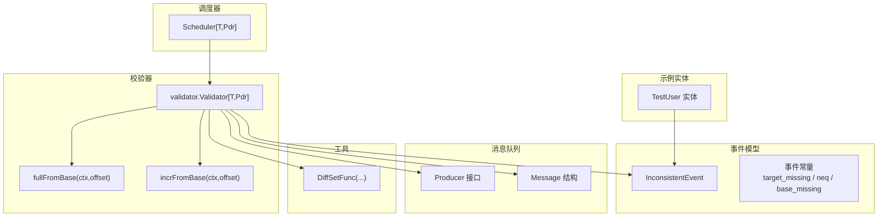
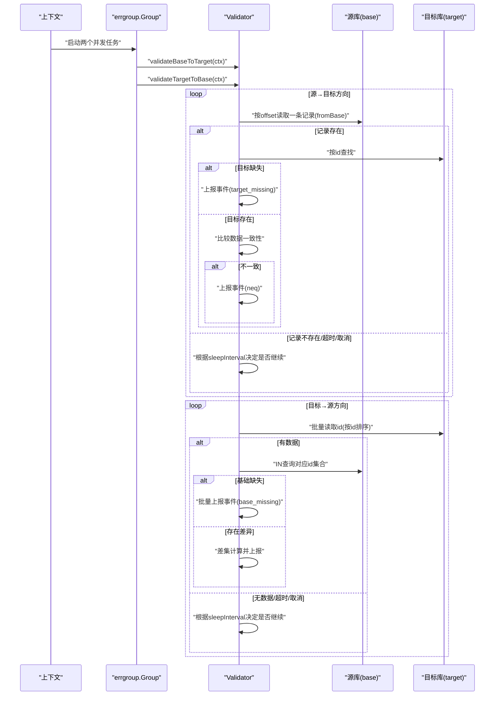
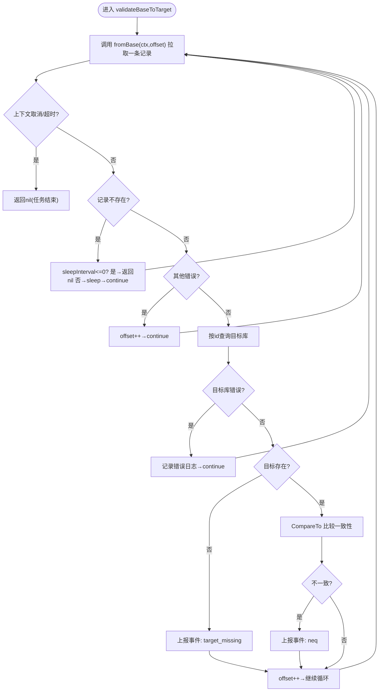
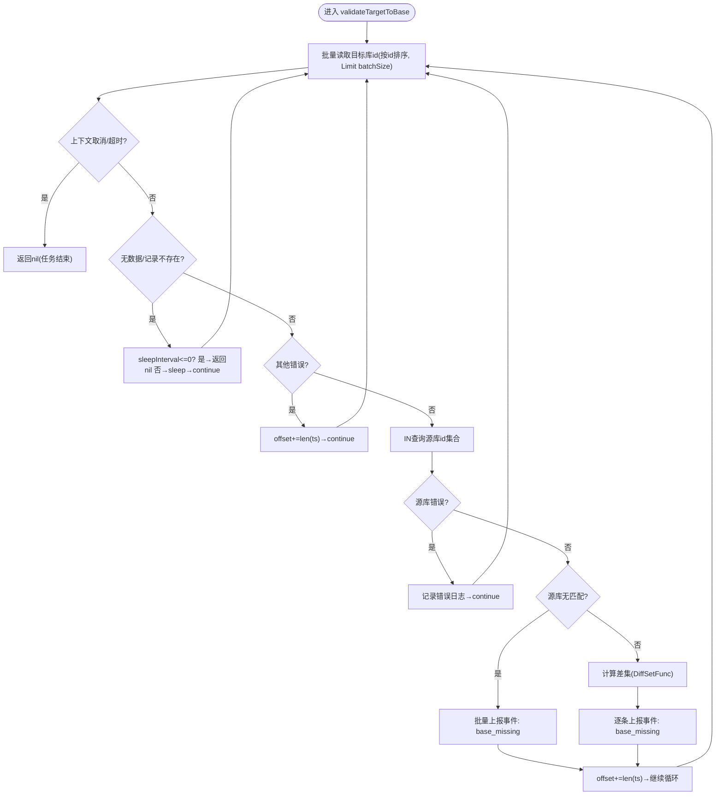
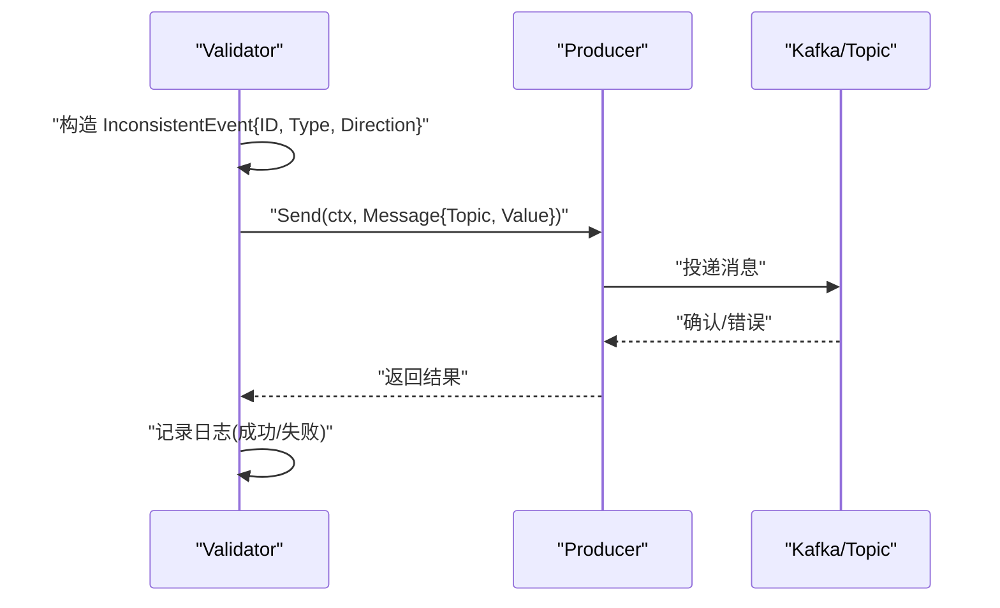
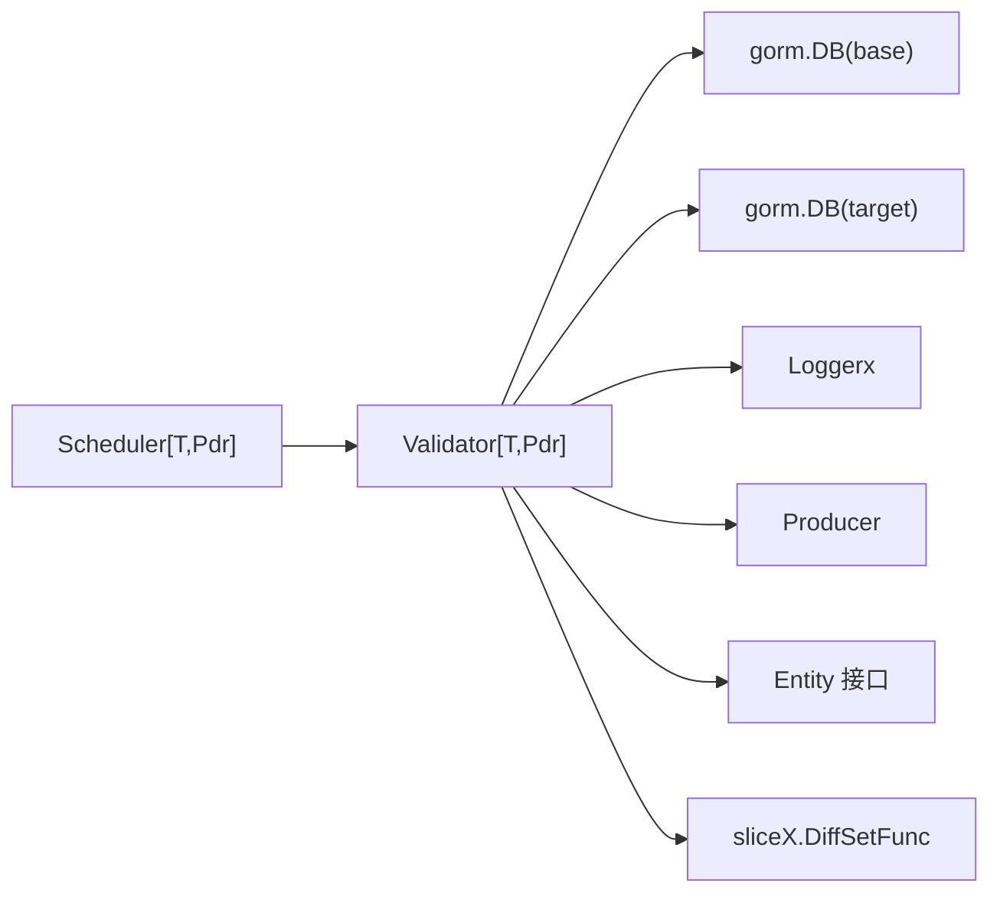

# 数据校验流程

<cite>
**本文引用的文件列表**
- [validator.go](file://DBx/mysqlX/gormx/dbMovex/myMovex/validator/validator.go)
- [inconsistent.go](file://DBx/mysqlX/gormx/dbMovex/myMovex/events/inconsistent.go)
- [types.go](file://DBx/mysqlX/gormx/dbMovex/myMovex/scheduler/types.go)
- [scheduler.go](file://DBx/mysqlX/gormx/dbMovex/myMovex/scheduler/scheduler.go)
- [structTest.go](file://DBx/mysqlX/gormx/dbMovex/myMovex/events/structTest.go)
- [mqX/types.go](file://channelx/mqX/types.go)
- [diff.go](file://sliceX/diff.go)
- [help_doc.txt](file://DBx/mysqlX/gormx/dbMovex/myMovex/help_doc.txt)
</cite>

## 目录
1. [引言](#引言)
2. [项目结构](#项目结构)
3. [核心组件](#核心组件)
4. [架构总览](#架构总览)
5. [详细组件分析](#详细组件分析)
6. [依赖关系分析](#依赖关系分析)
7. [性能考量](#性能考量)
8. [故障排查指南](#故障排查指南)
9. [结论](#结论)

## 引言
本文件围绕“数据校验器”的双向校验流程展开，重点解释 validateBaseToTarget 和 validateTargetToBase 两个并发任务的执行机制。文档将说明：
- validateBaseToTarget 如何通过 fromBase 函数（可配置为 fullFromBase 或 incrFromBase）从源库拉取数据，并逐条比对目标库是否存在及数据一致性；
- validateTargetToBase 如何批量从目标库读取 ID，再反向查询源库以发现目标库中冗余的数据；
- 整个校验过程中的错误处理策略、日志记录以及如何通过 errgroup 实现并发控制；
- 提供流程图展示数据流向和判断逻辑。

## 项目结构
与数据校验器直接相关的模块包括：
- 校验器实现：validator 包
- 不一致事件模型：events 包
- 调度器与启动入口：scheduler 包
- 消息队列接口：channelx/mqX
- 差集工具：sliceX/diff
- 示例实体：events/structTest

图表来源
- [validator.go](file://DBx/mysqlX/gormx/dbMovex/myMovex/validator/validator.go#L1-L256)
- [inconsistent.go](file://DBx/mysqlX/gormx/dbMovex/myMovex/events/inconsistent.go#L1-L21)
- [scheduler.go](file://DBx/mysqlX/gormx/dbMovex/myMovex/scheduler/scheduler.go#L1-L447)
- [mqX/types.go](file://channelx/mqX/types.go#L1-L71)
- [diff.go](file://sliceX/diff.go#L1-L33)
- [structTest.go](file://DBx/mysqlX/gormx/dbMovex/myMovex/events/structTest.go#L1-L36)

章节来源
- [validator.go](file://DBx/mysqlX/gormx/dbMovex/myMovex/validator/validator.go#L1-L256)
- [scheduler.go](file://DBx/mysqlX/gormx/dbMovex/myMovex/scheduler/scheduler.go#L1-L447)
- [mqX/types.go](file://channelx/mqX/types.go#L1-L71)
- [diff.go](file://sliceX/diff.go#L1-L33)
- [structTest.go](file://DBx/mysqlX/gormx/dbMovex/myMovex/events/structTest.go#L1-L36)

## 核心组件
- 校验器 Validator[T,Pdr]
  - 负责双向校验：validateBaseToTarget（源→目标）与 validateTargetToBase（目标→源）
  - 支持两种数据源拉取策略：fullFromBase（全量按 id 递增）与 incrFromBase（增量按 utime 过滤）
  - 通过 errgroup 并发执行两个方向的校验
  - 通过消息队列上报不一致事件
- 事件模型 InconsistentEvent
  - 定义不一致事件的字段与类型常量
- 调度器 Scheduler[T,Pdr]
  - 提供 HTTP 接口启动/停止全量/增量校验
  - 根据当前双写模式选择校验方向（SRC/DST），并创建 Validator
- 工具函数
  - DiffSetFunc 用于计算差集，识别目标库中冗余的数据
- 示例实体 TestUser
  - 展示如何实现 Entity 接口（ID、CompareTo、Types）

章节来源
- [validator.go](file://DBx/mysqlX/gormx/dbMovex/myMovex/validator/validator.go#L1-L256)
- [inconsistent.go](file://DBx/mysqlX/gormx/dbMovex/myMovex/events/inconsistent.go#L1-L21)
- [scheduler.go](file://DBx/mysqlX/gormx/dbMovex/myMovex/scheduler/scheduler.go#L1-L447)
- [structTest.go](file://DBx/mysqlX/gormx/dbMovex/myMovex/events/structTest.go#L1-L36)
- [mqX/types.go](file://channelx/mqX/types.go#L1-L71)
- [diff.go](file://sliceX/diff.go#L1-L33)

## 架构总览
双向校验通过并发任务并行执行，分别从两个方向扫描数据，确保一致性：
- validateBaseToTarget：从源库逐条读取，查目标库是否缺失或不一致
- validateTargetToBase：从目标库批量读取 ID，反查源库，发现冗余数据
- 错误处理：对上下文取消/超时、记录不存在、数据库错误等场景进行降级与日志记录
- 并发控制：使用 errgroup 等待两个任务完成，保证整体校验生命周期可控

图表来源
- [validator.go](file://DBx/mysqlX/gormx/dbMovex/myMovex/validator/validator.go#L63-L232)
- [mqX/types.go](file://channelx/mqX/types.go#L1-L71)

## 详细组件分析

### 校验器 Validator 的双向校验机制
- 并发执行
  - Validate 使用 errgroup 并发启动两个任务：validateBaseToTarget 与 validateTargetToBase
  - 任一任务返回错误都会被收集，Wait() 返回聚合错误
- 源→目标方向（validateBaseToTarget）
  - 使用 fromBase 拉取源库记录（支持全量或增量）
  - 对每条记录在目标库按 id 查找，若不存在则上报“目标缺失”，若存在则比较数据一致性（CompareTo），不一致则上报“不一致”
  - 对数据库错误、记录不存在、上下文取消/超时进行分支处理，必要时休眠并继续
- 目标→源方向（validateTargetToBase）
  - 从目标库批量读取 id（按 id 排序，Limit batchSize）
  - 将批量 id IN 查询回源库，若源库无任何匹配则批量上报“基础缺失”；若有差异则计算差集并逐条上报
  - 对数据库错误、记录不存在、上下文取消/超时进行分支处理，必要时休眠并继续
- 错误处理与日志
  - 对不同错误类型进行区分记录（错误/警告），并输出关键字段如 id、错误原因
  - 上报不一致事件通过消息队列发送，包含事件类型、方向、id
- 并发控制
  - 通过 errgroup.Wait() 等待两个任务完成，避免资源泄漏
  - 通过 sleepInterval 控制空闲轮询节奏，降低数据库压力

图表来源
- [validator.go](file://DBx/mysqlX/gormx/dbMovex/myMovex/validator/validator.go#L80-L132)

图表来源
- [validator.go](file://DBx/mysqlX/gormx/dbMovex/myMovex/validator/validator.go#L174-L232)
- [diff.go](file://sliceX/diff.go#L1-L33)

章节来源
- [validator.go](file://DBx/mysqlX/gormx/dbMovex/myMovex/validator/validator.go#L63-L232)
- [diff.go](file://sliceX/diff.go#L1-L33)

### fromBase 的两种实现策略
- fullFromBase
  - 以 id 递增的方式从源库按 offset 读取下一条记录
  - 适用于全量校验，确保覆盖所有历史数据
- incrFromBase
  - 以 utime 为过滤条件，按 utime 递增读取新变更
  - 适用于持续增量校验，结合 SleepInterval 实现低频轮询

章节来源
- [validator.go](file://DBx/mysqlX/gormx/dbMovex/myMovex/validator/validator.go#L134-L172)

### 事件上报与消息队列
- 事件模型
  - InconsistentEvent 包含 id、方向（SRC/DST）、类型（target_missing/neq/base_missing）
- 上报流程
  - 校验器内部通过 notify/notifyBaseMissing 将事件序列化为 JSON，发送到指定 Topic
  - Producer 接口抽象，支持同步/异步发送
- 方向选择
  - 调度器根据当前双写模式选择校验方向（SRC/DST），从而在事件中体现方向

图表来源
- [validator.go](file://DBx/mysqlX/gormx/dbMovex/myMovex/validator/validator.go#L234-L256)
- [inconsistent.go](file://DBx/mysqlX/gormx/dbMovex/myMovex/events/inconsistent.go#L1-L21)
- [mqX/types.go](file://channelx/mqX/types.go#L1-L71)

章节来源
- [validator.go](file://DBx/mysqlX/gormx/dbMovex/myMovex/validator/validator.go#L234-L256)
- [inconsistent.go](file://DBx/mysqlX/gormx/dbMovex/myMovex/events/inconsistent.go#L1-L21)
- [mqX/types.go](file://channelx/mqX/types.go#L1-L71)

### 调度器与启动入口
- 调度器负责：
  - 提供 HTTP 接口切换双写模式与启动/停止全量/增量校验
  - 根据当前模式创建 Validator（方向为 SRC 或 DST）
  - 统计校验运行次数、错误信息等
- 启动流程
  - 全量/增量校验通过 goroutine 启动，内部使用 Validate(ctx) 并发执行双向校验
  - 支持取消（cancelIncr/cancelFull）

章节来源
- [scheduler.go](file://DBx/mysqlX/gormx/dbMovex/myMovex/scheduler/scheduler.go#L1-L447)
- [help_doc.txt](file://DBx/mysqlX/gormx/dbMovex/myMovex/help_doc.txt#L1-L18)

## 依赖关系分析
- 组件耦合
  - Validator 依赖 GORM 数据库连接（base/target）、日志接口、消息队列 Producer、实体接口（Entity）
  - Scheduler 依赖 Validator、Producer、双写池状态，用于选择校验方向
- 外部依赖
  - golang.org/x/sync/errgroup：并发控制
  - gorm.io/gorm：数据库 ORM
  - channelx/mqX：消息队列抽象
  - sliceX：差集计算工具

图表来源
- [validator.go](file://DBx/mysqlX/gormx/dbMovex/myMovex/validator/validator.go#L1-L256)
- [scheduler.go](file://DBx/mysqlX/gormx/dbMovex/myMovex/scheduler/scheduler.go#L1-L447)

章节来源
- [validator.go](file://DBx/mysqlX/gormx/dbMovex/myMovex/validator/validator.go#L1-L256)
- [scheduler.go](file://DBx/mysqlX/gormx/dbMovex/myMovex/scheduler/scheduler.go#L1-L447)

## 性能考量
- 批量读取与反查
  - validateTargetToBase 使用批量读取与 IN 查询，减少往返次数，提高效率
- 分页与偏移
  - 两个方向均使用 offset 逐步推进，避免一次性加载全部数据
- 轮询节流
  - 通过 SleepInterval 在无数据或空闲时休眠，降低数据库压力
- 并发控制
  - 使用 errgroup 并发执行两个方向，缩短总耗时；Wait() 保证任务收敛
- 日志与监控
  - 对错误与警告进行分级记录，便于定位问题与性能瓶颈

[本节为通用建议，无需列出具体文件来源]

## 故障排查指南
- 常见错误与处理
  - 上下文取消/超时：validateBaseToTarget/validateTargetToBase 在检测到取消/超时时返回，避免阻塞
  - 记录不存在：在增量模式下，若无新数据且设置了 sleepInterval，则休眠等待；否则返回
  - 数据库错误：记录错误日志并继续推进（offset++ 或 offset+=len(ts)），避免单点失败导致整个校验中断
- 日志定位
  - 关注“base -> target 查询 base/目标失败”、“target => base 查询 target/base 失败”等关键日志
  - 事件上报失败也会记录错误日志，便于追踪消息队列问题
- 事件核对
  - 通过消息队列订阅 Topic，结合事件类型（target_missing/neq/base_missing）与方向（SRC/DST）快速定位问题数据

章节来源
- [validator.go](file://DBx/mysqlX/gormx/dbMovex/myMovex/validator/validator.go#L80-L232)
- [mqX/types.go](file://channelx/mqX/types.go#L1-L71)

## 结论
双向校验通过 validateBaseToTarget 与 validateTargetToBase 两个并发任务，从源→目标与目标→源两个方向全面覆盖数据一致性需求。其设计要点包括：
- 可配置的数据源拉取策略（全量/增量）
- 并发控制与错误降级，保障稳定性
- 事件驱动的上报机制，便于后续修复与审计
- 调度器统一入口，支持 HTTP 控制与统计

[本节为总结性内容，无需列出具体文件来源]