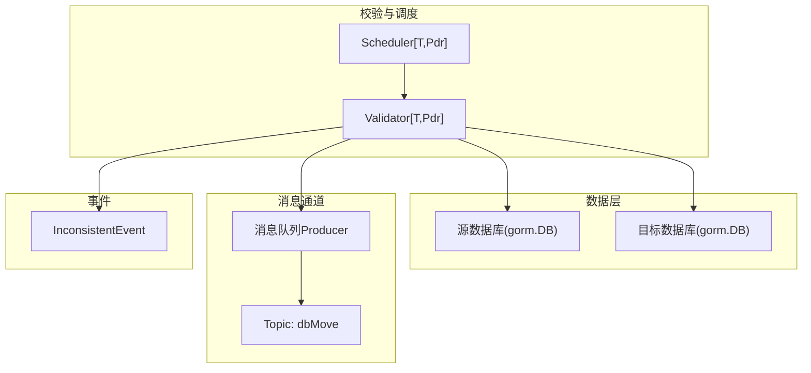
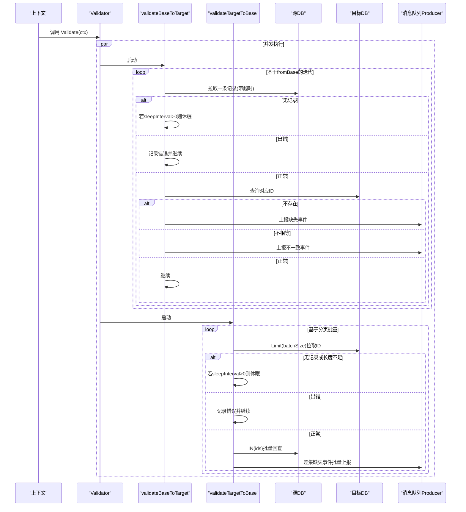
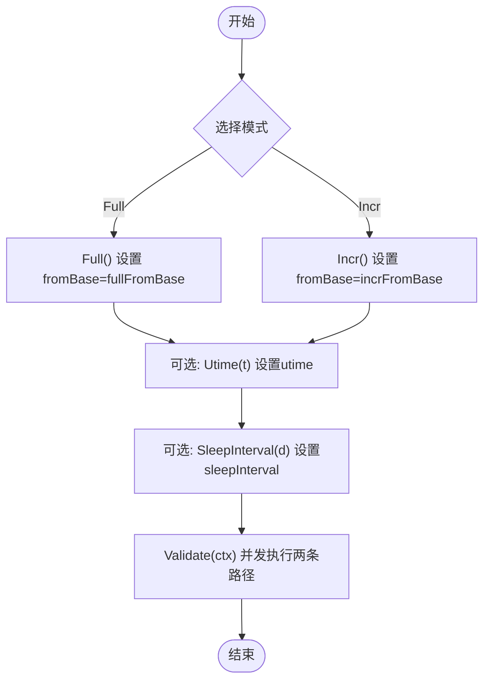
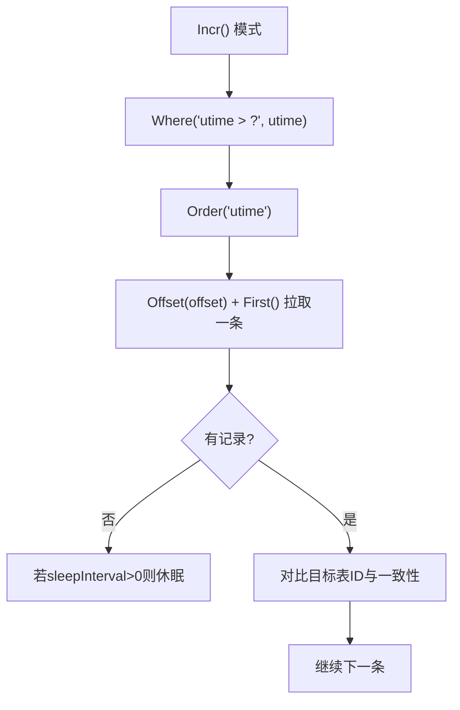
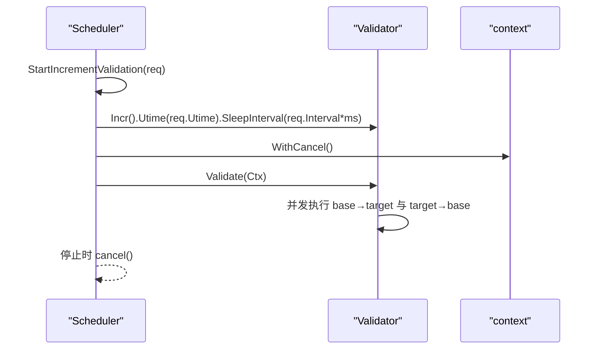
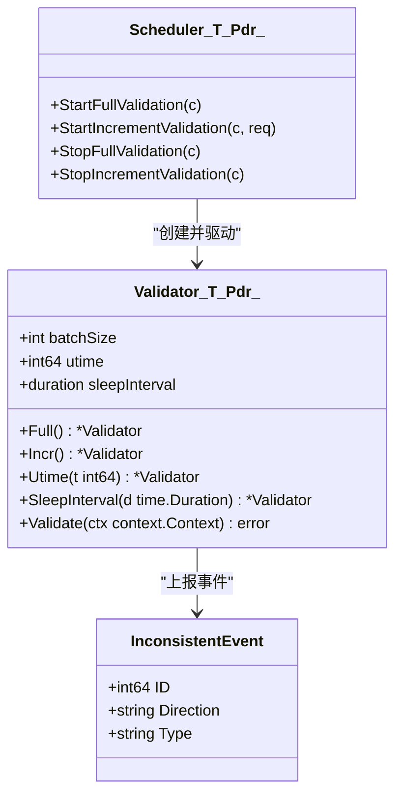

# 配置选项与性能调优

<cite>
**本文引用的文件**
- [validator.go](file://DBx/mysqlX/gormx/dbMovex/myMovex/validator/validator.go)
- [inconsistent.go](file://DBx/mysqlX/gormx/dbMovex/myMovex/events/inconsistent.go)
- [scheduler.go](file://DBx/mysqlX/gormx/dbMovex/myMovex/scheduler/scheduler.go)
- [scheduler_test.go](file://DBx/mysqlX/gormx/dbMovex/myMovex/scheduler/scheduler_test.go)
- [help_doc.txt](file://DBx/mysqlX/gormx/dbMovex/myMovex/help_doc.txt)
</cite>

## 目录
1. [简介](#简介)
2. [项目结构](#项目结构)
3. [核心组件](#核心组件)
4. [架构总览](#架构总览)
5. [详细组件分析](#详细组件分析)
6. [依赖关系分析](#依赖关系分析)
7. [性能考量与调优建议](#性能考量与调优建议)
8. [故障排查指南](#故障排查指南)
9. [结论](#结论)

## 简介
本文件系统化梳理 Validator 的可配置参数及其对行为的影响，重点覆盖：
- batchSize 参数在 validateTargetToBase 中控制批量查询大小的作用
- sleepInterval 参数在无数据时的休眠控制，用于调节校验频率
- utime 参数在增量校验模式下的时间戳基准作用
并解释 Full() 与 Incr() 方法如何切换全量与增量校验模式，以及 Utime()、SleepInterval() 等链式配置方法的使用方式。最后给出基于数据量与系统负载的性能调优建议。

## 项目结构
Validator 位于数据库迁移与一致性校验子系统中，配合调度器 Scheduler 提供全量/增量校验能力，并通过消息队列上报不一致事件。

图表来源
- [validator.go](file://DBx/mysqlX/gormx/dbMovex/myMovex/validator/validator.go#L1-L256)
- [scheduler.go](file://DBx/mysqlX/gormx/dbMovex/myMovex/scheduler/scheduler.go#L1-L200)
- [inconsistent.go](file://DBx/mysqlX/gormx/dbMovex/myMovex/events/inconsistent.go#L1-L21)

章节来源
- [validator.go](file://DBx/mysqlX/gormx/dbMovex/myMovex/validator/validator.go#L1-L256)
- [scheduler.go](file://DBx/mysqlX/gormx/dbMovex/myMovex/scheduler/scheduler.go#L1-L200)
- [help_doc.txt](file://DBx/mysqlX/gormx/dbMovex/myMovex/help_doc.txt#L1-L18)

## 核心组件
- Validator[T, Pdr]：通用校验器，支持并发双向校验（base→target 与 target→base），内置全量/增量两种模式，支持批量查询与休眠节流。
- Scheduler[T, Pdr]：调度器，负责启动/停止全量/增量校验，维护状态与统计，桥接 Validator 与消息队列。
- InconsistentEvent：不一致事件模型，用于上报缺失或不一致的数据标识与方向。

章节来源
- [validator.go](file://DBx/mysqlX/gormx/dbMovex/myMovex/validator/validator.go#L1-L256)
- [inconsistent.go](file://DBx/mysqlX/gormx/dbMovex/myMovex/events/inconsistent.go#L1-L21)
- [scheduler.go](file://DBx/mysqlX/gormx/dbMovex/myMovex/scheduler/scheduler.go#L1-L200)

## 架构总览
Validator 的 Validate 方法并发执行两条路径：
- base→target：按偏移逐条拉取源数据，对比目标数据是否存在与相等，若不一致则上报事件。
- target→base：按 batchSize 分页批量拉取目标表 ID，再批量回查源表，计算差集并上报缺失事件。

图表来源
- [validator.go](file://DBx/mysqlX/gormx/dbMovex/myMovex/validator/validator.go#L62-L232)

## 详细组件分析

### 配置参数与行为影响
- batchSize
  - 作用位置：validateTargetToBase 中对目标库执行分页查询时使用 Limit(batchSize)，决定每次批量拉取的记录数。
  - 影响：较大的 batchSize 可减少往返次数，提升吞吐；但会增加单次查询与回查的内存占用与网络压力；当返回长度小于 batchSize 时，通常视为“无更多数据”，随后可能依据 sleepInterval 决定是否休眠。
  - 默认值：构造函数中初始化为 100。
- sleepInterval
  - 作用位置：在 base→target 与 target→base 两条路径均存在“无数据”分支，当无数据且 sleepInterval > 0 时执行休眠，避免忙轮询。
  - 影响：增大 sleepInterval 可降低 CPU 占用与数据库压力，但会提高校验周期；设置为 0 或负值表示“无休眠，尽快退出”。
- utime
  - 作用位置：增量模式下，fromBase 使用 Where("utime > ?") 进行过滤，utime 作为时间戳基准。
  - 影响：utime 越新，增量范围越小，校验越快；过旧可能导致重复扫描历史数据。

章节来源
- [validator.go](file://DBx/mysqlX/gormx/dbMovex/myMovex/validator/validator.go#L41-L47)
- [validator.go](file://DBx/mysqlX/gormx/dbMovex/myMovex/validator/validator.go#L56-L59)
- [validator.go](file://DBx/mysqlX/gormx/dbMovex/myMovex/validator/validator.go#L81-L132)
- [validator.go](file://DBx/mysqlX/gormx/dbMovex/myMovex/validator/validator.go#L134-L172)
- [validator.go](file://DBx/mysqlX/gormx/dbMovex/myMovex/validator/validator.go#L174-L232)

### 模式切换与链式配置
- Full() 与 Incr()
  - Full()：将内部迭代器 fromBase 切换为全量模式，按 id 顺序拉取。
  - Incr()：将内部迭代器 fromBase 切换为增量模式，按 utime 顺序拉取。
- Utime(t int64) 与 SleepInterval(interval time.Duration)
  - Utime()：设置增量校验的时间戳基准。
  - SleepInterval()：设置无数据时的休眠间隔。
- Validate(ctx)
  - 并发启动两条校验路径，等待全部完成。

图表来源
- [validator.go](file://DBx/mysqlX/gormx/dbMovex/myMovex/validator/validator.go#L134-L172)
- [validator.go](file://DBx/mysqlX/gormx/dbMovex/myMovex/validator/validator.go#L144-L152)
- [validator.go](file://DBx/mysqlX/gormx/dbMovex/myMovex/validator/validator.go#L62-L78)

章节来源
- [validator.go](file://DBx/mysqlX/gormx/dbMovex/myMovex/validator/validator.go#L134-L172)
- [validator.go](file://DBx/mysqlX/gormx/dbMovex/myMovex/validator/validator.go#L144-L152)
- [validator.go](file://DBx/mysqlX/gormx/dbMovex/myMovex/validator/validator.go#L62-L78)

### 增量校验流程细节
- 增量模式下，fromBase 使用 utime > 基准过滤，按 utime 升序拉取。
- validateTargetToBase 在每批次结束后，若本次返回长度小于 batchSize，通常认为“无更多数据”，随后根据 sleepInterval 决定是否休眠。

图表来源
- [validator.go](file://DBx/mysqlX/gormx/dbMovex/myMovex/validator/validator.go#L163-L171)
- [validator.go](file://DBx/mysqlX/gormx/dbMovex/myMovex/validator/validator.go#L81-L132)

章节来源
- [validator.go](file://DBx/mysqlX/gormx/dbMovex/myMovex/validator/validator.go#L163-L171)
- [validator.go](file://DBx/mysqlX/gormx/dbMovex/myMovex/validator/validator.go#L81-L132)

### 全量与增量模式切换的实际使用
- 调度器通过链式配置启动增量校验：Incr().Utime(req.Utime).SleepInterval(time.Duration(req.Interval)*time.Millisecond)，随后并发执行 Validate(ctx)。
- 全量校验通过 StartFullValidation 启动，内部同样使用 Validator 并发校验。

图表来源
- [scheduler.go](file://DBx/mysqlX/gormx/dbMovex/myMovex/scheduler/scheduler.go#L217-L247)
- [validator.go](file://DBx/mysqlX/gormx/dbMovex/myMovex/validator/validator.go#L62-L78)

章节来源
- [scheduler.go](file://DBx/mysqlX/gormx/dbMovex/myMovex/scheduler/scheduler.go#L217-L247)
- [scheduler_test.go](file://DBx/mysqlX/gormx/dbMovex/myMovex/scheduler/scheduler_test.go#L152-L181)

## 依赖关系分析
- Validator 依赖：
  - 数据库：gorm.DB（源与目标）
  - 日志：logx.Loggerx
  - 消息队列：mqX.Producer 与 Topic
  - 工具：sliceX（Map/DiffSetFunc）
- Scheduler 依赖：
  - Validator 实例
  - 消息队列 Producer
  - 状态与统计结构体

图表来源
- [validator.go](file://DBx/mysqlX/gormx/dbMovex/myMovex/validator/validator.go#L1-L256)
- [scheduler.go](file://DBx/mysqlX/gormx/dbMovex/myMovex/scheduler/scheduler.go#L1-L200)
- [inconsistent.go](file://DBx/mysqlX/gormx/dbMovex/myMovex/events/inconsistent.go#L1-L21)

章节来源
- [validator.go](file://DBx/mysqlX/gormx/dbMovex/myMovex/validator/validator.go#L1-L256)
- [scheduler.go](file://DBx/mysqlX/gormx/dbMovex/myMovex/scheduler/scheduler.go#L1-L200)
- [inconsistent.go](file://DBx/mysqlX/gormx/dbMovex/myMovex/events/inconsistent.go#L1-L21)

## 性能考量与调优建议
- batchSize
  - 数据量大、网络延迟高：适当增大 batchSize，减少往返次数，提升吞吐；注意控制单次回查集合大小，避免内存峰值过高。
  - 数据量小、CPU 资源紧张：减小 batchSize，降低单次查询与回查成本，缓解瞬时压力。
  - 与 sleepInterval 协同：当 batchSize 较大时，若仍频繁无数据，可适度增大 sleepInterval，避免忙轮询。
- sleepInterval
  - 增量场景：若数据稀疏，可增大 sleepInterval，降低轮询频率；若需要快速发现新变更，可减小 sleepInterval。
  - 全量场景：若数据量极大，可结合较小 batchSize 与适中 sleepInterval，避免一次性扫描造成抖动。
- utime
  - 增量校验应基于最近一次成功校验的时刻设置 utime，避免扫描历史数据；若系统重启或时间回退，应谨慎设置 utime，防止遗漏或重复。
- 并发与资源
  - Validate 并发执行两条路径，注意数据库连接池容量与并发限制，避免阻塞。
  - 消息队列端应具备批量消费能力，避免上报事件成为瓶颈。

[本节为通用性能建议，不直接分析具体文件，故无章节来源]

## 故障排查指南
- 无数据时持续运行
  - 若无数据且 sleepInterval <= 0，两条路径会直接退出；若希望持续运行，确保 sleepInterval > 0。
- 查询失败与记录不存在
  - 对于 gorm.ErrRecordNotFound，两条路径均会记录日志并继续；对于查询错误，会记录错误并推进偏移。
- 事件上报失败
  - notify 发送失败会记录错误日志，便于定位消息队列问题。

章节来源
- [validator.go](file://DBx/mysqlX/gormx/dbMovex/myMovex/validator/validator.go#L81-L132)
- [validator.go](file://DBx/mysqlX/gormx/dbMovex/myMovex/validator/validator.go#L174-L232)
- [validator.go](file://DBx/mysqlX/gormx/dbMovex/myMovex/validator/validator.go#L241-L256)

## 结论
- batchSize 控制 validateTargetToBase 的批量规模，直接影响吞吐与资源占用。
- sleepInterval 控制无数据时的休眠策略，平衡 CPU 占用与响应速度。
- utime 为增量校验提供时间基准，决定扫描范围。
- Full()/Incr() 切换模式，Utime()/SleepInterval() 提供链式配置，Validate() 并发执行两条路径，形成高效的一致性校验闭环。
- 结合业务数据规模与系统负载，合理设置 batchSize 与 sleepInterval，可显著提升稳定性与效率。