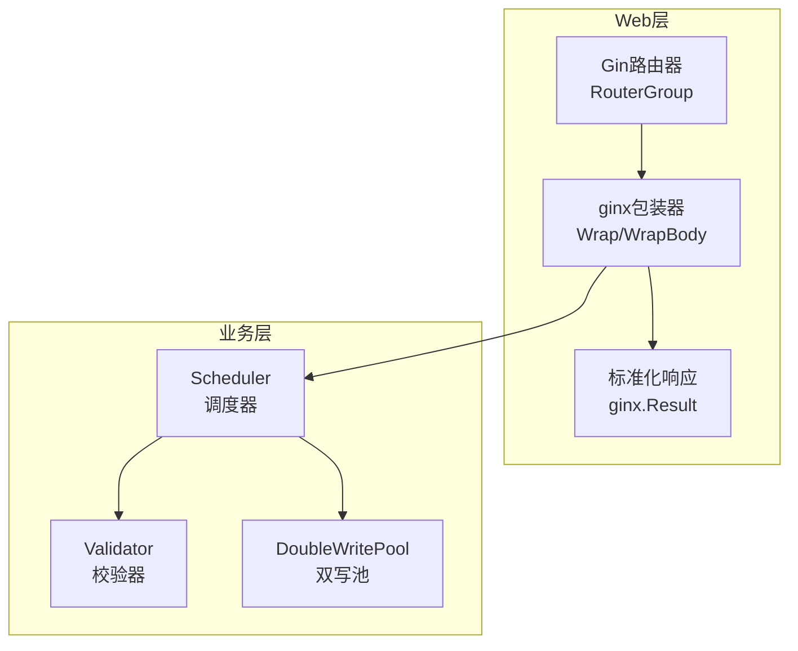
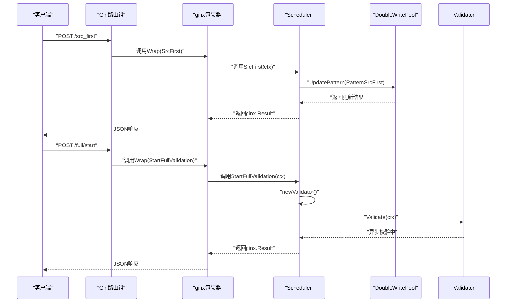
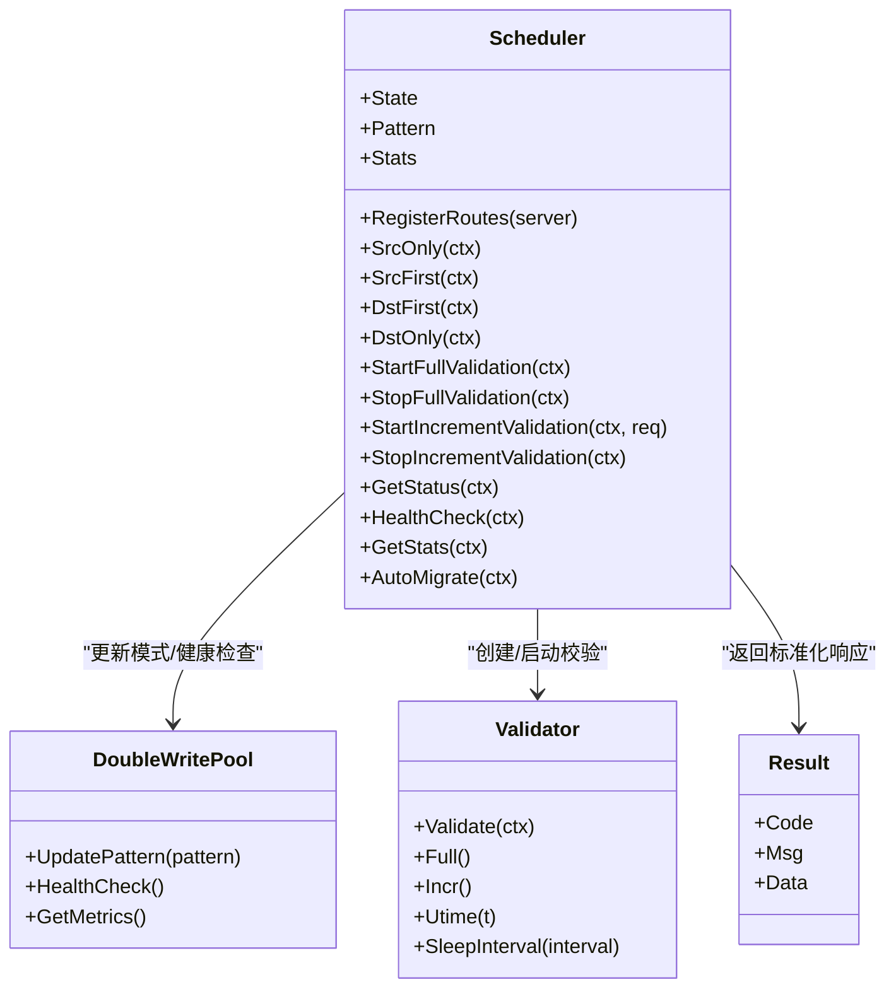

# API端点与路由控制

<cite>
**本文引用的文件列表**
- [scheduler.go](file://DBx/mysqlX/gormx/dbMovex/myMovex/scheduler/scheduler.go)
- [double_write_pool.go](file://DBx/mysqlX/gormx/dbMovex/myMovex/doubleWritePoolx/double_write_pool.go)
- [validator.go](file://DBx/mysqlX/gormx/dbMovex/myMovex/validator/validator.go)
- [wrapper_func.go](file://webx/ginx/wrapper_func.go)
- [result.go](file://webx/ginx/result.go)
- [migrator.go](file://DBx/mysqlX/gormx/dbMovex/myMovex/migrator.go)
- [scheduler_test.go](file://DBx/mysqlX/gormx/dbMovex/myMovex/scheduler/scheduler_test.go)
</cite>

## 目录
1. [简介](#简介)
2. [项目结构](#项目结构)
3. [核心组件](#核心组件)
4. [架构总览](#架构总览)
5. [详细组件分析](#详细组件分析)
6. [依赖关系分析](#依赖关系分析)
7. [性能考量](#性能考量)
8. [故障排查指南](#故障排查指南)
9. [结论](#结论)

## 简介
本文件面向迁移调度器暴露的HTTP API端点，聚焦于RegisterRoutes方法如何为Gin框架注册一系列控制端点，并对每个端点的功能、HTTP方法、请求路径、预期行为进行深入说明。同时解释ginx.Wrap与ginx.WrapBody如何将调度器方法包装为Gin处理器并返回标准化的ginx.Result，最后给出每个API的请求/响应示例与错误码说明，帮助开发者快速集成与排障。

## 项目结构
围绕迁移调度器的API端点，涉及以下关键模块：
- 调度器：负责状态机、双写模式切换、校验任务启停、健康检查与统计信息等
- 双写池：抽象底层数据库双写策略与模式切换
- 校验器：实现全量/增量校验，异步上报不一致事件
- Web包装层：统一将业务方法包装为Gin处理器，输出标准化结果

图表来源
- [scheduler.go](file://DBx/mysqlX/gormx/dbMovex/myMovex/scheduler/scheduler.go#L103-L123)
- [wrapper_func.go](file://webx/ginx/wrapper_func.go#L65-L130)
- [result.go](file://webx/ginx/result.go#L1-L8)
- [double_write_pool.go](file://DBx/mysqlX/gormx/dbMovex/myMovex/doubleWritePoolx/double_write_pool.go#L109-L119)
- [validator.go](file://DBx/mysqlX/gormx/dbMovex/myMovex/validator/validator.go#L1-L60)

章节来源
- [scheduler.go](file://DBx/mysqlX/gormx/dbMovex/myMovex/scheduler/scheduler.go#L103-L123)

## 核心组件
- 调度器（Scheduler）：维护当前状态、双写模式、统计信息，提供模式切换、校验启停、健康检查、统计查询等接口，并通过RegisterRoutes在Gin上注册端点。
- 双写池（DoubleWritePool）：抽象双写策略，支持四种模式（仅源库、源库优先、目标库优先、仅目标库），提供UpdatePattern、HealthCheck、GetMetrics等能力。
- 校验器（Validator）：基于实体接口进行一致性校验，支持全量与增量两种模式，异步上报不一致事件至消息队列。
- Web包装器（ginx）：提供Wrap、WrapBody等包装函数，统一处理参数绑定、鉴权、错误日志与标准化响应。

章节来源
- [scheduler.go](file://DBx/mysqlX/gormx/dbMovex/myMovex/scheduler/scheduler.go#L46-L123)
- [double_write_pool.go](file://DBx/mysqlX/gormx/dbMovex/myMovex/doubleWritePoolx/double_write_pool.go#L109-L119)
- [validator.go](file://DBx/mysqlX/gormx/dbMovex/myMovex/validator/validator.go#L1-L60)
- [wrapper_func.go](file://webx/ginx/wrapper_func.go#L65-L130)
- [result.go](file://webx/ginx/result.go#L1-L8)

## 架构总览
下图展示从客户端请求到业务处理再到响应输出的整体流程，以及各组件之间的调用关系。

图表来源
- [scheduler.go](file://DBx/mysqlX/gormx/dbMovex/myMovex/scheduler/scheduler.go#L103-L123)
- [wrapper_func.go](file://webx/ginx/wrapper_func.go#L114-L130)
- [double_write_pool.go](file://DBx/mysqlX/gormx/dbMovex/myMovex/doubleWritePoolx/double_write_pool.go#L109-L119)
- [validator.go](file://DBx/mysqlX/gormx/dbMovex/myMovex/validator/validator.go#L62-L78)

## 详细组件分析

### RegisterRoutes与端点注册
- 注册位置：在RouterGroup上调用RegisterRoutes，将所有控制端点挂载到指定前缀下。
- 模式切换端点：POST /src_only、/src_first、/dst_first、/dst_only
- 校验控制端点：POST /full/start、/full/stop、/incr/start、/incr/stop
- 查询端点：GET /status、/health、/stats
- 自动迁移端点：POST /auto-migrate

章节来源
- [scheduler.go](file://DBx/mysqlX/gormx/dbMovex/myMovex/scheduler/scheduler.go#L103-L123)

### 模式切换端点
- /src_only
  - 方法：POST
  - 行为：将双写模式切换为“仅源库”，更新状态与统计信息
  - 成功响应：返回标准化结果，包含提示信息
  - 失败场景：若底层双写池更新失败，返回错误码与错误信息
- /src_first
  - 方法：POST
  - 行为：双写，源库优先；更新状态与统计信息
- /dst_first
  - 方法：POST
  - 行为：双写，目标库优先；更新状态与统计信息
- /dst_only
  - 方法：POST
  - 行为：仅写目标库；更新状态与统计信息

章节来源
- [scheduler.go](file://DBx/mysqlX/gormx/dbMovex/myMovex/scheduler/scheduler.go#L127-L205)
- [double_write_pool.go](file://DBx/mysqlX/gormx/dbMovex/myMovex/doubleWritePoolx/double_write_pool.go#L109-L119)

### 校验控制端点
- /full/start
  - 方法：POST
  - 行为：启动全量校验，内部创建校验器并并发执行双向校验，增加统计计数
  - 响应：返回启动成功提示
- /full/stop
  - 方法：POST
  - 行为：取消正在进行的全量校验
- /incr/start
  - 方法：POST
  - 请求体：StartIncrRequest（包含utime与interval）
  - 行为：启动增量校验，设置起始时间与轮询间隔，增加统计计数
- /incr/stop
  - 方法：POST
  - 行为：取消正在进行的增量校验

章节来源
- [scheduler.go](file://DBx/mysqlX/gormx/dbMovex/myMovex/scheduler/scheduler.go#L207-L287)
- [validator.go](file://DBx/mysqlX/gormx/dbMovex/myMovex/validator/validator.go#L62-L78)
- [scheduler.go](file://DBx/mysqlX/gormx/dbMovex/myMovex/scheduler/scheduler.go#L437-L441)

### 查询与健康端点
- /status
  - 方法：GET
  - 行为：聚合当前状态、双写模式、统计信息、双写池健康与指标、运行时长等
  - 响应：返回包含上述聚合信息的对象
- /health
  - 方法：GET
  - 行为：检查双写池健康状况，若有异常返回错误码与错误详情
- /stats
  - 方法：GET
  - 行为：返回当前统计信息对象

章节来源
- [scheduler.go](file://DBx/mysqlX/gormx/dbMovex/myMovex/scheduler/scheduler.go#L302-L348)
- [double_write_pool.go](file://DBx/mysqlX/gormx/dbMovex/myMovex/doubleWritePoolx/double_write_pool.go#L121-L146)

### 自动迁移端点
- /auto-migrate
  - 方法：POST
  - 行为：按阶段自动执行迁移流程（源库只写→源库优先+全量校验→目标库优先→目标库只写），并在每阶段更新状态
  - 响应：返回流程已启动提示

章节来源
- [scheduler.go](file://DBx/mysqlX/gormx/dbMovex/myMovex/scheduler/scheduler.go#L350-L403)

### Web包装器与标准化响应
- ginx.Wrap(fn)：将无请求体的业务方法包装为Gin处理器，统一处理错误日志与标准化响应
- ginx.WrapBody[Req](fn)：将带请求体的方法包装为Gin处理器，自动绑定请求体并处理错误与日志
- ginx.Result：标准化响应结构，包含code、msg、data三部分

章节来源
- [wrapper_func.go](file://webx/ginx/wrapper_func.go#L65-L130)
- [result.go](file://webx/ginx/result.go#L1-L8)

### 实体接口与校验器
- 实体接口：要求具备ID()、CompareTo()、Types()能力，用于校验器识别与比对
- 校验器：支持全量与增量两种模式，异步上报不一致事件至消息队列

章节来源
- [migrator.go](file://DBx/mysqlX/gormx/dbMovex/myMovex/migrator.go#L1-L12)
- [validator.go](file://DBx/mysqlX/gormx/dbMovex/myMovex/validator/validator.go#L1-L60)

## 依赖关系分析
- 调度器依赖双写池进行模式切换与健康检查，依赖校验器执行一致性校验
- Web包装器依赖ginx.Result统一输出格式
- 校验器依赖实体接口与消息队列生产者进行不一致事件上报

图表来源
- [scheduler.go](file://DBx/mysqlX/gormx/dbMovex/myMovex/scheduler/scheduler.go#L46-L123)
- [double_write_pool.go](file://DBx/mysqlX/gormx/dbMovex/myMovex/doubleWritePoolx/double_write_pool.go#L109-L119)
- [validator.go](file://DBx/mysqlX/gormx/dbMovex/myMovex/validator/validator.go#L62-L78)
- [result.go](file://webx/ginx/result.go#L1-L8)

## 性能考量
- 模式切换：使用互斥锁保护状态变更，避免并发竞态；双写池的模式更新为O(1)操作。
- 校验任务：全量/增量校验采用并发与分批策略，减少单次查询压力；支持取消与超时控制。
- 指标与日志：包装器可选地记录响应码指标，便于观测与告警；业务错误会统一记录日志。

[本节为通用指导，无需列出具体文件来源]

## 故障排查指南
- 模式切换失败
  - 现象：返回错误码与错误信息
  - 排查：确认双写池是否正确初始化、底层数据库连接是否可用
- 健康检查失败
  - 现象：返回错误码与错误详情
  - 排查：检查源库/目标库连接池状态与网络连通性
- 校验任务未生效
  - 现象：/incr/start后无数据不一致事件或/stop无效
  - 排查：确认消息队列生产者配置、Topic名称、校验器sleep间隔设置
- 自动迁移流程中断
  - 现象：全量校验未通过导致流程终止
  - 排查：查看统计信息中的不一致数量，修复数据后再执行

章节来源
- [scheduler.go](file://DBx/mysqlX/gormx/dbMovex/myMovex/scheduler/scheduler.go#L127-L205)
- [scheduler.go](file://DBx/mysqlX/gormx/dbMovex/myMovex/scheduler/scheduler.go#L207-L287)
- [scheduler.go](file://DBx/mysqlX/gormx/dbMovex/myMovex/scheduler/scheduler.go#L302-L348)
- [double_write_pool.go](file://DBx/mysqlX/gormx/dbMovex/myMovex/doubleWritePoolx/double_write_pool.go#L121-L146)

## 结论
本文档系统梳理了迁移调度器在Gin上的API端点设计与实现细节，明确了每个端点的功能、HTTP方法、请求路径与预期行为，并解释了ginx包装器如何将业务方法标准化为Gin处理器。结合双写池与校验器的能力，开发者可以安全、可控地进行双写模式切换、启动/停止校验任务，并通过/status、/health、/stats获取运行状态与健康信息。