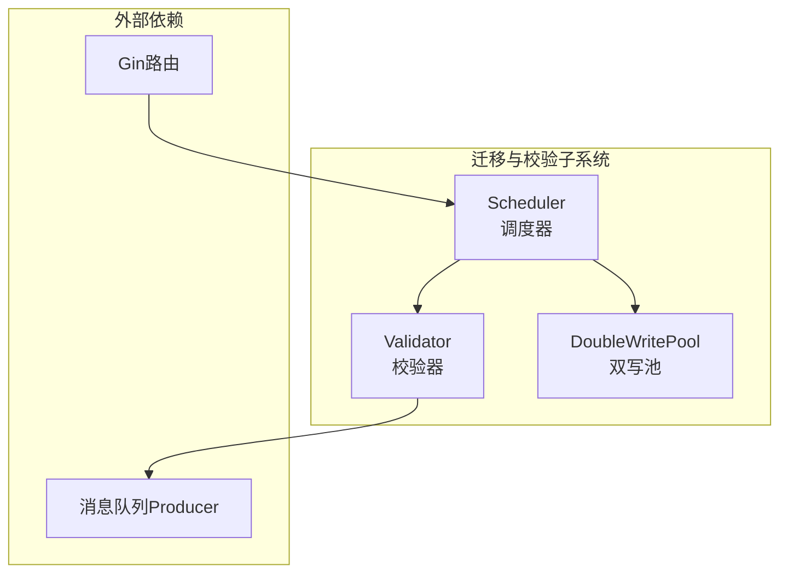
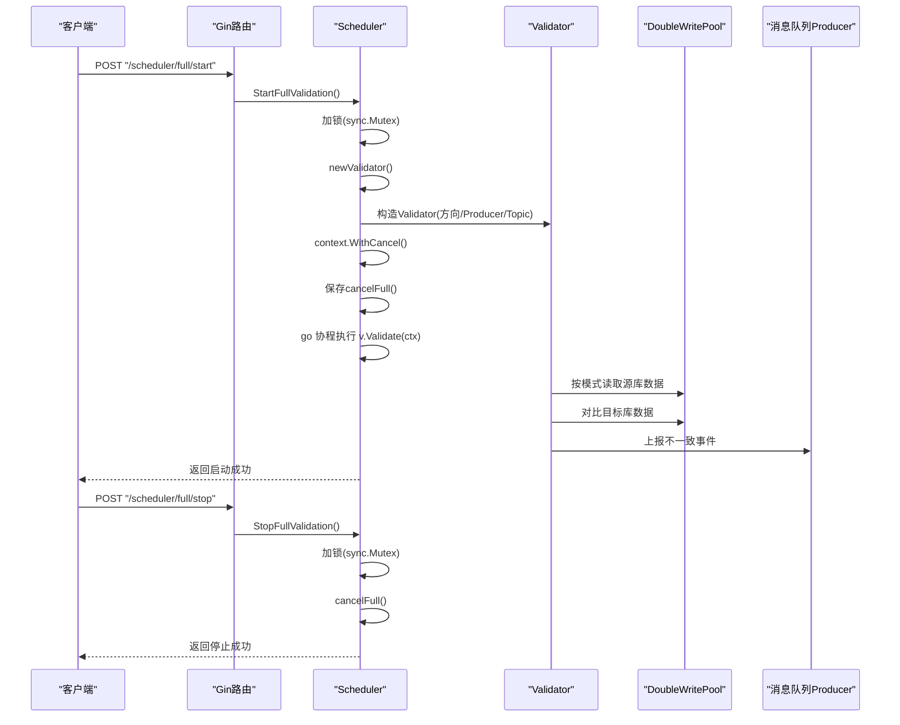
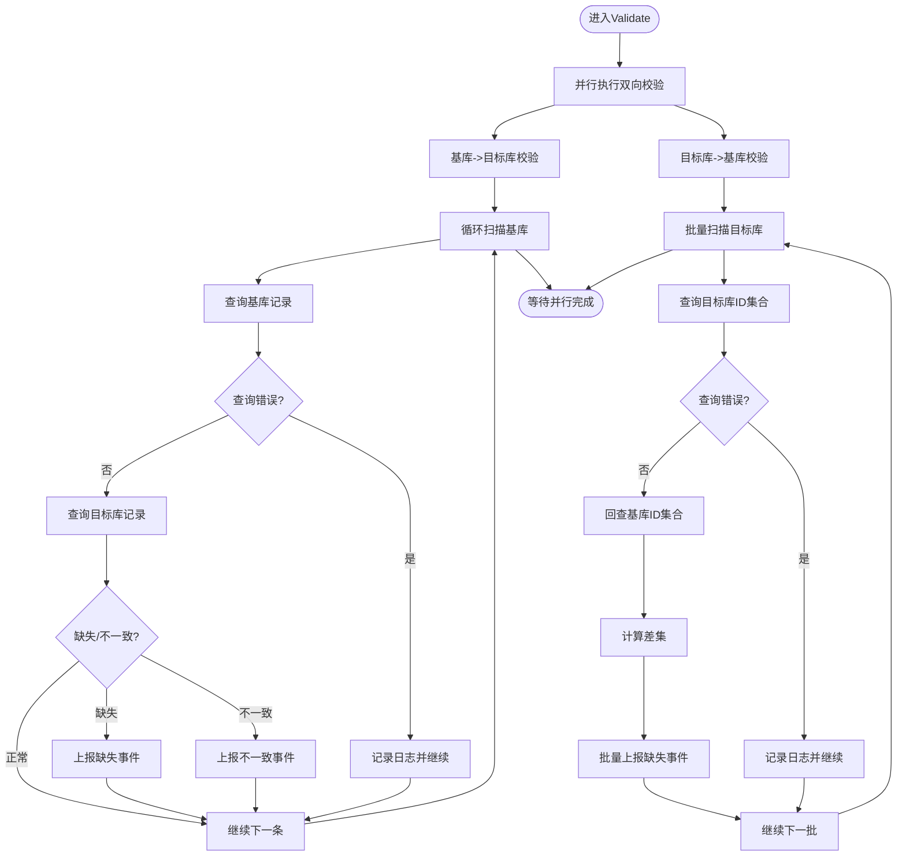
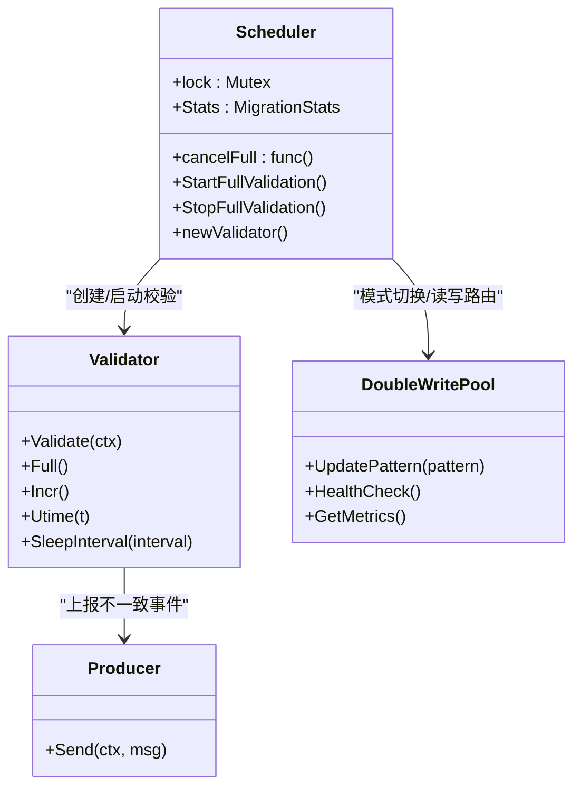

# 全量校验API

<cite>
**本文引用的文件列表**
- [scheduler.go](file://DBx/mysqlX/gormx/dbMovex/myMovex/scheduler/scheduler.go)
- [validator.go](file://DBx/mysqlX/gormx/dbMovex/myMovex/validator/validator.go)
- [double_write_pool.go](file://DBx/mysqlX/gormx/dbMovex/myMovex/doubleWritePoolx/double_write_pool.go)
- [scheduler_test.go](file://DBx/mysqlX/gormx/dbMovex/myMovex/scheduler/scheduler_test.go)
- [help_doc.txt](file://DBx/mysqlX/gormx/dbMovex/myMovex/help_doc.txt)
</cite>

## 目录
1. [简介](#简介)
2. [项目结构](#项目结构)
3. [核心组件](#核心组件)
4. [架构总览](#架构总览)
5. [详细组件分析](#详细组件分析)
6. [依赖关系分析](#依赖关系分析)
7. [性能考量](#性能考量)
8. [故障排查指南](#故障排查指南)
9. [结论](#结论)
10. [附录](#附录)

## 简介
本文件聚焦于“全量校验控制API”的深度技术文档，围绕/scheduler/full/start与/scheduler/full/stop两个POST端点展开，系统解析以下要点：
- StartFullValidation如何通过sync.Mutex保证操作的原子性
- 如何调用newValidator创建Validator实例
- 如何使用context.WithCancel启动异步校验协程
- cancelFull字段如何保存取消函数以实现StopFullValidation的安全终止
- 全量校验的触发条件、执行流程、错误处理策略
- 与双写池模式的协同关系
- 典型调用示例、并发控制注意事项与性能优化建议

## 项目结构
本仓库采用按领域分层的组织方式，全量校验相关代码位于DBx/mysqlX/gormx/dbMovex/myMovex目录下，核心文件包括：
- scheduler/scheduler.go：调度器与HTTP路由注册、全量/增量校验控制逻辑
- validator/validator.go：数据校验器，负责全量/增量扫描与不一致事件上报
- doubleWritePoolx/double_write_pool.go：双写池，提供多模式写入与查询路由
- scheduler/scheduler_test.go：覆盖全量/增量校验、并发安全等测试
- help_doc.txt：使用说明与集成指引

图表来源
- [scheduler.go](file://DBx/mysqlX/gormx/dbMovex/myMovex/scheduler/scheduler.go#L103-L123)
- [validator.go](file://DBx/mysqlX/gormx/dbMovex/myMovex/validator/validator.go#L23-L60)
- [double_write_pool.go](file://DBx/mysqlX/gormx/dbMovex/myMovex/doubleWritePoolx/double_write_pool.go#L109-L119)

章节来源
- [scheduler.go](file://DBx/mysqlX/gormx/dbMovex/myMovex/scheduler/scheduler.go#L103-L123)
- [help_doc.txt](file://DBx/mysqlX/gormx/dbMovex/myMovex/help_doc.txt#L1-L18)

## 核心组件
- 调度器（Scheduler）：负责HTTP路由注册、模式切换、全量/增量校验启停、统计与自动升级逻辑
- 校验器（Validator）：负责从源库按ID或utime扫描，对比目标库数据一致性，并将不一致事件上报消息队列
- 双写池（DoubleWritePool）：根据当前模式在源/目标库之间进行写入与查询路由，支持严格模式与重试

章节来源
- [scheduler.go](file://DBx/mysqlX/gormx/dbMovex/myMovex/scheduler/scheduler.go#L46-L101)
- [validator.go](file://DBx/mysqlX/gormx/dbMovex/myMovex/validator/validator.go#L23-L60)
- [double_write_pool.go](file://DBx/mysqlX/gormx/dbMovex/myMovex/doubleWritePoolx/double_write_pool.go#L109-L119)

## 架构总览
/scheduler/full/start与/scheduler/full/stop两个端点通过Gin路由绑定到Scheduler的StartFullValidation与StopFullValidation方法。二者均使用sync.Mutex确保并发安全；StartFullValidation通过context.WithCancel创建并保存取消函数，StopFullValidation通过该函数安全地取消正在运行的全量校验协程。

图表来源
- [scheduler.go](file://DBx/mysqlX/gormx/dbMovex/myMovex/scheduler/scheduler.go#L103-L123)
- [scheduler.go](file://DBx/mysqlX/gormx/dbMovex/myMovex/scheduler/scheduler.go#L259-L287)
- [scheduler.go](file://DBx/mysqlX/gormx/dbMovex/myMovex/scheduler/scheduler.go#L249-L257)
- [validator.go](file://DBx/mysqlX/gormx/dbMovex/myMovex/validator/validator.go#L62-L78)
- [double_write_pool.go](file://DBx/mysqlX/gormx/dbMovex/myMovex/doubleWritePoolx/double_write_pool.go#L109-L119)

## 详细组件分析

### StartFullValidation方法与原子性保障
- 原子性：方法内部首先获取互斥锁，随后执行取消上一次全量校验的逻辑，再创建新的Validator实例，最后启动异步协程执行校验。所有这些步骤在锁保护下完成，避免竞态条件。
- 取消函数保存：通过context.WithCancel创建上下文并保存到cancelFull字段，以便后续StopFullValidation调用时能够安全取消。
- 统计信息：每次启动都会增加FullValidationRuns计数，便于追踪运行次数。
- 错误处理：newValidator返回错误时，直接返回结果，避免启动无效的校验协程。

章节来源
- [scheduler.go](file://DBx/mysqlX/gormx/dbMovex/myMovex/scheduler/scheduler.go#L261-L287)

### StopFullValidation方法与安全终止
- 原子性：同样使用sync.Mutex保护，确保在停止过程中不会与其他启停操作并发冲突。
- 安全终止：调用cancelFull()触发context取消，Validator内部在循环中检测上下文取消或超时，从而优雅退出。
- 结果返回：无论是否已有活跃校验，均返回成功响应，保证幂等性。

章节来源
- [scheduler.go](file://DBx/mysqlX/gormx/dbMovex/myMovex/scheduler/scheduler.go#L249-L257)

### newValidator与双写池模式协同
- newValidator根据当前模式选择源/目标库作为校验方向：
  - 源库优先/仅源库：以src为基库，dst为目标库
  - 目标库优先/仅目标库：以dst为基库，src为目标库
- Producer与Topic：Validator构造时携带Producer与消息队列Topic，用于上报不一致事件。
- 模式变更影响：当双写池模式发生变化时，newValidator会相应调整校验方向，确保校验逻辑与当前写入策略一致。

章节来源
- [scheduler.go](file://DBx/mysqlX/gormx/dbMovex/myMovex/scheduler/scheduler.go#L289-L300)
- [double_write_pool.go](file://DBx/mysqlX/gormx/dbMovex/myMovex/doubleWritePoolx/double_write_pool.go#L109-L119)

### Validator执行流程与错误处理
- Validate：内部并行执行双向校验（基库->目标库、目标库->基库），使用errgroup等待两个goroutine完成。
- 基库->目标库：按ID顺序扫描基库，查询目标库对应记录，若缺失或不一致则上报事件并记录日志。
- 目标库->基库：批量查询目标库ID集合，回查基库，计算差集并上报缺失事件。
- 错误处理：
  - 上下文取消/超时：优雅返回
  - 记录不存在：继续或按sleepInterval休眠
  - 查询失败：记录错误并继续
  - 上报失败：记录错误但不影响校验主流程
- 上报：通过Producer发送不一致事件到指定Topic，便于下游修复。

图表来源
- [validator.go](file://DBx/mysqlX/gormx/dbMovex/myMovex/validator/validator.go#L62-L78)
- [validator.go](file://DBx/mysqlX/gormx/dbMovex/myMovex/validator/validator.go#L80-L132)
- [validator.go](file://DBx/mysqlX/gormx/dbMovex/myMovex/validator/validator.go#L174-L232)
- [validator.go](file://DBx/mysqlX/gormx/dbMovex/myMovex/validator/validator.go#L241-L256)

章节来源
- [validator.go](file://DBx/mysqlX/gormx/dbMovex/myMovex/validator/validator.go#L62-L78)
- [validator.go](file://DBx/mysqlX/gormx/dbMovex/myMovex/validator/validator.go#L80-L132)
- [validator.go](file://DBx/mysqlX/gormx/dbMovex/myMovex/validator/validator.go#L174-L232)
- [validator.go](file://DBx/mysqlX/gormx/dbMovex/myMovex/validator/validator.go#L241-L256)

### 触发条件与执行流程
- 触发条件：
  - /scheduler/full/start：当需要对源/目标库进行一致性全量扫描时触发
  - /scheduler/full/stop：当需要中止正在进行的全量校验时触发
- 执行流程：
  - StartFullValidation：加锁、取消上次校验、创建Validator、保存cancelFull、启动协程执行Validate
  - StopFullValidation：加锁、调用cancelFull，使Validate内部循环检测到取消并优雅退出
- 与双写池协同：
  - 模式切换会影响newValidator的基库/目标库选择，从而改变校验方向
  - 双写池的UpdatePattern直接影响读写路由，进而影响校验期间的数据库访问行为

章节来源
- [scheduler.go](file://DBx/mysqlX/gormx/dbMovex/myMovex/scheduler/scheduler.go#L103-L123)
- [scheduler.go](file://DBx/mysqlX/gormx/dbMovex/myMovex/scheduler/scheduler.go#L259-L287)
- [scheduler.go](file://DBx/mysqlX/gormx/dbMovex/myMovex/scheduler/scheduler.go#L249-L257)
- [scheduler.go](file://DBx/mysqlX/gormx/dbMovex/myMovex/scheduler/scheduler.go#L289-L300)
- [double_write_pool.go](file://DBx/mysqlX/gormx/dbMovex/myMovex/doubleWritePoolx/double_write_pool.go#L109-L119)

### 典型调用示例
- 启动全量校验
  - 请求：POST /scheduler/full/start
  - 响应：返回“启动全量校验成功”
- 停止全量校验
  - 请求：POST /scheduler/full/stop
  - 响应：返回“OK”

章节来源
- [scheduler.go](file://DBx/mysqlX/gormx/dbMovex/myMovex/scheduler/scheduler.go#L113-L114)
- [scheduler_test.go](file://DBx/mysqlX/gormx/dbMovex/myMovex/scheduler/scheduler_test.go#L138-L150)

### 并发控制注意事项
- StartFullValidation与StopFullValidation均使用sync.Mutex保护共享状态（cancelFull、统计信息等），避免竞态
- 启动新校验前会先取消上一次校验，确保同一时刻只有一个活跃的全量校验协程
- 增量校验也采用相同模式（StartIncrementValidation/StopIncrementValidation），保持一致性

章节来源
- [scheduler.go](file://DBx/mysqlX/gormx/dbMovex/myMovex/scheduler/scheduler.go#L259-L287)
- [scheduler.go](file://DBx/mysqlX/gormx/dbMovex/myMovex/scheduler/scheduler.go#L249-L257)
- [scheduler.go](file://DBx/mysqlX/gormx/dbMovex/myMovex/scheduler/scheduler.go#L217-L247)

## 依赖关系分析
- Scheduler依赖DoubleWritePool进行模式切换与读写路由，依赖Validator执行校验，依赖Producer上报不一致事件
- Validator依赖gorm.DB进行查询，依赖Producer进行事件上报
- Gin路由通过ginx.Wrap绑定HTTP端点到Scheduler方法

图表来源
- [scheduler.go](file://DBx/mysqlX/gormx/dbMovex/myMovex/scheduler/scheduler.go#L46-L101)
- [validator.go](file://DBx/mysqlX/gormx/dbMovex/myMovex/validator/validator.go#L23-L60)
- [double_write_pool.go](file://DBx/mysqlX/gormx/dbMovex/myMovex/doubleWritePoolx/double_write_pool.go#L109-L119)

章节来源
- [scheduler.go](file://DBx/mysqlX/gormx/dbMovex/myMovex/scheduler/scheduler.go#L46-L101)
- [validator.go](file://DBx/mysqlX/gormx/dbMovex/myMovex/validator/validator.go#L23-L60)
- [double_write_pool.go](file://DBx/mysqlX/gormx/dbMovex/myMovex/doubleWritePoolx/double_write_pool.go#L109-L119)

## 性能考量
- 并行校验：Validator内部使用errgroup并行执行双向校验，提升吞吐
- 批量查询：目标库->基库路径采用批量查询与差集计算，减少往返开销
- 上下文超时：每步数据库操作均设置短超时，避免阻塞导致协程无法及时退出
- 指标与健康检查：双写池提供健康检查与指标采集，便于监控与容量规划
- 建议：
  - 合理设置sleepInterval（针对增量场景），避免过密轮询造成压力
  - 控制批量大小与超时时间，平衡延迟与吞吐
  - 在高负载场景下，优先使用目标库优先模式以降低源库压力

章节来源
- [validator.go](file://DBx/mysqlX/gormx/dbMovex/myMovex/validator/validator.go#L62-L78)
- [validator.go](file://DBx/mysqlX/gormx/dbMovex/myMovex/validator/validator.go#L174-L232)
- [double_write_pool.go](file://DBx/mysqlX/gormx/dbMovex/myMovex/doubleWritePoolx/double_write_pool.go#L121-L146)

## 故障排查指南
- 启动失败
  - newValidator返回错误：检查当前模式是否合法
  - 统一返回结果：StartFullValidation在创建Validator失败时返回系统异常
- 停止无效
  - 若无活跃校验，StopFullValidation仍会返回成功；确认是否已正确保存cancelFull
- 校验未退出
  - 确认上下文取消是否传递到Validator内部循环；检查sleepInterval与查询超时
- 上报失败
  - Producer发送失败会被记录日志，不影响校验主流程；关注消息队列可用性与Topic配置

章节来源
- [scheduler.go](file://DBx/mysqlX/gormx/dbMovex/myMovex/scheduler/scheduler.go#L289-L300)
- [scheduler.go](file://DBx/mysqlX/gormx/dbMovex/myMovex/scheduler/scheduler.go#L259-L287)
- [validator.go](file://DBx/mysqlX/gormx/dbMovex/myMovex/validator/validator.go#L241-L256)

## 结论
/scheduler/full/start与/scheduler/full/stop通过sync.Mutex确保启停操作的原子性，借助context.WithCancel实现安全的协程取消；newValidator根据双写池模式动态选择校验方向，Validator内部并行扫描与批量处理有效提升性能。结合消息队列上报与健康检查，形成完整的全量校验闭环。实际部署中应关注并发控制、批量参数与超时设置，以获得最佳稳定性与性能。

## 附录
- 集成与使用说明可参考帮助文档，了解如何替换默认gorm.db、初始化双写池与集成HTTP路由。

章节来源
- [help_doc.txt](file://DBx/mysqlX/gormx/dbMovex/myMovex/help_doc.txt#L1-L18)