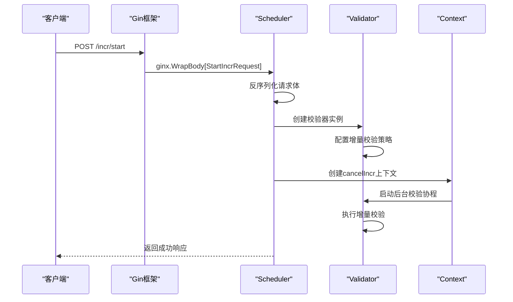
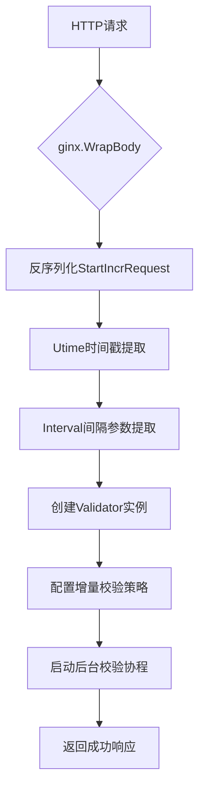
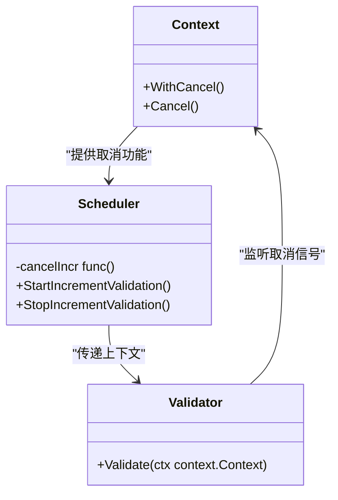
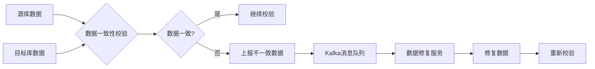
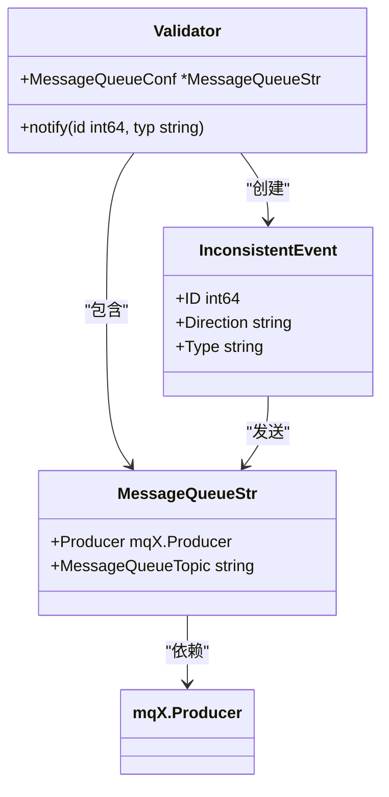
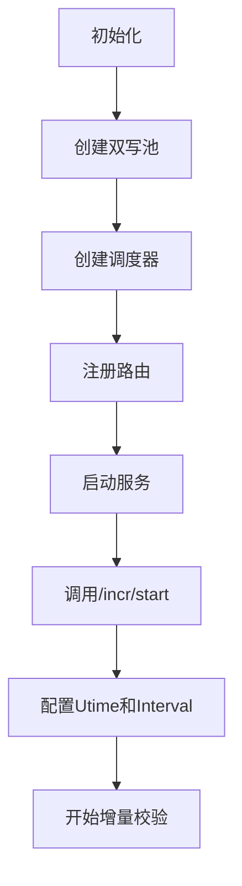
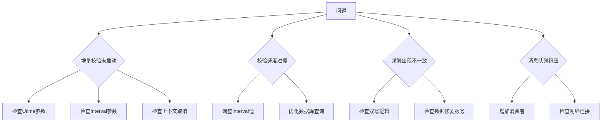

# 增量校验API

<cite>
**本文档引用的文件**   
- [scheduler.go](file://DBx/mysqlX/gormx/dbMovex/myMovex/scheduler/scheduler.go)
- [validator.go](file://DBx/mysqlX/gormx/dbMovex/myMovex/validator/validator.go)
- [wrapper_func.go](file://webx/ginx/wrapper_func.go)
- [inconsistent.go](file://DBx/mysqlX/gormx/dbMovex/myMovex/events/inconsistent.go)
- [double_write_pool.go](file://DBx/mysqlX/gormx/dbMovex/myMovex/doubleWritePoolx/double_write_pool.go)
</cite>

## 目录
1. [简介](#简介)
2. [核心组件分析](#核心组件分析)
3. [增量校验控制API实现细节](#增量校验控制api实现细节)
4. [数据一致性保障机制](#数据一致性保障机制)
5. [消息队列集成](#消息队列集成)
6. [配置示例](#配置示例)
7. [故障排查指南](#故障排查指南)

## 简介
增量校验API是数据库迁移过程中的关键组件，用于在双写模式下验证源库和目标库之间的数据一致性。该系统通过`/incr/start`和`/incr/stop`端点提供对增量校验过程的精确控制，支持基于时间戳的增量数据校验，并通过上下文取消机制安全终止后台校验协程。

## 核心组件分析

**Section sources**
- [scheduler.go](file://DBx/mysqlX/gormx/dbMovex/myMovex/scheduler/scheduler.go#L1-L447)
- [validator.go](file://DBx/mysqlX/gormx/dbMovex/myMovex/validator/validator.go#L1-L256)

## 增量校验控制API实现细节



**Diagram sources**
- [scheduler.go](file://DBx/mysqlX/gormx/dbMovex/myMovex/scheduler/scheduler.go#L217-L247)
- [wrapper_func.go](file://webx/ginx/wrapper_func.go#L65-L87)

### StartIncrementValidation方法实现

`StartIncrementValidation`方法通过`ginx.WrapBody[StartIncrRequest]`实现请求体的反序列化，该方法利用Go泛型特性将HTTP请求体自动转换为`StartIncrRequest`结构体。



**Diagram sources**
- [scheduler.go](file://DBx/mysqlX/gormx/dbMovex/myMovex/scheduler/scheduler.go#L217-L247)
- [wrapper_func.go](file://webx/ginx/wrapper_func.go#L65-L87)

### StartIncrRequest结构体解析

`StartIncrRequest`结构体定义了增量校验的两个关键参数：

```go
type StartIncrRequest struct {
    Utime    int64 `json:"utime"`    // 校验时间
    Interval int64 `json:"interval"` // 睡眠间隔
}
```

- **Utime字段**：指定校验的起始时间点，用于确定需要校验的数据范围。校验器会查询`utime > Utime`的所有记录。
- **Interval字段**：控制轮询间隔，单位为毫秒，用于控制校验过程的频率，避免对数据库造成过大压力。

**Section sources**
- [scheduler.go](file://DBx/mysqlX/gormx/dbMovex/myMovex/scheduler/scheduler.go#L437-L440)

### cancelIncr上下文取消机制



**Diagram sources**
- [scheduler.go](file://DBx/mysqlX/gormx/dbMovex/myMovex/scheduler/scheduler.go#L237-L243)
- [validator.go](file://DBx/mysqlX/gormx/dbMovex/myMovex/validator/validator.go#L84-L85)

`cancelIncr`上下文取消机制通过以下步骤安全终止后台校验协程：

1. 在`StartIncrementValidation`方法中，使用`context.WithCancel(context.Background())`创建可取消的上下文
2. 将取消函数存储在`Scheduler`实例的`cancelIncr`字段中
3. 当调用`/incr/stop`端点时，`StopIncrementValidation`方法调用`cancelIncr()`函数
4. 取消信号会传播到`Validator.Validate`方法，使其优雅退出

**Section sources**
- [scheduler.go](file://DBx/mysqlX/gormx/dbMovex/myMovex/scheduler/scheduler.go#L217-L247)

## 数据一致性保障机制



**Diagram sources**
- [validator.go](file://DBx/mysqlX/gormx/dbMovex/myMovex/validator/validator.go#L105-L129)
- [inconsistent.go](file://DBx/mysqlX/gormx/dbMovex/myMovex/events/inconsistent.go#L3-L21)

增量校验的数据一致性保障机制包括：

1. **双向校验**：同时执行`base -> target`和`target -> base`两个方向的校验
2. **三种不一致类型**：
   - `target_missing`：目标库缺少记录
   - `neq`：源库和目标库数据不一致
   - `base_missing`：源库缺少记录
3. **错误处理**：对于查询失败的情况，记录日志并继续校验，确保校验过程的鲁棒性

**Section sources**
- [validator.go](file://DBx/mysqlX/gormx/dbMovex/myMovex/validator/validator.go#L80-L132)

## 消息队列集成



**Diagram sources**
- [validator.go](file://DBx/mysqlX/gormx/dbMovex/myMovex/validator/validator.go#L23-L38)
- [inconsistent.go](file://DBx/mysqlX/gormx/dbMovex/myMovex/events/inconsistent.go#L3-L21)

增量校验系统通过消息队列实现不一致数据的上报，具体集成方式如下：

1. **生产者配置**：`Validator`通过`MessageQueueStr`结构体持有`mqX.Producer`实例
2. **消息格式**：使用`InconsistentEvent`结构体封装不一致信息，包括ID、方向和类型
3. **异步上报**：当发现数据不一致时，将`InconsistentEvent`序列化为JSON并发送到指定Topic

**Section sources**
- [validator.go](file://DBx/mysqlX/gormx/dbMovex/myMovex/validator/validator.go#L23-L38)
- [inconsistent.go](file://DBx/mysqlX/gormx/dbMovex/myMovex/events/inconsistent.go#L3-L21)

## 配置示例



**Diagram sources**
- [scheduler.go](file://DBx/mysqlX/gormx/dbMovex/myMovex/scheduler/scheduler.go#L78-L101)
- [double_write_pool.go](file://DBx/mysqlX/gormx/dbMovex/myMovex/doubleWritePoolx/double_write_pool.go#L59-L88)

典型配置流程：

1. 创建`DoubleWritePool`实例，管理源库和目标库的连接
2. 创建`Scheduler`实例，注入日志、数据库连接和消息队列生产者
3. 调用`RegisterRoutes`方法注册`/incr/start`和`/incr/stop`端点
4. 通过HTTP请求调用`/incr/start`，传入`utime`和`interval`参数

**Section sources**
- [scheduler.go](file://DBx/mysqlX/gormx/dbMovex/myMovex/scheduler/scheduler.go#L78-L101)

## 故障排查指南



**Diagram sources**
- [scheduler.go](file://DBx/mysqlX/gormx/dbMovex/myMovex/scheduler/scheduler.go#L217-L247)
- [validator.go](file://DBx/mysqlX/gormx/dbMovex/myMovex/validator/validator.go#L84-L95)

常见问题及解决方案：

1. **增量校验未启动**：
   - 检查`Utime`参数是否正确设置
   - 确认`Interval`参数单位为毫秒
   - 验证`cancelIncr`上下文未被意外取消

2. **校验速度过慢**：
   - 调整`Interval`参数以优化轮询频率
   - 检查数据库性能，优化相关查询

3. **频繁出现不一致**：
   - 验证双写逻辑是否正确实现
   - 检查数据修复服务是否正常运行

4. **消息队列积压**：
   - 增加消息队列消费者数量
   - 检查网络连接稳定性

**Section sources**
- [scheduler.go](file://DBx/mysqlX/gormx/dbMovex/myMovex/scheduler/scheduler.go#L217-L247)
- [validator.go](file://DBx/mysqlX/gormx/dbMovex/myMovex/validator/validator.go#L84-L95)