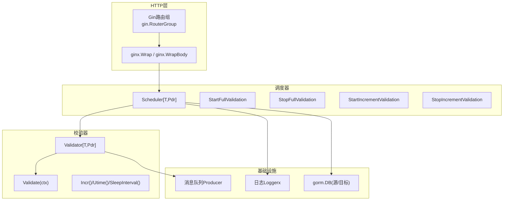
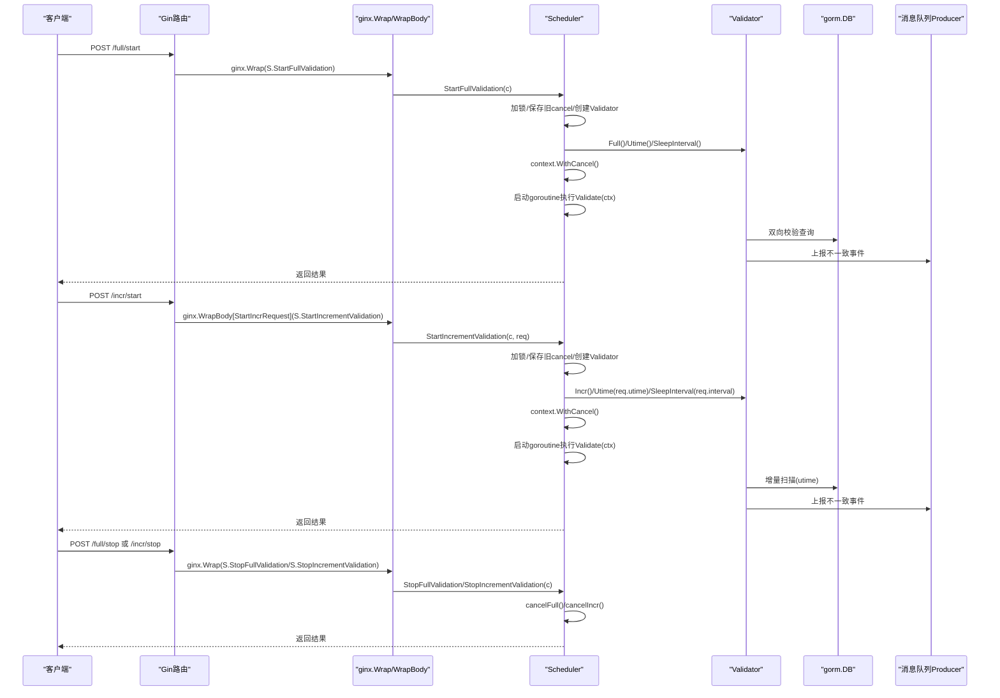
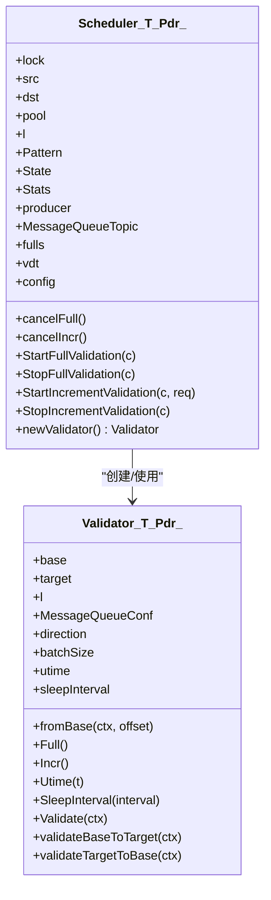
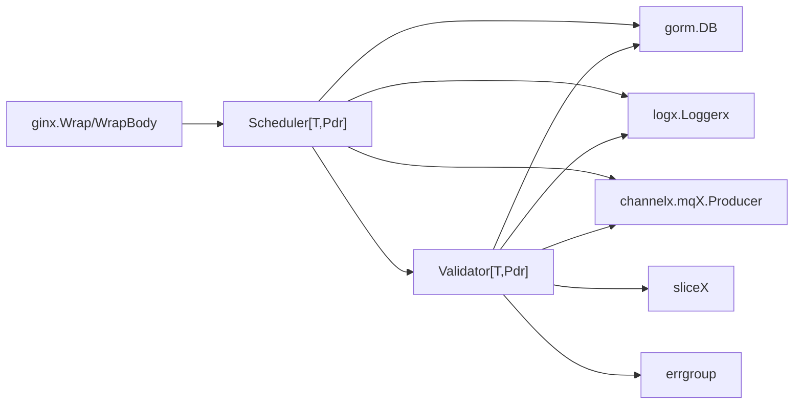

# 校验控制API

<cite>
**本文引用的文件列表**
- [scheduler.go](file://DBx/mysqlX/gormx/dbMovex/myMovex/scheduler/scheduler.go)
- [validator.go](file://DBx/mysqlX/gormx/dbMovex/myMovex/validator/validator.go)
- [wrapper_func.go](file://webx/ginx/wrapper_func.go)
- [help_doc.txt](file://DBx/mysqlX/gormx/dbMovex/myMovex/help_doc.txt)
- [myMove_test.go](file://DBx/mysqlX/gormx/dbMovex/myMovex/test/myMove_test.go)
</cite>

## 目录
1. [引言](#引言)
2. [项目结构](#项目结构)
3. [核心组件](#核心组件)
4. [架构总览](#架构总览)
5. [详细组件分析](#详细组件分析)
6. [依赖关系分析](#依赖关系分析)
7. [性能考量](#性能考量)
8. [故障排查指南](#故障排查指南)
9. [结论](#结论)
10. [附录](#附录)

## 引言
本技术文档聚焦于“校验控制API”，覆盖全量与增量校验的启动与停止能力，围绕以下四个POST端点展开：
- /full/start：启动全量校验
- /full/stop：停止全量校验
- /incr/start：启动增量校验
- /incr/stop：停止增量校验

文档将深入解析StartFullValidation与StartIncrementValidation方法如何创建Validator实例并启动异步校验任务；Stop系列方法如何通过context.CancelFunc安全终止运行中的校验协程；/incr/start端点使用ginx.WrapBody进行请求体反序列化的实现方式及其对应的StartIncrRequest结构体字段含义（utime时间戳、interval间隔）；同时总结错误处理策略、后台goroutine管理与资源清理逻辑，并提供典型调用序列示例。

## 项目结构
该能力位于DBx/mysqlX/gormx/dbMovex/myMovex子模块中，核心文件包括：
- 调度器与HTTP路由：DBx/mysqlX/gormx/dbMovex/myMovex/scheduler/scheduler.go
- 校验器实现：DBx/mysqlX/gormx/dbMovex/myMovex/validator/validator.go
- Web中间件与包装器：webx/ginx/wrapper_func.go
- 使用说明与依赖：DBx/mysqlX/gormx/dbMovex/myMovex/help_doc.txt
- 端到端测试样例：DBx/mysqlX/gormx/dbMovex/myMovex/test/myMove_test.go

图表来源
- [scheduler.go](file://DBx/mysqlX/gormx/dbMovex/myMovex/scheduler/scheduler.go#L103-L123)
- [validator.go](file://DBx/mysqlX/gormx/dbMovex/myMovex/validator/validator.go#L29-L78)
- [wrapper_func.go](file://webx/ginx/wrapper_func.go#L65-L87)

章节来源
- [scheduler.go](file://DBx/mysqlX/gormx/dbMovex/myMovex/scheduler/scheduler.go#L103-L123)
- [help_doc.txt](file://DBx/mysqlX/gormx/dbMovex/myMovex/help_doc.txt#L1-L18)

## 核心组件
- Scheduler[T,Pdr]：负责迁移与校验的调度，维护当前模式、状态、统计信息，以及全量/增量校验的context.CancelFunc。
- Validator[T,Pdr]：执行双向一致性校验，支持全量与增量两种模式，具备并发校验与消息上报能力。
- ginx.WrapBody[StartIncrRequest]：对/incr/start端点进行请求体反序列化与参数绑定。
- StartIncrRequest：增量校验请求体结构，包含utime与interval字段。

章节来源
- [scheduler.go](file://DBx/mysqlX/gormx/dbMovex/myMovex/scheduler/scheduler.go#L47-L101)
- [validator.go](file://DBx/mysqlX/gormx/dbMovex/myMovex/validator/validator.go#L29-L78)
- [wrapper_func.go](file://webx/ginx/wrapper_func.go#L65-L87)
- [scheduler.go](file://DBx/mysqlX/gormx/dbMovex/myMovex/scheduler/scheduler.go#L437-L441)

## 架构总览
四个校验控制端点通过ginx.Wrap与ginx.WrapBody包装器接入，分别调用Scheduler的Start/Stop方法。Start方法内部：
- 加锁保护
- 创建Validator实例（newValidator）
- 配置校验模式（Full/Incr）与参数（Utime、SleepInterval）
- 生成新的context.WithCancel并保存CancelFunc，随后取消上一次的协程
- 启动goroutine执行Validate(ctx)，并在退出时记录日志

Stop方法内部：
- 加锁保护
- 调用cancelFull/cancelIncr，触发Validate(ctx)返回

图表来源
- [scheduler.go](file://DBx/mysqlX/gormx/dbMovex/myMovex/scheduler/scheduler.go#L103-L123)
- [scheduler.go](file://DBx/mysqlX/gormx/dbMovex/myMovex/scheduler/scheduler.go#L217-L287)
- [validator.go](file://DBx/mysqlX/gormx/dbMovex/myMovex/validator/validator.go#L62-L172)
- [wrapper_func.go](file://webx/ginx/wrapper_func.go#L65-L87)

## 详细组件分析

### /full/start：启动全量校验
- 路由注册：RegisterRoutes中通过ginx.Wrap绑定StartFullValidation。
- 启动流程：
  - 加锁保护
  - 保存旧的cancelFull，创建Validator实例
  - 增加统计计数
  - 生成新的context.WithCancel并保存新的cancelFull
  - 启动goroutine执行v.Validate(ctx)，在退出时记录日志
- 关键点：
  - newValidator根据当前模式选择源/目标库方向
  - Validate内部使用errgroup并发执行双向校验
  - ctx被传递给Validate，用于优雅取消

章节来源
- [scheduler.go](file://DBx/mysqlX/gormx/dbMovex/myMovex/scheduler/scheduler.go#L103-L123)
- [scheduler.go](file://DBx/mysqlX/gormx/dbMovex/myMovex/scheduler/scheduler.go#L259-L287)
- [validator.go](file://DBx/mysqlX/gormx/dbMovex/myMovex/validator/validator.go#L62-L78)
- [validator.go](file://DBx/mysqlX/gormx/dbMovex/myMovex/validator/validator.go#L134-L152)

### /full/stop：停止全量校验
- 路由注册：RegisterRoutes中通过ginx.Wrap绑定StopFullValidation。
- 停止流程：
  - 加锁保护
  - 调用cancelFull，触发Validate(ctx)返回
- 关键点：
  - cancelFull初始为空函数，后续由StartFullValidation设置
  - Stop仅负责取消，不负责销毁Validator

章节来源
- [scheduler.go](file://DBx/mysqlX/gormx/dbMovex/myMovex/scheduler/scheduler.go#L103-L123)
- [scheduler.go](file://DBx/mysqlX/gormx/dbMovex/myMovex/scheduler/scheduler.go#L249-L257)

### /incr/start：启动增量校验
- 路由注册：RegisterRoutes中通过ginx.WrapBody[StartIncrRequest]绑定StartIncrementValidation。
- 请求体反序列化：
  - ginx.WrapBody[StartIncrRequest]会将JSON请求体绑定到StartIncrRequest结构体
  - 若绑定失败，返回400与错误提示
- 启动流程：
  - 加锁保护
  - 保存旧的cancelIncr，创建Validator实例
  - 配置Incr模式、Utime与SleepInterval（毫秒转换）
  - 增加统计计数
  - 生成新的context.WithCancel并保存新的cancelIncr
  - 启动goroutine执行v.Validate(ctx)，在退出时记录日志
- 关键点：
  - StartIncrRequest.utime决定增量扫描起点
  - StartIncrRequest.interval决定无数据时的休眠间隔（毫秒）

章节来源
- [scheduler.go](file://DBx/mysqlX/gormx/dbMovex/myMovex/scheduler/scheduler.go#L103-L123)
- [scheduler.go](file://DBx/mysqlX/gormx/dbMovex/myMovex/scheduler/scheduler.go#L217-L247)
- [wrapper_func.go](file://webx/ginx/wrapper_func.go#L65-L87)
- [scheduler.go](file://DBx/mysqlX/gormx/dbMovex/myMovex/scheduler/scheduler.go#L437-L441)

### /incr/stop：停止增量校验
- 路由注册：RegisterRoutes中通过ginx.Wrap绑定StopIncrementValidation。
- 停止流程：
  - 加锁保护
  - 调用cancelIncr，触发Validate(ctx)返回
- 关键点：
  - 与全量停止相同，仅负责取消

章节来源
- [scheduler.go](file://DBx/mysqlX/gormx/dbMovex/myMovex/scheduler/scheduler.go#L103-L123)
- [scheduler.go](file://DBx/mysqlX/gormx/dbMovex/myMovex/scheduler/scheduler.go#L207-L215)

### StartIncrRequest结构体字段含义
- utime：整型时间戳，用于增量校验的起点过滤条件（大于该时间）
- interval：整型毫秒值，当无数据时的休眠间隔，避免高频轮询

章节来源
- [scheduler.go](file://DBx/mysqlX/gormx/dbMovex/myMovex/scheduler/scheduler.go#L437-L441)
- [validator.go](file://DBx/mysqlX/gormx/dbMovex/myMovex/validator/validator.go#L144-L152)
- [validator.go](file://DBx/mysqlX/gormx/dbMovex/myMovex/validator/validator.go#L163-L171)

### Validator工作原理与模式切换
- 模式切换：
  - Full()：全量扫描，按id顺序分页
  - Incr()：增量扫描，按utime过滤并排序
- 参数配置：
  - Utime(t)：设置utime起点
  - SleepInterval(d)：设置无数据时休眠间隔
- 并发校验：
  - Validate(ctx)内部使用errgroup并发执行双向校验
  - validateBaseToTarget与validateTargetToBase循环拉取数据并对比
- 上报机制：
  - 对不一致数据通过消息队列Producer发送事件，包含ID、类型与方向

图表来源
- [scheduler.go](file://DBx/mysqlX/gormx/dbMovex/myMovex/scheduler/scheduler.go#L47-L101)
- [validator.go](file://DBx/mysqlX/gormx/dbMovex/myMovex/validator/validator.go#L29-L78)

章节来源
- [validator.go](file://DBx/mysqlX/gormx/dbMovex/myMovex/validator/validator.go#L62-L172)

### 错误处理策略
- 请求体绑定失败：ginx.WrapBody返回400与错误提示
- 业务逻辑错误：Wrap系列中间件记录日志并返回标准结果
- 校验过程错误：
  - 查询异常：记录错误日志并继续推进
  - 不一致数据：通过消息队列上报事件
  - 取消/超时：Validate内部识别context.Canceled/DeadlineExceeded并优雅返回

章节来源
- [wrapper_func.go](file://webx/ginx/wrapper_func.go#L65-L87)
- [validator.go](file://DBx/mysqlX/gormx/dbMovex/myMovex/validator/validator.go#L80-L132)
- [validator.go](file://DBx/mysqlX/gormx/dbMovex/myMovex/validator/validator.go#L174-L232)

### 后台goroutine管理与资源清理
- goroutine生命周期：
  - Start方法启动新的Validate(ctx)协程
  - Stop方法通过cancelFunc触发ctx取消，Validate内部检测并返回
- 资源清理：
  - Validate内部使用withTimeout的上下文，避免阻塞
  - 上报消息使用withTimeout的上下文，防止阻塞
  - 日志记录用于追踪退出原因

章节来源
- [scheduler.go](file://DBx/mysqlX/gormx/dbMovex/myMovex/scheduler/scheduler.go#L217-L287)
- [validator.go](file://DBx/mysqlX/gormx/dbMovex/myMovex/validator/validator.go#L62-L78)
- [validator.go](file://DBx/mysqlX/gormx/dbMovex/myMovex/validator/validator.go#L241-L256)

### 典型调用序列示例
- 全量校验启动与停止
  1) 客户端发送POST /full/start
  2) 路由经ginx.Wrap进入StartFullValidation
  3) 创建Validator并生成ctx，启动Validate协程
  4) 客户端发送POST /full/stop
  5) 路由经ginx.Wrap进入StopFullValidation，调用cancelFull
  6) Validate检测ctx取消并返回，记录退出日志

- 增量校验启动与停止
  1) 客户端发送POST /incr/start，携带JSON请求体
  2) 路由经ginx.WrapBody绑定StartIncrRequest
  3) StartIncrementValidation配置Incr/Utime/SleepInterval并启动Validate协程
  4) 客户端发送POST /incr/stop
  5) StopIncrementValidation调用cancelIncr，Validate返回

章节来源
- [myMove_test.go](file://DBx/mysqlX/gormx/dbMovex/myMovex/test/myMove_test.go#L489-L545)
- [scheduler.go](file://DBx/mysqlX/gormx/dbMovex/myMovex/scheduler/scheduler.go#L103-L123)
- [wrapper_func.go](file://webx/ginx/wrapper_func.go#L65-L87)

## 依赖关系分析
- 调度器依赖：
  - gorm.DB（源/目标库）
  - 日志Loggerx
  - 消息队列Producer
  - ginx中间件（Wrap/WrapBody）
- 校验器依赖：
  - gorm.DB（源/目标库）
  - 日志Loggerx
  - 消息队列Producer
  - sliceX（集合工具）
  - errgroup（并发控制）

图表来源
- [scheduler.go](file://DBx/mysqlX/gormx/dbMovex/myMovex/scheduler/scheduler.go#L47-L101)
- [validator.go](file://DBx/mysqlX/gormx/dbMovex/myMovex/validator/validator.go#L1-L28)

章节来源
- [scheduler.go](file://DBx/mysqlX/gormx/dbMovex/myMovex/scheduler/scheduler.go#L47-L101)
- [validator.go](file://DBx/mysqlX/gormx/dbMovex/myMovex/validator/validator.go#L1-L28)

## 性能考量
- 并发校验：Validate内部使用errgroup并发执行双向校验，提升吞吐
- 分页与批量：validateTargetToBase采用批量查询与差集计算，减少往返
- 超时控制：查询与上报均使用withTimeout，避免长时间阻塞
- 休眠策略：增量模式通过SleepInterval降低CPU占用，避免热轮询
- 日志与指标：中间件记录请求结果码，便于观测与告警

[本节为通用性能建议，不直接分析具体文件]

## 故障排查指南
- 请求参数错误
  - 现象：/incr/start返回400
  - 排查：确认请求体JSON格式与字段类型匹配StartIncrRequest
- 校验未停止
  - 现象：/full/stop或/incr/stop无效
  - 排查：确认Stop方法被调用且cancelFunc已更新；检查Start方法是否成功创建新的ctx
- 增量无数据
  - 现象：频繁休眠或无进展
  - 排查：确认utime设置合理；检查interval是否过大；核对源库utime字段更新
- 不一致事件未上报
  - 现象：消息队列无事件
  - 排查：确认Producer可用；检查notify内部withTimeout与topic配置

章节来源
- [wrapper_func.go](file://webx/ginx/wrapper_func.go#L65-L87)
- [validator.go](file://DBx/mysqlX/gormx/dbMovex/myMovex/validator/validator.go#L241-L256)
- [scheduler.go](file://DBx/mysqlX/gormx/dbMovex/myMovex/scheduler/scheduler.go#L217-L287)

## 结论
本API通过ginx中间件与Scheduler/Validator协作，提供了全量与增量校验的可控启动与停止能力。Start方法负责创建Validator、配置参数并启动异步校验协程；Stop方法通过context.CancelFunc安全终止运行中的校验。/incr/start端点使用ginx.WrapBody进行请求体反序列化，StartIncrRequest的utime与interval分别控制增量扫描起点与休眠间隔。整体设计具备良好的并发性、可观测性与可扩展性。

[本节为总结性内容，不直接分析具体文件]

## 附录
- 使用说明与依赖初始化：help_doc.txt中提到需要初始化ginx.InitCounter()与ginx.NewLogMdlHandlerFunc()，并将它们注入到Gin框架中，以启用日志与指标统计。

章节来源
- [help_doc.txt](file://DBx/mysqlX/gormx/dbMovex/myMovex/help_doc.txt#L1-L18)