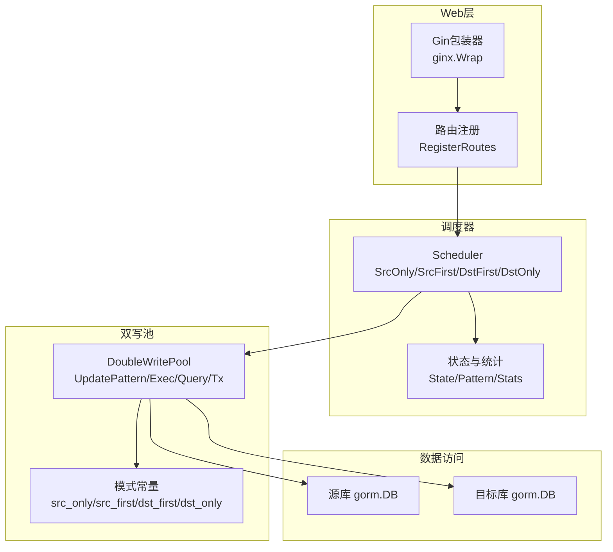
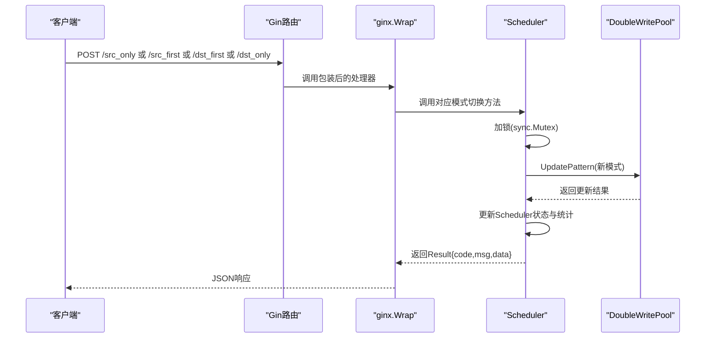
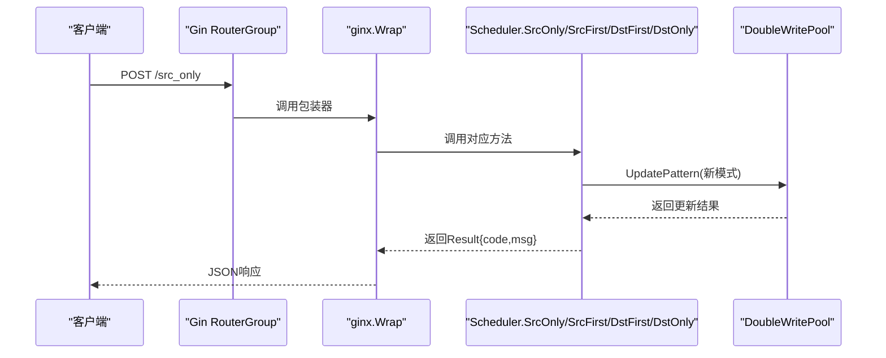
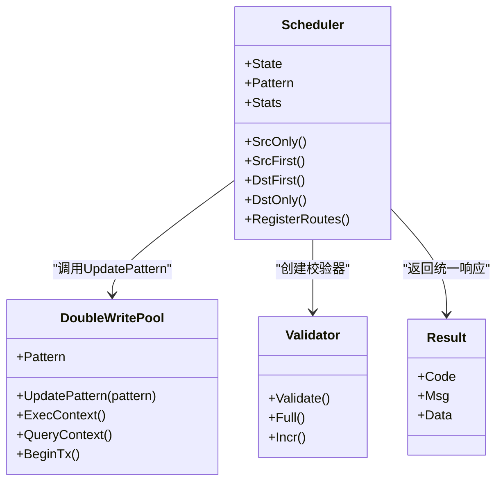

# 模式切换API

<cite>
**本文引用的文件列表**
- [scheduler.go](file://DBx/mysqlX/gormx/dbMovex/myMovex/scheduler/scheduler.go)
- [double_write_pool.go](file://DBx/mysqlX/gormx/dbMovex/myMovex/doubleWritePoolx/double_write_pool.go)
- [wrapper_func.go](file://webx/ginx/wrapper_func.go)
- [result.go](file://webx/ginx/result.go)
- [help_doc.txt](file://DBx/mysqlX/gormx/dbMovex/myMovex/help_doc.txt)
- [validator.go](file://DBx/mysqlX/gormx/dbMovex/myMovex/validator/validator.go)
</cite>

## 目录
1. [简介](#简介)
2. [项目结构](#项目结构)
3. [核心组件](#核心组件)
4. [架构总览](#架构总览)
5. [详细组件分析](#详细组件分析)
6. [依赖关系分析](#依赖关系分析)
7. [性能考量](#性能考量)
8. [故障排查指南](#故障排查指南)
9. [结论](#结论)
10. [附录](#附录)

## 简介
本文件面向迁移调度器的“模式切换API”，聚焦于四个POST端点：/src_only、/src_first、/dst_first、/dst_only。文档解释这些端点如何通过webx/ginx的Wrap包装器将内部方法转换为Gin处理器，并调用DoubleWritePool的UpdatePattern方法变更数据库写入策略；同时说明四种模式的行为差异：源库只写、源库优先双写、目标库优先双写、目标库只写。文档还提供请求示例、成功响应格式（code=0, msg=操作成功）、错误码（code=5, msg=切换失败），并阐述线程安全机制（sync.Mutex）在状态变更中的作用，最后给出实际迁移流程中各模式的推荐切换顺序。

## 项目结构
围绕模式切换API的关键文件组织如下：
- 调度器与路由注册：DBx/mysqlX/gormx/dbMovex/myMovex/scheduler/scheduler.go
- 双写池与模式常量：DBx/mysqlX/gormx/dbMovex/myMovex/doubleWritePoolx/double_write_pool.go
- Gin包装器与结果类型：webx/ginx/wrapper_func.go、webx/ginx/result.go
- 使用说明与集成要点：DBx/mysqlX/gormx/dbMovex/myMovex/help_doc.txt
- 校验器（用于全量/增量校验）：DBx/mysqlX/gormx/dbMovex/myMovex/validator/validator.go

图表来源
- [scheduler.go](file://DBx/mysqlX/gormx/dbMovex/myMovex/scheduler/scheduler.go#L103-L123)
- [double_write_pool.go](file://DBx/mysqlX/gormx/dbMovex/myMovex/doubleWritePoolx/double_write_pool.go#L109-L119)
- [wrapper_func.go](file://webx/ginx/wrapper_func.go#L114-L131)

章节来源
- [scheduler.go](file://DBx/mysqlX/gormx/dbMovex/myMovex/scheduler/scheduler.go#L103-L123)
- [double_write_pool.go](file://DBx/mysqlX/gormx/dbMovex/myMovex/doubleWritePoolx/double_write_pool.go#L710-L717)
- [help_doc.txt](file://DBx/mysqlX/gormx/dbMovex/myMovex/help_doc.txt#L1-L18)

## 核心组件
- Scheduler：负责迁移生命周期管理、状态机、模式切换、校验器创建与健康检查等。
- DoubleWritePool：封装双写连接池，提供UpdatePattern更新模式、Exec/Query/BeginTx等双写逻辑。
- ginx.Wrap：将业务函数包装为Gin处理器，统一处理请求绑定、鉴权、错误日志与响应。
- Result：统一响应结构，包含code/msg/data。

章节来源
- [scheduler.go](file://DBx/mysqlX/gormx/dbMovex/myMovex/scheduler/scheduler.go#L46-L101)
- [double_write_pool.go](file://DBx/mysqlX/gormx/dbMovex/myMovex/doubleWritePoolx/double_write_pool.go#L36-L88)
- [wrapper_func.go](file://webx/ginx/wrapper_func.go#L114-L131)
- [result.go](file://webx/ginx/result.go#L1-L8)

## 架构总览
四个模式切换端点通过ginx.Wrap包装器接入Gin路由组，内部调用Scheduler对应方法，Scheduler持有一个DoubleWritePool实例，通过UpdatePattern变更内部模式。随后，业务层对GORM的ConnPool或Tx的调用会根据当前模式决定写入路径与回滚/提交策略。

图表来源
- [scheduler.go](file://DBx/mysqlX/gormx/dbMovex/myMovex/scheduler/scheduler.go#L103-L123)
- [scheduler.go](file://DBx/mysqlX/gormx/dbMovex/myMovex/scheduler/scheduler.go#L127-L205)
- [double_write_pool.go](file://DBx/mysqlX/gormx/dbMovex/myMovex/doubleWritePoolx/double_write_pool.go#L109-L119)
- [wrapper_func.go](file://webx/ginx/wrapper_func.go#L114-L131)

## 详细组件分析

### 模式切换API端点与行为
- /src_only（源库只写）
  - 行为：仅向源库写入，目标库不写。
  - 成功响应：code=0, msg=已切换到源库只写模式。
  - 错误响应：code=5, msg=切换失败。
  - 内部流程：Scheduler加锁，设置Pattern为src_only，调用pool.UpdatePattern，更新状态与统计，记录日志。
- /src_first（双写，源库优先）
  - 行为：先写源库，再写目标库；若源库失败且严格模式开启，则返回错误；非严格模式下源库失败不尝试目标库。
  - 成功响应：code=0, msg=已切换到双写，源库优先模式。
  - 错误响应：code=5, msg=切换失败。
  - 内部流程：Scheduler加锁，设置Pattern为src_first，调用pool.UpdatePattern，更新状态与统计，记录日志。
- /dst_first（双写，目标库优先）
  - 行为：先写目标库，再写源库；若目标库失败且严格模式开启，则返回错误；非严格模式下目标库失败不尝试源库。
  - 成功响应：code=0, msg=已切换到双写，目标库优先模式。
  - 错误响应：code=5, msg=切换失败。
  - 内部流程：Scheduler加锁，设置Pattern为dst_first，调用pool.UpdatePattern，更新状态与统计，记录日志。
- /dst_only（目标库只写）
  - 行为：仅向目标库写入，源库不写。
  - 成功响应：code=0, msg=已切换到目标库只写模式。
  - 错误响应：code=5, msg=切换失败。
  - 内部流程：Scheduler加锁，设置Pattern为dst_only，调用pool.UpdatePattern，更新状态与统计，记录日志。

章节来源
- [scheduler.go](file://DBx/mysqlX/gormx/dbMovex/myMovex/scheduler/scheduler.go#L127-L205)
- [double_write_pool.go](file://DBx/mysqlX/gormx/dbMovex/myMovex/doubleWritePoolx/double_write_pool.go#L109-L119)
- [result.go](file://webx/ginx/result.go#L1-L8)

### 线程安全机制
- Scheduler内部使用sync.Mutex保护关键状态变更（Pattern、State、Stats）以及校验器启动/停止等操作，确保多并发请求下的原子性与一致性。
- DoubleWritePool内部使用sync.RWMutex保护指标采集等共享资源，保证读写并发安全。

章节来源
- [scheduler.go](file://DBx/mysqlX/gormx/dbMovex/myMovex/scheduler/scheduler.go#L46-L68)
- [double_write_pool.go](file://DBx/mysqlX/gormx/dbMovex/myMovex/doubleWritePoolx/double_write_pool.go#L36-L50)

### 请求与响应规范
- 请求方法：POST
- 路由：
  - /src_only
  - /src_first
  - /dst_first
  - /dst_only
- 请求体：无（这些端点不需要请求体）
- 成功响应：code=0, msg=“已切换到...模式”
- 失败响应：code=5, msg=“切换失败”

章节来源
- [scheduler.go](file://DBx/mysqlX/gormx/dbMovex/myMovex/scheduler/scheduler.go#L103-L123)
- [result.go](file://webx/ginx/result.go#L1-L8)

### 实际迁移流程中的模式切换顺序建议
- 推荐顺序：
  1) src_only：先确保所有写入仅落源库，避免目标库写入造成数据漂移。
  2) src_first：开启双写，源库优先，进行全量校验，确认数据一致性。
  3) dst_first：目标库优先，进行全量校验，确认目标库写入正确。
  4) dst_only：仅写目标库，完成迁移。
- 说明：
  - 全量校验通过后再切换到下一阶段，避免在不一致状态下继续写入。
  - AutoMigrate提供了自动化流程，按上述顺序执行。

章节来源
- [scheduler.go](file://DBx/mysqlX/gormx/dbMovex/myMovex/scheduler/scheduler.go#L358-L403)

### 模式切换API的调用链与包装器
- 路由注册：RegisterRoutes将四个端点映射到对应的Scheduler方法，并使用ginx.Wrap包装。
- 包装器作用：统一处理请求绑定、鉴权、错误日志与JSON响应，将业务返回值Result转换为HTTP响应。

图表来源
- [scheduler.go](file://DBx/mysqlX/gormx/dbMovex/myMovex/scheduler/scheduler.go#L103-L123)
- [wrapper_func.go](file://webx/ginx/wrapper_func.go#L114-L131)

## 依赖关系分析
- Scheduler依赖DoubleWritePool进行模式切换与底层双写逻辑。
- Scheduler依赖validator创建校验器，用于全量/增量校验。
- Web层通过ginx.Wrap将业务方法桥接到Gin路由。
- DoubleWritePool内部维护模式常量，依据当前模式选择源/目标库路径。

图表来源
- [scheduler.go](file://DBx/mysqlX/gormx/dbMovex/myMovex/scheduler/scheduler.go#L46-L101)
- [double_write_pool.go](file://DBx/mysqlX/gormx/dbMovex/myMovex/doubleWritePoolx/double_write_pool.go#L109-L119)
- [validator.go](file://DBx/mysqlX/gormx/dbMovex/myMovex/validator/validator.go#L62-L78)
- [result.go](file://webx/ginx/result.go#L1-L8)

章节来源
- [scheduler.go](file://DBx/mysqlX/gormx/dbMovex/myMovex/scheduler/scheduler.go#L46-L101)
- [double_write_pool.go](file://DBx/mysqlX/gormx/dbMovex/myMovex/doubleWritePoolx/double_write_pool.go#L109-L119)
- [validator.go](file://DBx/mysqlX/gormx/dbMovex/myMovex/validator/validator.go#L62-L78)
- [result.go](file://webx/ginx/result.go#L1-L8)

## 性能考量
- 模式切换本身为轻量操作，主要成本在于DoubleWritePool的UpdatePattern与后续业务写入。
- DoubleWritePool支持重试与指标采集，可通过配置优化吞吐与可观测性。
- 建议在高并发场景下配合限流与熔断策略，避免瞬时压力导致目标库不可用。

[本节为通用性能建议，不直接分析具体文件]

## 故障排查指南
- 切换失败（code=5, msg=切换失败）
  - 可能原因：DoubleWritePool.UpdatePattern返回错误（如未知模式）。
  - 排查步骤：检查传入模式字符串是否为预定义常量之一；查看日志输出。
- 健康检查
  - 可通过/health端点获取健康状态；若存在错误，返回code=5并携带错误详情。
- 日志与监控
  - ginx.Wrap会记录错误日志；可结合Prometheus计数器观察响应码分布。

章节来源
- [scheduler.go](file://DBx/mysqlX/gormx/dbMovex/myMovex/scheduler/scheduler.go#L127-L205)
- [scheduler.go](file://DBx/mysqlX/gormx/dbMovex/myMovex/scheduler/scheduler.go#L324-L338)
- [wrapper_func.go](file://webx/ginx/wrapper_func.go#L114-L131)

## 结论
模式切换API通过ginx.Wrap将Scheduler的模式切换方法暴露为标准HTTP端点，内部委托DoubleWritePool完成模式更新与底层双写逻辑。四种模式分别覆盖“仅源库写”、“源库优先双写”、“目标库优先双写”、“仅目标库写”的典型迁移场景。配合Scheduler的状态机与校验器，可构建从src_only到dst_only的完整迁移闭环。线程安全通过sync.Mutex与DoubleWritePool的读写锁保障，确保并发环境下的稳定性。

[本节为总结性内容，不直接分析具体文件]

## 附录

### 模式常量与行为对照
- src_only：仅写源库
- src_first：先写源库，再写目标库；源库失败时严格模式下返回错误
- dst_first：先写目标库，再写源库；目标库失败时严格模式下返回错误
- dst_only：仅写目标库

章节来源
- [double_write_pool.go](file://DBx/mysqlX/gormx/dbMovex/myMovex/doubleWritePoolx/double_write_pool.go#L710-L717)

### 集成与初始化要点
- 需要先替换默认*gorm.db，注入DoubleWritePool作为连接池。
- 初始化Scheduler并调用RegisterRoutes注册端点。
- 启动ginx.InitCounter()与ginx.NewLogMdlHandlerFunc()以启用中间件与指标。

章节来源
- [help_doc.txt](file://DBx/mysqlX/gormx/dbMovex/myMovex/help_doc.txt#L1-L18)
- [scheduler.go](file://DBx/mysqlX/gormx/dbMovex/myMovex/scheduler/scheduler.go#L80-L101)