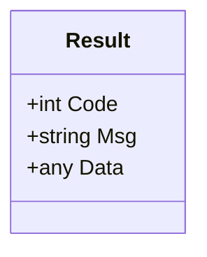
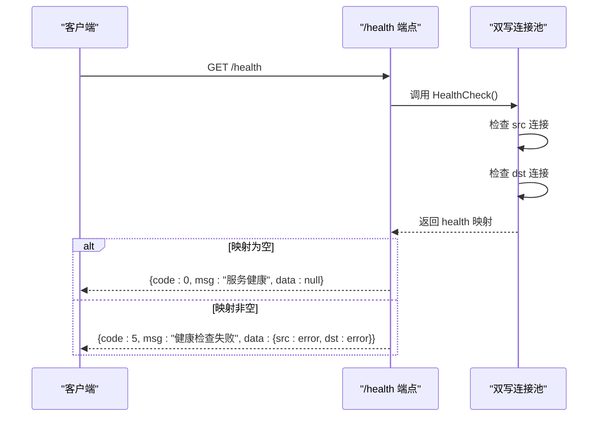
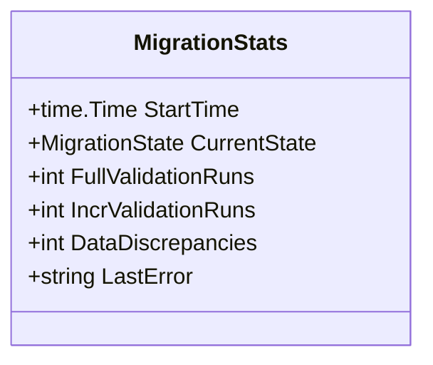
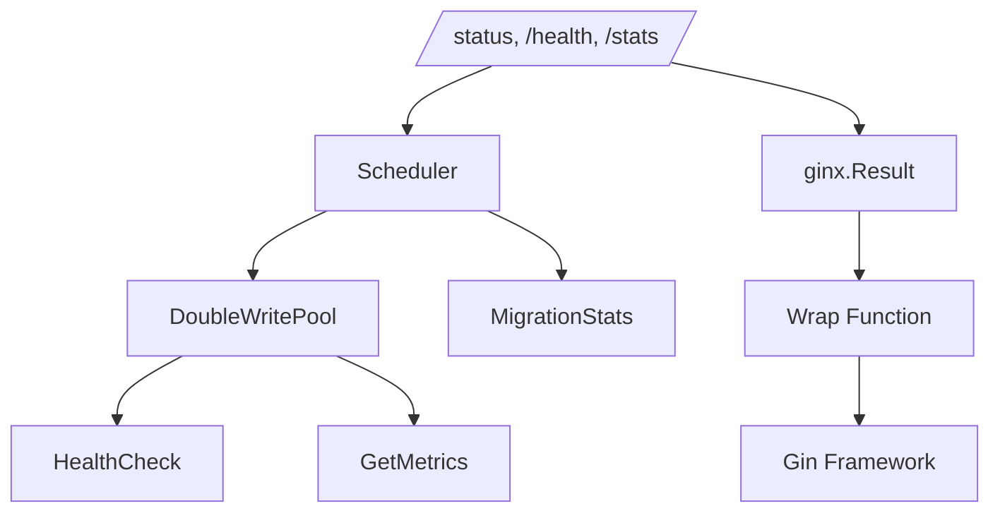

# 状态查询API

<cite>
**本文档引用的文件**   
- [result.go](file://webx/ginx/result.go)
- [scheduler.go](file://DBx/mysqlX/gormx/dbMovex/myMovex/scheduler/scheduler.go)
- [double_write_pool.go](file://DBx/mysqlX/gormx/dbMovex/myMovex/doubleWritePoolx/double_write_pool.go)
- [wrapper_func.go](file://webx/ginx/wrapper_func.go)
- [validator.go](file://DBx/mysqlX/gormx/dbMovex/myMovex/validator/validator.go)
- [README.md](file://README.md)
</cite>

## 目录
1. [简介](#简介)
2. [API概览](#api概览)
3. [统一响应格式](#统一响应格式)
4. [端点详细说明](#端点详细说明)
5. [响应示例与解析](#响应示例与解析)
6. [系统健康与迁移进度判断](#系统健康与迁移进度判断)
7. [依赖分析](#依赖分析)

## 简介

状态查询类API是数据库迁移工具包中的核心监控组件，提供对迁移系统运行状态、健康状况和统计信息的实时查询能力。该API集成了四个主要的GET端点（/status、/health、/stats）和一个POST端点（/auto-migrate），为运维人员和自动化系统提供了全面的系统视图。这些接口通过统一的响应包装机制，确保了返回数据的一致性和可解析性，是监控和管理数据库迁移过程的关键工具。

## API概览

状态查询API提供了四个核心端点，每个端点服务于不同的监控目的：

- **/status**: 提供系统的综合状态视图，是了解当前迁移进程的首选接口。
- **/health**: 执行底层连接池的健康检查，用于判断服务的可用性。
- **/stats**: 输出详细的运行时统计指标，用于性能分析和问题排查。
- **/auto-migrate**: 触发自动化迁移流程，启动一个预定义的迁移计划。

这些端点均通过Gin框架的路由系统注册，并由`Scheduler`结构体中的`RegisterRoutes`方法统一管理。它们共同构成了一个完整的监控体系，从宏观状态到微观指标，为用户提供了全方位的系统洞察。

**Section sources**
- [scheduler.go](file://DBx/mysqlX/gormx/dbMovex/myMovex/scheduler/scheduler.go#L103-L123)

## 统一响应格式

所有状态查询API的响应数据都通过`ginx.Result`结构体进行统一包装，确保了接口返回格式的一致性。该结构体定义了标准的响应三要素：`Code`、`Msg`和`Data`，遵循了常见的RESTful API设计规范。



**Diagram sources **
- [result.go](file://webx/ginx/result.go#L3-L7)

`ginx.Result`结构体通过`webx/ginx`包中的`Wrap`函数被应用到各个处理器函数上。`Wrap`函数是一个高阶函数，它接收一个返回`ginx.Result`和`error`的业务逻辑函数，并将其包装成一个标准的Gin `HandlerFunc`。这种设计模式实现了业务逻辑与HTTP响应处理的解耦，使得开发者可以专注于业务实现，而无需关心底层的HTTP协议细节。

**Section sources**
- [result.go](file://webx/ginx/result.go#L3-L7)
- [wrapper_func.go](file://webx/ginx/wrapper_func.go#L114-L130)

## 端点详细说明

### /status 端点

`/status`端点是系统状态的综合视图，它聚合了当前迁移状态、双写模式、统计信息、连接池健康度和性能指标等多个维度的数据。该端点的处理器函数`GetStatus`首先获取双写连接池的健康检查结果和性能指标，然后将这些信息与`Scheduler`内部的状态和统计信息一起，构建成一个包含丰富信息的`status`映射。

```mermaid
flowchart TD
Start([/status 端点调用]) --> Lock["获取互斥锁 (s.lock.Lock())"]
Lock --> HealthCheck["调用 s.pool.HealthCheck()"]
HealthCheck --> GetMetrics["调用 s.pool.GetMetrics()"]
GetMetrics --> BuildStatus["构建 status 映射"]
BuildStatus --> Unlock["释放互斥锁 (defer s.lock.Unlock())"]
Unlock --> ReturnResult["返回 ginx.Result{Data: status, Msg: \"OK\"}"]
ReturnResult --> End([响应客户端])
```

**Diagram sources **
- [scheduler.go](file://DBx/mysqlX/gormx/dbMovex/myMovex/scheduler/scheduler.go#L302-L322)

**Section sources**
- [scheduler.go](file://DBx/mysqlX/gormx/dbMovex/myMovex/scheduler/scheduler.go#L302-L322)

### /health 端点

`/health`端点执行最基础的健康检查，其核心是调用双写连接池的`HealthCheck`方法。该方法会分别对源库（src）和目标库（dst）的连接进行Ping操作。如果任何一个数据库连接无法Ping通，`HealthCheck`方法会返回一个包含错误信息的映射。`/health`端点根据这个映射的长度来判断服务的整体健康状况：如果映射为空，则返回“服务健康”的成功响应；否则，返回“健康检查失败”的错误响应，并将具体的错误信息作为`Data`返回。



**Diagram sources **
- [scheduler.go](file://DBx/mysqlX/gormx/dbMovex/myMovex/scheduler/scheduler.go#L324-L338)
- [double_write_pool.go](file://DBx/mysqlX/gormx/dbMovex/myMovex/doubleWritePoolx/double_write_pool.go#L121-L146)

**Section sources**
- [scheduler.go](file://DBx/mysqlX/gormx/dbMovex/myMovex/scheduler/scheduler.go#L324-L338)

### /stats 端点

`/stats`端点直接输出`Scheduler`结构体中`Stats`字段的内容。`Stats`是一个`MigrationStats`结构体，它记录了迁移过程中的关键运行时指标，如迁移开始时间、当前状态、全量校验和增量校验的执行次数、数据不一致的数量以及最后一次错误信息。该端点的实现非常直接，通过互斥锁保护对`Stats`字段的并发访问，然后将其作为`Data`返回。



**Diagram sources **
- [scheduler.go](file://DBx/mysqlX/gormx/dbMovex/myMovex/scheduler/scheduler.go#L37-L44)

**Section sources**
- [scheduler.go](file://DBx/mysqlX/gormx/dbMovex/myMovex/scheduler/scheduler.go#L340-L348)

### /auto-migrate 端点

`/auto-migrate`端点用于触发一个自动化的迁移流程。该端点的处理器函数`AutoMigrate`会启动一个Goroutine来异步执行`executeMigrationPlan`方法，从而避免阻塞HTTP请求。`executeMigrationPlan`方法实现了一个预定义的四阶段迁移流程：首先切换到“只写源库”模式，然后切换到“双写，源库优先”模式并启动全量校验，接着切换到“双写，目标库优先”模式，最后切换到“只写目标库”模式。整个流程的执行状态通过日志进行记录。

**Section sources**
- [scheduler.go](file://DBx/mysqlX/gormx/dbMovex/myMovex/scheduler/scheduler.go#L350-L403)

## 响应示例与解析

### /status 响应示例

```json
{
  "code": 0,
  "msg": "OK",
  "data": {
    "current_state": "src_first",
    "current_pattern": "src_first",
    "migration_stats": {
      "start_time": "2023-10-27T10:00:00Z",
      "current_state": "src_first",
      "full_validation_runs": 1,
      "incr_validation_runs": 0,
      "data_discrepancies": 5,
      "last_error": ""
    },
    "pool_health": {},
    "pool_metrics": {
      "DoubleWriteSuccess": 1500,
      "DoubleWriteFailure": 2,
      "QueryDuration": []
    },
    "uptime": "2h30m15s"
  }
}
```

**字段解析**:
- `current_state` 和 `current_pattern`: 表示当前的迁移状态和双写模式，两者通常一致。
- `migration_stats`: 包含详细的迁移统计信息，`data_discrepancies`字段的值是判断数据一致性的关键。
- `pool_health`: 一个空对象表示健康检查通过，如果包含`src`或`dst`键，则表示对应数据库连接有问题。
- `pool_metrics`: 显示双写操作的成功和失败次数，可用于分析系统稳定性。
- `uptime`: 自迁移开始以来的运行时间。

### /health 响应示例（健康）

```json
{
  "code": 0,
  "msg": "服务健康",
  "data": null
}
```

### /health 响应示例（不健康）

```json
{
  "code": 5,
  "msg": "健康检查失败",
  "data": {
    "src": "dial tcp 127.0.0.1:3306: connect: connection refused"
  }
}
```

### /stats 响应示例

```json
{
  "code": 0,
  "msg": "OK",
  "data": {
    "start_time": "2023-10-27T10:00:00Z",
    "current_state": "src_first",
    "full_validation_runs": 1,
    "incr_validation_runs": 0,
    "data_discrepancies": 5,
    "last_error": ""
  }
}
```

## 系统健康与迁移进度判断

用户可以通过组合使用这些API端点来全面判断系统的健康状况和迁移进度。

1.  **判断服务可用性**: 首先调用`/health`端点。如果返回“服务健康”，则表明源库和目标库的基本连接是正常的，系统可以接受请求。如果返回“健康检查失败”，则必须立即排查数据库连接问题。

2.  **判断迁移进度**: 调用`/status`或`/stats`端点，重点关注`current_state`和`data_discrepancies`字段。
    - `current_state`为`src_only`或`src_first`，表示迁移处于早期阶段。
    - `current_state`为`dst_first`或`dst_only`，表示迁移已进入后期或完成阶段。
    - `data_discrepancies`的值应持续监控。在`src_first`或`dst_first`模式下，该值应逐渐减少。当`data_discrepancies`稳定为0时，表明数据已完全一致，可以安全地推进到下一阶段。

3.  **综合判断**: 一个健康的、进展顺利的迁移系统，其`/health`应返回成功，`/status`中的`pool_health`为空，且`data_discrepancies`持续下降。任何异常的组合都应引起警觉。

## 依赖分析

状态查询API的功能实现依赖于多个核心组件的协同工作。



**Diagram sources **
- [scheduler.go](file://DBx/mysqlX/gormx/dbMovex/myMovex/scheduler/scheduler.go)
- [double_write_pool.go](file://DBx/mysqlX/gormx/dbMovex/myMovex/doubleWritePoolx/double_write_pool.go)
- [result.go](file://webx/ginx/result.go)
- [wrapper_func.go](file://webx/ginx/wrapper_func.go)

- **Scheduler**: 作为核心协调者，它聚合了来自双写池和自身状态的信息，并提供了API的处理器函数。
- **DoubleWritePool**: 提供了`HealthCheck`和`GetMetrics`方法，是`/health`和`/status`端点数据的主要来源。
- **ginx.Result 和 Wrap**: 提供了统一的响应包装和HTTP处理机制，是API一致性的基础。
- **Gin Framework**: 作为底层Web框架，负责HTTP请求的路由和处理。

这些组件通过清晰的接口进行交互，形成了一个高内聚、低耦合的系统架构。