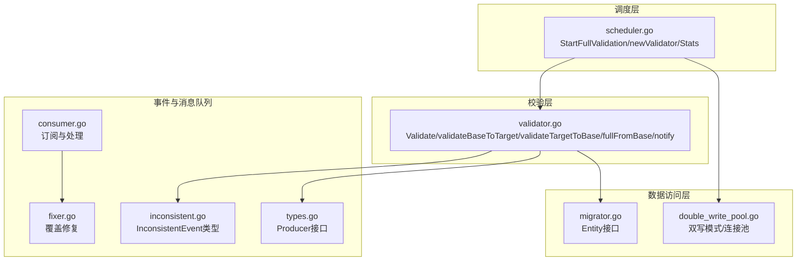
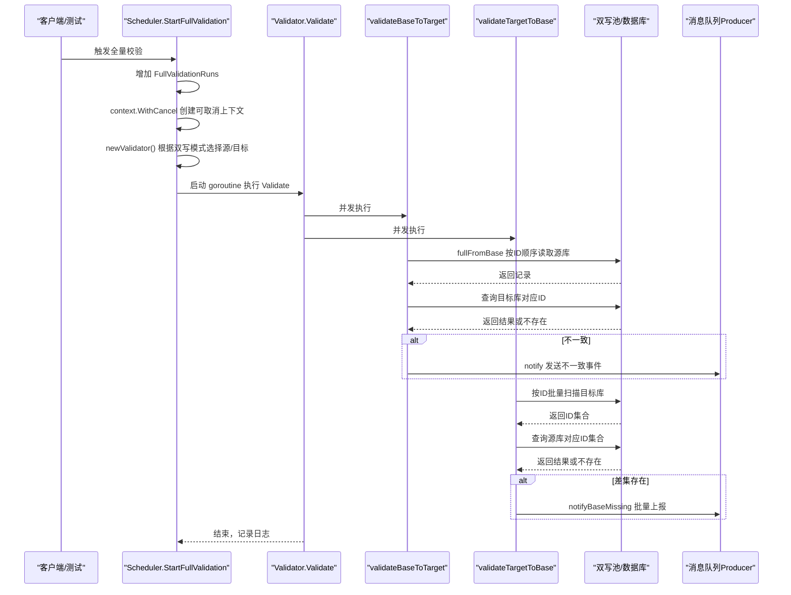
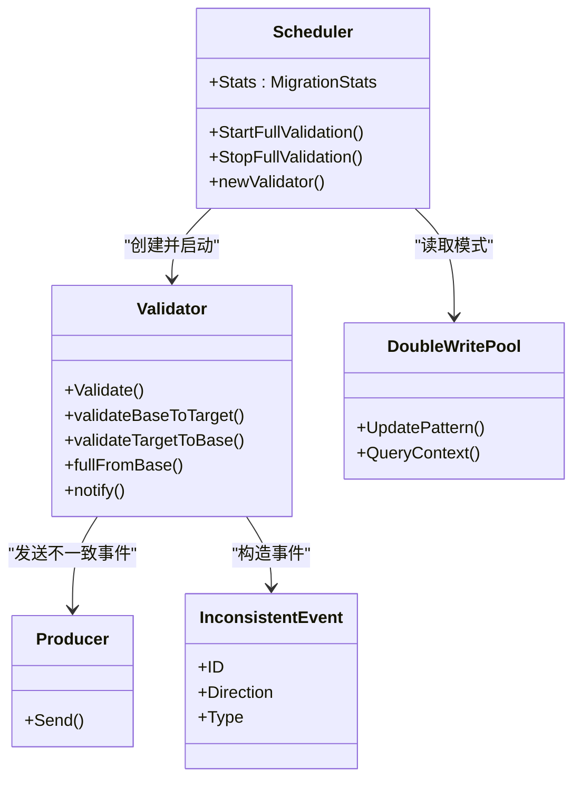

# 全量校验机制

<cite>
**本文引用的文件**
- [scheduler.go](file://DBx/mysqlX/gormx/dbMovex/myMovex/scheduler/scheduler.go)
- [validator.go](file://DBx/mysqlX/gormx/dbMovex/myMovex/validator/validator.go)
- [migrator.go](file://DBx/mysqlX/gormx/dbMovex/myMovex/migrator.go)
- [double_write_pool.go](file://DBx/mysqlX/gormx/dbMovex/myMovex/doubleWritePoolx/double_write_pool.go)
- [inconsistent.go](file://DBx/mysqlX/gormx/dbMovex/myMovex/events/inconsistent.go)
- [types.go](file://DBx/mysqlX/gormx/dbMovex/myMovex/messageQueue/types.go)
- [consumer.go](file://DBx/mysqlX/gormx/dbMovex/myMovex/messageQueue/consumerx/consumer.go)
- [fixer.go](file://DBx/mysqlX/gormx/dbMovex/myMovex/messageQueue/consumerx/fixer.go)
- [scheduler_test.go](file://DBx/mysqlX/gormx/dbMovex/myMovex/test/scheduler_test.go)
- [myMove_test.go](file://DBx/mysqlX/gormx/dbMovex/myMovex/test/myMove_test.go)
</cite>

## 目录
1. [引言](#引言)
2. [项目结构](#项目结构)
3. [核心组件](#核心组件)
4. [架构总览](#架构总览)
5. [详细组件分析](#详细组件分析)
6. [依赖关系分析](#依赖关系分析)
7. [性能考量](#性能考量)
8. [故障排查指南](#故障排查指南)
9. [结论](#结论)
10. [附录](#附录)

## 引言
本文件围绕“全量校验机制”展开，系统性解析以下关键点：
- StartFullValidation 如何通过 context.WithCancel 启动可取消的后台 goroutine 来执行全量数据比对
- newValidator 如何根据当前双写模式动态创建校验器，并正确指向源库与目标库
- validateBaseToTarget 与 validateTargetToBase 如何并行校验双向一致性，以及如何通过 fullFromBase 按 ID 顺序遍历全表
- MigrationStats 中 FullValidationRuns 计数器的递增逻辑
- 校验过程中发现的不一致数据如何通过 notify 发送至消息队列并记录 LastError 字段
- 实际调用示例与常见问题排查（超时、性能优化、错误恢复）

## 项目结构
本机制涉及的核心模块包括：调度器、校验器、双写池、事件与消息队列、消费者与修复器等。下图给出与全量校验相关的关键文件映射关系。

图表来源
- [scheduler.go](file://DBx/mysqlX/gormx/dbMovex/myMovex/scheduler/scheduler.go#L259-L300)
- [validator.go](file://DBx/mysqlX/gormx/dbMovex/myMovex/validator/validator.go#L62-L172)
- [double_write_pool.go](file://DBx/mysqlX/gormx/dbMovex/myMovex/doubleWritePoolx/double_write_pool.go#L109-L146)
- [inconsistent.go](file://DBx/mysqlX/gormx/dbMovex/myMovex/events/inconsistent.go#L1-L20)
- [types.go](file://DBx/mysqlX/gormx/dbMovex/myMovex/messageQueue/types.go#L1-L34)
- [consumer.go](file://DBx/mysqlX/gormx/dbMovex/myMovex/messageQueue/consumerx/consumer.go#L60-L99)
- [fixer.go](file://DBx/mysqlX/gormx/dbMovex/myMovex/messageQueue/consumerx/fixer.go#L1-L40)
- [migrator.go](file://DBx/mysqlX/gormx/dbMovex/myMovex/migrator.go#L1-L12)

章节来源
- [scheduler.go](file://DBx/mysqlX/gormx/dbMovex/myMovex/scheduler/scheduler.go#L259-L300)
- [validator.go](file://DBx/mysqlX/gormx/dbMovex/myMovex/validator/validator.go#L62-L172)
- [double_write_pool.go](file://DBx/mysqlX/gormx/dbMovex/myMovex/doubleWritePoolx/double_write_pool.go#L109-L146)
- [inconsistent.go](file://DBx/mysqlX/gormx/dbMovex/myMovex/events/inconsistent.go#L1-L20)
- [types.go](file://DBx/mysqlX/gormx/dbMovex/myMovex/messageQueue/types.go#L1-L34)
- [consumer.go](file://DBx/mysqlX/gormx/dbMovex/myMovex/messageQueue/consumerx/consumer.go#L60-L99)
- [fixer.go](file://DBx/mysqlX/gormx/dbMovex/myMovex/messageQueue/consumerx/fixer.go#L1-L40)
- [migrator.go](file://DBx/mysqlX/gormx/dbMovex/myMovex/migrator.go#L1-L12)

## 核心组件
- 调度器（Scheduler）：负责启动/停止全量校验、维护状态与统计、根据双写模式创建校验器
- 校验器（Validator）：执行双向一致性校验、按 ID 顺序遍历、并发执行、上报不一致事件
- 双写池（DoubleWritePool）：抽象源/目标库写入与查询路径，支持多种双写模式
- 事件与消息队列：定义不一致事件类型，Producer 接口用于发送消息，消费者订阅并修复
- 实体接口（Entity）：约束实体具备 ID 与比较能力

章节来源
- [scheduler.go](file://DBx/mysqlX/gormx/dbMovex/myMovex/scheduler/scheduler.go#L46-L101)
- [validator.go](file://DBx/mysqlX/gormx/dbMovex/myMovex/validator/validator.go#L29-L60)
- [double_write_pool.go](file://DBx/mysqlX/gormx/dbMovex/myMovex/doubleWritePoolx/double_write_pool.go#L36-L71)
- [inconsistent.go](file://DBx/mysqlX/gormx/dbMovex/myMovex/events/inconsistent.go#L1-L20)
- [types.go](file://DBx/mysqlX/gormx/dbMovex/myMovex/messageQueue/types.go#L1-L34)
- [migrator.go](file://DBx/mysqlX/gormx/dbMovex/myMovex/migrator.go#L1-L12)

## 架构总览
全量校验从调度器入口进入，创建校验器并启动 goroutine 并发执行双向校验；校验器在遍历时对比源/目标库数据，发现不一致即通过消息队列上报；统计信息由调度器维护。

图表来源
- [scheduler.go](file://DBx/mysqlX/gormx/dbMovex/myMovex/scheduler/scheduler.go#L259-L287)
- [validator.go](file://DBx/mysqlX/gormx/dbMovex/myMovex/validator/validator.go#L62-L172)
- [double_write_pool.go](file://DBx/mysqlX/gormx/dbMovex/myMovex/doubleWritePoolx/double_write_pool.go#L352-L379)
- [types.go](file://DBx/mysqlX/gormx/dbMovex/myMovex/messageQueue/types.go#L20-L34)

## 详细组件分析

### StartFullValidation：可取消后台 goroutine 的启动
- 加锁保护，避免重复启动
- 通过 context.WithCancel 创建可取消的上下文，保存旧取消函数以便后续停止
- 调用 newValidator() 基于当前双写模式创建校验器
- 增加 MigrationStats.FullValidationRuns 计数
- 启动 goroutine 执行 v.Validate(ctx)，并在退出时记录日志

章节来源
- [scheduler.go](file://DBx/mysqlX/gormx/dbMovex/myMovex/scheduler/scheduler.go#L259-L287)

### newValidator：根据双写模式动态创建校验器
- 源库优先/仅源库：校验器 base 指向源库，target 指向目标库
- 目标库优先/仅目标库：校验器 base 指向目标库，target 指向源库
- 其他模式返回错误

章节来源
- [scheduler.go](file://DBx/mysqlX/gormx/dbMovex/myMovex/scheduler/scheduler.go#L289-L300)
- [double_write_pool.go](file://DBx/mysqlX/gormx/dbMovex/myMovex/doubleWritePoolx/double_write_pool.go#L711-L717)

### validateBaseToTarget：从源到目标的单向校验
- 使用 fullFromBase 按 ID 升序迭代源库记录
- 对每个源记录，查询目标库对应 ID
- 若目标缺失或内容不一致，则通过 notify 上报不一致事件
- 支持 sleepInterval 在无数据时休眠，避免忙轮询
- 对上下文取消/超时进行优雅退出

章节来源
- [validator.go](file://DBx/mysqlX/gormx/dbMovex/myMovex/validator/validator.go#L80-L132)
- [validator.go](file://DBx/mysqlX/gormx/dbMovex/myMovex/validator/validator.go#L154-L161)

### validateTargetToBase：从目标到源的单向校验
- 以批量方式按 ID 升序扫描目标库，每次读取固定批次
- 从源库查询这些 ID 的集合，计算差集
- 对差集逐条通过 notifyBaseMissing 上报“目标有、源缺失”的不一致事件
- 支持 sleepInterval 在无数据时休眠

章节来源
- [validator.go](file://DBx/mysqlX/gormx/dbMovex/myMovex/validator/validator.go#L174-L232)

### fullFromBase：按 ID 顺序全表遍历
- 使用带超时的 dbCtx，按 id 升序、offset 增量读取下一条记录
- 通过 Order("id") + Offset(offset) + First 实现顺序遍历
- 适合全量校验场景，确保覆盖所有记录

章节来源
- [validator.go](file://DBx/mysqlX/gormx/dbMovex/myMovex/validator/validator.go#L154-L161)

### notify 与消息队列：不一致事件上报
- 将不一致事件序列化为 JSON，携带 Direction（来源方向）、Type（事件类型）、ID
- 通过 Producer.Send 发送到指定 Topic
- 发送失败记录错误日志，但不影响校验主流程

章节来源
- [validator.go](file://DBx/mysqlX/gormx/dbMovex/myMovex/validator/validator.go#L241-L256)
- [types.go](file://DBx/mysqlX/gormx/dbMovex/myMovex/messageQueue/types.go#L20-L34)
- [inconsistent.go](file://DBx/mysqlX/gormx/dbMovex/myMovex/events/inconsistent.go#L1-L20)

### MigrationStats：计数器与 LastError
- FullValidationRuns：每次 StartFullValidation 成功启动后递增
- IncrValidationRuns：增量校验同理递增
- LastError：当前校验过程中最后一次错误信息（由调度器记录）

章节来源
- [scheduler.go](file://DBx/mysqlX/gormx/dbMovex/myMovex/scheduler/scheduler.go#L36-L44)
- [scheduler.go](file://DBx/mysqlX/gormx/dbMovex/myMovex/scheduler/scheduler.go#L273-L283)

### 实体接口与比较
- Entity 要求提供 ID()、CompareTo(dst Entity)、Types()，用于校验器判断一致性与生成修复语义

章节来源
- [migrator.go](file://DBx/mysqlX/gormx/dbMovex/myMovex/migrator.go#L1-L12)

### 双写模式与查询路径
- 双写池根据当前模式决定查询/写入的库
- 查询时按模式路由到源或目标库，保证校验视角与方向正确

章节来源
- [double_write_pool.go](file://DBx/mysqlX/gormx/dbMovex/myMovex/doubleWritePoolx/double_write_pool.go#L352-L379)
- [double_write_pool.go](file://DBx/mysqlX/gormx/dbMovex/myMovex/doubleWritePoolx/double_write_pool.go#L109-L146)

### 消费者与修复器：处理不一致事件
- 消费者订阅 Topic，反序列化事件，调用修复器
- 修复器根据 ID 从源库取回最新记录，采用 Upsert 或删除策略修复目标库

章节来源
- [consumer.go](file://DBx/mysqlX/gormx/dbMovex/myMovex/messageQueue/consumerx/consumer.go#L60-L99)
- [fixer.go](file://DBx/mysqlX/gormx/dbMovex/myMovex/messageQueue/consumerx/fixer.go#L1-L40)

## 依赖关系分析
- 调度器依赖双写池以确定源/目标库方向
- 校验器依赖 GORM 查询与并发组（errgroup），并依赖 Producer 发送消息
- 事件类型与 Producer 接口解耦，便于替换消息中间件
- 消费者与修复器独立于校验器，形成削峰解耦

图表来源
- [scheduler.go](file://DBx/mysqlX/gormx/dbMovex/myMovex/scheduler/scheduler.go#L259-L300)
- [validator.go](file://DBx/mysqlX/gormx/dbMovex/myMovex/validator/validator.go#L62-L172)
- [double_write_pool.go](file://DBx/mysqlX/gormx/dbMovex/myMovex/doubleWritePoolx/double_write_pool.go#L109-L146)
- [inconsistent.go](file://DBx/mysqlX/gormx/dbMovex/myMovex/events/inconsistent.go#L1-L20)
- [types.go](file://DBx/mysqlX/gormx/dbMovex/myMovex/messageQueue/types.go#L20-L34)

## 性能考量
- 并发校验：Validate 内部使用 errgroup 并发执行双向校验，提升吞吐
- 分批扫描：validateTargetToBase 使用 Limit 批量扫描目标库，减少往返
- 顺序遍历：fullFromBase 使用 Order("id") + Offset，避免随机扫描带来的抖动
- 休眠策略：sleepInterval 在无数据时休眠，降低空闲 CPU 占用
- 超时控制：fullFromBase/validate* 使用 WithTimeout 控制单次查询耗时
- 指标与健康：双写池支持健康检查与指标收集，便于定位慢查询与失败

章节来源
- [validator.go](file://DBx/mysqlX/gormx/dbMovex/myMovex/validator/validator.go#L62-L172)
- [validator.go](file://DBx/mysqlX/gormx/dbMovex/myMovex/validator/validator.go#L154-L171)
- [double_write_pool.go](file://DBx/mysqlX/gormx/dbMovex/myMovex/doubleWritePoolx/double_write_pool.go#L121-L146)

## 故障排查指南
- 超时与取消
  - 全量校验 goroutine 通过 context.WithCancel 接管生命周期，StopFullValidation 可取消正在运行的校验
  - validateBaseToTarget/validateTargetToBase 对 context.DeadlineExceeded/context.Canceled 做了优雅退出
  - 建议：在高负载场景适当增大 ValidationTimeout，避免误判

- 性能问题
  - 全量扫描可能较慢，建议在低峰期执行
  - 通过 sleepInterval 降低空闲轮询频率
  - 批量扫描 validateTargetToBase 已使用 Limit，若仍慢，检查目标库索引与网络延迟

- 错误恢复
  - 校验器对查询失败会记录日志并继续，避免单点阻塞
  - LastError 字段可用于追踪最近一次错误
  - 消息队列发送失败会记录错误日志，不影响校验主流程，可在消费者侧重试

- 双写模式导致的方向误解
  - newValidator 会根据当前模式调整 base/target 方向，确保校验视角正确
  - 若出现“目标缺失”多、源缺失少，确认当前双写模式是否符合预期

- 实际调用示例
  - 启动全量校验：调用 StartFullValidation，观察 FullValidationRuns 递增
  - 停止全量校验：调用 StopFullValidation，确保 goroutine 正常退出
  - 增量校验：StartIncrementValidation，设置 utime 与 interval，观察 IncrValidationRuns 递增

章节来源
- [scheduler.go](file://DBx/mysqlX/gormx/dbMovex/myMovex/scheduler/scheduler.go#L259-L287)
- [scheduler_test.go](file://DBx/mysqlX/gormx/dbMovex/myMovex/test/scheduler_test.go#L138-L150)
- [myMove_test.go](file://DBx/mysqlX/gormx/dbMovex/myMovex/test/myMove_test.go#L489-L508)

## 结论
全量校验机制通过调度器与校验器的协作，结合双写模式与消息队列，实现了对源/目标库的双向一致性校验。StartFullValidation 以可取消的 goroutine 执行 Validate，newValidator 动态适配源/目标方向，validateBaseToTarget 与 validateTargetToBase 并行推进，fullFromBase 保证顺序遍历，notify 将不一致事件异步上报，配合消费者修复器形成闭环。通过合理的超时、休眠与批处理策略，可在保证准确性的同时兼顾性能与稳定性。

## 附录
- 实际调用示例（测试用例）
  - 全量校验启动与停止：参考 [scheduler_test.go](file://DBx/mysqlX/gormx/dbMovex/myMovex/test/scheduler_test.go#L138-L150)
  - HTTP 接口触发全量校验：参考 [myMove_test.go](file://DBx/mysqlX/gormx/dbMovex/myMovex/test/myMove_test.go#L489-L508)