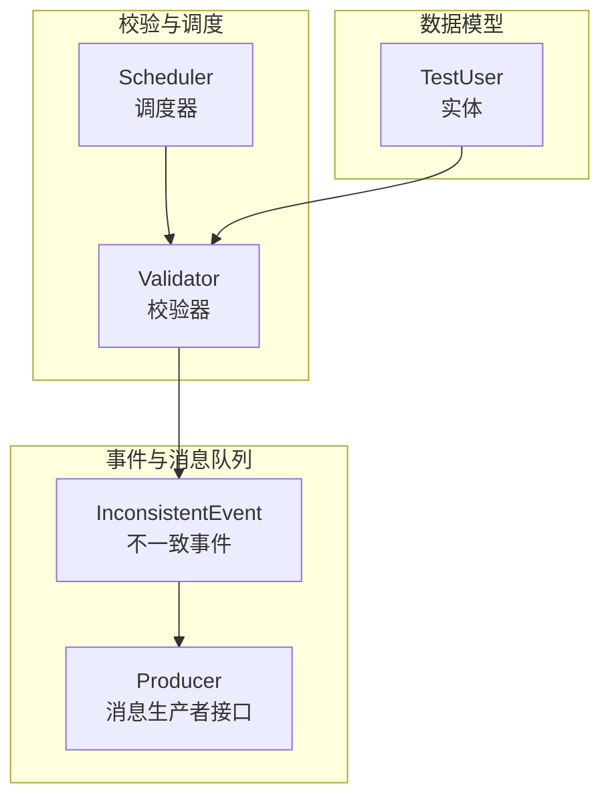
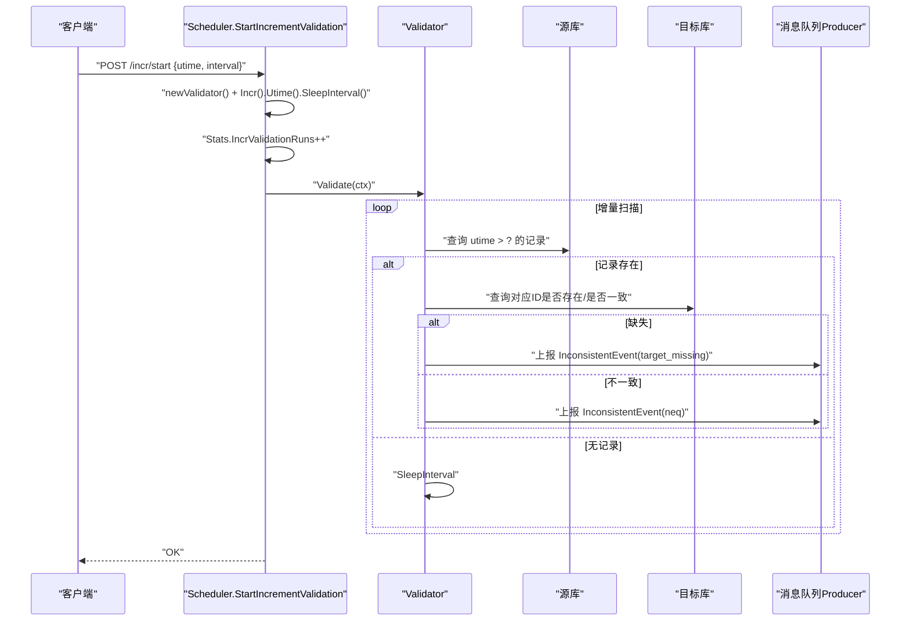
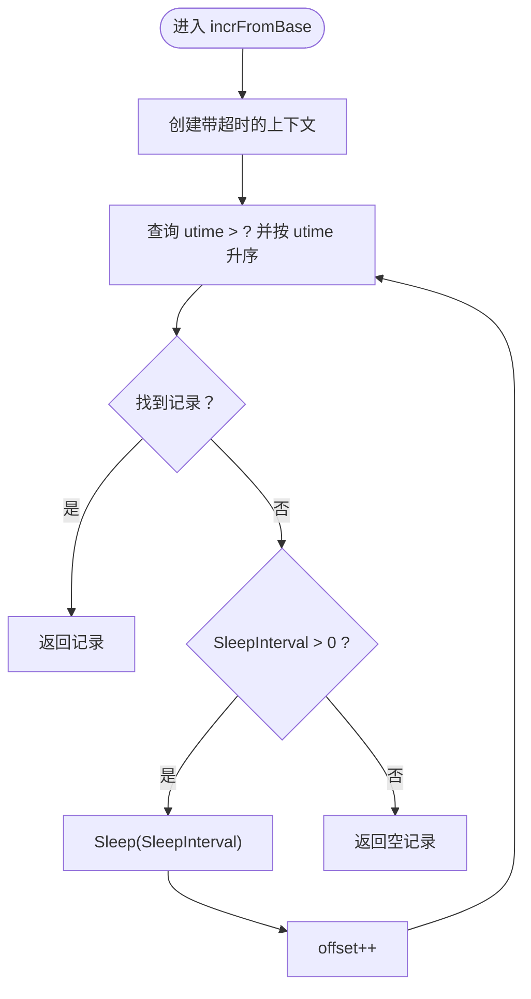
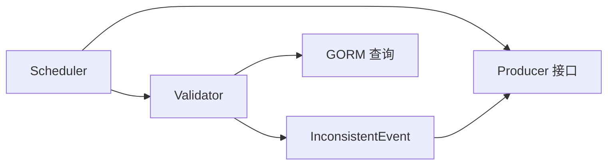

# 增量校验机制

<cite>
**本文引用的文件列表**
- [validator.go](file://DBx/mysqlX/gormx/dbMovex/myMovex/validator/validator.go)
- [scheduler.go](file://DBx/mysqlX/gormx/dbMovex/myMovex/scheduler/scheduler.go)
- [inconsistent.go](file://DBx/mysqlX/gormx/dbMovex/myMovex/events/inconsistent.go)
- [structTest.go](file://DBx/mysqlX/gormx/dbMovex/myMovex/events/structTest.go)
- [producer_test.go](file://DBx/mysqlX/gormx/dbMovex/myMovex/messageQueue/producer/producer_test.go)
- [types.go](file://channelx/mqX/types.go)
- [help_doc.txt](file://DBx/mysqlX/gormx/dbMovex/myMovex/help_doc.txt)
- [scheduler_test.go](file://DBx/mysqlX/gormx/dbMovex/myMovex/scheduler/scheduler_test.go)
</cite>

## 目录
1. [引言](#引言)
2. [项目结构](#项目结构)
3. [核心组件](#核心组件)
4. [架构总览](#架构总览)
5. [详细组件分析](#详细组件分析)
6. [依赖关系分析](#依赖关系分析)
7. [性能考量](#性能考量)
8. [故障排查指南](#故障排查指南)
9. [结论](#结论)
10. [附录](#附录)

## 引言
本文围绕增量校验机制展开，聚焦以下关键点：
- StartIncrementValidation 如何接收 Utime 时间戳参数并启动基于时间的增量校验任务
- Incr() 与 Utime() 如何配置校验器从指定时间点开始比对数据
- incrFromBase 函数如何通过 utime > ? 条件查询源库新增或修改的记录，并结合 SleepInterval 实现轮询机制
- 校验器如何检测目标库缺失或不一致的数据条目，并通过消息队列上报 InconsistentEvent 事件
- cancelIncr 如何实现 goroutine 的优雅终止，以及 Stats.IncrValidationRuns 计数器的递增时机
- 配置参数说明、典型使用场景示例及处理高频率写入场景的调优建议

## 项目结构
与增量校验直接相关的模块位于 DBx/mysqlX/gormx/dbMovex/myMovex 目录下，涉及校验器、调度器、事件与消息队列等组件；同时，消息队列抽象位于 channelx/mqX/types.go 中。

图表来源
- [scheduler.go](file://DBx/mysqlX/gormx/dbMovex/myMovex/scheduler/scheduler.go#L1-L120)
- [validator.go](file://DBx/mysqlX/gormx/dbMovex/myMovex/validator/validator.go#L1-L120)
- [inconsistent.go](file://DBx/mysqlX/gormx/dbMovex/myMovex/events/inconsistent.go#L1-L21)
- [types.go](file://channelx/mqX/types.go#L1-L34)
- [structTest.go](file://DBx/mysqlX/gormx/dbMovex/myMovex/events/structTest.go#L1-L36)

章节来源
- [help_doc.txt](file://DBx/mysqlX/gormx/dbMovex/myMovex/help_doc.txt#L1-L18)

## 核心组件
- 调度器 Scheduler：负责启动/停止增量校验、管理 goroutine 取消函数、维护统计信息
- 校验器 Validator：负责双向校验（源到目标、目标到源），基于时间戳增量扫描，上报不一致事件
- 事件与消息队列：定义不一致事件结构，通过 Producer 接口上报到消息队列
- 数据模型：以实体接口与 CompareTo 方法驱动一致性判断

章节来源
- [scheduler.go](file://DBx/mysqlX/gormx/dbMovex/myMovex/scheduler/scheduler.go#L1-L120)
- [validator.go](file://DBx/mysqlX/gormx/dbMovex/myMovex/validator/validator.go#L1-L120)
- [inconsistent.go](file://DBx/mysqlX/gormx/dbMovex/myMovex/events/inconsistent.go#L1-L21)
- [types.go](file://channelx/mqX/types.go#L1-L34)
- [structTest.go](file://DBx/mysqlX/gormx/dbMovex/myMovex/events/structTest.go#L1-L36)

## 架构总览
增量校验的端到端流程如下：
- 通过 HTTP 接口启动增量校验，传入 Utime 与 Interval
- 调度器创建校验器实例，设置 Incr 模式与 Utime，设置 SleepInterval
- 启动 goroutine，内部循环拉取源库增量记录，对比目标库，发现不一致或缺失即上报事件
- 支持优雅停止，通过 cancelIncr 取消上下文，使循环提前退出

图表来源
- [scheduler.go](file://DBx/mysqlX/gormx/dbMovex/myMovex/scheduler/scheduler.go#L217-L247)
- [validator.go](file://DBx/mysqlX/gormx/dbMovex/myMovex/validator/validator.go#L134-L172)
- [inconsistent.go](file://DBx/mysqlX/gormx/dbMovex/myMovex/events/inconsistent.go#L1-L21)
- [types.go](file://channelx/mqX/types.go#L1-L34)

## 详细组件分析

### StartIncrementValidation：启动基于时间的增量校验
- 接收请求体 StartIncrRequest，包含 Utime 与 Interval
- 加锁保护，取消上一次增量校验 goroutine
- 创建校验器，设置 Incr 模式、Utime、SleepInterval
- 增加统计计数器 IncrValidationRuns
- 启动 goroutine，创建带取消的上下文，调用 Validate 执行增量校验
- 停止接口 StopIncrementValidation 通过 cancelIncr 触发优雅退出

章节来源
- [scheduler.go](file://DBx/mysqlX/gormx/dbMovex/myMovex/scheduler/scheduler.go#L217-L247)
- [scheduler.go](file://DBx/mysqlX/gormx/dbMovex/myMovex/scheduler/scheduler.go#L207-L215)
- [scheduler_test.go](file://DBx/mysqlX/gormx/dbMovex/myMovex/scheduler/scheduler_test.go#L152-L185)

### Incr() 与 Utime()：配置增量校验起点
- Incr() 将校验器切换到增量模式，fromBase 使用 incrFromBase
- Utime() 设置增量起点时间戳，作为查询条件 utime > ?
- SleepInterval() 设置每次无记录时的轮询间隔

章节来源
- [validator.go](file://DBx/mysqlX/gormx/dbMovex/myMovex/validator/validator.go#L134-L172)

### incrFromBase：基于时间戳的增量扫描
- 使用 Where("utime > ?", utime) 与 Order("utime") 顺序扫描源库
- 每次查询带超时上下文，避免阻塞
- 通过 Offset 控制分页游标，配合 SleepInterval 实现轮询

图表来源
- [validator.go](file://DBx/mysqlX/gormx/dbMovex/myMovex/validator/validator.go#L163-L172)

章节来源
- [validator.go](file://DBx/mysqlX/gormx/dbMovex/myMovex/validator/validator.go#L163-L172)

### 双向校验与不一致检测
- 源到目标校验：从源库按增量游标取记录，按 ID 查询目标库，若不存在或不一致则上报事件
- 目标到源校验：从目标库按 ID 升序批量取记录，查询源库是否存在，缺失则上报事件；同时计算差集上报缺失事件

章节来源
- [validator.go](file://DBx/mysqlX/gormx/dbMovex/myMovex/validator/validator.go#L80-L132)
- [validator.go](file://DBx/mysqlX/gormx/dbMovex/myMovex/validator/validator.go#L174-L232)

### 消息队列上报 InconsistentEvent
- 事件结构包含 ID、Direction、Type
- 校验器通过 Producer 接口发送消息，Topic 由调度器配置
- 发送失败会记录错误日志

章节来源
- [inconsistent.go](file://DBx/mysqlX/gormx/dbMovex/myMovex/events/inconsistent.go#L1-L21)
- [validator.go](file://DBx/mysqlX/gormx/dbMovex/myMovex/validator/validator.go#L234-L255)
- [types.go](file://channelx/mqX/types.go#L1-L34)
- [producer_test.go](file://DBx/mysqlX/gormx/dbMovex/myMovex/messageQueue/producer/producer_test.go#L1-L53)

### cancelIncr 与优雅终止
- StartIncrementValidation 内部创建新的 cancelIncr，并在 goroutine 启动前取消上一次的 cancelIncr
- Validate 循环中对 context 的取消/超时进行判断，确保 goroutine 可提前退出
- StopIncrementValidation 直接调用 cancelIncr 触发优雅终止

章节来源
- [scheduler.go](file://DBx/mysqlX/gormx/dbMovex/myMovex/scheduler/scheduler.go#L217-L247)
- [scheduler.go](file://DBx/mysqlX/gormx/dbMovex/myMovex/scheduler/scheduler.go#L207-L215)
- [validator.go](file://DBx/mysqlX/gormx/dbMovex/myMovex/validator/validator.go#L80-L132)

### Stats.IncrValidationRuns 计数器递增时机
- 在 StartIncrementValidation 中，成功创建校验器后立即递增 IncrValidationRuns
- 该计数器用于统计增量校验启动次数，便于运维观察

章节来源
- [scheduler.go](file://DBx/mysqlX/gormx/dbMovex/myMovex/scheduler/scheduler.go#L231-L236)

## 依赖关系分析
- Scheduler 依赖 Validator、Producer、DoubleWritePool（通过 newValidator 选择方向）
- Validator 依赖 GORM 查询、消息队列 Producer 接口、事件类型
- 事件类型与消息队列抽象相互独立，通过 Producer 接口解耦

图表来源
- [scheduler.go](file://DBx/mysqlX/gormx/dbMovex/myMovex/scheduler/scheduler.go#L289-L300)
- [validator.go](file://DBx/mysqlX/gormx/dbMovex/myMovex/validator/validator.go#L1-L120)
- [inconsistent.go](file://DBx/mysqlX/gormx/dbMovex/myMovex/events/inconsistent.go#L1-L21)
- [types.go](file://channelx/mqX/types.go#L1-L34)

## 性能考量
- 增量扫描的 SleepInterval 用于降低 CPU 占用与数据库压力，建议根据写入频率动态调整
- 分页游标 Offset 与 Order("utime") 需要索引支持，避免全表扫描
- 目标到源校验采用批量查询与差集计算，batchSize 可根据目标库负载调优
- 上报消息采用异步 Producer，建议结合消息队列吞吐能力与延迟要求配置 BatchSize/BatchTimeout

[本节提供一般性指导，无需特定文件引用]

## 故障排查指南
- 增量校验未生效
  - 检查是否正确调用 Incr().Utime().SleepInterval()，确认 Utime 是否早于当前时间
  - 确认 SleepInterval 设置合理，避免过短导致频繁轮询
- 目标库缺失或不一致未上报
  - 检查 Producer 是否可用，Topic 是否正确
  - 查看日志中“发送不一致数据消息失败”相关错误
- goroutine 无法停止
  - 确认 StopIncrementValidation 已调用，cancelIncr 是否被正确保存与调用
  - 检查 Validate 循环中对 context 的取消处理

章节来源
- [validator.go](file://DBx/mysqlX/gormx/dbMovex/myMovex/validator/validator.go#L241-L255)
- [scheduler.go](file://DBx/mysqlX/gormx/dbMovex/myMovex/scheduler/scheduler.go#L207-L215)

## 结论
增量校验通过时间戳驱动的增量扫描与双向一致性比对，结合消息队列事件上报与优雅的 goroutine 终止机制，实现了对高频率写入场景的稳健监控。通过合理配置 SleepInterval、批量大小与 Producer 参数，可在保证实时性的前提下降低系统开销。

[本节为总结性内容，无需特定文件引用]

## 附录

### 配置参数说明
- StartIncrRequest
  - utime：增量校验起始时间戳（毫秒）
  - interval：轮询间隔（毫秒）
- SchedulerConfig
  - default_sleep_interval：默认睡眠间隔
  - max_validation_errors：最大允许的校验错误数
  - enable_auto_promotion：是否启用自动升级
  - validation_timeout：校验超时
- ProducerConfig（消息队列）
  - batch_size：批量大小
  - batch_timeout：批量超时
  - async：是否异步发送

章节来源
- [scheduler.go](file://DBx/mysqlX/gormx/dbMovex/myMovex/scheduler/scheduler.go#L70-L101)
- [scheduler.go](file://DBx/mysqlX/gormx/dbMovex/myMovex/scheduler/scheduler.go#L438-L447)
- [producer_test.go](file://DBx/mysqlX/gormx/dbMovex/myMovex/messageQueue/producer/producer_test.go#L1-L53)

### 典型使用场景示例
- 启动增量校验
  - 请求体包含 utime 与 interval
  - 调用 /incr/start 接口，随后通过 /incr/stop 停止
- 验证统计
  - 通过 /stats 或 /status 获取 IncrValidationRuns 与当前状态

章节来源
- [scheduler_test.go](file://DBx/mysqlX/gormx/dbMovex/myMovex/scheduler/scheduler_test.go#L152-L185)
- [scheduler.go](file://DBx/mysqlX/gormx/dbMovex/myMovex/scheduler/scheduler.go#L302-L348)

### 处理高频率写入的调优建议
- 适当增大 SleepInterval，减少轮询频率
- 优化数据库索引（utime、id），提升查询效率
- 调整 batch_size 与 batch_timeout，平衡延迟与吞吐
- 对 Producer 进行异步发送与批量聚合，避免阻塞校验循环

[本节提供一般性指导，无需特定文件引用]